## **AutoMapper در سی شارپ با مثال**

در این مقاله، من **AutoMapper را در سی شارپ** با مثال‌هایی مورد بحث قرار خواهم داد. در پایان این مقاله، شما درک بسیار خوبی از اشاره‌گرهای زیر خواهید داشت.

1. **چرا در سی شارپ به AutoMapper نیاز داریم؟**
2. **نگاشت شیء در رویکرد سنتی در سی شارپ**
3. **AutoMapper در سی شارپ چیست؟**
4. **چگونه از AutoMapper در سی شارپ استفاده کنیم؟**
5. **اگر نام‌های ویژگی مبدا و مقصد متفاوت باشند، چه اتفاقی می‌افتد؟**
6. **چگونه می‌توان با استفاده از AutoMapper، ویژگی‌هایی را که نام‌های متفاوتی دارند، نگاشت کرد؟**
7. **مزایا و معایب استفاده از AutoMapper در سی شارپ**
8. **چه زمانی از AutoMapper در سی شارپ استفاده کنیم؟**

##### **چرا در سی شارپ به AutoMapper نیاز داریم؟**

بیایید با یک مثال بفهمیم که چرا به Automapper در سی شارپ نیاز داریم. فرض کنید دو کلاس زیر را داریم: **Employee** و **EmployeeDTO** . ابتدا یک فایل کلاس با نام **Employee.cs** ایجاد کنید و سپس کد زیر را کپی و در آن قرار دهید. این یک کلاس بسیار ساده است که دارای 4 ویژگی (property) می‌باشد.

```csharp
namespace AutoMapperDemo
{
    public class Employee
    {
        public string Name { get; set; }
        public int Salary { get; set; }
        public string Address { get; set; }
        public string Department { get; set; }
    }
}
```

سپس، یک فایل کلاس دیگر با نام EmployeeDTO.cs ایجاد کنید و سپس کد زیر را در آن کپی و جایگذاری کنید. این کلاس مشابه کلاس Employee است، یعنی دارای ۴ ویژگی (property) می‌باشد.

```csharp
namespace AutoMapperDemo
{
    public class EmployeeDTO
    {
        public string Name { get; set; }
        public int Salary { get; set; }
        public string Address { get; set; }
        public string Department { get; set; }
    }
}
```

حال، نیاز کاری ما کپی کردن داده‌ها یا انتقال داده‌ها از **شیء Employee** به **شیء EmployeeDTO** است . در رویکرد سنتی (بدون استفاده از Automapper)، ابتدا باید شیء Employee را ایجاد و در آن قرار دهیم، همانطور که در تصویر زیر نشان داده شده است.

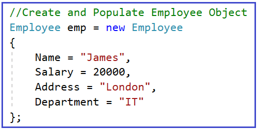

زمانی که شیء کارمند را ایجاد کردید، باید **شیء EmployeeDTO** را ایجاد کنید و داده‌ها را از شیء Employee به شیء EmployeeDTO کپی کنید، همانطور که در تصویر زیر نشان داده شده است.

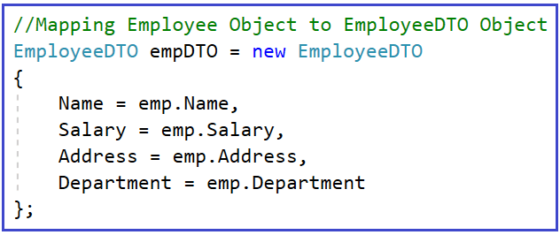

##### **نگاشت شیء در رویکرد سنتی در سی شارپ**

بیایید بفهمیم که چگونه یک شیء با استفاده از رویکرد سنتی در C# به شیء دیگری نگاشت می‌شود. برای درک بهتر، لطفاً به مثال زیر نگاهی بیندازید. ابتدا، یک نمونه از شیء Employee ایجاد می‌کنیم و چهار ویژگی را با داده‌های مورد نیاز پر می‌کنیم. سپس، یک نمونه از کلاس EmployeeDTO ایجاد می‌کنیم و ویژگی‌های EmployeeDTO را با مقادیر شیء Employee پر می‌کنیم. در نهایت، مقادیر شیء EmployeeDTO را نمایش می‌دهیم.

```csharp
using System;

namespace AutoMapperDemo
{
    class Program
    {
        static void Main(string[] args)
        {
            // Create and Populate Employee Object
            Employee emp = new Employee
            {
                Name = "James",
                Salary = 20000,
                Address = "London",
                Department = "IT"
            };

            // Mapping Employee Object to EmployeeDTO Object
            EmployeeDTO empDTO = new EmployeeDTO
            {
                Name = emp.Name,
                Salary = emp.Salary,
                Address = emp.Address,
                Department = emp.Department
            };

            Console.WriteLine("Name:" + empDTO.Name + ", Salary:" + empDTO.Salary + ", Address:" + empDTO.Address + ", Department:" + empDTO.Department);
            Console.ReadLine();
        }
    }
}
```

اگر برنامه را اجرا کنید، خروجی مطابق انتظار دریافت خواهید کرد. اما فردا، اگر داده‌ها، یعنی ویژگی‌های کلاس‌های Employee و EmployeeDTO، افزایش یابند، چه خواهید کرد؟ سپس، باید کد انتقال داده‌ها را برای هر ویژگی از کلاس مبدا به کلاس مقصد بنویسید. این بدان معناست که نگاشت کد بین منبع و مقصد تکرار می‌شود. باز هم، اگر نگاشت یکسانی در مکان‌های مختلف باشد، باید تغییرات را در مکان‌های مختلف اعمال کنید که زمان‌بر و مستعد خطا است.

در پروژه‌های بلادرنگ، اغلب نیاز داریم که اشیاء را بین لایه رابط کاربری یا لایه ارائه و لایه منطق کسب‌وکار نگاشت کنیم. نگاشت اشیاء بین آنها با استفاده از رویکرد سنتی فوق‌الذکر بسیار زمان‌بر است. بنابراین، آیا ساده‌ترین راه‌حلی وجود دارد که بتوانیم دو شیء را نگاشت کنیم؟ بله، وجود دارد و راه‌حل **AutoMapper** است .

##### **AutoMapper در سی شارپ چیست؟**

AutoMapper یک کتابخانه متن‌باز محبوب در سی‌شارپ است که نگاشت داده‌ها بین کلاس‌ها یا اشیاء مختلف را ساده می‌کند. این کتابخانه به حذف کدهای تکراری و مستعد خطا هنگام کپی کردن داده‌ها از یک شیء به شیء دیگر کمک می‌کند. AutoMapper به ویژه در سناریوهایی مانند نگاشت موجودیت‌های پایگاه داده به DTOها (اشیاء انتقال داده) یا اشیاء ViewModel مفید است.

AutoMapper در سی شارپ یک نگاشت دهنده بین دو شیء است. به عبارت دیگر، AutoMapper یک نگاشت دهنده شیء-شیء است. این نگاشت دهنده، ویژگی‌های دو شیء مختلف را با تبدیل شیء ورودی از یک نوع به شیء خروجی از نوع دیگر، نگاشت می‌کند.

##### **چگونه از AutoMapper در سی شارپ استفاده کنیم؟**

بیایید با یک مثال نحوه استفاده از AutoMapper در سی شارپ را درک کنیم. ما همان شیء Employee را با شیء EmployeeDTO که در مثال اول مورد بحث قرار دادیم، نگاشت خواهیم کرد. باید هر **ویژگی Employee را** مربوطه نگاشت کنیم. **با استفاده از AutoMapper به ویژگی EmployeeDTO** همانطور که در تصویر زیر نشان داده شده است،

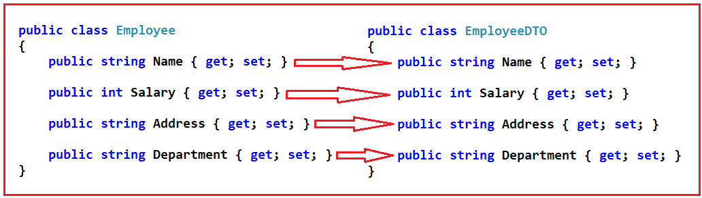

بیایید روش گام به گام استفاده از AutoMapper در سی شارپ را مورد بحث قرار دهیم.

###### **مرحله 1: نصب کتابخانه AutoMapper در پروژه شما**

AutoMapper یک کتابخانه متن‌باز است که در [**GitHub**](https://github.com/AutoMapper) موجود است . برای نصب این کتابخانه، پنجره Package Manager Console را باز کنید. برای باز کردن پنجره Package Manager Console، همانطور که در تصویر زیر نشان داده شده است، از منوی زمینه، Tools => NuGet Package Manager => Package Manager Console را انتخاب کنید.

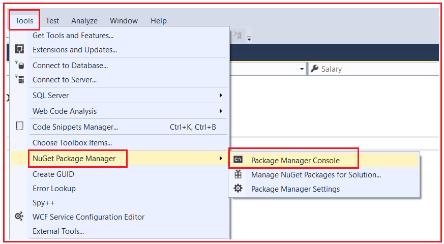

پس از باز کردن پنجره Package Manager Console، دستور **Install-Package AutoMapper را** تایپ کرده و کلید enter را فشار دهید تا کتابخانه AutoMapper در پروژه شما نصب شود، همانطور که در تصویر زیر نشان داده شده است.

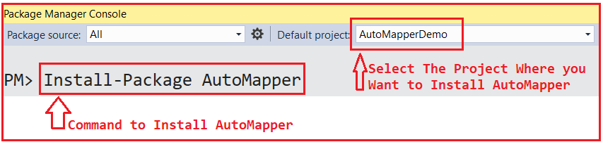

**نکته:** اگر هنگام نصب AutoMapper با خطایی مواجه شدید، سعی کنید نسخه پایین‌تر AutoMapper را که با نسخه .NET Framework شما سازگار است، نصب کنید. من با .NET Framework 4.8 کار می‌کنم و نسخه AutoMapper 10.1.1 را نصب می‌کنم که با .NET Framework 4.8 سازگار است.

پس از نصب **کتابخانه AutoMapper** اضافه می‌شود **در پروژه خود، یک ارجاع به فایل AutoMapper.DLL** که می‌توانید آن را در بخش ارجاعات پروژه، همانطور که در تصویر زیر نشان داده شده است، پیدا کنید.

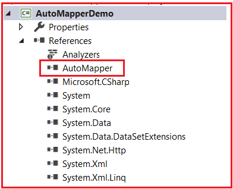

##### **مرحله ۲: پیکربندی و مقداردهی اولیه AutoMapper در سی شارپ**

در مرحله دوم، باید AutoMapper را برای پروژه خود پیکربندی و مقداردهی اولیه کنیم. پس از تعریف انواع (یعنی کلاس‌هایی که قرار است توسط AutoMapper نگاشت شوند، در مثال ما، پس از تعریف کلاس‌های Employee و EmployeeDTO)، باید Mapping را برای دو نوع با استفاده از سازنده **کلاس MapperConfiguration** پیکربندی کنیم .

باید به خاطر داشته باشید که **به ازای هر AppDomain فقط می‌توانید یک نمونه MapperConfiguration** ایجاد کنید و این نمونه باید در هنگام راه‌اندازی برنامه نمونه‌سازی شود. سینتکس ایجاد نمونه MapperConfiguration در زیر آمده است. در اینجا، باید Mapper Configuration را با استفاده از Lambda Expression ارائه دهیم و انواع Source و Destination را با استفاده از متد Generic CreateMap تعریف کنیم.

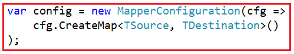

نوع سمت چپ، نوع منبع، یعنی **TSource است.** می‌رود **در مثال ما، به شیء Employee** و نوع سمت راست، نوع مقصد، یعنی **TDestination، است.** می‌رود **در مثال ما، به شیء EmployeeDTO** . بنابراین، برای نگاشت **Employee** با **شیء EmployeeDTO** ، باید نمونه پیکربندی نگاشت‌کننده را به شرح زیر ایجاد کنید.

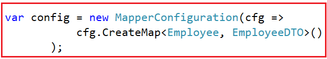

زمانی که نمونه MapperConfiguration را ایجاد کردیم که در آن Mappingها را پیکربندی می‌کنیم، باید Mapper را مقداردهی اولیه کنیم. برای مقداردهی اولیه Mapper، کاری که باید انجام دهیم این است که MapperConfiguration را به سازنده کلاس Mapper ارسال کنیم، همانطور که در تصویر زیر نشان داده شده است.

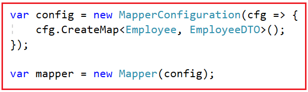

بنابراین، کاری که قرار است انجام دهیم این است که یک کلاس جداگانه ایجاد می‌کنیم که در آن تمام پیکربندی‌های نگاشت خود را انجام خواهیم داد. بنابراین، یک فایل کلاس به نام **MapperConfig.cs** ایجاد کنید و کد زیر را کپی و جایگذاری کنید. در کلاس زیر، یک متد داریم که در آن نگاشت‌های مورد نیاز را پیکربندی کرده و Mapper را مقداردهی اولیه می‌کنیم. همچنین نمونه Mapper را برمی‌گردانیم که با استفاده از آن نگاشت را انجام خواهیم داد. در اینجا، از متد عمومی CreateMap استفاده می‌کنیم و انواع منبع و مقصد را مشخص می‌کنیم. در اینجا، نوع منبع Employee و نوع مقصد EmployeeDTO است، یعنی ما شیء Employee را با شیء EmployeeDTO با استفاده از AutoMapper نگاشت می‌کنیم.

```csharp
using AutoMapper;

namespace AutoMapperDemo
{
    public class MapperConfig
    {
        public static IMapper InitializeAutomapper()
        {
            // Provide all the Mapping Configuration
            var config = new MapperConfiguration(cfg =>
            {
                // Configuring Employee and EmployeeDTO
                cfg.CreateMap<Employee, EmployeeDTO>();
                // Any Other Mapping Configuration ....
            });

            // Create an Instance of Mapper and return that Instance
            var mapper = config.CreateMapper();
            return mapper;
        }
    }
}
```

###### **مرحله 3: استفاده از AutoMapper در سی شارپ:**

پس از پیکربندی پیکربندی‌های نگاشت، یعنی پیکربندی انواع منبع و مقصد، می‌توانیم از آن پیکربندی نگاشت برای نگاشت اشیاء منبع و مقصد استفاده کنیم. ما باید از نمونه Mapper ایجاد شده در مرحله قبل استفاده کنیم. بنابراین، باید متد استاتیک InitializeAutomapper را با استفاده از نام کلاس MapperConfig فراخوانی کنیم که نمونه Mapper را برمی‌گرداند. پس از اینکه نمونه Mapper را داشتیم، با استفاده از متد Map از نمونه Mapper، می‌توانیم اشیاء Source و Destination را به دو روش ارائه دهیم که در تصویر زیر نشان داده شده است.

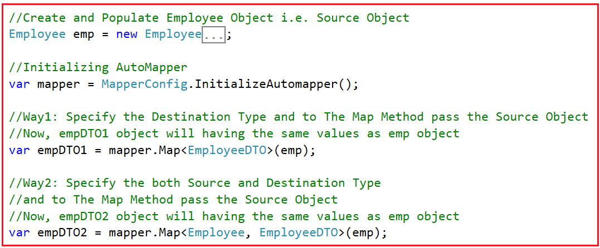

برای درک بهتر، متد Main کلاس Program را به صورت زیر تغییر دهید. در اینجا، ما شیء Employee منبع را با شیء EmployeeDTO مقصد با استفاده از AutoMapper در C# نگاشت می‌کنیم. کد مثال زیر خود گویای همه چیز است.

```csharp
using System;

namespace AutoMapperDemo
{
    class Program
    {
        static void Main(string[] args)
        {
            // Create and Populate Employee Object i.e. Source Object
            Employee emp = new Employee
            {
                Name = "James",
                Salary = 20000,
                Address = "London",
                Department = "IT"
            };

            // Initializing AutoMapper
            var mapper = MapperConfig.InitializeAutomapper();

            // Way1: Specify the Destination Type and to The Map Method pass the Source Object
            // Now, empDTO1 object will having the same values as emp object
            var empDTO1 = mapper.Map<EmployeeDTO>(emp);

            // Way2: Specify the both Source and Destination Type
            // and to The Map Method pass the Source Object
            // Now, empDTO2 object will having the same values as emp object
            var empDTO2 = mapper.Map<Employee, EmployeeDTO>(emp);

            Console.WriteLine("Name: " + empDTO1.Name + ", Salary: " + empDTO1.Salary + ", Address: " + empDTO1.Address + ", Department: " + empDTO1.Department);
            Console.ReadLine();
        }
    }
}
```

**خروجی: نام: جیمز، حقوق: ۲۰۰۰۰، آدرس: لندن، دپارتمان: فناوری اطلاعات**

##### **اگر نام‌های ویژگی مبدا و مقصد متفاوت باشند، چه اتفاقی می‌افتد؟**

بیایید این موضوع را با یک مثال درک کنیم. بیایید نام ویژگی‌های کلاس Destination را تغییر دهیم. بیایید **EmployeeDTO** نام ویژگی‌های کلاس **را تغییر دهید. ویژگی Name** را به **FullName** و **ویژگی Department** را به **Dept** تغییر دهید . بنابراین، کلاس EmployeeDTO را به صورت زیر اصلاح کنید.

```csharp
namespace AutoMapperDemo
{
    public class EmployeeDTO
    {
        public string FullName { get; set; }
        public int Salary { get; set; }
        public string Address { get; set; }
        public string Dept { get; set; }
    }
}
```

در مرحله بعد، متد Main از کلاس Program را به صورت زیر تغییر دهید تا از نام‌های جدید ویژگی‌ها هنگام نمایش مقادیر استفاده کند.

```csharp
using System;

namespace AutoMapperDemo
{
    class Program
    {
        static void Main(string[] args)
        {
            // Create and Populate Employee Object i.e. Source Object
            Employee emp = new Employee
            {
                Name = "James",
                Salary = 20000,
                Address = "London",
                Department = "IT"
            };

            // Initializing AutoMapper
            var mapper = MapperConfig.InitializeAutomapper();

            // Way1: Specify the Destination Type and to The Map Method pass the Source Object
            // Now, empDTO1 object will having the same values as emp object
            var empDTO1 = mapper.Map<EmployeeDTO>(emp);

            // Way2: Specify the both Source and Destination Type
            // and to The Map Method pass the Source Object
            // Now, empDTO2 object will having the same values as emp object
            var empDTO2 = mapper.Map<Employee, EmployeeDTO>(emp);

            Console.WriteLine("Name:" + empDTO1.FullName + ", Salary:" + empDTO1.Salary + ", Address:" + empDTO1.Address + ", Department:" + empDTO1.Dept);
            Console.ReadLine();
        }
    }
}
```

با اعمال تغییرات فوق، اکنون برنامه را اجرا کنید و باید خروجی زیر را دریافت کنید.

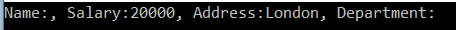

خروجی بالا به وضوح نشان می‌دهد که **Name** و **Department** خالی هستند، به این معنی که این دو ویژگی از نوع Source به نوع Destination نگاشت نشده‌اند. بنابراین، نکته‌ای که باید به خاطر داشته باشید این است که وقتی نام ویژگی‌ها در نوع Source و Destination متفاوت باشد، به طور پیش‌فرض، Automapper آن ویژگی‌ها را از شیء مبدا به شیء مقصد نگاشت نمی‌کند.

##### **چگونه می‌توان با استفاده از AutoMapper، ویژگی‌هایی را که نام‌های متفاوتی دارند، نگاشت کرد؟**

اگر نام‌های Property از نظر نوع Source و Destination متفاوت باشند، می‌توانید با استفاده از **گزینه ForMember** ، چنین Propertyهایی را در AutoMapper نگاشت کنید . بنابراین، برای نگاشت **Property Name** از شیء Source با **Property FullName** از شیء Destination و **Property Department** از شیء Source با **Property Dept** از شیء Destination، باید پیکربندی نگاشت را برای این دو Property در پیکربندی نگاشت ارائه دهیم. بنابراین، فایل کلاس MapperConfig را برای ارائه چنین پیکربندی‌های نگاشت Property اصلاح کنید. در مقالات آینده، گزینه‌های ForMember و MapForm را به تفصیل مورد بحث قرار خواهیم داد .

```csharp
using AutoMapper;

namespace AutoMapperDemo
{
    public class MapperConfig
    {
        public static IMapper InitializeAutomapper()
        {
            // Provide all the Mapping Configuration
            var config = new MapperConfiguration(cfg =>
            {
                // Configuring Employee and EmployeeDTO
                cfg.CreateMap<Employee, EmployeeDTO>()

                // Provide Mapping Configuration of FullName and Name Property
                .ForMember(dest => dest.FullName, act => act.MapFrom(src => src.Name))

                // Provide Mapping Dept of FullName and Department Property
                .ForMember(dest => dest.Dept, act => act.MapFrom(src => src.Department));

                // Any Other Mapping Configuration ....
            });

            // Create an Instance of Mapper and return that Instance
            var mapper = config.CreateMapper();
            return mapper;
        }
    }
}
```

با اعمال تغییرات فوق، اکنون برنامه را اجرا کنید و باید خروجی مورد انتظار را مشاهده کنید.

##### **مزایا و معایب استفاده از AutoMapper در سی شارپ**

استفاده از AutoMapper در سی شارپ می‌تواند مزایا و معایب مختلفی داشته باشد. مهم است که هر دو جنبه را در نظر بگیرید تا مشخص شود که آیا انتخاب مناسبی برای سناریوی شما است یا خیر.

##### **مزایای استفاده از AutoMapper:**

- **کاهش کدهای تکراری:** AutoMapper نیاز به نوشتن دستی کدهای تکراری (مانند انتساب خاصیت به خاصیت) برای نگاشت خاصیت‌ها از یک شیء به شیء دیگر را از بین می‌برد. این می‌تواند به طور قابل توجهی میزان کدی را که باید نگهداری کنید، کاهش دهد.
- **بهبود خوانایی و قابلیت نگهداری کد:** با کاهش کد برای مدیریت نگاشت اشیاء، کدبیس شما تمیزتر و نگهداری آن آسان‌تر می‌شود.
- **ثبات در نگاشت:** AutoMapper قوانین نگاشت ثابتی را در سراسر برنامه تضمین می‌کند و احتمال خطاهایی را که ممکن است در نگاشت‌های دستی رخ دهد، کاهش می‌دهد.
- **قابلیت‌های نگاشت سفارشی:** AutoMapper در حالی که نگاشت‌های ساده را خودکار می‌کند، امکان پیکربندی سفارشی برای نگاشت‌های پیچیده را نیز فراهم می‌کند و در صورت نیاز به شما انعطاف‌پذیری می‌دهد.
- **سهولت استفاده:** راه‌اندازی و استفاده از AutoMapper عموماً آسان است، به‌خصوص برای نگاشت‌های سرراست، که آن را به ابزاری مناسب برای توسعه سریع تبدیل می‌کند.
- **کاهش خطای انسانی:** نقشه‌برداری دستی اشیاء، به ویژه در پروژه‌های بزرگ و پیچیده، مستعد خطا است. AutoMapper این فرآیند را خودکار می‌کند و در نتیجه احتمال اشتباه را کاهش می‌دهد.

##### **معایب و ملاحظات استفاده از AutoMapper:**

- **سربار عملکرد:** AutoMapper می‌تواند سربار عملکرد ایجاد کند، به خصوص اگر به درستی پیکربندی نشده باشد. این می‌تواند در محیط‌های با کارایی بالا یا با منابع محدود، نگران‌کننده باشد.
- **پیچیدگی در اشکال‌زدایی:** اشکال‌زدایی با AutoMapper می‌تواند چالش‌برانگیزتر شود، به‌خصوص هنگام سروکار داشتن با نگاشت‌های پیچیده یا زمانی که پیکربندی نگاشت ساده نباشد.
- **منحنی یادگیری:** اگرچه استفاده از AutoMapper برای سناریوهای اولیه آسان است، اما تسلط بر ویژگی‌های پیشرفته و بهترین شیوه‌های آن می‌تواند به زمان قابل توجهی نیاز داشته باشد.
- **اتکای بیش از حد به قراردادها:** AutoMapper به شدت به قراردادهای نامگذاری متکی است. اگر اشیاء منبع و مقصد شما از یک قرارداد نامگذاری ثابت پیروی نمی‌کنند، باید پیکربندی‌های سفارشی بیشتری بنویسید.
- **پیچیدگی غیرضروری برای کارهای ساده:** برای سناریوهای بسیار ساده‌ی نگاشت اشیاء، استفاده از AutoMapper ممکن است زیاده‌روی باشد و نگاشت دستی می‌تواند سرراست‌تر و کارآمدتر باشد.

##### **چه زمانی از AutoMapper در سی شارپ استفاده کنیم؟**

شما باید در شرایط زیر استفاده از AutoMapper در سی شارپ را در نظر بگیرید:

- **پروژه‌های بزرگ با مدل‌های شیء پیچیده:** در برنامه‌های کاربردی در مقیاس بزرگ با مدل‌های دامنه پیچیده و اشیاء انتقال داده (DTO)، AutoMapper می‌تواند با خودکارسازی فرآیند نگاشت، در زمان و تلاش صرفه‌جویی قابل توجهی کند.
- **پروژه‌هایی با کد نگاشت تکراری:** اگر پروژه شما شامل کدهای نگاشت تکراری و خسته‌کننده زیادی است (مانند کپی کردن ویژگی‌ها از یک شیء به شیء دیگر)، AutoMapper می‌تواند به کاهش این کدهای تکراری کمک کند و کدبیس شما را تمیزتر و نگهداری آن را آسان‌تر کند.
- **چه زمانی ثبات در قوانین نگاشت مهم است:** AutoMapper به حفظ ثبات در قوانین نگاشت در سراسر برنامه شما کمک می‌کند. این امر به ویژه در محیط‌های تیمی یا پروژه‌های بزرگ که در آن‌ها توسعه‌دهندگان مختلف ممکن است نگاشت‌ها را به طور متناقض پیاده‌سازی کنند، مفید است.
- **عملیات CRUD در معماری لایه‌ای:** در برنامه‌هایی با تفکیک واضح وظایف، مانند برنامه‌های MVC، AutoMapper برای تبدیل داده‌ها بین لایه‌ها (مثلاً از اشیاء دسترسی به داده به اشیاء منطق تجاری یا اشیاء منطق تجاری به مدل‌های مشاهده) ارزشمند است.
- **چه زمانی به منطق نگاشت قابل تنظیم نیاز دارید:** AutoMapper فقط برای نگاشت‌های ساده نیست؛ بلکه امکان منطق نگاشت پیچیده و سفارشی را نیز فراهم می‌کند. این مورد زمانی مفید است که قوانین خاصی برای نحوه نگاشت یا تبدیل ویژگی‌های خاص داشته باشید.
- **در برنامه‌هایی که سرعت توسعه در اولویت است:** توسعه سریع برنامه می‌تواند از AutoMapper بهره‌مند شود، زیرا نوشتن و به‌روزرسانی کد مربوط به نگاشت اشیاء را سرعت می‌بخشد.

با این حال، سناریوهایی وجود دارد که در آنها AutoMapper ممکن است بهترین انتخاب نباشد:

- **برای پروژه‌های ساده:** اگر پروژه شما ساده است، نگاشت‌های کمی دارد، یا اگر نگاشت‌ها سرراست هستند، ممکن است هزینه سربار معرفی یک کتابخانه شخص ثالث توجیه‌پذیر نباشد.
- **برنامه‌های کاربردی با عملکرد حیاتی:** در برنامه‌های کاربردی حساس به عملکرد احتیاط کنید، زیرا AutoMapper می‌تواند مقداری سربار ایجاد کند، به خصوص اگر به طور بهینه پیکربندی نشده باشد.
- **چه زمانی کنترل صریح ترجیح داده می‌شود:** در مواردی که به کنترل صریح بر روی هر جنبه از نگاشت نیاز دارید یا آن را ترجیح می‌دهید، یا اگر می‌خواهید از انتزاع معرفی شده توسط AutoMapper اجتناب کنید، نگاشت دستی ممکن است انتخاب بهتری باشد.