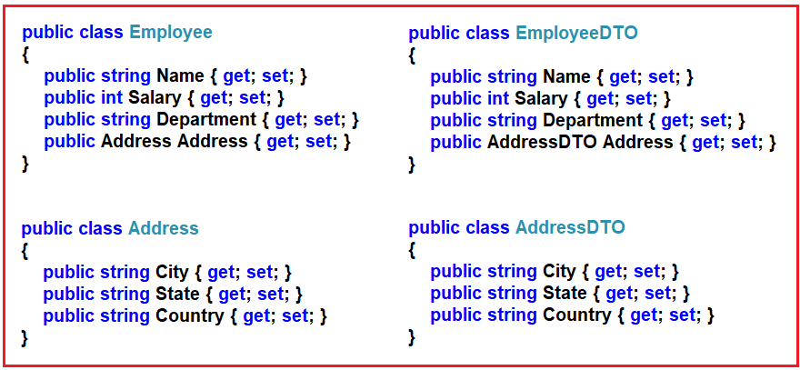
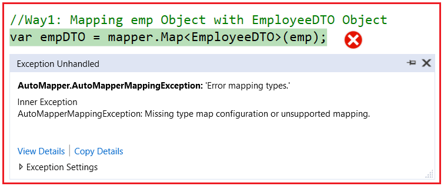
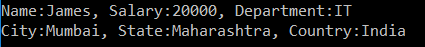
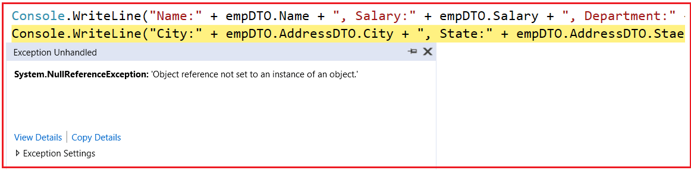
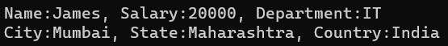
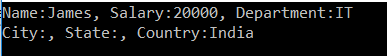
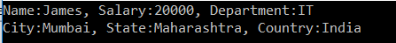

## **نگاشت پیچیده AutoMapper در سی شارپ به همراه مثال**

در این مقاله، قصد دارم به بررسی **نگاشت پیچیده AutoMapper در سی شارپ** به همراه مثال‌ها بپردازم. لطفاً قبل از ادامه این مقاله، مقاله قبلی ما را که در آن اصول اولیه AutoMapper در سی شارپ به همراه مثال‌ها را مورد بحث قرار دادیم، مطالعه کنید. در پایان این مقاله، شما خواهید فهمید که نگاشت پیچیده AutoMapper چیست و چه زمانی و چگونه می‌توان از نگاشت پیچیده AutoMapper در سی شارپ به همراه مثال‌ها استفاده کرد.

##### **چیست ؟** **نگاشت پیچیده AutoMapper در سی شارپ**

وقتی هر دو نوع (منبع و مقصد) که در نگاشت دخیل هستند، حاوی ویژگی‌های نوع پیچیده باشند، در چنین سناریوهایی باید از نگاشت پیچیده AutoMapper در C# استفاده کنیم **.** بیایید نگاشت پیچیده AutoMapper را با یک مثال درک کنیم. ما قصد داریم از چهار کلاس زیر برای این نسخه آزمایشی استفاده کنیم.



یک فایل کلاس با نام Address.cs ایجاد کنید و سپس کد زیر را در آن کپی و جایگذاری کنید.

```csharp
namespace AutoMapperDemo
{
    public class Address
    {
        public string City { get; set; }
        public string State { get; set; }
        public string Country { get; set; }
    }
}
```

یک فایل کلاس با نام Employee.cs ایجاد کنید و سپس کد زیر را در آن کپی و جایگذاری کنید.

```csharp
namespace AutoMapperDemo
{
    public class Employee
    {
        public string Name { get; set; }
        public int Salary { get; set; }
        public string Department { get; set; }
        public Address Address { get; set; }
    }
}
```

یک فایل کلاس با نام AddressDTO.cs ایجاد کنید و سپس کد زیر را در آن کپی و جایگذاری کنید.

```csharp
namespace AutoMapperDemo
{
    public class AddressDTO
    {
        public string City { get; set; }
        public string State { get; set; }
        public string Country { get; set; }
    }
}
```

یک فایل کلاس با نام EmployeeDTO.cs ایجاد کنید و سپس کد زیر را در آن کپی و جایگذاری کنید.

```csharp
namespace AutoMapperDemo
{
    public class EmployeeDTO
    {
        public string Name { get; set; }
        public int Salary { get; set; }
        public string Department { get; set; }
        public AddressDTO Address { get; set; }
    }
}
```

##### **مثالی برای درک نگاشت پیچیده AutoMapper در سی شارپ** :

نگاشت کنیم **نیاز ما این است که شیء Employee** را با **شیء EmployeeDTO** . برای ساده‌سازی این کار، در اینجا هر دو کلاس را با نام‌های ویژگی یکسان ایجاد کرده‌ایم. اما نکته‌ای که باید در نظر داشته باشیم این است که ما ویژگی address را به عنوان یک نوع پیچیده ایجاد کرده‌ایم. در مرحله بعد، یک فایل کلاس با نام **MapperConfig.cs** ایجاد می‌کنیم **ایجاد کنید و سپس کد زیر را در آن کپی و جایگذاری کنید. در اینجا، ما یک متد استاتیک به نام InitializeAutomapper** و درون این متد، تمام کد نگاشت را می‌نویسیم. همانطور که می‌بینید، در اینجا، ما Employee را با کلاس EmployeeDTO نگاشت می‌کنیم.

```csharp
using AutoMapper;

namespace AutoMapperDemo
{
    public class MapperConfig
    {
        public static IMapper InitializeAutomapper()
        {
            // Provide all the Mapping Configuration
            var config = new MapperConfiguration(cfg => {
                // Configuring Employee and EmployeeDTO
                cfg.CreateMap<Employee, EmployeeDTO>();
            });

            // Create an Instance of Mapper and return that Instance
            var mapper = config.CreateMapper();
            return mapper;
        }
    }
}
```

در مرحله بعد، متد Main از کلاس Program را به صورت زیر تغییر دهید. کد مثال زیر گویای همه چیز است، بنابراین لطفاً برای درک بهتر کد، به توضیحات داخل آن مراجعه کنید.

```csharp
using System;

namespace AutoMapperDemo
{
    class Program
    {
        static void Main(string[] args)
        {
            // Creating and Instance of Address Entity
            Address empAddres = new Address()
            {
                City = "Mumbai",
                State = "Maharashtra",
                Country = "India"
            };

            // Creating and Instance of Employee Entity
            Employee emp = new Employee
            {
                Name = "James",
                Salary = 20000,
                Department = "IT",
                Address = empAddres
            };

            // Initialize the AutoMapper
            var mapper = MapperConfig.InitializeAutomapper();

            // Way1: Mapping emp Object with EmployeeDTO Object
            var empDTO = mapper.Map<EmployeeDTO>(emp);

            // Way2: Mapping emp Object with EmployeeDTO Object
            // var empDTO = mapper.Map<Employee, EmployeeDTO>(emp);

            Console.WriteLine("Name:" + empDTO.Name + ", Salary:" + empDTO.Salary + ", Department:" + empDTO.Department);
            Console.WriteLine("City:" + empDTO.Address.City + ", State:" + empDTO.Address.State + ", Country:" + empDTO.Address.Country);
            Console.ReadLine();
        }
    }
}
```

حالا، وقتی برنامه را اجرا می‌کنید، خطای زمان اجرا زیر را دریافت خواهید کرد.



حال، اگر به خطای داخلی بروید و ویژگی پیام را بررسی کنید، به وضوح نشان می‌دهد که پیکربندی نوع نگاشت برای Address و AddresDTO وجود ندارد و پیام استثنا به صورت **“Missing type map configuration or unsupported mapping.\r\n\r\nMapping types:\r\nAddress -> AddressDTO\r\nAutoMapperDemo.Address -> AutoMapperDemo.AddressDTO” خواهد بود.**

دلیل این امر آن است که در پیکربندی نگاشتگر، نگاشتگر را برای Employee و EmployeeDTO مشخص کرده‌ایم، اما نگاشت را برای نوع Address و AddressDTO مشخص نکرده‌ایم.

##### **چگونه مشکل فوق را حل کنیم؟**

برای حل مشکل فوق، باید نگاشت بین Address و AddressDTO را به همراه نگاشت Employee و EmployeeDTO پیکربندی کنید. بنابراین، **متد InitializeAutomapper** از **کلاس MapperConfig** را به صورت زیر تغییر دهید.

```csharp
using AutoMapper;

namespace AutoMapperDemo
{
    public class MapperConfig
    {
        public static IMapper InitializeAutomapper()
        {
            // Provide all the Mapping Configuration
            var config = new MapperConfiguration(cfg => {
                // Configuring Address and AddressDTO
                cfg.CreateMap<Address, AddressDTO>();
                // Configuring Employee and EmployeeDTO
                cfg.CreateMap<Employee, EmployeeDTO>();
            });

            // Create an Instance of Mapper and return that Instance
            var mapper = config.CreateMapper();
            return mapper;
        }
    }
}
```

با اعمال تغییرات فوق، اکنون برنامه را اجرا کنید و سپس باید خروجی مورد انتظار را همانطور که در تصویر زیر نشان داده شده است، دریافت کنید.



##### **اگر نام ویژگی نوع پیچیده را تغییر دهیم چه اتفاقی می‌افتد؟**

بگذارید این را با یک مثال درک کنیم. همانطور که می‌بینید، ما آدرس ویژگی پیچیده را در کلاس EmplpyeeDTO داریم و در مورد کلاس Employee نیز همینطور است. بیایید آدرس نام ویژگی پیچیده را در EmployeeDTO به AddressDTO تغییر دهیم. بنابراین کلاس EmplpyeeDTO را به صورت زیر اصلاح می‌کنیم.

```csharp
namespace AutoMapperDemo
{
    public class EmployeeDTO
    {
        public string Name { get; set; }
        public int Salary { get; set; }
        public string Department { get; set; }
        public AddressDTO AddressDTO { get; set; }
    }
}
```

سپس، متد Main از کلاس Program را به صورت زیر تغییر دهید.

```csharp
using System;

namespace AutoMapperDemo
{
    class Program
    {
        static void Main(string[] args)
        {
            // Creating and Instance of Address Entity
            Address empAddres = new Address()
            {
                City = "Mumbai",
                State = "Maharashtra",
                Country = "India"
            };

            // Creating and Instance of Employee Entity
            Employee emp = new Employee
            {
                Name = "James",
                Salary = 20000,
                Department = "IT",
                Address = empAddres
            };

            // Initialize the AutoMapper
            var mapper = MapperConfig.InitializeAutomapper();

            // Way1: Mapping emp Object with EmployeeDTO Object
            var empDTO = mapper.Map<EmployeeDTO>(emp);

            // Way2: Mapping emp Object with EmployeeDTO Object
            // var empDTO = mapper.Map<Employee, EmployeeDTO>(emp);

            Console.WriteLine("Name:" + empDTO.Name + ", Salary:" + empDTO.Salary + ", Department:" + empDTO.Department);
            Console.WriteLine("City:" + empDTO.AddressDTO.City + ", State:" + empDTO.AddressDTO.State + ", Country:" + empDTO.AddressDTO.Country);
            Console.ReadLine();
        }
    }
}
```

حالا برنامه را اجرا کنید. باید خطای NullReferenceException زیر را به شما بدهد. دلیل این امر این است که Complex Property AddressDTO توسط AutoMapper از شیء Employee address Property مقداردهی اولیه نشده است. در نتیجه، مقدار پیش‌فرض نوع پیچیده NULL است و در یک شیء NULL، وقتی به هر ویژگی یا هر متدی دسترسی پیدا می‌کنیم، خطای NULL Reference Exception را دریافت خواهیم کرد که در تصویر زیر نشان داده شده است، زمانی که سعی می‌کنیم با استفاده از ویژگی پیچیده AddressDTO که مقدار آن NULL است به ویژگی City، State و Country دسترسی پیدا کنیم.



##### **چگونه مشکل فوق را حل کنیم؟**

برای حل مشکل فوق، باید **با استفاده از متد ForMember، ویژگی Address** از شیء Employee را به **ویژگی AddressDTO** از شیء EmployeeDTO در پیکربندی mapper نگاشت کنیم. برای انجام این کار، **متد InitializeAutomapper** از **کلاس MapperConfig** را به صورت زیر تغییر دهید.

```csharp
using AutoMapper;

namespace AutoMapperDemo
{
    public class MapperConfig
    {
        public static IMapper InitializeAutomapper()
        {
            // Provide all the Mapping Configuration
            var config = new MapperConfiguration(cfg => {
                // Configuring Address and AddressDTO
                cfg.CreateMap<Address, AddressDTO>();

                // Configuring Employee and EmployeeDTO
                cfg.CreateMap<Employee, EmployeeDTO>()
                // Provide Mapping Information for AddressDTO and address
                .ForMember(dest => dest.AddressDTO, act => act.MapFrom(src => src.Address));
            });

            // Create an Instance of Mapper and return that Instance
            var mapper = config.CreateMapper();
            return mapper;
        }
    }
}
```

با اعمال تغییرات فوق، اکنون برنامه را اجرا کنید و نتیجه‌ای مطابق انتظار، همانطور که در تصویر زیر نشان داده شده است، به شما خواهد داد.



##### **اگر نام ویژگی‌های نوع پیچیده متفاوت باشد چه اتفاقی می‌افتد؟**

بیایید این را با یک مثال درک کنیم. بیایید نام‌های ویژگی‌ها را در **کلاس AddressDTO** مطابق شکل زیر تغییر دهیم.

```csharp
namespace AutoMapperDemo
{
    public class AddressDTO
    {
        public string EmpCity { get; set; }
        public string EmpState { get; set; }
        public string Country { get; set; }
    }
}
```

سپس، متد Main از کلاس Program را به صورت زیر تغییر دهید.

```csharp
using System;

namespace AutoMapperDemo
{
    class Program
    {
        static void Main(string[] args)
        {
            // Creating and Instance of Address Entity
            Address empAddres = new Address()
            {
                City = "Mumbai",
                State = "Maharashtra",
                Country = "India"
            };

            // Creating and Instance of Employee Entity
            Employee emp = new Employee
            {
                Name = "James",
                Salary = 20000,
                Department = "IT",
                Address = empAddres
            };

            // Initialize the AutoMapper
            var mapper = MapperConfig.InitializeAutomapper();

            // Way1: Mapping emp Object with EmployeeDTO Object
            var empDTO = mapper.Map<EmployeeDTO>(emp);

            // Way2: Mapping emp Object with EmployeeDTO Object
            // var empDTO = mapper.Map<Employee, EmployeeDTO>(emp);

            Console.WriteLine("Name:" + empDTO.Name + ", Salary:" + empDTO.Salary + ", Department:" + empDTO.Department);
            Console.WriteLine("City:" + empDTO.AddressDTO.EmpCity + ", State:" + empDTO.AddressDTO.EmpState + ", Country:" + empDTO.AddressDTO.Country);
            Console.ReadLine();
        }
    }
}
```

وقتی برنامه را اجرا می‌کنید، هیچ خطایی به ما نمی‌دهد، اما **ویژگی شهر** و **ایالت** را همانطور که در خروجی زیر نشان داده شده است، نگاشت نمی‌کند.



دلیل این امر آن است که ما **شیء Address** را با **شیء AddressDTO** نگاشت نکرده‌ایم **نگاشت کرده‌ایم، اما ویژگی‌های City** و **State** را با **EmpCity** و **EmpState** ویژگی‌های تغییر دهیم . **. بیایید دو ویژگی فوق را نگاشت کنیم و ببینیم چه اتفاقی می‌افتد. برای نگاشت دو ویژگی فوق، باید متد InitializeAutomapper** از کلاس MapperConfig را به صورت زیر

```csharp
using AutoMapper;

namespace AutoMapperDemo
{
    public class MapperConfig
    {
        public static IMapper InitializeAutomapper()
        {
            // Provide all the Mapping Configuration
            var config = new MapperConfiguration(cfg => {
                // Configuring Address and AddressDTO
                cfg.CreateMap<Address, AddressDTO>()
                .ForMember(dest => dest.EmpCity, act => act.MapFrom(src => src.City))
                .ForMember(dest => dest.EmpState, act => act.MapFrom(src => src.State));

                // Configuring Employee and EmployeeDTO
                cfg.CreateMap<Employee, EmployeeDTO>()
                // Provide Mapping Information for AddressDTO and address
                .ForMember(dest => dest.AddressDTO, act => act.MapFrom(src => src.Address));
            });

            // Create an Instance of Mapper and return that Instance
            var mapper = config.CreateMapper();
            return mapper;
        }
    }
}
```

با اعمال تغییرات فوق، اکنون برنامه را اجرا کنید و خروجی مورد انتظار را همانطور که در تصویر زیر نشان داده شده است، دریافت خواهید کرد.

