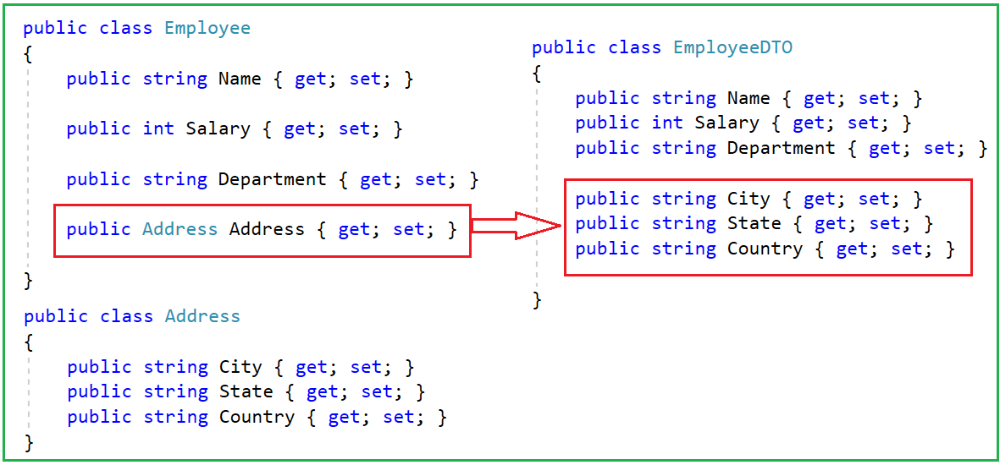
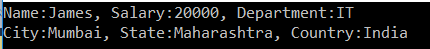
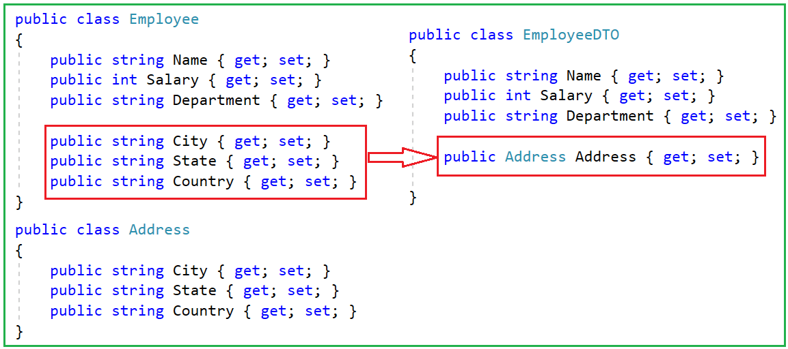
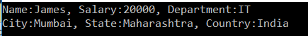

## **نحوه نگاشت نوع پیچیده به نوع اولیه با استفاده از AutoMapper در سی شارپ**

در این مقاله، قصد دارم **نحوه نگاشت نوع پیچیده به نوع اولیه با استفاده از AutoMapper در سی شارپ را** به همراه مثال بررسی کنم. لطفاً مقاله قبلی ما را که در آن به بررسی نگاشت پیچیده Automapper در سی شارپ به همراه مثال پرداختیم، مطالعه کنید. در پایان این مقاله، خواهید فهمید که چه زمانی و چگونه انواع پیچیده را با استفاده از AutoMapper به انواع اولیه نگاشت کنید.

##### **چه زمانی باید با استفاده از AutoMapper در سی شارپ، نوع پیچیده را به نوع اولیه نگاشت کنیم؟**

وقتی یک کلاس شامل انواع اولیه یا می‌توان گفت انواع ساده و کلاس دیگر شامل انواع پیچیده درگیر در نگاشت باشد، در چنین سناریوهایی باید نوع پیچیده را به انواع اولیه نگاشت کنیم. بیایید با یک مثال نحوه نگاشت نوع پیچیده به نوع اولیه را با استفاده از AutoMapper در C# درک کنیم. در این نسخه آزمایشی، ما از سه کلاس زیر (Employee، EmployeeDTO و Address) استفاده خواهیم کرد.



همانطور که در تصویر بالا نشان داده شده است، در اینجا می‌خواهیم ویژگی پیچیده **Address** از کلاس Employee را به **City، State و Country** ویژگی‌های **از کلاس EmployeeDTO** نگاشت کنیم . بنابراین، ابتدا یک فایل کلاس با نام Address.cs ایجاد کنید و سپس کد زیر را در آن کپی و جایگذاری کنید.

```csharp
namespace AutoMapperDemo
{
    public class Address
    {
        public string City { get; set; }
        public string State { get; set; }
        public string Country { get; set; }
    }
}
```

سپس، یک فایل کلاس با نام Employee.cs ایجاد کنید و سپس کد زیر را در آن کپی و جایگذاری کنید.

```csharp
namespace AutoMapperDemo
{
    public class Employee
    {
        public string Name { get; set; }
        public int Salary { get; set; }
        public string Department { get; set; }
        public Address Address { get; set; }
    }
}
```

در نهایت، یک فایل کلاس با نام EmployeeDTO.cs ایجاد کنید و سپس کد زیر را در آن کپی و جایگذاری کنید.

```csharp
namespace AutoMapperDemo
{
    public class EmployeeDTO
    {
        public string Name { get; set; }
        public int Salary { get; set; }
        public string Department { get; set; }
        public string City { get; set; }
        public string State { get; set; }
        public string Country { get; set; }
    }
}
```

##### **نگاشت نوع پیچیده به نوع اولیه با استفاده از AutoMapper در سی شارپ**

برای نگاشت نوع پیچیده به انواع اولیه، باید از متد ForMember از AutoMapper استفاده کنیم و همچنین باید ویژگی‌های منبع و هدف را مشخص کنیم. در اینجا، باید ویژگی‌های شهر، ایالت و کشور شیء Address را به ویژگی‌های شهر، ایالت و کشور کلاس EmployeeDTO نگاشت کنیم. بنابراین، یک فایل کلاس با نام **MapperConfig.cs** ایجاد کنید و سپس کد زیر را در آن کپی و جایگذاری کنید. در اینجا، ما یک متد استاتیک به نام **InitializeAutomapper** ایجاد می‌کنیم و درون این متد، تمام کد نگاشت را می‌نویسیم. همانطور که می‌بینید، در اینجا، ما ویژگی‌های شهر، ایالت و کشور شیء Address را به ویژگی‌های شهر، ایالت و کشور شیء EmployeeDTO نگاشت می‌کنیم.

```csharp
using AutoMapper;

namespace AutoMapperDemo
{
    public class MapperConfig
    {
        public static IMapper InitializeAutomapper()
        {
            // Provide all the Mapping Configuration
            var config = new MapperConfiguration(cfg => {
                // Configuring Employee and EmployeeDTO
                cfg.CreateMap<Employee, EmployeeDTO>()
                // Provide Mapping Information for City Property
                .ForMember(dest => dest.City, act => act.MapFrom(src => src.Address.City))
                // Provide Mapping Information for State Property
                .ForMember(dest => dest.State, act => act.MapFrom(src => src.Address.State))
                // Provide Mapping Information for Country Property
                .ForMember(dest => dest.Country, act => act.MapFrom(src => src.Address.Country));
            });

            // Create an Instance of Mapper Class and return that Instance
            var mapper = config.CreateMapper();
            return mapper;
        }
    }
}
```

همانطور که در کد بالا نشان داده شده است، ما هر ویژگی را از نوع پیچیده ( **Address** ) شیء منبع ( **Employee** ) به ویژگی‌های متناظر شیء مقصد ( **EmployeeDTO** ) نگاشت کردیم. در مرحله بعد، متد Main کلاس Program را به صورت زیر تغییر دهید.

```csharp
using System;

namespace AutoMapperDemo
{
    class Program
    {
        static void Main(string[] args)
        {
            // Creating an Instance of Address Entity
            Address empAddres = new Address()
            {
                City = "Mumbai",
                State = "Maharashtra",
                Country = "India"
            };

            // Creating and Instance of Employee Entity
            Employee emp = new Employee
            {
                Name = "James",
                Salary = 20000,
                Department = "IT",
                Address = empAddres
            };

            // Initialize the AutoMapper
            var mapper = MapperConfig.InitializeAutomapper();

            // Way1: Mapping emp Object with EmployeeDTO Object
            var empDTO = mapper.Map<EmployeeDTO>(emp);

            // Way2: Mapping emp Object with EmployeeDTO Object
            // var empDTO = mapper.Map<Employee, EmployeeDTO>(emp);

            Console.WriteLine("Name:" + empDTO.Name + ", Salary:" + empDTO.Salary + ", Department:" + empDTO.Department);
            Console.WriteLine("City:" + empDTO.City + ", State:" + empDTO.State + ", Country:" + empDTO.Country);
            Console.ReadLine();
        }
    }
}
```

حالا برنامه را اجرا کنید و خروجی مورد انتظار را همانطور که در تصویر زیر نشان داده شده است، خواهید دید.



##### **نگاشت ویژگی‌های اولیه به یک نوع پیچیده با استفاده از Automapper در سی شارپ:**

حالا می‌خواهیم ویژگی‌های نوع اولیه شیء منبع را به یک نوع پیچیده از شیء مقصد، همانطور که در تصویر زیر نشان داده شده است، نگاشت کنیم.



همانطور که در تصویر بالا مشاهده می‌کنید، اکنون می‌خواهیم **ویژگی‌های شهر، استان و کشور** شیء مبدا ( **Employee** ) را به ویژگی آدرس شیء مقصد ( **EmployeeDTO** ) نگاشت کنیم. بنابراین، ابتدا کلاس Employee را به صورت زیر تغییر می‌دهیم تا با حذف ویژگی آدرس پیچیده، ویژگی‌های اولیه را در بر بگیرد.

```csharp
namespace AutoMapperDemo
{
    public class Employee
    {
        public string Name { get; set; }
        public int Salary { get; set; }
        public string Department { get; set; }
        public string City { get; set; }
        public string State { get; set; }
        public string Country { get; set; }
    }
}
```

در مرحله بعد، کلاس EmployeeDTO را به صورت زیر تغییر دهید تا به جای ویژگی‌های اولیه برای ذخیره آدرس، یک ویژگی پیچیده در آن قرار گیرد.

```csharp
namespace AutoMapperDemo
{
    public class EmployeeDTO
    {
        public string Name { get; set; }
        public int Salary { get; set; }
        public string Department { get; set; }
        public Address Address { get; set; }
    }
}
```

حالا، باید ویژگی‌های اولیه‌ی شیء منبع را به یک ویژگی پیچیده از شیء مقصد نگاشت کنیم. برای انجام این کار، کلاس MapperConfig را به صورت زیر تغییر دهید.

```csharp
using AutoMapper;

namespace AutoMapperDemo
{
    public class MapperConfig
    {
        public static IMapper InitializeAutomapper()
        {
            var config = new MapperConfiguration(cfg => {
                cfg.CreateMap<Employee, EmployeeDTO>()
                .ForMember(dest => dest.Address, act => act.MapFrom(src => new Address()
                {
                    City = src.City,
                    State = src.State,
                    Country = src.Country
                }));
            });

            // Create an Instance of Mapper Class and return that Instance
            var mapper = config.CreateMapper();
            return mapper;
        }
    }
}
```

همانطور که در کد بالا مشاهده می‌کنید، ما یک شیء ( **از نوع آدرس** ) را با استفاده از **گزینه MapForm** ایجاد می‌کنیم و مقادیر شهر، استان و کشور از شیء منبع می‌آیند. در مرحله بعد، متد Main از کلاس Program را به صورت زیر تغییر می‌دهیم.

```csharp
using System;

namespace AutoMapperDemo
{
    class Program
    {
        static void Main(string[] args)
        {
            // Creating an Instance of Employee Entity
            Employee emp = new Employee
            {
                Name = "James",
                Salary = 20000,
                Department = "IT",
                City = "Mumbai",
                State = "Maharashtra",
                Country = "India"
            };

            // Initialize the AutoMapper
            var mapper = MapperConfig.InitializeAutomapper();

            // Way1: Mapping emp Object with EmployeeDTO Object
            var empDTO = mapper.Map<EmployeeDTO>(emp);

            // Way2: Mapping emp Object with EmployeeDTO Object
            // var empDTO = mapper.Map<Employee, EmployeeDTO>(emp);

            Console.WriteLine("Name:" + empDTO.Name + ", Salary:" + empDTO.Salary + ", Department:" + empDTO.Department);
            Console.WriteLine("City:" + empDTO.Address.City + ", State:" + empDTO.Address.State + ", Country:" + empDTO.Address.Country);
            Console.ReadLine();
        }
    }
}
```

وقتی برنامه را اجرا می‌کنید، خروجی مطابق انتظار، همانطور که در تصویر زیر نشان داده شده است، نمایش داده می‌شود.

