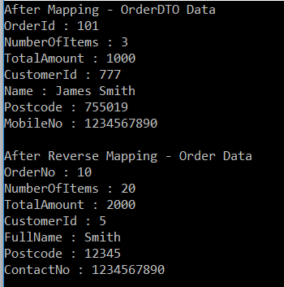
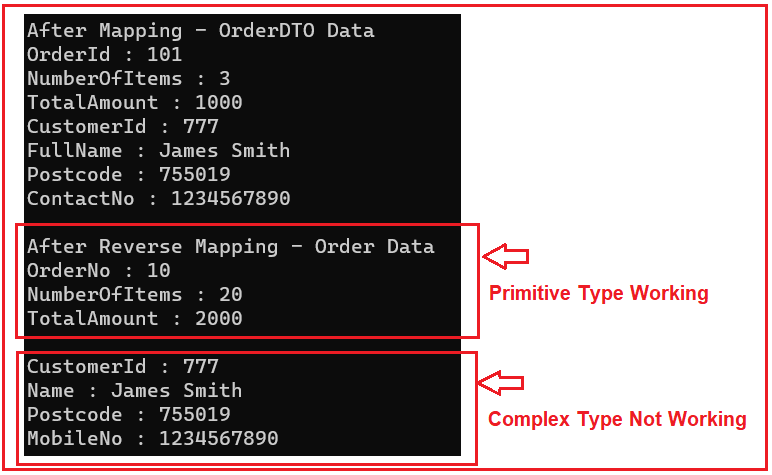
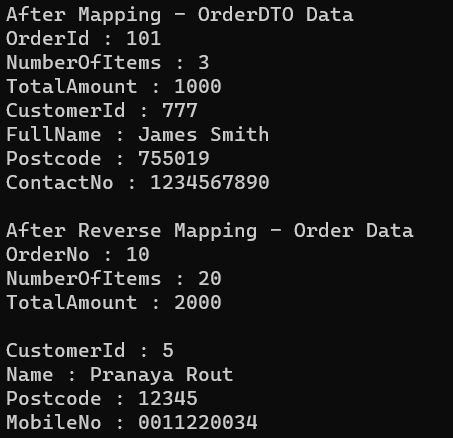

## **نگاشت معکوس AutoMapper در سی شارپ به همراه مثال**

در این مقاله، قصد دارم **AutoMapper** **نگاشت معکوس** را در سی شارپ با مثال‌ها مورد بحث قرار دهم. لطفاً مقاله قبلی ما را که در آن نحوه نگاشت نوع پیچیده به نوع اولیه با استفاده از AutoMapper در سی شارپ با مثال‌ها را مورد بحث قرار دادیم، مطالعه کنید. این یکی از مهمترین مفاهیمی است که باید در AutoMapper درک کنید و در پایان این مقاله، نحوه کار نگاشت معکوس AutoMapper در سی شارپ را با مثال‌ها خواهید فهمید.

##### **نگاشت معکوس AutoMapper در سی شارپ چیست؟**

نگاشت معکوس Automapper چیزی جز نگاشت دوطرفه نیست که به آن نگاشت دوطرفه نیز می‌گویند. در حال حاضر، نگاشتی که ما در مورد آن صحبت کردیم، نگاشت یک‌طرفه است. این بدان معناست که اگر دو نوع داشته باشیم، مثلاً نوع A و نوع B، نوع A را با نوع B نگاشت می‌کنیم. اما با استفاده از نگاشت معکوس Automapper، نگاشت نوع B با نوع A نیز امکان‌پذیر است.

##### **مثالی برای درک نگاشت معکوس AutoMapper در سی شارپ**

بیایید نگاشت معکوس AutoMapper را در سی‌شارپ با یک مثال، درک کنیم. ما قصد داریم از سه کلاس زیر برای این دمو استفاده کنیم. ابتدا، یک فایل کلاس با نام Customer.cs ایجاد کنید و سپس کد زیر را در آن کپی و جایگذاری کنید. این یک کلاس بسیار ساده است که دارای ۴ ویژگی از نوع اولیه است.

```csharp
namespace AutoMapperDemo
{
    public class Customer
    {
        public int CustomerID { get; set; }
        public string FullName { get; set; }
        public string Postcode { get; set; }
        public string ContactNo { get; set; }
    }
}
```

سپس، یک فایل کلاس با نام Order.cs ایجاد کنید و سپس کد زیر را در آن کپی و جایگذاری کنید. این نیز یک کلاس ساده است که دارای سه ویژگی اولیه و یک ویژگی از نوع مرجع است.

```csharp
namespace AutoMapperDemo
{
    public class Order
    {
        public int OrderNo { get; set; }
        public int NumberOfItems { get; set; }
        public int TotalAmount { get; set; }
        public Customer Customer { get; set; }
    }
}
```

در نهایت، یک فایل کلاس با نام OrderDTO.cs ایجاد کنید و سپس کد زیر را در آن کپی و جایگذاری کنید. کلاس زیر شامل ویژگی‌های ترکیبی کلاس‌های Order و Customer است.

```csharp
namespace AutoMapperDemo
{
    public class OrderDTO
    {
        public int OrderId { get; set; }
        public int NumberOfItems { get; set; }
        public int TotalAmount { get; set; }
        public int CustomerId { get; set; }
        public string Name { get; set; }
        public string Postcode { get; set; }
        public string MobileNo { get; set; }
    }
}
```

##### **چگونه می‌توان نگاشت معکوس AutoMapper را در سی شارپ پیاده‌سازی کرد؟**

برای پیاده‌سازی نگاشت معکوس AutoMapper در سی‌شارپ، باید **متد ReverseMap** را در انتهای نگاشت فراخوانی کنیم. بنابراین، یک فایل کلاس با نام MapperConfig.cs ایجاد کنید و کد زیر را در آن کپی و جایگذاری کنید. در اینجا، می‌توانید ببینید که ما شیء Source Order را با شیء Destination OrderDTO نگاشت می‌کنیم. علاوه بر این، ما OrderId را با ویژگی‌های OrderNo با استفاده از روش ForMember نگاشت می‌کنیم زیرا نام ویژگی متفاوت است. باز هم، Customer یک نوع پیچیده در شیء Source است و از این رو ما آن نوع پیچیده را با استفاده از روش ForMember به انواع اولیه شیء Destination نگاشت می‌کنیم. و در نهایت، پس از تمام نگاشت‌ها، متد ReverseMap را فراخوانی می‌کنیم که نگاشت را دو جهته می‌کند. دو جهته بودن به این معنی است که اکنون می‌توانیم Order را هم به عنوان شیء Source و هم به عنوان شیء Destination و همچنین می‌توانیم OrderDTO را طبق نیاز خود به عنوان شیء Source و هم به عنوان شیء Destination بسازیم.

```csharp
using AutoMapper;

namespace AutoMapperDemo
{
    public class MapperConfig
    {
        public static IMapper InitializeAutomapper()
        {
            // Configuring AutoMapper
            var config = new MapperConfiguration(cfg => {
                // Mapping Order with OrderDTO
                cfg.CreateMap<Order, OrderDTO>()
                    // OrderId is different so map them using For Member
                    .ForMember(dest => dest.OrderId, act => act.MapFrom(src => src.OrderNo))
                    // Customer is a Complex type, so Map Customer to Simple type using For Member
                    .ForMember(dest => dest.Name, act => act.MapFrom(src => src.Customer.FullName))
                    .ForMember(dest => dest.Postcode, act => act.MapFrom(src => src.Customer.Postcode))
                    .ForMember(dest => dest.MobileNo, act => act.MapFrom(src => src.Customer.ContactNo))
                    .ForMember(dest => dest.CustomerId, act => act.MapFrom(src => src.Customer.CustomerID))
                    .ReverseMap(); // Making the Mapping Bi-Directional
            });

            // Creating the Mapper Instance
            var mapper = config.CreateMapper();

            // returning the Mapper Instance
            return mapper;
        }
    }
}
```

##### **استفاده از نگاشت معکوس AutoMapper در سی شارپ:**

حالا، بیایید از نگاشت معکوس AutoMapper در سی شارپ استفاده کنیم. لطفاً متد Main از کلاس Program را به صورت زیر تغییر دهید. کد مثال زیر گویای همه چیز است، بنابراین لطفاً خطوط توضیحات را مطالعه کنید.

```csharp
using System;

namespace AutoMapperDemo
{
    class Program
    {
        static void Main(string[] args)
        {
            // Step1: Initialize the Mapper
            var mapper = MapperConfig.InitializeAutomapper();

            // Step2: Create the Order Request
            Order OrderRequest = CreateOrderRequest();

            // Step3: Map the OrderRequest object with OrderDTO Object
            var orderDTOData = mapper.Map<Order, OrderDTO>(OrderRequest);
            // or
            // var orderDTOData = mapper.Map<OrderDTO>(OrderRequest);

            // Step4: Print the OrderDTO Data
            Console.WriteLine("After Mapping - OrderDTO Data");
            Console.WriteLine("OrderId : " + orderDTOData.OrderId);
            Console.WriteLine("NumberOfItems : " + orderDTOData.NumberOfItems);
            Console.WriteLine("TotalAmount : " + orderDTOData.TotalAmount);
            Console.WriteLine("CustomerId : " + orderDTOData.CustomerId);
            Console.WriteLine("Name : " + orderDTOData.Name);
            Console.WriteLine("Postcode : " + orderDTOData.Postcode);
            Console.WriteLine("MobileNo : " + orderDTOData.MobileNo);
            Console.WriteLine();

            // Step5: modify the OrderDTO data
            orderDTOData.OrderId = 10;
            orderDTOData.NumberOfItems = 20;
            orderDTOData.TotalAmount = 2000;
            orderDTOData.CustomerId = 5;
            orderDTOData.Name = "Smith";
            orderDTOData.Postcode = "12345";

            // Step6: AutoMapper Reverse Mapping
            mapper.Map(orderDTOData, OrderRequest);

            // Step7: Print Order Data
            Console.WriteLine("After Reverse Mapping - Order Data");
            Console.WriteLine("OrderNo : " + OrderRequest.OrderNo);
            Console.WriteLine("NumberOfItems : " + OrderRequest.NumberOfItems);
            Console.WriteLine("TotalAmount : " + OrderRequest.TotalAmount);
            Console.WriteLine("CustomerId : " + OrderRequest.Customer.CustomerID);
            Console.WriteLine("FullName : " + OrderRequest.Customer.FullName);
            Console.WriteLine("Postcode : " + OrderRequest.Customer.Postcode);
            Console.WriteLine("ContactNo : " + OrderRequest.Customer.ContactNo);
            Console.ReadLine();
        }

        private static Order CreateOrderRequest()
        {
            return new Order
            {
                OrderNo = 101,
                NumberOfItems = 3,
                TotalAmount = 1000,
                Customer = new Customer()
                {
                    CustomerID = 777,
                    FullName = "James Smith",
                    Postcode = "755019",
                    ContactNo = "1234567890"
                },
            };
        }
    }
}
```

وقتی برنامه را اجرا می‌کنید، داده‌ها را همانطور که انتظار می‌رود، همانطور که در تصویر زیر نشان داده شده است، نمایش می‌دهد.



##### **اصلاح Order و کلاس OrderDTO:**

بیایید کلاس Order و OrderDTO را تغییر دهیم. همانطور که در کلاس‌های زیر مشاهده می‌کنید، اکنون ویژگی Complex Type یعنی Customer در **کلاس OrderDTO** وجود دارد **و ویژگی‌های نوع اولیه در کلاس Order** . بنابراین، ابتدا کلاس Order را به صورت زیر تغییر دهید. در اینجا، می‌توانید ببینید که ویژگی پیچیده Customer را حذف کرده و ویژگی‌های اولیه را برای نگهداری داده‌های مشتری اضافه کرده‌ایم.

```csharp
namespace AutoMapperDemo
{
    public class Order
    {
        public int OrderNo { get; set; }
        public int NumberOfItems { get; set; }
        public int TotalAmount { get; set; }
        public int CustomerId { get; set; }
        public string Name { get; set; }
        public string Postcode { get; set; }
        public string MobileNo { get; set; }
    }
}
```

در مرحله بعد، کلاس OrderDTO را به صورت زیر تغییر دهید. در اینجا، می‌توانید ببینید که ما ویژگی‌های اولیه را حذف کرده و یک ویژگی پیچیده مشتری (Customer Property) برای نگهداری داده‌های مشتری اضافه کرده‌ایم.

```csharp
namespace AutoMapperDemo
{
    public class OrderDTO
    {
        public int OrderId { get; set; }
        public int NumberOfItems { get; set; }
        public int TotalAmount { get; set; }
        public Customer Customer { get; set; }
    }
}
```

##### **تغییر پیکربندی Mapper:**

بیایید تابع AutoMapper ReverseMap() را پیاده‌سازی کنیم و ببینیم که آیا نتایج مطابق انتظار دریافت می‌کنیم یا خیر. متد InitializeAutomapper از کلاس MapperConfig را به صورت زیر تغییر دهید. در اینجا، می‌توانید ببینید که پس از نگاشت، متد ReverseMap را فراخوانی می‌کنیم که اساساً نگاشت بین Order و OrderDTO را به صورت نگاشت دو طرفه یا می‌توان گفت نگاشت دو جهته تنظیم می‌کند.

```csharp
using AutoMapper;

namespace AutoMapperDemo
{
    public class MapperConfig
    {
        public static IMapper InitializeAutomapper()
        {
            // Configuring AutoMapper
            var config = new MapperConfiguration(cfg => {
                // Mapping Order with OrderDTO
                cfg.CreateMap<Order, OrderDTO>()
                    .ForMember(dest => dest.OrderId, act => act.MapFrom(src => src.OrderNo))
                    .ForMember(dest => dest.Customer, act => act.MapFrom(src => new Customer()
                    {
                        CustomerID = src.CustomerId,
                        FullName = src.Name,
                        Postcode = src.Postcode,
                        ContactNo = src.MobileNo
                    }))
                    .ReverseMap(); // This will make the Mapping as Bi-Directional
                    // Now, we can also Map OrderDTO with Order Object
            });

            // Creating the Mapper Instance
            var mapper = config.CreateMapper();

            // returning the Mapper Instance
            return mapper;
        }
    }
}
```

سپس، متد Main از کلاس Program را به صورت زیر تغییر دهید.

```csharp
using System;

namespace AutoMapperDemo
{
    class Program
    {
        static void Main(string[] args)
        {
            // Step1: Initialize the Mapper
            var mapper = MapperConfig.InitializeAutomapper();

            // Step2: Create the Order Request
            var OrderRequest = CreateOrderRequest();

            // Step3: Map the OrderRequest object to Order DTO
            var orderDTOData = mapper.Map<Order, OrderDTO>(OrderRequest);

            // Step4: Print the OrderDTO Data
            Console.WriteLine("After Mapping - OrderDTO Data");
            Console.WriteLine("OrderId : " + orderDTOData.OrderId);
            Console.WriteLine("NumberOfItems : " + orderDTOData.NumberOfItems);
            Console.WriteLine("TotalAmount : " + orderDTOData.TotalAmount);
            Console.WriteLine("CustomerId : " + orderDTOData.Customer.CustomerID);
            Console.WriteLine("FullName : " + orderDTOData.Customer.FullName);
            Console.WriteLine("Postcode : " + orderDTOData.Customer.Postcode);
            Console.WriteLine("ContactNo : " + orderDTOData.Customer.ContactNo);
            Console.WriteLine();

            // Step5: modify the OrderDTO data
            orderDTOData.OrderId = 10;
            orderDTOData.NumberOfItems = 20;
            orderDTOData.TotalAmount = 2000;
            orderDTOData.Customer.CustomerID = 5;
            orderDTOData.Customer.FullName = "Pranaya Rout";
            orderDTOData.Customer.Postcode = "12345";
            orderDTOData.Customer.ContactNo = "0011220034";

            // Step6: Reverse Mapping
            mapper.Map(orderDTOData, OrderRequest);

            // Step7: Print the Order Data
            Console.WriteLine("After Reverse Mapping - Order Data");
            Console.WriteLine("OrderNo : " + OrderRequest.OrderNo);
            Console.WriteLine("NumberOfItems : " + OrderRequest.NumberOfItems);
            Console.WriteLine("TotalAmount : " + OrderRequest.TotalAmount);
            Console.WriteLine("\nCustomerId : " + OrderRequest.CustomerId);
            Console.WriteLine("Name : " + OrderRequest.Name);
            Console.WriteLine("Postcode : " + OrderRequest.Postcode);
            Console.WriteLine("MobileNo : " + OrderRequest.MobileNo);
            Console.ReadLine();
        }

        private static Order CreateOrderRequest()
        {
            return new Order
            {
                OrderNo = 101,
                NumberOfItems = 3,
                TotalAmount = 1000,
                CustomerId = 777,
                Name = "James Smith",
                Postcode = "755019",
                MobileNo = "1234567890"
            };
        }
    }
}
```

**حالا برنامه را اجرا کنید و خروجی را ببینید.**



همانطور که از خروجی بالا مشاهده می‌کنید، نگاشت معکوس AutoMapper برای انواع داده اولیه مطابق انتظار کار می‌کند، اما برای نوع داده پیچیده کار نمی‌کند. بنابراین وقتی هر دو کلاس اعضایی با نام یکسان دارند، تابع AutoMapper ReverseMap() مطابق انتظار کار می‌کند. اما اگر کلاس‌ها حاوی اعضایی باشند که متفاوت هستند و از طریق نگاشت پیش‌فرض (به ازای هر نامگذاری) نگاشت نشده‌اند، این تابع مطابق انتظار کار نمی‌کند.

##### **چگونه می‌توان کاری کرد که این دو نگاشت طبق انتظار عمل کنند؟**

اگر می‌خواهید نگاشت دوطرفه طبق انتظار انجام شود، باید نگاشت را از طریق ForMember انجام دهید و نگاشت را برای نوع پیچیده تعریف کنید. بنابراین، متد InitializeAutomapper از کلاس MapperConfig را به صورت زیر تغییر دهید. در اینجا، می‌توانید ببینید که پس از متد ReverseMap، ما از متد ForMember نیز برای نگاشت ویژگی نوع پیچیده شیء OrderDTO به ویژگی‌های نوع اولیه شیء Order استفاده می‌کنیم.

```csharp
using AutoMapper;

namespace AutoMapperDemo
{
    public class MapperConfig
    {
        public static IMapper InitializeAutomapper()
        {
            // Configuring AutoMapper
            var config = new MapperConfiguration(cfg => {
                // Mapping Order with OrderDTO
                cfg.CreateMap<Order, OrderDTO>()
                    .ForMember(dest => dest.OrderId, act => act.MapFrom(src => src.OrderNo))
                    .ForMember(dest => dest.Customer, act => act.MapFrom(src => new Customer()
                    {
                        CustomerID = src.CustomerId,
                        FullName = src.Name,
                        Postcode = src.Postcode,
                        ContactNo = src.MobileNo
                    }))
                    .ReverseMap() // This will make the Mapping as Bi-Directional
                    // Mapping Complex Type to Primitive Type Properties
                    .ForMember(dest => dest.CustomerId, act => act.MapFrom(src => src.Customer.CustomerID))
                    .ForMember(dest => dest.Name, act => act.MapFrom(src => src.Customer.FullName))
                    .ForMember(dest => dest.MobileNo, act => act.MapFrom(src => src.Customer.ContactNo))
                    .ForMember(dest => dest.Postcode, act => act.MapFrom(src => src.Customer.Postcode));
            });

            // Creating the Mapper Instance
            var mapper = config.CreateMapper();

            // returning the Mapper Instance
            return mapper;
        }
    }
}
```

با اعمال تغییرات فوق، اکنون برنامه را اجرا کنید و خروجی مورد انتظار را همانطور که در تصویر زیر نشان داده شده است، مشاهده خواهید کرد.

