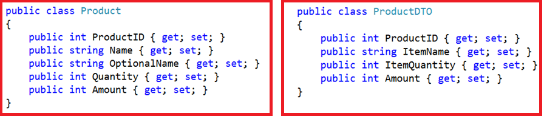
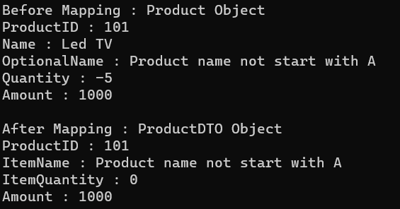

## **نگاشت شرطی AutoMapper در سی شارپ به همراه مثال**

در این مقاله، قصد دارم به بررسی **نگاشت شرطی AutoMapper در سی شارپ** به همراه مثال بپردازم. لطفاً مقاله قبلی ما را که در آن به بررسی نگاشت معکوس AutoMapper در سی شارپ به همراه مثال پرداختیم، مطالعه کنید. در پایان این مقاله، شما خواهید فهمید که نگاشت شرطی AutoMapper چیست و چه زمانی و چگونه باید از نگاشت شرطی در AutoMapper استفاده کرد. نگاشت شرطی AutoMapper در سی شارپ یکی از مفاهیم مهم Automapper است که در اکثر پروژه‌های بلادرنگ استفاده می‌شود.

##### **نگاشت شرطی AutoMapper چیست؟**

AutoMapper در سی شارپ به ما این امکان را می‌دهد که شرایطی را به ویژگی‌های شیء منبع اضافه کنیم که باید قبل از نگاشت آن ویژگی به ویژگی شیء مقصد، برآورده شوند. برای مثال، اگر بخواهیم یک ویژگی از شیء منبع را فقط در صورتی نگاشت کنیم که مقدار آن بزرگتر از 0 باشد، در چنین شرایطی باید از AutoMapper Conditional Mapping استفاده کنیم.

##### **مثالی برای درک نگاشت شرطی AutoMapper در سی شارپ**

بیایید با یک مثال، نگاشت شرطی AutoMapper را در سی شارپ درک کنیم. ما قصد داریم از دو کلاس زیر برای درک نگاشت شرطی AutoMapper استفاده کنیم.



یک فایل کلاس با نام Product.cs ایجاد کنید و سپس کد زیر را در آن کپی و جایگذاری کنید. این یک کلاس بسیار ساده است که دارای 5 ویژگی از نوع اولیه است. این قرار است شیء منبع ما باشد.

```csharp
namespace AutoMapperDemo
{
    public class Product
    {
        public int ProductID { get; set; }
        public string Name { get; set; }
        public string OptionalName { get; set; }
        public int Quantity { get; set; }
        public int Amount { get; set; }
    }
}
```

سپس، یک فایل کلاس دیگر با نام ProductDTO.cs ایجاد کنید و کد زیر را در آن کپی و جایگذاری کنید. این یک کلاس بسیار ساده است که دارای ۴ ویژگی از نوع اولیه است. این شیء مقصد ما خواهد بود.

```csharp
namespace AutoMapperDemo
{
    public class ProductDTO
    {
        public int ProductID { get; set; }
        public string ItemName { get; set; }
        public int ItemQuantity { get; set; }
        public int Amount { get; set; }
    }
}
```

##### **الزامات کسب و کار:**

1. ما فقط در صورتی نیاز داریم که **ویژگی Name** از **کلاس Product** را به ویژگی **ItemName** از **کلاس ProductDTO** نگاشت کنیم که مقدار Name با حرف **A** شروع شود، در غیر این صورت، **OptionalName** مقدار ویژگی **از کلاس Product** را با **ویژگی ItemName** از **کلاس ProductDTO** نگاشت کنیم.
2. اگر **مقدار Quantity** کلاس Product بزرگتر از **۰** باشد، آن را فقط به **ویژگی ItemQuantity** از کلاس ProductDTO نگاشت کنید.
3. به طور مشابه، اگر **مقدار Amount** کلاس Product بزرگتر از ۱۰۰ باشد، آن را فقط به **ویژگی Amount** کلاس ProductDTO نگاشت کنید.

برای رسیدن به این هدف، باید از نگاشت شرطی AutoMapper در سی‌شارپ استفاده کنیم. بنابراین، یک فایل کلاس با نام MapperConfig.cs ایجاد کنید و کد زیر را در آن کپی و جایگذاری کنید. در اینجا، می‌توانید ببینید که برای ویژگی مقصد ItemName، از عملگر سه‌تایی استفاده می‌کنیم و مقدار را تنظیم می‌کنیم. اگر نام با A شروع شود، مقدار ویژگی Name را اختصاص می‌دهیم، در غیر این صورت مقدار ویژگی OptionalName را به ویژگی Destination Name اختصاص می‌دهیم. سپس با استفاده از روش AutoMapper Condition، مقدار ویژگی شیء منبع را بررسی می‌کنیم و اگر شرط را برآورده کند، مقدار را به ویژگی مقصد نگاشت می‌کنیم. اگر شرط ناموفق باشد، مقدار پیش‌فرض را بر اساس نوع داده ذخیره می‌کند.

```csharp
using AutoMapper;

namespace AutoMapperDemo
{
    public class MapperConfig
    {
        public static IMapper InitializeAutomapper()
        {
            // Configuring AutoMapper
            var config = new MapperConfiguration(cfg =>
            {
                cfg.CreateMap<Product, ProductDTO>()
                    // If the Name Start with A then Map the Name Value else Map the OptionalName value
                    .ForMember(dest => dest.ItemName, act => act.MapFrom(src =>
                        (src.Name.StartsWith("A") ? src.Name : src.OptionalName)))

                    // Map the quantity value if its greater than 0
                    .ForMember(dest => dest.ItemQuantity, act => act.Condition(src => (src.Quantity > 0)))

                    // Map the amount value if its greater than 100
                    .ForMember(dest => dest.Amount, act => act.Condition(src => (src.Amount > 100)));
            });

            // Creating the Mapper Instance
            var mapper = config.CreateMapper();

            // returning the Mapper Instance
            return mapper;
        }
    }
}
```

**نکته:** متد AutoMapper Condition برای اضافه کردن شرایطی به ویژگی‌هایی که باید قبل از نگاشت آن ویژگی برآورده شوند، استفاده می‌شود. **گزینه MapFrom** برای انجام نگاشت‌های سفارشی اعضای منبع و مقصد استفاده می‌شود.

در مرحله بعد، متد Main از کلاس Program را به صورت زیر تغییر دهید تا بررسی کنید که آیا نگاشت شرطی AutoMapper کار می‌کند یا خیر. در اینجا، می‌توانید ببینید که ما نام محصول را به عنوان تلویزیون LED اضافه می‌کنیم که با A شروع نمی‌شود، و از این رو باید مقدار ویژگی OptionalName را نگاشت کند. علاوه بر این، ما مقدار Quantity را -5 تعیین کرده‌ایم که بزرگتر از 0 نیست و در این حالت، مقدار ویژگی را نگاشت نمی‌کند. در این حالت، مقدار پیش‌فرض یعنی 0 را به عنوان نوع داده Integer در نظر می‌گیرد. در نهایت، مقدار Amount را 1000 تعیین کرده‌ایم و این بزرگتر از 0 است، به این معنی که این مقدار به ویژگی مقصد نگاشت خواهد شد.

```csharp
using System;

namespace AutoMapperDemo
{
    class Program
    {
        static void Main(string[] args)
        {
            var mapper = MapperConfig.InitializeAutomapper();
            Product product = new Product()
            {
                ProductID = 101,
                Name = "Led TV",
                OptionalName = "Product name not start with A",
                Quantity = -5,
                Amount = 1000
            };
            var productDTO = mapper.Map<Product, ProductDTO>(product);

            Console.WriteLine("Before Mapping : Product Object");
            Console.WriteLine("ProductID : " + product.ProductID);
            Console.WriteLine("Name : " + product.Name);
            Console.WriteLine("OptionalName : " + product.OptionalName);
            Console.WriteLine("Quantity : " + product.Quantity);
            Console.WriteLine("Amount : " + product.Amount);
            Console.WriteLine();

            Console.WriteLine("After Mapping : ProductDTO Object");
            Console.WriteLine("ProductID : " + productDTO.ProductID);
            Console.WriteLine("ItemName : " + productDTO.ItemName);
            Console.WriteLine("ItemQuantity : " + productDTO.ItemQuantity);
            Console.WriteLine("Amount : " + productDTO.Amount);
            Console.ReadLine();
        }
    }
}
```

###### **خروجی:**

