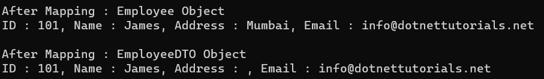
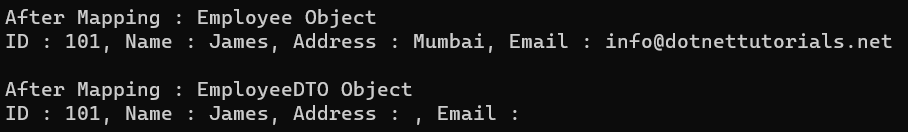

## **AutoMapper** **متد نادیده گرفتن** **در سی شارپ به همراه مثال**

در این مقاله، من در مورد استفاده از **متد نادیده گرفتن AutoMapper در سی شارپ** با مثال‌ها صحبت خواهم کرد. لطفاً مقاله قبلی ما در مورد نگاشت شرطی AutoMapper در سی شارپ با مثال‌ها را مطالعه کنید. در پایان این مقاله، شما نیاز و کاربرد متد نادیده گرفتن AutoMapper در سی شارپ با مثال‌ها را درک خواهید کرد.

##### **چرا به متد نادیده گرفتن AutoMapper در سی شارپ نیاز داریم؟**

AutoMapper، یک کتابخانه‌ی محبوب نگاشت شیء به شیء در سی‌شارپ، وظیفه‌ی تبدیل اشیاء از یک نوع به نوع دیگر را ساده می‌کند. هنگام پیکربندی نگاشت‌های AutoMapper، ممکن است با سناریوهایی مواجه شوید که نمی‌خواهید ویژگی‌های خاصی را نگاشت کنید. در این موارد، از متد Ignore() برای نادیده گرفتن ویژگی‌های خاص در طول فرآیند نگاشت استفاده می‌شود.

به طور پیش‌فرض، AutoMapper سعی می‌کند تمام ویژگی‌ها را از نوع منبع به نوع مقصد نگاشت کند، زمانی که نام هر دو نوع منبع و مقصد یکسان باشد. اگر می‌خواهید برخی از ویژگی‌ها با ویژگی نوع مقصد نگاشت نشوند، باید از متد نادیده گرفتن AutoMapper در C# استفاده کنید.

##### **مثالی برای درک متد نادیده گرفتن AutoMapper در سی شارپ**

بیایید با یک مثال نحوه استفاده از متد AutoMapper Ignore را درک کنیم. ما از **کلاس‌های Employee** و **EmployeeDTO** زیر استفاده خواهیم کرد : AutoMapper Ignore Property. هر دو کلاس دارای شماره، نام و نوع ویژگی‌های یکسانی هستند. بنابراین، یک فایل کلاس با نام Employee.cs ایجاد کنید و کد زیر را کپی و جایگذاری کنید.

```csharp
namespace AutoMapperDemo
{
    public class Employee
    {
        public int ID { get; set; }
        public string Name { get; set; }
        public string Address { get; set; }
        public string Email { get; set; }
    }
}
```

سپس، یک فایل کلاس دیگر با نام EmployeeDTO.cs ایجاد کنید و کد زیر را در آن کپی و جایگذاری کنید.

```csharp
namespace AutoMapperDemo
{
    public class EmployeeDTO
    {
        public int ID { get; set; }
        public string Name { get; set; }
        public string Address { get; set; }
        public string Email { get; set; }
    }
}
```

##### **الزامات کسب و کار:**

الزام کاری ما این نیست که **ویژگی آدرس را نگاشت کنیم،** یعنی باید **هنگام نگاشت بین این اشیاء ، ویژگی آدرس را نادیده بگیریم** . برای انجام این کار، باید **هنگام انجام پیکربندی نگاشت، از متد نادیده گرفتن** با **ویژگی آدرس** از نوع مقصد استفاده کنیم. بنابراین، یک فایل کلاس به نام MapperConfig.cs ایجاد کنید و کد زیر را کپی و جایگذاری کنید. در اینجا، با استفاده از متد ForMember، متد نادیده گرفتن را برای ویژگی آدرس مقصد فراخوانی می‌کنیم که هنگام انجام نگاشت، این ویژگی را نادیده می‌گیرد.

```csharp
using AutoMapper;

namespace AutoMapperDemo
{
    public class MapperConfig
    {
        public static IMapper InitializeAutomapper()
        {
            // Configuring AutoMapper
            var config = new MapperConfiguration(cfg =>
            {
                cfg.CreateMap<Employee, EmployeeDTO>()
                    // Ignoring the Address property of the destination type
                    .ForMember(dest => dest.Address, act => act.Ignore());
            });

            // Creating the Mapper Instance
            var mapper = config.CreateMapper();

            // returning the Mapper Instance
            return mapper;
        }
    }
}
```

در مرحله بعد، متد Main از کلاس Program را به صورت زیر تغییر دهید تا ببینید آیا متد Ignore از AutoMapper مطابق انتظار کار می‌کند یا خیر.

```csharp
using System;

namespace AutoMapperDemo
{
    class Program
    {
        static void Main(string[] args)
        {
            // Initialize AutoMapper
            var mapper = MapperConfig.InitializeAutomapper();

            // Creating Source Object
            Employee employee = new Employee()
            {
                ID = 101,
                Name = "James",
                Address = "Mumbai",
                Email = "info@dotnettutorials.net"
            };

            // Mapping Source Employee Object with Destination EmployeeDTO Object
            var empDTO = mapper.Map<Employee, EmployeeDTO>(employee);

            // Printing the Employee Object
            Console.WriteLine("After Mapping : Employee Object");
            Console.WriteLine("ID : " + employee.ID + ", Name : " + employee.Name + ", Address : " + employee.Address + ", Email : " + employee.Email);
            Console.WriteLine();

            // Printing the EmployeeDTO Object
            Console.WriteLine("After Mapping : EmployeeDTO Object");
            Console.WriteLine("ID : " + empDTO.ID + ", Name : " + empDTO.Name + ", Address : " + empDTO.Address + ", Email : " + empDTO.Email);
            Console.ReadLine();
        }
    }
}
```

حالا برنامه را اجرا کنید، خروجی زیر را دریافت خواهید کرد.



همانطور که در خروجی بالا مشاهده می‌کنید، مقدار ویژگی Address خالی است، اگرچه ویژگی Address برای نوع Source دارای مقدار است. بنابراین، متد AutoMapper Ignore() زمانی استفاده می‌شود که می‌خواهید ویژگی را در نگاشت به طور کامل نادیده بگیرید. متد نادیده گرفته شده می‌تواند در شیء منبع یا شیء مقصد باشد.

##### **چگونه می‌توان چندین ویژگی را هنگام استفاده از AutoMapper در سی شارپ نادیده گرفت؟**

در مثال قبلی، نحوه استفاده از متد Ignore با یک ویژگی را دیدیم. اگر یک یا دو ویژگی را نادیده بگیرید، این روش خوب است. اما اگر بخواهید چندین ویژگی را از نگاشت نادیده بگیرید، خسته‌کننده خواهد شد. اگر این نیاز شماست، ایجاد یک کلاس افزونه (extension class) را در نظر بگیرید که ویژگی‌ها را بر اساس ویژگی داده مشخص شده در مدل نادیده می‌گیرد. بیایید روش گام به گام پیاده‌سازی این روش را مورد بحث قرار دهیم.

##### **مرحله ۱: ایجاد یک کلاس ویژگی NoMap**

یک فایل کلاس به نام **NoMapAttribute.cs** ایجاد کنید و کد زیر را کپی و جایگذاری کنید. در اینجا، می‌توانید ببینید که کلاس NoMapAttribute از کلاس System.Attribute به ارث رسیده است. اکنون می‌توانیم از این کلاس به عنوان یک ویژگی استفاده کنیم.

```csharp
namespace AutoMapperDemo
{
    public class NoMapAttribute : System.Attribute
    {
    }
}
```

##### **مرحله ۲: ویژگی‌ها را با ویژگی NoMap تزئین کنید**

ما باید **ویژگی NoMap** را با ویژگی‌های نوع منبع که نمی‌خواهیم با نوع مقصد نگاشت کنیم، تزئین کنیم. برای مثال، اگر نمی‌خواهید ویژگی‌های آدرس و ایمیل را نگاشت کنید، باید ویژگی NoMap را با ویژگی‌های آدرس و ایمیل کلاس Employee تزئین کنید. بنابراین، کلاس Employee را به صورت زیر تغییر دهید.

```csharp
namespace AutoMapperDemo
{
    public class Employee
    {
        public int ID { get; set; }
        public string Name { get; set; }
        [NoMap]
        public string Address { get; set; }
        [NoMap]
        public string Email { get; set; }
    }
}
```

##### **مرحله ۳: ایجاد یک متد الحاقی**

یک فایل کلاس به نام IgnoreNoMapExtensions.cs ایجاد کنید و سپس کد زیر را کپی و جایگذاری کنید. این یک کلاس استاتیک خواهد بود و درون این کلاس استاتیک، ما یک متد استاتیک ژنتیکی ایجاد می‌کنیم و پارامتر را با استفاده از کلمه کلیدی this به عنوان IMappingExpression ارسال می‌کنیم. درون این متد، بررسی می‌کنیم که آیا ویژگی با ویژگی NoMap تزئین شده است یا خیر. اگر با ویژگی NoMap تزئین شده باشد، متد Ignore را فراخوانی می‌کنیم.

```csharp
using AutoMapper;
using System.ComponentModel;

namespace AutoMapperDemo
{
    // Extension Method:
    // The Class Should Be Static
    // Method Should Be Static
    // First Parameter is the class which which we can access the Method
    public static class IgnoreNoMapExtensions
    {
        // Method is Generic and Hence we can use with any TSource and TDestination Type
        public static IMappingExpression<TSource, TDestination> IgnoreNoMap<TSource, TDestination>(
            this IMappingExpression<TSource, TDestination> expression)
        {
            // Fetching Type of the TSource
            var sourceType = typeof(TSource);

            // Fetching All Properties of the Source Type using GetProperties() method
            foreach (var property in sourceType.GetProperties())
            {
                // Get the Property Name
                PropertyDescriptor descriptor = TypeDescriptor.GetProperties(sourceType)[property.Name];

                // Check if Property is Decorated with the NoMapAttribute
                NoMapAttribute attribute = (NoMapAttribute)descriptor.Attributes[typeof(NoMapAttribute)];
                if (attribute != null)
                {
                    // If Property is Decorated with NoMap Attribute, call the Ignore Method
                    expression.ForMember(property.Name, opt => opt.Ignore());
                }
            }
            return expression;
        }
    }
}
```

##### **مرحله ۴: استفاده از متد الحاقی IgnoreNoMap در پیکربندی Mapper**

در مرحله آخر، هنگام تعریف نگاشت، باید از متد IgnoreNoMap استفاده کنیم. بنابراین، متد InitializeAutomapper از کلاس MapperConfig را به صورت زیر تغییر دهید. در اینجا، می‌توانید ببینید که پس از نگاشت، ما به سادگی متد IgnoreNoMap را فراخوانی می‌کنیم. این متد IgnoreNoMap Extension یک متد عمومی است و در صورت نیاز می‌تواند با هر نگاشت دیگری مورد استفاده قرار گیرد.

```csharp
using AutoMapper;

namespace AutoMapperDemo
{
    public class MapperConfig
    {
        public static IMapper InitializeAutomapper()
        {
            // Configuring AutoMapper
            var config = new MapperConfiguration(cfg =>
            {
                cfg.CreateMap<Employee, EmployeeDTO>()
                    .IgnoreNoMap();
            });

            // Creating the Mapper Instance
            var mapper = config.CreateMapper();

            // returning the Mapper Instance
            return mapper;
        }
    }
}
```

با اعمال تغییرات فوق، برنامه را اجرا کنید و خروجی زیر را نمایش می‌دهد. می‌توانید ببینید که مقادیر ویژگی‌های آدرس و ایمیل نادیده گرفته می‌شوند.



##### **موارد استفاده برای متد Ignore**

- **عدم تطابق ویژگی‌ها:** وقتی نوع منبع و مقصد ویژگی‌های یکسانی ندارند، می‌خواهید از تلاش AutoMapper برای نگاشت این ویژگی‌های ناهماهنگ جلوگیری کنید.
- **ویژگی‌های فقط خواندنی:** اگر نوع مقصد دارای ویژگی‌های فقط خواندنی باشد، نباید در طول نگاشت تغییر داده شوند.
- **نگاشت شرطی:** در سناریوهایی که ویژگی‌های خاصی باید بر اساس شرایط خاص نگاشت یا نادیده گرفته شوند.
- **بهینه‌سازی عملکرد:** نادیده گرفتن ویژگی‌هایی که نگاشت آنها پرهزینه است یا در شیء مقصد مورد نیاز نیستند، می‌تواند عملکرد را بهبود بخشد.