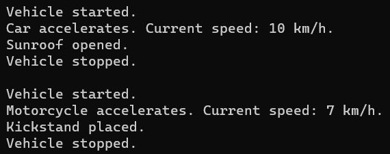

## **مثال‌های بلادرنگ از اصل وراثت در سی شارپ**

در این مقاله، من در مورد چندین **مثال بلادرنگ از اصل وراثت در سی شارپ** بحث خواهم کرد. در پایان این مقاله، شما مثال‌های بلادرنگ زیر را با استفاده از اصل وراثت در سی شارپ خواهید فهمید.

1. **اصل وراثت در سی شارپ چیست؟**
2. **سیستم مدیریت خودرو**
3. **سیستم آموزشی**
4. **حیوانات در باغ وحش**
5. **دستگاه‌های الکترونیکی**
6. **سیستم کتابخانه**
7. **دستگاه‌های محاسباتی**
8. **مزایا و معایب اصل وراثت در سی شارپ**
9. **چه زمانی از وراثت در سی شارپ استفاده کنیم؟**

##### **اصل وراثت در سی شارپ چیست؟**

وراثت یکی از مفاهیم اصلی برنامه‌نویسی شیءگرا (OOP) است و نقش مهمی در زبان برنامه‌نویسی سی‌شارپ ایفا می‌کند. این مفهوم به یک کلاس (کلاس «مشتق‌شده» یا «فرزند») اجازه می‌دهد تا اعضا (مانند فیلدها، ویژگی‌ها، متدها و رویدادها) را از کلاس دیگری (کلاس «پایه» یا «والد») به ارث ببرد. وراثت قابلیت استفاده مجدد از کد را افزایش می‌دهد و یک رابطه سلسله مراتبی بین کلاس‌ها برقرار می‌کند.

بنابراین، وراثت یکی دیگر از اصول اساسی برنامه‌نویسی شی‌گرا است. این اصل به یک کلاس اجازه می‌دهد تا ویژگی‌ها و متدها را از کلاس دیگری به ارث ببرد، که این امر باعث افزایش استفاده مجدد از کد و ایجاد سلسله مراتب طبیعی بین کلاس‌ها می‌شود. در اینجا به تفصیل مفاهیم کلیدی مرتبط با وراثت در سی شارپ آمده است:

- **کلاس پایه (کلاس والد):** کلاسی که اعضای آن توسط کلاس دیگری به ارث برده می‌شوند. همچنین به عنوان کلاس فوق کلاس یا کلاس والد شناخته می‌شود.
- **کلاس مشتق شده (کلاس فرزند):** کلاسی که اعضا را از کلاس پایه به ارث می‌برد. همچنین می‌تواند اعضای اضافی را معرفی کند یا اعضای به ارث برده شده را لغو کند. همچنین به عنوان زیرکلاس یا کلاس فرزند شناخته می‌شود.
- **زنجیره وراثت:** کلاس‌ها می‌توانند از کلاسی که آن کلاس از کلاس دیگری ارث‌بری می‌کند، ارث‌بری کنند که منجر به یک «زنجیره» یا «سلسله مراتب» وراثت می‌شود.
- **تعیین‌کننده‌های دسترسی:** فقط اعضایی که در کلاس پایه دارای تعیین‌کننده‌های دسترسی عمومی، محافظت‌شده یا داخلی هستند، از کلاس مشتق‌شده قابل دسترسی هستند. اعضای خصوصی کلاس پایه در کلاس مشتق‌شده قابل دسترسی نیستند.
- **بازنویسی متد:** اگر کلاس پایه یک متد را به صورت مجازی تعریف کند، کلاس مشتق شده می‌تواند با استفاده از کلمه کلیدی override این متد را بازنویسی کند. این به کلاس مشتق شده اجازه می‌دهد تا پیاده‌سازی خاصی برای آن متد ارائه دهد.
- **کلمه کلیدی base:** درون یک کلاس مشتق شده، می‌توانید از کلمه کلیدی base برای دسترسی به اعضای کلاس پایه استفاده کنید.
- **کلاس‌های مهر و موم شده (Sealed Classes):** در سی شارپ، اگر می‌خواهید از ارث‌بری یک کلاس جلوگیری کنید، می‌توانید آن را با کلمه کلیدی مهر و موم شده (sealed) علامت‌گذاری کنید.

##### **مثال بلادرنگ از اصل وراثت در سی شارپ: سیستم مدیریت خودرو**

انواع مختلف وسایل نقلیه، مانند یک وسیله نقلیه ساده، یک ماشین و یک موتورسیکلت را در نظر بگیرید. همه وسایل نقلیه می‌توانند روشن و خاموش شوند و سرعت داشته باشند. با این حال، ماشین‌ها و موتورسیکلت‌ها ویژگی‌ها و رفتارهای خاصی دارند. بیایید ببینیم چگونه می‌توانیم این مثال را با استفاده از اصل وراثت در C# پیاده‌سازی کنیم:

```csharp
using System;

namespace InheritancePrincipleCSharp
{
    //Base Class (Parent Class) - Vehicle
    public class Vehicle
    {
        public int Speed { get; protected set; }

        public void Start()
        {
            Console.WriteLine("Vehicle started.");
        }

        public void Stop()
        {
            Console.WriteLine("Vehicle stopped.");
        }

        public virtual void Accelerate()
        {
            Speed += 5;
            Console.WriteLine($"Vehicle accelerates. Current speed: {Speed} km/h.");
        }
    }

    //Derived Class (Child Class) - Car
    public class Car : Vehicle
    {
        public int Doors { get; set; }

        public override void Accelerate()
        {
            Speed += 10;
            Console.WriteLine($"Car accelerates. Current speed: {Speed} km/h.");
        }

        public void OpenSunroof()
        {
            Console.WriteLine("Sunroof opened.");
        }
    }

    //Derived Class (Child Class) - Motorcycle
    public class Motorcycle : Vehicle
    {
        public bool HasSideCar { get; set; }

        public override void Accelerate()
        {
            Speed += 7;
            Console.WriteLine($"Motorcycle accelerates. Current speed: {Speed} km/h.");
        }

        public void UseKickstand()
        {
            Console.WriteLine("Kickstand placed.");
        }
    }
    
    //Testing Inheritance Principle
    public class Program
    {
        static void Main(string[] args)
        {
            //Using the Inheritance
            Car myCar = new Car { Doors = 4 };
            myCar.Start();
            myCar.Accelerate();
            myCar.OpenSunroof();
            myCar.Stop();

            Console.WriteLine();

            Motorcycle myBike = new Motorcycle { HasSideCar = false };
            myBike.Start();
            myBike.Accelerate();
            myBike.UseKickstand();
            myBike.Stop();

            Console.Read();
        }
    }
}
```

**در این مثال:**

- کلاس Vehicle نشان دهنده ویژگی‌ها و رفتارهای عمومی وسایل نقلیه است.
- کلاس‌های Car و Motorcycle از Vehicle ارث‌بری می‌کنند، به این معنی که به طور خودکار متدهای Start، Stop و Accelerate را دریافت می‌کنند. علاوه بر این، می‌توانند ویژگی‌های خاص خود (مانند Doors برای Cars یا HasSideCar برای Motorcycles) و رفتارهای خاص خود (مانند OpenSunroof برای Cars یا UseKickstand برای Motorcycles) را داشته باشند.
- متد Accelerate هم در ماشین و هم در موتورسیکلت بازنویسی (override) می‌شود تا رفتارهای شتاب‌گیری خاصی را برای هر کدام ارائه دهد.

این مثال قدرت وراثت را در ارتقای استفاده مجدد از کد، ایجاد سلسله مراتب و امکان رفتارهای تخصصی در کلاس‌های مشتق شده نشان می‌دهد. وقتی کد بالا را اجرا می‌کنید، خروجی زیر را دریافت خواهید کرد:



##### **مثال بلادرنگ از اصل وراثت در سی شارپ: سیستم آموزشی**

بیایید یک مثال بلادرنگ دیگر را برای درک اصل وراثت در سی شارپ در نظر بگیریم، یعنی سناریوی سیستم آموزشی با دانش‌آموزان و معلمان. در یک موسسه آموزشی، دانش‌آموزان و معلمان افرادی با ویژگی‌های مشترک مانند نام، سن و آدرس هستند. با این حال، آنها ویژگی‌ها و رفتارهای متمایزی نیز دارند. به عنوان مثال، یک دانش‌آموز ممکن است در یک دوره ثبت نام کند در حالی که یک معلم ممکن است دوره‌ای را تدریس کند. بیایید ببینیم چگونه می‌توانیم این مثال را با استفاده از اصل وراثت در سی شارپ پیاده‌سازی کنیم:

```csharp
using System;

namespace InheritancePrincipleCSharp
{
    //Base Class (Parent Class) - Person
    public class Person
    {
        public string Name { get; set; }
        public int Age { get; set; }
        public string Address { get; set; }

        public Person(string name, int age, string address)
        {
            Name = name;
            Age = age;
            Address = address;
        }

        public void DisplayDetails()
        {
            Console.WriteLine($"Name: {Name}, Age: {Age}, Address: {Address}");
        }
    }

    //Derived Class (Child Class) - Student
    public class Student : Person
    {
        public string StudentId { get; set; }

        public Student(string name, int age, string address, string studentId)
            : base(name, age, address) // Calling base class constructor
        {
            StudentId = studentId;
        }

        public void Enroll(string courseName)
        {
            Console.WriteLine($"{Name} has enrolled in {courseName} course.");
        }
    }

    //Derived Class (Child Class) - Teacher
    public class Teacher : Person
    {
        public string EmployeeId { get; set; }

        public Teacher(string name, int age, string address, string employeeId)
            : base(name, age, address) // Calling base class constructor
        {
            EmployeeId = employeeId;
        }

        public void Teach(string courseName)
        {
            Console.WriteLine($"{Name} is teaching {courseName} course.");
        }
    }
    
    //Testing Inheritance Principle
    public class Program
    {
        static void Main(string[] args)
        {
            //Using the Inheritance
            Student john = new Student("John Doe", 20, "123 Main St", "S12345");
            john.DisplayDetails();
            john.Enroll("Mathematics");

            Console.WriteLine();

            Teacher mrsSmith = new Teacher("Mrs. Smith", 40, "456 Elm St", "T98765");
            mrsSmith.DisplayDetails();
            mrsSmith.Teach("Physics");

            Console.Read();
        }
    }
}
```

**در این مثال:**

- کلاس Person، ویژگی‌ها و رفتارهای عمومی مشترک بین دانش‌آموزان و معلمان را در بر می‌گیرد.
- کلاس‌های Student و Teacher از Person ارث‌بری می‌کنند. این ارث‌بری به این معنی است که آنها به طور خودکار ویژگی‌هایی مانند Name، Age و Address و متد DisplayDetails را دارند. علاوه بر این، آنها ویژگی‌ها و متدهای خاصی مانند Enroll برای Student و Teach برای Teacher را معرفی می‌کنند.
- سازنده‌های کلاس‌های مشتق‌شده از کلمه کلیدی base برای فراخوانی سازنده کلاس پایه استفاده می‌کنند و از تنظیم ویژگی‌های مشترک اطمینان حاصل می‌کنند.

این مثال نشان می‌دهد که چگونه وراثت می‌تواند روابط دنیای واقعی را مدل‌سازی کند، استفاده مجدد از کد را تسهیل کند و روشی ساختاریافته برای نمایش سلسله مراتب در سیستم شما فراهم کند.

##### **مثال بلادرنگ از اصل وراثت در سی شارپ: حیوانات در یک باغ وحش**

یک باغ وحش انواع مختلفی از حیوانات مانند پستانداران، پرندگان و خزندگان را دارد. همه حیوانات دارای ویژگی‌های مشترکی مانند نام، سن و رژیم غذایی هستند، اما هر نوع ممکن است رفتارهای منحصر به فردی داشته باشد. به عنوان مثال، پرندگان می‌توانند پرواز کنند، در حالی که پستانداران ممکن است روش ارتباطی خاصی داشته باشند. بیایید ببینیم چگونه می‌توانیم این مثال را با استفاده از اصل وراثت در C# پیاده‌سازی کنیم:

```csharp
using System;

namespace InheritancePrincipleCSharp
{
    //Base Class (Parent Class) - Animal
    public class Animal
    {
        public string Name { get; set; }
        public int Age { get; set; }
        public string Diet { get; set; }

        public Animal(string name, int age, string diet)
        {
            Name = name;
            Age = age;
            Diet = diet;
        }

        public void Eat()
        {
            Console.WriteLine($"{Name} is eating {Diet}.");
        }

        public virtual void Display()
        {
            Console.WriteLine($"I am {Name}, a {Age}-year-old animal that eats {Diet}.");
        }
    }

    //Derived Class (Child Class) - Bird
    public class Bird : Animal
    {
        public bool CanFly { get; set; }

        public Bird(string name, int age, string diet, bool canFly)
            : base(name, age, diet)
        {
            CanFly = canFly;
        }

        public void Fly()
        {
            if (CanFly)
                Console.WriteLine($"{Name} is flying.");
            else
                Console.WriteLine($"{Name} cannot fly.");
        }

        public override void Display()
        {
            base.Display();
            Fly();
        }
    }

    //Derived Class (Child Class) - Mammal
    public class Mammal : Animal
    {
        public string CommunicationSound { get; set; }

        public Mammal(string name, int age, string diet, string sound)
            : base(name, age, diet)
        {
            CommunicationSound = sound;
        }

        public void Communicate()
        {
            Console.WriteLine($"{Name} makes a {CommunicationSound} sound.");
        }

        public override void Display()
        {
            base.Display();
            Communicate();
        }
    }
    
    //Testing Inheritance Principle
    public class Program
    {
        static void Main(string[] args)
        {
            //Using the Inheritance
            Bird parrot = new Bird("Parrot", 5, "seeds", true);
            parrot.Display();

            Console.WriteLine();

            Mammal lion = new Mammal("Lion", 8, "meat", "roar");
            lion.Display();

            Console.Read();
        }
    }
}
```

**در این مثال:**

- کلاس Animal نشان‌دهنده ویژگی‌ها و رفتارهای عمومی مشترک بین همه حیوانات است.
- کلاس‌های Bird و Mammal از Animals ارث‌بری می‌کنند، به این معنی که آنها به طور خودکار ویژگی‌هایی مانند Name، Age، Diet و متد Eat را دریافت می‌کنند. با این حال، آنها رفتارهای خاصی را نیز معرفی می‌کنند: Bird دارای متد Fly است، در حالی که Mammal دارای متد Communicate است.
- متد Display در هر دو کلاس Bird و Mammal بازنویسی (override) می‌شود تا علاوه بر رفتار پایه، رفتار تخصصی‌تری را نیز ارائه دهد.

از طریق این مدل، وراثت به نمایش مؤثر سلسله مراتب طبیعی حیوانات کمک می‌کند و استفاده مجدد از کد را ارتقا می‌دهد.

##### **مثال بلادرنگ از اصل وراثت در سی شارپ: دستگاه‌های الکترونیکی**

دستگاه‌های الکترونیکی مختلفی مانند یک تلفن همراه ساده و یک تلفن هوشمند را در نظر بگیرید. در حالی که همه دستگاه‌های الکترونیکی را می‌توان روشن یا خاموش کرد، تلفن‌های هوشمند قابلیت‌های اضافی مانند دسترسی به اینترنت دارند. بیایید ببینیم چگونه می‌توانیم این مثال را با استفاده از اصل وراثت در C# پیاده‌سازی کنیم:

```csharp
using System;

namespace InheritancePrincipleCSharp
{
    //Base Class (Parent Class) - ElectronicDevice
    public class ElectronicDevice
    {
        public string Brand { get; set; }

        public void PowerOn()
        {
            Console.WriteLine($"{Brand} device is powered on.");
        }

        public void PowerOff()
        {
            Console.WriteLine($"{Brand} device is powered off.");
        }
    }

    //Derived Class (Child Class) - MobilePhone
    public class MobilePhone : ElectronicDevice
    {
        public void MakeCall(string number)
        {
            Console.WriteLine($"Calling {number} from {Brand} mobile phone.");
        }

        public void ReceiveCall(string number)
        {
            Console.WriteLine($"Receiving call from {number} on {Brand} mobile phone.");
        }
    }

    //Derived Class (Child Class) - SmartPhone
    public class SmartPhone : MobilePhone
    {
        public void BrowseWeb(string website)
        {
            Console.WriteLine($"Browsing {website} on {Brand} smartphone.");
        }

        public void InstallApp(string appName)
        {
            Console.WriteLine($"Installing {appName} on {Brand} smartphone.");
        }
    }
    
    //Testing Inheritance Principle
    public class Program
    {
        static void Main(string[] args)
        {
            //Using the Inheritance
            MobilePhone nokia3310 = new MobilePhone { Brand = "Nokia" };
            nokia3310.PowerOn();
            nokia3310.MakeCall("123-456-7890");
            nokia3310.ReceiveCall("098-765-4321");
            nokia3310.PowerOff();

            Console.WriteLine();

            SmartPhone iPhone = new SmartPhone { Brand = "Apple" };
            iPhone.PowerOn();
            iPhone.BrowseWeb("www.example.com");
            iPhone.InstallApp("ChatApp");
            iPhone.MakeCall("123-456-7890");
            iPhone.PowerOff();

            Console.Read();
        }
    }
}
```

**در این مثال:**

- کلاس ElectronicDevice رفتارهای رایج در تمام دستگاه‌های الکترونیکی را کپسوله‌سازی می‌کند.
- کلاس MobilePhone، ضمن به ارث بردن ویژگی‌های عمومی از ElectronicDevice، قابلیت‌های اولیه تلفن مانند برقراری و دریافت تماس را معرفی می‌کند.
- کلاس SmartPhone که از MobilePhone مشتق شده است، نه تنها قابلیت‌های تلفن را به ارث می‌برد، بلکه ویژگی‌های پیشرفته‌ای مانند مرور وب و نصب برنامه‌ها را نیز معرفی می‌کند.

زنجیره وراثت (ElectronicDevice -> MobilePhone -> SmartPhone) تخصص‌گرایی تدریجی کلاس‌ها را نشان می‌دهد. این سلسله مراتب، استفاده مجدد از کد را ترویج می‌دهد و رابطه‌ای روشن بین کلاس‌ها برقرار می‌کند.

##### **مثال بلادرنگ از اصل وراثت در سی شارپ: سیستم کتابخانه**

یک کتابخانه شامل اقلام مختلفی از جمله کتاب، مجله و دی‌وی‌دی است. همه اقلام کتابخانه دارای یک شناسه منحصر به فرد و یک عنوان هستند و می‌توانند قرض گرفته یا بازگردانده شوند. با این حال، هر نوع ممکن است ویژگی‌های منحصر به فردی داشته باشد. به عنوان مثال، یک کتاب دارای یک نویسنده و صفحات زیادی است، در حالی که یک دی‌وی‌دی ممکن است دارای یک زمان اجرا باشد. بیایید ببینیم چگونه می‌توانیم این مثال را با استفاده از اصل وراثت در سی‌شارپ پیاده‌سازی کنیم:

```csharp
using System;

namespace InheritancePrincipleCSharp
{
    //Base Class (Parent Class) - LibraryItem
    public class LibraryItem
    {
        public string Id { get; set; }
        public string Title { get; set; }

        public LibraryItem(string id, string title)
        {
            Id = id;
            Title = title;
        }

        public void Borrow()
        {
            Console.WriteLine($"'{Title}' has been borrowed.");
        }

        public void Return()
        {
            Console.WriteLine($"'{Title}' has been returned.");
        }
    }

    //Derived Class (Child Class) - Book
    public class Book : LibraryItem
    {
        public string Author { get; set; }
        public int Pages { get; set; }

        public Book(string id, string title, string author, int pages)
            : base(id, title)
        {
            Author = author;
            Pages = pages;
        }

        public void DisplayBookInfo()
        {
            Console.WriteLine($"Book: '{Title}' by {Author}, {Pages} pages.");
        }
    }

    //Derived Class (Child Class) - DVD
    public class DVD : LibraryItem
    {
        public int Runtime { get; set; } // Runtime in minutes

        public DVD(string id, string title, int runtime)
            : base(id, title)
        {
            Runtime = runtime;
        }

        public void DisplayDVDInfo()
        {
            Console.WriteLine($"DVD: '{Title}', Runtime: {Runtime} minutes.");
        }
    }
    
    //Testing Inheritance Principle
    public class Program
    {
        static void Main(string[] args)
        {
            //Using the Inheritance
            Book novel = new Book("BK001", "The Great Novel", "John Doe", 320);
            novel.DisplayBookInfo();
            novel.Borrow();
            novel.Return();

            Console.WriteLine();

            DVD movie = new DVD("DV001", "Epic Movie", 120);
            movie.DisplayDVDInfo();
            movie.Borrow();
            movie.Return();

            Console.Read();
        }
    }
}
```

**در این مثال:**

- کلاس LibraryItem ویژگی‌ها و رفتارهای اساسی مشترک بین همه اقلام کتابخانه، مانند قرض گرفتن و بازگرداندن، را تعریف می‌کند.
- کلاس‌های Book و DVD از LibraryItem ارث‌بری می‌کنند و به‌طور خودکار ویژگی‌هایی مانند Id و Title و متدهایی مانند Borrow و Return را دریافت می‌کنند. با این حال، آن‌ها ویژگی‌های منحصر به فرد خود را نیز اضافه می‌کنند: Book نویسنده و صفحات را معرفی می‌کند، در حالی که DVD زمان اجرا را معرفی می‌کند.
- هر کلاس یک متد برای نمایش جزئیات خاص دارد: DisplayBookInfo برای کتاب و DisplayDVDInfo برای دی‌وی‌دی.

از طریق این مثال، اصل وراثت در سی شارپ به ما امکان می‌دهد تا یک سیستم کتابخانه‌ای در دنیای واقعی را مدل‌سازی کنیم، استفاده مجدد از کد را ارتقا دهیم و ساختار سازمان‌یافته‌ای از موارد مختلف درون کتابخانه را حفظ کنیم.

##### **مثال بلادرنگ از اصل وراثت در سی شارپ: دستگاه‌های محاسباتی**

یک شرکت فناوری، دستگاه‌های محاسباتی مختلفی از جمله کامپیوترهای رومیزی، لپ‌تاپ‌ها و تبلت‌ها را تولید می‌کند. همه این دستگاه‌ها برخی ویژگی‌های اساسی مانند پردازنده، رم و ظرفیت ذخیره‌سازی را به اشتراک می‌گذارند. با این حال، هر نوع دستگاه می‌تواند ویژگی‌ها و رفتارهای منحصر به فرد خود را داشته باشد. به عنوان مثال، یک لپ‌تاپ عمر باتری دارد، در حالی که یک کامپیوتر رومیزی ممکن است نوع سیستم خنک‌کننده‌ای که استفاده می‌کند را داشته باشد. بیایید ببینیم چگونه می‌توانیم این مثال را با استفاده از اصل وراثت در C# پیاده‌سازی کنیم:

```csharp
using System;

namespace InheritancePrincipleCSharp
{
    //Base Class (Parent Class) - Device
    public class Device
    {
        public string Processor { get; set; }
        public int RAM { get; set; } // in GB
        public int Storage { get; set; } // in GB

        public Device(string processor, int ram, int storage)
        {
            Processor = processor;
            RAM = ram;
            Storage = storage;
        }

        public void BootUp()
        {
            Console.WriteLine("Device is booting up...");
        }
    }

    //Derived Class (Child Class) - Desktop
    public class Desktop : Device
    {
        public string CoolingSystem { get; set; }

        public Desktop(string processor, int ram, int storage, string coolingSystem)
            : base(processor, ram, storage)
        {
            CoolingSystem = coolingSystem;
        }

        public void DisplayDesktopInfo()
        {
            Console.WriteLine($"Desktop with {Processor}, {RAM}GB RAM, {Storage}GB Storage, and {CoolingSystem} cooling.");
        }
    }

    //Derived Class (Child Class) - Laptop
    public class Laptop : Device
    {
        public int BatteryLife { get; set; } // in hours

        public Laptop(string processor, int ram, int storage, int batteryLife)
            : base(processor, ram, storage)
        {
            BatteryLife = batteryLife;
        }

        public void DisplayLaptopInfo()
        {
            Console.WriteLine($"Laptop with {Processor}, {RAM}GB RAM, {Storage}GB Storage, and {BatteryLife} hours battery life.");
        }
    }
    
    //Testing Inheritance Principle
    public class Program
    {
        static void Main(string[] args)
        {
            //Using the Inheritance
            Desktop gamingPC = new Desktop("Intel i9", 32, 1024, "Liquid Cooling");
            gamingPC.DisplayDesktopInfo();
            gamingPC.BootUp();

            Console.WriteLine();

            Laptop ultrabook = new Laptop("Intel i7", 16, 512, 10);
            ultrabook.DisplayLaptopInfo();
            ultrabook.BootUp();

            Console.Read();
        }
    }
}
```

**در این مثال:**

- کلاس پایه Device، پایه‌ای با ویژگی‌ها و رفتارهای عمومی مرتبط با همه دستگاه‌های محاسباتی فراهم می‌کند.
- کلاس‌های مشتق‌شده‌ی Desktop و Laptop، ویژگی‌ها و رفتارهای عمومی را از Device به ارث می‌برند و همچنین ویژگی‌های خاص خود را نیز معرفی می‌کنند، مانند CoolingSystem برای دسکتاپ‌ها و BatteryLife برای لپ‌تاپ‌ها.

از طریق این سلسله مراتب، اصل وراثت در سی شارپ امکان نمایش یک رابطه واقعی بین دستگاه‌های محاسباتی مختلف را فراهم می‌کند، قابلیت استفاده مجدد از کد را افزایش می‌دهد و ساختار سازمان‌یافته را حفظ می‌کند.

##### **مزایا و معایب اصل وراثت در سی شارپ**

وراثت یک مفهوم اساسی در برنامه‌نویسی شیءگرا (OOP) است و طیف وسیعی از مزایا را ارائه می‌دهد، اما معایبی نیز دارد. در اینجا مزایا و معایب اصل وراثت در C# آورده شده است:

###### **مزایای اصل وراثت در سی شارپ:**

- **قابلیت استفاده مجدد از کد:** یکی از مهمترین مزایای ارث‌بری، امکان استفاده مجدد از کد کلاس پایه در کلاس مشتق شده است. این امر افزونگی را کاهش می‌دهد و منجر به ایجاد پایگاه‌های کد کوچکتر و قابل نگهداری‌تر می‌شود.
- **توسعه‌پذیری:** کلاس‌های مشتق‌شده می‌توانند ویژگی‌ها و رفتارهای جدیدی را معرفی کنند یا ویژگی‌های به ارث رسیده را تغییر دهند، که امکان توسعه آسان عملکردها را بدون تغییر کلاس پایه فراهم می‌کند.
- **سازماندهی سلسله مراتبی:** وراثت به سازماندهی سلسله مراتبی کلاس‌ها کمک می‌کند، که منعکس کننده روابط و سلسله مراتب دنیای واقعی است و طراحی را شهودی‌تر می‌کند.
- **چندریختی:** وراثت پیش‌نیاز پیاده‌سازی چندریختی نوع در OOP است. چندریختی اجازه می‌دهد تا اشیاء کلاس‌های مختلف به عنوان اشیاء یک کلاس پایه مشترک در نظر گرفته شوند و انعطاف‌پذیری در استفاده از اشیاء را تسهیل می‌کند.
- **استانداردسازی:** با تعریف متدها و ویژگی‌های استاندارد در کلاس پایه، تضمین می‌کنید که همه کلاس‌های مشتق‌شده رابط کاربری ثابتی دارند و درک و کار با کلاس‌های مشتق‌شده را برای سایر توسعه‌دهندگان آسان‌تر می‌کنند.

###### **معایب اصل وراثت در سی شارپ:**

- **سربار:** وراثت غیرضروری (در صورت عدم نیاز) می‌تواند سربار اضافی در مورد حافظه و پردازش ایجاد کند، زیرا کلاس مشتق شده، تمام ویژگی‌ها و متدهای کلاس پایه را به همراه خواهد داشت.
- **پیچیدگی:** مدیریت و درک سلسله مراتب ارث‌بری عمیق و گسترده می‌تواند دشوار شود. این امر می‌تواند کد را مستعد خطاتر و نگهداری آن را دشوارتر کند.
- **اتصال محکم:** وراثت منجر به اتصال محکم بین کلاس‌های پایه و مشتق شده می‌شود. تغییرات در کلاس پایه می‌تواند اثرات موجی بر روی تمام کلاس‌های مشتق شده داشته باشد، که ممکن است منجر به عواقب ناخواسته و نرم‌افزار شکننده‌تر شود.
- **محدودیت ارث‌بری:** سی‌شارپ از ارث‌بری چندگانه برای کلاس‌ها پشتیبانی نمی‌کند (یعنی یک کلاس نمی‌تواند از بیش از یک کلاس ارث‌بری کند). این محدودیت ممکن است توسعه‌دهندگان را مجبور کند در مواقعی که نیاز به ارث‌بری رفتارها از منابع متعدد دارند، از رابط‌ها یا سایر الگوهای طراحی استفاده کنند.
- **استفاده بیش از حد:** برخی از توسعه‌دهندگان با ایجاد زنجیره‌های طولانی، حتی زمانی که ترکیب یا سایر اصول طراحی ممکن است مناسب‌تر باشند، از وراثت بیش از حد استفاده می‌کنند. این می‌تواند منجر به طراحی‌های غیرمنعطف شود که در آن همه ویژگی‌ها و متدهای کلاس پایه برای همه کلاس‌های مشتق شده منطقی نیستند.

اگرچه وراثت ابزاری قدرتمند در OOP و C# است، اما توسعه‌دهندگان باید بدانند چه زمانی از وراثت استفاده کنند و چه زمانی اصول طراحی دیگری مانند ترکیب یا تجمیع را انتخاب کنند. همیشه مهم است که پیامدهای بلندمدت استفاده از وراثت را بر قابلیت نگهداری، توسعه‌پذیری و استحکام کد در نظر بگیریم.

##### **چه زمانی از وراثت در سی شارپ استفاده کنیم؟**

در اینجا موقعیت‌هایی وجود دارد که استفاده از وراثت در سی شارپ منطقی است:

- **رابطه‌ی «است-آ»:** وراثت زمانی مناسب‌ترین حالت است که یک رابطه‌ی «است-آ»ی واضح بین کلاس پایه و کلاس مشتق شده وجود داشته باشد. برای مثال، سگ یک حیوان است، بنابراین ارث‌بری از یک حیوان منطقی است.
- **قابلیت استفاده مجدد از کد:** وقتی چندین کلاس ویژگی‌ها و رفتارهای مشترکی دارند، می‌توان این مشترکات را در یک کلاس پایه خلاصه کرد تا از تکرار کد جلوگیری شود. برای مثال، اگر حساب‌های بانکی مختلف برخی ویژگی‌ها و متدها را به اشتراک بگذارند، می‌توانند از یک کلاس عمومی BankAccount ارث‌بری کنند.
- **چندریختی:** اگر می‌خواهید از چندریختی استفاده کنید، وراثت لازم است، جایی که می‌توانید با استفاده از مرجع کلاس پایه به اشیاء کلاس‌های مشتق شده مراجعه کنید و متدهای لغو شده را اجرا کنید. این در سناریوهایی مفید است که باید لیستی از اشیاء را پردازش کنید که یک کلاس پایه مشترک دارند اما ممکن است به کلاس‌های مشتق شده مختلف تعلق داشته باشند.
- **توسعه‌پذیری:** اگر در حال طراحی یک کتابخانه یا چارچوب هستید و می‌خواهید به کاربران اجازه دهید قابلیت‌های خاصی را گسترش دهند یا سفارشی‌سازی کنند، تعریف یک کلاس پایه که کاربران بتوانند از آن ارث‌بری کرده و آن را لغو کنند، می‌تواند مفید باشد.
- **استانداردسازی:** وقتی می‌خواهید مطمئن شوید که گروهی از کلاس‌ها مجموعه‌ای استاندارد از ویژگی‌ها یا متدها را دارند، تعریف آنها در یک کلاس پایه تضمین می‌کند که همه کلاس‌های مشتق شده آنها را خواهند داشت.

با این حال، مواردی نیز وجود دارد که ممکن است ارث بهترین انتخاب نباشد:

- **عدم وجود رابطه‌ی «هست-هست» واضح:** اگر رابطه‌ی بین کلاس‌ها بیشتر از نوع «هست-هست» باشد تا «هست-هست»، ترکیب‌بندی معمولاً انتخاب بهتری است. برای مثال، یک ماشین موتور دارد، اما یک ماشین موتور نیست.
- **از سلسله مراتب ارث بری عمیق اجتناب کنید:** مدیریت زنجیره‌های ارث بری عمیق و گسترده می‌تواند دشوار شود و کد را مستعد خطا کند. درخت‌های ارث بری سطحی را ترجیح دهید و برای سناریوهای پیچیده‌تر، ترکیب یا رابط‌ها را در نظر بگیرید.
- **اجتناب از سربار:** اگر فقط برای چند ویژگی یا متد از ارث‌بری استفاده می‌کنید، ممکن است زیاده‌روی باشد. ارث‌بری غیرضروری می‌تواند سربار اضافی ایجاد کند و منجر به طرح‌های کم‌انعطاف‌تر شود.
- **وراثت چندگانه:** از آنجایی که سی شارپ از وراثت چندگانه برای کلاس‌ها پشتیبانی نمی‌کند، اگر نیاز به ارث‌بری رفتارها از منابع مختلف دارید، ممکن است بخواهید از رابط‌ها استفاده کنید.
- **نگرانی‌های مربوط به اتصال محکم:** اگر نگران تأثیر تغییرات در کلاس پایه بر کلاس‌های مشتق شده هستید یا اگر کلاس پایه مرتباً در حال تغییر است، بهتر است از ترکیب یا الگوهای دیگر برای جداسازی کلاس‌ها استفاده کنید.