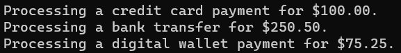

## **مثال‌های بلادرنگ از اصل چندریختی در سی شارپ**

در این مقاله، من در مورد **مثال‌های بلادرنگ متعدد از اصل چندریختی در سی‌شارپ** بحث خواهم کرد . در پایان این مقاله، شما مثال‌های بلادرنگ زیر را با استفاده از اصل چندریختی در سی‌شارپ درک خواهید کرد.

1. **اصل چندریختی در سی شارپ چیست؟**
2. **صداهای حیوانات**
3. **برنامه گرافیکی**
4. **سیستم پردازش پرداخت**
5. **مدیریت ناوگان وسایل نقلیه**
6. **پخش کننده رسانه**
7. **سیستم اعلان**
8. **مزایا و معایب اصل چندریختی در سی شارپ**
9. **چه زمانی از چندریختی در سی شارپ استفاده کنیم؟**

##### **اصل چندریختی در سی شارپ چیست؟**

چندریختی یک اصل اساسی در برنامه‌نویسی شیءگرا (OOP) است که اجازه می‌دهد اشیاء کلاس‌های مختلف به عنوان اشیاء یک کلاس پایه مشترک در نظر گرفته شوند. اصطلاح "چندریختی" از کلمات یونانی "poly" (به معنی زیاد) و "morph" (به معنی شکل) گرفته شده است. چندریختی شما را قادر می‌سازد تا متدهای کلاس مشتق شده را از طریق ارجاع به کلاس پایه در برنامه‌نویسی فراخوانی کنید.

در سی شارپ، چندریختی در درجه اول با استفاده از وراثت، کلاس‌های انتزاعی یا رابط‌ها همراه با override کردن یا overloading متدها حاصل می‌شود. دو نوع اصلی چندریختی در سی شارپ وجود دارد:

###### **چندریختی زمان کامپایل (چندریختی استاتیک):**

- با سربارگذاری متد یا سربارگذاری عملگر حاصل می‌شود.
- فراخوانی متد در زمان کامپایل حل می‌شود.

###### **چندریختی زمان اجرا (چندریختی پویا):**

- با لغو روش (method override) حاصل می‌شود.
- فراخوانی متد در زمان اجرا بر اساس نوع شیء واقعی انجام می‌شود.
- در سی شارپ، این کار با استفاده از کلمه کلیدی virtual در متد کلاس پایه و کلمه کلیدی override در متد کلاس مشتق شده پیاده‌سازی می‌شود.

چندریختی یکی از چهار اصل اصلی برنامه‌نویسی شیءگرا (OOP) است. در سی‌شارپ، چندریختی به شما امکان می‌دهد تا متدهای کلاس مشتق‌شده را از طریق ارجاع به کلاس پایه فراخوانی کنید.

##### **مثال بلادرنگ از اصل چندریختی در سی شارپ: صداهای حیوانات**

در اینجا یک مثال ساده و بلادرنگ آورده شده است: حیواناتی را در نظر بگیرید که صدا تولید می‌کنند. در حالی که هر حیوانی صدایی تولید می‌کند، صدای هر حیوان متمایز است. می‌توانید از چندریختی برای مدل‌سازی این سناریو استفاده کنید. بیایید آن را بررسی کنیم:

- **کلاس پایه: حیوان**
- **کلاس‌های مشتق‌شده: سگ، گربه**

بیایید ببینیم چگونه می‌توانیم این مثال را با استفاده از اصل چندریختی در سی‌شارپ پیاده‌سازی کنیم:

```csharp
using System;

namespace PolymorphismExample
{
    // Base class
    public abstract class Animal
    {
        public abstract void MakeSound();
    }

    // Derived class
    public class Dog : Animal
    {
        public override void MakeSound()
        {
            Console.WriteLine("The dog barks.");
        }
    }

    // Another derived class
    public class Cat : Animal
    {
        public override void MakeSound()
        {
            Console.WriteLine("The cat meows.");
        }
    }

    //Testing Polymorphism Principle
    public class Program
    {
        static void Main(string[] args)
        {
            Animal myDog = new Dog();
            Animal myCat = new Cat();

            MakeAnimalSound(myDog); // Outputs: The dog barks.
            MakeAnimalSound(myCat); // Outputs: The cat meows.

            Console.Read();
        }

        // This function showcases polymorphism in action.
        // Even though it accepts a parameter of type 'Animal',
        // it's able to handle any derived type.
        static void MakeAnimalSound(Animal animal)
        {
            animal.MakeSound();
        }
    }
}
```

**در این مثال:**

- ما یک کلاس انتزاعی Animal با یک متد انتزاعی MakeSound() داریم.
- کلاس‌های مشتق‌شده (سگ و گربه) پیاده‌سازی خودشان از متد MakeSound() را ارائه می‌دهند.
- در کلاس Program، اگرچه از نوع Animal برای نگهداری ارجاعات به کلاس‌های مشتق شده استفاده می‌کنیم، اما همچنان می‌توانیم متد MakeSound() کلاس مشتق شده‌ی مناسب را فراخوانی کنیم. این جوهره‌ی چندریختی است.

این امر انعطاف‌پذیری را افزایش می‌دهد و اضافه کردن انواع حیوانات بیشتر در آینده را بدون ایجاد تغییرات عمده در کد موجود، آسان‌تر می‌کند. اگر قرار باشد حیوان جدیدی، مثلاً Bird، اضافه کنید، باید یک کلاس Bird مشتق شده از Animal ایجاد کنید و پیاده‌سازی مخصوص به خود را برای متد MakeSound() فراهم کنید.

##### **مثال بلادرنگ از اصل چندریختی در سی شارپ: برنامه گرافیکی**

بیایید چندریختی را با استفاده از یک مثال واقعی دیگر درک کنیم: یک برنامه گرافیکی که می‌تواند شکل‌های مختلفی را رسم کند. هر شکل را می‌توان روی یک بوم رسم کرد، اما نحوه رسم هر شکل ممکن است متفاوت باشد. در اینجا نحوه نمایش این موضوع با استفاده از چندریختی در C# آورده شده است:

- **کلاس پایه: شکل**
- **کلاس‌های مشتق‌شده: دایره، مستطیل**

بیایید ببینیم چگونه می‌توانیم این مثال را با استفاده از اصل چندریختی در سی‌شارپ پیاده‌سازی کنیم:

```csharp
using System;

namespace PolymorphismExample
{
    // Base class
    public abstract class Shape
    {
        public abstract void Draw();
    }

    // Derived class
    public class Circle : Shape
    {
        public override void Draw()
        {
            Console.WriteLine("Drawing a circle on the canvas.");
        }
    }

    // Another derived class
    public class Rectangle : Shape
    {
        public override void Draw()
        {
            Console.WriteLine("Drawing a rectangle on the canvas.");
        }
    }

    class Program
    {
        static void Main(string[] args)
        {
            Shape myCircle = new Circle();
            Shape myRectangle = new Rectangle();

            DrawShape(myCircle);      // Outputs: Drawing a circle on the canvas.
            DrawShape(myRectangle);   // Outputs: Drawing a rectangle on the canvas.

            Console.ReadKey();
        }

        // This function showcases polymorphism.
        // Even though it accepts a parameter of type 'Shape',
        // it's able to handle any shape derived from it.
        static void DrawShape(Shape shape)
        {
            shape.Draw();
        }
    }
}
```

**در این مثال:**

- کلاس پایه انتزاعی Shape یک متد انتزاعی به نام Draw() دارد.
- کلاس‌های مشتق‌شده‌ی Circle و Rectangle پیاده‌سازی‌های مخصوص به خود را از متد Draw() ارائه می‌دهند.
- در کلاس Program، می‌توانیم چندریختی را در عمل ببینیم. ما از متد DrawShape استفاده می‌کنیم که می‌تواند هر شیء از نوع Shape (یا مشتق شده از Shape) را بپذیرد و متد Draw() آن را فراخوانی کند. بر اساس نوع شیء واقعی (دایره یا مستطیل)، متد Draw() مناسب اجرا می‌شود.

به این ترتیب، اگر در آینده نیاز به معرفی اشکال جدید، مانند مثلث یا چندضلعی، داشته باشید، می‌توانید کلاس‌های مشتق‌شده جدیدی ایجاد کنید و منطق ترسیم آنها را بدون تغییر کلاس پایه موجود یا متد DrawShape پیاده‌سازی کنید.

##### **مثال بلادرنگ از اصل چندریختی در سی شارپ: سیستم پردازش پرداخت**

بیایید چندریختی را با استفاده از یک مثال واقعی دیگر درک کنیم: سیستم پردازش پرداخت. روش‌های مختلف پرداخت، مانند کارت‌های اعتباری، نقل و انتقالات بانکی و کیف پول‌های دیجیتال، می‌توانند فرآیندهای مختلفی برای اجرای یک پرداخت داشته باشند. در اینجا نحوه نمایش این موضوع با چندریختی آورده شده است:

- **کلاس پایه: روش پرداخت**
- **کلاس های مشتق شده: کارت اعتباری، انتقال بانکی، کیف پول دیجیتال**

بیایید ببینیم چگونه می‌توانیم این مثال را با استفاده از اصل چندریختی در سی‌شارپ پیاده‌سازی کنیم:

```csharp
using System;

namespace PaymentPolymorphismExample
{
    // Base class
    public abstract class PaymentMethod
    {
        public abstract void ExecutePayment(decimal amount);
    }

    // Derived class for credit card payment
    public class CreditCard : PaymentMethod
    {
        public override void ExecutePayment(decimal amount)
        {
            Console.WriteLine($"Processing a credit card payment for ${amount}.");
            // Here you'd have logic specific to credit card processing
        }
    }

    // Derived class for bank transfer
    public class BankTransfer : PaymentMethod
    {
        public override void ExecutePayment(decimal amount)
        {
            Console.WriteLine($"Processing a bank transfer for ${amount}.");
            // Logic specific to bank transfers would be here
        }
    }

    // Derived class for digital wallet payment
    public class DigitalWallet : PaymentMethod
    {
        public override void ExecutePayment(decimal amount)
        {
            Console.WriteLine($"Processing a digital wallet payment for ${amount}.");
            // Logic specific to digital wallet payment would go here
        }
    }

    class Program
    {
        static void Main(string[] args)
        {
            PaymentMethod creditCardPayment = new CreditCard();
            PaymentMethod bankTransferPayment = new BankTransfer();
            PaymentMethod digitalWalletPayment = new DigitalWallet();

            ProcessPayment(creditCardPayment, 100.00M);      // Outputs: Processing a credit card payment for $100.00.
            ProcessPayment(bankTransferPayment, 250.50M);    // Outputs: Processing a bank transfer for $250.50.
            ProcessPayment(digitalWalletPayment, 75.25M);    // Outputs: Processing a digital wallet payment for $75.25.

            Console.ReadKey();
        }

        // Demonstrating polymorphism.
        // This function can accept any payment method derived from PaymentMethod.
        static void ProcessPayment(PaymentMethod paymentMethod, decimal amount)
        {
            paymentMethod.ExecutePayment(amount);
        }
    }
}
```

**در این مثال:**

- کلاس پایه PaymentMethod قراردادی با یک متد انتزاعی ExecutePayment ارائه می‌دهد.
- هر کلاس مشتق شده (مثلاً CreditCard، BankTransfer، DigitalWallet) پیاده‌سازی خاص خود را برای پردازش پرداخت ارائه می‌دهد.
- تابع ProcessPayment در کلاس Program هر روش پرداختی (یک شیء از نوعی که از PaymentMethod مشتق شده است) را می‌پذیرد و پرداخت را با استفاده از چندریختی پردازش می‌کند. این امر انعطاف‌پذیری لازم برای معرفی روش‌های پرداخت جدید در آینده را بدون تغییر منطق اصلی پردازش پرداخت فراهم می‌کند.

وقتی کد بالا را اجرا کنید، خروجی زیر را دریافت خواهید کرد:



##### **مثال بلادرنگ از اصل چندریختی در سی شارپ: مدیریت ناوگان وسایل نقلیه**

بیایید چندریختی را با استفاده از یک مثال واقعی دیگر درک کنیم: مدیریت ناوگانی از وسایل نقلیه. هر وسیله نقلیه را می‌توان راند، اما تجربه و روش رانندگی ممکن است بسته به نوع وسیله نقلیه متفاوت باشد. به عنوان مثال، شما یک ماشین را متفاوت از یک قایق می‌رانید.

- **کلاس پایه: خودرو**
- **کلاس‌های مشتق‌شده: ماشین، قایق، دوچرخه**

بیایید ببینیم چگونه می‌توانیم این مثال را با استفاده از اصل چندریختی در سی‌شارپ پیاده‌سازی کنیم:

```csharp
using System;

namespace VehiclePolymorphismExample
{
    // Base class
    public abstract class Vehicle
    {
        public abstract void Drive();
    }

    // Derived class: Car
    public class Car : Vehicle
    {
        public override void Drive()
        {
            Console.WriteLine("Driving a car. Follow road signs!");
        }
    }

    // Derived class: Boat
    public class Boat : Vehicle
    {
        public override void Drive()
        {
            Console.WriteLine("Piloting a boat. Watch out for waves and other vessels!");
        }
    }

    // Derived class: Bicycle
    public class Bicycle : Vehicle
    {
        public override void Drive()
        {
            Console.WriteLine("Riding a bicycle. Stay in the bike lane and wear a helmet!");
        }
    }

    class Program
    {
        static void Main(string[] args)
        {
            Vehicle myCar = new Car();
            Vehicle myBoat = new Boat();
            Vehicle myBicycle = new Bicycle();

            OperateVehicle(myCar);        // Outputs: Driving a car. Follow road signs!
            OperateVehicle(myBoat);       // Outputs: Piloting a boat. Watch out for waves and other vessels!
            OperateVehicle(myBicycle);    // Outputs: Riding a bicycle. Stay in the bike lane and wear a helmet!

            Console.ReadKey();
        }

        // Function showcasing polymorphism.
        // Accepts any vehicle type and drives it.
        static void OperateVehicle(Vehicle vehicle)
        {
            vehicle.Drive();
        }
    }
}
```

**در این مثال:**

- کلاس Vehicle کلاس پایه با یک متد انتزاعی به نام Drive است.
- کلاس‌های مشتق‌شده‌ی Car، Boat و Bicycle هر کدام پیاده‌سازی‌های منحصر به فرد خود را از متد Drive ارائه می‌دهند.
- تابع OperateVehicle در کلاس Program می‌تواند هر شیء از نوع Vehicle (یا مشتق شده از Vehicle) را بپذیرد و به دلیل چندریختی، متد Drive مناسب را فراخوانی کند.

اگر نیاز به معرفی نوع جدیدی از وسیله نقلیه، مانند «هلیکوپتر» داشته باشید، باید یک کلاس مشتق شده جدید از Vehicle ایجاد کنید و یک روش خاص برای هدایت آن پیاده‌سازی کنید. هیچ تغییری در متد OperateVehicle لازم نخواهد بود.

##### **مثال بلادرنگ از اصل چندریختی در سی شارپ: مدیا پلیر**

بیایید چندریختی را با استفاده از یک مثال واقعی دیگر درک کنیم: یک برنامه پخش رسانه‌ای که می‌تواند فایل‌های رسانه‌ای مختلفی مانند صدا و تصویر را پخش کند. در اینجا نحوه ساختاردهی آن آمده است:

- **کلاس پایه: فایل رسانه‌ای**
- **کلاس‌های مشتق‌شده: AudioFile، VideoFile**

بیایید ببینیم چگونه می‌توانیم این مثال را با استفاده از اصل چندریختی در سی‌شارپ پیاده‌سازی کنیم:

```csharp
using System;

namespace MediaPlayerPolymorphismExample
{
    // Base class
    public abstract class MediaFile
    {
        public string FileName { get; set; }

        public MediaFile(string fileName)
        {
            FileName = fileName;
        }

        public abstract void Play();
    }

    // Derived class: AudioFile
    public class AudioFile : MediaFile
    {
        public AudioFile(string fileName) : base(fileName) { }

        public override void Play()
        {
            Console.WriteLine($"Playing audio file: {FileName}.");
        }
    }

    // Derived class: VideoFile
    public class VideoFile : MediaFile
    {
        public VideoFile(string fileName) : base(fileName) { }

        public override void Play()
        {
            Console.WriteLine($"Playing video file: {FileName}.");
        }
    }

    class Program
    {
        static void Main(string[] args)
        {
            MediaFile mySong = new AudioFile("song.mp3");
            MediaFile myMovie = new VideoFile("movie.mp4");

            PlayMedia(mySong);    // Outputs: Playing audio file: song.mp3.
            PlayMedia(myMovie);   // Outputs: Playing video file: movie.mp4.

            Console.ReadKey();
        }

        // Function illustrating polymorphism.
        // It can accept any media type derived from MediaFile and play it.
        static void PlayMedia(MediaFile media)
        {
            media.Play();
        }
    }
}
```

**در این مثال:**

- کلاس پایه MediaFile یک متد Play انتزاعی ارائه می‌دهد. همچنین یک ویژگی مشترک به نام FileName برای شناسایی هر فایل رسانه‌ای دارد.
- کلاس‌های مشتق‌شده‌ی AudioFile و VideoFile هر کدام پیاده‌سازی‌های خاص خود را از متد Play ارائه می‌دهند.
- تابع PlayMedia در کلاس Program می‌تواند هر نوع شیء مشتق شده از MediaFile را مدیریت کند و متد Play مناسب را فراخوانی کند، که پلی‌مورفیسم را در عمل نشان می‌دهد.

اگر در آینده، برنامه نیاز به پشتیبانی از فرمت‌های رسانه‌ای دیگر، مانند ImageFile برای اسلایدشوها، داشته باشد، می‌توانید به راحتی سیستم را با ایجاد یک کلاس مشتق شده جدید از MediaFile بدون نیاز به تغییر منطق پخش کننده موجود، گسترش دهید.

##### **مثال بلادرنگ از اصل چندریختی در سی شارپ: سیستم اعلان**

بیایید چندریختی را با استفاده از یک مثال واقعی دیگر درک کنیم: یک سیستم اعلان که در آن از روش‌های مختلف اعلان (مثلاً ایمیل، پیامک، اعلان فوری) استفاده می‌شود. تنظیمات به این صورت است:

- **کلاس پایه: اعلان**
- **کلاس‌های مشتق‌شده: EmailNotification، SmsNotification، PushNotification**

بیایید ببینیم چگونه می‌توانیم این مثال را با استفاده از اصل چندریختی در سی‌شارپ پیاده‌سازی کنیم:

```csharp
using System;

namespace NotificationSystem
{
    // Base class
    public abstract class Notification
    {
        public string Recipient { get; set; }
        public string Message { get; set; }

        public Notification(string recipient, string message)
        {
            Recipient = recipient;
            Message = message;
        }

        public abstract void Send();
    }

    // Derived class: EmailNotification
    public class EmailNotification : Notification
    {
        public string Subject { get; set; }

        public EmailNotification(string recipient, string subject, string message)
            : base(recipient, message)
        {
            Subject = subject;
        }

        public override void Send()
        {
            Console.WriteLine($"Sending Email to {Recipient} with subject: {Subject} and message: {Message}");
        }
    }

    // Derived class: SmsNotification
    public class SmsNotification : Notification
    {
        public SmsNotification(string phoneNumber, string message)
            : base(phoneNumber, message) { }

        public override void Send()
        {
            Console.WriteLine($"Sending SMS to {Recipient} with message: {Message}");
        }
    }

    // Derived class: PushNotification
    public class PushNotification : Notification
    {
        public PushNotification(string device, string message)
            : base(device, message) { }

        public override void Send()
        {
            Console.WriteLine($"Sending Push Notification to device {Recipient} with message: {Message}");
        }
    }

    class Program
    {
        static void Main(string[] args)
        {
            Notification email = new EmailNotification("user@example.com", "Hello!", "This is a notification email.");
            Notification sms = new SmsNotification("123-456-7890", "This is an SMS notification.");
            Notification push = new PushNotification("Device123", "This is a push notification.");

            SendNotification(email);  // Outputs: Sending Email to user@example.com with subject: Hello! and message: This is a notification email.
            SendNotification(sms);    // Outputs: Sending SMS to 123-456-7890 with message: This is an SMS notification.
            SendNotification(push);   // Outputs: Sending Push Notification to device Device123 with message: This is a push notification.

            Console.ReadKey();
        }

        // Function illustrating polymorphism.
        // It can send any type of notification derived from the Notification base class.
        static void SendNotification(Notification notification)
        {
            notification.Send();
        }
    }
}
```

**در این مثال:**

- کلاس پایه Notification دارای ویژگی‌هایی مانند Recipient و Message و یک متد انتزاعی Send است.
- کلاس‌های مشتق‌شده (EmailNotification، SmsNotification، PushNotification) هر کدام پیاده‌سازی‌های خاصی را برای متد Send ارائه می‌دهند.
- متد SendNotification در کلاس Program هر شیء اعلانی که از کلاس پایه Notification مشتق شده باشد را می‌پذیرد و آن را با استفاده از چندریختی ارسال می‌کند.

این رویکرد امکان مقیاس‌پذیری آسان را فراهم می‌کند. اگر در آینده بخواهید نوع جدیدی از اعلان، مثلاً «SlackNotification» اضافه کنید، آن را از کلاس پایه اعلان مشتق می‌کنید و یک پیاده‌سازی خاص برای ارسال ارائه می‌دهید.

##### **مزایا و معایب اصل چندریختی در سی شارپ**

چندریختی یکی از چهار اصل اساسی برنامه‌نویسی شیءگرا (OOP) است و مانند هر مفهوم برنامه‌نویسی، مزایا و معایب خاص خود را دارد.

###### **مزایای اصل چندریختی در سی شارپ:**

- **انعطاف‌پذیری و توسعه‌پذیری:** شما می‌توانید کلاس‌ها یا متدهای جدیدی معرفی کنید که عملکردهای موجود را پیاده‌سازی یا لغو می‌کنند، بدون اینکه کد موجود تغییر کند.
- **قابلیت استفاده مجدد از کد:** رفتارهای رایج را می‌توان در یک کلاس بالا تعریف کرد و در چندین کلاس فرعی به ارث برد و نیاز به کد تکراری را از بین برد.
- **قابلیت نگهداری:** چندریختی، هنگامی که با شیوه‌های طراحی خوب ترکیب شود، می‌تواند کدبیس را ساده کند و درک، اصلاح و نگهداری آن را آسان‌تر سازد.
- **رابط یکپارچه:** این رابط، یک رابط واحد برای موجودیت‌های با انواع مختلف فراهم می‌کند. این بدان معناست که می‌توانید از یک روش یکپارچه برای تعامل با اشیاء صرف نظر از کلاس‌های خاص آنها استفاده کنید. به عنوان مثال، ممکن است متدی داشته باشید که روی یک شیء Shape کار می‌کند و برای هر کلاس مشتق شده (Circle، Rectangle و غیره) بدون نیاز به یک متد جداگانه برای هر شکل، کار خواهد کرد.
- **اعزام پویا:** با چندریختی زمان اجرا، می‌توانید در زمان اجرا تصمیم بگیرید که کدام متد یا ویژگی را فراخوانی کنید و رفتارهای پویا را بر اساس شیء واقعی و نه فقط نوع مرجع آن فعال کنید.
- **جداسازی:** چندریختی می‌تواند منجر به سیستم‌های جدا شده شود که در آن‌ها تغییرات در یک بخش (مثلاً پیاده‌سازی یک زیرکلاس) ممکن است بر سایر بخش‌هایی که از رابط چندریختی آن استفاده می‌کنند، تأثیر نگذارد.

###### **معایب اصل چندریختی در سی شارپ:**

- **پیچیدگی:** معرفی چندریختی می‌تواند سیستم را پیچیده‌تر کند، به خصوص برای کسانی که با این مفهوم آشنا نیستند. ممکن است لایه‌هایی از وراثت و متدهای بازنویسی‌شده وجود داشته باشد که باید بین آنها حرکت کرد.
- **سربار:** اعزام پویا (یکی از ویژگی‌های چندریختی زمان اجرا) می‌تواند سربار کمی ایجاد کند، زیرا فراخوانی‌های متد در زمان اجرا حل می‌شوند. این معمولاً برای اکثر برنامه‌ها مشکلی ایجاد نمی‌کند، اما ممکن است در سناریوهای با کارایی بالا مورد توجه قرار گیرد.
- **مشکلات اشکال‌زدایی:** ردیابی فراخوانی‌های متد چندریختی می‌تواند چالش‌برانگیزتر باشد، زیرا اجرای متد واقعی به نوع شیء زمان اجرا بستگی دارد. ممکن است همیشه مشخص نباشد که کدام متد فراخوانی می‌شود، به خصوص در سلسله مراتب ارث‌بری عمیق.
- **محدودیت‌های طراحی:** گاهی اوقات می‌تواند یک طرح را مجبور کند تا با رابطه‌ی «هست-یک» که توسط وراثت الزامی است، مطابقت داشته باشد، حتی زمانی که ممکن است به بهترین شکل ممکن مطابقت نداشته باشد.
- **سوء استفاده احتمالی:** سلسله مراتب ارث بری نامناسب یا override کردن بیش از حد می‌تواند منجر به سیستمی شود که درک یا اصلاح آن دشوار است. یک مشکل کلاسیک، «مشکل الماس» است که در برخی از زبان‌ها با آن مواجه هستیم، اگرچه C# با عدم امکان ارث بری چندگانه برای کلاس‌ها، از این مشکل جلوگیری می‌کند.
- **اتصال محکم (در صورت سوءاستفاده):** اگر از چندریختی و وراثت سوءاستفاده شود، می‌تواند باعث اتصال محکم بین کلاس‌های والد و فرزند شود و تغییر سیستم را دشوارتر کند.

##### **چه زمانی از چندریختی در سی شارپ استفاده کنیم؟**

در اینجا چند موقعیت رایج وجود دارد که استفاده از چندریختی در C# در آنها مفید خواهد بود:

- **رابط مشترک با پیاده‌سازی‌های مختلف:** چندریختی در صورتی ایده‌آل است که چندین کلاس داشته باشید که باید مجموعه عملیات یکسانی را ارائه دهند اما پیاده‌سازی‌های متفاوتی داشته باشند. برای مثال، مجموعه‌ای از کلاس‌های شکل (دایره، مستطیل، مثلث و غیره) ممکن است همگی یک متد Draw داشته باشند، اما پیاده‌سازی متد بر اساس شکل خاص متفاوت خواهد بود.
- **کد قابل استفاده مجدد:** چندریختی می‌تواند زمانی مفید باشد که می‌خواهید کد عمومی بنویسید که بتواند با اشیاء از انواع مختلف کار کند. برای مثال، یک تابع Render(Shape shape) می‌تواند هر شکلی را که به آن ارسال می‌شود، صرف نظر از نوع مشتق شده خاص آن شکل، رندر کند.
- **توسعه‌پذیری:** اگر در حال ساختن سیستمی هستید که انتظار دارید در آینده انواع یا رفتارهای جدیدی را بدون تغییر کد موجود اضافه کنید (با پیروی از اصل باز/بسته)، چندریختی انتخاب خوبی است. برای مثال، ممکن است شکل‌ها یا وسایل حمل و نقل جدیدی را بدون تغییر منطق رندر یا حمل و نقل موجود به سیستم اضافه کنید.
- **توسعه چارچوب و کتابخانه:** هنگام توسعه کتابخانه‌ها یا چارچوب‌هایی که از تمام پیاده‌سازی‌های خاص مورد نیاز کاربران اطلاعی ندارید، می‌توانید کلاس‌های پایه یا رابط‌ها را ارائه دهید. سپس کاربران می‌توانند کلاس‌های مشتق شده متناسب با نیازهای خود را ایجاد کنند. Entity Framework، میان‌افزار ASP.NET Core و سایر مؤلفه‌ها در .NET از این رویکرد استفاده می‌کنند.
- **جداسازی و تزریق وابستگی:** چندریختی به جداسازی اجزای سیستم شما کمک می‌کند. با چارچوب‌های تزریق وابستگی (DI) مانند چارچوب موجود در ASP.NET Core، می‌توانید پیاده‌سازی‌های خاصی از رابط‌ها (رفتار چندریختی) را تزریق کنید تا به جداسازی دست یابید و قابلیت آزمایش را افزایش دهید.
- **الگوی استراتژی:** شما می‌توانید از چندریختی برای تعریف خانواده‌ای از الگوریتم‌ها یا استراتژی‌ها استفاده کنید و آنها را قابل تعویض کنید. هر الگوریتم می‌تواند در کلاس خود با یک رابط مشترک کپسوله شود. در زمان اجرا، می‌توانید استراتژی مورد نظر را انتخاب و استفاده کنید.
- **الگوی کارخانه:** هنگام ایجاد اشیاء که نوع دقیق شیء تا زمان اجرا مشخص نیست، کارخانه‌هایی که از چندریختی استفاده می‌کنند می‌توانند نوع شیء مورد نیاز را بر اساس داده‌های زمان اجرا تولید کنند.
- **تست واحد و شبیه‌سازی:** چندریختی به تست واحد کمک می‌کند. شما می‌توانید اشیاء شبیه‌سازی‌شده‌ای (mock objects) با رابط کاربری مشابه اشیاء واقعی خود ایجاد کنید. این اشیاء شبیه‌سازی‌شده می‌توانند رفتار اشیاء واقعی را شبیه‌سازی کنند و تست‌های واحد را ایزوله‌تر و قابل اعتمادتر سازند.

با این حال، اگرچه سناریوهای متعددی وجود دارد که در آنها چندریختی مزیت دارد، اجتناب از استفاده غیرضروری از آن ضروری است. مهندسی بیش از حد، ایجاد سلسله مراتب وراثت پیچیده، یا معرفی چندریختی بدون هدف مشخص می‌تواند منجر به یک سیستم دشوارتر برای درک، نگهداری و اصلاح شود. همیشه به دنبال تعادل مناسب باشید و اطمینان حاصل کنید که استفاده از چندریختی با اهداف و الزامات سیستم شما همسو است.
```