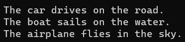
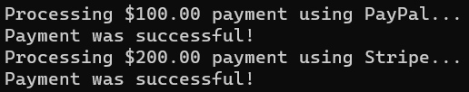
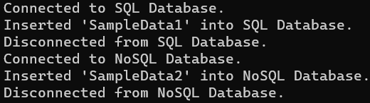

در این مقاله، من در مورد **چندین مثال بلادرنگ از رابط‌ها در سی‌شارپ** بحث خواهم کرد. در پایان این مقاله، شما مثال‌های بلادرنگ زیر را با استفاده از رابط در سی‌شارپ درک خواهید کرد.

1. **رابط کاربری در سی شارپ چیست؟**
2. **سیستم افزونه**
3. **مدیریت وسایل نقلیه**
4. **ادغام درگاه پرداخت**
5. **عملیات پایگاه داده**
6. **سیستم ثبت وقایع**
7. **شکل رسم**
8. **روش‌های احراز هویت کاربر**
9. **مزایا و معایب رابط‌ها در سی شارپ**
10. **چه زمانی از رابط‌ها (Interfaces) در سی شارپ استفاده کنیم؟**

##### **رابط کاربری در سی شارپ چیست؟**

یک رابط در سی شارپ، تعریف نوعی مشابه کلاس است، اما به جای پیاده‌سازی، یک قرارداد را نشان می‌دهد. این رابط مجموعه‌ای از امضاهای متد، ویژگی‌ها، رویدادها یا شاخص‌ها را بدون ارائه پیاده‌سازی‌های آنها تعریف می‌کند. هر کلاس یا ساختاری که این رابط را اتخاذ می‌کند، باید برای هر عضو تعریف شده توسط رابط، یک پیاده‌سازی مشخص ارائه دهد. در اینجا چند نکته کلیدی در مورد رابط‌ها در سی شارپ آمده است:

- **الزام قراردادی:** یک رابط به عنوان یک قرارداد عمل می‌کند. هر کلاس یا ساختاری که رابط را پیاده‌سازی می‌کند باید با ارائه پیاده‌سازی‌هایی برای همه اعضای رابط، این قرارداد را برآورده کند.
- **بدون پیاده‌سازی:** یک رابط نمی‌تواند شامل هیچ پیاده‌سازی باشد. فقط می‌تواند تعریف داشته باشد.
- **رابط‌های چندگانه:** یک کلاس یا ساختار می‌تواند چندین رابط را پیاده‌سازی کند. این امر راهی برای دستیابی به وراثت چندگانه در C# فراهم می‌کند، که از وراثت چندگانه برای کلاس‌ها پشتیبانی نمی‌کند.
- **بدون تعیین‌کننده‌های دسترسی:** اعضای رابط نمی‌توانند تعیین‌کننده‌های دسترسی مانند public، private یا protected داشته باشند. به طور پیش‌فرض، آنها public هستند، اما شما تعیین‌کننده را مشخص نمی‌کنید.
- **ویژگی‌ها، شاخص‌ها و رویدادها:** جدا از متدها، رابط‌ها می‌توانند ویژگی‌ها، شاخص‌ها و رویدادها را نیز تعریف کنند.

##### **مثال بلادرنگ از رابط در سی شارپ: سیستم افزونه**

یک سیستم افزونه برای یک برنامه چت را در نظر بگیرید که در آن چندین پردازنده پیام می‌توانند به آن متصل شوند. برای مثال، یک پردازنده ممکن است متن را به حروف بزرگ تبدیل کند، دیگری ممکن است کلمات خاصی را سانسور کند و دیگری ممکن است پیام را به زبان دیگری ترجمه کند. بیایید این مثال را با استفاده از رابط در C# پیاده‌سازی کنیم:

```csharp
using System;
using System.Collections.Generic;

namespace InterfaceCSharp
{
    //Step 1: Define the IMessageProcessor interface.
    public interface IMessageProcessor
    {
        string ProcessMessage(string input);
    }

    //Step 2: Create some implementations of the interface.
    // UpperCaseProcessor.cs
    public class UpperCaseProcessor : IMessageProcessor
    {
        public string ProcessMessage(string input)
        {
            return input.ToUpper();
        }
    }

    // CensorshipProcessor.cs
    public class CensorshipProcessor : IMessageProcessor
    {
        private string[] forbiddenWords = { "badword1", "badword2" };  // Example censored words

        public string ProcessMessage(string input)
        {
            foreach (var word in forbiddenWords)
            {
                input = input.Replace(word, "****");
            }
            return input;
        }
    }

    //Step 3: In your chat application, implement the use of these processors.
    public class ChatApp
    {
        private List<IMessageProcessor> messageProcessors = new List<IMessageProcessor>();

        public ChatApp()
        {
            // Add processors to the chat application
            messageProcessors.Add(new UpperCaseProcessor());
            messageProcessors.Add(new CensorshipProcessor());
        }

        public void SendMessage(string message)
        {
            foreach (var processor in messageProcessors)
            {
                message = processor.ProcessMessage(message);
            }

            Console.WriteLine("Sending Message: " + message);
            // Here, you'd typically send the message to the server or another client.
        }
    }

    //Step 4: Testing the application.
    class Program
    {
        static void Main(string[] args)
        {
            ChatApp chat = new ChatApp();
            chat.SendMessage("Hello! Please avoid using badword1 in our chat.");
            // Outputs: "Sending Message: HELLO! PLEASE AVOID USING **** IN OUR CHAT."
            Console.ReadKey();
        }
    }
}
```

این یک مثال ساده است، اما ایده این است که با استفاده از رابط‌ها، می‌توانیم به راحتی عملکرد برنامه چت را با وصل کردن پردازنده‌های پیام مختلف گسترش دهیم. این اصل باز/بسته (یکی از اصول SOLID) را ترویج می‌دهد، که در آن موجودیت‌های نرم‌افزاری باید برای توسعه باز باشند اما برای تغییر بسته باشند. در این حالت، می‌توانید پردازنده‌های بیشتری را بدون تغییر کد موجود اضافه کنید.

##### **مثال بلادرنگ از رابط در سی شارپ: وسایل نقلیه**

تصور کنید انواع مختلفی از وسایل نقلیه مانند ماشین، قایق و هواپیما دارید. هر یک از این وسایل نقلیه می‌توانند حرکت کنند، اما نحوه حرکت آنها متفاوت است. یک برنامه ساده بنویسید که در آن هر نوع وسیله نقلیه، نحوه حرکت خود را نشان دهد. بیایید این مثال را با استفاده از رابط در C# پیاده‌سازی کنیم:

```csharp
using System;
using System.Collections.Generic;

namespace InterfaceCSharp
{
    //Step 1: Define the IMovable interface.
    public interface IMovable
    {
        void Move();
    }

    //Step 2: Implement the interface for different types of vehicles.
    // Car.cs
    public class Car : IMovable
    {
        public void Move()
        {
            Console.WriteLine("The car drives on the road.");
        }
    }

    // Boat.cs
    public class Boat : IMovable
    {
        public void Move()
        {
            Console.WriteLine("The boat sails on the water.");
        }
    }

    // Airplane.cs
    public class Airplane : IMovable
    {
        public void Move()
        {
            Console.WriteLine("The airplane flies in the sky.");
        }
    }
    
    //Step 4: Testing the application.
    class Program
    {
        static void Main(string[] args)
        {
            List<IMovable> vehicles = new List<IMovable>
            {
                new Car(),
                new Boat(),
                new Airplane()
            };

            foreach (var vehicle in vehicles)
            {
                vehicle.Move();
            }
            Console.ReadKey();
        }
    }
}
```

در این مثال بلادرنگ، رابط IMovable به عنوان یک قرارداد عمل می‌کند و تضمین می‌کند که هر نوع وسیله نقلیه‌ای که آن را پیاده‌سازی می‌کند، یک متد Move خواهد داشت. این انتزاع به ما امکان می‌دهد انواع مختلف وسایل نقلیه را به طور یکنواخت مدیریت کنیم، همانطور که در حلقه foreach در برنامه اصلی نشان داده شده است.

با این الگو، اگر بخواهیم انواع بیشتری از وسایل نقلیه (مثلاً دوچرخه، اسکیت‌بورد یا موشک) را معرفی کنیم، برای هر کدام یک کلاس جدید ایجاد می‌کنیم و رابط IMovable را پیاده‌سازی می‌کنیم. برنامه اصلی ما بدون تغییر باقی می‌ماند و برای هر نوع وسیله نقلیه جدید به درستی عمل می‌کند. وقتی کد بالا را اجرا می‌کنید، خروجی زیر را دریافت خواهید کرد:



##### **مثال بلادرنگ از رابط کاربری در سی شارپ: ادغام درگاه پرداخت**

این یک سناریوی معمول در بسیاری از برنامه‌ها است، جایی که ممکن است بخواهید از چندین ارائه‌دهنده پرداخت (مانند PayPal، Stripe و دیگران) پشتیبانی کنید. در این زمینه، رابط‌ها بسیار ارزشمند می‌شوند زیرا به ما امکان می‌دهند یک روش ثابت برای پردازش پرداخت‌ها، صرف نظر از ارائه‌دهنده اصلی، تعریف کنیم. بیایید این مثال را با استفاده از رابط در C# پیاده‌سازی کنیم:

```csharp
using System;

namespace InterfaceCSharp
{
    //Step 1: Define the IPaymentGateway interface.
    public interface IPaymentGateway
    {
        bool ProcessPayment(decimal amount);
    }

    //Step 2: Implement the interface for different payment providers.
    // PayPalPaymentGateway.cs
    public class PayPalPaymentGateway : IPaymentGateway
    {
        public bool ProcessPayment(decimal amount)
        {
            // Call PayPal's API to process the payment
            Console.WriteLine($"Processing ${amount} payment using PayPal...");
            return true;  // assume success for the sake of this example
        }
    }

    // StripePaymentGateway.cs
    public class StripePaymentGateway : IPaymentGateway
    {
        public bool ProcessPayment(decimal amount)
        {
            // Call Stripe's API to process the payment
            Console.WriteLine($"Processing ${amount} payment using Stripe...");
            return true;  // assume success for this example
        }
    }

    //Step 3: Use the implementations in a shopping cart scenario.
    public class ShoppingCart
    {
        private IPaymentGateway _paymentGateway;

        public ShoppingCart(IPaymentGateway paymentGateway)
        {
            _paymentGateway = paymentGateway;
        }

        public void Checkout(decimal amount)
        {
            if (_paymentGateway.ProcessPayment(amount))
            {
                Console.WriteLine("Payment was successful!");
            }
            else
            {
                Console.WriteLine("Payment failed. Please try again.");
            }
        }
    }

    //Step 4: Testing the application.
    class Program
    {
        static void Main(string[] args)
        {
            // Customer selects PayPal as their preferred payment method
            ShoppingCart cart = new ShoppingCart(new PayPalPaymentGateway());
            cart.Checkout(100.00M);

            // Another customer selects Stripe
            cart = new ShoppingCart(new StripePaymentGateway());
            cart.Checkout(200.00M);

            Console.ReadKey();
        }
    }
}
```

در این مثال بلادرنگ، رابط IPaymentGateway جزئیات پردازش پرداخت‌ها را خلاصه می‌کند. کلاس ShoppingCart نیازی به دانستن جزئیات هر ارائه‌دهنده پرداخت ندارد. این کلاس ProcessPayment نام دارد و ارائه‌دهنده پرداخت صحیح بقیه کارها را انجام می‌دهد.

این معماری، افزودن ارائه‌دهندگان پرداخت بیشتر را در آینده آسان می‌کند. وقتی می‌خواهید یک ارائه‌دهنده پرداخت جدید اضافه کنید، رابط IPaymentGateway را پیاده‌سازی کنید و بقیه سیستم می‌تواند بدون تغییر باقی بماند. وقتی کد بالا را اجرا می‌کنید، خروجی زیر را دریافت خواهید کرد:



##### **مثال بلادرنگ از رابط در سی شارپ: عملیات پایگاه داده**

فرض کنید ما روی برنامه‌ای کار می‌کنیم که در آن نیاز به پشتیبانی از تعامل با انواع مختلف پایگاه‌های داده داریم. با استفاده از رابط‌ها، می‌توانیم برنامه خود را انعطاف‌پذیر، قابل توسعه و جدا از ویژگی‌های خاص هر پایگاه داده کنیم. بیایید این مثال را با استفاده از رابط در C# پیاده‌سازی کنیم:

```csharp
using System;

namespace InterfaceCSharp
{
    //Step 1: Define the IDatabase interface.
    public interface IDatabase
    {
        void Connect();
        void Insert(string data);
        void Disconnect();
    }

    //Step 2: Implement the interface for different databases.
    // SqlDatabase.cs
    public class SqlDatabase : IDatabase
    {
        public void Connect()
        {
            Console.WriteLine("Connected to SQL Database.");
        }

        public void Insert(string data)
        {
            Console.WriteLine($"Inserted '{data}' into SQL Database.");
        }

        public void Disconnect()
        {
            Console.WriteLine("Disconnected from SQL Database.");
        }
    }

    // NoSqlDatabase.cs
    public class NoSqlDatabase : IDatabase
    {
        public void Connect()
        {
            Console.WriteLine("Connected to NoSQL Database.");
        }

        public void Insert(string data)
        {
            Console.WriteLine($"Inserted '{data}' into NoSQL Database.");
        }

        public void Disconnect()
        {
            Console.WriteLine("Disconnected from NoSQL Database.");
        }
    }

    //Step 3: Use the implementations in an application.
    public class DatabaseManager
    {
        private IDatabase _database;

        public DatabaseManager(IDatabase database)
        {
            _database = database;
        }

        public void AddData(string data)
        {
            _database.Connect();
            _database.Insert(data);
            _database.Disconnect();
        }
    }

    //Step 4: Testing the application.
    class Program
    {
        static void Main(string[] args)
        {
            // Using SQL Database
            DatabaseManager dbManager = new DatabaseManager(new SqlDatabase());
            dbManager.AddData("SampleData1");

            // Using NoSQL Database
            dbManager = new DatabaseManager(new NoSqlDatabase());
            dbManager.AddData("SampleData2");

            Console.ReadKey();
        }
    }
}
```

در این مثال دنیای واقعی، رابط IDatabase یک قرارداد واضح برای عملیات پایگاه داده ارائه می‌دهد و صرف نظر از سیستم پایگاه داده‌ی زیربنایی، سازگاری را تضمین می‌کند. در نتیجه، کلاس DatabaseManager ما با هر سیستم پایگاه داده‌ای که رابط IDatabase را پیاده‌سازی می‌کند، سازگار می‌شود. این بدان معناست که می‌توانیم به راحتی از سیستم‌های پایگاه داده‌ی جدید بدون تغییرات عمده در برنامه‌ی خود پشتیبانی کنیم. وقتی کد بالا را اجرا می‌کنید، خروجی زیر را دریافت خواهید کرد:



##### **مثال بلادرنگ از رابط در سی شارپ: سیستم ثبت وقایع**

بسیاری از برنامه‌ها از مکانیزم‌های ثبت وقایع (logging) برای ردیابی عملیات، خطاها یا اقدامات مهم استفاده می‌کنند. یک برنامه ممکن است نیاز داشته باشد پیام‌ها را در خروجی‌های مختلف مانند کنسول، فایل یا سرویس از راه دور ثبت کند. با استفاده از رابط‌ها، می‌توانیم یک روش عمومی برای ثبت پیام‌ها صرف نظر از محل ثبت آنها تعریف کنیم. بیایید این مثال را با استفاده از رابط در C# پیاده‌سازی کنیم:

```csharp
using System;

namespace InterfaceCSharp
{
    //Step 1: Define the ILogger interface.
    public interface ILogger
    {
        void LogMessage(string message);
    }

    //Step 2: Implement the interface for different logging mechanisms.
    // ConsoleLogger.cs
    public class ConsoleLogger : ILogger
    {
        public void LogMessage(string message)
        {
            Console.WriteLine($"Console: {message}");
        }
    }

    // FileLogger.cs
    public class FileLogger : ILogger
    {
        private string filePath;

        public FileLogger(string filePath)
        {
            this.filePath = filePath;
        }

        public void LogMessage(string message)
        {
            System.IO.File.AppendAllText(filePath, message + Environment.NewLine);
        }
    }

    //Step 3: Use the implementations in an application.
    public class Application
    {
        private ILogger _logger;

        public Application(ILogger logger)
        {
            _logger = logger;
        }

        public void Run()
        {
            // Example of a scenario where we want to log a message
            _logger.LogMessage("Application started.");

            // More code and operations...

            _logger.LogMessage("Application ended.");
        }
    }

    //Step 4: Testing the application.
    class Program
    {
        static void Main(string[] args)
        {
            // Log to console
            Application appWithConsoleLogging = new Application(new ConsoleLogger());
            appWithConsoleLogging.Run();

            // Log to file
            Application appWithFileLogging = new Application(new FileLogger("app.log"));
            appWithFileLogging.Run();

            Console.ReadKey();
        }
    }
}
```

علاوه بر این، پیام‌ها هنگام اجرای برنامه با FileLogger در یک فایل "app.log" ثبت می‌شوند. در این مثال، رابط ILogger روشی یکپارچه برای ثبت پیام‌ها ارائه می‌دهد. مکانیسم‌های مختلف ثبت وقایع را می‌توان به راحتی و بدون تغییر کد اصلی به برنامه ما متصل کرد. این امر تفکیک وظایف را ارتقا می‌دهد و باعث می‌شود که کدبیس به راحتی برای پشتیبانی از مکانیسم‌های جدید ثبت وقایع در آینده قابل توسعه باشد.

##### **مثال بلادرنگ از رابط در سی شارپ: رسم شکل**

تصور کنید که در حال توسعه یک برنامه گرافیکی هستید که در آن باید اشکال مختلفی روی صفحه نمایش داده شوند. هر شکل می‌داند که چگونه خودش را رسم کند، اما نحوه رسم آنها متفاوت است. یک برنامه ساده ایجاد کنید که در آن هر نوع شکل قابل رسم باشد. بیایید این مثال را با استفاده از رابط در C# پیاده‌سازی کنیم:

```csharp
using System;
using System.Collections.Generic;

namespace InterfaceCSharp
{
    //Step 1: Define the IDrawable interface.
    public interface IDrawable
    {
        void Draw();
    }

    //Step 2: Implement the interface for different shapes.
    // Circle.cs
    public class Circle : IDrawable
    {
        public void Draw()
        {
            Console.WriteLine("Drawing a circle.");
        }
    }

    // Rectangle.cs
    public class Rectangle : IDrawable
    {
        public void Draw()
        {
            Console.WriteLine("Drawing a rectangle.");
        }
    }

    // Triangle.cs
    public class Triangle : IDrawable
    {
        public void Draw()
        {
            Console.WriteLine("Drawing a triangle.");
        }
    }
    
    //Step 4: Testing the application.
    class Program
    {
        static void Main(string[] args)
        {
            List<IDrawable> shapes = new List<IDrawable>
            {
                new Circle(),
                new Rectangle(),
                new Triangle()
            };

            foreach (var shape in shapes)
            {
                shape.Draw();
            }

            Console.ReadKey();
        }
    }
}
```

در این مثال، رابط IDrawable قراردادی برای همه اشیاء قابل ترسیم در برنامه است. با پایبندی به این قرارداد، هر شکل می‌داند که چگونه خود را ترسیم کند. برنامه اصلی (یعنی GraphicsApp) اکنون می‌تواند با طیف متنوعی از اشیاء قابل ترسیم کار کند، بدون اینکه نیازی به آگاهی از جزئیات نحوه ترسیم هر شکل داشته باشد.

با استفاده از این الگو، اگر می‌خواستید شکل‌های بیشتری (مانند پنج‌ضلعی، شش‌ضلعی و غیره) ایجاد کنید، برای هر شکل یک کلاس جدید ایجاد می‌کردید و رابط IDrawable را پیاده‌سازی می‌کردید. منطق ترسیم اصلی در برنامه اصلی بدون تغییر باقی می‌ماند، که نشان‌دهنده قابلیت توسعه‌پذیری است که رابط‌ها می‌توانند برای یک سیستم به ارمغان بیاورند.

##### **مثال بلادرنگ از رابط در سی شارپ: متدهای احراز هویت کاربر**

سناریویی را تصور کنید که در آن یک برنامه به کاربران اجازه می‌دهد با استفاده از روش‌های مختلف مانند رمز عبور، اثر انگشت یا تشخیص چهره احراز هویت کنند. مکانیزمی را توسعه دهید که بتواند از چندین روش احراز هویت پشتیبانی کند، بدون اینکه فرآیند احراز هویت اصلی را تغییر دهد. بیایید این مثال را با استفاده از رابط در C# پیاده‌سازی کنیم:

```csharp
using System;
using System.Collections.Generic;

namespace InterfaceCSharp
{
    //Step 1: Define the IAuthenticator interface.
    public interface IAuthenticator
    {
        bool Authenticate();
    }

    //Step 2: Implement the interface for different authentication methods.
    // PasswordAuthenticator.cs
    public class PasswordAuthenticator : IAuthenticator
    {
        public bool Authenticate()
        {
            // Logic for password authentication
            Console.WriteLine("Authenticating using password...");
            return true;  // For simplicity, assume authentication always succeeds
        }
    }

    // FingerprintAuthenticator.cs
    public class FingerprintAuthenticator : IAuthenticator
    {
        public bool Authenticate()
        {
            // Logic for fingerprint authentication
            Console.WriteLine("Authenticating using fingerprint...");
            return true;
        }
    }

    // FaceRecognitionAuthenticator.cs
    public class FaceRecognitionAuthenticator : IAuthenticator
    {
        public bool Authenticate()
        {
            // Logic for face recognition authentication
            Console.WriteLine("Authenticating using face recognition...");
            return true;
        }
    }

    //Step 3: Implement the authentication process using the interfaces.
    public class AuthService
    {
        private IAuthenticator _authenticator;

        public AuthService(IAuthenticator authenticator)
        {
            _authenticator = authenticator;
        }

        public void AuthenticateUser()
        {
            if (_authenticator.Authenticate())
            {
                Console.WriteLine("Authentication successful!");
            }
            else
            {
                Console.WriteLine("Authentication failed.");
            }
        }
    }

    //Step 4: Testing the application.
    class Program
    {
        static void Main(string[] args)
        {
            AuthService passwordService = new AuthService(new PasswordAuthenticator());
            passwordService.AuthenticateUser();

            AuthService fingerprintService = new AuthService(new FingerprintAuthenticator());
            fingerprintService.AuthenticateUser();

            AuthService faceService = new AuthService(new FaceRecognitionAuthenticator());
            faceService.AuthenticateUser();

            Console.ReadKey();
        }
    }
}
```

رابط IAuthenticator روشی سازگار برای پیاده‌سازی روش‌های مختلف احراز هویت ارائه می‌دهد. کلاس اصلی AuthService از جزئیات هر روش جدا می‌ماند. این معماری، افزودن یا تغییر روش‌های احراز هویت را در آینده بدون تأثیر بر منطق اصلی AuthService آسان می‌کند.

##### **مزایا و معایب رابط‌ها در سی شارپ**

رابط‌ها جنبه‌ی حیاتی طراحی شیءگرا هستند و در صورت استفاده‌ی صحیح، مزایای متعددی را ارائه می‌دهند. با این حال، مانند هر ابزار یا مفهومی، آنها مزایا و معایبی دارند.

###### **مزایای رابط‌ها در سی شارپ:**

- **انعطاف‌پذیری و توسعه‌پذیری:** با تعریف عملکرد به عنوان یک رابط، می‌توانید به راحتی پیاده‌سازی‌های واقعی را بدون تأثیر بر کلاینت‌هایی که به رابط متکی هستند، گسترش داده یا تغییر دهید.
- **وراثت چندگانه:** اگرچه سی شارپ از وراثت چندگانه برای کلاس‌ها پشتیبانی نمی‌کند (به این معنی که یک کلاس نمی‌تواند از بیش از یک کلاس ارث‌بری کند)، اما به یک کلاس اجازه می‌دهد تا چندین رابط را پیاده‌سازی کند. این می‌تواند برای شبیه‌سازی وراثت چندگانه استفاده شود.
- **جداسازی:** رابط‌ها مشخصات یک روش یا ویژگی را از پیاده‌سازی واقعی آن جدا می‌کنند. این امر می‌تواند بازسازی، تکامل و تعویض پیاده‌سازی‌ها را در سیستم‌ها آسان‌تر کند.
- **قرارداد اجباری:** پیاده‌سازی یک رابط تضمین می‌کند که یک کلاس به یک قرارداد خاص پایبند است. اگر یک کلاس پیاده‌سازی‌هایی برای همه متدهای یک رابط ارائه ندهد، کامپایلر خطا می‌دهد.
- **چندریختی:** شما می‌توانید از رابط‌ها برای دستیابی به چندریختی استفاده کنید. برای مثال، هر متدی که آرگومانی از نوع رابط را بپذیرد، می‌تواند با هر شیء که آن رابط را پیاده‌سازی می‌کند، کار کند.
- **قابلیت آزمایش:** رابط‌ها امکان آزمایش واحد را آسان‌تر می‌کنند. اشیاء شبیه‌سازی‌شده را می‌توان بر اساس رابط‌ها ایجاد کرد تا اجزای خاص یک برنامه را بدون درگیر کردن وابستگی‌های آنها، جدا و آزمایش کرد.

###### **معایب رابط‌ها در سی شارپ:**

- **سربار:** معرفی رابط‌ها یک لایه انتزاعی اضافی اضافه می‌کند که می‌تواند منجر به افزایش پیچیدگی در طراحی و پیاده‌سازی شود.
- **مشکلات نسخه‌بندی:** اگر نیاز دارید یک متد یا ویژگی جدید به یک رابط اضافه کنید و کتابخانه‌ای را که توسط دیگران استفاده می‌شود، حفظ کنید، این می‌تواند پیاده‌سازی‌های موجود را مختل کند. (اگرچه از C# 8 به بعد، رابط‌ها می‌توانند پیاده‌سازی‌های پیش‌فرض برای متدها داشته باشند که این مشکل را تا حدی کاهش می‌دهد.)
- **از دست دادن وضوح:** اگر رابط‌ها بیش از حد یا به طور نادرست استفاده شوند، گاهی اوقات می‌توانند طراحی مورد نظر یک سیستم را گیج‌کننده یا مبهم کنند، به خصوص اگر بسیاری از کلاس‌ها چندین رابط را پیاده‌سازی کنند.
- **بدون جزئیات پیاده‌سازی:** رابط‌ها نمی‌توانند شامل هیچ پیاده‌سازی واقعی باشند (به جز متدهای پیش‌فرض که از C# 8 شروع می‌شوند)، به این معنی که همه کلاس‌های مشتق شده باید پیاده‌سازی را ارائه دهند. اگر بسیاری از کلاس‌ها پیاده‌سازی مشابه یا یکسانی برای متدهای رابط داشته باشند، این امر گاهی اوقات می‌تواند منجر به کد تکراری شود.
- **افزایش سلسله مراتب:** اگر سیستمی رابط‌های کاربری زیادی داشته باشد، به خصوص رابط‌هایی که فقط یک متد یا ویژگی دارند، می‌تواند منجر به یک سلسله مراتب عمیق شود که پیمایش و درک آن را دشوار می‌کند.

##### **چه زمانی از رابط‌ها (Interfaces) در سی شارپ استفاده کنیم؟**

استفاده مناسب از رابط‌ها می‌تواند در ساخت نرم‌افزارهای قابل نگهداری، انعطاف‌پذیر و مقیاس‌پذیر مفید باشد. در سی شارپ، معمولاً استفاده از رابط‌ها در سناریوهای زیر مد نظر قرار می‌گیرد:

- **پیاده‌سازی‌های چندگانه:** پیاده‌سازی‌های دقیق زمانی متفاوت خواهند بود که انتظار داشته باشید چندین کلاس یک رفتار خاص یا مجموعه‌ای از رفتارها را پیاده‌سازی کنند. یک رابط می‌تواند این رفتار مشترک را تعریف کند. مثال: مکانیسم‌های مختلف ثبت وقایع (ConsoleLogger، FileLogger، DatabaseLogger و غیره) همگی می‌توانند یک رابط ILogger را پیاده‌سازی کنند.
- **جداسازی:** اگر می‌خواهید کلاس‌های خود و پیاده‌سازی‌های آنها را جدا کنید. این می‌تواند منجر به کد ماژولارتر شود و تعویض، آزمایش یا گسترش عملکرد را بدون تغییر اساسی آسان‌تر کند. مثال: تزریق وابستگی در ASP.NET Core به شدت به رابط‌ها برای ارائه و تعویض سرویس‌ها متکی است.
- **انتزاع:** وقتی می‌خواهید جزئیات یک کلاس را پنهان کنید و فقط ویژگی‌های اساسی آن را نشان دهید، استفاده از یک رابط می‌تواند مفید باشد. مثال: در یک سیستم گرافیکی، اشکالی مانند دایره، مستطیل و مثلث می‌توانند یک رابط IDrawable را پیاده‌سازی کنند.
- **دستیابی به چندریختی:** رابط‌ها به کلاس‌های مختلف اجازه می‌دهند تا به عنوان نمونه‌هایی از یک نوع در نظر گرفته شوند و چندریختی را فعال می‌کنند. این امر می‌تواند با اجازه دادن به کلاس‌های مختلف برای استفاده متقابل بر اساس رابط مشترکشان، کد را ساده کند. مثال: هر کلاسی که رابط IComparable را پیاده‌سازی می‌کند، می‌تواند با استفاده از الگوریتم‌های عمومی مرتب شود.
- **اجرای قرارداد:** وقتی می‌خواهید مطمئن شوید که کلاس‌های خاصی متدها یا ویژگی‌های خاصی را پیاده‌سازی می‌کنند، یک رابط به عنوان قراردادی عمل می‌کند که این امر را اجرا می‌کند. اگر کلاسی قرارداد را رعایت نکند، خطای زمان کامپایل دریافت خواهید کرد. مثال: پیاده‌سازی رابط IEnumerable تضمین می‌کند که یک کلاس برای عناصر خود یک شمارنده (enumerator) فراهم می‌کند.
- **معماری افزونه:** اگر در حال طراحی سیستمی هستید که اشخاص ثالث ممکن است آن را با افزونه‌ها یا قابلیت‌های اضافی گسترش دهند، رابط‌ها می‌توانند به عنوان طرحی برای این افزونه‌ها عمل کنند. مثال: یک پخش‌کننده رسانه که افزونه‌های کدک شخص ثالث را پشتیبانی می‌کند، ممکن است یک رابط ICodec داشته باشد.
- **شبیه‌سازی وراثت چندگانه:** سی‌شارپ از وراثت چندگانه برای کلاس‌ها پشتیبانی نمی‌کند، اما یک کلاس می‌تواند چندین رابط را پیاده‌سازی کند. این می‌تواند مفید باشد اگر بخواهید یک کلاس رفتارها را از چندین منبع به ارث ببرد. مثال: یک کلاس Smartphone می‌تواند هر دو رابط ICamera و IPhone را پیاده‌سازی کند.
- **استانداردسازی APIها:** هنگام ایجاد کتابخانه‌ها یا چارچوب‌ها برای استفاده دیگران، رابط‌ها می‌توانند به استانداردسازی API کمک کنند و نحوه تعامل با کتابخانه شما را برای کاربران روشن سازند. مثال: رابط IDisposable در .NET روشی استاندارد برای آزادسازی منابع مدیریت نشده ارائه می‌دهد.