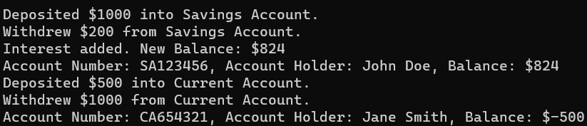
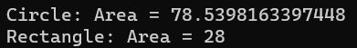

## **مثال‌های بلادرنگ از کلاس انتزاعی در سی شارپ**

در این مقاله، من در مورد **مثال‌های متعدد بلادرنگ از کلاس‌های انتزاعی در سی‌شارپ** بحث خواهم کرد. در پایان این مقاله، شما مثال‌های بلادرنگ زیر را با استفاده از کلاس انتزاعی در سی‌شارپ درک خواهید کرد.

1. **کلاس انتزاعی در سی شارپ چیست؟**
2. **سیستم بانکی**
3. **مدیریت اشکال**
4. **قلمرو حیوانات**
5. **وسایل نقلیه** **سیستم مدیریت**
6. **کارمندان در یک سازمان**
7. **پخش کننده‌های رسانه**
8. **مزایا و معایب کلاس انتزاعی در سی شارپ**
9. **چه زمانی از کلاس انتزاعی در سی شارپ استفاده کنیم؟**

##### **کلاس انتزاعی در سی شارپ چیست؟**

یک کلاس انتزاعی در سی شارپ، کلاس خاصی است که نمی‌توان مستقیماً از آن نمونه‌سازی کرد. در عوض، به عنوان یک کلاس پایه برای کلاس‌های دیگر عمل می‌کند. یک کلاس انتزاعی می‌تواند شامل متدهای انتزاعی (که هیچ پیاده‌سازی ندارند) و متدهای غیر انتزاعی (که پیاده‌سازی دارند) باشد. کلاس‌های مشتق شده که از یک کلاس انتزاعی ارث‌بری می‌کنند، باید پیاده‌سازی‌هایی برای متدهای انتزاعی خود ارائه دهند. در اینجا ویژگی‌ها و قابلیت‌های کلیدی یک کلاس انتزاعی در سی شارپ آمده است:

- **نمی‌توان نمونه‌سازی کرد:** شما نمی‌توانید با استفاده از کلمه کلیدی new، یک شیء از یک کلاس انتزاعی ایجاد کنید.
- **متدهای انتزاعی:** یک کلاس انتزاعی می‌تواند شامل متدهای انتزاعی باشد که بدنه ندارند. کلاس‌های مشتق شده باید این متدها را بازنویسی کرده و پیاده‌سازی کنند.
- **متدهای غیر انتزاعی:** یک کلاس انتزاعی می‌تواند شامل متدهای غیر انتزاعی با بدنه تعریف شده باشد. کلاس‌های مشتق شده می‌توانند از این متدها به همان شکلی که هستند استفاده کنند یا در صورت نیاز آنها را بازنویسی کنند.
- **ویژگی‌ها و فیلدها:** کلاس‌های انتزاعی می‌توانند مانند هر کلاس دیگری شامل ویژگی‌ها و فیلدها باشند.
- **سازنده‌ها:** اگرچه ممکن است دور از ذهن به نظر برسد، اما کلاس‌های انتزاعی می‌توانند سازنده داشته باشند. اگرچه نمی‌توانید مستقیماً از یک کلاس انتزاعی نمونه‌سازی کنید، کلاس‌های مشتق شده می‌توانند سازنده کلاس انتزاعی را فراخوانی کنند.
- **اصلاح‌کننده‌های دسترسی:** متدهای انتزاعی در یک کلاس انتزاعی می‌توانند اصلاح‌کننده‌های دسترسی مانند public، protected و غیره داشته باشند. اگر هیچ اصلاح‌کننده دسترسی مشخص نشده باشد، protected پیش‌فرض است.

##### **مثال بلادرنگ از کلاس انتزاعی در سی شارپ: سیستم بانکی**

بیایید با در نظر گرفتن سناریویی مربوط به سیستم بانکی، یک مثال بلادرنگ از یک کلاس انتزاعی در C# را بررسی کنیم.

- **کلاس انتزاعی – حساب بانکی**
- **کلاس‌های عینی – حساب پس‌انداز، حساب جاری**

بیایید این مثال را با استفاده از کلاس انتزاعی در سی شارپ پیاده‌سازی کنیم:

```csharp
using System;

namespace AbstractClassCSharp
{
    //BankAccount.cs (Abstract Class)
    public abstract class BankAccount
    {
        public string AccountNumber { get; private set; }
        public string AccountHolder { get; private set; }
        protected double Balance { get; set; }

        public BankAccount(string accountNumber, string accountHolder)
        {
            AccountNumber = accountNumber;
            AccountHolder = accountHolder;
        }

        // Abstract methods
        public abstract void Deposit(double amount);
        public abstract void Withdraw(double amount);

        // Virtual method with a default implementation
        public virtual void DisplayBalance()
        {
            Console.WriteLine($"Account Number: {AccountNumber}, Account Holder: {AccountHolder}, Balance: ${Balance}");
        }
    }

    //SavingsAccount.cs (Concrete Class)
    public class SavingsAccount : BankAccount
    {
        private double _interestRate = 0.03; // 3% annual interest

        public SavingsAccount(string accountNumber, string accountHolder)
            : base(accountNumber, accountHolder) { }

        public override void Deposit(double amount)
        {
            Balance += amount;
            Console.WriteLine($"Deposited ${amount} into Savings Account.");
        }

        public override void Withdraw(double amount)
        {
            if (Balance - amount >= 0)
            {
                Balance -= amount;
                Console.WriteLine($"Withdrew ${amount} from Savings Account.");
            }
            else
            {
                Console.WriteLine("Insufficient funds for withdrawal.");
            }
        }

        public void AddInterest()
        {
            Balance += Balance * _interestRate;
            Console.WriteLine($"Interest added. New Balance: ${Balance}");
        }
    }

    //CurrentAccount.cs (Concrete Class)
    public class CurrentAccount : BankAccount
    {
        private double _overdraftLimit = 1000.0;

        public CurrentAccount(string accountNumber, string accountHolder)
            : base(accountNumber, accountHolder) { }

        public override void Deposit(double amount)
        {
            Balance += amount;
            Console.WriteLine($"Deposited ${amount} into Current Account.");
        }

        public override void Withdraw(double amount)
        {
            if ((Balance - amount) >= -_overdraftLimit)
            {
                Balance -= amount;
                Console.WriteLine($"Withdrew ${amount} from Current Account.");
            }
            else
            {
                Console.WriteLine("Withdrawal exceeds overdraft limit.");
            }
        }
    }

    //Step 4: Testing the application.
    class Program
    {
        static void Main(string[] args)
        {
            SavingsAccount johnsSavings = new SavingsAccount("SA123456", "John Doe");
            johnsSavings.Deposit(1000);
            johnsSavings.Withdraw(200);
            johnsSavings.AddInterest();
            johnsSavings.DisplayBalance();

            CurrentAccount janesCurrent = new CurrentAccount("CA654321", "Jane Smith");
            janesCurrent.Deposit(500);
            janesCurrent.Withdraw(1000);
            janesCurrent.DisplayBalance();

            Console.ReadKey();
        }
    }
}
```

در این مثال، کلاس انتزاعی BankAccount ساختار و عملکردهای اساسی هر حساب بانکی، مانند واریز و برداشت پول را تعریف می‌کند. کلاس‌های عینی SavingsAccount و CurrentAccount، پیاده‌سازی‌های خاصی را برای این عملکردها ارائه می‌دهند و ممکن است ویژگی‌های اضافی مانند افزودن بهره یا مدیریت اضافه برداشت‌ها را نیز داشته باشند. وقتی کد بالا را اجرا می‌کنید، خروجی زیر را دریافت خواهید کرد:



##### **مثال بلادرنگ از کلاس انتزاعی در سی شارپ: شکل‌ها**

بیایید از مثال کلاسیک سلسله مراتب شکل برای نشان دادن مفهوم کلاس انتزاعی در سی شارپ استفاده کنیم.

- **کلاس انتزاعی - شکل**
- **کلاس‌های عینی – دایره، مستطیل**

بیایید این مثال را با استفاده از کلاس انتزاعی در سی شارپ پیاده‌سازی کنیم:

```csharp
using System;
using System.Collections.Generic;

namespace AbstractClassCSharp
{
    //Shape.cs (Abstract Class)
    public abstract class Shape
    {
        public string Name { get; set; }

        // Abstract method with no body
        public abstract double Area();

        // Virtual method with a default implementation
        public virtual void Display()
        {
            Console.WriteLine($"{Name}: Area = {Area()}");
        }
    }

    //Circle.cs (Concrete Class)
    public class Circle : Shape
    {
        public double Radius { get; set; }

        public Circle(double radius)
        {
            Name = "Circle";
            Radius = radius;
        }

        // Concrete implementation of the Area method for Circle
        public override double Area()
        {
            return Math.PI * Radius * Radius;
        }
    }

    //Rectangle.cs (Concrete Class)
    public class Rectangle : Shape
    {
        public double Width { get; set; }
        public double Height { get; set; }

        public Rectangle(double width, double height)
        {
            Name = "Rectangle";
            Width = width;
            Height = height;
        }

        // Concrete implementation of the Area method for Rectangle
        public override double Area()
        {
            return Width * Height;
        }
    }

    //Step 4: Testing the application.
    class Program
    {
        static void Main(string[] args)
        {
            Circle circle = new Circle(5);
            Rectangle rectangle = new Rectangle(4, 7);

            circle.Display();
            rectangle.Display();

            Console.ReadKey();
        }
    }
}
```

وقتی برنامه اصلی را اجرا می‌کنید، خروجی، مساحت دایره و مستطیل را نمایش می‌دهد، همانطور که در تصویر زیر نشان داده شده است. توجه کنید که چگونه کلاس انتزاعی Shape هر کلاس مشتق شده را مجبور به پیاده‌سازی متد Area می‌کند، و تضمین می‌کند که هر شکلی که ایجاد می‌کنیم باید راهی برای محاسبه مساحت خود داشته باشد. از سوی دیگر، متد Display یک پیاده‌سازی پیش‌فرض ارائه می‌دهد، اما در صورت لزوم می‌تواند در کلاس‌های مشتق شده لغو شود.



##### **مثال بلادرنگ از کلاس انتزاعی در سی شارپ: قلمرو حیوانات**

بیایید با در نظر گرفتن سناریویی مربوط به قلمرو حیوانات، یک مثال بلادرنگ دیگر از یک کلاس انتزاعی در سی شارپ را بررسی کنیم.

- **کلاس انتزاعی – حیوان**
- **کلاس‌های عینی – سگ، ماهی**

بیایید این مثال را با استفاده از کلاس انتزاعی در سی شارپ پیاده‌سازی کنیم:

```csharp
using System;

namespace AbstractClassCSharp
{
    //Animal.cs (Abstract Class)
    public abstract class Animal
    {
        public string Name { get; set; }

        // Abstract method with no body
        public abstract void Speak();

        // Virtual method with a default implementation
        public virtual void Eat()
        {
            Console.WriteLine($"{Name} is eating.");
        }
    }

    //Dog.cs (Concrete Class)
    public class Dog : Animal
    {
        public Dog(string name)
        {
            Name = name;
        }

        // Concrete implementation of the Speak method for Dog
        public override void Speak()
        {
            Console.WriteLine($"{Name} says: Woof!");
        }
    }

    //Fish.cs (Concrete Class)
    public class Fish : Animal
    {
        public Fish(string name)
        {
            Name = name;
        }

        // Fish don't traditionally "speak", so we'll implement this differently
        public override void Speak()
        {
            Console.WriteLine($"{Name} bubbles!");
        }

        // Overriding the Eat method specifically for Fish
        public override void Eat()
        {
            Console.WriteLine($"{Name} is nibbling on some seaweed.");
        }
    }

    //Step 4: Testing the application.
    class Program
    {
        static void Main(string[] args)
        {
            Dog dog = new Dog("Buddy");
            Fish fish = new Fish("Nemo");

            dog.Speak();
            dog.Eat();

            fish.Speak();
            fish.Eat();
            
            Console.ReadKey();
        }
    }
}
```

وقتی برنامه اصلی را اجرا می‌کنید، رفتارهای متفاوت کلاس‌های Dog و Fish را مشاهده خواهید کرد. کلاس انتزاعی Animal تضمین می‌کند که همه انواع حیوانات باید راهی برای صحبت کردن داشته باشند، اما نحوه انجام این کار (پارس کردن، قل‌قل کردن و غیره) به حیوان خاص بستگی دارد. متد Eat یک رفتار پیش‌فرض ارائه می‌دهد، اما می‌تواند برای حیوانات خاص، مانند مورد Fish، نیز لغو شود.

##### **مثال بلادرنگ از کلاس انتزاعی در سی شارپ: وسایل نقلیه**

بیایید با در نظر گرفتن سناریویی مربوط به وسایل نقلیه، یک مثال بلادرنگ دیگر از یک کلاس انتزاعی در C# را بررسی کنیم.

- **کلاس انتزاعی – وسیله نقلیه**
- **کلاس‌های بتنی - ماشین، دوچرخه**

بیایید این مثال را با استفاده از کلاس انتزاعی در سی شارپ پیاده‌سازی کنیم:

```csharp
using System;

namespace AbstractClassCSharp
{
    //Vehicle.cs (Abstract Class)
    public abstract class Vehicle
    {
        public string Brand { get; set; }

        // Abstract method with no body
        public abstract void Move();

        // Virtual method with a default implementation
        public virtual void Refuel()
        {
            Console.WriteLine($"{Brand} is refueling.");
        }
    }

    //Car.cs (Concrete Class)
    public class Car : Vehicle
    {
        public Car(string brand)
        {
            Brand = brand;
        }

        // Concrete implementation of the Move method for Car
        public override void Move()
        {
            Console.WriteLine($"{Brand} car is driving.");
        }

        // Overriding the Refuel method for Car
        public override void Refuel()
        {
            Console.WriteLine($"{Brand} car is filling up with gas.");
        }
    }

    //Bicycle.cs (Concrete Class)
    public class Bicycle : Vehicle
    {
        public Bicycle(string brand)
        {
            Brand = brand;
        }

        // Concrete implementation of the Move method for Bicycle
        public override void Move()
        {
            Console.WriteLine($"{Brand} bicycle is pedaling.");
        }

        // Overriding the Refuel method specifically for Bicycle as they don't traditionally refuel
        public override void Refuel()
        {
            Console.WriteLine($"{Brand} bicycle doesn't need to refuel.");
        }
    }

    //Step 4: Testing the application.
    class Program
    {
        static void Main(string[] args)
        {
            Car toyota = new Car("Toyota");
            Bicycle trek = new Bicycle("Trek");

            toyota.Move();
            toyota.Refuel();

            trek.Move();
            trek.Refuel();

            Console.ReadKey();
        }
    }
}
```

وقتی برنامه اصلی را اجرا می‌کنید، متوجه رفتارهای متمایز کلاس‌های Car و Bicycle خواهید شد. کلاس انتزاعی Vehicle الزام می‌کند که همه انواع وسایل نقلیه دارای متدی برای Move باشند. با این حال، رفتار دقیق آن حرکت (رانندگی یا رکاب زدن) به نوع خاص وسیله نقلیه بستگی دارد. متد Refuel یک رفتار پیش‌فرض ارائه می‌دهد اما می‌تواند برای انواع خاص وسیله نقلیه سفارشی‌سازی شود، همانطور که در این مثال با ماشین و دوچرخه دیده می‌شود.

##### **مثال بلادرنگ از کلاس انتزاعی در سی شارپ: کارمندان در یک سازمان**

بیایید با در نظر گرفتن سناریویی مربوط به کارمندان در یک سازمان، یک مثال بلادرنگ دیگر از یک کلاس انتزاعی در C# را بررسی کنیم.

- **کلاس انتزاعی – کارمند**
- **کلاس‌های عینی – مدیر، توسعه‌دهنده**

بیایید این مثال را با استفاده از کلاس انتزاعی در سی شارپ پیاده‌سازی کنیم:

```csharp
using System;

namespace AbstractClassCSharp
{
    //Employee.cs (Abstract Class)
    public abstract class Employee
    {
        public string Name { get; set; }
        public string EmployeeID { get; set; }

        // Constructor
        public Employee(string name, string employeeID)
        {
            Name = name;
            EmployeeID = employeeID;
        }

        // Abstract method with no body
        public abstract void PerformTask();

        // Virtual method with a default implementation
        public virtual void AttendMeeting()
        {
            Console.WriteLine($"{Name} is attending a general meeting.");
        }
    }

    //Manager.cs (Concrete Class)
    public class Manager : Employee
    {
        public Manager(string name, string employeeID) : base(name, employeeID) { }

        // Concrete implementation of the PerformTask method for Manager
        public override void PerformTask()
        {
            Console.WriteLine($"{Name} is assigning tasks to team members.");
        }

        // Overriding the AttendMeeting method for Manager
        public override void AttendMeeting()
        {
            Console.WriteLine($"{Name} is attending a managerial meeting.");
        }
    }

    //Developer.cs (Concrete Class)
    public class Developer : Employee
    {
        public Developer(string name, string employeeID) : base(name, employeeID) { }

        // Concrete implementation of the PerformTask method for Developer
        public override void PerformTask()
        {
            Console.WriteLine($"{Name} is writing code.");
        }
    }

    //Step 4: Testing the application.
    class Program
    {
        static void Main(string[] args)
        {
            Manager alice = new Manager("Alice", "M001");
            Developer bob = new Developer("Bob", "D001");

            alice.PerformTask();
            alice.AttendMeeting();

            bob.PerformTask();
            bob.AttendMeeting();

            Console.ReadKey();
        }
    }
}
```

در این مثال، کلاس انتزاعی Employee یک ساختار پایه برای انواع مختلف کارمندان در یک سازمان ارائه می‌دهد. هر نوع خاص از کارمندان، مانند مدیر یا توسعه‌دهنده، وظایف و فعالیت‌های منحصر به فردی برای نقش خود دارد. استفاده از یک کلاس انتزاعی تضمین می‌کند که همه انواع کارمندان مشتق شده، متد PerformTask را پیاده‌سازی می‌کنند. علاوه بر این، یک متد مجازی، AttendMeeting، دارای یک رفتار پیش‌فرض است، اما در صورت لزوم می‌تواند برای نقش‌های خاص کارمندان لغو شود.

##### **مثال بلادرنگ از کلاس انتزاعی در سی شارپ: پخش کننده‌های رسانه**

بیایید با در نظر گرفتن سناریویی مربوط به پخش‌کننده‌های رسانه، یک مثال بلادرنگ دیگر از یک کلاس انتزاعی در سی‌شارپ را بررسی کنیم.

- **کلاس انتزاعی – مدیا پلیر**
- **کلاس‌های عینی – پخش‌کننده صوتی، پخش‌کننده ویدیویی**

بیایید این مثال را با استفاده از کلاس انتزاعی در سی شارپ پیاده‌سازی کنیم:

```csharp
using System;

namespace AbstractClassCSharp
{
    //MediaPlayer.cs (Abstract Class)
    public abstract class MediaPlayer
    {
        public string FileName { get; set; }

        // Abstract methods with no body
        public abstract void Play();
        public abstract void Pause();
        public abstract void Stop();

        // Virtual method with a default implementation
        public virtual void LoadFile(string fileName)
        {
            FileName = fileName;
            Console.WriteLine($"Loaded file: {FileName}");
        }
    }

    //AudioPlayer.cs (Concrete Class)
    public class AudioPlayer : MediaPlayer
    {
        // Concrete implementations of the abstract methods
        public override void Play()
        {
            Console.WriteLine($"Playing audio: {FileName}");
        }

        public override void Pause()
        {
            Console.WriteLine($"Pausing audio: {FileName}");
        }

        public override void Stop()
        {
            Console.WriteLine($"Stopping audio: {FileName}");
        }
    }

    //VideoPlayer.cs (Concrete Class)
    public class VideoPlayer : MediaPlayer
    {
        // Concrete implementations of the abstract methods
        public override void Play()
        {
            Console.WriteLine($"Playing video: {FileName}");
        }

        public override void Pause()
        {
            Console.WriteLine($"Pausing video: {FileName}");
        }

        public override void Stop()
        {
            Console.WriteLine($"Stopping video: {FileName}");
        }
    }

    //Step 4: Testing the application.
    class Program
    {
        static void Main(string[] args)
        {
            AudioPlayer music = new AudioPlayer();
            music.LoadFile("song.mp3");
            music.Play();
            music.Pause();
            music.Stop();

            VideoPlayer movie = new VideoPlayer();
            movie.LoadFile("movie.mp4");
            movie.Play();
            movie.Pause();
            movie.Stop();

            Console.ReadKey();
        }
    }
}
```

در این مثال، کلاس انتزاعی MediaPlayer توابع اساسی که هر پخش‌کننده رسانه‌ای باید داشته باشد (پخش، مکث، توقف) را شرح می‌دهد، اما نحوه عملکرد این توابع را تعریف نمی‌کند - این کار برای کلاس‌های عینی باقی مانده است. سپس کلاس‌های عینی AudioPlayer و VideoPlayer پیاده‌سازی‌های خاصی را برای این قابلیت‌ها ارائه می‌دهند.

این انتزاع به توسعه‌دهندگان اجازه می‌دهد تا در آینده انواع پخش‌کننده‌های رسانه‌ای بیشتری، شاید برای پخش جریانی یا سایر قالب‌های رسانه‌ای، ایجاد کنند و اطمینان حاصل کنند که همه آنها به یک مجموعه استاندارد از عملیات پایبند هستند.

##### **مزایا و معایب کلاس انتزاعی در سی شارپ**

کلاس‌های انتزاعی در سی‌شارپ چیزی بین کلاس‌های پایه (کلاس‌های معمولی) و رابط‌ها هستند. آن‌ها مزایا و معایب خاص خود را دارند:

###### **مزایای کلاس‌های انتزاعی در سی شارپ:**

- **قابلیت استفاده مجدد از کد:** کلاس‌های انتزاعی به شما امکان می‌دهند پیاده‌سازی‌های پیش‌فرض را برای متدها تعریف کنید (برخلاف رابط‌ها در نسخه‌های قبل از ۸.۰ سی‌شارپ). این امر قابلیت استفاده مجدد را افزایش می‌دهد زیرا کلاس‌های مشتق شده می‌توانند از پیاده‌سازی پیش‌فرض استفاده کنند و فقط موارد ضروری را لغو کنند.
- **انعطاف‌پذیری:** کلاس‌های انتزاعی می‌توانند ترکیبی از متدها را تعریف کنند. آن‌ها می‌توانند متدهای انتزاعی (بدون پیاده‌سازی) و متدهای ملموس (با پیاده‌سازی) داشته باشند. این امر تعادلی بین اجرای قرارداد و ارائه یک رفتار پیش‌فرض ایجاد می‌کند.
- **نگهداری وضعیت:** برخلاف رابط‌ها، کلاس‌های انتزاعی می‌توانند فیلدها و ویژگی‌ها را داشته باشند که به آنها امکان نگهداری وضعیت را می‌دهد.
- **منطق سازنده:** کلاس‌های انتزاعی می‌توانند سازنده داشته باشند. این می‌تواند برای تنظیم حالت‌های اولیه یا اعمال شرایط خاص هنگام نمونه‌سازی یک کلاس مشتق شده مفید باشد.
- **کنترل:** با استفاده از کلاس‌های انتزاعی، می‌توانید یک سلسله مراتب یا ساختار را برای کلاس‌های مشتق شده اعمال کنید. به عنوان مثال، می‌توانید سطوح دسترسی به متدها، ویژگی‌ها یا فیلدها را کنترل کنید تا اطمینان حاصل شود که آنها به درستی توسط کلاس‌های مشتق شده استفاده می‌شوند.

###### **معایب کلاس‌های انتزاعی در سی شارپ:**

- **وراثت تکی:** یکی از مهمترین معایب کلاس‌های انتزاعی این است که سی‌شارپ از وراثت چندگانه برای کلاس‌ها پشتیبانی نمی‌کند. یک کلاس نمی‌تواند از بیش از یک کلاس (چه انتزاعی و چه غیر انتزاعی) ارث‌بری کند. بنابراین، اگر کلاسی از قبل از یک کلاس انتزاعی ارث‌بری کرده باشد، نمی‌تواند از کلاس دیگری ارث‌بری کند.
- **افزایش پیچیدگی:** برای سیستم‌های بزرگ‌تر یا سیستم‌هایی که به طور نامناسب طراحی شده‌اند، داشتن شبکه‌ای از کلاس‌های انتزاعی و مشتق‌شده از اجزای واقعی می‌تواند درک، نگهداری و اشکال‌زدایی سیستم را دشوارتر کند.
- **مشکلات نسخه‌بندی:** اگر نیاز دارید یک متد جدید به یک کلاس انتزاعی در کتابخانه‌ای که دیگران استفاده می‌کنند اضافه کنید، ممکن است کلاس‌های مشتق شده موجود آنها را از کار بیندازید. اکنون آن کلاس‌ها پیاده‌سازی‌هایی برای متدهای انتزاعی جدید نخواهند داشت.
- **انعطاف‌پذیری کمتر در کلاس‌های مشتق‌شده:** کلاس‌های مشتق‌شده به ساختار و رفتار تعریف‌شده در کلاس انتزاعی محدود هستند. گاهی اوقات، اگر یک کلاس مشتق‌شده نیاز به نمایش رفتاری داشته باشد که به‌طور قابل‌توجهی از قرارداد تعریف‌شده متفاوت باشد، این می‌تواند بسیار محدودکننده باشد.
- **سربار:** ممکن است سربار تعریف متدهای انتزاعی وجود داشته باشد که ممکن است در تمام کلاس‌های مشتق شده لغو شوند. این امر ممکن است رابط‌ها را در چنین سناریوهایی به گزینه بهتری تبدیل کند.

##### **چه زمانی از کلاس انتزاعی در سی شارپ استفاده کنیم؟**

در سی شارپ، تصمیم‌گیری در مورد زمان استفاده از یک کلاس انتزاعی معمولاً به الزامات خاص طراحی شما بستگی دارد. در اینجا چند سناریو یا معیار برای کمک به تعیین زمان مناسب برای استفاده از یک کلاس انتزاعی آورده شده است:

- **پیاده‌سازی پیش‌فرض:** اگر می‌خواهید پیاده‌سازی پیش‌فرضی برای برخی از متدها ارائه دهید، اما همچنان بخواهید زیرکلاس‌ها را مجبور به پیاده‌سازی متدهای دیگر کنید، یک کلاس انتزاعی ایده‌آل است. کلاس انتزاعی می‌تواند شامل متدهای انتزاعی (بدون پیاده‌سازی) و ملموس (با پیاده‌سازی) باشد.
- **حالت مشترک:** وقتی چندین کلاس مشتق شده باید حالت مشترکی (فیلدها یا ویژگی‌ها) داشته باشند، یک کلاس انتزاعی مفید است. برخلاف رابط‌ها، کلاس‌های انتزاعی می‌توانند فیلدها و ویژگی‌ها را داشته باشند و به شما امکان می‌دهند حالت را کپسوله‌سازی کنید.
- **وراثت کنترل‌شده:** اگر می‌خواهید زنجیره وراثت را کنترل کنید، یعنی مطمئن شوید که هنگام فراخوانی یک متد در یک کلاس مشتق شده، یک قطعه کد خاص همیشه اجرا می‌شود، می‌توانید از یک کلاس انتزاعی استفاده کنید و آن کد را در کلاس انتزاعی پایه تعریف کنید.
- **منطق پایه مشترک با سازنده‌ها:** کلاس‌های انتزاعی می‌توانند سازنده داشته باشند که می‌تواند برای تنظیم حالت اولیه یا اعمال شرایط اولیه خاص برای کلاس‌های مشتق شده مفید باشد.
- **نسخه‌بندی:** اگر در حال ساخت یک کتابخانه هستید و این احتمال وجود دارد که در آینده متدهای بیشتری اضافه کنید، یک کلاس انتزاعی مسیر سرراست‌تری را برای نسخه‌بندی ارائه می‌دهد. اضافه کردن متدهای جدید به یک رابط، پیاده‌سازی‌های موجود را از بین می‌برد، اما اضافه کردن آنها به یک کلاس انتزاعی (با پیاده‌سازی پیش‌فرض) این کار را نمی‌کند.
- **رابطه‌ی Is-A:** اگر کلاس‌های مشتق‌شده ذاتاً باید نوعی از کلاس پایه باشند، در این صورت یک کلاس انتزاعی مناسب است. برای مثال، در سناریویی با کلاس پایه Bird و کلاس‌های مشتق‌شده Eagle و Penguin، رابطه‌ی «Eagle is a Bird» منطقی است و یک کلاس انتزاعی می‌تواند برای تعریف ویژگی‌ها و رفتارهای رایج پرنده استفاده شود.
- **وراثت تکی:** اگر مطمئن هستید که کلاس مشتق شده نیازی به ارث بردن از چندین منبع ندارد، پس یک کلاس انتزاعی یک انتخاب معتبر است. سی شارپ از وراثت چندگانه برای کلاس‌ها پشتیبانی نمی‌کند، بنابراین وقتی یک کلاس از یک کلاس انتزاعی ارث می‌برد، نمی‌تواند از کلاس دیگری ارث ببرد.

با این حال، موقعیت‌های خاصی وجود دارد که رابط‌ها ممکن است انتخاب مناسب‌تری باشند:

- **وراثت چندگانه از نوع:** اگر می‌خواهید یک کلاس چندین قرارداد یا رفتار را بدون مشخص کردن پیاده‌سازی اتخاذ کند، رابط‌ها بهترین گزینه هستند. یک کلاس می‌تواند چندین رابط را پیاده‌سازی کند.
- **تعریف قرارداد خالص:** اگر فقط می‌خواهید قراردادی تعریف کنید که چندین کلاس بدون هیچ پیاده‌سازی پیش‌فرضی به آن پایبند باشند، استفاده از رابط منطقی است (اگرچه C# 8.0 و نسخه‌های بعدی آن امکان پیاده‌سازی پیش‌فرض در رابط‌ها را فراهم می‌کنند).

اینکه از یک کلاس انتزاعی استفاده کنید یا نه، به الزامات خاص طراحی شما بستگی دارد. اگر می‌خواهید یک قرارداد خاص را اجرا کنید، اما برخی رفتارهای پیش‌فرض را نیز ارائه دهید یا یک حالت را حفظ کنید، کلاس‌های انتزاعی می‌توانند مفید باشند. با این حال، اگر می‌خواهید از یک قرارداد اطمینان حاصل کنید، رابط‌ها ممکن است انتخاب بهتری باشند، به خصوص با پیشرفت‌های رابط‌ها در C# 8.0 و بالاتر که امکان پیاده‌سازی رابط‌های پیش‌فرض را فراهم می‌کنند.
```