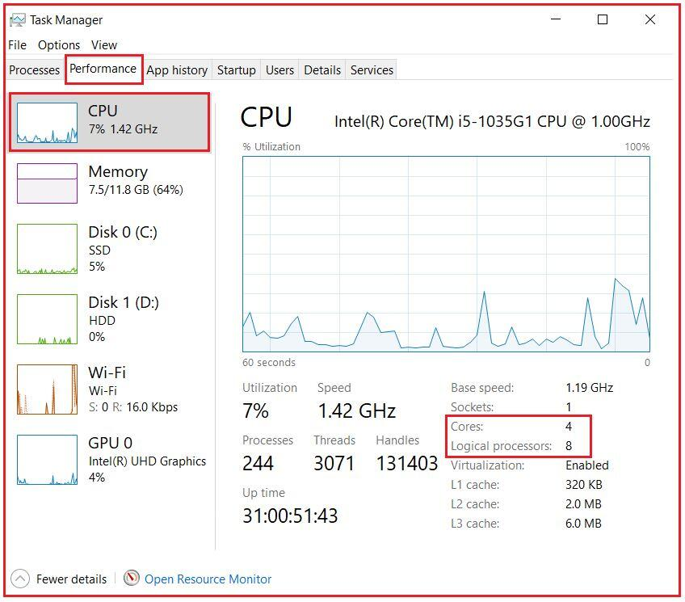
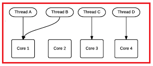

## **کتابخانه موازی‌سازی وظایف در سی‌شارپ به همراه مثال (TPL در سی‌شارپ)**

در این مقاله، قصد دارم **مروری بر برنامه‌نویسی موازی و** **کتابخانه‌ی موازی وظایف در سی‌شارپ** به همراه مثال‌هایی، داشته باشم. لطفاً مقالات قبلی ما را که در آن‌ها به برنامه‌نویسی ناهمگام در سی‌شارپ پرداخته‌ایم، مطالعه کنید. کتابخانه‌ی موازی وظایف نیز شناخته می‌شود در سی‌شارپ با نام TPL. در پایان این مقاله، خواهید فهمید که کتابخانه‌ی موازی وظایف چیست و چرا در برنامه‌های سی‌شارپ به آن نیاز داریم.

##### **مقدمه‌ای بر موازی‌سازی**

وقت آن رسیده که در مورد موازی‌سازی صحبت کنیم. با موازی‌سازی، می‌توانیم از پردازنده خود برای انجام چندین عمل به طور همزمان استفاده کنیم. بنابراین، با موازی‌سازی، این فرصت را داریم که سرعت فرآیندهای خاصی از برنامه‌های خود را بهبود بخشیم.

ما این ماژول را با صحبت در مورد چیستی موازی‌سازی شروع خواهیم کرد. بعداً، ابزارهای مختلف موازی‌سازی مانند Parallel.For، Parallel.Foreach و Parallel.Invoke را بررسی خواهیم کرد. همچنین در مورد زمان‌هایی که نباید از موازی‌سازی استفاده کرد صحبت خواهیم کرد. همچنین مفاهیمی مانند روش‌های اتمی، ایمنی نخ و شرایط رقابتی را بررسی خواهیم کرد. سپس مکانیسم‌هایی برای ادغام شرایط رقابتی مانند قفل‌های interlocked و locks را بررسی خواهیم کرد. در نهایت، در مورد PLINQ (Parallel LINQ) صحبت خواهیم کرد.

##### **برنامه‌نویسی موازی در سی‌شارپ چیست؟**

برنامه‌نویسی موازی در سی‌شارپ به ما کمک می‌کند تا یک کار را به بخش‌های مختلف تقسیم کنیم و آن بخش‌ها را به‌طور همزمان انجام دهیم. به‌عنوان مثال، ممکن است مجموعه‌ای از کارت‌های اعتباری داشته باشیم و بخواهیم آن‌ها را به‌طور همزمان پردازش کنیم. یا اگر مجموعه‌ای از تصاویر داشته باشیم و بخواهیم مجموعه‌ای از فیلترها را روی هر یک اعمال کنیم، می‌توانیم این کار را با بهره‌گیری از موازی‌سازی انجام دهیم.

مزیت اصلی موازی‌سازی، صرفه‌جویی در زمان است. با به حداکثر رساندن استفاده از منابع کامپیوتر، در زمان صرفه‌جویی می‌شود. ایده این است که اگر کامپیوتر امکان استفاده از چند نخی (multi-threading) را فراهم کند، می‌توانیم وقتی وظیفه‌ای برای حل داریم از این نخ‌ها استفاده کنیم. بنابراین، به جای استفاده کم از پردازنده با استفاده از یک نخ، می‌توانیم از هر تعداد نخی که می‌توانیم برای سرعت بخشیدن به پردازش وظیفه استفاده کنیم.

به طور کلی، یک استثنا در مزایای استفاده از موازی‌سازی با استفاده از ASP.NET و ASP.NET Core وجود دارد، زیرا این سناریوها از قبل موازی‌سازی شده‌اند. دلیل این امر این است که هر رشته (thread) به یک درخواست HTTP پاسخ می‌دهد. و بنابراین، اگر یک درخواست HTTP داشته باشید که چندین رشته را اشغال کند، سرور وب منابع کمتری برای ارائه سایر درخواست‌های HTTP خواهد داشت.

به طور کلی، ما از موازی‌سازی در عملیات‌های محدود به CPU استفاده می‌کنیم، عملیات‌های محدود به CPU آن دسته از عملیاتی هستند که وضوح آنها به پردازنده بستگی دارد، نه به سرویس‌های خارجی برنامه. انجام یک عملیات حسابی نمونه‌ای از یک عملیات محدود به CPU خواهد بود. گرفتن مجموعه‌ای از تصاویر و اعمال فیلترها و تبدیل‌ها از طریق آنها، یکی دیگر از عملیات محدود به CPU خواهد بود.

این نوع عملیات، آن‌هایی که به CPU وابسته هستند، کاندیدهایی برای استفاده از موازی‌سازی هستند. مهم است بدانیم که موازی‌سازی همیشه از نظر عملکرد مفید نیست، زیرا استفاده از موازی‌سازی هزینه دارد، بنابراین ما همیشه باید اندازه‌گیری‌هایی انجام دهیم تا ثابت کنیم که هزینه موازی‌سازی بیشتر از عدم استفاده از آن نیست. گاهی اوقات وقتی از موازی‌سازی استفاده می‌کنیم، نتیجه یک برنامه کندتر است. یکی از دلایل این امر این است که وقتی می‌خواهیم موازی‌سازی کنیم، بسیار کوچک است یا به کار کافی برای توجیه استفاده از موازی‌سازی نیاز ندارد.

مزیت موازی‌سازی به میزان کاری که باید موازی‌سازی شود بستگی دارد. بنابراین، برنامه‌نویسی موازی در سی‌شارپ برای سیستم‌هایی که باید حجم عظیمی از داده‌ها را پردازش کنند بسیار مهم است. به عنوان مثال، در فیس‌بوک، تقریباً دویست و پنجاه هزار عکس در دقیقه آپلود می‌شود. همانطور که می‌توانید تصور کنید، پردازش چنین حجم بالایی از اطلاعات به قدرت زیادی نیاز دارد. با این حال، پردازنده‌ها به دلیل محدودیت‌های فیزیکی خیلی سریع‌تر نمی‌شوند. کاری که در حال حاضر انجام می‌شود، عمدتاً گنجاندن هسته‌های بیشتر در پردازنده‌ها است. به این ترتیب، می‌توانیم از موازی‌سازی برای انجام وظایف بیشتر در زمان کمتر استفاده کنیم.

توصیه نمی‌شود که برای یک درخواست HTTP چندین thread را اشغال کنید. اگر کار طولانی‌ای برای انجام دادن دارید، توصیه می‌شود از سرویس‌های پس‌زمینه یا برخی فناوری‌های سرور استفاده کنید.

در نهایت، موازی‌سازی در صورتی مزایایی را نشان می‌دهد که رایانه‌ای که برنامه در آن اجرا می‌شود، قابلیت‌های موازی‌سازی را داشته باشد. اگر سعی کنید از موازی‌سازی در رایانه‌ای استفاده کنید که نمی‌تواند از موازی‌سازی استفاده کند، کد به صورت متوالی اجرا می‌شود. یعنی هیچ خطایی ایجاد نمی‌کند، اما سریع‌تر هم نخواهد بود. بنابراین، هدف این است که همه رایانه‌ها نمی‌توانند موازی‌سازی را انجام دهند.

پردازنده‌های مدرن معمولاً چند هسته‌ای هستند. در ویندوز، می‌توانید با رفتن به task manager، سپس انتخاب تب performance و نگاه کردن به CPU، ببینید که آیا کامپیوتر شما چند هسته‌ای است یا خیر. در اینجا می‌توانید تعداد هسته‌های موجود و همچنین پردازنده‌های منطقی را مشاهده کنید. در مورد من، همانطور که در تصویر زیر نشان داده شده است، ۴ هسته و ۸ پردازنده منطقی دارم. این بدان معناست که هر هسته می‌تواند دو عملیات را همزمان انجام دهد.

در سی شارپ، ما عمدتاً از دو ابزار برای کار با موازی‌سازی استفاده می‌کنیم. آنها به شرح زیر هستند:

1. **کتابخانه موازی وظایف (TPL)**
2. **LINQ موازی (PLINQ)**

کتابخانه‌ی موازی وظایف (Task Parallel Library) کتابخانه‌ای است که زندگی را برای ما آسان‌تر می‌کند. وقتی در برنامه‌هایمان شاهد موازی‌سازی هستیم، TPL (کتابخانه‌ی موازی وظایف) جزئیات سطح پایین مدیریت نخ‌ها را خلاصه می‌کند و به ما این امکان را می‌دهد که برنامه‌هایی را که به صورت موازی اجرا می‌شوند، بدون نیاز به کار دستی با این نخ‌ها، اجرا کنیم.

از سوی دیگر، PLINQ یا Parallel LINQ یک پیاده‌سازی از LINQ است که به ما امکان می‌دهد به صورت موازی کار کنیم. برای مثال، در LINQ می‌توانیم عناصر یک آرایه را فیلتر کنیم. سپس با Parallel LINQ می‌توانیم همان آرایه را به صورت موازی فیلتر کنیم. این به ما امکان می‌دهد از هسته‌های پردازنده خود برای انجام ارزیابی‌های عناصر آرایه به طور همزمان استفاده کنیم.

##### **چرا به کتابخانه Task Parallel در سی شارپ نیاز داریم؟**

ما نمی‌توانیم انتظار داشته باشیم که برنامه ترتیبی ما روی پردازنده‌های جدید سریع‌تر اجرا شود، زیرا می‌دانیم که پیشرفت‌های فناوری پردازنده به این معنی است که تمرکز روی پردازنده‌های چند هسته‌ای است. کامپیوترهای رومیزی امروزی معمولاً ۴ هسته دارند ، اما جدیدترین تراشه‌های چند هسته‌ای آزمایشی تا ۱۰۰۰ هسته دارند.

بنابراین به عبارت ساده ، می‌توان گفت که ماشین‌های پردازنده چند هسته‌ای اکنون در حال تبدیل شدن به استاندارد هستند و هدف، بهبود عملکرد با اجرای یک برنامه روی چندین پردازنده به صورت موازی است. بنابراین با در نظر گرفتن سناریوی فوق، .NET Framework 4 **کتابخانه موازی وظایف (TPL)** را معرفی می‌کند که نوشتن برنامه‌های موازی که ماشین‌های چند هسته‌ای را هدف قرار می‌دهند (به طور خودکار از چندین پردازنده استفاده می‌کنند) را برای توسعه‌دهندگان آسان‌تر می‌کند و عملکرد را بهبود می‌بخشد.

با استفاده از کتابخانه موازی وظایف (TPL)، می‌توانیم موازی‌سازی را در کد ترتیبی موجود بیان کنیم، به این معنی که می‌توانیم کد را به عنوان یک وظیفه موازی بیان کنیم که به صورت همزمان روی تمام پردازنده‌های موجود اجرا خواهد شد.

##### **برنامه‌نویسی موازی در سی‌شارپ چیست؟**

برنامه‌نویسی موازی در سی‌شارپ نوعی برنامه‌نویسی است که در آن بسیاری از محاسبات یا اجرای فرآیندها به طور همزمان انجام می‌شود. نکاتی که باید هنگام کار با برنامه‌نویسی موازی به خاطر داشته باشید:

1. وظایف باید مستقل باشند.
2. ترتیب اجرا مهم نیست

##### **سی شارپ از دو نوع موازی‌سازی پشتیبانی می‌کند:**

**موازی‌سازی داده‌ها:** در موازی‌سازی داده‌ها، مجموعه‌ای از مقادیر داریم و می‌خواهیم از عملیات یکسانی روی هر یک از عناصر موجود در مجموعه استفاده کنیم. مثال‌ها شامل فیلتر کردن عناصر یک آرایه به صورت موازی یا یافتن معکوس هر ماتریس در یک مجموعه خواهد بود . این بدان معناست که هر فرآیند کار یکسانی را روی قطعات داده منحصر به فرد و مستقل انجام می‌دهد.

**مثال:**

1. Parallel.For
2. Parallel.Foreach

**موازی‌سازی وظایف:** موازی‌سازی وظایف زمانی اتفاق می‌افتد که مجموعه‌ای از وظایف مستقل داریم که می‌خواهیم به صورت موازی انجام دهیم. به عنوان مثال، اگر بخواهیم یک ایمیل و یک پیامک به یک کاربر ارسال کنیم، می‌توانیم هر دو عملیات را به صورت موازی انجام دهیم، اگر مستقل باشند . این بدان معناست که هر فرآیند یک تابع متفاوت را انجام می‌دهد یا بخش‌های کد متفاوتی را اجرا می‌کند که مستقل هستند.

1. فراخوانی موازی

صرفاً به این دلیل که مفهوم موازی‌سازی را داریم، به این معنی نیست که باید از موازی‌سازی استفاده کنیم. بعداً خواهیم دید که مواقعی وجود دارد که بهتر است از موازی‌سازی استفاده نکنیم، زیرا در موارد خاص استفاده از موازی‌سازی کندتر از عدم استفاده از آن است.