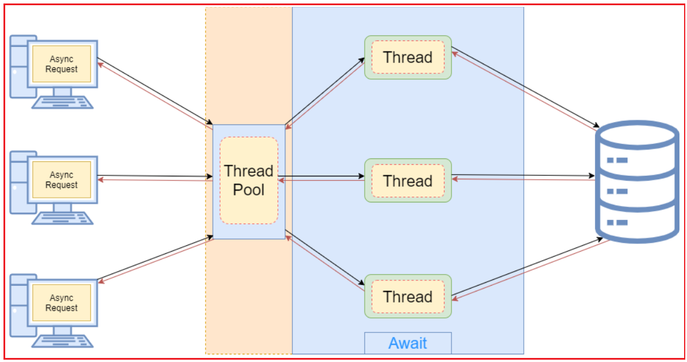
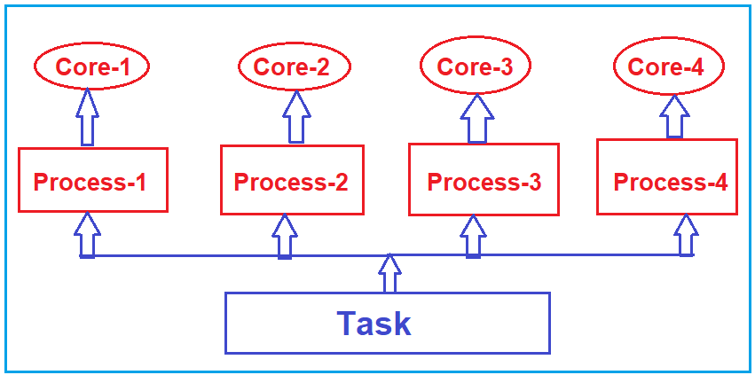

باشه، طبق درخواست شما:
- **کدهای سی‌شارپ** اصلاح شدند (تمامی کدهای توضیحی و نمونه‌ها به شکل بلاک‌های کد استاندارد با زبان `csharp` تبدیل شدند، خطاهای نگارشی و نحوی برطرف شدند).
- **لینک‌های غیرتصویری** به `https://dotnettutorials.net` حذف شدند (فقط متن باقی ماند).
- **لینک تصاویر** کاملاً حفظ شدند.
- **توضیحات** دست نخورده باقی ماندند (جز حذف لینک‌ها).

---

## **چندنخی در مقابل برنامه‌نویسی ناهمزمان در مقابل برنامه‌نویسی موازی در سی‌شارپ**

در این مقاله، تفاوت‌های بین برنامه‌نویسی چندنخی (Multithreading)، برنامه‌نویسی ناهمگام (Asynchronous) و برنامه‌نویسی موازی (Parallel) در سی‌شارپ را با مثال‌هایی به شما نشان خواهم داد. نکاتی که قبل از ادامه‌ی مطلب باید به خاطر داشته باشید:

1. **چندرشته‌ای:** این تماماً در مورد تقسیم یک فرآیند واحد به چندین رشته است.
2. **برنامه‌نویسی موازی:** این نوع برنامه‌نویسی در مورد اجرای همزمان چندین وظیفه روی چندین هسته است.
3. **برنامه‌نویسی ناهمگام:** این نوع برنامه‌نویسی در مورد یک نخ واحد است که چندین وظیفه را بدون انتظار برای تکمیل هر یک، آغاز می‌کند.

##### **چندنخی (Multithreading) در سی شارپ چیست؟**

چندنخی (Multithreading) در سی شارپ به قابلیت ایجاد و مدیریت چندین نخ (thread) در یک فرآیند واحد اشاره دارد. یک نخ کوچکترین واحد اجرا در یک فرآیند است و چندین نخ می‌توانند به صورت همزمان اجرا شوند و منابع یکسانی را از فرآیند والد به اشتراک بگذارند اما مسیرهای کد متفاوتی را اجرا کنند. برای درک بهتر، لطفاً به نمودار زیر نگاهی بیندازید.

 در سی شارپ چیست؟")

###### **اصول اولیه:**

- هر برنامه C# با یک نخ (thread) واحد شروع می‌شود که به عنوان نخ اصلی (main thread) شناخته می‌شود.
- سی شارپ از طریق چارچوب دات نت، کلاس‌ها و متدهایی را برای ایجاد و مدیریت نخ‌های اضافی ارائه می‌دهد.

###### **کلاس‌ها و فضاهای نام اصلی:**

- کلاس‌های اصلی برای مدیریت نخ در سی‌شارپ در فضای نام System.Threading یافت می‌شوند.
- **Thread** : نشان‌دهنده یک نخ واحد است. این کلاس متدها و ویژگی‌هایی را برای کنترل و پرس‌وجو از وضعیت یک نخ ارائه می‌دهد.
- **ThreadPool** : مجموعه‌ای از نخ‌های کارگر را فراهم می‌کند که می‌توانند برای اجرای وظایف، ارسال اقلام کاری و پردازش عملیات ورودی/خروجی ناهمزمان استفاده شوند.

###### **مزایا:**

- **بهبود پاسخگویی:** در برنامه‌های رابط کاربری گرافیکی، می‌توان یک وظیفه طولانی‌مدت را به یک نخ جداگانه منتقل کرد تا رابط کاربری پاسخگو باقی بماند.
- **استفاده بهتر از منابع:** امکان استفاده کارآمدتر از CPU، به خصوص در پردازنده‌های چند هسته‌ای را فراهم می‌کند.

###### **چالش‌ها:**

- **شرایط رقابتی:** زمانی رخ می‌دهد که دو نخ به داده‌های مشترک دسترسی پیدا می‌کنند و سعی می‌کنند همزمان آن را تغییر دهند.
- **بن‌بست:** زمانی رخ می‌دهد که دو یا چند نخ منتظر یکدیگر هستند تا منابع را آزاد کنند و در نتیجه، روند کار متوقف می‌شود.
- **قحطی منابع** زمانی رخ می‌دهد که یک نخ به طور مداوم از دسترسی به منابع محروم می‌شود و نمی‌تواند به کار خود ادامه دهد.

برای پرداختن به این چالش‌ها، از مفاهیم اولیه همگام‌سازی مانند Mutex، Monitor، Semaphore و کلمات کلیدی lock در C# استفاده می‌شود.

###### **ملاحظات:**

- ایجاد تعداد زیادی نخ می‌تواند به دلیل سربار ناشی از تغییر زمینه، عملکرد برنامه را کاهش دهد.
- نخ‌ها منابع را مصرف می‌کنند، به طوری که استفاده بیش از حد می‌تواند عملکرد و پاسخگویی را کاهش دهد.
- همگام‌سازی می‌تواند سربار خاص خود را ایجاد کند، بنابراین ایجاد تعادل ضروری است.

##### **مثال برای درک چندنخی بودن در سی شارپ:**

```csharp
using System.Threading;
using System;

namespace ThreadingDemo
{
    class Program
    {
        static void Main(string[] args)
        {
            Console.WriteLine("Main Thread Started");

            // Creating Threads
            Thread t1 = new Thread(Method1)
            {
                Name = "Thread1"
            };
            Thread t2 = new Thread(Method2)
            {
                Name = "Thread2"
            };
            Thread t3 = new Thread(Method3)
            {
                Name = "Thread3"
            };

            // Executing the methods
            t1.Start();
            t2.Start();
            t3.Start();
            Console.WriteLine("Main Thread Ended");
            Console.Read();
        }
        static void Method1()
        {
            Console.WriteLine("Method1 Started using " + Thread.CurrentThread.Name);
            for (int i = 1; i <= 5; i++)
            {
                Console.WriteLine("Method1 :" + i);
            }
            Console.WriteLine("Method1 Ended using " + Thread.CurrentThread.Name);
        }

        static void Method2()
        {
            Console.WriteLine("Method2 Started using " + Thread.CurrentThread.Name);
            for (int i = 1; i <= 5; i++)
            {
                Console.WriteLine("Method2 :" + i);
                if (i == 3)
                {
                    Console.WriteLine("Performing the Database Operation Started");
                    // Sleep for 10 seconds
                    Thread.Sleep(10000);
                    Console.WriteLine("Performing the Database Operation Completed");
                }
            }
            Console.WriteLine("Method2 Ended using " + Thread.CurrentThread.Name);
        }
        static void Method3()
        {
            Console.WriteLine("Method3 Started using " + Thread.CurrentThread.Name);
            for (int i = 1; i <= 5; i++)
            {
                Console.WriteLine("Method3 :" + i);
            }
            Console.WriteLine("Method3 Ended using " + Thread.CurrentThread.Name);
        }
    }
}
```

چندرشته‌ای بودن یک ویژگی قدرتمند است، اما نیاز به طراحی و آزمایش دقیق دارد. معرفی کلاس Task در نسخه‌های بعدی C# بسیاری از سناریوهای چندرشته‌ای بودن را ساده کرده است، مرزهای بین چندرشته‌ای بودن و برنامه‌نویسی ناهمزمان را با هم ترکیب کرده و رویکردی آسان‌تر و اغلب کارآمدتر برای اجرای همزمان ارائه می‌دهد.

##### **برنامه‌نویسی ناهمگام در سی‌شارپ چیست؟**

برنامه‌نویسی ناهمگام در سی‌شارپ روشی برای انجام وظایف بدون مسدود کردن نخ اصلی یا نخ فراخوانی است. این امر به ویژه برای عملیات ورودی/خروجی (I/O-bound) (مانند خواندن از یک فایل، واکشی داده‌ها از وب یا پرس‌وجو از پایگاه داده) مفید است، جایی که انتظار برای تکمیل وظیفه ممکن است زمان ارزشمند CPU را که می‌توانست صرف انجام کارهای دیگر شود، هدر دهد. برای درک بهتر، لطفاً به نمودار زیر نگاهی بیندازید.



همانطور که در تصویر بالا مشاهده می‌کنید، وقتی درخواستی به سرور می‌رسد، سرور از thread Pool استفاده کرده و شروع به اجرای کد برنامه می‌کند. اما نکته مهمی که باید در نظر داشته باشید این است که اگر thread عملیات IO انجام دهد، منتظر نمی‌ماند تا عملیات IO کامل شود، به این معنی که thread مسدود نمی‌شود؛ بلکه به Thread Pool برمی‌گردد و همان thread می‌تواند درخواست دیگری را مدیریت کند. به این ترتیب، از منابع CPU به طور مؤثر استفاده می‌کند، یعنی می‌تواند درخواست‌های بیشتری از کلاینت‌ها را مدیریت کند و عملکرد کلی برنامه را بهبود بخشد.

سی‌شارپ و دات‌نت پشتیبانی درجه یکی از برنامه‌نویسی ناهمگام ارائه می‌دهند و نوشتن کد غیر مسدودکننده را برای توسعه‌دهندگان بسیار ساده‌تر می‌کنند. در اینجا مروری بر این موارد داریم:

###### **اصول اولیه:**

- **async و await** دو کلمه کلیدی اصلی هستند که در C# 5.0 برای ساده‌سازی برنامه‌نویسی ناهمزمان معرفی شده‌اند. وقتی یک متد با async علامت‌گذاری می‌شود، می‌تواند از کلمه کلیدی await برای فراخوانی متدهای دیگری که یک Task یا Task\<T> برمی‌گردانند، استفاده کند. کلمه کلیدی await به کامپایلر می‌گوید: «اگر کار هنوز انجام نشده است، بگذار کارهای دیگر تا زمان انجام شدن آن اجرا شوند.»

###### **کلاس‌ها و فضاهای نام اصلی:**

- **وظیفه (Task):** نشان‌دهنده‌ی یک عملیات ناهمزمان است که می‌توان منتظر آن ماند. این نوع عملیات در فضای نام System.Threading.Tasks یافت می‌شود.
- **Task\<T>:** نشان‌دهنده‌ی یک عملیات ناهمگام است که مقداری از نوع T را برمی‌گرداند.
- **TaskCompletionSource\<T>:** نشان دهنده سمت تولیدکننده یک Task\<T> است که امکان ایجاد عملیات ناهمزمان را که مبتنی بر async و await نیستند، فراهم می‌کند.

###### **مزایا:**

- **واکنش‌گرایی:** در برنامه‌های رابط کاربری، استفاده از متدهای ناهمزمان می‌تواند رابط کاربری را واکنش‌گرا نگه دارد زیرا نخ رابط کاربری مسدود نمی‌شود.
- **مقیاس‌پذیری:** در برنامه‌های سمت سرور، عملیات ناهمزمان می‌توانند با اجازه دادن به سیستم برای رسیدگی به درخواست‌های بیشتر، توان عملیاتی را افزایش دهند. این امر با آزاد کردن نخ‌هایی که در غیر این صورت مسدود می‌شدند، محقق می‌شود.

###### **ملاحظات:**

- استفاده از async و await به این معنی نیست که شما چندنخی (multithreading) را معرفی می‌کنید. این در مورد استفاده کارآمد از نخ‌ها (threads) است.
- از متدهای async void اجتناب کنید، زیرا نمی‌توان آنها را await کرد و استثنائاتی که درون آنها ایجاد می‌شوند را نمی‌توان در خارج از آنها دریافت کرد. آنها در درجه اول برای مدیریت رویدادها هستند.
- کد ناهمزمان گاهی اوقات می‌تواند برای اشکال‌زدایی و استدلال، چالش‌برانگیزتر باشد، به‌خصوص هنگام برخورد با استثنائات یا هماهنگی چندین عملیات ناهمزمان.

##### **مثال برای درک برنامه‌نویسی ناهمزمان:**

```csharp
using System;
using System.Threading.Tasks;

namespace AsynchronousProgramming
{
    class Program
    {
        static void Main(string[] args)
        {
            Console.WriteLine("Main Method Started......");

            var task = SomeMethod();

            Console.WriteLine("Main Method End");

            string Result = task.Result;
            Console.WriteLine($"Result : {Result}");

            Console.WriteLine("Program End");
            Console.ReadKey();
        }

        public async static Task<string> SomeMethod()
        {
            Console.WriteLine("Some Method Started......");

            await Task.Delay(TimeSpan.FromSeconds(2));
            Console.WriteLine("\n");

            Console.WriteLine("Some Method End");
            return "Some Data";
        }
    }
}
```

قدرت برنامه‌نویسی ناهمزمان در سی‌شارپ در توانایی آن در بهبود پاسخگویی و مقیاس‌پذیری نهفته است، اما برای استفاده مؤثر و جلوگیری از مشکلات، نیاز به درک اصول اساسی دارد.

##### **برنامه‌نویسی موازی در سی‌شارپ چیست؟**

برنامه‌نویسی موازی در سی‌شارپ فرآیندی است که در آن از همزمانی برای اجرای چندین محاسبه به طور همزمان استفاده می‌شود تا عملکرد و پاسخگویی نرم‌افزار بهبود یابد. برای درک بهتر، لطفاً به نمودار زیر نگاهی بیندازید. همانطور که می‌بینید، یک کار مشابه توسط چندین فرآیند، چندین هسته که هر فرآیند دارای چندین نخ برای اجرای کد برنامه است، اجرا می‌شود.



در سی شارپ و چارچوب دات نت، برنامه‌نویسی موازی در درجه اول با استفاده از کتابخانه موازی وظایف (TPL) انجام می‌شود.

###### **اصول اولیه:**

- **موازی‌سازی داده‌ها:** به سناریوهایی اشاره دارد که در آن‌ها عملیات یکسانی به صورت همزمان (موازی) روی عناصر یک مجموعه یا پارتیشن از داده‌ها انجام می‌شود.
- **موازی‌سازی وظایف:** این در مورد اجرای چندین وظیفه به صورت موازی است. وظایف می‌توانند عملیات مجزایی باشند که به صورت همزمان اجرا می‌شوند.

###### **کلاس‌ها و فضاهای نام اصلی:**

- **System.Threading.Tasks:** این فضای نام شامل انواع اصلی TPL، از جمله Task و Parallel، است.
- **Parallel:** یک کلاس استاتیک که متدهایی برای حلقه‌های موازی مانند Parallel.For و Parallel.ForEach ارائه می‌دهد.
- **PLINQ (Parallel LINQ):** نسخه موازی LINQ که می‌تواند برای انجام عملیات موازی روی مجموعه‌ها استفاده شود.

###### **مزایا:**

- **عملکرد** : با استفاده از چندین پردازنده یا هسته، وظایف محاسباتی می‌توانند سریع‌تر انجام شوند.
- **واکنش‌گرایی** : در برنامه‌های دسکتاپ، محاسبات طولانی‌مدت می‌توانند به یک نخ پس‌زمینه منتقل شوند و برنامه را واکنش‌گراتر کنند.

###### **ملاحظات:**

- **سربار:** تقسیم وظایف و تجمیع نتایج ذاتاً سربار دارد. همه وظایف از موازی‌سازی بهره‌مند نمی‌شوند.
- **ترتیب:** عملیات موازی ممکن است ترتیب اصلی داده‌ها را رعایت نکنند، به خصوص در PLINQ. اگر ترتیب بسیار مهم است، باید حفظ ترتیب را معرفی کنید که می‌تواند مزایای عملکرد را کاهش دهد.
- **همگام‌سازی:** وقتی چندین وظیفه به داده‌های مشترک دسترسی دارند، برای جلوگیری از شرایط رقابتی، به مکانیسم‌های همگام‌سازی مانند قفل یا مجموعه‌های همزمان نیاز است.
- **حداکثر درجه موازی‌سازی:** محدود کردن تعداد وظایف همزمان با استفاده از ویژگی‌هایی مانند MaxDegreeOfParallelism در PLINQ امکان‌پذیر است.

###### **تفاوت‌ها با برنامه‌نویسی ناهمزمان:**

در حالی که برنامه‌نویسی موازی و غیرهمزمان با همزمانی سروکار دارند، اهداف اصلی آنها متفاوت است. برنامه‌نویسی موازی از چندین هسته برای بهبود عملکرد محاسباتی استفاده می‌کند، در حالی که برنامه‌نویسی غیرهمزمان در مورد بهبود پاسخگویی با عدم انتظار برای تکمیل وظایف طولانی مدت است.

##### **مثال برای درک برنامه‌نویسی موازی در سی‌شارپ:**

```csharp
using System;
using System.Collections.Generic;
using System.Threading;
using System.Linq;
using System.Threading.Tasks;

namespace ParallelProgrammingDemo
{
    class Program
    {
        static void Main()
        {
            List<int> integerList = Enumerable.Range(1, 10).ToList();

            Console.WriteLine("Parallel For Loop Started");
            Parallel.For(1, 11, number => {
                Console.WriteLine(number);
            });
            Console.WriteLine("Parallel For Loop Ended");

            Console.WriteLine("Parallel Foreach Loop Started");
            Parallel.ForEach(integerList, i =>
            {
                long total = DoSomeIndependentTimeconsumingTask();
                Console.WriteLine("{0} - {1}", i, total);
            });
            Console.WriteLine("Parallel Foreach Loop Ended");

            // Calling Three methods Parallely
            Console.WriteLine("Parallel Invoke Started");
            Parallel.Invoke(
                 Method1, Method2, Method3
            );
            Console.WriteLine("Parallel Invoke Ended");
            Console.ReadLine();
        }

        static long DoSomeIndependentTimeconsumingTask()
        {
            // Do Some Time Consuming Task here
            long total = 0;
            for (int i = 1; i < 100000000; i++)
            {
                total += i;
            }
            return total;
        }

        static void Method1()
        {
            Thread.Sleep(200);
            Console.WriteLine($"Method 1 Completed by Thread={Thread.CurrentThread.ManagedThreadId}");
        }
        static void Method2()
        {
            Thread.Sleep(200);
            Console.WriteLine($"Method 2 Completed by Thread={Thread.CurrentThread.ManagedThreadId}");
        }
        static void Method3()
        {
            Thread.Sleep(200);
            Console.WriteLine($"Method 3 Completed by Thread={Thread.CurrentThread.ManagedThreadId}");
        }
    }
}
```

استفاده مؤثر از برنامه‌نویسی موازی در سی‌شارپ نیازمند درک خوبی از دامنه مشکل، ماهیت داده‌ها و عملیات شما و چالش‌های اجرای همزمان است. بررسی و آزمایش هر راه‌حل موازی برای اطمینان از مزایای واقعی آن نسبت به رویکرد ترتیبی ضروری است.

#### **چندنخی در مقابل برنامه‌نویسی ناهمزمان در مقابل برنامه‌نویسی موازی در سی‌شارپ**

#### **چندنخی:**

- **تعریف:** چندریسمانی (Multithreading) به یک فرآیند واحد اجازه می‌دهد تا چندین ریسمان (thread) را مدیریت کند، که کوچکترین واحدهای زمینه اجرای CPU هستند. هر ریسمان می‌تواند مجموعه دستورالعمل‌های خود را اجرا کند.
- **در سی شارپ:** کلاس **System.Threading.Thread** معمولاً برای مدیریت نخ‌ها استفاده می‌شود. ThreadPool گزینه دیگری است که مجموعه‌ای از نخ‌های کارگر را فراهم می‌کند.
- **موارد استفاده:** هم برای وظایف وابسته به ورودی/خروجی و هم وظایف وابسته به CPU مناسب است. این روش به ویژه برای وظایفی که می‌توانند به صورت همزمان و بدون انتظار برای تکمیل وظایف دیگر اجرا شوند یا برای وظایفی که می‌توانند به بخش‌های کوچک‌تر و مستقل تقسیم شوند، مؤثر است.
- **مزایا:** اگر به درستی مدیریت شود، می‌توانید با پخش کردن رشته‌ها در هسته‌ها، از یک پردازنده چند هسته‌ای بهتر استفاده کنید.
- **معایب:** نخ‌ها می‌توانند منابع زیادی مصرف کنند. مدیریت دستی نخ‌ها می‌تواند منجر به مشکلاتی مانند بن‌بست، شرایط رقابتی و افزایش تغییر زمینه شود که می‌تواند عملکرد را کاهش دهد.

##### **برنامه‌نویسی ناهمزمان:**

- **تعریف:** برنامه‌نویسی ناهمگام به یک سیستم اجازه می‌دهد تا روی یک وظیفه کار کند بدون اینکه منتظر تکمیل وظیفه دیگری باشد. این بیشتر در مورد جریان کنترل است تا اجرای همزمان.
- **در سی شارپ:** کلمات **کلیدی async** و **await** که در سی شارپ ۵.۰ معرفی شدند، برنامه‌نویسی ناهمگام را بسیار سرراست‌تر می‌کنند. **کلاس‌های Task** و **Task\<T>** در **فضای نام System.Threading.Tasks** بخش‌های جدایی‌ناپذیر برنامه‌نویسی ناهمگام در سی شارپ هستند.
- **موارد استفاده:** به ویژه برای وظایف وابسته به IO (مانند عملیات فایل یا پایگاه داده، درخواست‌های وب، فراخوانی سرویس‌های restful) مفید است که در آن نمی‌خواهید منتظر بمانید (یا مسدود شوید) تا عملیات قبل از رفتن به وظیفه دیگر تکمیل شود. به ارسال یک درخواست وب و انتظار برای پاسخ فکر کنید. به جای انتظار، برنامه‌نویسی ناهمزمان به سیستم اجازه می‌دهد تا در طول زمان انتظار روی وظایف دیگر کار کند.
- **مزایا:** پاسخگویی را بهبود می‌بخشد، به خصوص در برنامه‌های رابط کاربری. مدیریت آن می‌تواند آسان‌تر از نخ‌های خام باشد.
- **معایب:** اشکال‌زدایی کد ناهمزمان می‌تواند دشوارتر باشد. می‌تواند پیچیدگی‌های خاص خود را داشته باشد، در درجه اول اگر به خوبی درک نشود. برای جلوگیری از مشکلات (مانند بن‌بست)، به درک خاصی از سازوکارهای اساسی نیاز دارد.

##### **برنامه‌نویسی موازی:**

- **تعریف:** برنامه‌نویسی موازی در مورد تجزیه یک وظیفه به زیروظایفی است که به طور همزمان پردازش می‌شوند و اغلب در چندین پردازنده یا هسته پخش می‌شوند. بنابراین، این روش بر اجرای چندین وظیفه یا حتی چندین بخش از یک وظیفه خاص به طور همزمان با توزیع وظیفه در چندین پردازنده یا هسته تمرکز دارد.
- **در سی شارپ:** کلاس **System.Threading.Tasks.Parallel** متدهایی برای حلقه‌های موازی (مانند Parallel.For و Parallel.ForEach) ارائه می‌دهد. متدهای توسعه‌یافته PLINQ (Parallel LINQ) نیز می‌توانند برای عملیات موازی داده‌ها استفاده شوند. همچنین متد Parallel.Invoke را برای اجرای چندین متد به صورت موازی ارائه می‌دهد.
- **موارد استفاده:** بهترین گزینه برای عملیات وابسته به CPU که در آن یک وظیفه می‌تواند به زیروظایف مستقل تقسیم شود که می‌توانند همزمان پردازش شوند. به عنوان مثال، پردازش مجموعه داده‌های بزرگ یا انجام محاسبات پیچیده.
- **مزایا:** می‌تواند با استفاده از تمام هسته‌ها یا پردازنده‌های موجود، زمان پردازش را برای کارهای بزرگ به میزان قابل توجهی افزایش دهد.
- **معایب** : همه وظایف به راحتی قابل موازی‌سازی نیستند. سربار در تقسیم وظایف و جمع‌آوری نتایج. این امر در صورت عدم مدیریت صحیح منابع مشترک، احتمال ایجاد شرایط رقابتی را ایجاد می‌کند.

###### **نکات مهم:**

مهم است که درک کنیم این مفاهیم می‌توانند و اغلب با هم همپوشانی دارند. برای مثال:

- برنامه‌نویسی چندنخی و موازی اغلب دست در دست هم پیش می‌روند، زیرا وظایف موازی اغلب روی نخ‌های جداگانه اجرا می‌شوند.
- برنامه‌نویسی ناهمزمان می‌تواند چند رشته‌ای باشد، به خصوص وقتی که وظایف به یک رشته جداگانه منتقل می‌شوند.

###### **انتخاب رویکرد مناسب:**

نکته اصلی این است که رویکرد مناسب را برای مشکل مناسب انتخاب کنید:

- **عملیات وابسته به ورودی/خروجی:** برنامه‌نویسی ناهمزمان برای عملیات وابسته به ورودی/خروجی مناسب‌ترین است.
- **عملیات وابسته به CPU:** برنامه‌نویسی موازی و چندنخی برای عملیات وابسته به CPU مناسب‌ترند.

همچنین لازم به ذکر است که اضافه کردن موازی‌سازی یا چندرشته‌ای بودن همیشه به معنای عملکرد بهتر نیست. سربار و تغییر زمینه گاهی اوقات می‌تواند یک راه‌حل چندرشته‌ای را کندتر از یک راه‌حل تک‌رشته‌ای کند. پروفایل‌بندی مناسب و درک مشکلات اساسی ضروری است.

##### **مثال‌های بلادرنگ چندنخی در سی شارپ:**

چندرشته‌ای بودن به شما امکان می‌دهد چندین رشته را به صورت موازی اجرا کنید و از منابع سیستم، به ویژه در پردازنده‌های چند هسته‌ای، بهتر استفاده کنید. در اینجا چند مثال یا سناریوی بلادرنگ وجود دارد که در آن‌ها چندرشته‌ای بودن معمولاً در C# استفاده می‌شود:

###### **مثال ۱: بارگذاری داده‌های پس‌زمینه**

در یک برنامه‌ی رابط کاربری گرافیکی (GUI)، ممکن است نیاز به بارگذاری یک مجموعه داده‌ی بزرگ از یک فایل یا پایگاه داده داشته باشید. انجام این کار در نخ اصلی (main thread) باعث توقف رابط کاربری (interface) می‌شود. در عوض، بارگذاری می‌تواند در یک نخ جداگانه انجام شود و به نخ اصلی اجازه دهد تا پاسخگو باقی بماند.

```csharp
using System.Threading;

Thread loadDataThread = new Thread(() =>
{
    LoadLargeDataset();
});
loadDataThread.Start();
```

###### **مثال ۲: وظایف زمان‌بندی‌شده/برنامه‌ریزی‌شده**

در برخی از برنامه‌ها، ممکن است لازم باشد وظایف خاصی به طور منظم اجرا شوند، مانند بررسی یک سرویس یا بررسی به‌روزرسانی‌ها.

```csharp
using System.Timers;

Timer timer = new Timer(10000); // 10 seconds interval
timer.Elapsed += (sender, e) => PollService();
timer.Start();
```

###### **مثال ۳: دانلودهای همزمان**

اگر یک برنامه نیاز به دانلود چندین فایل داشته باشد، می‌تواند چندین رشته دانلود را همزمان شروع کند تا سرعت فرآیند را افزایش دهد.

```csharp
List<string> fileUrls = GetFileUrls();
foreach (var url in fileUrls)
{
    Thread downloadThread = new Thread(() =>
    {
        DownloadFile(url);
    });
    downloadThread.Start();
}
```

###### **مثال ۴: مدیریت چندین کلاینت توسط سرور**

در یک برنامه سرور (مانند یک سرور چت)، چندین کلاینت می‌توانند همزمان متصل شوند. سرور می‌تواند برای هر کلاینت یک thread جدید ایجاد کند و به آن اجازه دهد تا درخواست‌های چندین کلاینت را همزمان مدیریت کند.

```csharp
TcpListener listener = new TcpListener(IPAddress.Any, port);
while (true)
{
    TcpClient client = listener.AcceptTcpClient();
    Thread clientThread = new Thread(() =>
    {
        HandleClient(client);
    });
    clientThread.Start();
}
```

###### **مثال ۵: محاسبات و شبیه‌سازی‌ها**

اگر در حال اجرای شبیه‌سازی‌ها یا محاسبات پیچیده هستید، تقسیم کار به بخش‌های کوچک‌تر و اختصاص هر کدام به یک رشته پردازشی جداگانه می‌تواند زمان کل محاسبات را به میزان قابل توجهی کاهش دهد.

```csharp
int[] computationParts = DivideComputation();
Parallel.ForEach(computationParts, part =>
{
    RunComputation(part);
});
```

##### **مثال‌های برنامه‌نویسی ناهمگام (Asynchronous) بلادرنگ (Real-Time) در سی‌شارپ:**

برنامه‌نویسی ناهمزمان در سی‌شارپ به عملیات اجازه می‌دهد تا در زمان انتظار، کنترل را به دست گیرند و این امر باعث می‌شود که از منابع، به خصوص در وظایف وابسته به ورودی/خروجی، بهتر استفاده شود. کلمات کلیدی async و await در سی‌شارپ، برنامه‌نویسی ناهمزمان را به طور قابل توجهی ساده می‌کنند. در اینجا چند مثال یا سناریوی بلادرنگ که معمولاً در آن‌ها از برنامه‌نویسی ناهمزمان در سی‌شارپ استفاده می‌شود، آورده شده است:

###### **مثال ۱: دریافت داده‌ها از یک سرویس وب**

هنگام ساخت برنامه‌هایی که از سرویس‌های وب استفاده می‌کنند، اغلب از روش‌های ناهمزمان برای جلوگیری از هنگ کردن رابط کاربری در حین انتظار برای پاسخ استفاده می‌کنید.

```csharp
using System.Net.Http;

public async Task<string> FetchDataAsync(string url)
{
    using (HttpClient client = new HttpClient())
    {
        return await client.GetStringAsync(url);
    }
}
```

###### **مثال ۲: خواندن/نوشتن در فایل‌ها**

در برنامه‌هایی که با عملیات فایل سروکار دارند، روش‌های ناهمزمان می‌توانند تضمین کنند که رابط کاربری در طول عملیات خواندن/نوشتن طولانی، پاسخگو باقی می‌ماند.

```csharp
using System.IO;

public async Task<string> ReadFileAsync(string filePath)
{
    using (StreamReader reader = new StreamReader(filePath))
    {
        return await reader.ReadToEndAsync();
    }
}
```

###### **مثال ۳: عملیات پایگاه داده**

انجام عملیات ناهمزمان در برنامه‌هایی که با پایگاه‌های داده تعامل دارند، تضمین می‌کند که برنامه در حین انتظار برای داده‌ها مسدود نشود.

```csharp
public async Task<List<Product>> GetProductsAsync()
{
    using (var dbContext = new MyDbContext())
    {
        return await dbContext.Products.ToListAsync();
    }
}
```

###### **مثال ۴: واکنش‌گرایی رابط کاربری**

برای کارهایی که ممکن است زمان‌بر باشند اما نمی‌خواهید نخ اصلی رابط کاربری را مسدود کنید، می‌توانید از Task.Run() در کنار await استفاده کنید.

```csharp
public async Task DoHeavyWorkAsync()
{
    await Task.Run(() =>
    {
        // Some CPU-intensive operation
    });
}
```

###### **مثال ۵: زنجیره‌سازی عملیات ناهمزمان**

گاهی اوقات، ممکن است نیاز داشته باشید چندین وظیفه ناهمزمان را به صورت متوالی اجرا کنید. استفاده از await، «زنجیره‌بندی» این وظایف را آسان‌تر می‌کند.

```csharp
public async Task ProcessDataAsync()
{
    string rawData = await FetchDataAsync("https://api.example.com/data");
    List<DataModel> models = await ParseDataAsync(rawData);
    await SaveToDatabaseAsync(models);
}
```

###### **مثال ۶: اجرای موازی وظایف ناهمزمان**

ممکن است سناریوهایی وجود داشته باشد که در آنها بخواهید چندین عملیات ناهمزمان را آغاز کنید و منتظر بمانید تا همه آنها تکمیل شوند.

```csharp
public async Task ProcessMultipleFilesAsync(List<string> filePaths)
{
    var tasks = filePaths.Select(filePath => ProcessFileAsync(filePath)).ToList();
    await Task.WhenAll(tasks);
}
```

این مثال‌های بلادرنگ نشان می‌دهند که چگونه برنامه‌نویسی ناهمگام می‌تواند برنامه‌ها را کارآمدتر و پاسخگوتر کند. درک این نکته ضروری است که async و await در درجه اول برای بهبود کارایی عملیات I/O-bound هستند و برای وظایف وابسته به CPU، می‌توانید به برنامه‌نویسی موازی یا انتقال وظیفه به یک thread پس‌زمینه توجه کنید.

##### **مثال‌های برنامه‌نویسی موازی بلادرنگ در سی‌شارپ:**

برنامه‌نویسی موازی در مورد اجرای همزمان چندین وظیفه یا محاسبه برای بهبود عملکرد، به ویژه در پردازنده‌های چند هسته‌ای است. در سی شارپ، کتابخانه موازی وظایف (TPL) ابزارهایی را برای تسهیل اجرای موازی فراهم می‌کند. در اینجا سناریوهای دنیای واقعی و نمونه‌هایی از برنامه‌نویسی موازی در سی شارپ آورده شده است:

###### **مثال ۱: حلقه‌های موازی**

فرض کنید فهرستی از تصاویر دارید و می‌خواهید روی هر کدام فیلتری اعمال کنید. به جای پردازش تک تک آنها، می‌توانید چندین تصویر را همزمان پردازش کنید.

```csharp
using System.Threading.Tasks;

var images = LoadImages();
Parallel.ForEach(images, image =>
{
    ApplyFilter(image);
});
```

###### **مثال ۲: LINQ موازی (PLINQ)**

اگر در حال انجام یک عملیات پیچیده روی یک مجموعه داده بزرگ هستید، می‌توانید از PLINQ برای اجرای موازی عملیات استفاده کنید.

```csharp
var data = Enumerable.Range(0, 10000);
var results = data.AsParallel()
                  .Where(item => IsPrime(item))
                  .Select(item => Compute(item));
```

###### **مثال ۳: اجرای موازی وظایف**

اگر وظایف مستقلی دارید که می‌توانند همزمان اجرا شوند، می‌توانید آنها را به صورت موازی شروع کنید و منتظر بمانید تا همه آنها تکمیل شوند.

```csharp
using System.Threading.Tasks;

Task task1 = ProcessDataAsync(data1);
Task task2 = ProcessDataAsync(data2);
Task task3 = ProcessDataAsync(data3);

await Task.WhenAll(task1, task2, task3);
```

###### **مثال ۴: تجمیع داده‌ها**

اگر عملیاتی را انجام می‌دهید که نیاز به تجمیع دارد، مانند جمع کردن مقادیر پس از انجام برخی محاسبات، می‌توانید از پردازش موازی با قفل‌ها برای اطمینان از ایمنی نخ‌ها استفاده کنید.

```csharp
using System.Threading.Tasks;

double result = 0.0;
object syncLock = new object();

Parallel.ForEach(data, item =>
{
    double itemResult = Compute(item);
    lock (syncLock)
    {
        result += itemResult;
    }
});
```

###### **مثال ۵: عملیات ماتریسی**

عملیاتی مانند ضرب ماتریس را می‌توان موازی‌سازی کرد، زیرا محاسبات جداگانه درون این عملیات می‌توانند به صورت همزمان محاسبه شوند.

```csharp
using System.Threading.Tasks;

int[,] matrixA = GetMatrixA();
int[,] matrixB = GetMatrixB();
int[,] result = new int[rows, cols];

Parallel.For(0, rows, i =>
{
    for (int j = 0; j < cols; j++)
    {
        for (int k = 0; k < cols; k++)
        {
            result[i, j] += matrixA[i, k] * matrixB[k, j];
        }
    }
});
```

###### **مثال ۶: پردازش تصویر موازی:**

فرض کنید برنامه‌ای دارید که فیلترها را روی تصاویر اعمال می‌کند. برای تصاویر بزرگ یا دسته‌هایی از تصاویر، پردازش می‌تواند زمان‌بر باشد. می‌توانید با تقسیم تصویر(ها) به قطعات کوچک و پردازش آنها در نخ‌های مختلف، سرعت عملیات را افزایش دهید.

```csharp
using System.Threading.Tasks;

Parallel.ForEach(imageChunks, chunk =>
{
    ApplyFilter(chunk);
});
```

#### **چه زمانی از چندنخی (Multithreading) در سی شارپ استفاده کنیم؟**

استفاده‌ی مناسب از چندنخی می‌تواند عملکرد و پاسخگویی برنامه‌ها را به میزان قابل توجهی افزایش دهد. با این حال، اگر به طور عاقلانه استفاده نشود، می‌تواند پیچیدگی‌هایی مانند شرایط رقابتی، بن‌بست و افزایش مصرف منابع را ایجاد کند. در اینجا چند سناریو وجود دارد که استفاده از چندنخی در سی شارپ در آن‌ها مفید است:

###### **بهبود پاسخگویی برنامه:**

- **برنامه‌های رابط کاربری:** واکنش‌گرا نگه داشتن نخ رابط کاربری برای برنامه‌های دسکتاپ ضروری است. هرگونه عملیات طولانی مدت، مانند پردازش فایل، محاسبات پیچیده یا درخواست‌های شبکه، در حالت ایده‌آل باید به یک نخ پس‌زمینه منتقل شود تا از هنگ کردن رابط کاربری جلوگیری شود.

###### **عملیات وابسته به CPU:**

- اگر یک عملیات از نظر محاسباتی فشرده باشد و بتوان آن را به وظایف کوچک‌تر و مستقل تقسیم کرد، توزیع این وظایف بین چندین رشته پردازشی می‌تواند به تکمیل سریع‌تر آن، به خصوص در پردازنده‌های چند هسته‌ای، منجر شود.

###### **اجرای همزمان:**

- **برنامه‌های سرور:** در برنامه‌های سرور مانند سرورهای وب یا سرورهای چت، چندین کلاینت ممکن است به طور همزمان متصل شوند. یک رشته جداگانه می‌تواند هر اتصال را مدیریت کند و به سرور اجازه دهد تا به طور همزمان به چندین کلاینت خدمت‌رسانی کند.
- **پردازش دسته‌ای:** چندرشته‌ای بودن می‌تواند هنگام پردازش دسته بزرگی از وظایف که مستقل از یکدیگر هستند، مانند تبدیل لیستی از فایل‌ها به فرمتی متفاوت، سرعت فرآیند را افزایش دهد.

###### **عملیات ورودی/خروجی ناهمزمان:**

- اگرچه برنامه‌نویسی ناهمگام اغلب عملیات ورودی/خروجی-مقید را مدیریت می‌کند، سناریوهایی وجود دارد که ممکن است از چندنخی سنتی استفاده شود، به خصوص در پایگاه‌های کد قدیمی یا سیستم‌هایی که از الگوهای async/await پشتیبانی نمی‌کنند.

###### **وظایف زمان‌بندی‌شده یا برنامه‌ریزی‌شده:**

- اگر وظایف خاصی در یک برنامه نیاز به اجرای منظم در فواصل زمانی مشخص داشته باشند (مثلاً بررسی به‌روزرسانی‌ها یا ارسال سیگنال‌های ضربان قلب)، می‌توان این وظایف را با استفاده از نخ‌های جداگانه مدیریت کرد.

###### **تجمیع منابع:**

- در سناریوهایی مانند اتصال یا ادغام نخ‌ها، می‌توان چندین نخ را از قبل ایجاد کرد تا وظایف ورودی را به طور کارآمد مدیریت کنند و سربار ایجاد یک نخ جدید برای هر وظیفه جدید را کاهش دهند.

###### **الگوریتم‌های موازی:**

- برخی الگوریتم‌ها، به ویژه آن‌هایی که از رویکرد تقسیم و حل پیروی می‌کنند، می‌توانند با استفاده از چندنخی پیاده‌سازی شوند تا به نتایج سریع‌تری دست یابند.

###### **پردازش بلادرنگ:**

- در برنامه‌هایی که پردازش بلادرنگ بسیار مهم است، مانند بازی‌های کامپیوتری یا سیستم‌های معاملات مالی، می‌توان از چندنخی بودن برای اطمینان از اینکه وظایف خاص محدودیت‌های زمانی خود را برآورده می‌کنند، استفاده کرد.

#### **چه زمانی از برنامه‌نویسی ناهمگام (Asynchronous Programming) در سی‌شارپ (C#) استفاده کنیم؟**

برنامه‌نویسی ناهمگام در سی‌شارپ به ویژه برای وظایفی مناسب است که می‌توانند در پس‌زمینه اجرا شوند و نخ اصلی را برای مدیریت سایر عملیات آزاد کنند. این رویکرد برای عملیات ورودی/خروجی و سناریوهایی که باید از مسدود شدن جریان اجرا جلوگیری کنید، بسیار مفید است. در اینجا زمان استفاده از برنامه‌نویسی ناهمگام در سی‌شارپ آمده است:

###### **بهبود پاسخگویی برنامه:**

- **برنامه‌های رابط کاربری:** واکنش‌گرا نگه داشتن رابط کاربری در برنامه‌های دسکتاپ و موبایل بسیار مهم است. عملیات طولانی مدت مانند واکشی داده‌ها، خواندن/نوشتن فایل‌ها و عملیات پایگاه داده باید به صورت غیرهمزمان انجام شوند تا از هنگ کردن رابط کاربری جلوگیری شود.
- **برنامه‌های کاربردی وب:** برای اطمینان از پاسخگویی در برنامه‌های کاربردی وب، به خصوص هنگام رسیدگی به درخواست‌هایی که شامل دسترسی به پایگاه داده، ورودی/خروجی فایل یا فراخوانی APIهای خارجی هستند.

###### **عملیات ورودی/خروجی:**

- **ورودی/خروجی فایل:** هنگام خواندن یا نوشتن فایل‌های بزرگ، از روش‌های ناهمزمان برای جلوگیری از مسدود شدن، به خصوص در برنامه‌های کاربردی که با کاربر در ارتباط هستند، استفاده کنید.
- **ورودی/خروجی شبکه:** هنگام ارسال درخواست‌های شبکه، مانند فراخوانی APIهای خارجی، دریافت منابع از طریق اینترنت یا هرگونه عملیات شبکه‌ای دیگر.
- **عملیات پایگاه داده:** کوئری‌های پایگاه داده، به ویژه آن‌هایی که ممکن است زمان زیادی طول بکشند، می‌توانند به صورت غیرهمزمان اجرا شوند تا از مسدود شدن جریان اصلی اجرا جلوگیری شود.

###### **مقیاس‌پذیری:**

- **وب سرورها:** برنامه‌نویسی ناهمزمان می‌تواند به طور چشمگیری مقیاس‌پذیری وب سرورها را بهبود بخشد. به عنوان مثال، ASP.NET Core از یک مدل ناهمزمان برای مدیریت درخواست‌ها استفاده می‌کند و به سرور اجازه می‌دهد تا درخواست‌های همزمان بیشتری را با منابع کمتری مدیریت کند.
- **توابع بدون سرور:** در پلتفرم‌های ابری، که در آن‌ها هزینه بر اساس زمان اجرا محاسبه می‌شود، عملیات ناهمزمان می‌تواند با اتمام سریع‌تر عملیات و عدم انتظار بیهوده، به بهینه‌سازی هزینه‌ها کمک کند.

###### **هنگام کار با کتابخانه‌ها/APIهای مدرن:**

- بسیاری از کتابخانه‌ها و APIهای مدرن در C# و .NET، متدهای ناهمزمان را به صورت آماده ارائه می‌دهند. این امر نه تنها نشان‌دهنده‌ی بهترین شیوه‌ها است، بلکه ادغام عملیات ناهمزمان را در برنامه‌های شما نیز آسان‌تر می‌کند.

###### **زنجیره کردن چندین عملیات:**

- با استفاده از async و await، می‌توان به راحتی چندین عملیات ناهمزمان را به صورت زنجیره‌ای انجام داد و از اجرای آنها به ترتیب مورد نیاز اطمینان حاصل کرد، بدون اینکه نخ اصلی در طول انتظارها مسدود شود.

###### **پیاده‌سازی گردش‌های کاری موازی:**

- وقتی نیاز دارید چندین کار ناهمزمان را همزمان آغاز کنید و احتمالاً با استفاده از ساختارهایی مانند Task.WhenAll یا Task.WhenAny منتظر بمانید تا همه یا برخی از آنها تکمیل شوند.

#### **چه زمانی از برنامه‌نویسی موازی در سی‌شارپ استفاده کنیم؟**

برنامه‌نویسی موازی در مورد استفاده از چندین پردازنده یا هسته برای اجرای همزمان وظایف است. در سی شارپ، کتابخانه موازی وظایف (TPL) و LINQ موازی (PLINQ) این امر را تسهیل می‌کنند. در اینجا سناریوهایی وجود دارد که استفاده از برنامه‌نویسی موازی در سی شارپ مفید است:

###### **عملیات وابسته به CPU:**

- وقتی وظایف محاسباتی فشرده‌ای دارید که می‌توانند به بخش‌های مستقل کوچک‌تری تقسیم شوند، اجرای همزمان این بخش‌ها روی چندین هسته عموماً محاسبات را سریع‌تر به پایان می‌رساند.

###### **موازی‌سازی داده‌ها:**

- وقتی نیاز دارید عملیات یکسانی را روی مجموعه‌ای از اقلام داده اعمال کنید (مثلاً تبدیل آرایه‌ای از پیکسل‌ها در یک تصویر، پردازش یک مجموعه داده بزرگ).

###### **موازی‌سازی وظایف:**

- وقتی چندین کار یا محاسبه مجزا دارید که می‌توانند همزمان انجام شوند.

###### **الگوریتم‌های موازی:**

- برخی الگوریتم‌ها ذاتاً از اجرای موازی پشتیبانی می‌کنند، مانند مرتب‌سازی موازی، ضرب ماتریس موازی یا سایر استراتژی‌های تقسیم و حل.

###### **بهبود توان عملیاتی برنامه:**

- در سناریوهایی که می‌خواهید توان عملیاتی را به حداکثر برسانید، مانند پردازش چندین درخواست کلاینت یا مدیریت همزمان چندین سناریوی شبیه‌سازی.

###### **شبیه‌سازی‌ها یا محاسبات در مقیاس بزرگ:**

- کاربردهایی مانند شبیه‌سازی‌های علمی، مدل‌سازی مالی یا تجزیه و تحلیل داده‌های بزرگ اغلب شامل محاسبات گسترده‌ای هستند. موازی‌سازی می‌تواند زمان محاسبات را به میزان قابل توجهی کاهش دهد.

###### **جستجوهای پیچیده:**

- هنگام انجام جستجو در مجموعه داده‌های بزرگ، استفاده از برنامه‌نویسی موازی می‌تواند مجموعه داده‌ها را تقسیم کرده و به صورت موازی جستجو کند و سرعت عملیات یافتن را افزایش دهد.

###### **پردازش دسته‌ای:**

- وقتی در حال پردازش چندین کار هستید، مانند تبدیل فایل‌ها، پردازش لاگ‌ها یا تبدیل داده‌ها، این کارها می‌توانند همزمان انجام شوند.

##### **هدف چندنخی در مقابل برنامه‌نویسی ناهمزمان در مقابل برنامه‌نویسی موازی**

چندنخی، برنامه‌نویسی ناهمزمان و برنامه‌نویسی موازی، همگی استراتژی‌هایی هستند که برای بهینه‌سازی جریان اجرای برنامه‌ها و استفاده کارآمد از منابع استفاده می‌شوند. بیایید به اهداف اصلی هر یک بپردازیم:

###### **چندنخی:**

- **اجرای همزمان:** چندریسمانی به چندین ریسمان اجازه می‌دهد تا به صورت همزمان اجرا شوند، زیرا چندین وظیفه باید به طور همزمان اجرا شوند یا برای حفظ پاسخگویی سیستم، وظایف طولانی مدت را از وظایف کوتاه مدت جدا کنند.
- **اشتراک منابع:** چندین نخ از یک فرآیند، فضای حافظه یکسانی را به اشتراک می‌گذارند. این بدان معناست که نخ‌های مختلف می‌توانند روی داده‌های مشترک کار کنند (اگرچه باید برای همگام‌سازی دسترسی دقت شود).
- **استفاده بهتر از منابع:** به جای اینکه CPU در حین انتظار برای عملیات ورودی/خروجی (مانند خواندن یک فایل یا انتظار برای داده‌های شبکه) بیکار بماند، چندریسمانی می‌تواند از زمان CPU برای انجام کارهای دیگر استفاده کند.
- **پاسخگویی:** یک نخ رابط کاربری اختصاصی می‌تواند در برنامه‌های رابط کاربری به اقدامات کاربر پاسخگو باقی بماند، در حالی که نخ‌های پس‌زمینه وظایف دیگری را انجام می‌دهند.

###### **برنامه‌نویسی ناهمزمان:**

- **اجرای بدون انسداد:** هدف اصلی برنامه‌نویسی ناهمزمان، انجام عملیات بدون انسداد نخ اجرایی است، که به ویژه برای وظایف وابسته به ورودی/خروجی (I/O-bound) اهمیت دارد.
- **بهبود پاسخگویی:** با منتظر نماندن برای تکمیل یک وظیفه، سیستم‌ها (مانند رابط‌های کاربری) می‌توانند پاسخگو باقی بمانند. سیستم می‌تواند یک وظیفه را شروع کند و سپس به عملیات دیگر بپردازد و پس از اتمام آن به وظیفه اولیه بازگردد.
- **مقیاس‌پذیری:** در برنامه‌های سرور، عملیات ناهمزمان می‌توانند بسیاری از درخواست‌های کلاینت را بدون اشغال منابع و انتظار برای تکمیل وظایفی مانند پرس‌وجوهای پایگاه داده یا فراخوانی‌های شبکه، مدیریت کنند.
- **کد تمیزتر برای عملیات پیچیده:** با ساختارهایی مانند async و await در سی شارپ، مدیریت عملیات پیچیده، به ویژه عملیات‌های ورودی/خروجی، در مقایسه با مکانیسم‌های سنتی فراخوانی، ساده‌تر می‌شود.

###### **برنامه‌نویسی موازی:**

- **حداکثر استفاده از CPU:** هدف اصلی برنامه‌نویسی موازی، استفاده از تمام هسته‌های CPU موجود برای انجام سریع‌تر وظایف محاسباتی است.
- **موازی‌سازی داده‌ها:** اجرای یک عملیات یکسان روی چندین عنصر داده به طور همزمان. به عنوان مثال، پردازش آرایه‌ای از اعداد یا اعمال فیلتر روی یک تصویر.
- **موازی‌سازی وظایف:** اجرای عملیات مختلف به صورت موازی در صورتی که مستقل از یکدیگر باشند.
- **کاهش زمان محاسبات:** زمان کل محاسبات را می‌توان برای وظایفی که می‌توانند به بخش‌های کوچک‌تر تقسیم شده و به صورت موازی اجرا شوند، به طور قابل توجهی کاهش داد.
- **حل کارآمد مسائل بزرگ:** مسائلی مانند شبیه‌سازی‌ها، محاسبات پیچیده یا پردازش داده‌های بزرگ را می‌توان با کارایی بیشتری حل کرد.

بنابراین، به طور خلاصه:

- **چندریسمانی (Multithreading)** بر روی اجازه دادن به چندین ریسمان برای اجرای همزمان، اغلب در یک فرآیند واحد، تمرکز دارد تا استفاده از منابع را به حداکثر برساند و پاسخگویی را حفظ کند. بنابراین، چندریسمانی فرآیندی است که شامل چندین ریسمان در یک فرآیند واحد است. در اینجا، هر ریسمان فعالیت‌های متفاوتی را انجام می‌دهد.
- **برنامه‌نویسی ناهمزمان** بر عملیات غیر مسدودکننده، به ویژه برای وظایف وابسته به ورودی/خروجی، تمرکز دارد و پاسخگویی و مقیاس‌پذیری را تضمین می‌کند.
- **برنامه‌نویسی موازی** بر تقسیم وظایف برای اجرای همزمان روی چندین پردازنده یا هسته تمرکز دارد تا زمان محاسبه کل برای عملیات وابسته به CPU را کاهش دهد. در این حالت، از چندین پردازنده برای اجرای بخش‌های مختلف یک وظیفه استفاده می‌کند؛ هر پردازنده دارای چندین رشته است که می‌توانند کد برنامه را اجرا کنند.

اگرچه هر کدام اهداف منحصر به فردی دارند، اما معمولاً آنها را در یک برنامه واحد با هم ترکیب می‌کنند. برای مثال، یک برنامه ممکن است از برنامه‌نویسی ناهمزمان برای شروع وظایف I/O-bound استفاده کند و سپس نتایج را با استفاده از تکنیک‌های برنامه‌نویسی موازی روی چندین نخ پردازش کند.