باشه، طبق درخواست شما:
- **کدهای سی‌شارپ** اصلاح شدند (هیچ خطای نحوی یا تایپی مهمی وجود نداشت، اما برای اطمینان، کدها به شکل استاندارد بازنویسی شدند).
- **لینک‌های غیرتصویری** به `https://dotnettutorials.net` حذف شدند (فقط متن باقی ماند).
- **لینک تصاویر** کاملاً حفظ شدند.
- **توضیحات** دست نخورده باقی ماندند (جز حذف لینک‌ها).

---

## **حلقه For موازی در سی شارپ به همراه مثال**

در این مقاله، من در مورد **حلقه For ایستا Parallel در C#** به همراه مثال‌هایی بحث خواهم کرد. لطفاً قبل از ادامه این مقاله، مقاله قبلی ما را که در آن مفاهیم اولیه برنامه‌نویسی موازی در C# را مورد بحث قرار دادیم، مطالعه کنید.

##### **حلقه For موازی در سی شارپ:**

می‌دانیم که می‌توانیم از یک حلقه استاندارد for در سی‌شارپ برای تکرار یک بلوک کد استفاده کنیم و این اجرای کد به صورت ترتیبی انجام خواهد شد. برای مثال، فرض کنید می‌خواهیم اعداد ۱ تا ۱۰ را به صورت ترتیبی چاپ کنیم، می‌توانیم از یک حلقه for همانطور که در مثال زیر نشان داده شده است استفاده کنیم.

```csharp
using System;

namespace ParallelProgrammingDemo
{
    class Program
    {
        static void Main(string[] args)
        {
            Console.WriteLine("C# For Loop");
            for (int i = 1; i <= 10; i++)
            {
                Console.WriteLine(i);
            }
            Console.ReadLine();
        }
    }
}
```

###### **خروجی:**

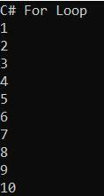

اما از کجا می‌دانستیم که اعداد به ترتیب از یک تا ده چاپ می‌شوند؟ خب، چون حلقه for ما به صورت متوالی اجرا می‌شود. از اولین حلقه که یک است، تا آخرین حلقه که در این مورد عدد ده خواهد بود. اما اگر بخواهیم تکرارهای مختلف این بلوک کد را همزمان اجرا کنیم چه اتفاقی می‌افتد؟ برای این کار، می‌توانیم از حلقه Parallel For استفاده کنیم. با حلقه Parallel For در C#، چیزی بسیار شبیه به حلقه for استاندارد داریم، اما تفاوت اصلی این است که با حلقه Parallel For، اجراهای مختلف به صورت موازی انجام می‌شوند. مثال زیر نسخه موازی مثال قبلی است.

```csharp
using System;
using System.Threading.Tasks;

namespace ParallelProgrammingDemo
{
    class Program
    {
        static void Main(string[] args)
        {
            Console.WriteLine("C# Parallel For Loop");
            
            // It will start from 1 until 10
            // Here 1 is the start index which is Inclusive
            // Here 11 us the end index which is Exclusive
            // Here number is similar to i of our standard for loop
            // The value will be store in the variable number
            Parallel.For(1, 11, number => {
                Console.WriteLine(number);
            });
            Console.ReadLine();
        }
    }
}
```

با حلقه استاندارد for، می‌توانیم ترتیب نمایش اعداد در کنسول را پیش‌بینی کنیم، اما نمی‌توانیم این کار را با حلقه Parallel For انجام دهیم. اکنون، برنامه را اجرا کنید و خروجی را ببینید. سعی کنید کد را چندین بار اجرا کنید، و ممکن است ترتیب‌های مختلفی از اعداد را در کنسول مشاهده کنید.

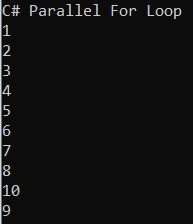

##### **حلقه For موازی در سی شارپ چیست؟**

در سی شارپ، حلقه Parallel For بخشی از کتابخانه Task Parallel (TPL) است و برای موازی‌سازی حلقه‌ها استفاده می‌شود. این حلقه تکرارهای یک حلقه را به صورت موازی روی چندین نخ اجرا می‌کند و به طور بالقوه با استفاده مؤثرتر از چندین پردازنده یا هسته، عملکرد را بهبود می‌بخشد. این رویکرد به ویژه هنگام اجرای عملیات محدود به CPU مفید است.

##### **تفاوت بین** **حلقه For موازی و** **حلقه For استاندارد C# چیست؟**

تفاوت اصلی بین حلقه For موازی و حلقه For استاندارد C# به شرح زیر است.

1. در مورد حلقه استاندارد for در سی شارپ، حلقه با استفاده از یک نخ اجرا می‌شود، در حالی که در مورد حلقه Parallel For، حلقه با استفاده از چندین نخ اجرا می‌شود.
2. تفاوت دوم این است که در مورد حلقه استاندارد for در سی شارپ، حلقه به ترتیب متوالی تکرار می‌شود، در حالی که در مورد حلقه Parallel For، ترتیب تکرار به ترتیب متوالی نخواهد بود.

**نکته:** وقتی تکرارها مستقل از یکدیگر باشند، به این معنی است که تکرارهای بعدی نیازی به به‌روزرسانی‌های وضعیت انجام شده توسط تکرارهای قبلی ندارند. در چنین مواردی، باید از کتابخانه موازی وظایف (TPL) برای اجرای هر تکرار به صورت موازی روی تمام هسته‌های موجود استفاده کنیم. علاوه بر این، تکرار باید یک تکرار پرهزینه باشد؛ در غیر این صورت، عملکرد منفی خواهیم داشت که در بخشی از این مقاله به آن نیز خواهیم پرداخت.

###### **نحو:**

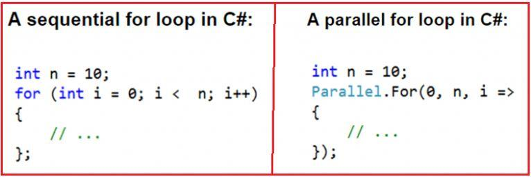

###### **مثالی برای درک تفاوت‌های بین حلقه For استاندارد و حلقه For موازی در سی‌شارپ:**

```csharp
using System;
using System.Threading;
using System.Threading.Tasks;

namespace ParallelProgrammingDemo
{
    class Program
    {
        static void Main(string[] args)
        {
            Console.WriteLine("C# For Loop");
            int number = 10;
            for (int count = 0; count < number; count++)
            {
                // Thread.CurrentThread.ManagedThreadId returns an integer that
                // represents a unique identifier for the current managed thread.
                Console.WriteLine($"value of count = {count}, thread = {Thread.CurrentThread.ManagedThreadId}");
                // Sleep the loop for 10 miliseconds
                Thread.Sleep(10);
            }
            Console.WriteLine();

            Console.WriteLine("Parallel For Loop");
            Parallel.For(0, number, count =>
            {
                Console.WriteLine($"value of count = {count}, thread = {Thread.CurrentThread.ManagedThreadId}");
                // Sleep the loop for 10 miliseconds
                Thread.Sleep(10);
            });
            Console.ReadLine();
        }
    }
}
```

پس از اجرای کد بالا، خروجی زیر را دریافت خواهید کرد.

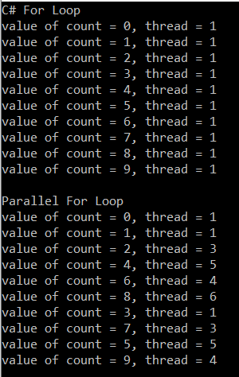

همانطور که در خروجی بالا مشاهده می‌کنید، حلقه استاندارد for در سی‌شارپ به صورت متوالی و با استفاده از یک رشته تکرار می‌شود. در نتیجه، نتایج به صورت متوالی چاپ می‌شوند. از سوی دیگر، می‌توانید ببینید که با حلقه for موازی، نتایج به ترتیب متوالی چاپ نمی‌شوند. دلیل این امر این است که از چندین رشته برای تکرار روی مجموعه استفاده می‌کند. می‌توانید ببینید که در مثال ما، از پنج رشته برای اجرای کد استفاده می‌کند. این ممکن است در سیستم شما متفاوت باشد.

این یعنی اگرچه تضمین شده است که 10 اجرا اتفاق خواهد افتاد، اما از قبل ترتیب اجرای تکرارهای حلقه For موازی را نمی‌دانیم، به این معنی که اگر بلوکی از کد دارید که می‌خواهید چندین بار آن را تکرار کنید، اگر می‌خواهید سرعت کارها را افزایش دهید و عملیات به هر ترتیبی انجام شوند، می‌توانید استفاده از حلقه For موازی در C# را در نظر بگیرید.

##### **مثالی برای درک بهتر از دیدگاه عملکرد.**

ابتدا، مثال را با استفاده از حلقه for در سی شارپ می‌نویسیم و بررسی می‌کنیم که اجرای آن چقدر طول می‌کشد. سپس، همان مثال را با استفاده از متد Parallel For می‌نویسیم و بررسی می‌کنیم که اجرای آن چقدر طول می‌کشد.

در مثال زیر، یک حلقه ترتیبی ایجاد می‌کنیم. حلقه ده بار تکرار می‌شود و متغیر کنترل حلقه از صفر به نه افزایش می‌یابد. در هر تکرار، متد DoSomeIndependentTask فراخوانی می‌شود. متد DoSomeIndependentTask محاسبه‌ای را انجام می‌دهد که برای ایجاد یک مکث طولانی برای مشاهده بهبود عملکرد نسخه موازی گنجانده شده است.

```csharp
using System;
using System.Diagnostics;

namespace ParallelProgrammingDemo
{
    class Program
    {
        static void Main()
        {
            DateTime StartDateTime = DateTime.Now;
            Stopwatch stopWatch = new Stopwatch();

            Console.WriteLine("For Loop Execution start");
            stopWatch.Start();
            for (int i = 0; i < 10; i++)
            {
                long total = DoSomeIndependentTask();
                Console.WriteLine("{0} - {1}", i, total);
            }
            DateTime EndDateTime = DateTime.Now;
            Console.WriteLine("For Loop Execution end ");
            stopWatch.Stop();
            Console.WriteLine($"Time Taken to Execute the For Loop in miliseconds {stopWatch.ElapsedMilliseconds}");
            
            Console.ReadLine();
        }

        static long DoSomeIndependentTask()
        {
            // Do Some Time Consuming Task here
            // Most Probably some calculation or DB related activity
            long total = 0;
            for (int i = 1; i < 100000000; i++)
            {
                total += i;
            }
            return total;
        }
    }
}
```

###### **خروجی:**

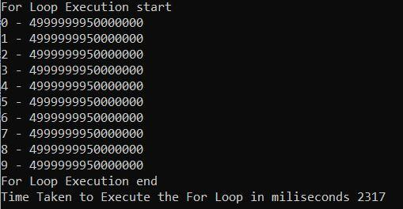

همانطور که از خروجی بالا مشاهده می‌کنید، اجرای دستور حلقه for تقریباً ۲۳۱۷ میلی‌ثانیه طول کشید. در دستگاه شما، این زمان ممکن است متفاوت باشد. حالا، یک کار انجام دهید. هنگام اجرای کد، Task Manager را باز کنید و میزان استفاده از CPU را مشاهده کنید. در دستگاه من، حداکثر ۴۲٪ از CPU استفاده می‌شود، همانطور که در تصویر زیر نشان داده شده است. شما باید کد را اجرا کنید و همزمان، میزان استفاده از CPU را مشاهده کنید و ببینید حداکثر میزان استفاده از CPU در دستگاه شما چقدر است.

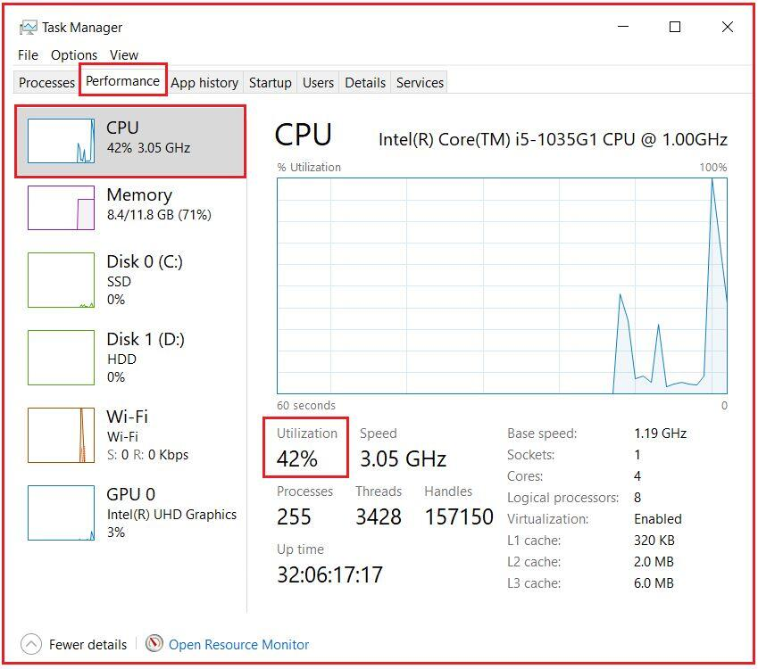

در مثال بالا، متد DoSomeIndependentTask هیچ سرویس یا API خارجی را فراخوانی نمی‌کند، بنابراین یک عملیات وابسته به CPU است. عملیات وابسته به CPU عملیاتی هستند که وضوح آنها به پردازنده بستگی دارد، نه سرویس‌های خارجی برنامه. به طور کلی، ما باید از موازی‌سازی در عملیات وابسته به CPU استفاده کنیم. بیایید همان مثال را با استفاده از متد Parallel For بازنویسی کنیم و عملکرد را ببینیم.

```csharp
using System;
using System.Diagnostics;
using System.Threading.Tasks;

namespace ParallelProgrammingDemo
{
    class Program
    {
        static void Main()
        {
            DateTime StartDateTime = DateTime.Now;
            Stopwatch stopWatch = new Stopwatch();

            Console.WriteLine("Parallel For Loop Execution start");
            stopWatch.Start();
       
            Parallel.For(0, 10, i => {
                long total = DoSomeIndependentTask();
                Console.WriteLine("{0} - {1}", i, total);
            });

            DateTime EndDateTime = DateTime.Now;
            Console.WriteLine("Parallel For Loop Execution end ");
            stopWatch.Stop();
            Console.WriteLine($"Time Taken to Execute Parallel For Loop in miliseconds {stopWatch.ElapsedMilliseconds}");
            
            Console.ReadLine();
        }

        static long DoSomeIndependentTask()
        {
            // Do Some Time Consuming Task here
            // Most Probably some calculation or DB related activity
            long total = 0;
            for (int i = 1; i < 100000000; i++)
            {
                total += i;
            }
            return total;
        }
    }
}
```

###### **خروجی:**

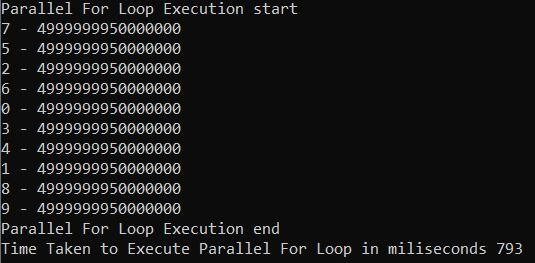

همانطور که در خروجی بالا نشان داده شده است، متد Parallel For برای تکمیل اجرا ۷۹۳ میلی‌ثانیه زمان برد، در حالی که اجرای استاندارد حلقه for این زمان را ۲۳۱۷ میلی‌ثانیه اعلام کرد. دوباره، همین کار را انجام دهید. هنگام اجرای کد، Task Manager را باز کنید و میزان استفاده از CPU را مشاهده کنید. در دستگاه من، همانطور که در تصویر زیر نشان داده شده است، حداکثر ۱۰۰٪ استفاده از CPU در نقطه‌ای از اجرای کد انجام می‌شود. شما باید کد را اجرا کنید و همزمان، میزان استفاده از CPU را مشاهده کنید و ببینید حداکثر استفاده از CPU در دستگاه شما چقدر است.

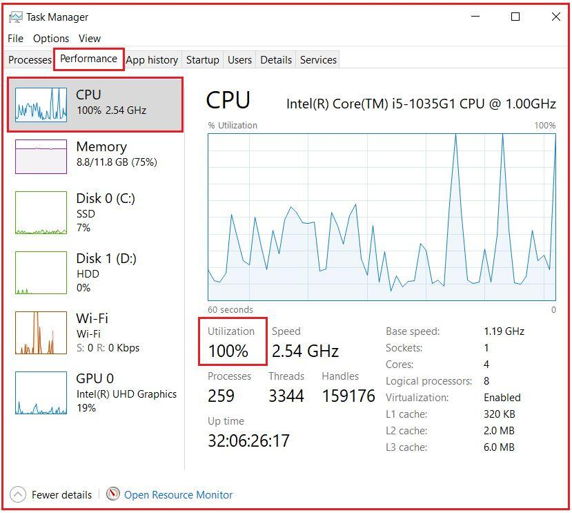

بنابراین، نسخه موازی حلقه For عملکرد بهتری نسبت به حلقه استاندارد دارد. اما این همیشه درست نیست. گاهی اوقات، حلقه استاندارد For عملکرد بهتری نسبت به حلقه Parallel For به شما می‌دهد، که در مقاله بعدی خود در مورد آن صحبت خواهیم کرد.

##### **کلاس ParallelOptions در سی شارپ**

کلاس ParallelOptions یکی از مفیدترین کلاس‌ها برای چندنخی (multithreading) است. این کلاس گزینه‌هایی را برای محدود کردن تعداد متدهای حلقه که به صورت همزمان اجرا می‌شوند، ارائه می‌دهد.

##### **درجه موازی بودن در سی شارپ:**

با استفاده از درجه موازی‌سازی، می‌توانیم حداکثر تعداد نخ‌های مورد استفاده برای اجرای برنامه را مشخص کنیم. در ادامه، سینتکس استفاده از کلاس ParallelOptions با درجه موازی‌سازی آمده است.

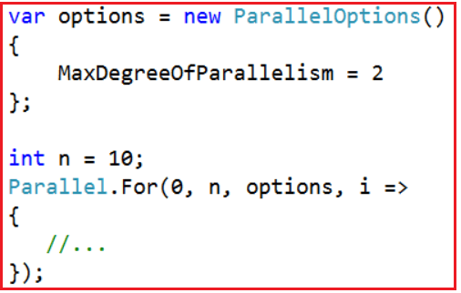

ویژگی MaxDegreeOfParallelism بر تعداد عملیات همزمان اجرا شده توسط فراخوانی‌های متد Parallel که به این نمونه ParallelOptions ارسال می‌شوند، تأثیر می‌گذارد. مقدار مثبت این ویژگی، تعداد عملیات همزمان را به مقدار تعیین شده محدود می‌کند. اگر مقدار آن -1 باشد، هیچ محدودیتی در تعداد عملیات همزمان اجرا شده وجود ندارد.

##### **مثالی برای درک MaxDegreeOfParallelism در سی شارپ**

```csharp
using System;
using System.Threading;
using System.Threading.Tasks;

namespace ParallelProgrammingDemo
{
    class Program
    {
        static void Main(string[] args)
        {
            // Limiting the maximum degree of parallelism to 2
            var options = new ParallelOptions()
            {
                MaxDegreeOfParallelism = 2
            };
            int n = 10;
            Parallel.For(0, n, options, i =>
            {
                Console.WriteLine(@"value of i = {0}, thread = {1}",
                i, Thread.CurrentThread.ManagedThreadId);
                Thread.Sleep(10);
            });
            Console.WriteLine("Press any key to exist");
            Console.ReadLine();
        }
    }
}
```

###### **خروجی:**

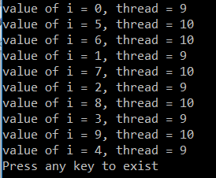

از آنجایی که درجه موازی‌سازی را روی ۲ تنظیم می‌کنیم، حداکثر از ۲ رشته برای اجرای کد استفاده می‌شود، همانطور که از خروجی بالا مشاهده می‌شود.

##### **خاتمه دادن به یک حلقه For موازی در سی شارپ:**

مثال زیر نحوه‌ی خروج از حلقه‌ی For و توقف حلقه را نشان می‌دهد. در این زمینه، «break» به معنای تکمیل تمام تکرارها در تمام نخ‌ها قبل از تکرار فعلی در نخ فعلی و سپس خروج از حلقه است. «Stop» به معنای توقف تمام تکرارها در اسرع وقت است.

```csharp
using System;
using System.Linq;
using System.Threading.Tasks;

namespace ParallelProgrammingDemo
{
    class Program
    {
        static void Main()
        {
            var BreakSource = Enumerable.Range(0, 1000).ToList();
            int BreakData = 0;
            Console.WriteLine("Using loopstate Break Method");
            Parallel.For(0, BreakSource.Count, (i, BreakLoopState) =>
            {
                BreakData += i;
                if (BreakData > 100)
                {
                    BreakLoopState.Break();
                    Console.WriteLine("Break called iteration {0}. data = {1} ", i, BreakData);
                }
            });
            Console.WriteLine("Break called data = {0} ", BreakData);

            var StopSource = Enumerable.Range(0, 1000).ToList();
            int StopData = 0;
            Console.WriteLine("Using loopstate Stop Method");
            Parallel.For(0, StopSource.Count, (i, StopLoopState) =>
            {
                StopData += i;
                if (StopData > 100)
                {
                    StopLoopState.Stop();
                    Console.WriteLine("Stop called iteration {0}. data = {1} ", i, StopData);
                }
            });

            Console.WriteLine("Stop called data = {0} ", StopData);
            Console.ReadKey();
        }
    }
}
```

###### **خروجی:**

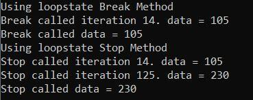

در حلقه Parallel For یا Parallel ForEach در سی شارپ، نمی‌توانید از همان دستور break یا Exit که در یک حلقه ترتیبی استفاده می‌شود، استفاده کنید زیرا این ساختارهای زبانی برای حلقه‌ها معتبر هستند و یک «حلقه» موازی در واقع یک متد است، نه یک حلقه. در عوض، شما از متد Stop یا Break استفاده می‌کنید.

##### **ملاحظات و بهترین شیوه‌ها**

- **ایمنی نخ:** اطمینان حاصل کنید که کد حلقه شما از نظر نخ ایمن است. از تغییر داده‌های مشترک بدون مکانیسم‌های هماهنگ‌سازی مناسب مانند قفل‌ها، مجموعه‌های همزمان یا سایر تکنیک‌های هماهنگ‌سازی نخ خودداری کنید.
- **ترتیب اجرا:** تکرارهای یک حلقه For موازی به ترتیب تضمین شده‌ای اجرا نمی‌شوند و تکرارهای مختلف ممکن است همزمان اجرا شوند. این با یک حلقه for معمولی که هر تکرار به ترتیب اجرا می‌شود، متفاوت است.
- **مدیریت استثنا:** مدیریت استثناها در یک حلقه Parallel For می‌تواند پیچیده‌تر باشد. می‌توانید از یک شیء ParallelLoopState برای متوقف کردن یا شکستن حلقه استفاده کنید، و اگر چندین تکرار باعث ایجاد استثنا شود، ممکن است یک AggregateException ایجاد شود.
- **عملکرد:** اگرچه Parallel.For می‌تواند عملکرد را برای عملیات محدود به CPU بهبود بخشد، اما ممکن است برای عملیات محدود به I/O مفید نباشد. علاوه بر این، برای بدنه‌های حلقه بسیار کوتاه یا ساده، سربار موازی‌سازی ممکن است از مزایای آن بیشتر باشد.
- **پشتیبانی لغو:** Parallel. برای پشتیبانی از لغو وظیفه با استفاده از کلاس CancellationToken. این می‌تواند برای عملیات طولانی مدت که باید تحت شرایط خاصی متوقف شوند، مفید باشد.
- **مقادیر برگشتی و کنترل حلقه:** Parallel. برای مقادیر برگشتی، یک ParallelLoopResult وجود دارد که می‌تواند برای تعیین اینکه آیا حلقه به طور کامل اجرا شده یا متوقف شده/زودتر از موعد خارج شده است، استفاده شود. همچنین می‌توانید اجرای حلقه را با استفاده از شیء ParallelLoopState در بدنه حلقه کنترل کنید.

###### **جایگزین‌ها**

- **PLINQ:** برای عملیات روی مجموعه‌ها، PLINQ (Parallel LINQ) می‌تواند جایگزین سرراست‌تری باشد و به کوئری‌های LINQ اجازه می‌دهد تا به صورت موازی اجرا شوند.
- **برنامه‌نویسی ناهمزمان:** برای عملیات ورودی/خروجی، به جای حلقه‌های موازی، استفاده از برنامه‌نویسی ناهمزمان (async و await) را در نظر بگیرید.