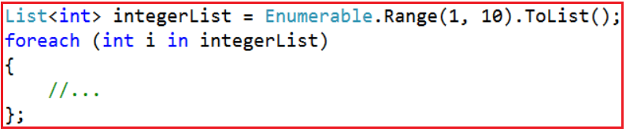
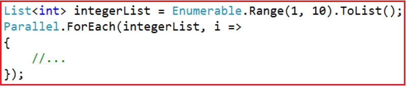
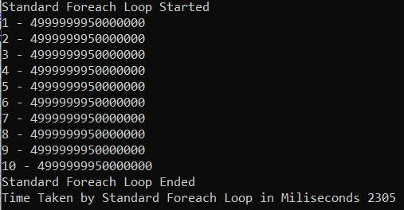
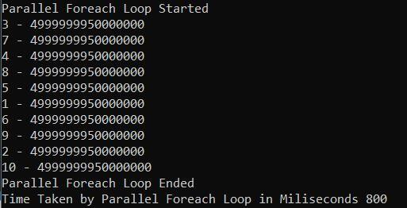
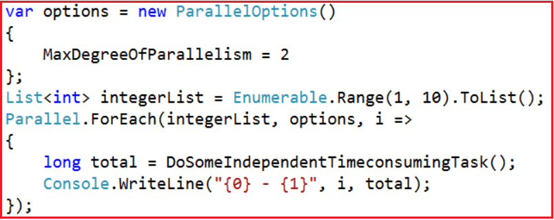
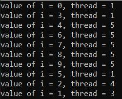
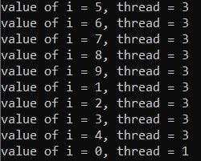
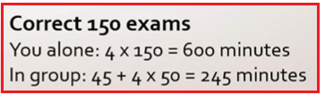
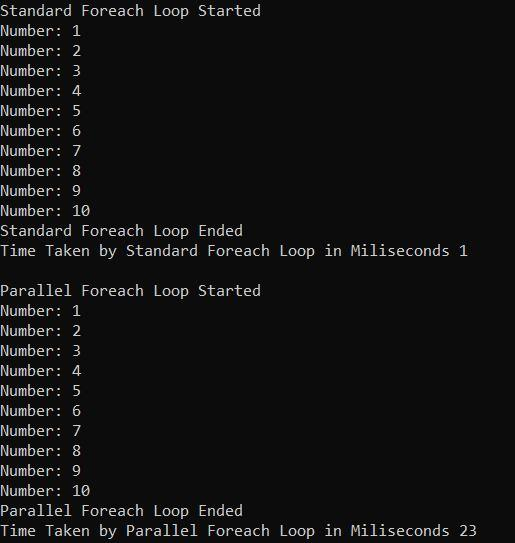

## **حلقه Foreach موازی در سی شارپ**

مورد بحث قرار خواهم داد **در این مقاله، حلقه Parallel Foreach در سی شارپ را** با مثال‌هایی . همانطور که در مقاله قبلی خود بحث کردیم، **کتابخانه Task Parallel (TPL)** دو روش (یعنی **Parallel For** و **Parallel Foreach** ) ارائه می‌دهد که از نظر مفهومی حلقه‌های "for" و "for each" هستند، با این تفاوت که از چندین نخ برای اجرای چندین تکرار به طور همزمان در یک ماشین با چندین هسته استفاده می‌کنند. در مقاله قبلی خود، ما قبلاً روش Parallel for در سی شارپ را با مثال‌هایی مورد بحث قرار داده‌ایم.

##### **حلقه موازی برای هر حلقه در سی شارپ**

حلقه موازی برای هر کدام در سی شارپ بخشی از کتابخانه موازی وظایف (TPL) است و برای پردازش موازی استفاده می‌شود. این حلقه به ما امکان می‌دهد تکرارهای یک حلقه را به صورت همزمان اجرا کنیم و از چندین نخ و هسته پردازنده استفاده کنیم. این می‌تواند عملکرد عملیات یا وظایفی که به CPU وابسته هستند و می‌توانند به صورت همزمان اجرا شوند را به طور قابل توجهی بهبود بخشد.

متد Parallel ForEach در سی شارپ، یک نسخه موازی از حلقه استاندارد و متوالی Foreach را ارائه می‌دهد. در یک حلقه استاندارد Foreach، هر تکرار یک آیتم از مجموعه را پردازش می‌کند و فقط تمام آیتم‌ها را یکی یکی پردازش می‌کند. با این حال، متد Parallel Foreach چندین تکرار را به طور همزمان روی پردازنده‌ها یا هسته‌های پردازنده مختلف اجرا می‌کند. این ممکن است احتمال مشکلات همگام‌سازی را ایجاد کند. بنابراین، این حلقه به طور ایده‌آل برای فرآیندهایی مناسب است که هر تکرار مستقل است.

##### **سینتکس حلقه ترتیبی برای هر حلقه در سی شارپ:**



##### **سینتکس حلقه Foreach موازی در سی شارپ:**



نسخه موازی حلقه از متد استاتیک ForEach از کلاس Parallel استفاده می‌کند. نسخه‌های overload شده زیادی برای این متد موجود است. این ساده‌ترین نسخه overload شده است که دو آرگومان می‌پذیرد.

- پارامتر اول، مجموعه‌ای از اشیاء است که شمارش خواهند شد. این می‌تواند هر مجموعه‌ای باشد که IEnumerable\<T> را پیاده‌سازی می‌کند.
- پارامتر دوم یک نماینده اکشن (Action delegate) را می‌پذیرد که معمولاً به صورت یک عبارت لامبدا بیان می‌شود و عملی را که باید برای هر آیتم در مجموعه انجام شود، تعیین می‌کند.

##### **مثال حلقه Foreach موازی در سی شارپ**

بیایید روش Parallel Foreach در سی شارپ را با یک مثال درک کنیم. ابتدا، مثال را با استفاده از حلقه استاندارد Foreach ترتیبی می‌نویسیم و بررسی می‌کنیم که چقدر زمان برای تکمیل اجرا لازم است. سپس، همان مثال را با استفاده از روش Parallel ForEach Loop می‌نویسیم و بررسی می‌کنیم که اجرای همان مثال چقدر طول می‌کشد.

در مثال زیر، ما یک حلقه Foreach ترتیبی ایجاد می‌کنیم که یک کار طولانی مدت را یک بار برای هر آیتم در مجموعه انجام می‌دهد. کد زیر لیستی از ده عدد صحیح تولید شده با استفاده از **متد Enumerable.Range** را پیمایش می‌کند . در هر تکرار، **متد DoSomeIndependentTimeConsumingTask** فراخوانی می‌شود. **متد DoSomeIndependentTimeConsumingTask** محاسبه‌ای را انجام می‌دهد که برای ایجاد یک مکث به اندازه کافی طولانی برای مشاهده بهبود عملکرد نسخه موازی گنجانده شده است.

##### **مثال استفاده از حلقه استاندارد Foreach در سی شارپ:**

```csharp
using System;
using System.Collections.Generic;
using System.Diagnostics;
using System.Linq;

namespace ParallelProgrammingDemo
{
    class Program
    {
        static void Main()
        {
            Stopwatch stopwatch = new Stopwatch();

            Console.WriteLine("Standard Foreach Loop Started");
            stopwatch.Start();
            List<int> integerList = Enumerable.Range(1, 10).ToList();
            foreach (int i in integerList)
            {
                long total = DoSomeIndependentTimeConsumingTask();
                Console.WriteLine("{0} - {1}", i, total);
            };

            Console.WriteLine("Standard Foreach Loop Ended");
            stopwatch.Stop();
            
            Console.WriteLine($"Time Taken by Standard Foreach Loop in Miliseconds {stopwatch.ElapsedMilliseconds}");
            Console.ReadLine();
        }

        static long DoSomeIndependentTimeConsumingTask()
        {
            // Do Some Time Consuming Task here
            long total = 0;
            for (int i = 1; i < 100000000; i++)
            {
                total += i;
            }
            return total;
        }
    }
}
```

حالا، برنامه را اجرا کنید و خروجی را مشاهده کنید.



همانطور که از خروجی بالا مشاهده می‌کنید، اجرای دستور استاندارد حلقه Foreach تقریباً ۲۳۰۵ میلی‌ثانیه طول می‌کشد. بیایید همان مثال را با استفاده از متد Parallel ForEach در سی‌شارپ بازنویسی کنیم.

##### **مثال استفاده از حلقه Foreach موازی در سی شارپ:**

بیایید مثال قبلی را با استفاده از حلقه Parallel ForEach بازنویسی کنیم و خروجی را ببینیم.

```csharp
using System;
using System.Collections.Generic;
using System.Diagnostics;
using System.Linq;
using System.Threading.Tasks;

namespace ParallelProgrammingDemo
{
    class Program
    {
        static void Main()
        {
            Stopwatch stopwatch = new Stopwatch();

            Console.WriteLine("Parallel Foreach Loop Started");
            stopwatch.Start();
            List<int> integerList = Enumerable.Range(1, 10).ToList();

            Parallel.ForEach(integerList, i =>
            {
                long total = DoSomeIndependentTimeConsumingTask();
                Console.WriteLine("{0} - {1}", i, total);
            });
            Console.WriteLine("Parallel Foreach Loop Ended");
            stopwatch.Stop();
            
            Console.WriteLine($"Time Taken by Parallel Foreach Loop in Miliseconds {stopwatch.ElapsedMilliseconds}");
            Console.ReadLine();
        }

        static long DoSomeIndependentTimeConsumingTask()
        {
            // Do Some Time Consuming Task here
            long total = 0;
            for (int i = 1; i < 100000000; i++)
            {
                total += i;
            }
            return total;
        }
    }
}
```

حالا کد بالا را اجرا کنید و خروجی را مانند زیر ببینید. زمان ممکن است در دستگاه شما متفاوت باشد.



همانطور که در خروجی بالا مشاهده می‌کنید، متد Parallel ForEach برای تکمیل اجرا ۸۰۰ میلی‌ثانیه زمان صرف کرد، در حالی که این زمان برای حلقه استاندارد Foreah در سی‌شارپ ۲۳۰۵ میلی‌ثانیه بود.

##### **استفاده از درجه موازی بودن در سی شارپ با حلقه Foreach موازی:**

با استفاده از درجه موازی‌سازی در سی‌شارپ، می‌توانیم حداکثر تعداد نخ‌ها را برای اجرای موازی برای هر حلقه مشخص کنیم. سینتکس استفاده از درجه موازی‌سازی در سی‌شارپ در زیر آمده است.



ویژگی MaxDegreeOfParallelism از کلاس ParallelOptions تعداد عملیات همزمانی را که متد Parallel اجرا می‌کند، مشخص می‌کند. سپس، باید این نمونه را به متد Parallel ForEach ارسال کنیم. مقدار مثبت این ویژگی، تعداد عملیات همزمان را به مقدار تعیین‌شده محدود می‌کند. اگر مقدار آن -1 باشد، هیچ محدودیتی در تعداد عملیات همزمان وجود ندارد.

به طور پیش‌فرض، For و ForEach از هر تعداد نخی که زمان‌بند اصلی ارائه می‌دهد استفاده می‌کنند، بنابراین تغییر MaxDegreeOfParallelism از پیش‌فرض، تنها تعداد وظایف همزمان مورد استفاده را محدود می‌کند.

##### **مثال برای درک درجه موازی بودن در سی شارپ**

برای درک بهتر، مثالی را بررسی می‌کنیم. در مثال زیر، ما متد Parallel Foreach را بدون استفاده از درجه موازی‌سازی اجرا می‌کنیم. این بدان معناست که ما تعداد نخ‌ها را برای اجرای متد Parallel Foreach محدود نمی‌کنیم.

```csharp
using System;
using System.Collections.Generic;
using System.Linq;
using System.Threading;
using System.Threading.Tasks;

namespace ParallelProgrammingDemo
{
    class Program
    {
        static void Main()
        {
            List<int> integerList = Enumerable.Range(0, 10).ToList();
            Parallel.ForEach(integerList, i =>
            {
                Console.WriteLine(@"value of i = {0}, thread = {1}", i, Thread.CurrentThread.ManagedThreadId);
            });
            Console.ReadLine();
        }
    }
}
```

###### **خروجی:**



حالا کد بالا را چندین بار اجرا کنید، قطعاً خروجی‌های متفاوتی خواهید گرفت. همچنین مشاهده خواهید کرد که تعداد نخ‌های ایجاد شده تحت کنترل ما نیست. در مورد من، ۴ نخ به صورت موازی برای هر حلقه اجرا می‌شوند. در مورد شما، تعداد نخ‌ها ممکن است متفاوت باشد. حال، بیایید ببینیم چگونه تعداد نخ‌های ایجاد شده را محدود کنیم.

##### **چگونه درجه همزمانی را کنترل کنیم، یعنی چگونه تعداد نخ‌های ایجاد شده را محدود کنیم؟**

ما می‌توانیم تعداد نخ‌های همزمان ایجاد شده در طول اجرای یک حلقه موازی را با استفاده از ویژگی MaxDegreeOfParallelism از کلاس ParallelOptions محدود کنیم. با اختصاص یک مقدار صحیح به MaxDegreeOfParallelism، می‌توانیم درجه این همزمانی و تعداد هسته‌های پردازنده مورد استفاده توسط حلقه‌های خود را محدود کنیم. مقدار پیش‌فرض این ویژگی -1 است، به این معنی که هیچ محدودیتی در اجرای همزمان عملیات وجود ندارد.

##### **مثال استفاده از درجه موازی‌سازی در سی‌شارپ برای محدود کردن تعداد نخ‌ها**

در مثال زیر، ما MaxDegreeOfParallelism را روی ۲ تنظیم کرده‌ایم، به این معنی که حداکثر ۲ نخ، موازی ما را برای هر حلقه اجرا می‌کنند.

```csharp
using System;
using System.Collections.Generic;
using System.Linq;
using System.Threading;
using System.Threading.Tasks;

namespace ParallelProgrammingDemo
{
    class Program
    {
        static void Main()
        {
            List<int> integerList = Enumerable.Range(0, 10).ToList();
            var options = new ParallelOptions() { MaxDegreeOfParallelism = 2 };

            Parallel.ForEach(integerList, options, i =>
            {
                Console.WriteLine(@"value of i = {0}, thread = {1}", i, Thread.CurrentThread.ManagedThreadId);
            });
            Console.ReadLine();
        }
    }
}
```

حالا برنامه را اجرا کنید و خروجی را مانند تصویر زیر ببینید. هر چند بار که کد بالا را اجرا کنیم، تعداد نخ‌ها هرگز از ۲ تجاوز نخواهد کرد.



##### **مزایای سرعت موازی‌سازی در سی‌شارپ:**

ما قبلاً فهمیده‌ایم که افزایش سرعت، مهم‌ترین دلیل استفاده از موازی‌سازی است. ما چندین مثال دیده‌ایم که در آن‌ها اجرای متوالی و موازی یک الگوریتم را مقایسه کرده‌ایم و همیشه شاهد کاهش زمان اجرای برنامه با استفاده از موازی‌سازی بوده‌ایم. به عبارت دیگر، ما به طور مداوم هنگام استفاده از موازی‌سازی به نتایج بهتری دست یافته‌ایم.

با این حال، همانطور که می‌دانیم، هیچ چیز در این زندگی رایگان نیست و موازی‌سازی نیز از این قاعده مستثنی نیست. ما همیشه با معرفی موازی‌سازی در برنامه‌های خود به نتایج بهتری دست نمی‌یابیم. دلیل این امر آن است که آماده‌سازی برای استفاده از چندنخی هزینه دارد. به همین دلیل است که همیشه توصیه می‌شود اندازه‌گیری‌هایی انجام شود تا ببینیم آیا استفاده از موازی‌سازی از هزینه آن بیشتر است یا خیر.

##### **آیا استفاده از Parallelism در C# ارزشش را دارد؟**

می‌توانیم یک قیاس انجام دهیم. اگر شما معلمی هستید که باید یک امتحان را تصحیح کند، فرض کنید تصحیح یک آزمون چهار دقیقه طول می‌کشد. همچنین فرض کنید پیدا کردن دو دستیار ۴۵ دقیقه طول می‌کشد و هر دستیار چهار دقیقه برای تصحیح امتحان زمان نیاز دارد.


آیا استخدام یک دستیار برای این کار ارزشش را دارد؟ اگر ۴۵ دقیقه وقت صرف پیدا کردن دو دستیار یا دو دستیار کنید و سپس کار را به یکی از آنها بسپارید تا آن را تصحیح کند، ۴ دقیقه طول می‌کشد تا آن را تصحیح کند. کل زمان انجام کار، با احتساب ۴۵ دقیقه جستجوی کمک و چهار دقیقه تصحیح این زمان، ۴۹ دقیقه می‌شود که بیشتر از چهار دقیقه‌ای است که برای تصحیح امتحان به تنهایی لازم بود.


همانطور که می‌بینید، کار با دستیاران بیشتر از کار انفرادی طول کشید. هزینه این، تعداد کم آزمون‌هایی است که باید تصحیح شوند. فرض کنید به جای یک امتحان، ۱۵۰ امتحان وجود داشته باشد. بنابراین، چه به تنهایی و چه به تنهایی، تصحیح آنها ۶۰۰ دقیقه طول خواهد کشید. اما با دستیارانتان، این زمان فقط ۲۴۵ دقیقه خواهد بود.



همانطور که در مورد دوم می‌بینید، حتی با در نظر گرفتن ۴۵ دقیقه‌ای که استخدام آن دستیاران طول کشید، سیستم‌ها به نتیجه رسیدند.

اتفاق مشابهی در مورد موازی‌سازی می‌افتد. گاهی اوقات، کار آنقدر کوچک و ناچیز است که استفاده از برنامه‌نویسی ترتیبی سریع‌تر است تا برنامه‌نویسی موازی. نکته مهم این است که قبل و بعد از معرفی موازی‌سازی، اندازه‌گیری‌هایی انجام شود تا مطمئن شویم که موازی‌سازی واقعاً نتیجه می‌دهد.

##### **مثال برای درک بهتر:**

لطفاً به مثال زیر نگاهی بیندازید. در مثال زیر، همان کار با استفاده از حلقه For استاندارد سی شارپ و حلقه Foreach موازی انجام خواهد شد. اما در اینجا، این کار پرهزینه یا زمان‌بر نیست. فقط یک کار ساده است. حال، اگر کد را اجرا کنید، مشاهده خواهید کرد که نسخه موازی حلقه foreach زمان بیشتری نسبت به حلقه foreach استاندارد می‌برد. دلیل این امر این است که foreach موازی چندین نخ ایجاد می‌کند که مدتی طول می‌کشد، که در مورد حلقه foreach استاندارد اینطور نیست، زیرا یک نخ وظایف را اجرا می‌کند.

```csharp
using System;
using System.Collections.Generic;
using System.Diagnostics;
using System.Linq;
using System.Threading.Tasks;

namespace ParallelProgrammingDemo
{
    class Program
    {
        static void Main()
        {
            Stopwatch stopwatch = new Stopwatch();

            Console.WriteLine("Standard Foreach Loop Started");
            stopwatch.Start();
            List<int> integerList = Enumerable.Range(1, 10).ToList();
            foreach (int i in integerList)
            {
                DoSomeIndependentTask(i);
            };
            
            stopwatch.Stop();
            Console.WriteLine("Standard Foreach Loop Ended");
            Console.WriteLine($"Time Taken by Standard Foreach Loop in Miliseconds {stopwatch.ElapsedMilliseconds}");

            Console.WriteLine("\nParallel Foreach Loop Started");
            stopwatch.Restart();
            
            Parallel.ForEach(integerList, i =>
            {
                DoSomeIndependentTask(i);
            });
            
            stopwatch.Stop();
            Console.WriteLine("Parallel Foreach Loop Ended");

            Console.WriteLine($"Time Taken by Parallel Foreach Loop in Miliseconds {stopwatch.ElapsedMilliseconds}");
            
            Console.ReadLine();
        }

        static void DoSomeIndependentTask(int i)
        {
            Console.WriteLine($"Number: {i}");
        }
    }
}
```

###### **خروجی:**



همانطور که در تصویر بالا مشاهده می‌کنید، در دستگاه من، استاندارد هر حلقه ۱ ثانیه طول کشید در حالی که با Parallel برای هر حلقه ۲۳ ثانیه طول کشید. بنابراین، این ثابت می‌کند که حلقه Parallel Foreach همیشه عملکرد بهتری به شما نمی‌دهد. بنابراین، شما باید قبل و بعد از معرفی موازی‌سازی، اندازه‌گیری‌هایی انجام دهید تا مطمئن شوید که موازی‌سازی عملکرد بهتری به شما می‌دهد.

##### **چه زمانی از حلقه Foreach موازی در سی شارپ استفاده کنیم؟**

استفاده از حلقه Parallel ForEach در سی شارپ می‌تواند با استفاده همزمان از چندین هسته پردازنده، عملکرد وظایف پردازش داده را به میزان قابل توجهی بهبود بخشد. با این حال، این روش همیشه برای هر موقعیتی مناسب نیست. در اینجا چند دستورالعمل برای کمک به شما در تصمیم‌گیری در مورد زمان استفاده از Parallel.ForEach آورده شده است:

- **عملیات مستقل:** ایده‌آل برای سناریوهایی که مجموعه‌ای از اقلام برای پردازش دارید و هر مورد می‌تواند به طور مستقل و بدون تأثیر بر سایرین پردازش شود.
- **وظایف وابسته به CPU:** برای وظایفی که به CPU زیادی نیاز دارند و می‌توانند از اجرای موازی بهره‌مند شوند، مناسب است. به عنوان مثال، محاسبات پیچیده روی عناصر یک آرایه بزرگ.
- **بهینه‌سازی عملکرد:** وقتی یک گلوگاه عملکرد در یک حلقه، موارد زیادی را پردازش می‌کند یا عملیات زمان‌بری را انجام می‌دهد، پروفایل‌بندی نشان می‌دهد که موازی‌سازی می‌تواند مفید باشد.
- **مجموعه‌های بزرگ:** هنگام کار با مجموعه‌های بزرگ که در آن‌ها افزایش عملکرد حاصل از پردازش همزمان، سربار موازی‌سازی را توجیه می‌کند، مفید است.
- **عملیات غیر مسدودکننده:** زمانی که عملیات درون حلقه شامل فراخوانی‌های مسدودکننده نباشد (مانند عملیات ورودی/خروجی). مسدود کردن فراخوانی‌ها در یک حلقه موازی می‌تواند مزایای موازی‌سازی را خنثی کند و منجر به قحطی نخ‌ها شود.

##### **ملاحظات و بهترین شیوه‌ها**

- **اجتناب از حالت مشترک:** اطمینان حاصل کنید که بدنه حلقه به حالت مشترک وابسته نیست یا مکانیسم‌های هماهنگ‌سازی مناسبی برای مدیریت ایمن حالت مشترک دارد.
- **مدیریت دقیق استثنائات:** استثنائاتی که در یک حلقه Parallel ForEach رخ می‌دهند، باید در داخل حلقه مدیریت شوند. AggregateException اغلب برای شناسایی چندین استثنا که ممکن است در وظایف موازی رخ دهند، استفاده می‌شود.
- **مراقب عملیات‌های وابسته به ورودی/خروجی باشید:** عملیات‌های وابسته به ورودی/خروجی معمولاً از موازی‌سازی سود زیادی نمی‌برند و می‌توانند منجر به تداخل منابع شوند.
- **تعادل بین موازی‌سازی و سربار:** موازی‌سازی بیش از حد (به‌خصوص در مورد بسیاری از وظایف سبک) می‌تواند منجر به تغییر بیش از حد زمینه و سربار مدیریت نخ شود و عملکرد کلی را کاهش دهد.

##### **مزایا و معایب استفاده از حلقه Foreach موازی در سی شارپ**

Parallel ForEach در سی شارپ می‌تواند بسته به مورد استفاده خاص و پیاده‌سازی آن، مزایا و معایب مختلفی را ارائه دهد. در اینجا مروری بر مزایا و معایب آن داریم:

##### **مزایای استفاده از حلقه موازی ForEach در سی شارپ:**

- **عملکرد بهبود یافته:** مهمترین مزیت، پتانسیل افزایش چشمگیر عملکرد، به ویژه برای وظایف وابسته به CPU است. Parallel ForEach می‌تواند با موازی‌سازی کار در چندین هسته، زمان لازم برای پردازش مجموعه‌های بزرگ را به میزان قابل توجهی کاهش دهد.
- **موازی‌سازی ساده‌شده:** Parallel ForEach بسیاری از پیچیدگی‌های مدیریت و همگام‌سازی دستی نخ‌ها را حذف می‌کند و پیاده‌سازی پردازش موازی را آسان‌تر می‌سازد.
- **مقیاس‌پذیری:** به طور خودکار درجه موازی‌سازی را مقیاس‌بندی می‌کند، به این معنی که می‌تواند تعداد نخ‌های مورد استفاده خود را بر اساس قابلیت‌های سیستم میزبان تنظیم کند.
- **انعطاف‌پذیری و سفارشی‌سازی:** گزینه‌هایی برای پیکربندی رفتار حلقه موازی، مانند تنظیم حداکثر درجه موازی‌سازی، پشتیبانی از لغو و مدیریت استثنا ارائه می‌دهد.
- **استفاده بهتر از منابع:** استفاده کارآمد از پردازنده‌های موجود، که منجر به استفاده بهتر از منابع کلی سیستم می‌شود.

##### **معایب استفاده از حلقه موازی ForEach در سی شارپ:**

- **سربار:** پردازش موازی به دلیل ایجاد و مدیریت نخ، تغییر زمینه و احتمال تداخل قفل، سربار اضافه می‌کند. برای مجموعه‌های کوچک یا عملیات سریع، سربار ممکن است از مزایای آن بیشتر باشد.
- **اشکال‌زدایی و آزمایش پیچیده:** اشکال‌زدایی کد موازی می‌تواند پیچیده‌تر از کد ترتیبی باشد. شرایط رقابتی، بن‌بست‌ها و سایر اشکالات مرتبط با همزمانی می‌توانند برای شناسایی و رفع چالش‌برانگیز باشند.
- **مدیریت وضعیت مشترک:** مدیریت وضعیت مشترک در حلقه‌های موازی نیازمند همگام‌سازی دقیق است که می‌تواند پیچیدگی و خطر مشکلات مرتبط با همزمانی مانند بن‌بست یا شرایط رقابتی را ایجاد کند.
- **رفتار غیر قطعی:** ترتیب اجرای عملیات در یک حلقه موازی قطعی نیست، که می‌تواند برای الگوریتم‌های خاصی که نیاز به اجرای ترتیبی دارند، مشکل‌ساز باشد.
- **مزیت محدود برای وظایف ورودی/خروجی:** عملیات ورودی/خروجی اغلب از اجرای موازی سود زیادی نمی‌برند و ممکن است با استفاده از الگوهای برنامه‌نویسی ناهمزمان بهتر مدیریت شوند.