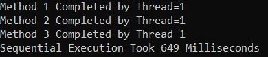
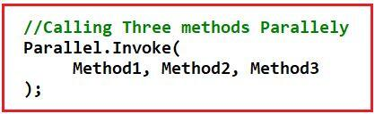
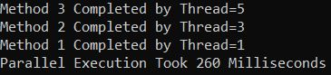
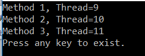
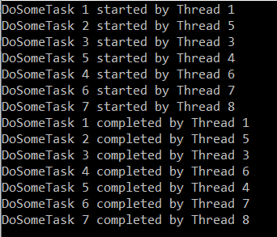
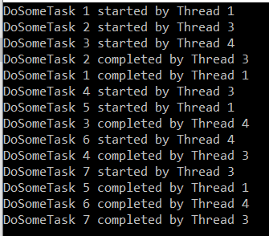
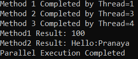

## **فراخوانی موازی متد در سی شارپ به همراه مثال**

در این مقاله، قصد دارم **روش فراخوانی موازی (Parallel Invoke) در سی شارپ را** با مثال‌هایی مورد بحث قرار دهم. روش فراخوانی موازی (Parallel Invoke) در سی شارپ یکی از پرکاربردترین روش‌های استاتیک کلاس Parallel است. تاکنون، ما از حلقه‌های Parallel For و Parallel Foreach برای اجرای چندین باره‌ی یک بلوک کد به صورت موازی استفاده کرده‌ایم. با این حال، گاهی اوقات می‌خواهیم روش‌های مختلفی را که جزئی از بلوک کد یک حلقه نیستند، به صورت موازی فراخوانی کنیم. برای این کار، می‌توانیم از روش فراخوانی موازی (Parallel Invoke) در سی شارپ استفاده کنیم.

##### **مثالی برای درک متد فراخوانی موازی در سی شارپ**

متد Parallel Invoke در سی شارپ برای اجرای چندین وظیفه که قرار است به صورت موازی اجرا شوند، استفاده می‌شود. ابتدا یک مثال ایجاد می‌کنیم که در آن سه متد مستقل را به صورت متوالی فراخوانی می‌کنیم و سپس همان مثال را بازنویسی می‌کنیم که در آن سه متد مستقل مشابه را به صورت موازی با استفاده از متد Parallel Invoke فراخوانی می‌کنیم. در مثال زیر، متدهای ۱، ۲ و ۳ را فراخوانی کرده‌ایم و سپس مدت زمانی را که این سه متد برای تکمیل اجرا صرف کرده‌اند، در پنجره کنسول ثبت می‌کنیم.

```csharp
using System;
using System.Diagnostics;
using System.Threading;
using System.Threading.Tasks;

namespace ParallelProgrammingDemo
{
    public class Program
    {
        static void Main()
        {
            Stopwatch stopWatch = new Stopwatch();

            stopWatch.Start();
            // Calling Three methods sequentially
            Method1();
            Method2();
            Method3();
            stopWatch.Stop();

            Console.WriteLine($"Sequential Execution Took {stopWatch.ElapsedMilliseconds} Milliseconds");
            Console.ReadKey();
        }
        static void Method1()
        {
            Thread.Sleep(200);
            Console.WriteLine($"Method 1 Completed by Thread={Thread.CurrentThread.ManagedThreadId}");
        }
        static void Method2()
        {
            Thread.Sleep(200);
            Console.WriteLine($"Method 2 Completed by Thread={Thread.CurrentThread.ManagedThreadId}");
        }
        static void Method3()
        {
            Thread.Sleep(200);
            Console.WriteLine($"Method 3 Completed by Thread={Thread.CurrentThread.ManagedThreadId}");
        }
    }
}
```

###### **خروجی:**



همانطور که در تصویر بالا مشاهده می‌کنید، هر سه متد توسط یک نخ واحد اجرا می‌شوند و در دستگاه من تقریباً ۶۴۹ میلی‌ثانیه طول می‌کشد تا اجرا کامل شود. حال، همان مثال را با استفاده از **متد Parallel.Invoke** خواهیم دید که این سه متد را به صورت موازی اجرا می‌کند. کاری که باید انجام دهیم این است که نام متدها را همانطور که در تصویر زیر نشان داده شده است، به متد Parallel.Invoke ارسال کنیم.



کد کامل مثال در زیر آمده است.

```csharp
using System;
using System.Diagnostics;
using System.Threading;
using System.Threading.Tasks;

namespace ParallelProgrammingDemo
{
    public class Program
    {
        static void Main()
        {
            Stopwatch stopWatch = new Stopwatch();

            stopWatch.Start();

            // Calling Three methods Parallely
            Parallel.Invoke(
                 Method1, Method2, Method3
            );

            stopWatch.Stop();
            Console.WriteLine($"Parallel Execution Took {stopWatch.ElapsedMilliseconds} Milliseconds");

            Console.ReadKey();
        }
        static void Method1()
        {
            Thread.Sleep(200);
            Console.WriteLine($"Method 1 Completed by Thread={Thread.CurrentThread.ManagedThreadId}");
        }
        static void Method2()
        {
            Thread.Sleep(200);
            Console.WriteLine($"Method 2 Completed by Thread={Thread.CurrentThread.ManagedThreadId}");
        }
        static void Method3()
        {
            Thread.Sleep(200);
            Console.WriteLine($"Method 3 Completed by Thread={Thread.CurrentThread.ManagedThreadId}");
        }
    }
}
```

###### **خروجی:**



همانطور که در اینجا می‌بینید، سه متد مختلف توسط سه نخ مختلف اجرا می‌شوند و همچنین در دستگاه من ۲۶۰ میلی‌ثانیه به نظر می‌رسد. اگر مشاهده کنید، زمان کمتری نسبت به اجرای ترتیبی صرف می‌شود. اما این همیشه یکسان نخواهد بود، یعنی گاهی اوقات اگر کاری که قرار است انجام دهیم بسیار کوچک باشد، اجرای ترتیبی زمان کمتری نسبت به اجرای موازی صرف می‌کند. بنابراین، همیشه توصیه می‌شود قبل از انتخاب اینکه آیا می‌خواهید متدها را به صورت موازی یا متوالی اجرا کنید، اندازه‌گیری عملکرد انجام دهید.

##### **مثالی برای فراخوانی انواع مختلف متدها با استفاده از Parallel.Invoke در سی شارپ:**

مثال زیر نحوه استفاده از متد Parallel Invoke در سی شارپ را با متدهای معمولی، متدهای ناشناس (delegates) و عبارات لامبدا نشان می‌دهد.

```csharp
using System;
using System.Threading;
using System.Threading.Tasks;

namespace ParallelProgrammingDemo
{
    public class Program
    {
        static void Main()
        {
            Parallel.Invoke(
                 NormalAction, // Invoking Normal Method
                 delegate ()   // Invoking an inline delegate
                 {
                     Console.WriteLine($"Method 2, Thread={Thread.CurrentThread.ManagedThreadId}");
                 },
                () =>   // Invoking a lambda expression
                {
                    Console.WriteLine($"Method 3, Thread={Thread.CurrentThread.ManagedThreadId}");
                }
            );
            Console.WriteLine("Press any key to exist.");
            Console.ReadKey();
        }
        static void NormalAction()
        {
            Console.WriteLine($"Method 1, Thread={Thread.CurrentThread.ManagedThreadId}");
        }
    }
}
```

###### **خروجی:**



متد Parallel Invoke برای اجرای مجموعه‌ای از عملیات (اکشن‌ها) به صورت موازی استفاده می‌شود. همانطور که در خروجی بالا مشاهده می‌کنید، سه thread برای اجرای سه اکشن ایجاد شده‌اند که ثابت می‌کند این متد Invoke موازی، اکشن‌ها را به صورت موازی اجرا می‌کند.

**نکته:** متد Parallel Invoke در سی شارپ هیچ تضمینی در مورد ترتیب اجرای اکشن‌ها به شما نمی‌دهد. هر بار که کد را اجرا می‌کنید، ممکن است ترتیب خروجی متفاوتی دریافت کنید. نکته مهم دیگری که باید به خاطر داشته باشید این است که این متد زمانی برمی‌گردد که تمام اکشن‌های فراخوانی شده توسط این متد، اجرای خود را کامل کنند.

##### **کلاس ParallelOptions در سی شارپ**

همانطور که قبلاً بحث کردیم، با استفاده از **نمونه کلاس ParallelOptions** ، می‌توانیم تعداد متدهای حلقه که به صورت همزمان اجرا می‌شوند را محدود کنیم. همین کار را می‌توان با متد Invoke نیز انجام داد. بنابراین، با استفاده از درجه موازی‌سازی می‌توانیم حداکثر تعداد نخ‌هایی را که برای اجرای برنامه استفاده می‌شوند، مشخص کنیم.

##### **مثالی برای درک** **کلاس ParallelOptions در سی شارپ با متد Parallel Invoke**

در مثال زیر، ما هفت عمل را بدون تعیین محدودیتی برای تعداد وظایف موازی ایجاد می‌کنیم. بنابراین، در این مثال، ممکن است بتوان هر هفت عمل را به صورت همزمان اجرا کرد.

همانطور که در مثال زیر می‌بینید، ما **هفت بار متد DoSomeTask** را با استفاده از متد Parallel Invoke فراخوانی می‌کنیم. به عنوان بخشی از متد **DoSomeTask** ، ما فقط دو پیام را با یک مکث ۵۰۰۰ میلی‌ثانیه‌ای بین آنها چاپ می‌کنیم. پیام‌ها نشان می‌دهند که وظیفه چه زمانی شروع و پایان یافته و توسط کدام نخ اجرا شده است تا شما ترتیب اجرا را درک کنید.

```csharp
using System;
using System.Threading;
using System.Threading.Tasks;

namespace ParallelProgrammingDemo
{
    public class ParallelInvoke
    {
        static void Main()
        {
            Parallel.Invoke(
                    () => DoSomeTask(1),
                    () => DoSomeTask(2),
                    () => DoSomeTask(3),
                    () => DoSomeTask(4),
                    () => DoSomeTask(5),
                    () => DoSomeTask(6),
                    () => DoSomeTask(7)
                );
            Console.ReadKey();
        }
        static void DoSomeTask(int number)
        {
            Console.WriteLine($"DoSomeTask {number} started by Thread {Thread.CurrentThread.ManagedThreadId}");
            // Sleep for 5000 milliseconds
            Thread.Sleep(5000);
            Console.WriteLine($"DoSomeTask {number} completed by Thread {Thread.CurrentThread.ManagedThreadId}");
        }
    }
}
```

**حالا برنامه را اجرا کنید و خروجی را مانند تصویر زیر ببینید. خروجی ممکن است در دستگاه شما متفاوت باشد.**



در خروجی بالا می‌توانید ببینید که هر یک از هفت وظیفه قبل از تکمیل هر وظیفه دیگری آغاز شده است که ثابت می‌کند هر هفت وظیفه به صورت همزمان اجرا می‌شوند. برای محدود کردن موازی‌سازی، یعنی محدود کردن تعداد رشته‌هایی که باید به صورت همزمان اجرا شوند، باید از کلاس ParallelOptions استفاده کنیم. باید شیء ParallelOptions را به اولین پارامتر متد Invoke ارسال کنیم.

##### **مثال برای محدود کردن تعداد نخ‌ها برای اجرای متدها:**

در مثال زیر، ما MaxDegreeOfParallelism را روی ۳ از کلاس ParallelOptions تنظیم کرده‌ایم که استفاده از حداکثر سه نخ را برای فراخوانی همه متدها محدود می‌کند.

```csharp
using System;
using System.Threading;
using System.Threading.Tasks;

namespace ParallelProgrammingDemo
{
    public class ParallelInvoke
    {
        static void Main()
        {
            // Allowing three task to execute at a time
            ParallelOptions parallelOptions = new ParallelOptions
            {
                MaxDegreeOfParallelism = 3
            };
            // parallelOptions.MaxDegreeOfParallelism = System.Environment.ProcessorCount - 1;

            // Passing ParallelOptions as the first parameter
            Parallel.Invoke(
                    parallelOptions,
                    () => DoSomeTask(1),
                    () => DoSomeTask(2),
                    () => DoSomeTask(3),
                    () => DoSomeTask(4),
                    () => DoSomeTask(5),
                    () => DoSomeTask(6),
                    () => DoSomeTask(7)
                );
            Console.ReadKey();
        }
        static void DoSomeTask(int number)
        {
            Console.WriteLine($"DoSomeTask {number} started by Thread {Thread.CurrentThread.ManagedThreadId}");
            // Sleep for 500 milliseconds
            Thread.Sleep(5000);
            Console.WriteLine($"DoSomeTask {number} completed by Thread {Thread.CurrentThread.ManagedThreadId}");
        }
    }
}
```

###### **خروجی:**



همانطور که از خروجی بالا مشاهده می‌کنید، سه وظیفه اول به طور همزمان شروع شده‌اند، زیرا درجه موازی‌سازی را روی ۳ تنظیم کرده‌ایم. وقتی یکی از وظایف اجرای خود را به پایان می‌رساند، وظیفه دیگری شروع می‌شود. این فرآیند تا زمانی که همه اقدامات کار خود را به پایان برسانند، ادامه خواهد یافت. اما مهمترین نکته‌ای که باید به خاطر داشته باشید این است که در هر نقطه از زمان، بیش از سه وظیفه در حال اجرا نیست.

##### **فراخوانی متدها با ورودی و نوع بازگشتی با استفاده از Parallel.Invoke:**

تا اینجا، ما در مورد متدی که هیچ پارامتری نمی‌گیرد و نوع بازگشتی آن متدها void است، بحث کرده‌ایم. حال، بیایید ادامه دهیم و سعی کنیم نحوه فراخوانی متدها با استفاده از Parallel.Invoke را با مقادیر ورودی درک کنیم و همچنین ببینیم که چگونه مقدار بازگشتی یک متد را ذخیره کنیم. برای درک بهتر، لطفاً به مثال زیر نگاهی بیندازید. در اینجا، متد ۱ هیچ مقدار ورودی نمی‌گیرد اما یک مقدار صحیح را برمی‌گرداند. متد ۲ یک مقدار رشته‌ای می‌گیرد و همچنین یک مقدار رشته‌ای را برمی‌گرداند. و متد Method3 یک مقدار صحیح می‌گیرد و چیزی برنمی‌گرداند، یعنی void.

```csharp
using System;
using System.Threading;
using System.Threading.Tasks;

namespace ParallelProgrammingDemo
{
    public class Program
    {
        static void Main()
        {
            int intResult = 0;
            string strResult = string.Empty;
            // Calling Three methods Parallely
            Parallel.Invoke(
                () => intResult = Method1(),
                () => strResult = Method2("Pranaya"),
                () => Method3(100)
            );

            Console.WriteLine($"Method1 Result: {intResult}");
            Console.WriteLine($"Method2 Result: {strResult}");
            Console.WriteLine($"Parallel Execution Completed");

            Console.ReadKey();
        }
        static int Method1()
        {
            Task.Delay(200);
            Console.WriteLine($"Method 1 Completed by Thread={Thread.CurrentThread.ManagedThreadId}");
            return 100;
        }
        static string Method2(string name)
        {
            Task.Delay(200);
            Console.WriteLine($"Method 2 Completed by Thread={Thread.CurrentThread.ManagedThreadId}");
            return "Hello:" + name;
        }
        static void Method3(int number)
        {
            Task.Delay(200);
            Console.WriteLine($"Method 3 Completed by Thread={Thread.CurrentThread.ManagedThreadId}");
        }
    }
}
```

###### **خروجی:**

