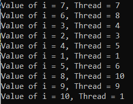
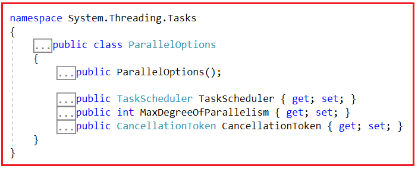
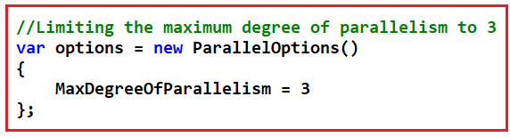
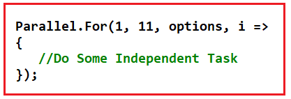
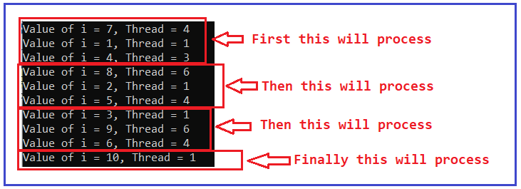
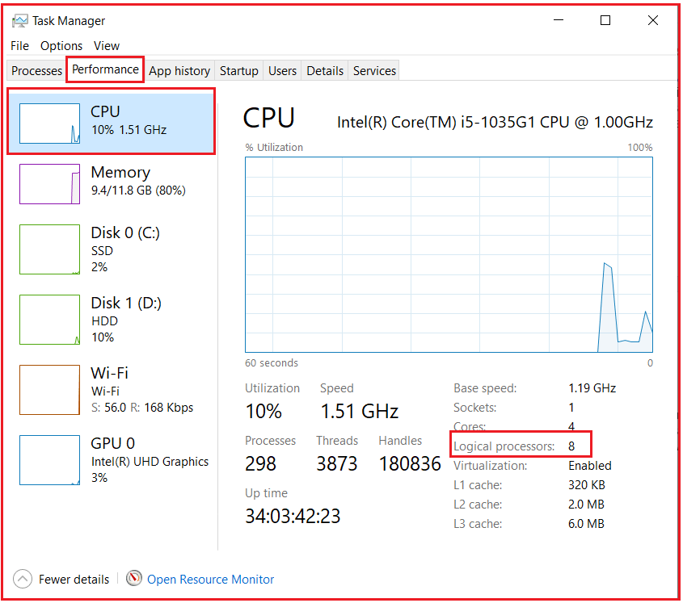
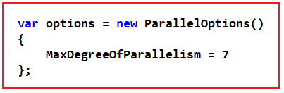
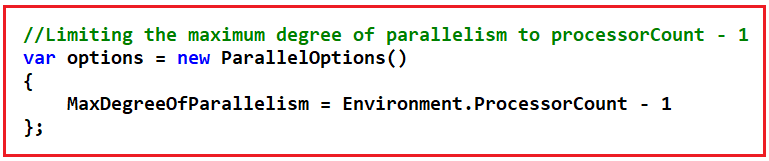
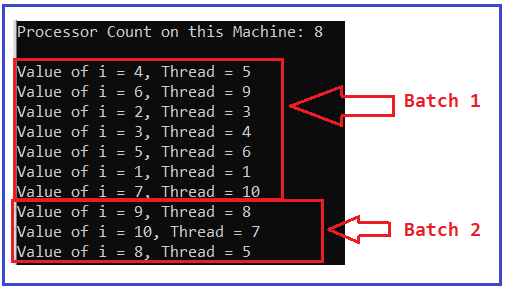
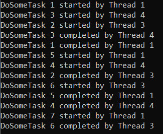

## **نحوه استفاده از حداکثر درجه موازی سازی در سی شارپ به همراه مثال**

در این مقاله، قصد دارم **نحوه استفاده از حداکثر درجه موازی‌سازی در سی‌شارپ را** با مثال بررسی کنم. لطفاً مقاله قبلی ما را که در آن در مورد روش فراخوانی موازی در سی‌شارپ با مثال بحث کردیم، مطالعه کنید.

##### **چگونه از حداکثر درجه موازی سازی در سی شارپ استفاده کنیم؟**

تاکنون، وقتی از موازی‌سازی استفاده می‌کردیم، اجازه می‌دادیم تا حد امکان از نخ‌های (threads) کامپیوترمان برای حل وظیفه‌ای که داریم استفاده شود. با این حال، این لزوماً چیزی نیست که بخواهیم. گاهی اوقات می‌خواهیم منابع مورد استفاده برای یک وظیفه را محدود کنیم تا بتوانیم وظایف دیگری را که ممکن است در انتظار انجام باشند، مدیریت کنیم.

ما می‌توانیم این را با تعریف حداکثر درجه موازی‌سازی پیکربندی کنیم. با حداکثر درجه موازی‌سازی، می‌توانیم مشخص کنیم که چند رشته همزمان روی کدی که می‌خواهیم به صورت موازی اجرا کنیم، کار خواهند کرد. برای این کار، کلاس ParallelOptions در C# در اختیار ما قرار گرفته است.

##### **کلاس ParallelOptions در سی شارپ**

کلاس ParallelOptions یکی از مفیدترین کلاس‌ها هنگام کار با چندنخی (multithreading) است. این کلاس گزینه‌هایی را برای محدود کردن تعداد نخ‌های در حال اجرای همزمان برای اجرای کد موازی ما و همچنین گزینه‌هایی را برای لغو اجرای موازی ارائه می‌دهد. در این مقاله، خواهیم دید که چگونه تعداد نخ‌های در حال اجرای همزمان را محدود کنیم و در مقاله بعدی، نحوه لغو اجرای موازی را با مثال‌هایی به شما نشان خواهم داد.

##### **مثال بدون استفاده از کلاس ParallelOption در سی شارپ:**

در مثال زیر، ما از حداکثر درجه موازی‌سازی استفاده نمی‌کنیم و از این رو هیچ محدودیتی در تعداد نخ‌ها برای اجرای موازی کد وجود ندارد.

```csharp
using System;
using System.Threading;
using System.Threading.Tasks;

namespace ParallelProgrammingDemo
{
    class Program
    {
        static void Main(string[] args)
        {
            Parallel.For(1, 11, i =>
            {
                Thread.Sleep(500);
                Console.WriteLine($"Value of i = {i}, Thread = {Thread.CurrentThread.ManagedThreadId}");
            });
            Console.ReadLine();
        }
    }
}
```

###### **خروجی:**

.

همانطور که در خروجی بالا مشاهده می‌کنید، هیچ محدودیتی در تعداد نخ‌ها برای اجرای کد وجود ندارد. حال، فرض کنید می‌خواهیم حداکثر سه نخ برای اجرای کد ما وجود داشته باشد. برای این کار، باید از حداکثر درجه موازی‌سازی استفاده کنیم.

##### **چگونه از حداکثر درجه موازی سازی در سی شارپ استفاده کنیم؟**

برای استفاده از حداکثر درجه موازی‌سازی در سی‌شارپ، کلاس ParallelOptions زیر در اختیار ما قرار گرفته است.



کلاس ParallelOptions در سی شارپ سازنده زیر را ارائه می‌دهد که می‌توانیم از آن برای ایجاد یک نمونه از کلاس ParallelOptions استفاده کنیم.

1. **ParallelOptions():** یک نمونه جدید از کلاس System.Threading.Tasks.ParallelOptions را مقداردهی اولیه می‌کند.

کلاس ParallelOptions سه ویژگی زیر را ارائه می‌دهد.

1. **public TaskScheduler TaskScheduler {get; set;}:** برای دریافت یا تنظیم TaskScheduler مرتبط با این نمونه ParallelOptions استفاده می‌شود. تنظیم این ویژگی با مقدار null نشان می‌دهد که زمان‌بند فعلی باید استفاده شود. زمان‌بند وظیفه‌ای را که با این نمونه مرتبط است، برمی‌گرداند.
2. **public int MaxDegreeOfParallelism {get; set;}:** برای دریافت یا تنظیم حداکثر تعداد وظایف همزمان فعال شده توسط این نمونه ParallelOptions استفاده می‌شود. این تابع یک عدد صحیح برمی‌گرداند که نشان دهنده حداکثر درجه موازی بودن است. اگر مقدار ویژگی روی صفر یا مقداری کمتر از -1 تنظیم شود، خطای ArgumentOutOfRangeException رخ می‌دهد. -1 مقدار پیش‌فرض است که تعیین می‌کند هیچ محدودیتی برای وظایف همزمان برای اجرا وجود ندارد.
3. **عمومی CancellationToken CancellationToken {get; set;}:** برای دریافت یا تنظیم CancellationToken مرتبط با این نمونه ParallelOptions استفاده می‌شود. توکنی را که با این نمونه مرتبط است، برمی‌گرداند.

بنابراین، برای استفاده از Maximum Degree of Parallelism در سی شارپ، باید یک نمونه از کلاس ParallelOptions ایجاد کنیم و ویژگی‌های MaxDegreeOfParallelism را روی یک عدد صحیح تنظیم کنیم که نشان دهنده تعداد رشته‌های اجرای کد است. تصویر زیر سینتکس استفاده از Maximum Degree of Parallelism را نشان می‌دهد. در اینجا، مقدار را روی ۳ تنظیم می‌کنیم که به این معنی است که حداکثر سه رشته قرار است کد را به صورت موازی اجرا کنند.



زمانی که نمونه کلاس ParallelOptions را ایجاد کردید و ویژگی MaxDegreeOfParallelism را تنظیم کردید، باید این نمونه را به متدهای Parallel ارسال کنیم. تصویر زیر نحوه ارسال نمونه ParallelOptions به متد Parallel For در سی شارپ را نشان می‌دهد.



با این تغییر، اکنون حداکثر سه نخ حلقه Parallel For را اجرا می‌کنند. در ادامه مثال کامل کد آمده است.

```csharp
using System;
using System.Threading;
using System.Threading.Tasks;

namespace ParallelProgrammingDemo
{
    class Program
    {
        static void Main(string[] args)
        {
            // Limiting the maximum degree of parallelism to 3
            var options = new ParallelOptions()
            {
                MaxDegreeOfParallelism = 3
            };

            // A maximum of three threads are going to execute the code parallelly
            Parallel.For(1, 11, options, i =>
            {
                Thread.Sleep(500);
                Console.WriteLine($"Value of i = {i}, Thread = {Thread.CurrentThread.ManagedThreadId}");
            });

            Console.ReadLine();
        }
    }
}
```

###### **خروجی:**



هنگام اجرای برنامه، لطفاً خروجی را با دقت مشاهده کنید. ابتدا، سه رکورد اول را پردازش می‌کند، سپس سه رکورد بعدی را پردازش می‌کند، سپس سه دستور چاپ بعدی را پردازش می‌کند و در نهایت، آخرین دستور را پردازش می‌کند. بنابراین، تمام دستورات را به صورت موازی با استفاده از نخ‌های مختلف اجرا نمی‌کند، بلکه حلقه را با استفاده از حداکثر سه نخ به صورت موازی اجرا می‌کند. ممکن است در هر دسته از نخ‌های مختلف استفاده کند.

##### **چگونه می‌توان به درستی از حداکثر درجه موازی‌سازی در سی شارپ استفاده کرد؟**

طبق استاندارد صنعتی، باید حداکثر درجه موازی‌سازی را روی تعداد پردازنده‌های موجود در دستگاه منهای ۱ تنظیم کنیم. برای بررسی تعداد پردازنده‌های دستگاه خود، Task Manager را باز کنید و سپس به تب Performance بروید و همانطور که در تصویر زیر نشان داده شده است، CPU را انتخاب کنید.



همانطور که در تصویر بالا مشاهده می‌کنید، روی دستگاه من ۸ پردازنده منطقی وجود دارد. بنابراین، طبق استاندارد صنعتی، اگر بخواهم برنامه را روی دستگاه خود اجرا کنم، باید حداکثر درجه موازی‌سازی را روی ۷ تنظیم کنم. می‌توانم این مقدار را به صورت زیر تعریف کنم.



اما این یک روش برنامه‌نویسی خوب نیست. ما برنامه‌هایی را برای اجرا روی دستگاه خودمان توسعه نمی‌دهیم. ما برنامه را برای کلاینت توسعه می‌دهیم و تعداد پردازنده‌های منطقی روی دستگاه کلاینت را نمی‌دانیم. بنابراین، نباید مقدار را به صورت کدنویسی شده بنویسیم. در عوض، سی‌شارپ **ویژگی Environment.ProcessorCount** را ارائه می‌دهد که تعداد پردازنده‌های منطقی روی دستگاهی که برنامه روی آن اجرا می‌شود را به ما می‌دهد. بنابراین، باید حداکثر درجه موازی‌سازی را در سی‌شارپ به صورت زیر تنظیم کنیم.



کد کامل مثال در زیر آمده است.

```csharp
using System;
using System.Threading;
using System.Threading.Tasks;

namespace ParallelProgrammingDemo
{
    class Program
    {
        static void Main(string[] args)
        {
            // Getting the Number of Processor count
            int processorCount = Environment.ProcessorCount;

            Console.WriteLine($"Processor Count on this Machine: {processorCount}\n");

            // Limiting the maximum degree of parallelism to processorCount - 1
            var options = new ParallelOptions()
            {
                // You can hard code the value as follows
                // MaxDegreeOfParallelism = 7
                // But better to use the following statement
                MaxDegreeOfParallelism = Environment.ProcessorCount - 1
            };

            Parallel.For(1, 11, options, i =>
            {
                Thread.Sleep(500);
                Console.WriteLine($"Value of i = {i}, Thread = {Thread.CurrentThread.ManagedThreadId}");
            });

            Console.ReadLine();
        }
    }
}
```

###### **خروجی:**



امیدوارم حالا متوجه شده باشید که چگونه می‌توان به طور موثر از Maximum Degree of Parallelism در سی شارپ استفاده کرد. در اینجا مثالی از استفاده از حلقه Parallel For را دیدیم، همین امر برای دو روش دیگر یعنی Parallel Invoke و Parallel Foreach نیز صدق می‌کند. بیایید مثال‌هایی از هر دو را بررسی کنیم.

##### **مثال حداکثر درجه موازی‌سازی با استفاده از حلقه Foreach موازی:**

```csharp
using System;
using System.Collections.Generic;
using System.Linq;
using System.Threading;
using System.Threading.Tasks;

namespace ParallelProgrammingDemo
{
    class Program
    {
        static void Main(string[] args)
        {
            // Limiting the maximum degree of parallelism to ProcessorCount - 1
            var options = new ParallelOptions()
            {
                // MaxDegreeOfParallelism = 7
                MaxDegreeOfParallelism = Environment.ProcessorCount - 1
            };

            List<int> integerList = Enumerable.Range(0, 10).ToList();
            Parallel.ForEach(integerList, options, i =>
            {
                Console.WriteLine($"Value of i = {i}, thread = {Thread.CurrentThread.ManagedThreadId}");
            });

            Console.ReadLine();
        }
    }
}
```

##### **مثال حداکثر درجه موازی‌سازی با استفاده از متد فراخوانی موازی در سی‌شارپ:**

```csharp
using System;
using System.Threading;
using System.Threading.Tasks;

namespace ParallelProgrammingDemo
{
    class Program
    {
        static void Main(string[] args)
        {
            var parallelOptions = new ParallelOptions()
            {
                MaxDegreeOfParallelism = 3
                // MaxDegreeOfParallelism = Environment.ProcessorCount - 1
            };

            // Passing ParallelOptions as the first parameter
            Parallel.Invoke(
                    parallelOptions,
                    () => DoSomeTask(1),
                    () => DoSomeTask(2),
                    () => DoSomeTask(3),
                    () => DoSomeTask(4),
                    () => DoSomeTask(5),
                    () => DoSomeTask(6),
                    () => DoSomeTask(7)
                );

            Console.ReadLine();
        }

        static void DoSomeTask(int number)
        {
            Console.WriteLine($"DoSomeTask {number} started by Thread {Thread.CurrentThread.ManagedThreadId}");
            // Sleep for 5000 milliseconds
            Thread.Sleep(5000);
            Console.WriteLine($"DoSomeTask {number} completed by Thread {Thread.CurrentThread.ManagedThreadId}");
        }
    }
}
```

###### **خروجی:**

