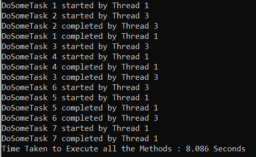
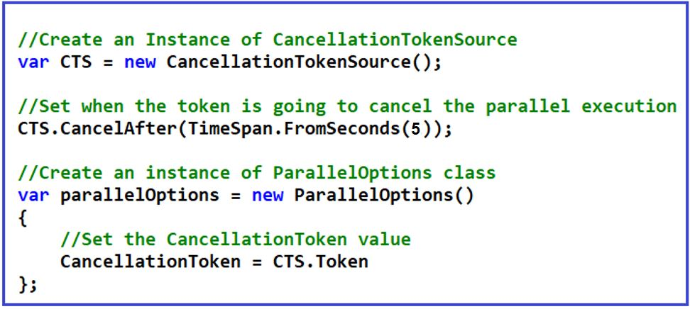
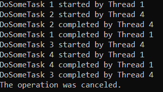
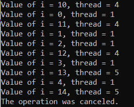
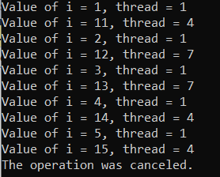

## **نحوه لغو عملیات موازی در سی شارپ با مثال**

در این مقاله، قصد دارم در مورد **نحوه لغو عملیات موازی در سی شارپ** به همراه مثال صحبت کنم. لطفاً مقاله قبلی ما را که در آن در مورد نحوه استفاده از حداکثر درجه موازی سازی در سی شارپ به همراه مثال بحث کردیم، مطالعه کنید.

##### **چگونه عملیات موازی را در سی شارپ لغو کنیم؟**

مانند برنامه‌نویسی ناهمزمان، می‌توانیم از توکن لغو برای لغو عملیات در برنامه‌نویسی موازی استفاده کنیم. می‌توانیم از همان توکن لغو در اینجا نیز استفاده کنیم. کلاس ParallelOptions گزینه‌ای برای لغو اجرای موازی ارائه می‌دهد. اگر روی کلاس ParallelOptions کلیک راست کرده و go to definition را انتخاب کنید، موارد زیر را مشاهده خواهید کرد. این کلاس یک سازنده و سه ویژگی دارد.


کلاس ParallelOptions در سی شارپ سازنده زیر را ارائه می‌دهد که می‌توانیم از آن برای ایجاد یک نمونه از کلاس ParallelOptions استفاده کنیم.

1. **ParallelOptions():** یک نمونه جدید از کلاس ParallelOptions را مقداردهی اولیه می‌کند.

کلاس ParallelOptions سه ویژگی زیر را ارائه می‌دهد.

1. **public TaskScheduler TaskScheduler {get; set;}:** این ویژگی برای دریافت یا تنظیم TaskScheduler مرتبط با نمونه ParallelOptions استفاده می‌شود. تنظیم این ویژگی با null نشان می‌دهد که باید از زمان‌بند فعلی استفاده شود. این ویژگی زمان‌بند وظیفه‌ای را که با این نمونه مرتبط است، برمی‌گرداند.
2. **public int MaxDegreeOfParallelism {get; set;}:** این ویژگی برای دریافت یا تنظیم حداکثر تعداد وظایف همزمان فعال شده توسط نمونه ParallelOptions استفاده می‌شود. این ویژگی یک عدد صحیح را برمی‌گرداند که نشان دهنده حداکثر درجه موازی بودن است.
3. **عمومی CancellationToken CancellationToken {get; set;}:** این ویژگی برای دریافت یا تنظیم CancellationToken مرتبط با نمونه ParallelOptions استفاده می‌شود. این ویژگی توکنی را که با نمونه ParallelOptions مرتبط است، برمی‌گرداند.

##### **مثال بدون لغو عملیات موازی در سی شارپ:**

در مثال زیر، درجه موازی‌سازی را روی ۲ تنظیم کرده‌ایم، یعنی حداکثر دو نخ می‌توانند متدها را به صورت موازی اجرا کنند. در اینجا، از Cancellation Token استفاده نکرده‌ایم و از این رو، اجرای موازی لغو نخواهد شد.

```csharp
using System;
using System.Diagnostics;
using System.Threading;
using System.Threading.Tasks;

namespace ParallelProgrammingDemo
{
    class Program
    {
        static void Main(string[] args)
        {
            // Create an instance of ParallelOptions class
            var parallelOptions = new ParallelOptions()
            {
                MaxDegreeOfParallelism = 2,
            };

            try
            {
                Stopwatch stopwatch = new Stopwatch();
                stopwatch.Start();
                // Passing ParallelOptions as the first parameter
                Parallel.Invoke(
                        parallelOptions,
                        () => DoSomeTask(1),
                        () => DoSomeTask(2),
                        () => DoSomeTask(3),
                        () => DoSomeTask(4),
                        () => DoSomeTask(5),
                        () => DoSomeTask(6),
                        () => DoSomeTask(7)
                    );
                stopwatch.Stop();
                Console.WriteLine($"Time Taken to Execute all the Methods : {stopwatch.ElapsedMilliseconds / 1000.0} Seconds");
            }
            catch (Exception ex)
            {
                Console.WriteLine(ex.Message);
            }

            Console.ReadLine();
        }

        static void DoSomeTask(int number)
        {
            Console.WriteLine($"DoSomeTask {number} started by Thread {Thread.CurrentThread.ManagedThreadId}");
            // Sleep for 2 seconds
            Thread.Sleep(TimeSpan.FromSeconds(2));
            Console.WriteLine($"DoSomeTask {number} completed by Thread {Thread.CurrentThread.ManagedThreadId}");
        }
    }
}
```

###### **خروجی:**

.

اگر خروجی را مشاهده کنید، حداکثر ۲ رشته برای اجرای موازی کد وجود دارد. توجه داشته باشید که تقریباً کمی بیشتر از ۸ ثانیه طول کشید تا اجرا کامل شود. مدت زمان ممکن است در دستگاه شما متفاوت باشد. اکنون، کاری که ما قصد انجام آن را داریم این است که اجرای موازی را پس از ۵ ثانیه لغو می‌کنیم.

##### **چگونه عملیات موازی را در سی شارپ لغو کنیم؟**

برای لغو عملیات موازی در سی شارپ، ابتدا باید یک نمونه از کلاس ParallelOptions ایجاد کنیم و سپس یک نمونه از CancellationTokenSource ایجاد کنیم و در نهایت باید ویژگی‌های CancellationToken نمونه ParallelOptions را روی توکن نمونه CancellationTokenSource تنظیم کنیم. تصویر زیر سینتکس استفاده از CancellationToken برای لغو اجرای موازی در سی شارپ را نشان می‌دهد.



##### **مثالی برای درک نحوه لغو عملیات موازی در سی شارپ:**

کد کامل مثال به شرح زیر است. در مثال زیر، ما اجرای موازی را پس از ۴ ثانیه لغو می‌کنیم. در برنامه‌نویسی ناهمزمان، قبلاً بحث کردیم که وقتی توکن لغو می‌شود، یک استثنا ایجاد می‌شود، بنابراین بلوک try-catch را در اینجا برای مدیریت آن استثنا نوشته‌ایم. مثل همیشه، یک تمرین برنامه‌نویسی خوب این است که توکن را دور بریزید و مقدار آن را در بلوک finally برابر با null قرار دهید.

```csharp
using System;
using System.Diagnostics;
using System.Threading;
using System.Threading.Tasks;

namespace ParallelProgrammingDemo
{
    class Program
    {
        static void Main(string[] args)
        {
            // Create an Instance of CancellationTokenSource
            var CTS = new CancellationTokenSource();

            // Set when the token is going to cancel the parallel execution
            CTS.CancelAfter(TimeSpan.FromSeconds(5));

            // Create an instance of ParallelOptions class
            var parallelOptions = new ParallelOptions()
            {
                MaxDegreeOfParallelism = 2,
                // Set the CancellationToken value
                CancellationToken = CTS.Token
            };

            try
            {
                Stopwatch stopwatch = new Stopwatch();
                stopwatch.Start();
                // Passing ParallelOptions as the first parameter
                Parallel.Invoke(
                        parallelOptions,
                        () => DoSomeTask(1),
                        () => DoSomeTask(2),
                        () => DoSomeTask(3),
                        () => DoSomeTask(4),
                        () => DoSomeTask(5),
                        () => DoSomeTask(6),
                        () => DoSomeTask(7)
                    );
                stopwatch.Stop();
                Console.WriteLine($"Time Taken to Execute all the Methods : {stopwatch.ElapsedMilliseconds / 1000.0} Seconds");
            }
            // When the token cancelled, it will throw an exception
            catch (Exception ex)
            {
                Console.WriteLine(ex.Message);
            }
            finally
            {
                // Finally dispose the CancellationTokenSource and set its value to null
                CTS.Dispose();
                CTS = null;
            }
            Console.ReadLine();
        }

        static void DoSomeTask(int number)
        {
            Console.WriteLine($"DoSomeTask {number} started by Thread {Thread.CurrentThread.ManagedThreadId}");
            // Sleep for 2 seconds
            Thread.Sleep(TimeSpan.FromSeconds(2));
            Console.WriteLine($"DoSomeTask {number} completed by Thread {Thread.CurrentThread.ManagedThreadId}");
        }
    }
}
```

###### **خروجی:**



هنگام اجرای برنامه، لطفاً خروجی را با دقت مشاهده کنید. در اینجا، اجرا به صورت موازی با استفاده از دو نخ آغاز شده است. اجرا تا زمانی که توکن لغو شود، یعنی به مدت ۴ ثانیه، ادامه خواهد یافت. به محض لغو توکن، اجرای موازی متوقف می‌شود و خطای لغو توکن را که توسط بلوک catch مدیریت می‌شود، نمایش می‌دهد و در بلوک catch، ما فقط پیام خطا را چاپ می‌کنیم، همان چیزی که در آخرین عبارت خروجی می‌بینید.

##### **مثال لغو عملیات موازی با استفاده از حلقه Foreach موازی در سی شارپ:**

در مثال زیر، مجموعه شامل ۲۰ عنصر است که به این معنی است که حلقه Parallel Foreach بیست بار اجرا خواهد شد. و در اینجا ما ویژگی MaxDegreeOfParallelism را روی ۲ تنظیم کرده‌ایم که به این معنی است که حداکثر دو رشته حلقه را به صورت موازی اجرا خواهند کرد. علاوه بر این، ما اجرا را به مدت ۱ ثانیه به تأخیر انداخته‌ایم. سپس مدت زمان Cancellation Token را روی ۵ ثانیه تنظیم کرده‌ایم، یعنی پس از ۵ ثانیه، Cancellation Token اجرای موازی را لغو می‌کند.

```csharp
using System;
using System.Collections.Generic;
using System.Linq;
using System.Threading;
using System.Threading.Tasks;

namespace ParallelProgrammingDemo
{
    class Program
    {
        static void Main(string[] args)
        {
            // Create an Instance of CancellationTokenSource
            var CTS = new CancellationTokenSource();

            // Set when the token is going to cancel the parallel execution
            CTS.CancelAfter(TimeSpan.FromSeconds(5));

            // Create an instance of ParallelOptions class
            var parallelOptions = new ParallelOptions()
            {
                MaxDegreeOfParallelism = 2,
                // Set the CancellationToken value
                CancellationToken = CTS.Token
            };

            try
            {
                List<int> integerList = Enumerable.Range(0, 20).ToList();
                Parallel.ForEach(integerList, parallelOptions, i =>
                {
                    Thread.Sleep(TimeSpan.FromSeconds(1));
                    Console.WriteLine($"Value of i = {i}, thread = {Thread.CurrentThread.ManagedThreadId}");
                });

            }
            // When the token canceled, it will throw an exception
            catch (Exception ex)
            {
                Console.WriteLine(ex.Message);
            }
            finally
            {
                // Finally dispose the CancellationTokenSource and set its value to null
                CTS.Dispose();
                CTS = null;
            }
            Console.ReadLine();
        }
    }
}
```

###### **خروجی:**



##### **مثال لغو اجرای عملیات موازی با استفاده از حلقه For موازی در سی شارپ:**

در مثال زیر، حلقه‌ی For موازی ۲۰ بار اجرا می‌شود. در اینجا ما ویژگی MaxDegreeOfParallelism را روی ۲ تنظیم کرده‌ایم، به این معنی که حداکثر دو رشته حلقه‌ی for را به صورت موازی اجرا خواهند کرد. علاوه بر این، ما عمداً اجرا را به مدت ۱ ثانیه به تأخیر انداخته‌ایم تا فرصتی برای لغو اجرا پس از مدت زمان مشخصی داشته باشیم. سپس مدت زمان Cancellation Token را روی ۵ ثانیه تنظیم کرده‌ایم، یعنی پس از ۵ ثانیه، Cancellation Token با ایجاد یک استثنا که توسط بلوک catch مدیریت می‌شود، اجرای حلقه‌ی for موازی را لغو می‌کند و در نهایت، در بلوک finally باید token را حذف کرده و مقدار آن را null قرار دهیم.

```csharp
using System;
using System.Threading;
using System.Threading.Tasks;

namespace ParallelProgrammingDemo
{
    class Program
    {
        static void Main(string[] args)
        {
            // Create an Instance of CancellationTokenSource
            var CTS = new CancellationTokenSource();

            // Set when the token is going to cancel the parallel execution
            CTS.CancelAfter(TimeSpan.FromSeconds(5));

            // Create an instance of ParallelOptions class
            var parallelOptions = new ParallelOptions()
            {
                MaxDegreeOfParallelism = 2,
                // Set the CancellationToken value
                CancellationToken = CTS.Token
            };

            try
            {
                Parallel.For(1, 21, parallelOptions, i => {
                    Thread.Sleep(TimeSpan.FromSeconds(1));
                    Console.WriteLine($"Value of i = {i}, thread = {Thread.CurrentThread.ManagedThreadId}");
                });

            }
            // When the token canceled, it will throw an exception
            catch (Exception ex)
            {
                Console.WriteLine(ex.Message);
            }
            finally
            {
                // Finally dispose the CancellationTokenSource and set its value to null
                CTS.Dispose();
                CTS = null;
            }
            Console.ReadLine();
        }
    }
}
```

###### **خروجی:**



**نکته:** هر آنچه که در برنامه‌نویسی ناهمزمان در مورد منبع توکن لغو و توکن لغو یاد می‌گیریم، در برنامه‌نویسی موازی نیز قابل اجرا است.