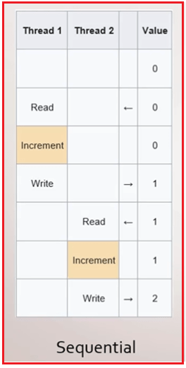
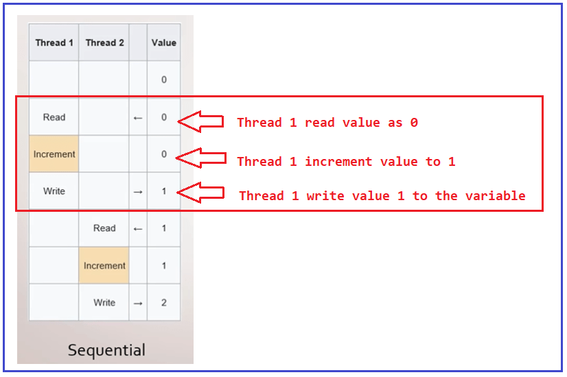
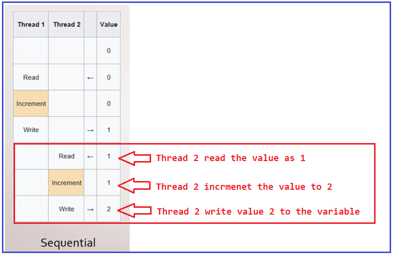
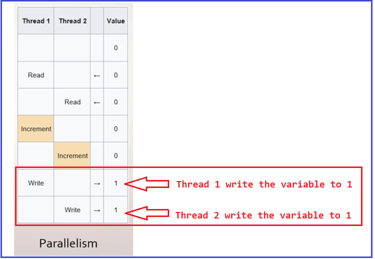
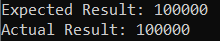

## **روش‌های اتمی، ایمنی نخ و شرایط رقابتی در سی‌شارپ**

در این مقاله، قصد دارم در مورد **روش‌های اتمی، ایمنی نخ و شرایط رقابتی در سی‌شارپ** با مثال‌هایی بحث کنم. لطفاً مقاله قبلی ما را که در آن در مورد نحوه لغو عملیات موازی در سی‌شارپ با مثال‌هایی بحث کردیم، مطالعه کنید.

##### **متدهای اتمی در سی شارپ:**

تاکنون، با متدهای موازی (For، Foreach و Invoke) کار کرده‌ایم و وظیفه را به طور مستقل انجام داده‌ایم. به این معنا که آنها برای کار به داده‌های خارجی یا داده‌های مشترک نیاز ندارند. اما همیشه اینطور نیست. گاهی اوقات می‌خواهیم داده‌ها را بین نخ‌ها به اشتراک بگذاریم.

مفهوم مهمی که باید در نظر گرفته شود، مفهوم **متدهای اتمی** است . متدهای اتمی را می‌توان به راحتی در یک محیط چندنخی استفاده کرد زیرا آنها قطعیت را تضمین می‌کنند، یعنی ما همیشه نتیجه یکسانی را به دست خواهیم آورد، مهم نیست چند نخ سعی کنند همزمان متد را اجرا کنند.

##### **ویژگی‌های متدهای اتمی در سی شارپ:**

دو ویژگی اساسی برای متدهای اتمی در سی شارپ وجود دارد.

1. اول اینکه، اگر یک نخ در حال اجرای یک متد اتمی باشد، نخ دیگر نمی‌تواند حالت میانی را ببیند، یعنی اینکه عملیات یا شروع نشده یا قبلاً تکمیل شده است. اما هیچ حالت میانی بین شروع و پایان وجود ندارد.
2. دوم، عملیات با موفقیت انجام می‌شود یا بدون ایجاد هیچ تغییری کاملاً شکست می‌خورد. این بخش مشابه تراکنش‌های پایگاه داده است که در صورت وجود حداقل یک خطا، یا تمام عملیات موفقیت‌آمیز هستند یا هیچ عملیاتی انجام نمی‌شود.

##### **چگونه در سی شارپ به اتمی بودن دست یابیم؟**

روش‌های مختلفی برای دستیابی به Atomicity در سی‌شارپ وجود دارد. رایج‌ترین روش استفاده **از قفل‌ها** است . قفل‌ها به ما این امکان را می‌دهند که هنگام فعال شدن قفل، مانع از اجرای یک قطعه کد توسط سایر نخ‌ها شویم. اگر با مجموعه‌ها کار می‌کنید، گزینه دیگر استفاده **از مجموعه‌های همزمان** است که به طور خاص برای مدیریت سناریوهای چندنخی طراحی شده‌اند. اگر از مکانیسم‌های مناسب استفاده نکنیم، در نهایت با نتایج غیرمنتظره، داده‌های خراب یا مقادیر نادرست مواجه خواهیم شد.

##### **ایمنی نخ در سی شارپ:**

یک مفهوم مهم در محیط موازی‌سازی، thread-safe است. وقتی می‌گوییم یک متد thread-safe است، منظورمان این است که می‌توانیم این متد را همزمان از چندین thread بدون ایجاد هیچ نوع خطایی اجرا کنیم. می‌دانیم که وقتی داده‌های برنامه خراب نشوند، اگر دو یا چند thread سعی کنند عملیاتی را روی داده‌های یکسان به طور همزمان انجام دهند، thread-safe داریم.

##### **چگونه در سی شارپ به امنیت نخ (Thread Safety) دست یابیم؟**

برای داشتن یک متد thread-safe در سی شارپ چه کاری باید انجام دهیم؟ خب، همه چیز به کاری که درون متد انجام می‌دهیم بستگی دارد. اگر درون متد یک متغیر خارجی اضافه کنیم، ممکن است با نتایج غیرمنتظره در آن متغیر مواجه شویم. چیزی که می‌توانیم برای کاهش این مشکل استفاده کنیم، استفاده از یک مکانیزم همگام‌سازی مانند استفاده از Interlocked یا استفاده از قفل‌ها است.

اگر نیاز به تبدیل اشیاء داشته باشیم، می‌توانیم از اشیاء تغییرناپذیر برای جلوگیری از مشکلات خراب شدن آن اشیاء استفاده کنیم. در حالت ایده‌آل، باید با توابع خالص کار کنیم. توابع خالص آن‌هایی هستند که برای آرگومان‌های یکسان، مقدار یکسانی را برمی‌گردانند و اثرات ثانویه ایجاد نمی‌کنند.

##### **شرایط مسابقه در سی شارپ:**

شرایط رقابتی در سی شارپ زمانی رخ می‌دهد که یک متغیر بین چندین نخ مشترک باشد و این نخ‌ها بخواهند متغیرها را به طور همزمان تغییر دهند. مشکل این است که بسته به ترتیب توالی عملیات انجام شده روی یک متغیر توسط نخ‌های مختلف، مقدار متغیر متفاوت خواهد بود. عملیات به سادگی افزایش یک واحدی هستند.

اگر این کار را در سناریوهای چندنخی روی یک متغیر مشترک انجام دهیم، یک متغیر مشکل‌ساز خواهد بود. دلیلش این است که حتی افزایش یک واحدی یک متغیر یا اضافه کردن یک واحد به متغیر نیز مشکل‌ساز است. دلیلش این است که این عملیات اتمیک نیست. افزایش ساده‌ی یک متغیر، یک عملیات اتمیک نیست.

در واقع، به سه بخش خواندن، افزایش و نوشتن تقسیم می‌شود. با توجه به این واقعیت که ما سه عملیات داریم، دو نخ می‌توانند آنها را به گونه‌ای اجرا کنند که حتی اگر مقدار یک متغیر را دو بار افزایش دهیم، فقط یک افزایش اعمال شود.

##### **مثال برای درک شرایط مسابقه در سی شارپ:**

برای مثال، در جدول زیر، اگر دو thread به طور متوالی سعی کنند یک متغیر را افزایش دهند، چه اتفاقی می‌افتد؟ ما thread 1 را در ستون اول و thread 2 را در ستون دوم داریم. و در نهایت، یک ستون value که نشان دهنده مقدار متغیر مشترک است. برای درک بهتر، لطفاً به نمودار زیر نگاهی بیندازید.



در ابتدا، مقدار متغیر صفر است. سپس Thread 1 آن مقدار را در حافظه افزایش می‌دهد و در نهایت آن مقدار را در متغیر قرار می‌دهد. و سپس مقدار متغیر ۱ می‌شود. برای درک بهتر، لطفاً به نمودار زیر نگاهی بیندازید.



سپس پس از اینکه نخ ۲ مقدار متغیر را که اکنون مقدار ۱ دارد می‌خواند، مقدار موجود در حافظه را یک واحد افزایش می‌دهد. و در نهایت، دوباره در متغیر می‌نویسد. و مقدار متغیر اکنون ۲ است. برای درک بهتر، لطفاً به نمودار زیر نگاهی بیندازید.



این به دلیل اجرای متوالی قابل انتظار است. با این حال، اگر دو نخ سعی کنند متغیر را به طور همزمان به‌روزرسانی کنند، چه اتفاقی می‌افتد؟

##### **چه اتفاقی می‌افتد اگر دو نخ (thread) سعی کنند متغیر را همزمان به‌روزرسانی کنند؟**

خب، نتیجه می‌تواند این باشد که مقدار نهایی متغیر ۱ یا ۲ باشد. بیایید یک احتمال را بررسی کنیم. لطفاً به نمودار زیر نگاهی بیندازید. در اینجا دوباره، ما Thread 1، Thread 2 و مقدار متغیر را داریم.

 سعی کنند متغیر را همزمان به‌روزرسانی کنند؟")

حالا، نخ ۱ و نخ ۲ هر دو مقادیر را می‌خوانند و بنابراین هر دو مقدار صفر را در حافظه دارند. برای درک بهتر، لطفاً به تصویر زیر نگاهی بیندازید.

 سعی کنند متغیر را همزمان به‌روزرسانی کنند؟")

نخ سوم مقدار را افزایش می‌دهد، و همچنین نخ دوم نیز مقدار را افزایش می‌دهد و هر دو آن را در حافظه به ۱ افزایش می‌دهند. برای درک بهتر، لطفاً به تصویر زیر نگاهی بیندازید.

 سعی کنند متغیر را همزمان به‌روزرسانی کنند؟")

وقتی هر دو نخ مقدار حافظه را به ۱ افزایش دادند، نخ ۱ دوباره در متغیر ۱ می‌نویسد و نخ ۲ نیز یک بار دیگر در متغیر ۱ می‌نویسد. برای درک بهتر، لطفاً به تصویر زیر نگاهی بیندازید.



این یعنی همانطور که می‌بینید، بسته به ترتیب اجرای متدها، قرار است مقدار متغیر را تعیین کنیم. بنابراین، اگرچه مقدار را دو بار در نخ‌های مختلف افزایش می‌دهیم، زیرا در یک محیط چندنخی بودیم، اما در آن صورت یک شرط مسابقه داشتیم، به این معنی که اکنون یک عملیات قطعی نداریم زیرا گاهی اوقات می‌تواند یک باشد. گاهی اوقات مقدار متغیر می‌تواند دو باشد. همه چیز به شانس بستگی دارد.

##### **چگونه مشکل فوق را در سی شارپ حل کنیم؟**

ما می‌توانیم از مکانیسم‌های همگام‌سازی استفاده کنیم. اولین مکانیسمی که قرار است استفاده کنیم، **قفل داخلی** است . سپس خواهیم دید که چگونه از قفل برای حل مشکل شرایط رقابتی استفاده کنیم.

##### **قفل شده در سی شارپ:**

کلاس Interlocked در سی شارپ به ما اجازه می‌دهد تا عملیات خاصی را به صورت اتمیک انجام دهیم، که باعث می‌شود این عملیات از نخ‌های مختلف روی یک متغیر یکسان، ایمن باشد. این بدان معناست که کلاس Interlocked چند متد در اختیار ما قرار می‌دهد که به ما امکان می‌دهد عملیات خاصی را به صورت ایمن یا اتمیک انجام دهیم، حتی اگر کد قرار باشد توسط چندین نخ به طور همزمان اجرا شود.

##### **مثالی برای درک مفهوم اینترلاک در سی شارپ:**

ابتدا مثال را بدون استفاده از Interlocked بررسی می‌کنیم و مشکل را می‌بینیم، و سپس همان مثال را با استفاده از Interlocked بازنویسی می‌کنیم و خواهیم دید که چگونه interlocked مشکل ایمنی نخ را حل می‌کند.

لطفاً به مثال زیر نگاهی بیندازید. در مثال زیر، ما یک متغیر تعریف کرده‌ایم و با استفاده از حلقه Parallel For مقدار آن را افزایش می‌دهیم. همانطور که می‌دانیم حلقه Parallel.For از چندنخی استفاده می‌کند، بنابراین چندین نخ سعی می‌کنند متغیر ValueWithoutInterlocked یکسان را به‌روزرسانی (افزایش) کنند. در اینجا، از آنجایی که ما ۱۰۰۰۰۰ بار حلقه را تکرار می‌کنیم، انتظار داریم مقدار ValueWithoutInterlocked برابر با ۱۰۰۰۰۰ باشد.

```csharp
using System;
using System.Threading.Tasks;

namespace ParallelProgrammingDemo
{
    class Program
    {
        static void Main(string[] args)
        {
            var ValueWithoutInterlocked = 0;
            Parallel.For(0, 100000, _ =>
            {
                // Incrementing the value
                ValueWithoutInterlocked++;
            });
            Console.WriteLine("Expected Result: 100000");
            Console.WriteLine($"Actual Result: {ValueWithoutInterlocked}");
            Console.ReadKey();
        }
    }
}
```

حالا کد بالا را چندین بار اجرا کنید و هر بار نتایج متفاوتی خواهید گرفت، و همچنین می‌توانید تفاوت بین نتیجه واقعی (Actual Result) و نتیجه مورد انتظار (Expected Result) را همانطور که در تصویر زیر نشان داده شده است، مشاهده کنید.


##### **مثال استفاده از کلاس Interlocked در سی شارپ:**

کلاس Interlocked در سی شارپ یک متد استاتیک به نام Increment ارائه می‌دهد. متد Increment یک متغیر مشخص را افزایش می‌دهد و نتیجه را به عنوان یک عملیات اتمی ذخیره می‌کند. بنابراین، در اینجا باید متغیر را با کلمه کلیدی ref همانطور که در مثال زیر نشان داده شده است، مشخص کنیم.

```csharp
using System;
using System.Threading;
using System.Threading.Tasks;

namespace ParallelProgrammingDemo
{
    class Program
    {
        static void Main(string[] args)
        {
            var ValueInterlocked = 0;
            Parallel.For(0, 100000, _ =>
            {
                // Incrementing the value
                Interlocked.Increment(ref ValueInterlocked);
            });
            Console.WriteLine("Expected Result: 100000");
            Console.WriteLine($"Actual Result: {ValueInterlocked}");
            Console.ReadKey();
        }
    }
}
```

###### **خروجی:**


همانطور که در تصویر خروجی بالا مشاهده می‌کنید، ما نتیجه واقعی (Actual Result) را به عنوان نتیجه مورد انتظار (Expected Result) دریافت می‌کنیم. بنابراین، کلاس Interlocked عملیات اتمیک (atomic) را برای متغیرهایی که توسط چندین thread به اشتراک گذاشته می‌شوند، فراهم می‌کند. این بدان معناست که مکانیسم همگام‌سازی Interlocked به ما این امکان را می‌دهد که با اتمیک کردن عملیات افزایش، از ایجاد شرایط رقابتی (race conditions) جلوگیری کنیم. اگر به تعریف کلاس Interlocked مراجعه کنید، خواهید دید که این کلاس همانطور که در تصویر زیر نشان داده شده است، متدهای استاتیک زیادی مانند Increment، Decrement، Add، Exchange و غیره را برای انجام عملیات اتمیک روی متغیر ارائه می‌دهد.


گاهی اوقات قفل داخلی کافی نیست. گاهی اوقات ما چندین نخ برای دسترسی به بخش بحرانی نداریم. ما می‌خواهیم فقط یک نخ به بخش بحرانی دسترسی داشته باشد. برای این کار، می‌توانیم از قفل استفاده کنیم.

##### **قفل کردن در سی شارپ:**

مکانیزم دیگری که می‌توانیم برای ویرایش داده‌ها توسط چندین نخ به طور همزمان استفاده کنیم، قفل است. با قفل، می‌توانیم یک بلوک کد داشته باشیم که فقط توسط یک نخ در یک زمان اجرا شود. به این معنی که ما بخشی از کد خود را به ترتیبی بودن محدود می‌کنیم، حتی اگر چندین نخ سعی کنند آن کد را همزمان اجرا کنند. ما از قفل‌ها زمانی استفاده می‌کنیم که نیاز به انجام چندین عملیات یا عملیاتی داریم که توسط Interlocked پوشش داده نمی‌شود.

نکته‌ی مهمی که باید در نظر گرفته شود این است که در حالت ایده‌آل، کاری که درون یک بلوک قفل انجام می‌دهیم باید نسبتاً سریع باشد. دلیل این امر آن است که نخ‌ها در حین انتظار برای آزادسازی قفل مسدود می‌شوند. و اگر چندین نخ برای مدت زمان طولانی‌تری مسدود شده باشند، این می‌تواند بر سرعت برنامه‌ی شما تأثیر بگذارد.

##### **مثال برای درک قفل در سی شارپ:**

بیایید مثال قبلی را با استفاده از قفل بازنویسی کنیم. لطفاً به مثال زیر نگاهی بیندازید. توصیه می‌شود یک شیء اختصاصی برای قفل داشته باشید. ایده این است که ما قفل‌ها را بر اساس اشیاء می‌سازیم.

```csharp
using System;
using System.Threading.Tasks;

namespace ParallelProgrammingDemo
{
    class Program
    {
        static object lockObject = new object();

        static void Main(string[] args)
        {
            var ValueWithLock = 0;
            Parallel.For(0, 100000, _ =>
            {
                lock(lockObject)
                {
                    // Incrementing the value
                    ValueWithLock++;
                }
            });
            Console.WriteLine("Expected Result: 100000");
            Console.WriteLine($"Actual Result: {ValueWithLock}");
            Console.ReadKey();
        }
    }
}
```

###### **خروجی:**

