## **مقایسه‌ی قفل و اینترلاک در سی شارپ به همراه مثال:**

در این مقاله، قصد دارم **Interlocked در مقابل Lock در سی‌شارپ** به همراه مثال‌هایی را مورد بحث قرار دهم. لطفاً مقاله قبلی ما را که در آن به همراه مثال‌هایی، در مورد متدهای اتمی، ایمنی نخ و شرایط رقابتی در سی‌شارپ بحث کردیم، مطالعه کنید. در این مقاله، ابتدا Interlocked و سپس Lock را مورد بحث قرار خواهیم داد. در مرحله بعد، معیار عملکرد بین Interlocked در مقابل Lock در سی‌شارپ را بررسی خواهیم کرد و در نهایت، در مورد زمان استفاده از Lock به جای Interlocked و برعکس بحث خواهیم کرد.

##### **مثالی برای درک مفهوم اینترلاک در سی شارپ:**

در سی شارپ، شرایط رقابتی (Race Conditions) زمانی رخ می‌دهد که یک متغیر بین چندین thread به اشتراک گذاشته شده باشد و این threadها بخواهند به طور همزمان متغیر را تغییر دهند. مشکل این است که بسته به ترتیب توالی عملیات انجام شده روی یک متغیر توسط thread های مختلف، مقدار متغیر متفاوت خواهد بود.

اگر در یک محیط چند رشته‌ای به یک متغیر دسترسی پیدا کنیم، مشکل‌ساز خواهد بود. حتی افزایش یک متغیر به اندازه ۱ واحد یا اضافه کردن متغیرها به اندازه ۱ واحد نیز مشکل‌ساز است. دلیل این امر این است که این عملیات اتمیک نیست. افزایش ساده یک متغیر، یک عملیات اتمیک نیست.

در واقع، به سه بخش خواندن، افزایش و نوشتن تقسیم می‌شود. با توجه به این واقعیت که ما سه عملیات داریم، دو نخ می‌توانند آنها را به گونه‌ای اجرا کنند که حتی اگر مقدار یک متغیر را دو بار افزایش دهیم، فقط یک افزایش اعمال شود.

چه اتفاقی می‌افتد اگر دو نخ (thread) به طور متوالی سعی کنند یک متغیر را افزایش دهند؟ بیایید این را با یک مثال درک کنیم. لطفاً به جدول زیر نگاهی بیندازید. در اینجا، نخ ۱ را در ستون اول و نخ ۲ را در ستون دوم داریم. و در نهایت، یک ستون مقدار، مقدار متغیر مشترک را نشان می‌دهد. در این حالت، نتیجه می‌تواند این باشد که مقدار نهایی متغیر ۱ یا ۲ باشد. بیایید یک احتمال را بررسی کنیم.

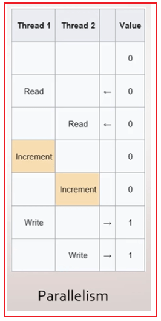

حالا، نخ ۱ و نخ ۲ هر دو مقادیر را می‌خوانند و بنابراین هر دو مقدار صفر را در حافظه دارند. برای درک بهتر، لطفاً به تصویر زیر نگاهی بیندازید.

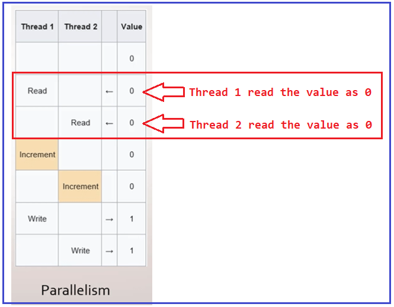

نخ ۱ مقدار را افزایش می‌دهد، همچنین نخ ۲ نیز مقدار را افزایش می‌دهد و هر دو مقدار را در حافظه به ۱ افزایش می‌دهند. برای درک بهتر، لطفاً به تصویر زیر نگاهی بیندازید.

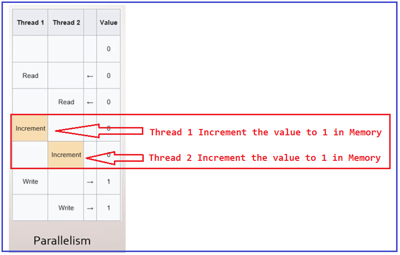

وقتی هر دو نخ مقدار حافظه را به ۱ افزایش دادند، نخ ۱ دوباره در متغیر ۱ می‌نویسد و نخ ۲ نیز یک بار دیگر در متغیر ۱ می‌نویسد. برای درک بهتر، لطفاً به تصویر زیر نگاهی بیندازید.


این یعنی همانطور که می‌بینید، بسته به ترتیب اجرای متدها، قرار است مقدار متغیر را تعیین کنیم. اگرچه ما با استفاده از دو نخ مختلف، دو بار مقدار را افزایش می‌دهیم، زیرا در یک محیط چند نخی بودیم، اما یک شرط Race داشتیم، به این معنی که اکنون یک عملیات قطعی نداریم زیرا گاهی اوقات می‌تواند یکی باشد و گاهی اوقات می‌تواند دو تا باشد.

##### **چگونه مشکلات شرایط مسابقه (Race Condition) را در سی شارپ حل کنیم؟**

روش‌های زیادی برای حل مشکلات شرایط رقابتی در سی‌شارپ وجود دارد. اولین مکانیزمی که برای مقابله با مشکلات شرایط رقابتی بررسی خواهیم کرد، قفل متقابل (Interlocked) است و رویکرد دوم استفاده از قفل (lock) است. ما هر دو رویکرد را بررسی و درک خواهیم کرد و همچنین خواهیم فهمید که چه زمانی از کدام رویکرد در برنامه‌های بلادرنگ استفاده کنیم.

##### **قفل شده در سی شارپ:**

کلاس Interlocked در سی شارپ به ما اجازه می‌دهد تا عملیات خاصی را به صورت اتمیک انجام دهیم، که باعث می‌شود این عملیات از نخ‌های مختلف روی متغیر مشترک ایمن باشد. این بدان معناست که کلاس Interlocked چند متد در اختیار ما قرار می‌دهد که به ما امکان می‌دهد عملیات خاصی را به صورت ایمن یا اتمیک انجام دهیم، حتی اگر کد قرار باشد توسط چندین نخ به طور همزمان اجرا شود.

##### **مثالی برای درک مفهوم اینترلاک در سی شارپ:**

ابتدا مثال را بدون استفاده از Interlocked و lock بررسی می‌کنیم و سعی می‌کنیم مشکل را درک کنیم، و سپس همان مثال را با استفاده از Interlocked و lock بازنویسی می‌کنیم و خواهیم دید که چگونه interlocked و lock مشکل ایمنی نخ را حل می‌کنند.

لطفاً به مثال زیر نگاهی بیندازید. در مثال زیر، ما یک متغیر تعریف کرده‌ایم و با استفاده از حلقه Parallel For مقدار آن را افزایش می‌دهیم. همانطور که می‌دانیم حلقه Parallel For از چندنخی استفاده می‌کند، بنابراین چندین نخ سعی می‌کنند متغیر IncrementValue مشترک را به‌روزرسانی (افزایش) کنند. در اینجا، از آنجایی که ما ۱۰۰۰۰۰ بار حلقه را تکرار می‌کنیم، انتظار داریم مقدار IncrementValue برابر با ۱۰۰۰۰۰ باشد.

```csharp
using System;
using System.Threading.Tasks;

namespace InterlockedDemo
{
    class Program
    {
        static void Main(string[] args)
        {
            var IncrementValue = 0;
            Parallel.For(0, 100000, _ =>
            {
                // Incrementing the value
                IncrementValue++;
            });
            Console.WriteLine("Expected Result: 100000");
            Console.WriteLine($"Actual Result: {IncrementValue}");
            Console.ReadKey();
        }
    }
}
```

حالا کد بالا را چندین بار اجرا کنید و هر بار نتیجه متفاوتی خواهید گرفت و می‌توانید تفاوت بین نتیجه واقعی و نتیجه مورد انتظار را همانطور که در تصویر زیر نشان داده شده است، مشاهده کنید.

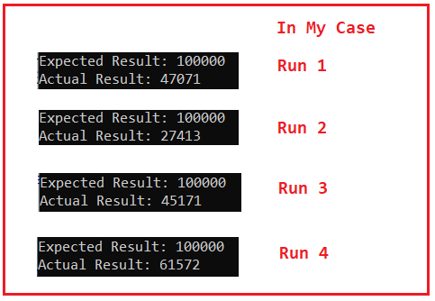

##### **مثال استفاده از کلاس Interlocked در سی شارپ:**

کلاس Interlocked در سی شارپ یک متد استاتیک به نام Increment ارائه می‌دهد. متد Increment مقدار متغیر مشخص شده را ۱ واحد افزایش می‌دهد و نتیجه را به عنوان یک عملیات اتمی ذخیره می‌کند. بنابراین، در اینجا باید متغیر را با کلمه کلیدی ref همانطور که در مثال زیر نشان داده شده است، مشخص کنیم.

```csharp
using System;
using System.Threading;
using System.Threading.Tasks;

namespace InterlockedDemo
{
    class Program
    {
        static void Main(string[] args)
        {
            var IncrementValue = 0;
            Parallel.For(0, 100000, _ =>
            {
                // Incrementing the value
                Interlocked.Increment(ref IncrementValue);
            });
            Console.WriteLine("Expected Result: 100000");
            Console.WriteLine($"Actual Result: {IncrementValue}");
            Console.ReadKey();
        }
    }
}
```

###### **خروجی:**

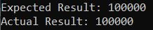

حالا، مهم نیست چند بار کد بالا را اجرا کنید، خروجی یکسانی خواهید گرفت. همانطور که در تصویر خروجی بالا مشاهده می‌کنید، ما نتیجه واقعی (Actual Result) را به عنوان نتیجه مورد انتظار (Expected Result) دریافت می‌کنیم. بنابراین، کلاس Interlocked عملیات اتمیک (atomic) را برای متغیرهایی که توسط چندین نخ (thread) به اشتراک گذاشته می‌شوند، فراهم می‌کند. این بدان معناست که مکانیزم همگام‌سازی Interlocked به ما این امکان را می‌دهد که با اتمیک کردن عملیات افزایش، از ایجاد شرایط رقابتی (race conditions) جلوگیری کنیم.

##### **کلاس Interlocked در سی شارپ چیست؟**

اگر به تعریف کلاس Interlocked مراجعه کنید، خواهید دید که این کلاس یک کلاس استاتیک است و از این رو متدهای استاتیک زیادی مانند Increment، Decrement، Add، Exchange و غیره را همانطور که در تصویر زیر نشان داده شده است، برای انجام عملیات اتمی روی متغیر ارائه می‌دهد. کلاس Interlocked متعلق به فضای نام System.Threading است.

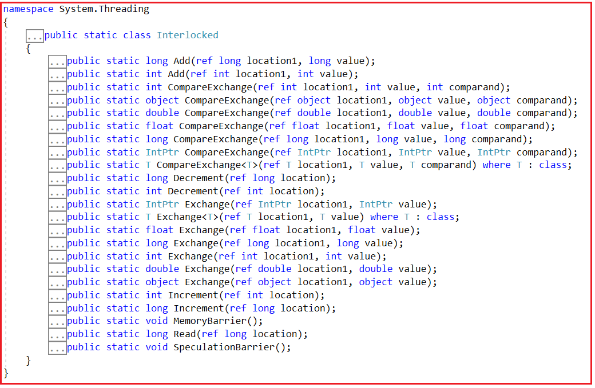

در ادامه متدهای ارائه شده توسط کلاس Interlocked در سی شارپ آمده است.

1. **Increment():** این متد برای افزایش مقدار یک متغیر و ذخیره نتیجه آن استفاده می‌شود. اعداد صحیح Int32 و Int64 پارامترهای مجاز آن هستند.
2. **Decrement() :** این متد برای کاهش مقدار یک متغیر و ذخیره نتیجه آن استفاده می‌شود. اعداد صحیح Int32 و Int64 پارامترهای مجاز آن هستند.
3. **Exchange():** این متد برای تبادل مقادیر بین متغیرها استفاده می‌شود. این متد بر اساس انواع مختلفی که می‌تواند به عنوان پارامتر خود بپذیرد، هفت نسخه سربارگذاری شده دارد.
4. **CompareExchange():** این متد دو متغیر را با هم مقایسه می‌کند و نتیجه مقایسه را در متغیر دیگری ذخیره می‌کند. این متد همچنین هفت نسخه سربارگذاری شده دارد.
5. **Add():** این متد برای جمع دو متغیر عدد صحیح و به‌روزرسانی نتیجه در متغیر عدد صحیح اول استفاده می‌شود. این متد برای جمع اعداد صحیح از نوع Int32 و همچنین Int64 استفاده می‌شود.
6. **Read():** این متد برای خواندن یک متغیر عدد صحیح استفاده می‌شود. این متد برای خواندن یک عدد صحیح از نوع Int64 استفاده می‌شود.

بنابراین، به جای عملگرهای جمع، تفریق و انتساب، می‌توانیم از متدهای Add، Increment، Decrement، Exchange و CompareExchange استفاده کنیم. ما قبلاً مثال متد Increment را دیده‌ایم. حال، بیایید مثال‌هایی از سایر متدهای استاتیک کلاس Interlocked در C# را ببینیم.

##### **متد Interlocked.Add در سی شارپ:**

دو نسخه overload شده از متد Add در کلاس Interlocked وجود دارد. آنها به شرح زیر هستند:

1. **public static long Add(ref long location1, long value):** این متد دو عدد صحیح ۶۴ بیتی را جمع می‌کند و عدد صحیح اول را با حاصل جمع، به عنوان یک عملیات اتمی، جایگزین می‌کند.
2. **public static int Add(ref int location1, int value):** این متد دو عدد صحیح ۳۲ بیتی را جمع می‌کند و عدد صحیح اول را با حاصل جمع، به عنوان یک عملیات اتمی، جایگزین می‌کند. مقدار جدید ذخیره شده در location1 را برمی‌گرداند.

پارامترها به شرح زیر هستند:

1. **location1:** متغیری که شامل اولین مقداری است که باید جمع شود. مجموع دو مقدار در location1 ذخیره می‌شود.
2. **مقدار:** مقداری که قرار است به متغیر location1 اضافه شود.

##### **مثال برای درک متد Add قفل شده در سی شارپ:**

مثال زیر نحوه‌ی استفاده از متد Add از کلاس Interlocked را نشان می‌دهد.

```csharp
using System;
using System.Threading;
using System.Threading.Tasks;

namespace InterlockedDemo
{
    class Program
    {
        static void Main(string[] args)
        {
            long SumValueWithoutInterlocked = 0;
            long SumValueWithInterlocked = 0;
            Parallel.For(0, 100000, number =>
            {
                SumValueWithoutInterlocked = SumValueWithoutInterlocked + number;
                Interlocked.Add(ref SumValueWithInterlocked, number);
            });

            Console.WriteLine($"Sum Value Without Interlocked: {SumValueWithoutInterlocked}");
            Console.WriteLine($"Sum Value With Interlocked: {SumValueWithInterlocked}");

            Console.ReadKey();
        }
    }
}
```

###### **خروجی:**

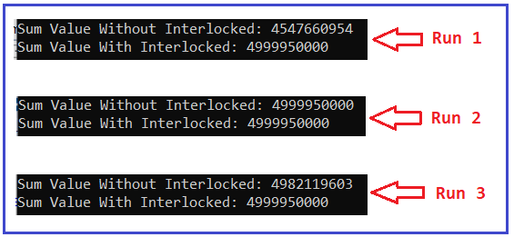

همانطور که در تصویر بالا مشاهده می‌کنید، Sum Value با Interlocked همیشه نتیجه یکسانی را به شما می‌دهد در حالی که Sum value بدون Interlocked نتیجه متفاوتی را به شما می‌دهد. این بدان معناست که متد Interlocked.Add برای متغیر مشترک، thread safety فراهم می‌کند.

##### **متد Exchange و CompareExchange از کلاس Interlocked:**

متد Exchange از کلاس Interlocked در سی شارپ، مقادیر متغیرهای مشخص شده را به صورت اتمی مبادله می‌کند. مقدار دوم می‌تواند یک مقدار hard-coded یا یک متغیر باشد. فقط متغیر اول در پارامتر اول با متغیر دوم جایگزین می‌شود. برای درک بهتر، لطفاً به تصویر زیر نگاهی بیندازید.

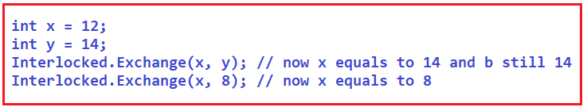

متد CompareExchange از کلاس Interlocked در سی شارپ برای ترکیب دو عملیات استفاده می‌شود. مقایسه دو مقدار و ذخیره مقدار سوم در یکی از متغیرها، بر اساس نتیجه مقایسه. اگر هر دو برابر باشند، مقدار استفاده شده به عنوان پارامتر اول را با مقدار ارائه شده جایگزین کنید. برای درک بهتر، لطفاً به تصویر زیر نگاهی بیندازید. در اینجا، یک متغیر عدد صحیح ایجاد می‌کنیم و سپس مقدار 20 را به آن اختصاص می‌دهیم. سپس متد Interlocked.CompareExchange را برای مقایسه متغیر x با 20 فراخوانی می‌کنیم و از آنجایی که هر دو یکسان هستند، بنابراین x را با DateTime جایگزین می‌کند. اکنون. روز، روز جاری ماه.

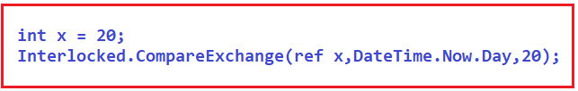

##### **مثالی برای درک Interlocked Exchange و متد CompareExchange در سی شارپ**

```csharp
using System;
using System.Threading;

namespace InterlockedDemo
{
    class Program
    {
        static long x;
        static void Main(string[] args)
        {
            Thread thread1 = new Thread(new ThreadStart(SomeMethod));
            thread1.Start();
            thread1.Join();

            // Written [20]
            Console.WriteLine(Interlocked.Read(ref Program.x));

            Console.ReadKey();
        }

        static void SomeMethod()
        {
            // Replace x with 20.
            Interlocked.Exchange(ref Program.x, 20);

            // CompareExchange: if x is 20, then change to current DateTime.Now.Day or any integer variable.
            // long result = Interlocked.CompareExchange(ref Program.x, DateTime.Now.Day, 20);
            // Note: DateTime.Now.Day is int, but method expects long for this overload
            long result = Interlocked.CompareExchange(ref Program.x, 50L, 20L);

            // Returns original value from CompareExchange
            Console.WriteLine(result);
        }
    }
}
```

**خروجی:**  
**۲۰**  
**۵۰**

##### **از نظر عملکرد، Interlocked در مقابل Lock در سی شارپ:**

استفاده از متدهای Interlocked در برنامه‌ها بسیار آسان است. اما آیا واقعاً سریع‌تر از قفل عمل می‌کند؟ بگذارید این را با یک مثال بررسی کنیم. در این بنچمارک، دو رویکرد را در C# نشان داده‌ایم.

1. **نسخه ۱:** ما یک قفل را قبل از افزایش عدد صحیح در حلقه اول آزمایش می‌کنیم. این کد طولانی‌تر است و از Interlocked استفاده نمی‌کند.
2. **نسخه ۲** : این دومین نسخه از کد است. ما فراخوانی Interlocked.Increment را در حلقه دوم آزمایش می‌کنیم.

```csharp
using System;
using System.Diagnostics;
using System.Threading;
using System.Threading.Tasks;

namespace InterlockedDemo
{
    class Program
    {
        static readonly object lockObject = new object();
        static int IncrementValue = 0;
        const int NumberOfIteration = 10000000;

        static void Main()
        {
            Stopwatch stopwatch = new Stopwatch();
            stopwatch.Start();
            // Version 1: use lock.
            Parallel.For(0, NumberOfIteration, number =>
            {
                lock (lockObject)
                {
                    IncrementValue++;
                }
            });

            stopwatch.Stop();
            Console.WriteLine($"Result using Lock: {IncrementValue}");
            Console.WriteLine($"Lock took {stopwatch.ElapsedMilliseconds} Milliseconds");

            //Reset the _test value
            IncrementValue = 0;
            stopwatch.Restart();

            Parallel.For(0, NumberOfIteration, number =>
            {
                Interlocked.Increment(ref IncrementValue);
            });

            stopwatch.Stop();
            Console.WriteLine($"Result using Interlocked: {IncrementValue}");
            Console.WriteLine($"Interlocked took {stopwatch.ElapsedMilliseconds} Milliseconds");
            Console.ReadKey();
        }
    }
}
```

###### **خروجی:**

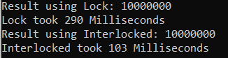

در اینجا می‌توانید ببینید که نتیجه در هر دو رویکرد صحیح است زیرا مقدار چاپ شده برابر با تعداد کل عملیات افزایش است. اگر دقت کنید، Interlocked.Increment چندین برابر سریع‌تر بود و تنها به ۱۰۳ میلی‌ثانیه در مقابل ۲۹۰ میلی‌ثانیه برای ساختار قفل نیاز داشت. این زمان ممکن است در دستگاه شما متفاوت باشد.

##### **چه زمانی از Lock over Interlocked در سی شارپ استفاده کنیم؟**

بنابراین، اگر قرار است یک کار مشابه با استفاده از هر دو قفل و قفل داخلی با thread-safety انجام شود، توصیه می‌شود از Interlocked در C# استفاده شود. با این حال، در برخی شرایط، Interlocked کار نمی‌کند و در آن شرایط، باید از قفل استفاده کنیم. اجازه دهید این موضوع را با یک مثال درک کنیم. لطفاً به کد زیر نگاهی بیندازید.

```csharp
using System;
using System.Threading;
using System.Threading.Tasks;

namespace InterlockedDemo
{
    class Program
    {
        static void Main(string[] args)
        {
            long IncrementValue = 0;
            long SumValue = 0;
            Parallel.For(0, 100000, number =>
            {
                Interlocked.Increment(ref IncrementValue);
                Interlocked.Add(ref SumValue, IncrementValue);
            });

            Console.WriteLine($"Increment Value With Interlocked: {IncrementValue}");
            Console.WriteLine($"Sum Value With Interlocked: {SumValue}");

            Console.ReadKey();
        }
    }
}
```

###### **خروجی:**

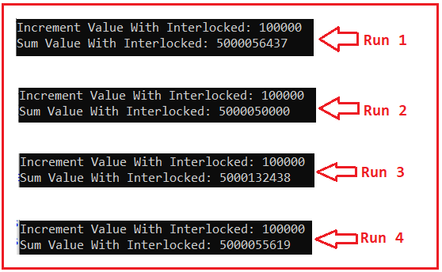

همانطور که در خروجی بالا مشاهده می‌کنید، حتی پس از استفاده از Interlocked، مقادیر Sum متفاوتی دریافت می‌کنیم. **چرا** ؟ این به این دلیل است که یک شرط Race وجود دارد. پس ممکن است فکر کنید که ما از متد Interlocked.Add استفاده می‌کنیم و نباید هیچ شرط Race وجود داشته باشد. درست است؟ اما به دلایل زیر شرط Race وجود دارد.

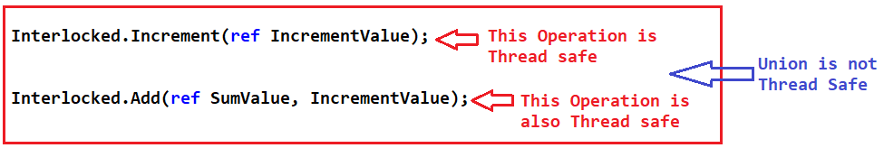

متدهای Increment و Add به صورت جداگانه thread-safe هستند، اما ترکیب این دو متد thread-safe نیست. برای درک بهتر، کد را به شکل زیر در نظر بگیرید. یک thread شروع به اجرای متد Increment می‌کند. در حالی که thread به سمت متد Add در حال حرکت است، thread دیگری ممکن است فرصتی برای اجرای متد Increment پیدا کند که مقدار IncrementValue را دوباره تغییر می‌دهد. و بنابراین، مقدار متغیر IncrementValue قبل از اینکه تهدید اول فرصت انجام آن جمع را داشته باشد، افزایش یافته است. بنابراین، به همین دلیل است که یک Race Condition وجود دارد.

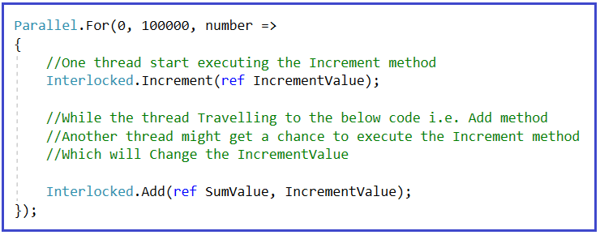

بنابراین، بین این دو عملیات، یعنی افزایش و اضافه کردن، یک وضعیت رقابتی وجود دارد. هر دو به صورت جداگانه thread-safe هستند، اما با هم thread-safe نیستند زیرا در حالی که thread اول از متد افزایش به متد اضافه کردن در حال حرکت است، چندین thread می‌توانند متد افزایش را اجرا کنند. و به همین دلیل است که یک وضعیت رقابتی وجود دارد.

##### **چگونه می‌توان شرایط مسابقه‌ای فوق را در سی‌شارپ حل کرد؟**

از آنجایی که چندین عملیات داریم و می‌خواهیم آنها فقط توسط یک نخ در یک زمان اجرا شوند، می‌توانیم از قفل استفاده کنیم. برای استفاده از قفل، باید یک شیء را نمونه‌سازی کنیم. توصیه می‌شود یک شیء اختصاصی برای قفل داشته باشید. ایده این است که ما قفل‌ها را بر اساس اشیاء می‌سازیم. برای درک بهتر، لطفاً به مثال زیر نگاهی بیندازید. هر کدی که قبل و بعد از بلوک قفل وجود داشته باشد، به صورت موازی اجرا می‌شود و کد بلوک قفل به صورت متوالی اجرا می‌شود، یعنی فقط یک نخ می‌تواند در یک زمان به بلوک قفل دسترسی داشته باشد.

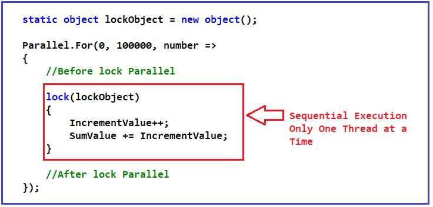

بنابراین، اگر مثلاً دو نخ سعی در دسترسی به بلوک قفل داشته باشند، فقط یک نخ قادر به ورود خواهد بود در حالی که دستور منتظر است. و هنگامی که نخ اول از بلوک قفل خارج می‌شود، نخ دوم قادر به ورود به بلوک قفل و اجرای دو خط کد خواهد بود. کد کامل مثال در زیر آمده است.

```csharp
using System;
using System.Threading.Tasks;

namespace InterlockedDemo
{
    class Program
    {
        static object lockObject = new object();

        static void Main(string[] args)
        {
            long IncrementValue = 0;
            long SumValue = 0;

            Parallel.For(0, 10000, number =>
            {
                // Before lock Parallel

                lock (lockObject)
                {
                    IncrementValue++;
                    SumValue += IncrementValue;
                }

                // After lock Parallel
            });

            Console.WriteLine($"Increment Value With lock: {IncrementValue}");
            Console.WriteLine($"Sum Value With lock: {SumValue}");

            Console.ReadKey();
        }
    }
}
```

###### **خروجی:**

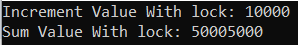

هر بار که برنامه را اجرا می‌کنیم، نتیجه یکسانی را دریافت می‌کنیم و نتیجه یکسانی را دریافت می‌کنیم، زیرا از یک مکانیسم همگام‌سازی استفاده می‌کنیم که به ما امکان می‌دهد چندین نخ عملیاتی را ایمن کنیم.

ما بخشی از کد خود را به ترتیبی بودن محدود می‌کنیم، حتی اگر چندین thread سعی کنند آن کد را همزمان اجرا کنند. ما زمانی از قفل‌ها استفاده می‌کنیم که نیاز به انجام چندین عملیات یا عملیاتی داریم که توسط Interlocked پوشش داده نمی‌شود.

**نکته:** هنگام استفاده از قفل مراقب باشید. همیشه یک شیء اختصاصی برای قفل در سی شارپ داشته باشید. سعی نکنید از اشیاء دوباره استفاده کنید و همچنین سعی کنید آن را ساده نگه دارید. سعی کنید کمترین کار را درون یک قفل انجام دهید زیرا داشتن کار زیاد درون یک قفل می‌تواند بر عملکرد برنامه شما تأثیر بگذارد.