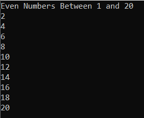
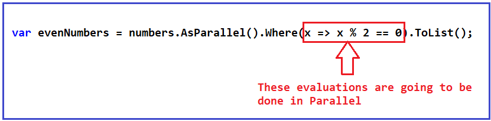
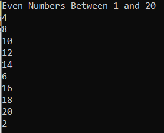
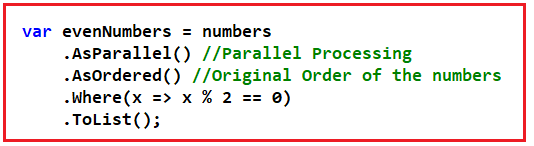
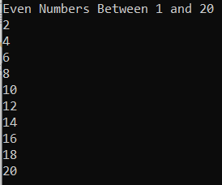
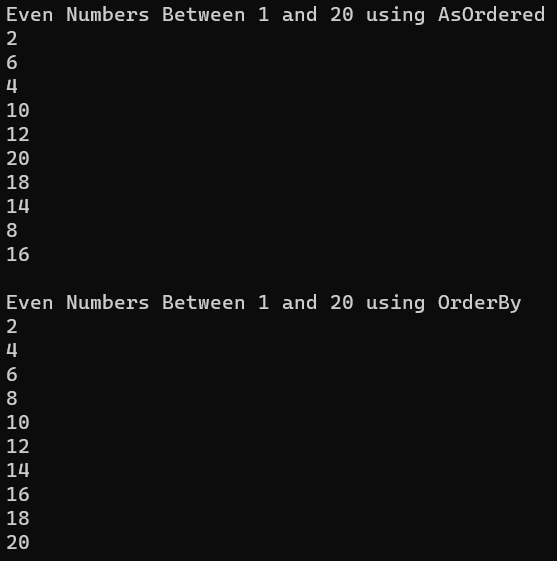
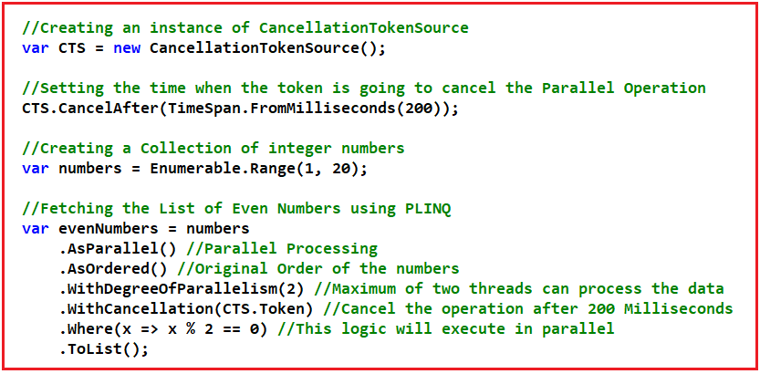
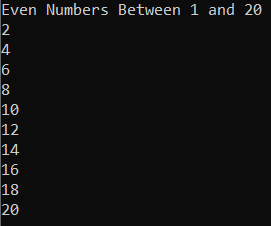
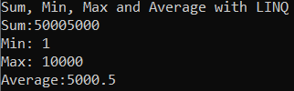

## **LINQ موازی (PLINQ) در سی شارپ به همراه مثال:**

در این مقاله، من در مورد **Parallel LINQ (PLINQ) در سی شارپ** با مثال بحث خواهم کرد. لطفاً مقاله قبلی ما در مورد Interlocked در مقابل Lock در سی شارپ با مثال را مطالعه کنید.

1. **LINQ موازی (PLINQ) در سی شارپ چیست؟**
2. **مثالی برای درک LINQ موازی در سی شارپ**
3. **چگونه ترتیب اصلی را در LINQ موازی حفظ کنیم؟**
4. **تفاوت بین متد OrderBy و AsOrdered در سی شارپ**
5. **حداکثر درجه موازی‌سازی و توکن لغو در LINQ موازی**
6. **انجام محاسبات تجمیعی در LINQ موازی**
7. **آیا واقعاً LINQ موازی عملکرد یک برنامه را بهبود می‌بخشد؟**
8. **ویژگی‌های کلیدی LINQ موازی**
9. **چه زمانی از Parallel LINQ در سی شارپ استفاده کنیم؟**
10. **چه زمانی نباید از Parallel LINQ در سی شارپ استفاده کرد؟**

##### **LINQ موازی (PLINQ) در سی شارپ چیست؟**

اگر مجموعه‌ای داشته باشیم و بخواهیم از موازی‌سازی برای پردازش آن استفاده کنیم، می‌توانیم از Parallel LINQ یا PLINQ استفاده کنیم. Parallel LINQ (PLINQ) اساساً همان چیزی است که در LINQ داریم. اما با قابلیت موازی، می‌توانیم حداکثر درجه موازی‌سازی را تعریف کنیم و از یک توکن لغو برای لغو عملیات استفاده کنیم. برای اینکه بتوانیم یک توالی را با PLINQ پردازش کنیم، باید از متد AsParallel استفاده کنیم.

LINQ موازی (PLINQ) یک پیاده‌سازی موازی از LINQ to Objects است که سادگی و خوانایی سینتکس LINQ را با قدرت برنامه‌نویسی موازی ترکیب می‌کند. این زبان برای استفاده بهینه از تمام هسته‌های یک پردازنده مدرن طراحی شده است تا عملکرد عملیات LINQ را روی مجموعه داده‌های بزرگ یا عملیات‌های وابسته به CPU بهبود بخشد.

PLINQ با تقسیم مجموعه منبع به بخش‌هایی و سپس پردازش همزمان این بخش‌ها در چندین نخ، به موازی‌سازی دست می‌یابد. برای استفاده از PLINQ، معمولاً باید یک فراخوانی به متد AsParallel به کوئری LINQ خود اضافه کنید که به سیستم دستور می‌دهد در صورت مفید بودن، کوئری را به صورت موازی پردازش کند.

##### **مثال برای درک LINQ موازی در سی شارپ:**

بیایید Parallel LINQ را در سی شارپ با یک مثال درک کنیم. در مثال زیر، ما مجموعه‌ای از اعداد صحیح از ۱ تا ۲۰ را با استفاده از **متد Enumerable.Range** ایجاد می‌کنیم . سپس، با استفاده از متد LINQ Where Extension، لیست اعداد زوج را از مجموعه اعداد فیلتر می‌کنیم. در مثال زیر، ما از Parallel LINQ استفاده نمی‌کنیم؛ ما به سادگی از LINQ استفاده می‌کنیم.

```csharp
using System;
using System.Linq;

namespace ParallelLINQDemo
{
    class Program
    {
        static void Main(string[] args)
        {
            // Creating a Collection of integer numbers
            var numbers = Enumerable.Range(1, 20);

            // Fetching the List of Even Numbers using LINQ
            var evenNumbers = numbers.Where(x => x % 2 == 0).ToList();

            Console.WriteLine("Even Numbers Between 1 and 20");
            foreach (var number in evenNumbers)
            {
                Console.WriteLine(number);
            }

            Console.ReadKey();
        }
    }
}
```

###### **خروجی:**



پس از اجرای کد، خروجی بالا را دریافت خواهید کرد. کد زیر اعداد زوج را با استفاده از LINQ فیلتر می‌کند.

**var evenNumbers = numbers.Where(x => x % 2 == 0).ToList();**

بیایید نحوه استفاده از Parallel LINQ در C# را با همان مثال بررسی کنیم. همانطور که قبلاً بحث شد، ما باید از متد AsParallel برای پردازش توالی به صورت موازی استفاده کنیم. برای درک بهتر، لطفاً به کد زیر نگاه کنید که سینتکس‌های LINQ و PLINQ را برای دریافت اعداد زوج از مجموعه اعداد نشان می‌دهد. همانطور که می‌بینید، با Parallel LINQ، بعد از مجموعه یا توالی و قبل از متد الحاقی Where، متد الحاقی AsParallel را فراخوانی می‌کنیم.

 در سی شارپ به همراه مثال")

بنابراین، این به همین سادگی است. کد زیر از موازی‌سازی استفاده می‌کند. ارزیابی‌ها (یعنی **x => x % 2 == 0** ) به صورت موازی انجام خواهند شد، یعنی متد Where Extension به صورت موازی اجرا خواهد شد.



حالا، بیایید روی مجموعه evenNumbers پیمایش کنیم و خروجی را ببینیم. کد کامل زیر نشان داده شده است. کد مثال زیر نیاز به توضیح ندارد، بنابراین لطفاً برای درک بهتر، خطوط توضیحات را مطالعه کنید.

```csharp
using System;
using System.Linq;

namespace ParallelLINQDemo
{
    class Program
    {
        static void Main(string[] args)
        {
            // Creating a Collection of integer numbers
            var numbers = Enumerable.Range(1, 20);

            // Fetching the List of Even Numbers using LINQ
            // var evenNumbers = numbers.Where(x => x % 2 == 0).ToList();

            // Fetching the List of Even Numbers using PLINQ
            // PLINQ means we need to use AsParallel()
            var evenNumbers = numbers.AsParallel().Where(x => x % 2 == 0).ToList();

            Console.WriteLine("Even Numbers Between 1 and 20");
            foreach (var number in evenNumbers)
            {
                Console.WriteLine(number);
            }

            Console.ReadKey();
        }
    }
}
```

###### **خروجی:**



می‌توانید ترتیب اعداد را مشاهده کنید. آنها به ترتیب تصادفی هستند. دلیل این امر این است که ما در گذشته دیده‌ایم که وقتی از موازی‌سازی استفاده می‌کنیم، معمولاً نمی‌توانیم ترتیب عملیات را کنترل کنیم، یعنی نمی‌توانیم به سادگی ترتیب خروجی را پیش‌بینی کنیم. حال، اگر کد را چندین بار اجرا کنید، ممکن است هر بار ترتیب متفاوتی از اعداد را دریافت کنید.

##### **چگونه ترتیب اصلی را در LINQ موازی حفظ کنیم؟**

فرض کنید می‌خواهید خروجی به ترتیب باشد. در این صورت، باید از متد AsOrdered() بعد از متد AsParallel() استفاده کنید، به این معنی که پس از انجام عملیات به صورت موازی، ترتیب اصلی عناصر همانطور که در توالی ظاهر شده‌اند، حفظ خواهد شد. برای درک بهتر، لطفاً به تصویر زیر نگاه کنید که نحوه استفاده از متد AsOrdered را نشان می‌دهد.



ترتیب، همان ترتیب اصلی ذخیره عناصر در مجموعه‌های اعداد خواهد بود. کد کامل در ادامه آمده است. کد مثال زیر گویای همه چیز است، بنابراین لطفاً برای درک بهتر، به توضیحات داخل کامنت‌ها مراجعه کنید.

```csharp
using System;
using System.Collections.Generic;
using System.Linq;

namespace ParallelLINQDemo
{
    class Program
    {
        static void Main(string[] args)
        {
            // Creating a Collection of integer numbers
            var numbers = Enumerable.Range(1, 20);

            // Fetching the List of Even Numbers using PLINQ
            // PLINQ means we need to use AsParallel()
            var evenNumbers = numbers
                .AsParallel() // Parallel Processing
                .AsOrdered() // Original Order of the numbers
                .Where(x => x % 2 == 0)
                .ToList();

            Console.WriteLine("Even Numbers Between 1 and 20");
            foreach (var number in evenNumbers)
            {
                Console.WriteLine(number);
            }

            Console.ReadKey();
        }
    }
}
```

###### **خروجی:**



حالا، می‌توانید ببینید که اعداد به ترتیب اصلی خود هستند. حالا، فرقی نمی‌کند چند بار کد را اجرا کنید. همیشه ترتیب فعلی عناصر را نمایش می‌دهد، که در صورت نیاز عالی است.

##### **تفاوت بین متد OrderBy و AsOrdered در سی شارپ:**

ممکن است شما علاقه‌مند به استفاده از متد LINQ OrderBy پس از متد Where Extension باشید. اما به یاد داشته باشید، متد OrderBy برای مرتب‌سازی داده‌ها استفاده می‌شود، نه برای حفظ ترتیب اصلی داده‌ها. از سوی دیگر، متد AsOrdered برای حفظ ترتیب اصلی عناصر استفاده می‌شود. برای درک بهتر، لطفاً به مثال زیر نگاهی بیندازید. کد مثال زیر خود توضیح است، بنابراین لطفاً خطوط کامنت را مطالعه کنید.

```csharp
using System;
using System.Collections.Generic;
using System.Linq;

namespace ParallelLINQDemo
{
    class Program
    {
        static void Main(string[] args)
        {
            // Creating a Collection of integer numbers
            List<int> numbers = new List<int>()
            {
                1, 2, 6, 7, 5, 4, 10, 12, 13, 20, 18, 9, 11, 15, 14, 3, 8, 16, 17, 19
            };

            // Using AsOrdered Method
            // Fetching the List of Even Numbers using PLINQ
            var evenNumbers1 = numbers
                .AsParallel() // Parallel Processing
                .AsOrdered() // Original Order of the numbers
                .Where(x => x % 2 == 0)
                .ToList();

            Console.WriteLine("Even Numbers Between 1 and 20 using AsOrdered");
            foreach (var number in evenNumbers1)
            {
                Console.WriteLine(number);
            }

            // Using OrderBy Method
            // Fetching the List of Even Numbers using PLINQ
            var evenNumbers2 = numbers
                .AsParallel() // Parallel Processing
                .Where(x => x % 2 == 0)
                .OrderBy(x => x) // Sort the Elements in Ascending Order
                .ToList();

            Console.WriteLine("\nEven Numbers Between 1 and 20 using OrderBy");
            foreach (var number in evenNumbers2)
            {
                Console.WriteLine(number);
            }

            Console.ReadKey();
        }
    }
}
```

###### **خروجی:**



همانطور که در خروجی بالا مشاهده می‌کنید، با متد AsOrdered، داده‌ها را به ترتیب اصلی دنباله دریافت می‌کنیم. با متد OrderBy، داده‌ها را به ترتیب صعودی دریافت می‌کنیم.

##### **حداکثر درجه موازی‌سازی و توکن لغو در LINQ موازی:**

در برنامه‌نویسی موازی، ما در مورد حداکثر درجه موازی‌سازی و توکن لغو بحث کرده‌ایم. ما می‌توانیم در اینجا نیز همین عملکرد را با Parallel LINQ هنگام پردازش یک مجموعه داشته باشیم. به عنوان مثال، می‌توانیم حداکثر درجه موازی‌سازی را تعریف کنیم. همچنین می‌توانیم یک توکن لغو تعریف و ارسال کنیم که اجرای عملیات Parallel LINQ را لغو می‌کند. برای درک بهتر، لطفاً به تصویر زیر نگاهی بیندازید. در اینجا، می‌توانید ببینید که ما یک نمونه CancellationTokenSource ایجاد می‌کنیم و توکن را طوری تنظیم می‌کنیم که عملیات را پس از 200 میلی‌ثانیه لغو کند. و سپس توکن لغو را به عنوان یک مقدار به متد WithCancellation ارسال می‌کنیم. علاوه بر این، ما مقدار 2 را به متد WithDegreeOfParallelism ارسال می‌کنیم، به این معنی که حداکثر دو رشته عملیات را پردازش خواهند کرد.



بنابراین، با Parallel LINQ در C#، می‌توانیم به همان عملکرد برنامه‌نویسی موازی دست یابیم. کد کامل مثال در زیر آورده شده است. کد مثال زیر خود توضیح است، بنابراین لطفاً برای درک بهتر، خطوط کامنت را مطالعه کنید.

```csharp
using System;
using System.Linq;
using System.Threading;

namespace ParallelLINQDemo
{
    class Program
    {
        static void Main(string[] args)
        {
            // Creating an instance of CancellationTokenSource
            var CTS = new CancellationTokenSource();

            // Setting the time when the token is going to cancel the Parallel Operation
            CTS.CancelAfter(TimeSpan.FromMilliseconds(200));

            // Creating a Collection of integer numbers
            var numbers = Enumerable.Range(1, 20);

            // Fetching the List of Even Numbers using PLINQ
            var evenNumbers = numbers
                .AsParallel() // Parallel Processing
                .AsOrdered() // Original Order of the numbers
                .WithDegreeOfParallelism(2) // Maximum of two threads can process the data
                .WithCancellation(CTS.Token) // Cancel the operation after 200 Milliseconds
                .Where(x => x % 2 == 0) // This logic will execute in parallel
                .ToList();

            Console.WriteLine("Even Numbers Between 1 and 20");
            foreach (var number in evenNumbers)
            {
                Console.WriteLine(number);
            }

            Console.ReadKey();
        }
    }
}
```

###### **خروجی:**



##### **انجام محاسبات تجمیعی در LINQ موازی**

بیایید ببینیم چگونه می‌توانیم عناصر یک دنباله را با استفاده از Parallel LINQ در C# جمع کنیم. برای مثال، می‌توانیم میانگین عناصر یک مجموعه را محاسبه کنیم، می‌توانیم عناصر یک مجموعه را با هم جمع کنیم و غیره. بیایید مثالی از محاسبه مجموع، حداکثر، حداقل و میانگین یک مجموعه را با استفاده از Parallel LINQ در C# ببینیم. کد مثال زیر خود توضیح است، بنابراین لطفاً برای درک بهتر، خطوط کامنت را مطالعه کنید.

```csharp
using System;
using System.Linq;

namespace ParallelLINQDemo
{
    class Program
    {
        static void Main()
        {
            var numbers = Enumerable.Range(1, 10000);

            // Sum, Min, Max and Average LINQ extension methods
            Console.WriteLine("Sum, Min, Max and Average with LINQ");

            var Sum = numbers.AsParallel().Sum();
            var Min = numbers.AsParallel().Min();
            var Max = numbers.AsParallel().Max();
            var Average = numbers.AsParallel().Average();
            Console.WriteLine($"Sum:{Sum}\nMin: {Min}\nMax: {Max}\nAverage:{Average}");

            Console.ReadKey();
        }
    }
}
```

###### **خروجی:**



##### **آیا واقعاً LINQ موازی عملکرد یک برنامه را بهبود می‌بخشد؟**

بیایید مثالی را با استفاده از LINQ و Parallel LINQ برای انجام یک کار مشابه بررسی کنیم و سپس معیار عملکرد را ببینیم. لطفاً به مثال زیر نگاهی بیندازید. در مثال زیر، عملکرد متدهای Min، Max و Average در LINQ و PLINQ را مقایسه می‌کنیم. متدهای Min، Max و Average یک مقدار اسکالر واحد یا می‌توان گفت یک مقدار تجمعی را برمی‌گردانند.

```csharp
using System;
using System.Diagnostics;
using System.Linq;

namespace ParallelLINQDemo
{
    class Program
    {
        static void Main()
        {
            var random = new Random();
            int[] values = Enumerable.Range(1, 99999999)
                .Select(x => random.Next(1, 1000))
                .ToArray();

            // Min, Max and Average LINQ extension methods
            Console.WriteLine("Min, Max and Average with LINQ");

            Stopwatch stopwatch = new Stopwatch();
            stopwatch.Start();
            // var linqStart = DateTime.Now; 
            var linqMin = values.Min();
            var linqMax = values.Max();
            var linqAverage = values.Average();
            stopwatch.Stop();

            var linqTimeMS = stopwatch.ElapsedMilliseconds;

            DisplayResults(linqMin, linqMax, linqAverage, linqTimeMS);

            // Min, Max and Average PLINQ extension methods
            Console.WriteLine("\nMin, Max and Average with PLINQ");
            stopwatch.Restart();
            var plinqMin = values.AsParallel().Min();
            var plinqMax = values.AsParallel().Max();
            var plinqAverage = values.AsParallel().Average();
            stopwatch.Stop();
            var plinqTimeMS = stopwatch.ElapsedMilliseconds;

            DisplayResults(plinqMin, plinqMax, plinqAverage, plinqTimeMS);

            Console.ReadKey();
        }
        static void DisplayResults(int min, int max, double average, double time)
        {
            Console.WriteLine($"Min: {min}\nMax: {max}\n" + $"Average: {average:F}\nTotal time in milliseconds: {time}");
        }
    }
}
```

###### **خروجی:**

 در سی شارپ")

##### **نکاتی که هنگام کار با PLINQ باید به خاطر داشته باشید:**

هنگام استفاده از PLINQ باید به چند نکته توجه داشت:

- **ترتیب:** PLINQ عناصر را به صورت موازی پردازش می‌کند و ترتیب نتایج را تضمین نمی‌کند، مگر اینکه شما به صراحت با استفاده از متد AsOrdered آن را درخواست کنید. حفظ ترتیب می‌تواند سربار اضافه کند و به طور بالقوه باعث کاهش عملکرد شود.
- **عوارض جانبی:** کوئری‌ها باید عاری از عوارض جانبی باشند. از آنجایی که PLINQ می‌تواند چندین عنصر را به طور همزمان پردازش کند، استفاده از توابعی که عوارض جانبی دارند می‌تواند منجر به رفتار غیرمنتظره یا شرایط رقابتی شود.
- **مدیریت استثنا:** وقتی یک استثنا در یک پرس‌وجوی PLINQ رخ می‌دهد، در یک AggregateException قرار می‌گیرد. این استثنا شامل تمام استثناهای منفردی است که در طول اجرای پرس‌وجو رخ می‌دهند.
- **عملکرد:** همه پرس و جوها به صورت موازی سریعتر اجرا نمی شوند. PLINQ سربار دارد، بنابراین برای مجموعه های کوچک یا عملیات سریع، سربار ممکن است از مزایای موازی سازی بیشتر باشد. اندازه گیری عملکرد برای نسخه های متوالی و موازی پرس و جو شما معمولاً ایده خوبی است.
- **اجبار به موازی‌سازی:** شما می‌توانید PLINQ را مجبور کنید تا با استفاده از متد WithExecutionMode با ParallelExecutionMode، کوئری را موازی‌سازی کند. استفاده از ForceParallelism توصیه نمی‌شود، مگر اینکه مطمئن باشید موازی‌سازی عملکرد را بهبود می‌بخشد.
- **درجه موازی‌سازی:** شما می‌توانید تعداد پردازنده‌های مورد استفاده در یک پرس‌وجوی PLINQ را با استفاده از متد WithDegreeOfParallelism مشخص کنید. این می‌تواند برای تنظیم دقیق عملکرد مفید باشد، به خصوص اگر می‌خواهید برخی از هسته‌ها را برای کارهای دیگر آزاد بگذارید.

PLINQ به ویژه هنگام کار با مجموعه‌های بزرگ یا انجام پردازش‌های پیچیده که در آن‌ها وظایف می‌توانند به صورت موازی اجرا شوند، مفید است. این یک ابزار قدرتمند است، اما باید با دقت مورد استفاده قرار گیرد و آزمایش شود تا اطمینان حاصل شود که در هر مورد خاص، مزایای عملکردی را ارائه می‌دهد.

##### **چه زمانی از Parallel LINQ در سی شارپ استفاده کنیم؟**

LINQ موازی (PLINQ) در سی شارپ باید زمانی استفاده شود که کوئری‌های محاسباتی فشرده‌ای دارید که می‌توانند از اجرای موازی برای بهبود عملکرد بهره‌مند شوند. در اینجا چند سناریو وجود دارد که PLINQ به طور خاص در آنها مفید است:

- **مجموعه داده‌های بزرگ:** هنگام پردازش مجموعه داده‌های بزرگ، PLINQ می‌تواند با تقسیم کار بین چندین رشته پردازشی، زمان مورد نیاز را به میزان قابل توجهی کاهش دهد.
- **عملیات فشرده CPU:** اگر کوئری‌های LINQ شما شامل محاسبات پیچیده یا پردازش محدود به CPU باشد، PLINQ می‌تواند به توزیع بار بین چندین هسته کمک کند.
- **پردازنده‌های چند هسته‌ای:** اگر محیطی که برنامه شما در آن اجرا می‌شود دارای چندین هسته CPU باشد، PLINQ می‌تواند از این هسته‌ها برای انجام عملیات به صورت موازی استفاده کند.
- **کوئری‌های طولانی مدت:** برای عملیاتی که به طور طبیعی زمان زیادی برای اجرا نیاز دارند، موازی‌سازی کار می‌تواند منجر به پاسخگویی بهتر برنامه، به خصوص در محیط‌های دسکتاپ یا سرور، شود.

##### **چه زمانی نباید از Parallel LINQ در سی شارپ استفاده کرد؟**

موقعیت‌هایی وجود دارد که ممکن است PLINQ مناسب نباشد:

- **مجموعه داده‌های کوچک:** اگر مجموعه نسبتاً کوچک باشد، سربار پارتیشن‌بندی داده‌ها و مدیریت نخ‌ها ممکن است از مزایای پردازش موازی بیشتر باشد.
- **عملیات ورودی/خروجی (I/O-Bound Operations):** اگر کوئری شما ورودی/خروجی (I/O-Bound) است و منتظر عملیات سیستم فایل یا پاسخ‌های شبکه می‌ماند، موازی‌سازی کوئری عملکرد را بهبود نمی‌بخشد و حتی ممکن است آن را کاهش دهد.
- **پرس‌وجوهای مرتب:** وقتی ترتیب نتایج مهم است، PLINQ می‌تواند سربار ایجاد کند زیرا حفظ ترتیب در یک محیط موازی پیچیده‌تر است.
- **عملیات غیر ایمن برای نخ:** اگر کوئری شما عملیاتی را انجام می‌دهد که از نظر نخ ایمن نیستند، مانند نوشتن در متغیرهای مشترک بدون همگام‌سازی مناسب، PLINQ می‌تواند مشکلات بیشتری نسبت به آنچه حل می‌کند، ایجاد کند.
- **عملیات ناهمزمان:** اگر می‌توانید کارهای مربوط به ورودی/خروجی را به صورت ناهمزمان انجام دهید، انجام این کار اغلب با async/await کارآمدتر از استفاده از PLINQ است.

قبل از استفاده از PLINQ، بررسی این نکته مهم است که آیا مزایای اجرای موازی از سربار آن بیشتر است یا خیر. همچنین آزمایش و اندازه‌گیری عملکرد مهم است زیرا مورد استفاده ایده‌آل برای PLINQ می‌تواند بسته به مشخصات بار کاری و محیط زمان اجرا متفاوت باشد.