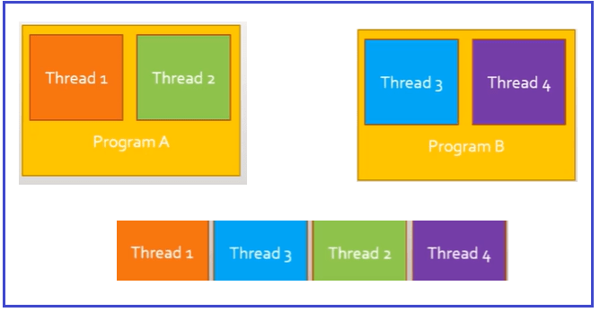

## **مقدمه‌ای بر همزمانی**

به عنوان یک توسعه‌دهنده، همه ما می‌خواهیم نرم‌افزار یا برنامه خوبی توسعه دهیم. همچنین می‌دانیم که **نرم‌افزار خوب،** نرم‌افزاری است که **قابل آزمایش، قابل نگهداری، قابل استفاده مجدد، انعطاف‌پذیر و کارآمد باشد** . حال، می‌خواهیم روی جنبه کارایی تمرکز کنیم. وقتی در مورد کارایی صحبت می‌کنیم، احتمالاً به **سرعت** فکر می‌کنیم . به عنوان مثال، فرض کنید برنامه A داریم که یک کار را در ۶۰ ثانیه انجام می‌دهد. و برنامه دیگری B همان کار را در دو ثانیه انجام می‌دهد. می‌توانیم بگوییم که برنامه B از برنامه A کارآمدتر است.

##### **چگونه می‌توانیم به بهره‌وری دست یابیم؟**

یکی از راه‌های دستیابی به کارایی، داشتن یک کامپیوتر سریع‌تر است، یعنی کامپیوتری که رم، پردازنده، حافظه SSD و غیره بیشتری داشته باشد. متأسفانه، این کار پرهزینه خواهد بود و همچنین محدودیت‌هایی از نظر رم، پردازنده، حافظه SSD و غیره وجود دارد. گزینه دیگر، استفاده از قدرت هسته‌های مختلف پردازنده است.

##### **چیست ؟** **همزمانی**

همزمانی به معنای انجام چندین کار به طور همزمان است. به عنوان مثال، اگر مجبور باشیم یک میلیون کار انجام دهیم، به جای انجام متوالی آنها به صورت تک تک، می‌توانیم آنها را همزمان انجام دهیم و به این ترتیب مدت زمان اجرای برنامه را کاهش دهیم.

بیایید مفهوم همزمانی (Concurrency) را با یک مثال بلادرنگ درک کنیم. اگر رستورانی با تنها یک آشپز داشته باشید، آن آشپز مسئول پختن هر چیزی است که هر مشتری درخواست می‌کند. حال، اگر یک آشپز همه چیز را بپزد و به هر مشتری رسیدگی کند، قطعاً زمان انتظار برای خدمت به مشتری بیشتر خواهد بود. این بدان معناست که یک آشپز چندین کار را انجام می‌دهد، یعنی برای چندین مشتری غذا آماده می‌کند.

حالا می‌خواهیم زمان انتظار مشتریان را کاهش دهیم. پس چه باید بکنیم؟ باید یک آشپز دیگر استخدام کنیم. به این ترتیب، هر دو آشپز به طور همزمان غذای مشتریان را آماده می‌کنند و مشتریان زمان کمتری را منتظر می‌مانند.

این مفهوم که **مجموعه‌ای از وظایف** داشته باشیم و آنها را به چندین بخش تقسیم کنیم و آن چندین بخش بتوانند همزمان انجام شوند، **موازی‌سازی** نامیده می‌شود . همانطور که قابل درک است، در مثال رستوران ما، ما توانستیم با اضافه کردن یک آشپز جدید به موازی‌سازی دست یابیم. به عنوان مثال، یک آشپز قرار است غذاهای گیاهی سرو کند و آشپز دیگر قرار است غذاهای غیر گیاهی سرو کند.

##### **چگونه می‌توانیم** **در برنامه‌نویسی به موازی‌سازی دست یابیم؟**

در برنامه‌نویسی، می‌توانیم با استفاده از نخ‌ها به موازی‌سازی دست یابیم. نخ، دنباله‌ای از دستورالعمل‌ها است که می‌توانند مستقل از کدهای دیگر اجرا شوند. از آنجایی که آنها در یک فرآیند مستقل هستند، می‌توانیم چندین نخ داشته باشیم. و اگر پردازنده ما اجازه دهد، می‌توانیم چندین نخ را همزمان اجرا کنیم. وقتی چندین نخ را همزمان اجرا می‌کنیم، به آن چندنخی می‌گویند. بنابراین، موازی‌سازی از چندین نخ برای انجام چندین کار به طور همزمان استفاده می‌کند. بنابراین، موازی‌سازی از چندنخی استفاده می‌کند و چندنخی نوعی همزمانی است.

با این حال، روش‌های دیگری برای انجام همزمانی وجود دارد. ما فقط در مورد کارایی صحبت می‌کنیم و آن را با سرعت مرتبط می‌دانیم. کارایی همچنین با استفاده از منابع مرتبط است. به عنوان مثال، اگر یک وب سرور داریم، می‌خواهیم تا حد امکان درخواست‌های وب را به طور همزمان ارائه دهیم. برای این کار، باید نخ‌ها را هنگامی که در حال استفاده نیستند، آزاد کنیم. می‌توانیم این کار را با استفاده از برنامه‌نویسی ناهمزمان انجام دهیم.

**برنامه‌نویسی ناهمگام به ما امکان می‌دهد تا از نخ‌ها (threads) به طور کارآمد استفاده کنیم و از مسدود شدن غیرضروری نخ‌ها (threads) جلوگیری می‌شود.**

فرض کنید با استفاده از هر اپلیکیشن تحویل غذا، پیتزا سفارش داده‌اید و آنها به شما می‌گویند که 30 دقیقه طول می‌کشد تا پیتزا به محل شما برسد. در این 30 دقیقه چه کاری انجام خواهید داد؟ آیا فقط منتظر پیتزا می‌مانید یا در حالی که پیتزا می‌رسد، کارهای دیگری انجام خواهید داد؟ بنابراین، بدیهی است که می‌خواهید در حین انتظار برای پیتزا، چند کار انجام دهید.

در مثال ما، آماده‌سازی پیتزا یک عملیات است و آن عملیات بلافاصله انجام نخواهد شد. و شما درست مانند یک نخ هستید. به جای اینکه منتظر نتیجه عملیات بمانید، بهتر است کارهای دیگری انجام دهید.

بنابراین، با استفاده از برنامه‌نویسی ناهمزمان، می‌توانیم درخواست‌های HTTP بیشتری را روی وب سرور خود ارائه دهیم و هر درخواست توسط یک نخ (thread) مدیریت می‌شود و چندین نخ می‌توانند با جلوگیری از مسدود شدن نخ، چندین درخواست HTTP را مدیریت کنند.

### **مقدمه‌ای بر برنامه‌نویسی موازی**

برنامه‌نویسی موازی به ما کمک می‌کند تا یک کار را به بخش‌های مختلف تقسیم کنیم و آن بخش‌ها را همزمان اجرا کنیم. به عنوان مثال، اگر مجموعه‌ای از تصاویر داشته باشیم و بخواهیم یک سری فیلتر را روی هر تصویر اعمال کنیم، می‌توانیم این کار را با بهره‌گیری از برنامه‌نویسی موازی انجام دهیم.

مزیت اصلی برنامه‌نویسی موازی صرفه‌جویی در زمان است. با به حداکثر رساندن استفاده از منابع کامپیوتر، در زمان صرفه‌جویی می‌شود. ایده این است که اگر کامپیوتر امکان استفاده از چند نخی (multi-threading) را فراهم کند، می‌توانیم وقتی وظیفه‌ای برای حل داریم از چندین نخ (threads) استفاده کنیم. به جای استفاده کم از پردازنده، یعنی استفاده از یک نخ، می‌توانیم از هر تعداد نخی که می‌توانیم برای سرعت بخشیدن به پردازش وظیفه استفاده کنیم.

برنامه‌نویسی موازی برای سیستم‌هایی که حجم عظیمی از داده‌ها را پردازش می‌کنند بسیار مهم است. به عنوان مثال، در فیس‌بوک، تقریباً دویست و پنجاه هزار عکس در دقیقه آپلود می‌شود. همانطور که می‌توانید تصور کنید، پردازش چنین حجم بالایی از اطلاعات به قدرت زیادی نیاز دارد. بنابراین، می‌توانیم از موازی‌سازی برای انجام وظایف بیشتر در زمان کمتر استفاده کنیم.

در سی شارپ، می‌توانیم برنامه‌نویسی موازی را به دو روش پیاده‌سازی کنیم. این روش‌ها به شرح زیر هستند:

1. **کتابخانه موازی وظایف (TPL)**
2. **LINQ موازی (PLINQ)**

کتابخانه موازی وظایف، کتابخانه‌ای است که زندگی را برای ما آسان‌تر می‌کند. وقتی در برنامه‌های خود شاهد موازی‌سازی یا برنامه‌نویسی موازی هستیم، TPL (کتابخانه موازی وظایف) جزئیات سطح پایین مدیریت نخ‌ها را خلاصه می‌کند، یعنی نحوه ایجاد نخ‌ها و نحوه اجرای وظایف با استفاده از چندین نخ توسط TPL مدیریت می‌شود. این به ما امکان می‌دهد تا به جای نخ‌ها، روی منطق برنامه تمرکز کنیم.

از سوی دیگر، PLINQ یا Parallel LINQ یک پیاده‌سازی از LINQ است که به ما امکان می‌دهد به صورت موازی کار کنیم. برای مثال، در LINQ می‌توانیم عناصر یک آرایه را فیلتر کنیم. سپس با Parallel LINQ می‌توانیم همان آرایه را به صورت موازی فیلتر کنیم. این به ما امکان می‌دهد از هسته‌های پردازنده خود برای انجام ارزیابی‌های عناصر آرایه به طور همزمان استفاده کنیم.

دو نوع موازی‌سازی وجود دارد. آنها به شرح زیر هستند.

1. **موازی‌سازی داده‌ها**
2. **موازی‌سازی وظایف**

در موازی‌سازی داده‌ها، مجموعه‌ای از مقادیر داریم و می‌خواهیم از عملیات یکسانی روی هر یک از عناصر موجود در مجموعه استفاده کنیم. مثال‌ها شامل فیلتر کردن عناصر یک آرایه به صورت موازی خواهند بود.

موازی‌سازی وظایف زمانی اتفاق می‌افتد که مجموعه‌ای از وظایف مستقل داریم که می‌خواهیم به صورت موازی انجام دهیم. به عنوان مثال، اگر بخواهیم یک ایمیل و یک پیامک به یک کاربر ارسال کنیم، می‌توانیم هر دو عملیات را به صورت موازی انجام دهیم، اگر مستقل باشند.

صرفاً به این دلیل که مفهوم موازی‌سازی را داریم، به این معنی نیست که باید از موازی‌سازی استفاده کنیم. بعداً خواهیم دید که مواقعی وجود دارد که بهتر است از موازی‌سازی استفاده نکنیم، زیرا در موارد خاص استفاده از موازی‌سازی کندتر از عدم استفاده از آن است.

### **مقدمه‌ای بر برنامه‌نویسی ناهمگام**

برنامه‌نویسی ناهمزمان به ما این امکان را می‌دهد که نخ‌های فرآیندهای خود را به روشی کارآمدتر مدیریت کنیم. ایده این است که از مسدود شدن یک نخ در حین انتظار برای پاسخ، چه از یک سیستم خارجی مانند یک سرویس وب یا از سیستم مدیریت فایل رایانه، جلوگیری کنیم.

برای مثال، اگر یک برنامه وب داشته باشیم، با استفاده از برنامه‌نویسی ناهمگام (Asynchronous Programming) قادر خواهد بود درخواست‌های HTTP بیشتری را همزمان ارائه دهد. دلیل این امر این است که هر درخواست HTTP توسط یک نخ (thread) مدیریت می‌شود و اگر از مسدود کردن نخ‌ها (threads) اجتناب کنیم، نخ‌های بیشتری برای پردازش درخواست‌های HTTP در دسترس خواهند بود.

استفاده می‌کنیم **برای کار با برنامه‌نویسی ناهمزمان در سی‌شارپ، از کلمات کلیدی async** و **await** . ایده این است که ما باید از **کلمه کلیدی async** برای علامت‌گذاری یک متد به عنوان ناهمزمان استفاده کنیم و با **await** می‌توانیم منتظر یک عملیات ناهمزمان باشیم به گونه‌ای که نخ اصلی مسدود نشود.

متدی که با **کلمه کلیدی async** مشخص شده است باید یک **Task** یا **Task\<T>** را برگرداند . ایده Task **این** است که یک عملیات ناهمزمان را نشان می‌دهد و چیزی را برنمی‌گرداند. در مورد **Task\<T> ،** مانند یک قول است که در آینده این متد مقداری از نوع داده T را برمی‌گرداند.

برنامه‌نویسی ناهمزمان می‌تواند در هر محیطی مانند دسکتاپ، موبایل و وب استفاده شود. معمولاً وقتی قرار است با سیستم‌های خارجی ارتباط برقرار کنیم از برنامه‌نویسی ناهمزمان استفاده می‌کنیم. به عنوان مثال، اگر برنامه ما با یک سرویس وب ارتباط برقرار کند، باید از برنامه‌نویسی ناهمزمان استفاده کنیم.

هر زمان که ما با یک سیستم خارجی ارتباط برقرار می‌کنیم، این چیزی جز یک عملیات ورودی/خروجی (I/O-Bound Operation) نیست. عملیات ورودی/خروجی با این واقعیت مشخص می‌شوند که عملکرد آنها به ارتباط بین سیستم‌ها بستگی دارد. به همین دلیل است که برنامه‌نویسی ناهمزمان سرعت فرآیندها را بهبود نمی‌بخشد، زیرا هیچ راهی وجود ندارد که از سیستم خودمان بتوانیم سرعت پردازش یک سیستم خارجی را سریع‌تر کنیم. حداکثر کاری که می‌توانیم انجام دهیم این است که می‌توانیم نخ‌های خود را به طور موثر مدیریت کنیم تا نخ‌ها مسدود نشوند.

#### **عملیات محدود به ورودی/خروجی در مقابل CPU:**

ما قبلاً در مورد برنامه‌نویسی ناهمزمان و موازی بحث کرده‌ایم. همچنین درک این نکته مهم است که هر دو برای بهبود چه نوع عملیاتی در نظر گرفته شده‌اند.

در مورد برنامه‌نویسی ناهمزمان، ما بحث کردیم که این زبان تخصص مدیریت عملیات‌های IO-Bound را دارد که در آن‌ها عملیات‌های IO-Bound با ارتباط با سیستم‌های خارجی مشخص می‌شوند. برخی از نمونه‌های عملیات‌های IO-Bound عبارتند از فراخوانی یک سرویس وب، تعامل با یک پایگاه داده، تعامل با یک سیستم فایل و غیره. بنابراین، هنگامی که نیاز به انجام چنین عملیاتی داریم، می‌توانیم استفاده از برنامه‌نویسی ناهمزمان را برای افزایش سطح مقیاس‌پذیری سیستم‌های خود در نظر بگیریم.

وقتی یک موجودیت خارجی را فراخوانی می‌کنیم، باید منتظر پاسخ باشیم و در حین انتظار برای پاسخ، بهتر است نخی که عملیات را آغاز کرده است آزاد کنیم تا بتواند به انجام وظایف دیگر بپردازد.

از سوی دیگر، عملیات وابسته به CPU، عملیاتی هستند که عمدتاً با استفاده از قدرت پردازنده انجام می‌شوند. در اینجا، معمولاً هیچ وابستگی به سیستم‌های خارجی وجود ندارد، همه چیز به سیستم ما بستگی دارد. اگر چندین عملیات CPU مستقل داشته باشیم، ممکن است بخواهیم از برنامه‌نویسی موازی برای کاهش زمان انجام این عملیات استفاده کنیم. برخی از نمونه‌های عملیات CPU عبارتند از یافتن معکوس یک ماتریس، مرتب‌سازی عناصر یک آرایه و غیره.

همچنین درک تفاوت بین عملیات IO و CPU-Bound مهم است تا ببینید با استفاده از برنامه‌نویسی موازی یا ناهمزمان چه مواردی را می‌توانید در نظر بگیرید.

اگر عملیات شما نیاز به ارتباط با برخی سیستم‌های خارجی برنامه‌تان دارد، آنگاه محدود به ورودی/خروجی است و بنابراین می‌توانید برنامه‌نویسی ناهمزمان را در نظر بگیرید. از سوی دیگر، اگر عملیات کاملاً درون برنامه شما انجام می‌شود و زمان اجرای آن به پردازنده بستگی دارد، آنگاه یک عملیات محدود به CPU است و بنابراین می‌توانید استفاده از برنامه‌نویسی موازی را در نظر بگیرید.

#### **برنامه‌نویسی ترتیبی، همزمانی، چندنخی، موازی‌سازی، چندوظیفگی:**

در زمینه همزمانی، اصطلاحات مرتبط خاصی مورد بررسی قرار می‌گیرند. برخی از این اصطلاحات بسیار مشابه هستند و تفاوت‌های بین آنها اغلب قطعی است. حتی اگر در زمینه‌های غیررسمی به جای یکدیگر استفاده شوند، دقیقاً یکسان نیستند. ما به مفاهیم برنامه‌نویسی ترتیبی، همزمانی، چندنخی، موازی‌سازی و چندوظیفگی خواهیم پرداخت. بیایید با مدل برنامه‌نویسی غیر همزمان شروع کنیم.

**برنامه‌نویسی ترتیبی:** برنامه‌نویسی ترتیبی، برنامه‌نویسی‌ای است که در آن دستورالعمل‌ها یکی‌یکی انجام می‌شوند. در این نوع برنامه‌نویسی، هیچ نوع همزمانی وجود ندارد. یکی از مزایای این مدل برنامه‌نویسی این است که فهم آن نسبتاً آسان است، زیرا شامل دنبال کردن یک سری مراحل به صورت منظم است. مشکل این مدل برنامه‌نویسی این است که گاهی اوقات می‌تواند کند باشد.

**همزمانی:** همزمانی به معنای انجام چندین کار به طور همزمان است. این متضاد برنامه‌نویسی ترتیبی است. اصطلاح همزمانی شامل هر چیزی است که به نحوی به انجام چندین کار به طور همزمان مربوط می‌شود. اشکال مختلفی از همزمانی وجود دارد. ما مفهوم اساسی نخ‌ها را دیده‌ایم. به یاد داریم که یک نخ، دنباله‌ای از دستورالعمل‌ها است که می‌توانند مستقل از کد ما اجرا شوند.

**چندرشته‌ای:** چندرشته‌ای توانایی استفاده از چندین رشته است. لازم به توضیح است که چندرشته‌ای به معنای موازی‌سازی نیست، زیرا می‌توانیم کامپیوتری با پردازنده‌ای داشته باشیم که چندهسته‌ای نباشد و همچنان بتوانم از چندرشته‌ای استفاده کنم. دلیل این امر آن است که یک سیستم عامل می‌تواند چندین رشته ارائه دهد و آنها را به صورت متوالی و بدون استفاده از موازی‌سازی اجرا کند.

**موازی‌سازی:** اجرای همزمان چندین رشته پردازشی (thread) است. این امر به یک پردازنده چند هسته‌ای نیاز دارد. از آنجایی که موازی‌سازی از چندین رشته پردازشی استفاده می‌کند، موازی‌سازی از چندرشته‌ای‌سازی (multithreading) استفاده می‌کند. با این حال، همانطور که گفتیم، می‌توانیم چندرشته‌ای‌سازی را بدون موازی‌سازی داشته باشیم. در این حالت، معمولاً چیزی که داریم چندوظیفگی (multitasking) نامیده می‌شود.

**چندوظیفگی:** با چندوظیفگی، می‌توانیم چندین وظیفه را به گونه‌ای اجرا کنیم که رشته‌های مختلف آنها را به ترتیب اجرا کنیم، که معمولاً با نوعی سیستم اجرای وظیفه انجام می‌شود. این کار در سطح سیستم عامل انجام می‌شود. به عنوان مثال، اگر برنامه A با رشته‌های یک و دو و برنامه B با رشته‌های سه و چهار داشته باشیم و سعی کنیم هر دو برنامه را همزمان اجرا کنیم، ممکن است سیستم رشته‌ها را به ترتیب یک، سه، دو و چهار اجرا کند.

بنابراین، به نظر می‌رسد که موازی‌سازی وجود داشته است، اما در واقع چنین چیزی وجود نداشته است، زیرا رشته‌ها به طور همزمان اجرا نمی‌شوند، بلکه به ترتیب اجرا می‌شوند. کامپیوتر آنقدر سریع است که چشم انسان نمی‌تواند ببیند که وظیفه به ترتیب اجرا می‌شود.

#### **جبرگرایی در مقابل عدم جبرگرایی**

روش‌هایی وجود دارد که می‌توانیم نتیجه آن را از مقادیر ورودی‌اش پیش‌بینی کنیم. اگر روشی داشته باشیم که دو عدد صحیح را به عنوان مقادیر ورودی دریافت کند و مجموع دو عدد را برگرداند، واضح است که می‌توانیم مقدار خروجی را از مقادیر ورودی پیش‌بینی کنیم. اگر ۲ و ۵ را ارسال کنیم، نتیجه ۷ خواهد بود. یعنی ۲ به علاوه ۵ می‌شود هفت. این ویژگی توانایی پیش‌بینی نتیجه یک روش بر اساس مقادیر ورودی‌اش را جبرگرایی می‌نامیم.

در حالت برعکس چه اتفاقی می‌افتد؟ یعنی زمانی که روشی داریم که نمی‌توانیم نتیجه را پیش‌بینی کنیم. خب، در این صورت می‌گوییم که با یک روش غیرقطعی روبرو هستیم. یک مثال ساده از غیرقطعی بودن، کلاس Random خواهد بود. با این کلاس، می‌توانیم اعداد شبه‌تصادفی تولید کنیم.

بنابراین، مقدار خروجی متد Random را نمی‌توان از مقادیر ورودی ارائه شده به متدهای آن تعیین کرد. بنابراین، مقدار خروجی متدهای کلاس Random را نمی‌توان از مقادیر ورودی ارائه شده به این متدها تعیین کرد.

با این حال، نه تنها با کلاس تصادفی، ما عدم قطعیت داریم، بلکه موازی‌سازی نیز می‌تواند نوعی عدم قطعیت ایجاد کند. فرض کنید روشی دارید که کارت‌های اعتباری را پردازش می‌کند و همزمان با پردازش آنها، پیامی را در پنجره کنسول می‌نویسد. اگر از برنامه‌نویسی ترتیبی استفاده کنیم، همیشه می‌توانیم ترتیب پیام‌ها را در پنجره کنسول پیش‌بینی کنیم. با برنامه‌نویسی موازی، پیش‌بینی این امر عملاً غیرممکن است. ما می‌دانیم که همه عملیات قرار است اجرا شوند، اما هیچ راهی برای دانستن ترتیب اجرای رشته‌هایی که مسئول پردازش کارت‌های اعتباری مختلف هستند، نداریم. حتی اگر بدانیم که همه کارت‌های اعتباری پردازش خواهند شد، نمی‌توانیم ترتیب پردازش را پیش‌بینی کنیم.

بنابراین، باید در نظر داشته باشیم که وقتی از کد به صورت موازی استفاده می‌کنیم، تا زمانی که اجرا نکنیم، نمی‌توانیم ترتیب عملیات را پیش‌بینی کنیم. اگر نیاز دارید که در کارهایی که باید انجام دهید، ترتیب خاصی داشته باشید، شاید موازی‌سازی در مورد شما گزینه خوبی نباشد.

##### **خلاصه:**

1. دیدیم که همزمانی به نوعی به انجام چندین کار به طور همزمان اشاره دارد. مفهوم همزمانی شامل برنامه‌نویسی موازی و برنامه‌نویسی ناهمزمان می‌شود.
2. برنامه‌نویسی موازی به استفاده از چندین رشته پردازشی به طور همزمان برای حل مجموعه‌ای از وظایف اشاره دارد. برای این منظور، به پردازنده‌هایی با توانایی‌های کافی برای انجام چندین وظیفه به طور همزمان نیاز داریم. به طور کلی، ما از برنامه‌نویسی موازی برای افزایش سرعت استفاده می‌کنیم.
3. برنامه‌نویسی ناهمزمان به استفاده کارآمد از نخ‌ها اشاره دارد که در آن ما یک نخ را بی‌جهت مسدود نمی‌کنیم. اما در حالی که منتظر نتیجه یک عملیات هستیم، نخ در این بین وظایف دیگری را انجام می‌دهد. این امر مقیاس‌پذیری عمودی را افزایش می‌دهد و به ما امکان می‌دهد از هنگ کردن رابط کاربری در حین انجام وظایف طولانی جلوگیری کنیم.
4. عملیات وابسته به CPU، عملیاتی هستند که کاملاً به سرعت پردازنده‌های ما وابسته‌اند.
5. عملیات‌های وابسته به IO آن‌هایی هستند که به ارتباط با موجودیت‌های خارج از برنامه ما وابسته‌اند.
6. قطعی بودن به این واقعیت اشاره دارد که ما نمی‌توانیم نتیجه چیزی را بر اساس شرایط اولیه پیش‌بینی کنیم. به عنوان مثال، می‌توانیم نتیجه یک متد را از مقادیر ورودی آن پیش‌بینی کنیم. با برنامه‌نویسی موازی، ما همیشه قادر به پیش‌بینی ۱۰۰ درصد نتیجه چیزی نخواهیم بود، به خصوص وقتی که به ترتیب عملیات مجموعه‌ای از وظایف اشاره می‌کنیم، زیرا ما ترتیب اجرای رشته‌های مختلف برنامه را کنترل نمی‌کنیم.