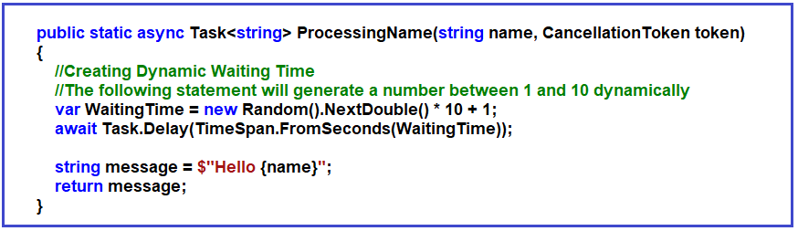
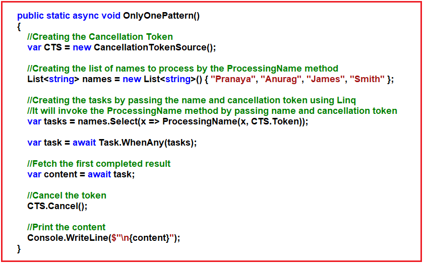
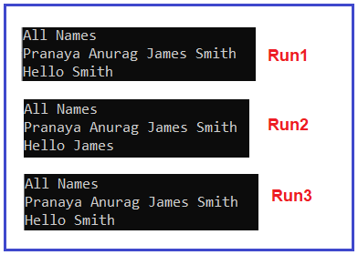
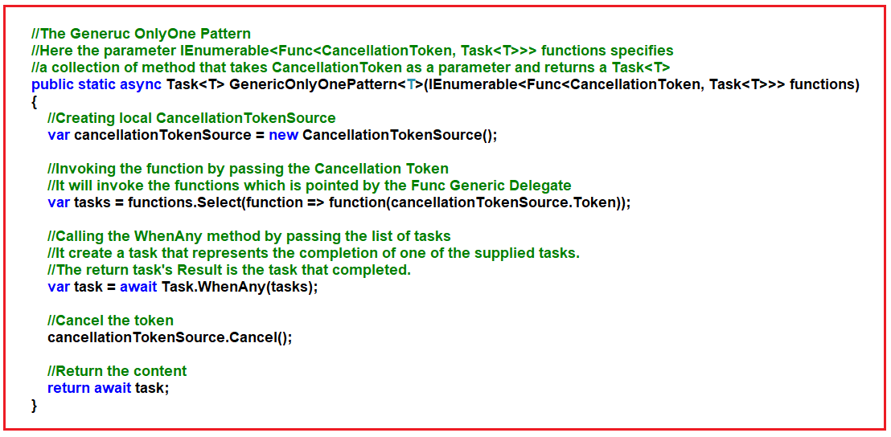
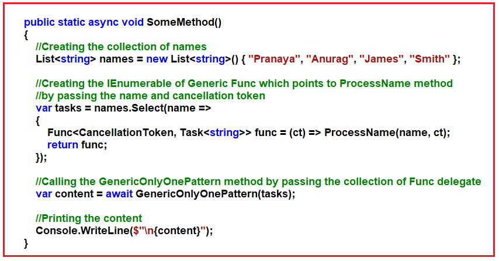
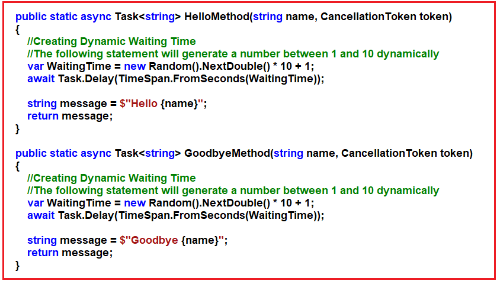
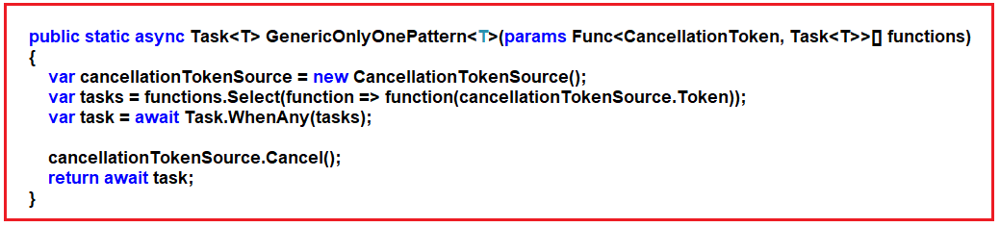
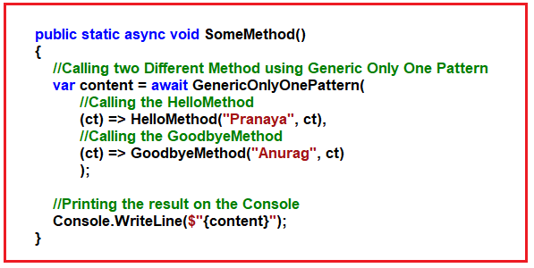

## **فقط یک الگو در سی شارپ به همراه مثال:**

در این مقاله، قصد دارم در مورد چگونگی پیاده‌سازی **فقط یک الگو در برنامه‌نویسی ناهمزمان سی‌شارپ** با مثال‌ها صحبت کنم. لطفاً مقاله قبلی ما را که در آن در مورد چگونگی پیاده‌سازی الگوی Retry در برنامه‌نویسی ناهمزمان سی‌شارپ با مثال‌ها صحبت کردیم، مطالعه کنید.

##### **فقط یک الگو در برنامه‌نویسی ناهمگام سی‌شارپ:**

گاهی اوقات چندین وظیفه داریم و همه وظایف اطلاعات یکسانی به ما می‌دهند و ما فقط می‌خواهیم از اولین وظیفه برای اتمام و لغو بقیه استفاده کنیم. برای این کار، می‌توانیم از الگویی (فقط یک الگو) استفاده کنیم که از توکن لغو استفاده می‌کند. مثالی از این مورد زمانی است که نیاز به دریافت اطلاعات از ارائه‌دهندگان مختلف که به صورت ناهمزمان کار می‌کنند، داشته باشیم. و وقتی از یکی پاسخی دریافت می‌کنیم، می‌خواهیم وظایف دیگر را لغو کنیم.

##### **مثال برای درک الگوی فقط یکتا در سی شارپ:**

بیایید مثالی برای درک مفهوم «فقط یک الگو» در سی‌شارپ ببینیم. لطفاً به تصویر زیر نگاهی بیندازید. ProcessingName زیر یک متد ناهمزمان است. این متد دو پارامتر می‌گیرد: نام و توکن لغو. سپس در اینجا اجرا را برای یک دوره زمانی تصادفی بین ۱ تا ۱۰ ثانیه به تأخیر می‌اندازیم. و در نهایت، نام را با افزودن کلمه Hello برمی‌گردانیم. این متد قرار است چندین بار فراخوانی شود و ما نمی‌دانیم که برای کدام فراخوانی، اجرا را به چه مدت زمانی به تأخیر می‌اندازد، زیرا زمان انتظار به طور تصادفی ایجاد می‌شود.



هر درخواستی که به این متد ارسال می‌کنیم، به مدت تصادفی چند ثانیه منتظر می‌ماند. این یعنی ما نمی‌دانیم کدام درخواست قرار است زودتر تمام شود.

##### **ایجاد تنها یک الگو در سی شارپ:**

حالا کاری که می‌خواهیم انجام دهیم به صورت زیر است.

من قصد دارم متد ProcessingName را چهار بار با چهار پارامتر مختلف فراخوانی کنم، اما فقط نتیجه اول را می‌خواهم. و بلافاصله پس از دریافت نتیجه اول، می‌خواهم هر درخواست دیگری را لغو کنم. لطفاً به تصویر زیر نگاهی بیندازید که دقیقاً همین کار را انجام می‌دهد.

در اینجا، ابتدا توکن لغو خود را مقداردهی اولیه می‌کنیم. سپس لیستی از نام‌هایی که باید توسط متد ProcessingName پردازش شوند را ایجاد می‌کنم. سپس با استفاده از عبارات LINQ و Lambda و با ارسال نام و توکن لغو، وظایف را ایجاد می‌کنیم. این کار با ارسال نام و توکن لغو، متد ProcessingName را فراخوانی می‌کند. سپس با ارسال وظایف، متد WhenAny را فراخوانی می‌کنیم. متد WhenAny وظیفه‌ای ایجاد می‌کند که با تکمیل هر یک از وظایف ارائه شده، تکمیل خواهد شد. در مرحله بعد، اولین محتوای تکمیل شده را واکشی کرده و سپس توکن را لغو می‌کنیم و در نهایت محتوا را در کنسول چاپ می‌کنیم.



در مرحله بعد، فقط باید متد OnlyOnePattern را از داخل متد Main فراخوانی کنیم. مثال کامل کد در زیر آورده شده است.

```csharp
using System;
using System.Collections.Generic;
using System.Threading;
using System.Threading.Tasks;
using System.Linq;

namespace AsynchronousProgramming
{
    class Program
    {
        static void Main(string[] args)
        {
            OnlyOnePattern();
            Console.ReadKey();
        }

        public static async void OnlyOnePattern()
        {
            // Creating the Cancellation Token
            var CTS = new CancellationTokenSource();

            // Creating the list of names to process by the ProcessingName method
            List<string> names = new List<string>() { "Pranaya", "Anurag", "James", "Smith" };

            Console.WriteLine($"All Names");
            foreach (var item in names)
            {
                Console.Write($"{item} ");
            }

            // Creating the tasks by passing the name and cancellation token using Linq
            // It will invoke the ProcessingName method by passing name and cancellation token
            var tasks = names.Select(x => ProcessingName(x, CTS.Token));

            var task = await Task.WhenAny(tasks);

            // Fetch the first completed result
            var content = await task;

            // Cancel the token
            CTS.Cancel();

            // Print the content
            Console.WriteLine($"\n{content}");
        }

        public static async Task<string> ProcessingName(string name, CancellationToken token)
        {
            // Creating Dynamic Waiting Time
            // The following statement will generate a number between 1 and 10 dynamically
            var WaitingTime = new Random().NextDouble() * 10 + 1;
            await Task.Delay(TimeSpan.FromSeconds(WaitingTime));

            string message = $"Hello {name}";
            return message;
        }
    }
}
```

من کد بالا را سه بار اجرا کردم و نتیجه زیر را گرفتم. در مورد شما، نتیجه ممکن است متفاوت باشد. اگر نتیجه یکسانی می‌گیرید، چندین بار امتحان کنید و در مقطعی از زمان نتیجه متفاوتی خواهید گرفت.



بنابراین، از خروجی بالا، می‌توانید ببینید که متد WhenAny وظیفه‌ای ایجاد می‌کند که به محض تکمیل هر یک از وظایف ارائه شده، تکمیل می‌شود و سپس بلافاصله بقیه وظایف را لغو می‌کند. این تنها یک الگو در برنامه‌نویسی ناهمزمان C# نامیده می‌شود.

##### **فقط یک الگوی عمومی در برنامه‌نویسی ناهمزمان سی‌شارپ:**

برای درک بهتر، لطفاً به تصویر زیر نگاهی بیندازید.



##### **توضیح کد بالا:**

1. **توابع IEnumerable<Func<CancellationToken, Task\<T>>> :** یک Func یک نماینده عمومی است که به متدی اشاره می‌کند که چیزی را برمی‌گرداند. اکنون، الگوی OneOne ما چندین وظیفه را می‌پذیرد. بنابراین، پارامتر الگوی Generic OnlyOne ما یک IEnumerable از Func خواهد بود که Cancellation Token را به عنوان پارامتر ورودی می‌گیرد و یک Task از نوع T برمی‌گرداند، یعنی IEnumerable<Func<CancellationToken, Task\<T>>> و در اینجا ما این پارامتر را به عنوان functions فراخوانی کردیم. بنابراین، در اینجا پارامتر توابع IEnumerable<Func<CancellationToken, Task\<T>>> مجموعه‌ای از متدها را مشخص می‌کند که CancellationToken را به عنوان پارامتر می‌گیرد و یک Task\<T> برمی‌گرداند.
2. **var cancelTokenSource = new CancellationTokenSource() :** سپس ما یک نمونه محلی CancellationTokenSource ایجاد می‌کنیم.
3. **var tasks = functions.Select(function => function(cancellationTokenSource.Token)) :** سپس ما با ارسال Cancellation Token تابع را فراخوانی می‌کنیم. این تابع توابعی را که توسط Func Generic Delegate به آنها اشاره شده است، فراخوانی می‌کند. در واقع، در این مرحله متدها را فراخوانی نمی‌کند، فقط لیستی از وظایفی را که باید هنگام فراخوانی متد WhenAll فراخوانی شوند، ایجاد می‌کند.
4. **var task = await Task.WhenAny(tasks) :** سپس با ارسال لیست وظایف، متد WhenAny را فراخوانی می‌کنیم. متد WhenAny وظیفه‌ای ایجاد می‌کند که نشان دهنده تکمیل یکی از وظایف ارائه شده است. نتیجه (Result) وظیفه، وظیفه‌ای است که تکمیل شده است.
5. **cancelTokenSource.Cancel() :** زمانی که نتیجه را از متد WhenAny دریافت کردیم، یعنی زمانی که متد WhenAny تکمیل شد، باید توکن را لغو کنیم.
6. **return await task :** نتیجه‌ی وظیفه‌ی تکمیل‌شده را برمی‌گرداند.

##### **چگونه از الگوی Generic OnlyOne در سی شارپ استفاده کنیم؟**

ما الگوی Generic Only One خود را در برنامه‌نویسی ناهمگام C# ایجاد کرده‌ایم. حال، بیایید ببینیم چگونه از الگوی Generic OnlyOne در C# استفاده کنیم. برای این کار، لطفاً به تصویر زیر نگاهی بیندازید. در اینجا، ابتدا، مجموعه‌ای از نام‌ها را برای پردازش توسط متد ProcessName ایجاد می‌کنیم. به یاد داشته باشید، الگوی Generic OnlyOne یک پارامتر از نوع IEnumerable<Func<CancellationToken, Task\<T>>> می‌پذیرد. بنابراین، برای فراخوانی متد Generic Only One Pattern، یک IEnumerable از نوع Func ایجاد کرده‌ایم که باید با ارسال نام و توکن لغو به عنوان پارامتر با استفاده از دستور select LINQ به متد ProcessName اشاره کند. و سپس متد GenericOnlyOnePattern را فراخوانی می‌کنیم و هر آنچه متد GenericOnlyOnePattern برمی‌گرداند، آن را در پنجره Console چاپ می‌کنیم.



سپس، از متد اصلی، باید SomeMethod را فراخوانی کنیم. مثال کامل در زیر آورده شده است.

```csharp
using System;
using System.Collections.Generic;
using System.Threading;
using System.Threading.Tasks;
using System.Linq;

namespace AsynchronousProgramming
{
    class Program
    {
        static void Main(string[] args)
        {
            SomeMethod();
            Console.ReadKey();
        }

        public static async void SomeMethod()
        {
            // Creating the collection of names
            List<string> names = new List<string>() { "Pranaya", "Anurag", "James", "Smith" };

            Console.WriteLine($"All Names");
            foreach (var item in names)
            {
                Console.Write($"{item} ");
            }

            // Creating the IEnumerable of Generic Func which points to ProcessName method
            // by passing the name and cancellation token
            var tasks = names.Select(name =>
            {
                Func<CancellationToken, Task<string>> func = (ct) => ProcessName(name, ct);
                return func;
            });

            // Calling the GenericOnlyOnePattern method by passing the collection of Func delegate
            var content = await GenericOnlyOnePattern(tasks);

            // Printing the content
            Console.WriteLine($"\n{content}");
        }

        // The Generic Only One Pattern
        // Here the parameter IEnumerable<Func<CancellationToken, Task\<T>>> functions specify
        // a collection of method that takes Cancellation Token as a parameter and returns a Task<T>
        public static async Task<T> GenericOnlyOnePattern<T>(IEnumerable<Func<CancellationToken, Task<T>>> functions)
        {
            // Creating local CancellationTokenSource
            var cancellationTokenSource = new CancellationTokenSource();

            // Invoking the function by passing the Cancellation Token
            // It will invoke the functions which is pointed by the Func Generic Delegate
            var tasks = functions.Select(function => function(cancellationTokenSource.Token));

            // Calling the WhenAny method by passing the list of tasks
            // It create a task that represents the completion of one of the supplied tasks.
            // The return task's Result is the task that completed.
            var task = await Task.WhenAny(tasks);

            // Cancel the token
            cancellationTokenSource.Cancel();

            // Return the content
            return await task;
        }

        public static async Task<string> ProcessName(string name, CancellationToken token)
        {
            // Creating Dynamic Waiting Time
            // The following statement will generate a number between 1 and 10 dynamically
            var WaitingTime = new Random().NextDouble() * 10 + 1;
            await Task.Delay(TimeSpan.FromSeconds(WaitingTime));

            string message = $"Hello {name}";
            return message;
        }
    }
}
```

من کد بالا را سه بار اجرا کردم و نتیجه زیر را گرفتم. در مورد شما، نتیجه ممکن است متفاوت باشد. اگر نتیجه یکسانی می‌گیرید، چندین بار امتحان کنید و در مقطعی از زمان نتیجه متفاوتی خواهید گرفت.


##### **الگوی OnlyOne با متدهای مختلف در سی شارپ:**

در حال حاضر، ما از الگوی Only One Pattern برای انجام عملیات مشابه روی یک مجموعه استفاده می‌کنیم. اما ممکن است همیشه این را نخواهیم. شاید دو متد مختلف داشته باشیم که می‌خواهیم همزمان اجرا شوند، اما می‌خواهیم یک متد را پس از اتمام متد دیگر لغو کنیم. این کار با استفاده از الگوی Only One Pattern در سی شارپ نیز امکان‌پذیر است.

ابتدا، دو متد زیر را که قرار است با استفاده از Only One Pattern پردازش کنیم، ایجاد کنید. کد را قبلاً توضیح داده‌ایم. بنابراین، لطفاً خطوط توضیحات را مرور کنید. منطق در هر دو متد یکسان خواهد بود.



در مرحله بعد، الگوی GenericOnlyOnePattern را همانطور که در تصویر زیر نشان داده شده است، اصلاح کنید. بدنه (body) همانند نسخه قبلی الگوی GenericOnlyOnePattern خواهد بود، بنابراین من بدنه را توضیح نمی‌دهم. تنها تفاوت پارامتر است. در اینجا، ما به جای IEnumerable از آرایه params استفاده می‌کنیم. بقیه موارد یکسان خواهند بود.



در مرحله بعد، باید از متد GenericOnlyOnePattern فوق استفاده کنیم. بنابراین، SomeMethod را همانطور که در تصویر زیر نشان داده شده است، تغییر دهید. از آنجایی که GenericOnlyOnePattern آرایه params را به عنوان پارامتر ورودی می‌گیرد، می‌توانیم انواع مختلفی از متدها را فراخوانی کنیم. در اینجا، ما دو متد مختلف را ارسال می‌کنیم و سپس هر نتیجه‌ای که آنها برمی‌گردانند را به سادگی در پنجره کنسول چاپ می‌کنیم.



کد کامل مثال در زیر آمده است.

```csharp
using System;
using System.Threading;
using System.Threading.Tasks;
using System.Linq;

namespace AsynchronousProgramming
{
    class Program
    {
        static void Main(string[] args)
        {
            SomeMethod();
            Console.ReadKey();
        }

        public static async void SomeMethod()
        {
            // Calling two Different Method using Generic Only One Pattern
            var content = await GenericOnlyOnePattern(
                // Calling the HelloMethod
                (ct) => HelloMethod("Pranaya", ct),
                // Calling the GoodbyeMethod
                (ct) => GoodbyeMethod("Anurag", ct)
            );

            // Printing the result on the Console
            Console.WriteLine($"{content}");
        }

        public static async Task<T> GenericOnlyOnePattern<T>(params Func<CancellationToken, Task<T>>[] functions)
        {
            var cancellationTokenSource = new CancellationTokenSource();
            var tasks = functions.Select(function => function(cancellationTokenSource.Token));
            var task = await Task.WhenAny(tasks);
            cancellationTokenSource.Cancel();
            return await task;
        }

        public static async Task<string> HelloMethod(string name, CancellationToken token)
        {
            var WaitingTime = new Random().NextDouble() * 10 + 1;
            await Task.Delay(TimeSpan.FromSeconds(WaitingTime));

            string message = $"Hello {name}";
            return message;
        }

        public static async Task<string> GoodbyeMethod(string name, CancellationToken token)
        {
            var WaitingTime = new Random().NextDouble() * 10 + 1;
            await Task.Delay(TimeSpan.FromSeconds(WaitingTime));

            string message = $"Goodbye {name}";
            return message;
        }
    }
}
```

حالا، کد بالا را چندین بار اجرا کنید و مشاهده خواهید کرد که گاهی اوقات HelloMethod اول اجرا می‌شود و گاهی اوقات GoodbyeMethod اول اجرا می‌شود. پس از اتمام یک متد، متد دیگر لغو می‌شود.

##### **WhenAny متدهای کلاس Task در سی شارپ:**

کلاس Task در سی شارپ چهار نسخه overload شده از متد WhenAny را ارائه می‌دهد.

1. **WhenAny(IEnumerable\<Task> tasks):** این تابع وظیفه‌ای ایجاد می‌کند که با تکمیل هر یک از وظایف ارائه شده، تکمیل می‌شود. در اینجا، پارامتر tasks وظایفی را که باید برای تکمیل منتظر بمانند، مشخص می‌کند. این تابع وظیفه‌ای را برمی‌گرداند که نشان دهنده تکمیل یکی از وظایف ارائه شده است. نتیجه وظیفه بازگشتی، وظیفه‌ای است که تکمیل شده است.
2. **WhenAny\<TResult>(IEnumerable<Task\<TResult>> tasks)** : این تابع یک وظیفه ایجاد می‌کند که با تکمیل هر یک از وظایف ارائه شده، تکمیل خواهد شد. در اینجا، پارامتر tasks وظایفی را که باید برای تکمیل منتظر بمانند، مشخص می‌کند. در اینجا، پارامتر type، TResult، نوع وظیفه تکمیل شده را مشخص می‌کند. این تابع وظیفه‌ای را برمی‌گرداند که نشان دهنده تکمیل یکی از وظایف ارائه شده است. مقدار Result وظیفه بازگشتی، وظیفه‌ای است که تکمیل شده است.
3. **WhenAny(params Task[] tasks):** این تابع وظیفه‌ای ایجاد می‌کند که با تکمیل هر یک از وظایف ارائه شده، تکمیل می‌شود. در اینجا، پارامتر tasks وظایفی را که باید برای تکمیل منتظر بمانند، مشخص می‌کند. این تابع وظیفه‌ای را برمی‌گرداند که نشان دهنده تکمیل یکی از وظایف ارائه شده است. نتیجه وظیفه بازگشتی، وظیفه‌ای است که تکمیل شده است.
4. **WhenAny\<TResult>(params Task\<TResult>[] tasks):** این تابع یک وظیفه ایجاد می‌کند که با تکمیل هر یک از وظایف ارائه شده، تکمیل می‌شود. در اینجا، پارامتر tasks وظایفی را که باید برای تکمیل منتظر بمانند، مشخص می‌کند. در اینجا، پارامتر type، TResult، نوع وظیفه تکمیل شده را مشخص می‌کند. این تابع وظیفه‌ای را برمی‌گرداند که نشان دهنده تکمیل یکی از وظایف ارائه شده است. نتیجه وظیفه بازگشتی، وظیفه‌ای است که تکمیل شده است.