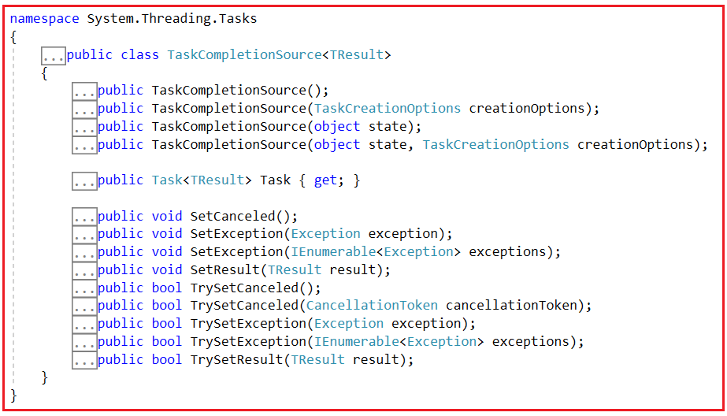
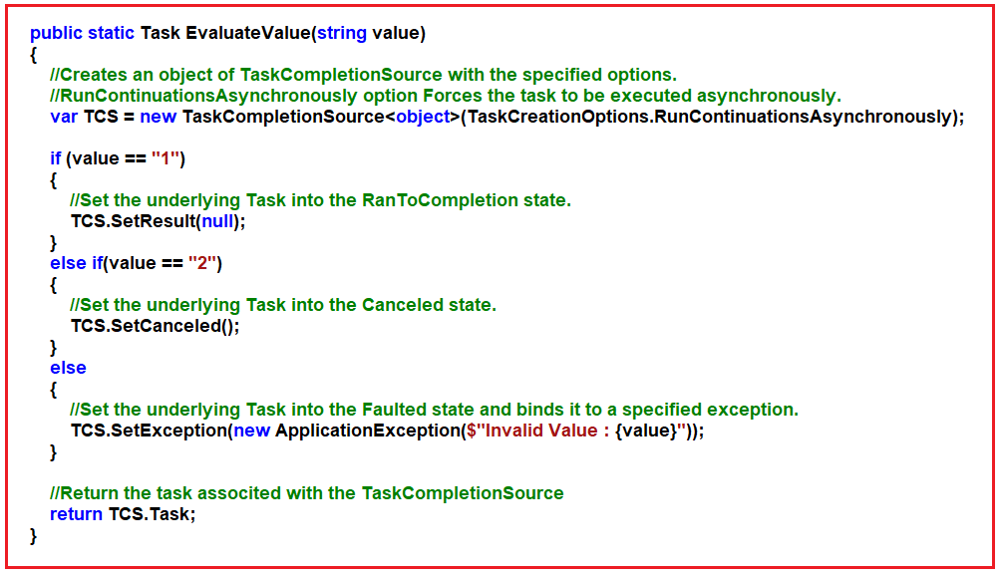
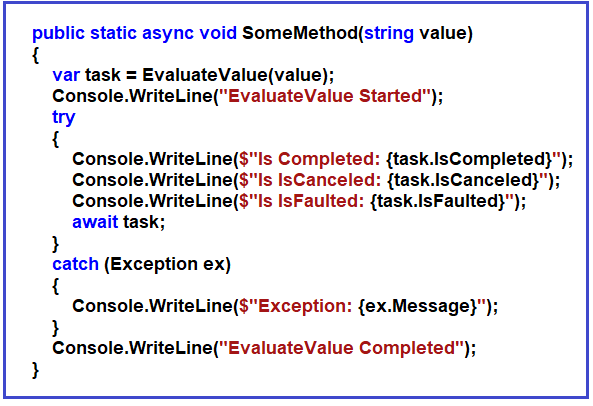
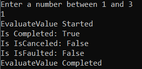
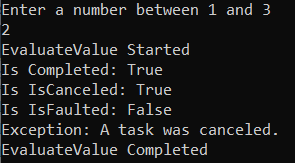
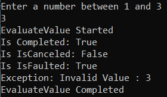
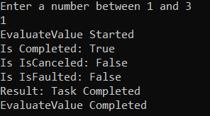

## **نحوه کنترل نتیجه یک وظیفه در سی شارپ با استفاده از TaskCompletionSource**

در این مقاله، قصد دارم در مورد **نحوه کنترل نتیجه یک وظیفه در سی شارپ با استفاده از TaskCompletionSource** به همراه مثال صحبت کنم. لطفاً مقاله قبلی ما را که در آن در مورد «فقط یک الگو در برنامه‌نویسی ناهمزمان سی‌شارپ» به همراه مثال بحث کردیم، مطالعه کنید.

##### **چگونه نتیجه یک وظیفه (task) را در سی شارپ کنترل کنیم؟**

تاکنون، ما با وظایف کار کرده‌ایم و وضعیت وظیفه به یک رویداد بستگی دارد. برای مثال، اگر یک درخواست HTTP ارسال کنیم یا یک فراخوانی متد Async انجام دهیم، وضعیت وظیفه با آنچه که با درخواست HTTP یا فراخوانی متد Async اتفاق می‌افتد، مرتبط است، چه موفقیت‌آمیز باشد، چه یک استثنا وجود داشته باشد یا عملیات با استفاده از یک توکن لغو لغو شود. با **TaskCompletionSource** ، می‌توانیم وظیفه‌ای ایجاد کنیم که ما وضعیت آن را کنترل کنیم، چه موفقیت‌آمیز باشد، چه لغو شده باشد یا یک استثنا ایجاد شده باشد.

##### **سازنده‌ها، متدها و ویژگی‌های کلاس TaskCompletionSource در سی‌شارپ:**

اگر به تعریف کلاس TaskCompletionSource در سی شارپ بروید، موارد زیر را مشاهده خواهید کرد. می‌توانید ببینید که این یک کلاس عمومی است.



##### **سازنده‌های کلاس TaskCompletionSource:**

کلاس TaskCompletionSource در سی شارپ ۴ سازنده (constructor) زیر را ارائه می‌دهد که می‌توانیم از آنها برای ایجاد یک نمونه از کلاس TaskCompletionSource استفاده کنیم.

1. **TaskCompletionSource():** این تابع یک شیء از نوع System.Threading.Tasks.TaskCompletionSource ایجاد می‌کند.
2. **TaskCompletionSource(TaskCreationOptions creationOptions):** این تابع یک TaskCompletionSource با گزینه‌های مشخص‌شده ایجاد می‌کند. در اینجا، پارامتر creationOptions گزینه‌هایی را که هنگام ایجاد Task اصلی باید استفاده شوند، مشخص می‌کند.
3. **TaskCompletionSource(object state):** این تابع یک TaskCompletionSource با وضعیت مشخص شده ایجاد می‌کند. در اینجا، پارامتر state، وضعیتی را که قرار است به عنوان AsyncState وظیفه اصلی استفاده شود، مشخص می‌کند.
4. **TaskCompletionSource(object state, TaskCreationOptions creationOptions):** این تابع یک TaskCompletionSource با حالت و گزینه‌های مشخص شده ایجاد می‌کند. در اینجا، پارامتر state، حالتی را که باید به عنوان AsyncState وظیفه اصلی استفاده شود، مشخص می‌کند و پارامتر creationOptions گزینه‌هایی را که باید هنگام ایجاد وظیفه اصلی استفاده شوند، مشخص می‌کند.

##### **ویژگی کلاس TaskCompletionSource در سی شارپ:**

کلاس TaskCompletionSource در سی شارپ، ویژگی زیر را ارائه می‌دهد.

1. **Task\<TResult> Task { get; } :** این متد، System.Threading.Tasks.Task ایجاد شده توسط TaskCompletionSource را برمی‌گرداند.

##### **متدهای کلاس TaskCompletionSource در سی شارپ:**

کلاس TaskCompletionSource در سی شارپ متدهای زیر را ارائه می‌دهد.

1. **SetCanceled():** این متد برای تنظیم Task اصلی در حالت لغو شده استفاده می‌شود.
2. **SetException(Exception exception):** این متد برای تنظیم Task اصلی در حالت Faulted State و اتصال آن به یک exception مشخص استفاده می‌شود. در اینجا، پارامتر exception، exception مربوط به اتصال به این Task را مشخص می‌کند.
3. **SetException(IEnumerable\<Exception> exceptions):** این متد برای تنظیم Task اصلی در حالت Faulted State استفاده می‌شود و مجموعه‌ای از اشیاء exception را به آن متصل می‌کند. در اینجا، پارامتر exception، مجموعه‌ای از exceptionها را برای اتصال به این Task مشخص می‌کند.
4. **SetResult(TResult result):** این متد برای تنظیم Task اصلی در حالت RanToCompletion استفاده می‌شود. در اینجا، پارامتر result مقدار نتیجه‌ای را که باید به این Task متصل شود، مشخص می‌کند.

##### **مثالی برای درک نحوه کنترل نتیجه یک وظیفه در سی شارپ؟**

بگذارید این موضوع را با یک مثال درک کنیم. بیایید متدی ایجاد کنیم که یک وظیفه را برمی‌گرداند، اما این وظیفه‌ای خواهد بود که در آن وضعیت آن را کنترل خواهیم کرد. برای درک بهتر، لطفاً به تصویر زیر نگاهی بیندازید. در اینجا، ما یک متد ایجاد کرده‌ایم که یک وظیفه را برمی‌گرداند و یک مقدار ورودی رشته‌ای دریافت می‌کند. ابتدا، با استفاده از یکی از نسخه‌های سربارگذاری شده سازنده، نمونه‌ای از **کلاس TaskCompletionSource** ایجاد کردیم . سپس با استفاده از دستورات if-else، مقدار رشته را بررسی می‌کنیم. اگر مقدار رشته ورودی ۱ باشد، **متد SetResult را** روی نمونه TaskCompletionSource فراخوانی می‌کنیم، این متد وضعیت Task (وظیفه‌ای که توسط شیء TaskCompletionSource نگهداری می‌شود) را روی RanToCompletion تنظیم می‌کند. سپس، اگر مقدار رشته ۲ باشد، **متد SetCanceled را** با ارسال یک شیء exception فراخوانی می‌کنیم **فراخوانی می‌کنیم که وضعیت Task را روی Canceled تنظیم می‌کند. اگر مقدار نه ۲ باشد و نه ۳، متد SetException** که وضعیت Task را روی Faulted تنظیم می‌کند. در نهایت، با فراخوانی ویژگی Task از کلاس TaskCompletionSource، وظیفه را برمی‌گردانیم.



در مرحله بعد، برای بررسی اینکه آیا وظیفه تکمیل شده، دچار نقص شده یا لغو شده است، از سه ویژگی زیر از کلاس Task استفاده خواهیم کرد.

1. **IsCompleted {get;}:** اگر وظیفه تکمیل شده باشد، مقدار true و در غیر این صورت مقدار false را برمی‌گرداند.
2. **IsCanceled { get; }:** اگر وظیفه به دلیل لغو شدن، تکمیل شده باشد، مقدار true و در غیر این صورت مقدار false را برمی‌گرداند.
3. **IsFaulted {get;}:** اگر وظیفه یک خطای مدیریت نشده ایجاد کرده باشد، مقدار true و در غیر این صورت مقدار false را برمی‌گرداند.

برای این منظور، متد زیر را ایجاد می‌کنیم. از طریق این متد، متد EvaluateValue را فراخوانی می‌کنیم. متد EvaluateValue یک وظیفه را که وضعیت آن را مدیریت کرده‌ایم، برمی‌گرداند. به یاد داشته باشید، اگر 2 را ارسال کنیم، یک استثنا ایجاد می‌کنیم. حتی اگر 2 را ارسال کنیم، یک استثنای استاندارد لغو وظیفه نیز ایجاد می‌شود. بنابراین، برای مدیریت این استثناها، از بلوک try-catch استفاده می‌کنیم و همچنین پیام خطا را در پنجره کنسول چاپ می‌کنیم.



###### **کد کامل مثال زیر است:**

```csharp
using System;
using System.Threading;
using System.Threading.Tasks;
using System.Linq;

namespace AsynchronousProgramming
{
    class Program
    {
        static void Main(string[] args)
        {
            Console.WriteLine("Enter a number between 1 and 3");
            string value = Console.ReadLine();
            SomeMethod(value);
            Console.ReadKey();
        }

        public static async void SomeMethod(string value)
        {
            var task = EvaluateValue(value);
            Console.WriteLine("EvaluateValue Started");
            try
            {
                Console.WriteLine($"Is Completed: {task.IsCompleted}");
                Console.WriteLine($"Is IsCanceled: {task.IsCanceled}");
                Console.WriteLine($"Is IsFaulted: {task.IsFaulted}");
                await task;
            }
            catch (Exception ex)
            {
                Console.WriteLine(ex.Message);
            }
            Console.WriteLine("EvaluateValue Completed");
        }

        public static Task EvaluateValue(string value)
        {
            //Creates an object of TaskCompletionSource with the specified options.
            //RunContinuationsAsynchronously option Forces the task to be executed asynchronously.
            var TCS = new TaskCompletionSource<object>(TaskCreationOptions.RunContinuationsAsynchronously);

            if (value == "1")
            {
                //Set the underlying Task into the RanToCompletion state.
                TCS.SetResult(null);
            }
            else if(value == "2")
            {
                //Set the underlying Task into the Canceled state.
                TCS.SetCanceled();
            }
            else
            {
                //Set the underlying Task into the Faulted state and binds it to a specified exception.
                TCS.SetException(new ApplicationException($"Invalid Value : {value}"));
            }

            //Return the task associted with the TaskCompletionSource
            return TCS.Task;
        }
    }
}
```

حالا برنامه را اجرا کنید و مقدار ۱ را وارد کنید. خروجی زیر را دریافت خواهید کرد. Is Completed با مقدار true و Is canceled با مقدار False نمایش داده می‌شود.



حالا، دوباره برنامه را اجرا کنید و مقدار را ۲ وارد کنید. خروجی زیر را دریافت خواهید کرد. Is Completed (کامل شده) و Is Canceled (لغو شده) با مقدار True (درست) و Is faulted (اشتباه شده) با مقدار False (نادرست) نمایش داده می‌شوند. از آنجایی که لغو شده است، یک خطای Task Cancelled (لغو شده وظیفه) ایجاد می‌کند که می‌توانید آن را در پیام Exception (استثنا) مشاهده کنید.



حالا، دوباره برنامه را اجرا کنید و مقدار ۳ را وارد کنید. خروجی زیر را دریافت خواهید کرد. Is Completed با مقدار True، Is Canceled با مقدار False و Is Faulted با مقدار True. همانطور که یک استثنا ایجاد می‌کنیم، می‌توانید پیام آن استثنا را نیز ارسال کنید.



بنابراین، همانطور که می‌بینید، با TaskCompletionSource، ما کنترل کاملی بر وضعیت وظیفه داریم.

##### **مثالی از TaskCompletionSource با مقدار بازگشتی**

در مثال قبلی، اگر به خاطر داشته باشید، ما در متد SetResult مقدار null را تنظیم کردیم. همچنین می‌توان مقداری را برگرداند. فرض کنید می‌خواهیم یک مقدار رشته‌ای را برگردانیم. سپس باید مقدار رشته‌ای را به متد SetResult ارسال کنیم. جدا از این، باید دو تغییر دیگر نیز انجام دهیم، اول، نوع بازگشتی متد از Task به Task\<string> تغییر می‌کند، و هنگام ایجاد نمونه اگر TaskCompletionSource باشد، به جای شیء، باید یک رشته ارسال کنیم. مثال زیر دقیقاً همین کار را انجام می‌دهد.

```csharp
using System;
using System.Threading;
using System.Threading.Tasks;
using System.Linq;

namespace AsynchronousProgramming
{
    class Program
    {
        static void Main(string[] args)
        {
            Console.WriteLine("Enter a number between 1 and 3");
            string value = Console.ReadLine();
            SomeMethod(value);
            Console.ReadKey();
        }

        public static async void SomeMethod(string value)
        {
            var task = EvaluateValue(value);
            Console.WriteLine("EvaluateValue Started");
            try
            {
                Console.WriteLine($"Is Completed: {task.IsCompleted}");
                Console.WriteLine($"Is IsCanceled: {task.IsCanceled}");
                Console.WriteLine($"Is IsFaulted: {task.IsFaulted}");
                var result = await task;
                Console.WriteLine($"Result: {result}");
            }
            catch (Exception ex)
            {
                Console.WriteLine($"Exception: {ex.Message}");
            }
            Console.WriteLine("EvaluateValue Completed");
        }

        public static Task<string> EvaluateValue(string value)
        {
            //Creates an object of TaskCompletionSource with the specified options.
            //RunContinuationsAsynchronously option Forces the task to be executed asynchronously.
            var TCS = new TaskCompletionSource<string>(TaskCreationOptions.RunContinuationsAsynchronously);

            if (value == "1")
            {
                //Set the underlying Task into the RanToCompletion state.
                TCS.SetResult("Task Completed");
            }
            else if(value == "2")
            {
                //Set the underlying Task into the Canceled state.
                TCS.SetCanceled();
            }
            else
            {
                //Set the underlying Task into the Faulted state and binds it to a specified exception.
                TCS.SetException(new ApplicationException($"Invalid Value : {value}"));
            }

            //Return the task associted with the TaskCompletionSource
            return TCS.Task;
        }
    }
}
```

کد بالا را اجرا کنید و مقدار ۱ را وارد کنید. سپس خروجی زیر را دریافت خواهید کرد. می‌توانید نتیجه را مشاهده کنید.

