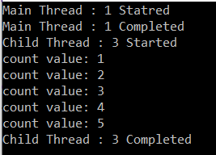
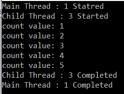

## **برنامه‌نویسی ناهمزمان مبتنی بر وظیفه در سی‌شارپ**

در این مقاله، من **برنامه‌نویسی ناهمگام مبتنی بر وظیفه در سی‌شارپ را** با مثال‌ها مورد بحث قرار خواهم داد. لطفاً مقاله قبلی ما را که در مورد نحوه کنترل نتیجه یک وظیفه در سی‌شارپ با استفاده از TaskCompletionSource با مثال‌ها بحث می‌کند، مطالعه کنید. در سی‌شارپ، وظیفه برای پیاده‌سازی برنامه‌نویسی ناهمگام، یعنی اجرای عملیات به صورت ناهمگام، استفاده می‌شود و با دات‌نت فریم‌ورک ۴.۰ معرفی شد. قبل از درک تئوری، یعنی اینکه وظیفه چیست و مزایای استفاده از آن، ابتدا اجازه دهید نحوه ایجاد و استفاده از وظیفه در سی‌شارپ را مورد بحث قرار دهیم.

##### **کار با Task در سی شارپ:**

کلاس‌های مرتبط با Task متعلق به **فضای نام System.Threading.Tasks** هستند . بنابراین، اولین و مهم‌ترین قدم برای شما، وارد کردن **فضای نام System.Threading.Tasks** در برنامه‌تان است. سپس، می‌توانید اشیاء task را با استفاده از کلاس Task ایجاد کرده و به آنها دسترسی داشته باشید.

**نکته:** به طور کلی، کلاس Task همیشه یک عملیات واحد را نشان می‌دهد و آن عملیات به جای اینکه به صورت همزمان روی نخ اصلی برنامه اجرا شود، به صورت غیرهمزمان روی یک نخ از مخزن نخ‌ها اجرا خواهد شد.

##### **مثال برای درک کلاس وظیفه و متد شروع در سی شارپ**

ما قبلاً در مورد عملگرهای async و await برای ایجاد و اجرای متدهای ناهمزمان بحث کرده‌ایم. حال، بیایید سعی کنیم نحوه پیاده‌سازی برنامه‌نویسی ناهمزمان را با استفاده از کلاس Task درک کنیم. در مثال زیر، شیء task را با استفاده از کلاس Task ایجاد می‌کنیم و سپس با فراخوانی متد Start روی شیء Task، متد را به صورت ناهمزمان اجرا می‌کنیم. متدی که توسط شیء Task به آن اشاره می‌شود، هنگام فراخوانی متد Start اجرا خواهد شد.

```csharp
using System;
using System.Threading;
using System.Threading.Tasks;

namespace TaskBasedAsynchronousProgramming
{
    class Program
    {
        static void Main(string[] args)
        {
            Console.WriteLine($"Main Thread : {Thread.CurrentThread.ManagedThreadId} Started");
            Action actionDelegate = new Action(PrintCounter);
            Task task1 = new Task(actionDelegate);
            // You can directly pass the PrintCounter method as its signature is same as Action delegate
            // Task task1 = new Task(PrintCounter);
            task1.Start();
            Console.WriteLine($"Main Thread : {Thread.CurrentThread.ManagedThreadId} Completed");
            Console.ReadKey();
        }

        static void PrintCounter()
        {
            Console.WriteLine($"Child Thread : {Thread.CurrentThread.ManagedThreadId} Started");
            for (int count = 1; count <= 5; count++)
            {
                Console.WriteLine($"count value: {count}");
            }
            Console.WriteLine($"Child Thread : {Thread.CurrentThread.ManagedThreadId} Completed");
        }
    }
}
```

در مثال بالا، ما شیء وظیفه، یعنی task1، را با استفاده از کلاس Task ایجاد کردیم و سپس متد Start را برای شروع اجرای وظیفه فراخوانی کردیم. شیء وظیفه task1 به صورت ناهمزمان روی یک thread از نوع thread pool اجرا خواهد شد. در اینجا، سازنده کلاس Task انتظار یک Action delegate را دارد. می‌توانید یک نمونه از Action delegate ایجاد کنید و آن نمونه Action delegate را به عنوان پارامتر به سازنده ارسال کنید، یا می‌توانید مستقیماً متدی را که امضای آن با Action delegate یکسان است، ارسال کنید. وقتی برنامه فوق را اجرا می‌کنید، خروجی زیر را دریافت خواهید کرد.



همانطور که در خروجی بالا مشاهده می‌کنید، از دو نخ برای اجرای کد برنامه استفاده شده است. نخ اصلی و نخ فرزند. و می‌توانید مشاهده کنید که هر دو نخ به صورت ناهمگام اجرا می‌شوند.

##### **مثالی برای درک نحوه ایجاد یک شیء Task با استفاده از Factory Property در سی شارپ**

در مثال قبلی، متد هنگام فراخوانی متد Start به صورت ناهمگام اجرا می‌شود. در مثال زیر، ما شیء task را با استفاده از ویژگی Factory ایجاد می‌کنیم که به طور خودکار شروع می‌شود، به این معنی که بلافاصله اجرای متد را شروع می‌کند. در اینجا، نیازی به فراخوانی متد Start نداریم.

در اینجا، ویژگی Factory از کلاس Task، نمونه‌ای از شیء TaskFactory را برمی‌گرداند. کلاس TaskFactory یک متد به نام StartNew دارد که به یک Action delegate به عنوان پارامتر نیاز دارد. بنابراین، می‌توانیم یک نمونه از Action delegate ایجاد کنیم و آن نمونه را به عنوان پارامتر به این متد StartNew ارسال کنیم. به عنوان یک جایگزین، می‌توانید مستقیماً متدی مطابق با امضای Action delegate ارسال کنید. برای درک بهتر، لطفاً به مثال زیر نگاهی بیندازید.

```csharp
using System;
using System.Threading;
using System.Threading.Tasks;

namespace TaskBasedAsynchronousProgramming
{
    class Program
    {
        static void Main(string[] args)
        {
            Console.WriteLine($"Main Thread : {Thread.CurrentThread.ManagedThreadId} Started");
            Task task1 = Task.Factory.StartNew(PrintCounter);
            Console.WriteLine($"Main Thread : {Thread.CurrentThread.ManagedThreadId} Completed");
            Console.ReadKey();
        }

        static void PrintCounter()
        {
            Console.WriteLine($"Child Thread : {Thread.CurrentThread.ManagedThreadId} Started");
            for (int count = 1; count <= 5; count++)
            {
                Console.WriteLine($"count value: {count}");
            }
            Console.WriteLine($"Child Thread : {Thread.CurrentThread.ManagedThreadId} Completed");
        }
    }
}
```

این همان خروجی مثال قبلی را به شما می‌دهد. تنها تفاوت بین مثال قبلی و این مثال این است که ما وظیفه را به صورت ناهمگام با استفاده از یک دستور واحد ایجاد و اجرا می‌کنیم.

##### **مثال: ایجاد یک شیء Task با استفاده از متد Run**

در مثال زیر، ما با استفاده از متد Run از کلاس Task یک وظیفه (task) ایجاد می‌کنیم.

```csharp
using System;
using System.Threading;
using System.Threading.Tasks;

namespace TaskBasedAsynchronousProgramming
{
    class Program
    {
        static void Main(string[] args)
        {
            Console.WriteLine($"Main Thread : {Thread.CurrentThread.ManagedThreadId} Started");
            Task task1 = Task.Run(() => { PrintCounter(); });
            Console.WriteLine($"Main Thread : {Thread.CurrentThread.ManagedThreadId} Completed");
            Console.ReadKey();
        }

        static void PrintCounter()
        {
            Console.WriteLine($"Child Thread : {Thread.CurrentThread.ManagedThreadId} Started");
            for (int count = 1; count <= 5; count++)
            {
                Console.WriteLine($"count value: {count}");
            }
            Console.WriteLine($"Child Thread : {Thread.CurrentThread.ManagedThreadId} Completed");
        }
    }
}
```

بنابراین، ما سه روش مختلف برای ایجاد و شروع یک وظیفه در سی شارپ را مورد بحث قرار داده‌ایم. از نقطه نظر عملکرد، **متدهای Task.Run یا Task.Factory.StartNew** برای ایجاد و شروع اجرای وظایف به صورت ناهمگام ترجیح داده می‌شوند. اما اگر می‌خواهید ایجاد و اجرای وظیفه به صورت جداگانه انجام شود، باید وظیفه را با استفاده از کلاس Task به صورت جداگانه ایجاد کنید و سپس متد Start را برای شروع اجرای وظیفه در صورت نیاز فراخوانی کنید.

##### **وظیفه با استفاده از Wait در سی شارپ:**

همانطور که قبلاً بحث کردیم، وظایف به صورت ناهمگام روی نخ استخر نخ اجرا می‌شوند و نخ، اجرای وظیفه را به صورت ناهمگام همراه با نخ اصلی برنامه آغاز می‌کند. تاکنون، در مثال‌هایی که در این مقاله بررسی کردیم، نخ فرزند اجرای خود را تا زمانی که وظیفه خود را تمام کند، حتی پس از تکمیل اجرای نخ اصلی برنامه، ادامه می‌دهد.

اگر می‌خواهید اجرای نخ اصلی تا زمان تکمیل تمام وظایف فرزند منتظر بماند، باید از متد Wait از کلاس Task استفاده کنید. متد Wait از کلاس Task، اجرای سایر نخ‌ها را تا زمانی که وظیفه اختصاص داده شده اجرای خود را تکمیل کند، مسدود می‌کند. در مثال زیر، متد Wait() را روی شیء task1 فراخوانی می‌کنیم تا اجرای برنامه تا زمان تکمیل اجرای task1 منتظر بماند.

```csharp
using System;
using System.Threading;
using System.Threading.Tasks;

namespace TaskBasedAsynchronousProgramming
{
    class Program
    {
        static void Main(string[] args)
        {
            Console.WriteLine($"Main Thread : {Thread.CurrentThread.ManagedThreadId} Started");
            Task task1 = Task.Run(() =>
            {
                PrintCounter();
            });
            task1.Wait();
            Console.WriteLine($"Main Thread : {Thread.CurrentThread.ManagedThreadId} Completed");
            Console.ReadKey();
        }

        static void PrintCounter()
        {
            Console.WriteLine($"Child Thread : {Thread.CurrentThread.ManagedThreadId} Started");
            for (int count = 1; count <= 5; count++)
            {
                Console.WriteLine($"count value: {count}");
            }
            Console.WriteLine($"Child Thread : {Thread.CurrentThread.ManagedThreadId} Completed");
        }
    }
}
```

همانطور که در کد بالا مشاهده می‌کنید، ما متد Wait() را روی شیء task، یعنی task1، فراخوانی می‌کنیم. بنابراین، اجرای thread اصلی تا زمانی که شیء task1 اجرای خود را به پایان برساند، منتظر خواهد ماند. حال برنامه را اجرا کنید و خروجی نشان داده شده در تصویر زیر را مشاهده کنید.



##### **وظیفه با استفاده از متد ناشناس و عبارت لامبدا در سی شارپ:**

در تمام مثال‌های قبلی، ما یک متد را با استفاده از Task اجرا کرده‌ایم. همچنین دیده‌ایم که سازنده کلاس Task، متد Run یا متد StartNew انتظار یک نماینده اکشن (Action delegate) را دارند. بنابراین، به جای اجرای یک متد، منطق را با استفاده از متد ناشناس (Anonymous Method) و عبارت لامبدا (Lambda Expression) نیز اجرا کرده‌ایم. برای درک بهتر، لطفاً به مثال زیر نگاهی بیندازید.

```csharp
using System;
using System.Threading;
using System.Threading.Tasks;

namespace TaskBasedAsynchronousProgramming
{
    class Program
    {
        static void Main(string[] args)
        {
            Console.WriteLine($"Main Thread : {Thread.CurrentThread.ManagedThreadId} Started");

            #region Stat Method
            // Creating Task using Method
            Task task1 = new Task(PrintCounter);
            task1.Start();

            // Creating Task using Anonymous Method
            Task task2 = new Task(delegate ()
            {
                Console.WriteLine($"Child Thread : {Thread.CurrentThread.ManagedThreadId} Started");
                Task.Delay(200);
                Console.WriteLine($"Child Thread : {Thread.CurrentThread.ManagedThreadId} Completed");
            });
            task2.Start();

            // Creating Task using Lambda Expression
            Task task3 = new Task(() =>
            {
                Console.WriteLine($"Child Thread : {Thread.CurrentThread.ManagedThreadId} Started");
                Task.Delay(200);
                Console.WriteLine($"Child Thread : {Thread.CurrentThread.ManagedThreadId} Completed");
            });
            task3.Start();
            #endregion

            #region StartNew
            // Creating Task using Method
            Task task4 = Task.Factory.StartNew(PrintCounter);

            // Creating Task using Anonymous Method
            Task task5 = Task.Factory.StartNew(delegate ()
            {
                Console.WriteLine($"Child Thread : {Thread.CurrentThread.ManagedThreadId} Started");
                Task.Delay(200);
                Console.WriteLine($"Child Thread : {Thread.CurrentThread.ManagedThreadId} Completed");
            });

            // Creating Task using Lambda Expression
            Task task6 = Task.Factory.StartNew(() =>
            {
                Console.WriteLine($"Child Thread : {Thread.CurrentThread.ManagedThreadId} Started");
                Task.Delay(200);
                Console.WriteLine($"Child Thread : {Thread.CurrentThread.ManagedThreadId} Completed");
            });

            #endregion

            #region Run
            // Creating Task using Method
            Task task7 = Task.Run(() => { PrintCounter(); });

            // Creating Task using Anonymous Method
            Task task8 = Task.Run(delegate ()
            {
                Console.WriteLine($"Child Thread : {Thread.CurrentThread.ManagedThreadId} Started");
                Task.Delay(200);
                Console.WriteLine($"Child Thread : {Thread.CurrentThread.ManagedThreadId} Completed");
            });

            // Creating Task using Lambda Expression
            Task task9 = Task.Run(() =>
            {
                Console.WriteLine($"Child Thread : {Thread.CurrentThread.ManagedThreadId} Started");
                Task.Delay(200);
                Console.WriteLine($"Child Thread : {Thread.CurrentThread.ManagedThreadId} Completed");
            });

            #endregion

            Console.WriteLine($"Main Thread : {Thread.CurrentThread.ManagedThreadId} Completed");
            Console.ReadKey();
        }

        static void PrintCounter()
        {
            Console.WriteLine($"Child Thread : {Thread.CurrentThread.ManagedThreadId} Started");
            Thread.Sleep(200);
            Console.WriteLine($"Child Thread : {Thread.CurrentThread.ManagedThreadId} Completed");
        }
    }
}
```

خب، ما در مورد نحوه کار با وظایف با استفاده از رویکردهای مختلف بحث کردیم. حالا بیایید در مورد اینکه وظیفه چیست و چرا باید از آن استفاده کنیم، صحبت کنیم.

##### **وظیفه (Task) در سی شارپ چیست؟**

یک وظیفه (task) در سی شارپ برای پیاده‌سازی برنامه‌نویسی ناهمگام مبتنی بر وظیفه (Task-based Asynchronous Programming) استفاده می‌شود و با .NET Framework 4 معرفی شد. شیء Task معمولاً به صورت ناهمگام روی یک thread از thread pool اجرا می‌شود، نه به صورت همزمان روی thread اصلی برنامه. یک زمان‌بند وظیفه (task scheduler) مسئول شروع Task و همچنین مسئول مدیریت آن است. به طور پیش‌فرض، زمان‌بند وظیفه (Task scheduler) از threadهای موجود در thread pool برای اجرای Task استفاده می‌کند.

نوع کلیدی مورد استفاده در برنامه‌نویسی ناهمگام مبتنی بر وظیفه، Task و معادل ژنریک آن Task\<T> است که در آن T نوع نتیجه است. کلاس Task در فضای نام System.Threading.Tasks قرار دارد و نشان‌دهنده یک عملیات ناهمگام است.

##### **استخر نخ (Thread Pool) در سی شارپ چیست؟**

یک مخزن نخ (thread pool) در سی شارپ، مجموعه‌ای مدیریت‌شده از نخ‌ها (threads) است که توسط زمان اجرای دات‌نت (.NET runtime) ایجاد و مدیریت می‌شود تا وظایف ناهمزمان (asynchronous tasks) و بارهای کاری موازی (parallel workloads) را به طور کارآمد اجرا کند. مخزن‌های نخ (thread pools) یک جزء اساسی از چارچوب دات‌نت (.NET Framework) هستند و برای بهبود کارایی و عملکرد برنامه‌نویسی چندنخی (multithreaded) و ناهمزمان (asynchronous) استفاده می‌شوند.

بنابراین، یک **Thread Pool در سی شارپ** مجموعه‌ای از **نخ‌ها** است که می‌توانند چندین کار را در پس‌زمینه انجام دهند. هنگامی که یک نخ وظیفه خود را انجام می‌دهد، به thread pool بازگردانده می‌شود. این قابلیت استفاده مجدد از نخ‌ها مانع از ایجاد نخ‌های زیاد توسط یک برنامه می‌شود و در نهایت از مصرف حافظه کمتری استفاده می‌کند.

##### **مزایای برنامه‌نویسی ناهمزمان مبتنی بر وظیفه در سی‌شارپ:**

در اینجا چند مزیت کلیدی استفاده از TAP (برنامه‌نویسی ناهمزمان مبتنی بر وظیفه) آورده شده است:

###### **ساختار کد ساده شده:**

- **خوانایی:** برنامه‌نویسی ناهمزمان مبتنی بر وظیفه، امکان نوشتن کد ناهمزمان مشابه با ساختار کد همزمان را فراهم می‌کند و خوانایی را بهبود می‌بخشد.
- **قابلیت نگهداری:** نگهداری کد آسان‌تر است زیرا از پیچیدگی فراخوانی‌های مجدد و مدیریت دستی نخ‌ها در مدل‌های قدیمی‌تر جلوگیری می‌کند.

###### **مقیاس‌پذیری و عملکرد بهبود یافته:**

- **استفاده کارآمد از منابع:** عملیات ناهمزمان، نخ فراخوانی (معمولاً نخ‌های رابط کاربری یا سرور) را برای انجام سایر وظایف آزاد می‌کند. این امر، به ویژه در برنامه‌های رابط کاربری یا سرویس‌های وب، استفاده از منابع و پاسخگویی را بهبود می‌بخشد.
- **مقیاس‌پذیری:** TAP می‌تواند مقیاس‌پذیری برنامه‌ها را افزایش دهد، به خصوص برنامه‌هایی که عملیات ورودی/خروجی همزمان زیادی را مدیریت می‌کنند.

###### **پشتیبانی از زبان و چارچوب:**

- **ادغام زبان:** برنامه‌نویسی ناهمزمان مبتنی بر وظیفه به طور یکپارچه با ویژگی‌های زبان C#، به ویژه کلمات کلیدی async و await، ادغام شده است و برنامه‌نویسی ناهمزمان را شهودی‌تر می‌کند.
- **سازگاری با فریم‌ورک‌ها:** این فریم‌ورک به‌طور کامل در سراسر اکوسیستم دات‌نت، از جمله نسخه‌های جدیدتر دات‌نت کور و دات‌نت ۵/۶، پشتیبانی می‌شود و سازگاری و سهولت استفاده را تضمین می‌کند.

###### **مدیریت استثنائات:**

- **مدیریت ساده‌ی استثنائات:** استثنائات در متدهای ناهمزمان را می‌توان با استفاده از بلوک‌های استاندارد try-catch دریافت و مدیریت کرد، برخلاف الگوهای قدیمی‌تر که نیاز به مدیریت پیچیده‌تری داشتند.

###### **ترکیب‌پذیری و انعطاف‌پذیری:**

- **عملیات ترکیبی:** وظایف را می‌توان به راحتی ترکیب و ترکیب کرد. به عنوان مثال، می‌توانید با استفاده از Task.WhenAll چندین وظیفه را همزمان در انتظار بگذارید، یا با استفاده از Task.WhenAny منتظر تکمیل اولین وظیفه باشید.
- **پشتیبانی از لغو:** برنامه‌نویسی ناهمزمان مبتنی بر وظیفه، با استفاده از کلاس CancellationToken از لغو پشتیبانی می‌کند و امکان لغو واکنشی عملیات ناهمزمان را فراهم می‌کند.

###### **مدل یکپارچه برای عملیات ناهمزمان:**

- **سازگاری:** TAP یک رویکرد یکپارچه برای همه عملیات ناهمزمان، چه وابسته به CPU و چه وابسته به I/O، ارائه می‌دهد و باعث ایجاد سازگاری در نحوه نوشتن و درک کد ناهمزمان در برنامه‌های مختلف می‌شود.

###### **گزارش پیشرفت:**

- **بازخورد پیشرفت:** این مدل از گزارش پیشرفت به صورت پیش‌فرض پشتیبانی می‌کند، که به ویژه در برنامه‌های رابط کاربری که در آن‌ها نیاز به به‌روزرسانی رابط کاربری برای انعکاس پیشرفت یک عملیات ناهمزمان دارید، مفید است.

##### **معایب برنامه‌نویسی ناهمزمان مبتنی بر وظیفه در سی‌شارپ:**

- **پیچیدگی در مدیریت خطا:** برنامه‌نویسی ناهمزمان می‌تواند مدیریت خطا را پیچیده‌تر کند. استثنائاتی که در متدهای ناهمزمان رخ می‌دهند، ضبط و در Task قرار می‌گیرند و باید با استفاده از await یا با بررسی شیء Task مدیریت شوند. استثنائات مشاهده نشده می‌توانند منجر به استثنائات مدیریت نشده شوند.
- **احتمال بن‌بست:** استفاده نادرست از async و await، به خصوص با Task.Result یا Task.Wait()، می‌تواند منجر به بن‌بست شود، به خصوص در برنامه‌های رابط کاربری یا هنگام مسدود کردن کد ناهمزمان.
- **مدیریت منابع:** عملیات ناهمزمان می‌تواند منجر به سناریوهای پیچیده‌تر مدیریت منابع شود. اطمینان از اینکه منابع به درستی دفع می‌شوند یا اینکه عملیات خاص از نظر thread-safe هستند، پیچیدگی کد را افزایش می‌دهد.
- **مشکلات مقیاس‌پذیری:** برنامه‌نویسی ناهمگام برای مقیاس‌پذیری عالی است؛ استفاده نادرست (مانند ایجاد وظایف زیاد یا عدم استفاده صحیح از APIهای ناهمگامِ مقید به ورودی/خروجی) می‌تواند منابع زیادی را مصرف کرده و عملکرد را کاهش دهد.
- **دشواری اشکال‌زدایی:** اشکال‌زدایی کد ناهمزمان می‌تواند دشوارتر از کد همزمان باشد. جریان اجرا خطی نیست و دنبال کردن و درک آن را دشوارتر می‌کند، به‌خصوص هنگام برخورد با چندین عملیات ناهمزمان همزمان.
- **سربار:** مقداری سربار با مدیریت وضعیت و زمینه عملیات ناهمزمان مرتبط است. برای عملیات بسیار کوچک، سربار راه‌اندازی عملیات ناهمزمان ممکن است از مزایای آن بیشتر باشد.
- **استفاده نادرست:** به راحتی می‌توان از برنامه‌نویسی ناهمزمان با اعمال آن در جایی که نیازی به آن نیست، سوءاستفاده کرد و منجر به پیچیدگی غیرضروری شد. هر عملیاتی از ناهمزمان بودن سود نمی‌برد.
