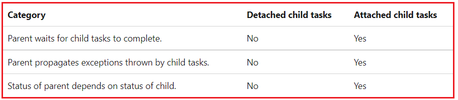
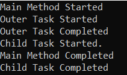
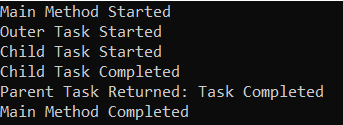
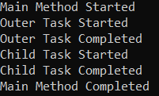
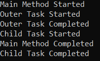
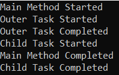
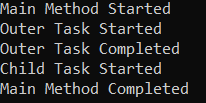
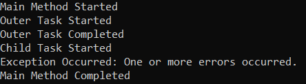

## **نحوه اتصال وظایف فرزند به وظیفه والد در سی شارپ**

در این مقاله، قصد دارم **نحوه اتصال وظایف فرزند به وظیفه والد در سی شارپ را** با مثال بررسی کنم. لطفاً مقاله قبلی ما را که در آن به بررسی وظایف زنجیره‌ای با استفاده از وظایف ادامه‌دار در سی شارپ با مثال پرداختیم، مطالعه کنید.

##### **چگونه وظایف فرزند را در سی شارپ به وظایف والد متصل کنیم؟**

یک وظیفه فرزند (یا وظیفه تو در تو) وظیفه‌ای است که قرار است توسط وظیفه دیگری به نام وظیفه والد ایجاد شود. یک وظیفه فرزند می‌تواند جدا یا متصل باشد. حال باید بفهمیم که جدا یا متصل بودن به چه معناست.

##### **وظایف فرزند جدا شده یا پیوست شده در سی شارپ چیست؟**

یک وظیفه فرزند جدا شده، وظیفه‌ای است که مستقل از والد خود اجرا می‌شود. در این حالت، والد و فرزند هر دو به طور مستقل اجرا می‌شوند و والد منتظر تکمیل اجرای وظیفه فرزند نمی‌ماند. اگر هرگونه استثنایی توسط وظیفه فرزند ایجاد شود، آن استثنا توسط وظیفه والد مدیریت نخواهد شد. و در نهایت، وضعیت وظیفه والد به وضعیت وظیفه فرزند بستگی ندارد.

ایجاد می‌شود **یک وظیفه فرزندِ متصل، یک وظیفه تودرتو است که با گزینه TaskCreationOptions.AttachedToParent** . در این حالت، وظیفه والد منتظر می‌ماند تا وظیفه فرزند اجرای خود را کامل کند. اگر هرگونه استثنایی توسط وظیفه فرزند رخ دهد، آن استثنا توسط وظیفه والد مدیریت خواهد شد. و در نهایت، وضعیت وظیفه والد به وضعیت وظیفه فرزند بستگی دارد. برای درک بهتر، لطفاً به نمودار زیر که تفاوت‌های بین وظایف فرزندِ جدا شده یا متصل را نشان می‌دهد، نگاهی بیندازید.



یک وظیفه (task) می‌تواند هر تعداد وظیفه فرزند (child task) متصل و جدا شده ایجاد کند. اگر در حال حاضر این موضوع برایتان واضح نیست، نگران نباشید، ما سعی خواهیم کرد همه چیز را با مثال‌هایی به طور مفصل توضیح دهیم.

**نکته مهم** : طبق MSDN، در بیشتر سناریوها، توصیه می‌شود از وظایف فرزند جدا شده استفاده شود، زیرا روابط آنها با سایر وظایف یا وظایف والد کمتر پیچیده است. به همین دلیل است که وظایف ایجاد شده در داخل وظایف والد به طور پیش‌فرض جدا شده هستند و اگر می‌خواهید، باید صریحاً **گزینه TaskCreationOptions.AttachedToParent** را برای ایجاد یک وظیفه فرزند پیوست شده مشخص کنید.

##### **مثالی برای درک وظایف فرزند جدا شده در سی شارپ:**

بیایید وظایف فرزند جدا شده در سی شارپ را با یک مثال درک کنیم. همانطور که قبلاً بحث کردیم، هر زمان که یک وظیفه فرزند توسط وظیفه والد ایجاد می‌شود، آن وظیفه فرزند به طور پیش‌فرض جدا می‌شود. در مثال زیر، وظیفه والد یک وظیفه فرزند ایجاد می‌کند. اگر کد مثال زیر را چندین بار اجرا کنید، ممکن است متوجه شوید که خروجی هر بار که کد برنامه را اجرا می‌کنید متفاوت خواهد بود. دلیل این امر این است که وظیفه والد و وظایف فرزند مستقل از یکدیگر اجرا می‌شوند. این مثال فقط منتظر تکمیل وظیفه والد می‌ماند و وظیفه فرزند ممکن است قبل از خاتمه برنامه کنسول اجرا نشود یا اجرای آن کامل نشود.

```csharp
using System;
using System.Threading;
using System.Threading.Tasks;

public class Program
{
    public static void Main()
    {
        Console.WriteLine("Main Method Started");

        // Creating the Parent Task
        var parentTask = Task.Factory.StartNew(() =>
        {
            Console.WriteLine("Outer Task Started");

            // Creating the Child Task
            var childTask = Task.Factory.StartNew(() =>
            {
                Console.WriteLine("Child Task Started.");
                Thread.Sleep(5000);
                Console.WriteLine("Child Task Completed");
            });

            Console.WriteLine("Outer Task Completed");
        });

        // Waiting for the Parent Task to completed. Not the Child Task
        parentTask.Wait();
        Console.WriteLine("Main Method Completed");
        Console.ReadKey();
    }
}
```

**خروجی:** همانطور که در خروجی زیر مشاهده می‌کنید، وظیفه اصلی منتظر اتمام اجرای وظیفه فرزند نیست.



##### **وظیفه والد چگونه منتظر می‌ماند تا وظیفه جدا شده اجرای خود را کامل کند؟**

اگر وظیفه فرزند **\<TResult>** به جای یک شیء Task توسط شیء Task **نمایش داده شود، می‌توانید با دسترسی به ویژگی Task\<TResult>.Result** وظیفه فرزند، حتی اگر یک وظیفه فرزند جدا شده باشد، مطمئن شوید که وظیفه والد منتظر تکمیل اجرای وظیفه فرزند خواهد ماند. دلیل این امر این است که ویژگی Result وظیفه والد را تا زمانی که وظیفه فرزند اجرای خود را تکمیل کند، مسدود می‌کند. برای درک بهتر، لطفاً به مثال زیر نگاهی بیندازید.

```csharp
using System;
using System.Threading;
using System.Threading.Tasks;

public class Program
{
    public static void Main()
    {
        Console.WriteLine("Main Method Started");

        // Creating the Parent Task
        var parentTask = Task<string>.Factory.StartNew(() =>
        {
            Console.WriteLine("Outer Task Started");

            // Creating the Child Task
            var childTask = Task<string>.Factory.StartNew(() =>
            {
                Console.WriteLine("Child Task Started");
                Thread.Sleep(5000);
                Console.WriteLine("Child Task Completed");
                return "Task Completed";
            });

            // Parent Task will wait for detached Child Task to complete its execution
            return childTask.Result;
        });

        // Here, parentTask.Result will block the Main thread, till the Parent task complete its execution
        Console.WriteLine($"Parent Task Returned: {parentTask.Result}");
        Console.WriteLine("Main Method Completed");
        Console.ReadKey();
    }
}
```

###### **خروجی:**



##### **مثالی برای درک وظایف فرزند پیوست شده در سی شارپ:**

همانطور که قبلاً بحث کردیم، وظایف فرزند پیوست‌شده با وظیفه والد، یعنی وظیفه‌ای که آن را ایجاد کرده است، از نزدیک هماهنگ می‌شوند. همچنین بحث کردیم که به طور پیش‌فرض، وظیفه فرزند جدا خواهد شد. اگر می‌خواهید یک وظیفه فرزند پیوست‌شده ایجاد کنید، باید **از گزینه TaskCreationOptions.AttachedToParent** در دستور ایجاد وظیفه استفاده کنید. برای درک بهتر، لطفاً به مثال زیر نگاهی بیندازید. در کد زیر، وظیفه فرزند پیوست‌شده قبل از والد خود تکمیل می‌شود. در نتیجه، خروجی این مثال هر بار که کد را اجرا می‌کنید، یکسان خواهد بود.

```csharp
using System;
using System.Threading;
using System.Threading.Tasks;

public class Program
{
    public static void Main()
    {
        Console.WriteLine("Main Method Started");

        // Creating the Parent Task
        var parentTask = Task.Factory.StartNew(() =>
        {
            Console.WriteLine("Outer Task Started");

            // Creating the Child Task
            var childTask = Task.Factory.StartNew(() =>
            {
                Console.WriteLine("Child Task Started");
                Thread.Sleep(5000);
                Console.WriteLine("Child Task Completed");
            }, TaskCreationOptions.AttachedToParent);

            Console.WriteLine("Outer Task Completed");
        });

        // Waiting for the Parent Task to completed.
        parentTask.Wait();
        Console.WriteLine("Main Method Completed");
        Console.ReadKey();
    }
}
```

###### **خروجی:**



##### **چگونه در سی شارپ از اتصال وظایف فرزند به وظایف والد جلوگیری کنیم؟**

نکته‌ای که باید به خاطر داشته باشید این است که یک وظیفه فرزند فقط در صورتی می‌تواند به وظیفه والد خود متصل شود که والد آن، وظایف فرزند متصل شده را ممنوع نکرده باشد. وظایف والد می‌توانند با مشخص کردن گزینه TaskCreationOptions.DenyChildAttach، صراحتاً از اتصال وظایف فرزند به خود جلوگیری کنند. اجازه دهید این موضوع را با یک مثال درک کنیم. در مثال زیر، ما وظیفه والد را با گزینه TaskCreationOptions.DenyChildAttach ایجاد کردیم و وظیفه فرزند را با گزینه TaskCreationOptions.AttachedToParent ایجاد کردیم. حتی اگر وظیفه فرزند را متصل کنیم، کار نخواهد کرد.

```csharp
using System;
using System.Threading;
using System.Threading.Tasks;

public class Program
{
    public static void Main()
    {
        Console.WriteLine("Main Method Started");

        // Creating the Parent Task with DenyChildAttach Option
        var parentTask = Task.Factory.StartNew(() =>
        {
            Console.WriteLine("Outer Task Started");

            // Creating the Child Task with AttachedToParent
            var childTask = Task.Factory.StartNew(() =>
            {
                Console.WriteLine("Child Task Started");
                Thread.Sleep(5000);
                Console.WriteLine("Child Task Completed");
            }, TaskCreationOptions.AttachedToParent);

            Console.WriteLine("Outer Task Completed");
        }, TaskCreationOptions.DenyChildAttach);

        // Waiting for the Parent Task to completed.
        parentTask.Wait();
        Console.WriteLine("Main Method Completed");
        Console.ReadKey();
    }
}
```

###### **خروجی:**



ایجاد شوند، جلوگیری می‌کنند **وظایف والد (Parent Tasks) به طور ضمنی از اتصال وظایف فرزند (child tasks) به خود در صورتی که با فراخوانی متد Task.Run** . برای درک بهتر، لطفاً به مثال زیر نگاهی بیندازید. در اینجا، ما در حال ایجاد وظیفه والد (Parent Task) با استفاده از متد Task.Run هستیم.

```csharp
using System;
using System.Threading;
using System.Threading.Tasks;

public class Program
{
    public static void Main()
    {
        Console.WriteLine("Main Method Started");

        // Creating the Parent Task using Task.Run Method
        var parentTask = Task.Run(() =>
        {
            Console.WriteLine("Outer Task Started");

            // Creating the Child Task with AttachedToParent
            var childTask = Task.Factory.StartNew(() =>
            {
                Console.WriteLine("Child Task Started");
                Thread.Sleep(5000);
                Console.WriteLine("Child Task Completed");
            }, TaskCreationOptions.AttachedToParent);

            Console.WriteLine("Outer Task Completed");
        });

        // Waiting for the Parent Task to completed.
        parentTask.Wait();
        Console.WriteLine("Main Method Completed");
        Console.ReadKey();
    }
}
```

###### **خروجی:**



##### **استثنائات در وظیفه فرزند جدا شده در سی شارپ**

اگر یک وظیفه فرزند جدا شده یک استثنا ایجاد کند، آن استثنا به وظیفه والد منتقل نمی‌شود. برای درک بهتر، لطفاً به مثال زیر نگاهی بیندازید. در اینجا، وظیفه فرزند بدون استفاده از **گزینه TaskCreationOptions.AttachedToParent** ایجاد می‌شود و درون وظیفه فرزند یک استثنا یعنی Divide By Zero Exception ایجاد می‌کنیم و خواهید دید که این استثنا توسط وظیفه والد مدیریت نخواهد شد.

```csharp
using System;
using System.Threading.Tasks;

public class Program
{
    public static void Main()
    {
        Console.WriteLine("Main Method Started");

        try
        {
            // Creating the Parent Task using Task.Run Method
            var parentTask = Task.Factory.StartNew(() =>
            {
                Console.WriteLine("Outer Task Started");

                // Creating the Child Task with AttachedToParent
                var childTask = Task.Factory.StartNew(() =>
                {
                    Console.WriteLine("Child Task Started");
                    int x = 10, y = 0;
                    int z = x / y; // It will throw an Exception
                    Console.WriteLine("Child Task Completed");
                });
                Console.WriteLine("Outer Task Completed");
            });

            // Waiting for the Parent Task to completed.
            parentTask.Wait();
        }
        catch (Exception ex)
        {
            Console.WriteLine($"Exception Occurred: {ex.Message}");
        }
        Console.WriteLine("Main Method Completed");
        Console.ReadKey();
    }
}
```

###### **خروجی:**



##### **استثنائات در وظیفه فرزند پیوست شده در سی شارپ**

اگر یک وظیفه فرزندِ متصل، یک استثنا ایجاد کند، آن استثنا به طور خودکار به وظیفه والد منتقل می‌شود و به نخی که منتظر است یا سعی می‌کند به ویژگی Task\<TResult>.Result وظیفه دسترسی پیدا کند، برمی‌گردد. بنابراین، با استفاده از وظایف فرزندِ متصل، می‌توانید همه استثناها را فقط در یک نقطه مدیریت کنید. برای درک بهتر، لطفاً به مثال زیر نگاهی بیندازید. در اینجا، وظیفه فرزند با استفاده از گزینه TaskCreationOptions.AttachedToParent ایجاد می‌شود و درون وظیفه فرزند، یک استثنا ایجاد می‌کنیم، یعنی Divide By Zero Exception و خواهید دید که این استثنا توسط وظیفه والد مدیریت خواهد شد.

```csharp
using System;
using System.Threading.Tasks;

public class Program
{
    public static void Main()
    {
        Console.WriteLine("Main Method Started");

        try
        {
            // Creating the Parent Task using Task.Run Method
            var parentTask = Task.Factory.StartNew(() =>
            {
                Console.WriteLine("Outer Task Started");

                // Creating the Child Task with AttachedToParent
                var childTask = Task.Factory.StartNew(() =>
                {
                    Console.WriteLine("Child Task Started");
                    int x = 10, y = 0;
                    int z = x / y; // It will throw an Exception
                    Console.WriteLine("Child Task Completed");
                }, TaskCreationOptions.AttachedToParent);
                Console.WriteLine("Outer Task Completed");
            });

            // Waiting for the Parent Task to completed.
            parentTask.Wait();
        }
        catch (Exception ex)
        {
            Console.WriteLine($"Exception Occurred: {ex.Message}");
        }
        Console.WriteLine("Main Method Completed");
        Console.ReadKey();
    }
}
```

###### **خروجی:**

