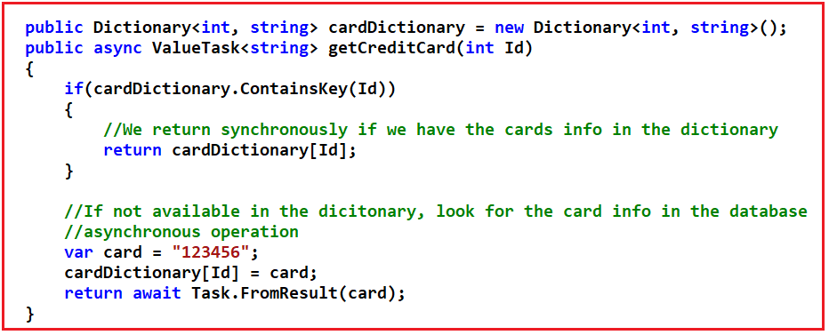
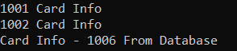

## **ValueTask در سی شارپ به همراه مثال**

در این مقاله، قصد دارم **ValueTask را در سی شارپ** با مثال بررسی کنم. لطفاً مقاله قبلی ما را که در آن نحوه اتصال وظایف فرزند به وظیفه والد در سی شارپ با مثال بررسی کردیم، مطالعه کنید.

##### **ValueTask در سی شارپ**

علاوه بر Task یا Task\<T>، مقدار دیگری که می‌توانیم از متد ناهمزمان برگردانیم، ValueTask یا ValueTask\<T> است. ValueTask یا ValueTask\<T> نسبتاً شبیه Task یا Task\<T> هستند، با برخی تفاوت‌های اساسی. ماموریت ValueTask افزایش کارایی است. ایده این است که ValueTask را در سناریوهای با تقاضای بالا که واقعاً یک مزیت قابل اندازه‌گیری وجود دارد، به کار ببریم. ValueTask یک struct است. این بدان معناست که برخلاف Task که یک نوع مرجع است، یک نوع مقداری است.

مستندات رسمی به ما می‌گوید که می‌توانیم از ValueTask یا ValueTask\<T> در دو شرط زیر استفاده کنیم.

1. **شرط ۱** : زمانی که نتیجه عملیات به احتمال زیاد به صورت همزمان در دسترس باشد.
2. **شرط ۲** : وقتی که عملیات آنقدر مکرر استفاده می‌شود که هزینه استفاده از Task یا Task\<T> قابل توجه است.

شرط اول مربوط به متدهای غیرهمزمان است که امکان اجرای همزمان را دارند. این موضوع با یک مثال بهتر قابل درک است. لطفاً به تصویر زیر نگاهی بیندازید.

در اینجا، ما کدی داریم که در آن یک دیکشنری خارج از متد داریم که به عنوان یک لایه کش عمل می‌کند، به طوری که وقتی به دنبال کارتی با شناسه خاص می‌گردیم، اگر آن کارت در دیکشنری موجود باشد، بلافاصله مقدار دیکشنری را به همراه کلید شناسه برمی‌گردانیم. حال، اگر مقدار در دیکشنری نباشد، می‌توانیم فرض کنیم که به یک پایگاه داده می‌رویم. بنابراین، باید یک عملیات ناهمزمان انجام دهیم. اطلاعات روی کارت را دریافت خواهیم کرد. آن اطلاعات را در لایه کش یا دیکشنری خود ذخیره می‌کنیم و سپس از متد خود برمی‌گردیم.



همانطور که در این متد می‌بینید، گاهی اوقات وقتی از دیکشنری برمی‌گردد، به صورت همزمان برمی‌گردد و گاهی اوقات وقتی برای اطلاعات کارت به پایگاه داده مراجعه می‌کند، به صورت غیرهمزمان برمی‌گردد. بنابراین، اگر بدانیم که این متد تقریباً همیشه به صورت همزمان برمی‌گردد، شاید باید استفاده از ValueTask را در نظر بگیریم.

شرط دیگر در مورد عملکرد به ما می‌گوید و بنابراین اندازه‌گیری آن الزامی است. برای بهبود چیزی از نظر عملکرد، ابتدا باید آن را اندازه‌گیری کنیم. سپس از داده‌ها می‌توانیم تصمیم‌گیری کنیم و پس از ایجاد تغییر، باید اندازه‌گیری دیگری انجام دهیم و ببینیم که آیا سیستم واقعاً بهبود یافته است یا خیر. این بدان معناست که مگر اینکه قبلاً اندازه‌گیری عملکرد سیستم را انجام داده باشید، نباید از ValueTask استفاده کنید. بنابراین، به طور کلی، ما باید استفاده از Task یا Task\<T> را ترجیح دهیم و تنها در صورتی که تجزیه و تحلیل عملکرد آن را توجیه کند، باید به استفاده از ValueTask یا ValueTask\<T> روی آورید.

**نکته:** لطفا **فایل DLL مربوط به System.Threading.Tasks.Extensions** را از NuGet دانلود کنید تا بتوانید با ValueTask در سی شارپ کار کنید.

##### **مثال برای درک ValueTask در سی شارپ:**

```csharp
using System;
using System.Threading.Tasks;
using System.Collections.Generic;

namespace AsynchronousProgramming
{
    class Program
    {
        public static Dictionary<int, string> cardDictionary = new Dictionary<int, string>()
        {
            { 1001, "1001 Card Info" },
            { 1002, "1002 Card Info" },
            { 1003, "1003 Card Info" },
            { 1004, "1004 Card Info" }
        };

        static void Main(string[] args)
        {
            // Synchronous Call
            var Card1001Result = getCreditCard(1001);
            Console.WriteLine(Card1001Result);

            // Synchronous Call
            var Card1002Result = getCreditCard(1002);
            Console.WriteLine(Card1002Result);

            // Asynchronous Call
            var Card1006Result = getCreditCard(1006);
            Console.WriteLine(Card1006Result);
            Console.ReadKey();
        }

        public static async ValueTask<string> getCreditCard(int Id)
        {
            if (cardDictionary.ContainsKey(Id))
            {
                // We return synchronously if we have the cards info in the dictionary
                return cardDictionary[Id];
            }

            // If not available in the dictionary, look for the card info in the database
            // asynchronous operation
            var card = $"Card Info - {Id} From Database";
            cardDictionary[Id] = card;
            return await Task.FromResult(card);
        }
    }
}
```

###### **خروجی:**



##### **محدودیت‌های ValueTask در سی‌شارپ:**

محدودیت‌هایی در مورد مصرف ValueTask وجود دارد. این محدودیت‌ها به شرح زیر هستند:

1. اولین مورد این است که آنها نمی‌توانند Cache باشند.
2. شما نمی‌توانید چندین بار منتظر آن باشید.
3. از چندین ادامه پشتیبانی نمی‌کند.
4. با تعداد دلخواهی از نخ‌ها که قادر به ثبت همزمان ادامه‌ها هستند، از نظر نخ ایمن نیست.
5. آنها از مدل مسدودسازی پشتیبانی نمی‌کنند، جایی که روش ناهمزمان می‌تواند به جای آزاد کردن نخ فعلی با استفاده از عملگر await، آن را مسدود کند.

##### **چه زمانی از ValueTask در سی شارپ استفاده کنیم؟**

توصیه می‌شود به طور کلی از Task یا Task\<T> استفاده کنید و فقط زمانی از ValueTask و ValueTask\<T> استفاده کنید که معیارهای عملکرد، آن را توجیه کنند، که ممکن است در سناریوهای با کارایی بالا چنین باشد.