## **جریان‌های ناهمزمان در سی شارپ به همراه مثال**

در این مقاله، قصد دارم **به همراه مثال‌هایی ، جریان‌های ناهمگام (Asynchronous Streams) در سی‌شارپ** را مورد بحث قرار دهم. لطفاً مقاله قبلی ما را که در آن نحوه لغو یک وظیفه غیرقابل لغو در سی‌شارپ را با مثال‌هایی مورد بحث قرار دادیم، مطالعه کنید.

##### **جریان‌های ناهمزمان در سی شارپ**

از C# 8.0 به بعد، ما محدود به بازگرداندن یک مقدار واحد از یک متد ناهمزمان نیستیم. می‌توانیم دنباله‌ای از مقادیر را که به صورت پویا تولید می‌شوند، برگردانیم. در این مقاله، ابتدا در مورد جریان‌های ناهمزمان صحبت خواهیم کرد. این مقاله را با بررسی رابط IEnumerable شروع می‌کنیم و همچنین نحوه استفاده از کلمه کلیدی yield را خواهیم دید. سپس، اولین جریان ناهمزمان خود را با استفاده از رابط IAsyncEnumerable ایجاد خواهیم کرد. و در مقاله بعدی، چندین روش برای لغو یک جریان ناهمزمان در C# را خواهیم دید.

نکته: جریان‌های ناهمگام (Asynchronous Streams) یک ویژگی جدید است که در C# 8 معرفی شده است. بنابراین، در این مقاله، من از Visual Studio 2022 استفاده می‌کنم و .NET Core 3.1 را برای نمایش دموها هدف قرار می‌دهم.

##### **رابط IEnumerable و کلمه کلیدی yield در سی شارپ:**

قبل از اینکه در مورد جریان‌های ناهمزمان صحبت کنیم، بیایید کاربرد رابط IEnumerable را به خاطر بسپاریم. رابط IEnumerable رابطی است که به ما امکان می‌دهد روی یک نوع تکرار کنیم. برای مثال، می‌توانیم روی یک لیست تکرار کنیم، زیرا آن لیست رابط IEnumerable را پیاده‌سازی می‌کند. این بدان معناست که اگر لیستی از رشته‌ها داشته باشیم، می‌توانیم آن را به روش زیر تکرار کنیم.

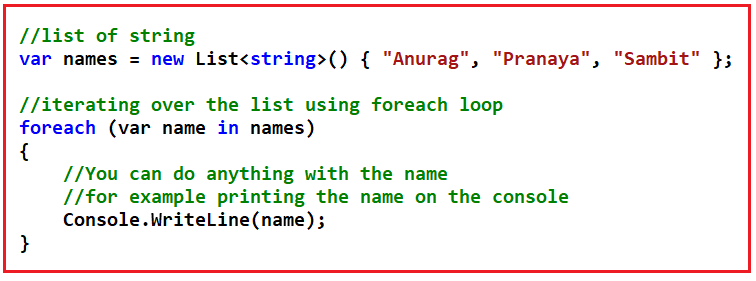

ما می‌توانیم روی یک لیست تکرار انجام دهیم. دلیل این امر این است که List\<T> رابط IEnumerable را پیاده‌سازی می‌کند. اگر روی کلاس لیست کلیک راست کرده و گزینه go to definition را انتخاب کنید، خواهید دید که کلاس List\<T> رابط IEnumerable\<T> را پیاده‌سازی می‌کند، همانطور که در تصویر زیر نشان داده شده است.

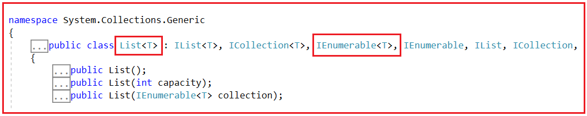

همانطور که در مثال ما می‌بینید، ما یک لیست ثابت داریم، یعنی نام‌ها (List\<string>)، که می‌توانیم روی آن تکرار کنیم. در زندگی واقعی، واقعاً همینطور است. احتمالاً متدی وجود خواهد داشت که عناصر لیست را در اختیار ما قرار می‌دهد. گاهی اوقات آن متد ممکن است لیست کامل را برگرداند یا می‌تواند یک جریان باشد. و منظور از جریان، این است که قرار است داده‌ها را در یک دوره زمانی برگرداند. بگذارید این را با یک مثال درک کنیم.

بیایید متدی ایجاد کنیم که قرار است نام‌ها را در یک دوره زمانی تولید کند. و سوال این است که چگونه می‌توانیم مقادیر مختلفی را در یک دوره زمانی در یک متد تولید کنیم؟ در اینجا، من در مورد بازگرداندن یک لیست ثابت که بسیار ساده و سرراست است صحبت نمی‌کنم. در اینجا، من در مورد تولید یک مقدار اکنون، سپس مقدار دیگری در آینده و غیره صحبت می‌کنم. خب، برای این کار می‌توانیم از کلمه کلیدی yield در C# استفاده کنیم. با yield می‌توانیم یک تکرارکننده تعریف کنیم. اساساً کاری که yield انجام می‌دهد این است که به ما امکان می‌دهد مقادیر را یکی یکی تولید کنیم. متد زیر دقیقاً همین کار را انجام می‌دهد.

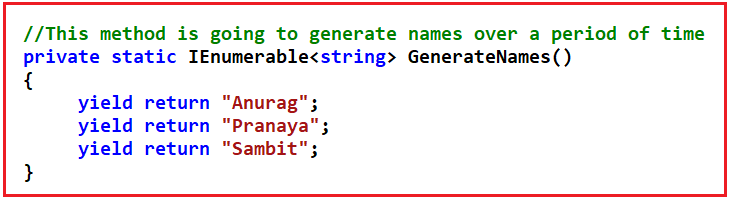

بنابراین، با این کار، ما در حال ایجاد یک جریان هستیم که در آن ابتدا مقدار Anurag و سپس بعد از آن، مقدار Pranaya و در نهایت مقدار Sambit را برمی‌گردانیم. از آنجایی که نوع بازگشتی این متد IEnumerable\<string> است، می‌توانیم نتیجه این متد GenerateNames را تکرار کنیم. برای درک بهتر، لطفاً به تصویر زیر که نتایج متد GenerateNames را تکرار می‌کند، نگاهی بیندازید.

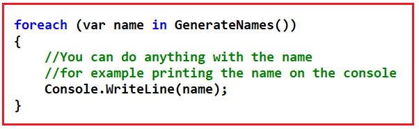

کد کامل مثال در زیر آمده است.

```csharp
using System;
using System.Collections.Generic;

namespace AsynchronousProgramming
{
    class Program
    {
        static void Main(string[] args)
        {
            ////list of string
            //var names = new List\<string>() { "Anurag", "Pranaya", "Sambit" };

            ////iterating over the list using foreach loop
            //foreach (var name in names)
            //{
            //    //You can do anything with the name
            //    //for example printing the name on the console
            //    Console.WriteLine(name);
            //}

            foreach (var name in GenerateNames())
            {
                //You can do anything with the name
                //for example printing the name on the console
                Console.WriteLine(name);
            }

            Console.ReadKey();
        }

        //This method is going to generate names over a period of time
        private static IEnumerable<string> GenerateNames()
        {
            yield return "Anurag";
            yield return "Pranaya";
            yield return "Sambit";
        }
    }
}
```

###### **خروجی:**

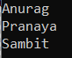

وقتی کد بالا را اجرا می‌کنید، مقادیر Anurag، Pranaya و Sambit را در پنجره کنسول مشاهده خواهید کرد. دلیل این امر این است که جریان ما این مقادیر را به ما می‌دهد.

بیایید یک آزمایش انجام دهیم. بیایید اجرای متد را به مدت ۳ ثانیه قبل از بازگرداندن آخرین مقدار از متد GenerateNames همانطور که در کد زیر نشان داده شده است، به تأخیر بیندازیم.

```csharp
using System;
using System.Collections.Generic;
using System.Threading;

namespace AsynchronousProgramming
{
    class Program
    {
        static void Main(string[] args)
        {
            foreach (var name in GenerateNames())
            {
                //You can do anything with the name
                //for example printing the name on the console
                Console.WriteLine(name);
            }

            Console.ReadKey();
        }

        //This method is going to generate names over a period of time
        private static IEnumerable<string> GenerateNames()
        {
            yield return "Anurag";
            yield return "Pranaya";
            Thread.Sleep(3000);
            yield return "Sambit";
        }
    }
}
```

**خروجی:** حالا کد بالا را اجرا کنید و خروجی را مشاهده کنید. مقادیر اول و دوم را بلافاصله دریافت خواهید کرد. اما پس از ۳ ثانیه آخرین مقدار را دریافت خواهید کرد. بنابراین، این ثابت می‌کند که جریان ما به مرور زمان مقادیر را تولید می‌کند.

##### **Yield در سی شارپ چگونه کار می‌کند؟**

حالا، بیایید بفهمیم yield چگونه کار می‌کند. لطفاً یک breakpoint روی حلقه foreach قرار دهید و برای اشکال‌زدایی متد GenerateNames باید کلید F11 را فشار دهید.

**تکرار اول:** وقتی حلقه foreach برای اولین بار اجرا می‌شود، متد GenerateNames را فراخوانی می‌کند و از اولین عبارت yield و مقداری که Anurag روی پنجره کنسول چاپ می‌کند، برمی‌گرداند.

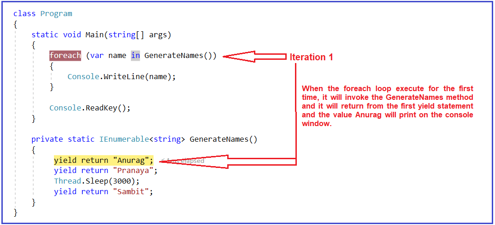

**تکرار دوم:** وقتی حلقه foreach برای بار دوم اجرا می‌شود، اولین دستور yield که قبلاً توسط تکرار قبلی اجرا شده است را اجرا نمی‌کند. بنابراین، اجرا را از جایی که باقی مانده است شروع می‌کند. بنابراین، این بار اجرا می‌شود و از دستور yield دوم مقدار را برمی‌گرداند و مقدار Pranaya در پنجره کنسول چاپ می‌شود.

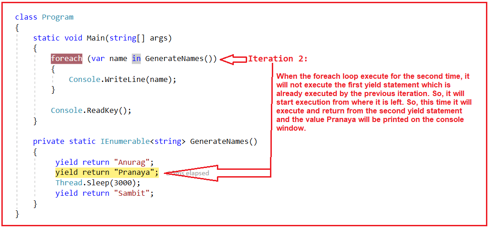

**تکرار دوم:** وقتی حلقه foreach برای بار سوم اجرا می‌شود، دستورات yield اول و دوم که قبلاً توسط تکرارهای قبلی اجرا شده‌اند را اجرا نمی‌کند. بنابراین، اجرا از جایی که باقی مانده است شروع می‌شود. بنابراین، این بار ابتدا دستور Thread.Sleep را اجرا می‌کند که اجرا را به مدت ۳ ثانیه به تأخیر می‌اندازد و سپس دستور yield سوم را اجرا می‌کند و مقدار Sambit را برمی‌گرداند که در پنجره کنسول چاپ می‌شود.

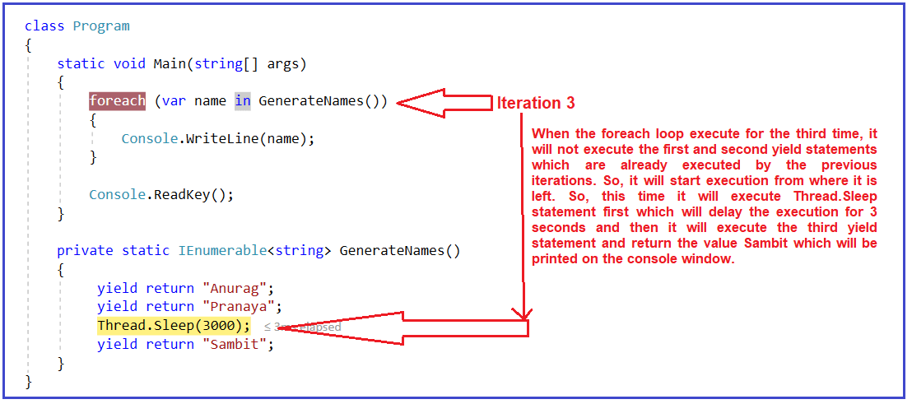

بنابراین، به این ترتیب، دستور Yield در C# کار می‌کند. در واقع، این همزمانی است. منظورم اجرای همزمان متد GenerateNames است. بنابراین، اگر بخواهم از برنامه‌نویسی ناهمزمان در اینجا استفاده کنم، چه می‌شود؟ بیایید آن را بررسی کنیم.

##### **جریان با برنامه‌نویسی ناهمزمان در سی‌شارپ:**

برای برنامه‌نویسی ناهمزمان، باید سه تغییر به شرح زیر انجام دهیم.

1. ابتدا، باید از async در امضای متد استفاده کنیم.
2. دوم، باید از Task یا Task\<T> به عنوان نوع بازگشتی استفاده کنیم.
3. سوم، درون بدنه متد، جایی که باید از عملگر await استفاده کنیم.

بیایید سه مورد بالا را در متد GenerateNames به صورت زیر انجام دهیم:

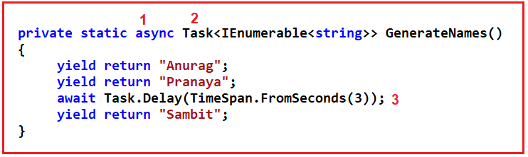

کد کامل در ادامه آمده است.

```csharp
using System;
using System.Collections.Generic;
using System.Threading;
using System.Threading.Tasks;

namespace AsynchronousProgramming
{
    class Program
    {
        static void Main(string[] args)
        {
            foreach (var name in GenerateNames())
            {
                Console.WriteLine(name);
            }

            Console.ReadKey();
        }

        private static async Task<IEnumerable<string>> GenerateNames()
        {
            yield return "Anurag";
            yield return "Pranaya";
            await Task.Delay(TimeSpan.FromSeconds(3));
            yield return "Sambit";
        }
    }
}
```

با تغییرات فوق، خواهید دید که خطاهای کامپایل زیر را دریافت خواهیم کرد.

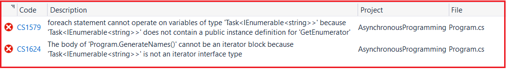

1. اولین خطای کامپایل که می‌گوید **دستور foreach نمی‌تواند روی متغیرهایی از نوع 'Task<IEnumerable\<string>>' عمل کند، زیرا 'Task<IEnumerable\<string>>' حاوی تعریف نمونه عمومی برای 'GetEnumerator' نیست** .
2. خطای کامپایل دوم می‌گوید که **بدنه‌ی 'Program.GenerateNames()' نمی‌تواند یک بلوک تکرارکننده باشد زیرا 'Task<IEnumerable\<string>>' یک نوع رابط تکرارکننده از نوع AsynchronousProgramming نیست** .

این منطقی است زیرا می‌توانیم چیزی را که رابط innumerable را پیاده‌سازی می‌کند، تکرار کنیم. اما اگر به کلاس Task بروید، خواهید دید که کلاس Task همانطور که در تصویر زیر نشان داده شده است، IEnumerable را پیاده‌سازی نمی‌کند.

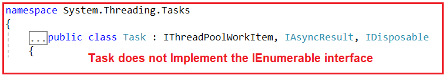

بنابراین، ما نمی‌توانیم روی یک Task تکرار انجام دهیم و به همین دلیل با خطاهای کامپایل مواجه می‌شویم. اما اگر نوعی جریان داشته باشیم که بخواهیم در آن عملیات ناهمزمان انجام دهیم، چه می‌شود؟

##### **عملیات بخار ناهمزمان در C#:**

ما می‌توانیم از steam های غیرهمزمان برای ایجاد IEnumerable که داده‌ها را به صورت غیرهمزمان تولید می‌کند، استفاده کنیم. برای این کار، می‌توانیم از رابط IAsyncEnumerable استفاده کنیم. همانطور که از نامش پیداست، IAsyncEnumerable نسخه غیرهمزمان IEnumerable است. بنابراین، به ما امکان می‌دهد تکرارهایی را انجام دهیم که در آنها عملیات غیرهمزمان هستند.

ابتدا، متد GenerateNames را همانطور که در تصویر زیر نشان داده شده است، تغییر دهید. در اینجا، به جای Task<IEnumerable\<string>>، از IAsyncEnumerable\<string> به عنوان نوع بازگشتی استفاده می‌کنیم. با این تغییر، هیچ خطای زمان کامپایل در متد GenerateNames دریافت نخواهید کرد.

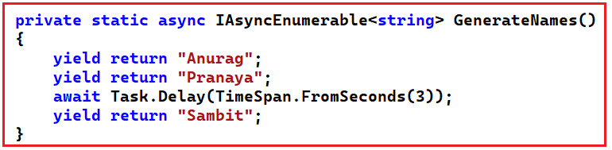

دومین تغییری که باید انجام دهیم این است که همانطور که در تصویر زیر نشان داده شده است، برای هر حلقه از await استفاده کنیم. برخی افراد با اضافه کردن عملگر await درست قبل از نام تابع دچار سردرگمی می‌شوند و این اشتباه است. ما فقط باید قبل از حلقه for each، await را اضافه کنیم.

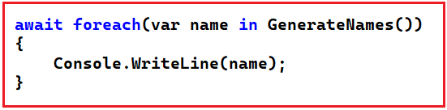

کد بالا برای هر حلقه درون متد Main ایجاد می‌شود. از آنجایی که ما از عملگر await درون متد Main استفاده می‌کنیم، باید از متد Main ناهمگام (async) استفاده کنیم. کد کامل در زیر آمده است.

```csharp
using System;
using System.Collections.Generic;
using System.Threading.Tasks;

namespace AsynchronousProgramming
{
    class Program
    {
        static async Task Main(string[] args)
        {
            await foreach (var name in GenerateNames())
            {
                Console.WriteLine(name);
            }

            Console.ReadKey();
        }

        private static async IAsyncEnumerable<string> GenerateNames()
        {
            yield return "Anurag";
            yield return "Pranaya";
            await Task.Delay(TimeSpan.FromSeconds(3));
            yield return "Sambit";
        }
    }
}
```

**خروجی:** با استفاده از IEnumerable، همان خروجی مثال قبلی را دریافت خواهید کرد.

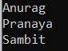

و مهمترین چیز این است که ما نخ را مسدود نمی‌کنیم، درست مانند کاری که در مثال قبلی که از Thread.Sleep انجام دادیم. در اینجا، ما از یک عملیات ناهمزمان استفاده می‌کنیم، به این معنی که هیچ نخی را مسدود نمی‌کنیم. جریان‌های ناهمزمان ممکن است زمانی مفید باشند که شما مجبور باشید اطلاعات را از یک سرویس وب که دارای صفحه‌بندی است، دریافت کنید و مجبور باشید روی صفحات مختلف سرویس وب پیمایش کنید و می‌توانید از Yield برای بازگرداندن دسته‌های مختلف اطلاعات سرویس وب استفاده کنید، فقط به این ترتیب که مجبور نیستید تمام اطلاعات را در حافظه نگه دارید، بلکه می‌توانید به محض اینکه آنها را در برنامه خود دارید، پردازش کنید.