## **نحوه لغو جریان ناهمزمان در سی شارپ با مثال**

در این مقاله، قصد دارم در مورد **نحوه لغو جریان ناهمزمان در سی شارپ** با مثال صحبت کنم. لطفاً مقاله قبلی ما را که در آن در مورد جریان‌های ناهمزمان در سی شارپ با مثال صحبت کردیم، مطالعه کنید.

##### **چگونه می‌توان جریان ناهمزمان را در سی شارپ لغو کرد؟**

در اینجا، دو روش برای لغو یک جریان ناهمزمان را بررسی خواهیم کرد. در ادامه، مثالی از جریان ناهمزمان که در مثال قبلی خود ایجاد کرده‌ایم، آمده است.

```csharp
using System;
using System.Collections.Generic;
using System.Threading.Tasks;

namespace AsynchronousProgramming
{
    class Program
    {
        static async Task Main(string[] args)
        {
            await foreach (var name in GenerateNames())
            {
                Console.WriteLine(name);
            }

            Console.ReadKey();
        }

        private static async IAsyncEnumerable<string> GenerateNames()
        {
            yield return "Anurag";
            await Task.Delay(TimeSpan.FromSeconds(3));
            yield return "Pranaya";
            await Task.Delay(TimeSpan.FromSeconds(3));
            yield return "Sambit";
            await Task.Delay(TimeSpan.FromSeconds(3));
            yield return "Rakesh";
        }
    }
}
```

وقتی کد بالا را اجرا کنید، خروجی زیر را دریافت خواهید کرد.

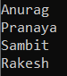

##### **لغو جریان ناهمزمان در سی شارپ با استفاده از دستور Break:**

حالا، یک شرط برای قطع جریان داریم. وقتی نام Pranaya را دریافت کردیم، باید جریان را لغو کنیم. برای انجام این کار، باید دستور break را داخل حلقه for each با دستور شرطی if اضافه کنیم، همانطور که در تصویر زیر نشان داده شده است.

```csharp
using System;
using System.Collections.Generic;
using System.Threading.Tasks;

namespace AsynchronousProgramming
{
    class Program
    {
        static async Task Main(string[] args)
        {
            await foreach (var name in GenerateNames())
            {
                Console.WriteLine(name);
                // Some condition to break the asynchronous stream
                if (name == "Pranaya")
                {
                    break;
                }
            }

            Console.ReadKey();
        }

        private static async IAsyncEnumerable<string> GenerateNames()
        {
            yield return "Anurag";
            await Task.Delay(TimeSpan.FromSeconds(3));
            yield return "Pranaya";
            await Task.Delay(TimeSpan.FromSeconds(3));
            yield return "Sambit";
            await Task.Delay(TimeSpan.FromSeconds(3));
            yield return "Rakesh";
        }
    }
}
```

وقتی کد بالا را اجرا کنید، خروجی زیر را دریافت خواهید کرد.

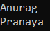

##### **لغو جریان ناهمزمان در سی شارپ با استفاده از توکن لغو:**

حالا، یک شرط دیگر برای لغو استریم ناهمزمان داریم. شرط این است که بعد از ۵ ثانیه باید استریم را لغو کنیم. برای این کار، باید از Cancellation Token استفاده کنیم. در ادامه نحوه استفاده از Cancellation Token برای لغو یک استریم ناهمزمان در سی‌شارپ نشان داده شده است. کد زیر به خودی خود توضیح داده شده است، بنابراین لطفاً خطوط کامنت را مطالعه کنید.

```csharp
using System;
using System.Collections.Generic;
using System.Threading;
using System.Threading.Tasks;

namespace AsynchronousProgramming
{
    class Program
    {
        static async Task Main(string[] args)
        {
            // Create an instance of CancellationTokenSource
            var CTS = new CancellationTokenSource();

            // Set the time when the token is going to cancel the stream
            CTS.CancelAfter(TimeSpan.FromSeconds(5));

            try
            {
                // Pass the Cancellation Token to GenerateNames method
                await foreach (var name in GenerateNames(CTS.Token))
                {
                    Console.WriteLine(name);
                }
            }
            catch (Exception ex)
            {
                Console.WriteLine(ex.Message);
            }
            finally
            {
                // Dispose the CancellationTokenSource
                CTS.Dispose();
                CTS = null;
            }

            Console.ReadKey();
        }

        // This method accepts Cancellation Token as input parameter
        // Set its value to default
        private static async IAsyncEnumerable<string> GenerateNames(CancellationToken token = default)
        {
            // Check if request comes for Token Cancellation
            // if(token.IsCancellationRequested)
            // {
            //     token.ThrowIfCancellationRequested();
            // }
            // But here we just need to pass the token to Task.Delay method
            yield return "Anurag";
            await Task.Delay(TimeSpan.FromSeconds(3), token);
            yield return "Pranaya";
            await Task.Delay(TimeSpan.FromSeconds(3), token);
            yield return "Sambit";
            await Task.Delay(TimeSpan.FromSeconds(3), token);
            yield return "Rakesh";
        }
    }
}
```

###### **خروجی:**

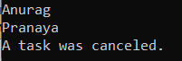

اگر می‌بینید که کامپایلر در متد GenerateNames ما پیام هشدار می‌دهد، به این دلیل است که ما از ویژگی لغو شمارشگر استفاده نمی‌کنیم. بیایید ببینیم چگونه این مشکل را برطرف کنیم.

##### **لغو از طریق IAsyncEnumerable – EnumeratorCancellation در سی شارپ:**

در مثال قبلی، دیدیم که توانستیم یک توکن لغو را به جریان ناهمزمان خود منتقل کنیم. اما یک هشدار دریافت کردیم که می‌گفت باید از یک ویژگی EnumeratorCancellation در توکن لغو خود استفاده کنیم تا بتوانیم جریان ناهمزمان را از نوع بازگشتی IAsyncEnumerable خود لغو کنیم.

این به چه معناست؟ بیایید این را با یک مثال تجسم کنیم. بیایید متدی ایجاد کنیم که نتیجه متد GeneratedNames را همانطور که در تصویر زیر نشان داده شده است، مصرف کند. در اینجا، متد ProcessNames، IAsyncEnumerable را به عنوان پارامتر می‌گیرد و از آنجایی که یک Enumerable است، می‌توانیم آن را با استفاده از حلقه for each که در کد زیر نشان داده شده است، پردازش کنیم. بنابراین، در اینجا ما جریان را با استفاده از حلقه for each پردازش می‌کنیم.

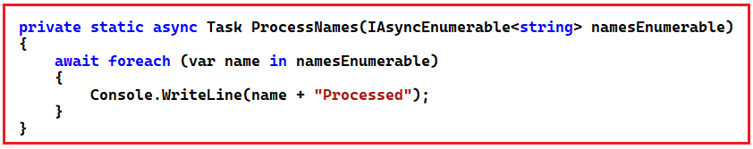

سپس از متد اصلی، می‌توانیم متد ProcessNames را همانطور که در تصویر زیر نشان داده شده است، فراخوانی کنیم. در اینجا، ابتدا متد GenerateNames را فراخوانی می‌کنیم که یک IAsyncEnumerable را برمی‌گرداند و سپس آن Enumerable را به متد ProcessNames ارسال می‌کنیم و کار خواهد کرد. در اینجا وقتی متد GenerateNames را فراخوانی می‌کنیم، یک IAsyncEnumerable دریافت می‌کنیم. این فقط نمایشی از جریان است، اما ما جریان را اینجا اجرا نمی‌کنیم. ما این جریان را وقتی که با استفاده از یک حلقه for each که در داخل متد ProcessNames انجام داده‌ایم، به مقادیر دسترسی پیدا می‌کنیم، اجرا می‌کنیم.

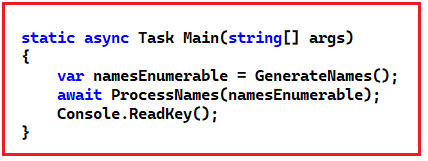

کد کامل مثال در زیر آمده است.

```csharp
using System;
using System.Collections.Generic;
using System.Threading;
using System.Threading.Tasks;

namespace AsynchronousProgramming
{
    class Program
    {
        static async Task Main(string[] args)
        {
            var namesEnumerable = GenerateNames();
            await ProcessNames(namesEnumerable);
            Console.ReadKey();
        }

        private static async Task ProcessNames(IAsyncEnumerable<string> namesEnumerable)
        {
            await foreach (var name in namesEnumerable)
            {
                Console.WriteLine($"{name} - Processed");
            }
        }

        private static async IAsyncEnumerable<string> GenerateNames(CancellationToken token = default)
        {
            yield return "Anurag";
            await Task.Delay(TimeSpan.FromSeconds(3), token);
            yield return "Pranaya";
            await Task.Delay(TimeSpan.FromSeconds(3), token);
            yield return "Sambit";
            await Task.Delay(TimeSpan.FromSeconds(3), token);
            yield return "Rakesh";
        }
    }
}
```

###### **خروجی:**

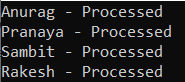

و می‌بینید که این روش جواب می‌دهد. اما فقط یک مشکل وجود دارد. و مشکل این است که ما نمی‌توانیم آن جریان ناهمزمان را لغو کنیم. چرا اینطور است؟ چون ما هرگز توکن لغو را به متد GenerateNames ارسال نکردیم و این مشکل به راحتی قابل حل است. اما اگر بخواهیم یک توکن لغو را از متد ProcessedNames ارسال کنیم چه اتفاقی می‌افتد؟ وقتی می‌خواهیم جریان ناهمزمان خود را از جایی که جریان IAsyncEnumerable را مصرف می‌کنیم لغو کنیم چه اتفاقی می‌افتد؟

برای انجام این کار، باید از متد WithCancellation از IAsyncEnumerable همانطور که در کد زیر نشان داده شده است استفاده کنیم. بنابراین، در اینجا ما یک نمونه از CancellationTokenSource ایجاد می‌کنیم و سپس فاصله زمانی که قرار است توکن لغو شود، یعنی بعد از 5 ثانیه، را تنظیم می‌کنیم. سپس توکن لغو را با استفاده از متد WithCancellation ارسال می‌کنیم.

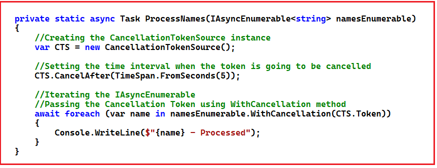

با تغییرات فوق، اگر برنامه را اجرا کنید، باز هم کار نخواهد کرد. بیایید ببینیم. کد کامل مثال تا به اینجا در زیر آمده است.

```csharp
using System;
using System.Collections.Generic;
using System.Threading;
using System.Threading.Tasks;

namespace AsynchronousProgramming
{
    class Program
    {
        static async Task Main(string[] args)
        {
            // Here we are receiving an IAsyncEnumerable.
            // This is just a representation of the stream,
            // But we are not running the stream here
            var namesEnumerable = GenerateNames();
            await ProcessNames(namesEnumerable);
            Console.ReadKey();
        }

        private static async Task ProcessNames(IAsyncEnumerable<string> namesEnumerable)
        {
            // Creating the CancellationTokenSource instance
            var CTS = new CancellationTokenSource();

            // Setting the time interval when the token is going to be cancelled
            CTS.CancelAfter(TimeSpan.FromSeconds(5));

            // Iterating the IAsyncEnumerable
            // Passing the Cancellation Token using WithCancellation method
            await foreach (var name in namesEnumerable.WithCancellation(CTS.Token))
            {
                Console.WriteLine($"{name} - Processed");
            }
        }

        private static async IAsyncEnumerable<string> GenerateNames(CancellationToken token = default)
        {
            yield return "Anurag";
            await Task.Delay(TimeSpan.FromSeconds(3), token);
            yield return "Pranaya";
            await Task.Delay(TimeSpan.FromSeconds(3), token);
            yield return "Sambit";
            await Task.Delay(TimeSpan.FromSeconds(3), token);
            yield return "Rakesh";
        }
    }
}
```

###### **خروجی:**

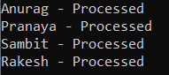

می‌بینید که استریم پس از ۵ ثانیه لغو نمی‌شود. برای لغو استریم، باید CancellationToken را با ویژگی EnumeratorCancellation درون متد GenerateNames همانطور که در تصویر زیر نشان داده شده است، تزئین کنیم. EnumeratorCancellation متعلق به فضای نام System.Runtime.CompilerServices است، بنابراین شامل آن فضای نام نیز می‌شود.

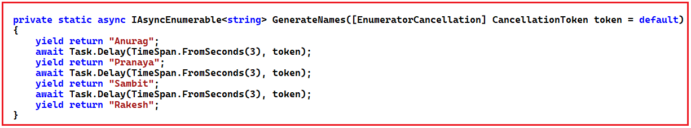

با اعمال تغییرات فوق، باید کار کند. بیایید ببینیم. کد کامل مثال در زیر آمده است.

```csharp
using System;
using System.Collections.Generic;
using System.Runtime.CompilerServices;
using System.Threading;
using System.Threading.Tasks;

namespace AsynchronousProgramming
{
    class Program
    {
        static async Task Main(string[] args)
        {
            // Here we are receiving an IAsyncEnumerable.
            // This is just a representation of the stream,
            // But we are not running the stream here
            var namesEnumerable = GenerateNames();
            await ProcessNames(namesEnumerable);
            Console.ReadKey();
        }

        private static async Task ProcessNames(IAsyncEnumerable<string> namesEnumerable)
        {
            // Creating the CancellationTokenSource instance
            var CTS = new CancellationTokenSource();

            // Setting the time interval when the token is going to be cancelled
            CTS.CancelAfter(TimeSpan.FromSeconds(5));

            // Iterating the IAsyncEnumerable
            // Passing the Cancellation Token using WithCancellation method
            await foreach (var name in namesEnumerable.WithCancellation(CTS.Token))
            {
                Console.WriteLine($"{name} - Processed");
            }
        }

        private static async IAsyncEnumerable<string> GenerateNames([EnumeratorCancellation] CancellationToken token = default)
        {
            yield return "Anurag";
            await Task.Delay(TimeSpan.FromSeconds(3), token);
            yield return "Pranaya";
            await Task.Delay(TimeSpan.FromSeconds(3), token);
            yield return "Sambit";
            await Task.Delay(TimeSpan.FromSeconds(3), token);
            yield return "Rakesh";
        }
    }
}
```

###### **خروجی:**

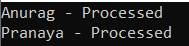

بنابراین، وقتی کد بالا را اجرا می‌کنید، پس از پردازش دو نام اول، خطای زیر را ایجاد می‌کند. دلیل این امر این است که ما خطا را مدیریت نکرده‌ایم.

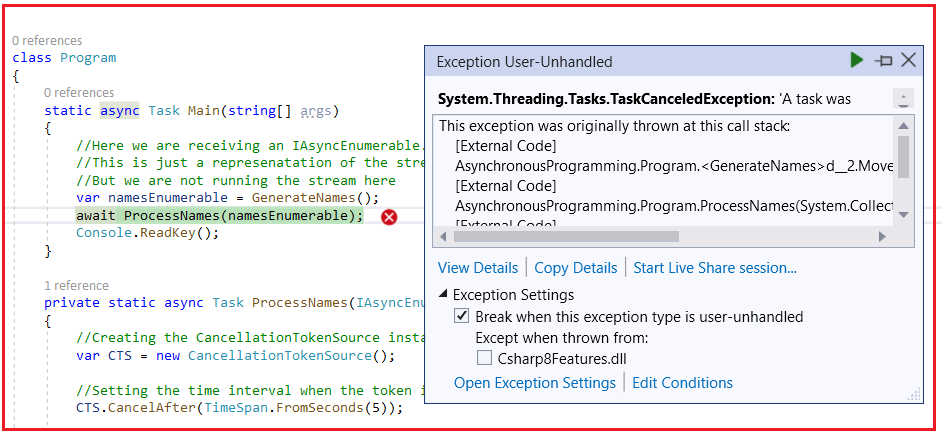

حالا، بیایید خطا را مدیریت کنیم و کد را دوباره اجرا کنیم و خروجی را مشاهده کنیم. لطفاً کد را به صورت زیر اصلاح کنید.

```csharp
using System;
using System.Collections.Generic;
using System.Runtime.CompilerServices;
using System.Threading;
using System.Threading.Tasks;

namespace AsynchronousProgramming
{
    class Program
    {
        static async Task Main(string[] args)
        {
            var namesEnumerable = GenerateNames();
            await ProcessNames(namesEnumerable);
            Console.ReadKey();
        }

        private static async Task ProcessNames(IAsyncEnumerable<string> namesEnumerable)
        {
            var CTS = new CancellationTokenSource();
            CTS.CancelAfter(TimeSpan.FromSeconds(5));

            try
            {
                await foreach (var name in namesEnumerable.WithCancellation(CTS.Token))
                {
                    Console.WriteLine($"{name} - Processed");
                }
            }
            catch(Exception ex)
            {
                Console.WriteLine(ex.Message);
            }
            finally
            {
                CTS.Dispose();
                CTS = null;
            }
        }

        private static async IAsyncEnumerable<string> GenerateNames([EnumeratorCancellation] CancellationToken token = default)
        {
            yield return "Anurag";
            await Task.Delay(TimeSpan.FromSeconds(3), token);
            yield return "Pranaya";
            await Task.Delay(TimeSpan.FromSeconds(3), token);
            yield return "Sambit";
            await Task.Delay(TimeSpan.FromSeconds(3), token);
            yield return "Rakesh";
        }
    }
}
```

###### **خروجی:**

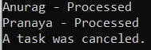

بنابراین، با استفاده از ویژگی EnumeratorCancellation می‌توانیم جریان ناهمزمان را در C# لغو کنیم.