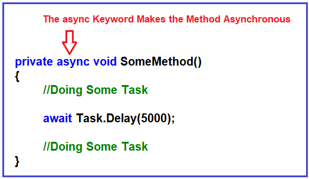
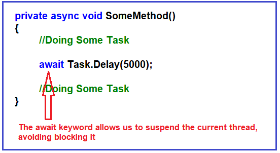
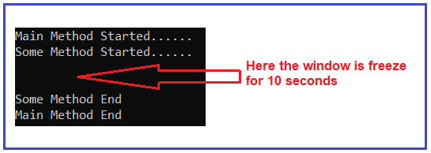
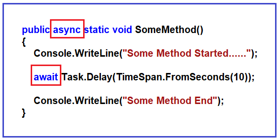
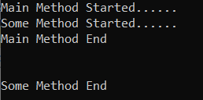

## **مثال‌هایی از Async و Await در سی‌شارپ:**

در این مقاله، قصد دارم نحوه پیاده‌سازی برنامه‌نویسی ناهمگام با استفاده از **Async و Await در سی‌شارپ** را با مثال‌هایی مورد بحث قرار دهم. لطفاً مقاله قبلی ما را که در آن مفاهیم اولیه برنامه‌نویسی ناهمگام و موازی را مورد بحث قرار دادیم، مطالعه کنید.

##### **برنامه‌نویسی ناهمزمان در سی‌شارپ:**

برنامه‌نویسی ناهمزمان به ما این امکان را می‌دهد که برنامه‌های کارآمدی داشته باشیم که در هنگام اجرای آنها منابع را هدر ندهیم. در این مقاله، قصد داریم در مورد برنامه‌نویسی ناهمزمان بحث کنیم. در اینجا، به مفاهیم و الگوهایی برای توسعه برنامه‌های ناهمزمان مؤثر خواهیم پرداخت. با بحث در مورد async، await و نحوه جلوگیری از فریز شدن رابط کاربری شروع خواهیم کرد. در مقاله بعدی، استفاده از Task را خواهیم دید که نویدبخش روشی برای اجرا است که در آینده به پایان می‌رسد. در مورد نحوه گزارش پیشرفت Task و نحوه لغو وظایف صحبت خواهیم کرد و همچنین به برخی از الگوهای برنامه‌نویسی ناهمزمان خواهیم پرداخت.

##### **کلمات کلیدی async و await در سی شارپ:**

در کد مدرن سی شارپ، برای استفاده از برنامه‌نویسی ناهمزمان، باید از کلمات کلیدی async و await استفاده کنیم. ایده این است که اگر متدی داریم که می‌خواهیم در آن از برنامه‌نویسی ناهمزمان استفاده کنیم، باید متد را با کلمه کلیدی async همانطور که در تصویر زیر نشان داده شده است، علامت‌گذاری کنیم.



برای آن دسته از عملیات ناهمزمان که نمی‌خواهیم نخ اجرایی، یعنی نخ فعلی، را مسدود کنیم، می‌توانیم از عملگر await همانطور که در تصویر زیر نشان داده شده است، استفاده کنیم.



بنابراین، وقتی از عملگر await استفاده می‌کنیم، کاری که انجام می‌دهیم این است که نخ فعلی را از انتظار برای اجرای وظیفه آزاد می‌کنیم. به این ترتیب، از مسدود شدن نخ فعلی که در حال استفاده از آن هستیم جلوگیری می‌کنیم و سپس آن نخ می‌تواند در وظیفه دیگری مورد استفاده قرار گیرد.

Async و await در هر محیط توسعه .NET مانند برنامه‌های کنسول، برنامه‌های Windows Form، ASP.NET Core برای توسعه وب، Blazor برای برنامه‌های وب تعاملی و غیره کار می‌کنند. در اینجا، ما از یک برنامه کنسول استفاده خواهیم کرد زیرا استفاده از آن واقعاً ساده است. اما هر کاری که در برنامه کنسول انجام دهیم، در هر محیط توسعه .NET مانند ASP.NET Core قابل اجرا خواهد بود.

##### **مثالی برای درک Async و Await در سی شارپ:**

لطفاً به مثال زیر نگاهی بیندازید. این یک مثال بسیار ساده است. در داخل متد اصلی، ابتدا آن متد اصلی که شروع شده است را چاپ می‌کنیم، سپس SomeMethod را فراخوانی می‌کنیم. در داخل SomeMethod، ابتدا آن SomeMethod را چاپ می‌کنیم و سپس اجرای thread به مدت 10 ثانیه sleep می‌شود. پس از 10 ثانیه، بیدار می‌شود و دستور دیگر داخل متد SomeMethod را اجرا می‌کند. سپس به متد اصلی برمی‌گردد، جایی که ما SomeMethod را فراخوانی کردیم. و در نهایت، آخرین دستور print داخل متد اصلی را اجرا می‌کند.

```csharp
using System;
using System.Threading;

namespace AsynchronousProgramming
{
    class Program
    {
        static void Main(string[] args)
        {
            Console.WriteLine("Main Method Started......");

            SomeMethod();

            Console.WriteLine("Main Method End");
            Console.ReadKey();
        }

        public static void SomeMethod()
        {
            Console.WriteLine("Some Method Started......");

            Thread.Sleep(TimeSpan.FromSeconds(10));
            Console.WriteLine("\n");
            Console.WriteLine("Some Method End");
        }
    }
}
```

وقتی کد بالا را اجرا می‌کنید، خواهید دید که پس از چاپ عبارت SomeMethod Started……، پنجره کنسول به مدت ۱۰ ثانیه متوقف می‌شود. دلیل این امر این است که در اینجا ما از برنامه‌نویسی ناهمزمان استفاده نمی‌کنیم. یک نخ، یعنی نخ اصلی، مسئول اجرای کد است و وقتی متد Thread.Sleep را فراخوانی می‌کنیم، نخ فعلی به مدت ۱۰ ثانیه مسدود می‌شود. این یک تجربه کاربری بد است.



حال، بیایید ببینیم چگونه می‌توانیم با استفاده از برنامه‌نویسی ناهمزمان بر این مشکل غلبه کنیم. لطفاً به تصویر زیر نگاهی بیندازید. متد **Thread.Sleep()** یک متد همگام است. بنابراین، ما این متد را به Task.Delay() تغییر داده‌ایم که یک متد ناهمزمان است. **متد Task.Delay()** دقیقاً همان کاری را انجام می‌دهد که Thread.Sleep() انجام می‌دهد.

و اگر بخواهیم منتظر انجام وظیفه‌ای مانند Task.Delay باشیم، باید از عملگر await استفاده کنیم. همانطور که قبلاً گفتیم، عملگر await رشته فعلی در حال اجرا را از انتظار برای این عملیات رها می‌کند. بنابراین، آن رشته برای همه وظایف ما در دسترس خواهد بود. و سپس پس از 10 ثانیه، رشته به مکانی (یعنی Task.Delay()) فراخوانی می‌شود تا بقیه کد SomeMethod اجرا شود. از آنجایی که از کلمه کلیدی await در داخل SomeMethod استفاده کرده‌ایم، باید SomeMethod را به همان اندازه که از کلمه کلیدی async استفاده می‌کنیم، ناهمزمان کنیم.



مهم است که بدانیم await به این معنی نیست که نخ باید در انتظار عملیات مسدود شود. await به این معنی است که نخ آزاد است تا برای انجام کار دیگری برود و سپس وقتی این عملیات (در مثال ما Task.Dealy یعنی بعد از 10 ثانیه) انجام شد، برگردد. کد مثال زیر دقیقاً همین کار را انجام می‌دهد.

```csharp
using System;
using System.Threading.Tasks;

namespace AsynchronousProgramming
{
    class Program
    {
        static void Main(string[] args)
        {
            Console.WriteLine("Main Method Started......");

            SomeMethod();

            Console.WriteLine("Main Method End");
            Console.ReadKey();
        }

        public async static void SomeMethod()
        {
            Console.WriteLine("Some Method Started......");

            //Thread.Sleep(TimeSpan.FromSeconds(10));
            await Task.Delay(TimeSpan.FromSeconds(10));
            Console.WriteLine("\n");
            Console.WriteLine("Some Method End");
        }
    }
}
```

###### **خروجی:**



حال اگر کد بالا را اجرا کنید، خواهید دید که پس از چاپ عبارت Some Method Started هنگام اجرای دستور Task.Dealy()، نخ فعلی را آزاد می‌کند و سپس آن نخ فعلی می‌آید و بقیه کد را درون متد اصلی اجرا می‌کند. و پس از 10 ثانیه دوباره نخ به SomeMethod برمی‌گردد و بقیه کد را درون SomeMethod اجرا می‌کند.

بنابراین، نکته اصلی این است که اگر می‌خواهید یک رابط کاربری واکنش‌گرا داشته باشید که به دلیل عملیات طولانی مدت مسدود نشود، باید از برنامه‌نویسی ناهمزمان استفاده کنید.