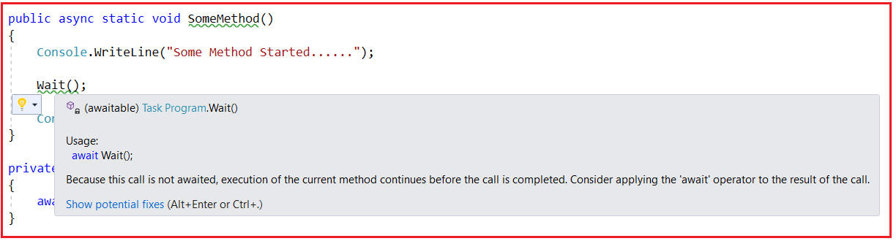
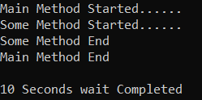
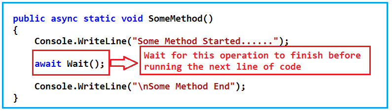
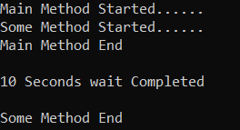
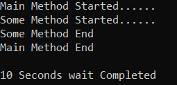

## **وظایف در سی شارپ به همراه مثال**

در این مقاله، قصد دارم در مورد **Task در سی شارپ** با مثال صحبت کنم. لطفاً مقاله قبلی ما را که در آن نحوه پیاده‌سازی برنامه‌نویسی ناهمگام با استفاده از عملگرهای Async و Await در سی شارپ با مثال بحث کردیم، مطالعه کنید.

##### **وظیفه در سی شارپ**

در سی شارپ، وقتی یک متد ناهمزمان داریم، به طور کلی، می‌خواهیم یکی از انواع داده زیر را برگردانیم.

1. **وظیفه و وظیفه\<T>**
2. **ValueTask و ValueTask\<T>**

بعداً در مورد ValueTask صحبت خواهیم کرد، حالا بیایید تمرکز خود را روی Task نگه داریم. نوع داده Task نشان دهنده یک عملیات ناهمزمان است. یک task اساساً یک "قول" است که عملیاتی که قرار است انجام شود لزوماً فوراً تکمیل نخواهد شد، اما در آینده تکمیل خواهد شد.

##### **تفاوت بین Task و Task\<T> در C# چیست؟**

اگرچه ما در سی شارپ از هر دوی آنها یعنی Task و Task\<T> برای نوع داده برگشتی یک متد ناهمزمان استفاده می‌کنیم، اما تفاوت آنها در این است که Task برای متدهایی است که مقداری را برنمی‌گردانند در حالی که Task\<T> برای متدهایی است که مقداری از نوع T را برمی‌گردانند که T می‌تواند از هر نوع داده‌ای مانند رشته، عدد صحیح، کلاس و غیره باشد. ما از اصول اولیه سی شارپ می‌دانیم که متدی که مقداری را برنمی‌گرداند با void مشخص می‌شود. این چیزی است که باید در متدهای ناهمزمان از آن اجتناب کرد. بنابراین، از async void به جز برای کنترل‌کننده‌های رویداد استفاده نکنید.

##### **مثال برای درک task در سی شارپ:**

در مثال قبلی، SomeMethod زیر را نوشته‌ایم.

```csharp
public async static void SomeMethod()
{
    Console.WriteLine("Some Method Started......");
    await Task.Delay(TimeSpan.FromSeconds(10));
    Console.WriteLine("\nSome Method End");
}
```

حالا، کاری که ما انجام خواهیم داد این است که متد Task.Delay را به یک متد جداگانه منتقل می‌کنیم و آن متد را درون SomeMethod فراخوانی می‌کنیم. بنابراین، بیایید یک متد با نام Wait به صورت زیر ایجاد کنیم. در اینجا، ما متد را به عنوان async علامت‌گذاری می‌کنیم، بنابراین یک متد ناهمزمان است که نخ در حال اجرا را مسدود نمی‌کند. و هنگام فراخوانی این متد، 10 ثانیه صبر می‌کند. و مهمتر از همه، در اینجا از نوع بازگشتی Task استفاده می‌کنیم زیرا این متد قرار نیست چیزی را برگرداند.

```csharp
private static async Task Wait()
{
    await Task.Delay(TimeSpan.FromSeconds(10));
    Console.WriteLine("\n10 Seconds wait Completed\n");
}
```

در برنامه‌نویسی ناهمزمان، وقتی متد شما چیزی را برنمی‌گرداند، به جای استفاده از void می‌توانید از Task استفاده کنید. حال، از SomeMethod باید متد Wait را فراخوانی کنیم. اگر متد Wait را مانند زیر فراخوانی کنیم، یک هشدار دریافت خواهیم کرد.

```csharp
public async static void SomeMethod()
{
    Console.WriteLine("Some Method Started......");
    Wait();
    Console.WriteLine("Some Method End");
}
```

در اینجا، می‌توانید خطوط سبز را زیر متد Wait همانطور که در تصویر زیر نشان داده شده است، مشاهده کنید.



##### **چرا اینطور است؟**

دلیل این امر این است که متد Wait یک Task را برمی‌گرداند و چون یک Task را برمی‌گرداند، به این معنی است که این یک promise خواهد بود. بنابراین، این هشدار متد Wait به ما اطلاع داد که اگر هنگام فراخوانی متد Wait از عملگر await استفاده نکنیم، متد Wait منتظر پایان این عملیات نخواهد ماند، به این معنی که به محض فراخوانی متد Wait، خط بعدی کد درون SomeMethod بلافاصله اجرا می‌شود. بیایید این را به صورت عملی بررسی کنیم. کد مثال کامل در زیر آمده است.

```csharp
using System;
using System.Threading.Tasks;

namespace AsynchronousProgramming
{
    class Program
    {
        public static void Main(string[] args)
        {
            Console.WriteLine("Main Method Started......");

            SomeMethod();

            Console.WriteLine("Main Method End");
            Console.ReadKey();
        }

        public async static void SomeMethod()
        {
            Console.WriteLine("Some Method Started......");

            Wait();

            Console.WriteLine("Some Method End");
        }

        private static async Task Wait()
        {
            await Task.Delay(TimeSpan.FromSeconds(10));
            Console.WriteLine("\n10 Seconds wait Completed\n");
        }
    }
}
```

**خروجی:** پس از اجرای کد بالا، مشاهده خواهید کرد که بدون هیچ تأخیری، خروجی مطابق تصویر زیر دریافت می‌شود. دلیل این امر این است که هنگام فراخوانی متد Wait از عملگر await استفاده نکرده‌ایم و از این رو، متد Wait منتظر تکمیل شدن نمی‌ماند. پس از 10 ثانیه، عبارت print درون متد Wait چاپ می‌شود.



در مثال بالا، ما از await Task.Delay درون متد Wait استفاده می‌کنیم. این کار نخ را فقط برای اجرای این متد Wait به حالت تعلیق در می‌آورد. این کار نخ را برای اجرای SomeMethod به حالت تعلیق در نمی‌آورد. حال، بیایید ببینیم وقتی از عملگر await همانطور که در مثال زیر نشان داده شده است استفاده می‌کنیم، چه اتفاقی می‌افتد.

```csharp
public async static void SomeMethod()
{
    Console.WriteLine("Some Method Started......");
    await Wait();
    Console.WriteLine("Some Method End");
}
```

اول از همه، به محض اینکه عملگر await را قرار دهید، همانطور که در بالا نشان داده شده است، هشدار سبز از بین خواهد رفت. با عملگر await ما می‌گوییم، لطفاً قبل از اجرای خط بعدی کد درون SomeMethod، منتظر بمانید تا اجرای این متد Wait تمام شود. این بدان معناست که تا زمانی که متد Wait اجرای خود را کامل نکند، آخرین دستور print درون SomeMethod اجرا نخواهد شد.



بنابراین، بیایید آن را بررسی کنیم. کد کامل مثال در زیر آورده شده است.

```csharp
using System;
using System.Threading.Tasks;

namespace AsynchronousProgramming
{
    class Program
    {
        public static void Main(string[] args)
        {
            Console.WriteLine("Main Method Started......");

            SomeMethod();

            Console.WriteLine("Main Method End");
            Console.ReadKey();
        }

        public async static void SomeMethod()
        {
            Console.WriteLine("Some Method Started......");
            await Wait();
            Console.WriteLine("Some Method End");
        }

        private static async Task Wait()
        {
            await Task.Delay(TimeSpan.FromSeconds(10));
            Console.WriteLine("\n10 Seconds wait Completed\n");
        }
    }
}
```

###### **خروجی:**



حال، می‌توانید در خروجی بالا مشاهده کنید که به محض فراخوانی متد Wait، متد SomeMethod منتظر تکمیل اجرای متد Wait می‌ماند. می‌توانید ببینید که قبل از چاپ آخرین دستور print از SomeMethod، دستور print متد Wait را چاپ می‌کند. از این رو، ثابت می‌شود که وقتی از عملگر await استفاده می‌کنیم، اجرای متد فعلی تا زمانی که متد async فراخوانی شده اجرای خود را تکمیل کند، منتظر می‌ماند. به محض اینکه متد async، در مثال ما متد Wait، مثال خود را تکمیل کند، متد فراخوانی کننده، در مثال ما SomeMethod، اجرای خود را ادامه می‌دهد، یعنی دستوری را که پس از فراخوانی متد async وجود دارد، اجرا می‌کند.

##### **اگر نخواهید برای یک متد ناهمزمان در سی شارپ منتظر بمانید، چه باید کرد؟**

اگر نمی‌خواهید اجرای متد شما منتظر تکمیل اجرای متد غیرهمزمان بماند، در این صورت، باید از نوع بازگشتی متد غیرهمزمان برای void استفاده کنید. برای درک بهتر، لطفاً به مثال زیر نگاهی بیندازید. در مثال زیر، ما از void به عنوان نوع بازگشتی متد غیرهمزمان Wait استفاده کرده‌ایم و هنگام فراخوانی متد غیرهمزمان Wait درون SomeMethod، از عملگر await استفاده نمی‌کنیم. این بار لطفاً توجه داشته باشید که هیچ هشداری دریافت نمی‌کنیم.

```csharp
using System;
using System.Threading.Tasks;

namespace AsynchronousProgramming
{
    class Program
    {
        public static void Main(string[] args)
        {
            Console.WriteLine("Main Method Started......");

            SomeMethod();

            Console.WriteLine("Main Method End");
            Console.ReadKey();
        }

        public async static void SomeMethod()
        {
            Console.WriteLine("Some Method Started......");

            Wait();

            Console.WriteLine("Some Method End");
        }

        private static async void Wait()
        {
            await Task.Delay(TimeSpan.FromSeconds(10));
            Console.WriteLine("\n10 Seconds wait Completed\n");
        }
    }
}
```

###### **خروجی:**



حالا می‌توانید مشاهده کنید که چهار عبارت اول بلافاصله و بدون انتظار برای متد Wait چاپ می‌شوند. بعد از 10 ثانیه، فقط آخرین عبارت در پنجره کنسول چاپ می‌شود. حال، امیدوارم متوجه شده باشید که چه زمانی از Task و چه زمانی از void به عنوان نوع بازگشتی یک متد ناهمزمان استفاده کنید. امیدوارم اهمیت عملگر await را نیز درک کرده باشید.

در اینجا، نمونه‌هایی از متد async را بدون بازگرداندن هیچ مقداری مشاهده کردیم و از این رو می‌توانیم بر اساس نیاز خود از void یا Task استفاده کنیم. اما اگر متد async مقداری را برگرداند، چه؟ اگر متد async مقداری را برگرداند، باید از Task\<T> استفاده کنیم که در مقاله بعدی به آن خواهیم پرداخت.