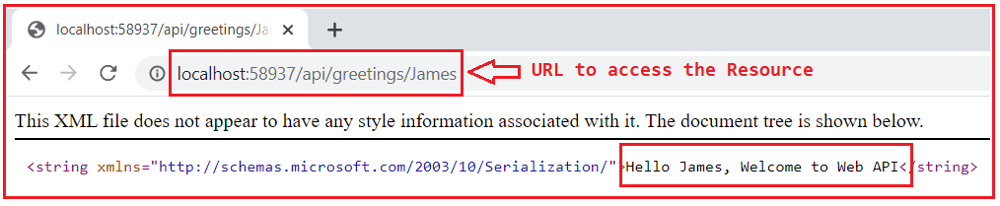
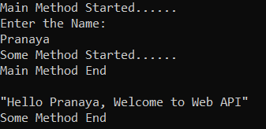
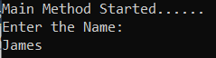
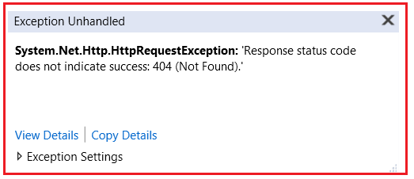
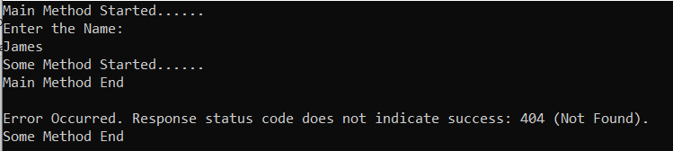
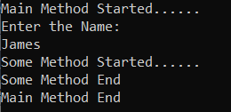
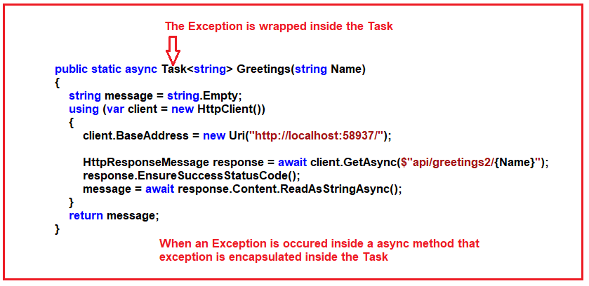
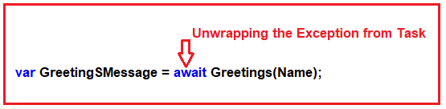
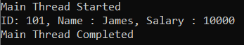

## **نحوه برگرداندن یک مقدار از Task در سی شارپ به همراه مثال**

در این مقاله، قصد دارم در مورد **نحوه برگرداندن یک مقدار از یک وظیفه در سی شارپ** با مثال صحبت کنم. لطفاً مقاله قبلی ما را که در آن در مورد وظیفه در سی شارپ با مثال صحبت کردیم، مطالعه کنید. در پایان این مقاله، نحوه برگرداندن یک مقدار از یک وظیفه در سی شارپ را با مثال خواهید فهمید.

##### **چگونه در سی شارپ یک مقدار را از یک وظیفه (task) برگردانیم؟**

چارچوب دات‌نت همچنین یک نسخه عمومی از کلاس Task یعنی Task\<T> را ارائه می‌دهد. با استفاده از این کلاس Task\<T> می‌توانیم داده‌ها یا مقادیر را از یک وظیفه برگردانیم. در Task\<T>، T نشان دهنده نوع داده‌ای است که می‌خواهید به عنوان نتیجه وظیفه برگردانید. با Task\<T>، ما یک متد ناهمزمان را داریم که قرار است در آینده چیزی را برگرداند. آن چیز می‌تواند یک رشته، یک عدد، یک کلاس و غیره باشد.

##### **مثال برای درک Task\<T> در سی شارپ:**

بگذارید این را با یک مثال درک کنیم. کاری که قرار است انجام دهیم این است که با یک Web API که قرار است بسازیم ارتباط برقرار کنیم و سعی کنیم پیامی را که از Web API دریافت می‌کنیم، بازیابی کنیم.

##### **ایجاد پروژه ASP.NET Web API**

ویژوال استودیو را باز کنید و یک پروژه جدید ASP.NET Web API ایجاد کنید. اگر در ASP.NET Web API تازه‌کار هستید، لطفاً به آموزش‌های ASP.NET Web API ما نگاهی بیندازید. در اینجا، ما یک پروژه خالی Web API با نام WebAPIDemo ایجاد می‌کنیم. پس از ایجاد پروژه Web API، یک کنترلر Web API با نام GreetingsController در پوشه Controllers اضافه کنید. پس از افزودن GreetingsController، کد زیر را در آن کپی و جایگذاری کنید.

```csharp
using System;
using System.Collections.Generic;
using System.Linq;
using System.Net;
using System.Net.Http;
using System.Web.Http;

namespace WebAPIDemo.Controllers
{
    public class GreetingsController : ApiController
    {
        //api/greetings/name
        [Route("api/greetings/{name}")]
        [HttpGet]
        public string GetGreetings(string name)
        {
            return $"Hello {name}, Welcome to Web API";
        }
    }
}
```

اکنون، برنامه Web API را اجرا کنید و می‌توانید با استفاده از آدرس **api/greetings/name** همانطور که در تصویر زیر نشان داده شده است، به منبع GetGreetings دسترسی پیدا کنید. لطفاً شماره پورت را یادداشت کنید، ممکن است در مورد شما متفاوت باشد.



پس از اجرای پروژه Web API، می‌توانید از هر مکانی به منبع فوق دسترسی داشته باشید. می‌توانید از طریق یک مرورگر وب، با استفاده از postman و fiddler و همچنین از طریق سایر برنامه‌های وب، ویندوز و کنسول به آن دسترسی داشته باشید. در مثال ما، ما قصد داریم از طریق برنامه کنسول خود به این منبع دسترسی پیدا کنیم.

ایده این است که از آنجایی که Web API خارج از برنامه کنسول ما است، بنابراین، ارتباط با Web API یک عملیات IO است، به این معنی که ما مجبور به استفاده از برنامه‌نویسی ناهمزمان خواهیم بود یا باید از آن استفاده کنیم.

##### **فراخوانی درخواست HTTP از Web API از طریق Console Application**

اکنون، ما یک درخواست HTTP به Web API (منبع خارجی) از برنامه کنسول خود ارسال خواهیم کرد. لطفاً آدرس نقطه پایانی Web API را کپی کنید. و سپس کد را به شرح زیر اصلاح کنید. شما باید شماره پورتی را که برنامه Web API شما روی آن اجرا می‌شود، جایگزین کنید. در مثال زیر، ما یک فراخوانی ناهمزمان به Web API ارسال می‌کنیم.

```csharp
using System;
using System.Net.Http;
using System.Threading.Tasks;

namespace AsynchronousProgramming
{
    class Program
    {
        public static void Main(string[] args)
        {
            Console.WriteLine("Main Method Started......");
            Console.WriteLine("Enter the Name: ");
            string Name = Console.ReadLine();

            SomeMethod(Name);

            Console.WriteLine("Main Method End");
            Console.ReadKey();
        }

        public async static void SomeMethod(string Name)
        {
            Console.WriteLine("Some Method Started......");
            var GreetingSMessage = await Greetings(Name);
            Console.WriteLine($"\n{GreetingSMessage}");
            Console.WriteLine("Some Method End");
        }

        public static async Task<string> Greetings(string Name)
        {
            string message = string.Empty;
            using (var client = new HttpClient())
            {
                client.BaseAddress = new Uri("http://localhost:58937/");

                HttpResponseMessage response = await client.GetAsync($"api/greetings/{Name}");
                message = await response.Content.ReadAsStringAsync();
            }
            return message;
        }
    }
}
```

**خروجی:** قبل از اجرای برنامه کنسول، لطفاً مطمئن شوید که برنامه وب شما در حال اجرا است. پس از اجرای برنامه Web API، برنامه کنسول را اجرا کنید. از شما خواسته می‌شود نام خود را وارد کنید. پس از وارد کردن نام، کلید enter را فشار دهید تا خروجی زیر را مشاهده کنید.



نکته‌ای که باید به خاطر داشته باشید این است که اگر در حال نوشتن هر متد غیرهمزمانی هستید، می‌توانید از Task به عنوان نوع بازگشتی استفاده کنید اگر چیزی برنمی‌گرداند یا می‌توانید از Task\<T> وقتی متد شما چیزی برمی‌گرداند استفاده کنید. در اینجا T می‌تواند هر چیزی مانند رشته، عدد صحیح، کلاس و غیره باشد.

و همچنین دیدیم که با استفاده از await، اجرای thread فعلی را به حالت تعلیق در می‌آوریم. بنابراین، thread را آزاد می‌کنیم تا بتوان از آن در سایر بخش‌های برنامه استفاده کرد. و هنگامی که پاسخی دریافت کردیم، مثلاً از Web API ما، دوباره از thread برای اجرای بقیه‌ی بخش متد استفاده خواهد شد.

##### **وظیفه C# با خطاها:**

تاکنون، هر وظیفه‌ای که اجرا کرده‌ایم با موفقیت انجام شده است. و در زندگی واقعی، ممکن است همیشه اینطور نباشد. گاهی اوقات خطاهایی رخ می‌دهد. به عنوان مثال، ممکن است در URL اشتباه کرده باشیم. در این حالت، با خطای ۴۰۴ مواجه خواهیم شد. بیایید این را با یک خطا درک کنیم. در URL، همانطور که در کد زیر نشان داده شده است، greetings را به greetings2 تغییر داده‌ام. علاوه بر این، **عبارت response.EnsureSuccessStatusCode();** را برای نمایش خطای ۴۰۴ گنجانده‌ام.

```csharp
using System;
using System.Net.Http;
using System.Threading.Tasks;

namespace AsynchronousProgramming
{
    class Program
    {
        public static void Main(string[] args)
        {
            Console.WriteLine("Main Method Started......");
            Console.WriteLine("Enter the Name: ");
            string Name = Console.ReadLine();

            SomeMethod(Name);

            Console.WriteLine("Main Method End");
            Console.ReadKey();
        }

        public async static void SomeMethod(string Name)
        {
            Console.WriteLine("Some Method Started......");
            var GreetingSMessage = await Greetings(Name);
            Console.WriteLine($"\n{GreetingSMessage}");
            Console.WriteLine("Some Method End");
        }

        public static async Task<string> Greetings(string Name)
        {
            string message = string.Empty;
            using (var client = new HttpClient())
            {
                client.BaseAddress = new Uri("http://localhost:58937/");

                HttpResponseMessage response = await client.GetAsync($"api/greetings2/{Name}");
                response.EnsureSuccessStatusCode();
                message = await response.Content.ReadAsStringAsync();
            }
            return message;
        }
    }
}
```

**خروجی:** با اعمال تغییرات فوق، اکنون برنامه را اجرا می‌کنیم، قبل از آن مطمئن شوید که برنامه Web API در حال اجرا است. نام را وارد کرده و همانطور که در تصویر زیر نشان داده شده است، دکمه enter را فشار دهید.



زمانی که نام خود را وارد کرده و دکمه‌ی enter را فشار دهید، با خطای مدیریت نشده‌ی زیر مواجه خواهید شد.



لطفاً توجه داشته باشید که در اینجا خطای 404 Not Found HttpRequestException را دریافت می‌کنیم. این یک تجربه کاربری بد است. کاربر نباید این پیام را ببیند. اگر هرگونه استثنایی رخ داده باشد، به جای نمایش جزئیات استثنا، باید یک پیام خطای عمومی نشان دهیم. بیایید ببینیم چگونه می‌توانیم این کار را انجام دهیم. در داخل SomeMethod باید از بلوک Try and Catch برای مدیریت استثنای مدیریت نشده استفاده کنیم که در مثال زیر نشان داده شده است.

```csharp
using System;
using System.Net.Http;
using System.Threading.Tasks;

namespace AsynchronousProgramming
{
    class Program
    {
        public static void Main(string[] args)
        {
            Console.WriteLine("Main Method Started......");
            Console.WriteLine("Enter the Name: ");
            string Name = Console.ReadLine();

            SomeMethod(Name);

            Console.WriteLine("Main Method End");
            Console.ReadKey();
        }

        public async static void SomeMethod(string Name)
        {
            Console.WriteLine("Some Method Started......");

            try
            {
                var GreetingSMessage = await Greetings(Name);
                Console.WriteLine($"\n{GreetingSMessage}");
            }
            catch (HttpRequestException ex)
            {
                Console.WriteLine($"\nError Occurred. {ex.Message}");
            }

            Console.WriteLine("Some Method End");
        }

        public static async Task<string> Greetings(string Name)
        {
            string message = string.Empty;
            using (var client = new HttpClient())
            {
                client.BaseAddress = new Uri("http://localhost:58937/");

                HttpResponseMessage response = await client.GetAsync($"api/greetings2/{Name}");
                response.EnsureSuccessStatusCode();
                message = await response.Content.ReadAsStringAsync();
            }
            return message;
        }
    }
}
```

###### **خروجی:**



حالا، ما آن استثنا را دریافت نمی‌کنیم، بلکه یک پیام عمومی در کنسول می‌بینیم. این با داشتن یک استثنای مدیریت نشده متفاوت است. بنابراین، در اینجا ما کاملاً کنترل می‌کنیم که اگر یک استثنا دریافت کنیم چه اتفاقی می‌افتد.

##### **اگر هنگام فراخوانی متد Greetings کلمه کلیدی await را حذف کنیم، چه اتفاقی می‌افتد؟**

نکته‌ای که باید در نظر داشته باشید این است که اگر منتظر اجرای وظیفه نباشید، استثنا به متد فراخواننده، یعنی متدی که متد async را از آن فراخوانی کرده‌ایم، ارسال نمی‌شود. در مثال ما، استثنا به SomeMethod ارسال نمی‌شود. بیایید آن را بررسی کنیم. بیایید کلمه کلیدی await و چاپ عبارت greeting را درون SomeMethod همانطور که در مثال زیر نشان داده شده است، حذف کنیم و برنامه را اجرا کنیم.

```csharp
using System;
using System.Net.Http;
using System.Threading.Tasks;

namespace AsynchronousProgramming
{
    class Program
    {
        public static void Main(string[] args)
        {
            Console.WriteLine("Main Method Started......");
            Console.WriteLine("Enter the Name: ");
            string Name = Console.ReadLine();

            SomeMethod(Name);

            Console.WriteLine("Main Method End");
            Console.ReadKey();
        }

        public async static void SomeMethod(string Name)
        {
            Console.WriteLine("Some Method Started......");

            try
            {
                var GreetingSMessage = Greetings(Name);
                //Console.WriteLine($"\n{GreetingSMessage}");
            }
            catch (HttpRequestException ex)
            {
                Console.WriteLine($"\nError Occurred. {ex.Message}");
            }

            Console.WriteLine("Some Method End");
        }

        public static async Task<string> Greetings(string Name)
        {
            string message = string.Empty;
            using (var client = new HttpClient())
            {
                client.BaseAddress = new Uri("http://localhost:58937/");

                HttpResponseMessage response = await client.GetAsync($"api/greetings2/{Name}");
                response.EnsureSuccessStatusCode();
                message = await response.Content.ReadAsStringAsync();
            }
            return message;
        }
    }
}
```

حالا، وقتی برنامه را اجرا می‌کنید، دیگر با این خطا مواجه نخواهید شد. خروجی زیر را دریافت خواهید کرد که بلوک catch را اجرا می‌کند.



##### **چرا ما استثنا را دریافت نکردیم؟**

لطفاً به تصویر زیر نگاهی بیندازید. وقتی یک استثنا (Exception) درون یک متد ناهمگام (async) رخ می‌دهد، آن استثنا درون Task کپسوله‌سازی می‌شود.



اگر می‌خواهید استثنا را از حالت فشرده خارج کنید، باید همانطور که در تصویر زیر نشان داده شده است از await استفاده کنید. اگر از await استفاده نمی‌کنید، هرگز استثنا را دریافت نخواهید کرد.



**نکته:** می‌توانیم با استفاده از یک بلوک ساده try-catch، خطاها را دریافت کنیم. اما اگر هرگز منتظر اجرای وظیفه نباشیم، حتی اگر خطایی داشته باشیم، آن خطا اجرا نخواهد شد. بنابراین، اگر می‌خواهید از خطاهایی که ممکن است داشته باشید مطلع شوید، باید منتظر اجرای وظیفه باشید.

##### **مثالی برای درک نحوه‌ی برگرداندن مقدار نوع مختلط از یک وظیفه در سی شارپ:**

در مثال زیر، ما یک نوع Complex را برمی‌گردانیم.

```csharp
using System;
using System.Threading.Tasks;

namespace TaskBasedAsynchronousProgramming
{
    class Program
    {
        static void Main(string[] args)
        {
            Console.WriteLine($"Main Thread Started");
            SomeMethod();
            Console.WriteLine($"Main Thread Completed");
            Console.ReadKey();
        }

        private async static void SomeMethod()
        {
            Employee emp = await GetEmployeeDetails();
            Console.WriteLine($"ID: {emp.ID}, Name : {emp.Name}, Salary : {emp.Salary}");
        }

        static async Task<Employee> GetEmployeeDetails()
        {
            Employee employee = new Employee()
            {
                ID = 101,
                Name = "James",
                Salary = 10000
            };

            return employee;
        }
    }

    public class Employee
    {
        public int ID { get; set; }
        public string Name { get; set; }
        public double Salary { get; set; }
    }
}
```

###### **خروجی:**

