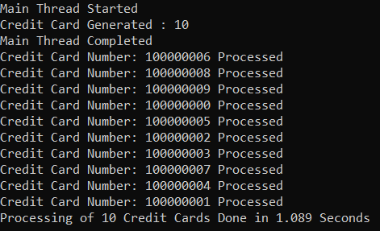
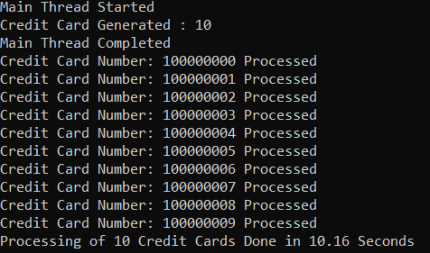
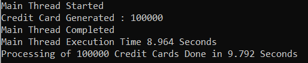
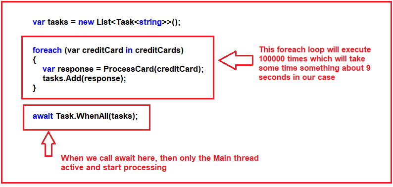
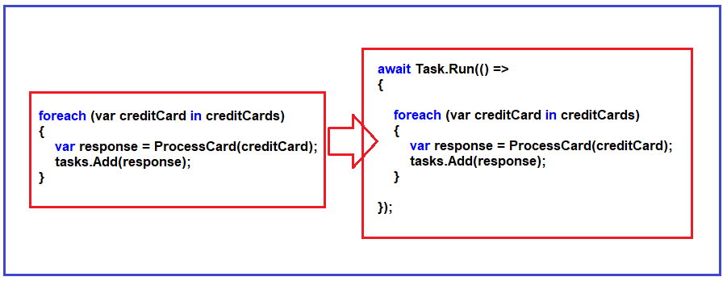

## **نحوه اجرای چندین وظیفه در سی شارپ**

با مثال بررسی خواهم کرد **در این مقاله، نحوه اجرای چندین وظیفه در سی شارپ با استفاده از متد WhenAll را** . لطفاً مقاله قبلی ما را که در مورد نحوه بازگرداندن یک مقدار از یک وظیفه در سی شارپ با مثال بحث می‌کند، مطالعه کنید.

##### **چگونه چندین کار را در سی شارپ اجرا کنیم؟**

تاکنون، ما یک وظیفه را در یک زمان اجرا می‌کردیم، اما گاهی اوقات وظایف زیادی داریم که می‌خواهیم همزمان اجرا شوند. می‌توانیم این کار را با **متد Task.WhenAll** انجام دهیم . با **متد Task.WhenAll** ، می‌توانیم لیستی از وظایف داشته باشیم و همه وظایف به صورت همزمان اجرا می‌شوند. وقتی همه وظایف تمام شدند، می‌توانیم اجرای یک متد را ادامه دهیم.

##### **مثال برای درک متد Task.WhenAll:**

بیایید نحوه اجرای همزمان چندین کار را با استفاده از متد Task.WhenAll در سی شارپ بررسی کنیم. مثالی خواهیم زد که در آن می‌خواهیم چندین کارت اعتباری را پردازش کنیم.

ما قصد داریم در مثال خود از کلاس CreditCard زیر استفاده کنیم. کلاس CreditCard زیر دارای دو ویژگی به نام‌های CardNumber و Name و یک متد استاتیک به نام GenerateCreditCards است که مجموعه‌ای از CreditCardها را تولید می‌کند. متد GenerateCreditCards یک عدد صحیح را به عنوان پارامتر می‌گیرد و سپس مجموعه‌ای از آن تعداد کارت اعتباری ایجاد می‌کند و آن مجموعه را برمی‌گرداند.

```csharp
public class CreditCard
{
    public string CardNumber { get; set; }
    public string Name { get; set; }

    public static List<CreditCard> GenerateCreditCards(int number)
    {
        List<CreditCard> creditCards = new List<CreditCard>();
        for (int i = 0; i < number; i++)
        {
            CreditCard card = new CreditCard()
            {
                CardNumber = "10000000" + i,
                Name = "CreditCard-" + i
            };

            creditCards.Add(card);
        }

        return creditCards;
    }
}
```

در مرحله بعد، باید یک متد غیرهمزمان برای پردازش کارت‌های اعتباری ایجاد کنیم. برای این کار، متد غیرهمزمان ProcessCard زیر را ایجاد می‌کنیم. این متد CreditCard را به عنوان پارامتر ورودی دریافت می‌کند و آن کارت اعتباری را پردازش می‌کند. در اینجا، می‌توانید هر فراخوانی API را برای پردازش کارت اعتباری انجام دهید. اما برای سادگی، ما فقط با استفاده از متد غیرهمزمان Task.Delay، اجرا را به مدت ۱ ثانیه به تأخیر می‌اندازیم و سپس پیامی مبنی بر پردازش اعتبار چاپ می‌کنیم و رشته‌ای حاوی اطلاعات کارت اعتباری پردازش شده را برای استفاده‌های بعدی در صورت نیاز برمی‌گردانیم.

```csharp
public static async Task<string> ProcessCard(CreditCard creditCard)
{
    await Task.Delay(1000);
    string message = $"Credit Card Number: {creditCard.CardNumber} Name: {creditCard.Name} Processed";
    Console.WriteLine($"Credit Card Number: {creditCard.CardNumber} Processed");
    return message;
}
```

زیر را ایجاد می‌کنیم **در مرحله بعد، ما یک متد غیرهمزمان دیگر برای اجرای همزمان چندین وظیفه ایجاد می‌کنیم. برای این منظور، متد غیرهمزمان ProcessCreditCards** . این متد مجموعه‌ای از کارت‌هایی را که می‌خواهیم پردازش شوند، دریافت می‌کند. سپس، حلقه ForEach با فراخوانی متد غیرهمزمان ProcessCard، کارت‌ها را به صورت جداگانه پردازش می‌کند. هنگام فراخوانی متد غیرهمزمان ProcessCard، از عملگر await استفاده نمی‌کنیم. نوع بازگشتی ProcessCard، Task\<string> است. بنابراین در اینجا، من یک مجموعه از نوع Task\<string>، یعنی List<Task\<string>> tasks **،** ایجاد کرده‌ام تا پاسخ دریافتی از متد ProcessCard را ذخیره کنم. در مرحله بعد، متد Task.WhenAll را با ارسال آن مجموعه Task\<string> فراخوانی می‌کنیم. برای بررسی زمان، در اینجا از یک کرونومتر استفاده می‌کنیم که زمان لازم برای پردازش تمام کارت‌های اعتباری توسط متد WhenAll را نشان می‌دهد.

```csharp
public static async void ProcessCreditCards(List<CreditCard> creditCards)
{
    var stopwatch = new Stopwatch();
    stopwatch.Start();

    var tasks = new List<Task<string>>();

    foreach (var creditCard in creditCards)
    {
        var response = ProcessCard(creditCard);
        tasks.Add(response);
    }

    // It will execute all the tasks concurrently
    await Task.WhenAll(tasks);
    stopwatch.Stop();
    Console.WriteLine($"Processing of {creditCards.Count} Credit Cards Done in {stopwatch.ElapsedMilliseconds / 1000.0} Seconds");
}
```

###### **لطفا به عبارت زیر توجه کنید:**

1. **await Task.WhenAll(tasks):** این دستور می‌گوید که لیستی از وظایف وجود دارد. لطفاً قبل از ادامه اجرای این متد، منتظر بمانید تا همه وظایف انجام شوند و همه وظایف به طور همزمان اجرا خواهند شد. از آنجایی که وظایف شامل 10 ورودی هستند، همه این 10 وظیفه باید به طور همزمان اجرا شوند.

سپس، متد Main را به صورت زیر تغییر دهید. از متد main، متد استاتیک GenerateCreditCards از کلاس CreditCard را با ارسال یک عدد صحیح، یعنی 10، به عنوان آرگومان، فراخوانی می‌کنیم. این متد GenerateCreditCards مجموعه‌ای از 10 کارت اعتباری را برمی‌گرداند. و سپس، با ارسال آن مجموعه کارت اعتباری به عنوان آرگومان، ProcessCreditCards را فراخوانی می‌کنیم.

```csharp
static void Main(string[] args)
{
    Console.WriteLine($"Main Thread Started");

    List<CreditCard> creditCards = CreditCard.GenerateCreditCards(10);
    Console.WriteLine($"Credit Card Generated : {creditCards.Count}");

    ProcessCreditCards(creditCards);

    Console.WriteLine($"Main Thread Completed");
    Console.ReadKey();
}
```

##### **کد مثال کامل:**

هر آنچه که تا الان مورد بحث قرار دادیم، همه چیز در مثال زیر آمده است.

```csharp
using System;
using System.Collections.Generic;
using System.Diagnostics;
using System.Threading.Tasks;

namespace AsynchronousProgramming
{
    class Program
    {
        static void Main(string[] args)
        {
            Console.WriteLine($"Main Thread Started");

            List<CreditCard> creditCards = CreditCard.GenerateCreditCards(10);
            Console.WriteLine($"Credit Card Generated : {creditCards.Count}");

            ProcessCreditCards(creditCards);

            Console.WriteLine($"Main Thread Completed");
            Console.ReadKey();
        }

        public static async void ProcessCreditCards(List<CreditCard> creditCards)
        {
            var stopwatch = new Stopwatch();
            stopwatch.Start();

            var tasks = new List<Task<string>>();

            // Processing the creditCards using foreach loop
            foreach (var creditCard in creditCards)
            {
                var response = ProcessCard(creditCard);
                tasks.Add(response);
            }

            // It will execute all the tasks concurrently
            await Task.WhenAll(tasks);
            stopwatch.Stop();
            Console.WriteLine($"Processing of {creditCards.Count} Credit Cards Done in {stopwatch.ElapsedMilliseconds / 1000.0} Seconds");
        }

        public static async Task<string> ProcessCard(CreditCard creditCard)
        {
            // Here we can do any API Call to Process the Credit Card
            // But for simplicity we are just delaying the execution for 1 second
            await Task.Delay(1000);
            string message = $"Credit Card Number: {creditCard.CardNumber} Name: {creditCard.Name} Processed";
            Console.WriteLine($"Credit Card Number: {creditCard.CardNumber} Processed");
            return message;
        }
    }

    public class CreditCard
    {
        public string CardNumber { get; set; }
        public string Name { get; set; }

        public static List<CreditCard> GenerateCreditCards(int number)
        {
            List<CreditCard> creditCards = new List<CreditCard>();
            for (int i = 0; i < number; i++)
            {
                CreditCard card = new CreditCard()
                {
                    CardNumber = "10000000" + i,
                    Name = "CreditCard-" + i
                };

                creditCards.Add(card);
            }

            return creditCards;
        }
    }
}
```

###### **خروجی:**



می‌توانید ببینید که پردازش همه کارت‌های اعتباری کمی بیشتر از ۱ ثانیه طول می‌کشد. یک نکته دیگر: وقتی چندین کار را به طور همزمان اجرا می‌کنیم، هرگز نمی‌توانید ترتیب اجرا را پیش‌بینی کنید. حالا، بیایید خروجی را مشاهده کنیم. اگر به یاد داشته باشید، در متد ProcessCard، اجرا را به مدت یک ثانیه به تأخیر انداختیم. اما پس از آن، همانطور که چندین کار را با استفاده از متد Task.WhenAll اجرا می‌کنیم، اجرای همه وظایف در کمی بیشتر از ۱ ثانیه تکمیل می‌شود. این به دلیل متد Task.WhenAll است که همه وظایف را به طور همزمان اجرا می‌کند و عملکرد برنامه ما را به طرز چشمگیری بهبود می‌بخشد.

##### **اجرا بدون متد Task.WhenAll در سی شارپ:**

حال، بیایید همان برنامه را بدون استفاده از Task.WhenAll اجرا کنیم و مشاهده کنیم که پردازش 10 کارت اعتباری چقدر طول می‌کشد. لطفاً متد ProcessCreditCards را به صورت زیر اصلاح کنید. در اینجا، متد Task.WhenAll و کد مربوط به آن را حذف می‌کنیم. در اینجا، ما از عملگر await استفاده می‌کنیم.

```csharp
public static async void ProcessCreditCards(List<CreditCard> creditCards)
{
    var stopwatch = new Stopwatch();
    stopwatch.Start();

    foreach (var creditCard in creditCards)
    {
        var response = await ProcessCard(creditCard);
    }

    stopwatch.Stop();
    Console.WriteLine($"Processing of {creditCards.Count} Credit Cards Done in {stopwatch.ElapsedMilliseconds / 1000.0} Seconds");
}
```

با اعمال تغییرات فوق، برنامه را اجرا کنید و خروجی نشان داده شده در تصویر زیر را مشاهده کنید.



پردازش ۱۰ کارت اعتباری بیش از ۱۰ ثانیه طول می‌کشد، در مقایسه با کمی بیشتر از ۱ ثانیه هنگام استفاده از متد Task.WhenAll در سی شارپ. حالا، امیدوارم متوجه شده باشید که چه زمانی و چگونه از Task.WhenAll در سی شارپ استفاده کنید.

##### **تخلیه بار نخ فعلی - متد Task.Run در سی شارپ**

بگذارید منظور شما از تخلیه بار نخ فعلی در سی‌شارپ را با یک مثال بفهمیم. بیایید مثال را به صورت زیر اصلاح کنیم. اکنون، ما سعی داریم **۱۰۰۰۰۰** کارت اعتباری را پردازش کنیم. در مثال زیر، دستوری را که جزئیات کارت اعتباری را در کنسول چاپ می‌کند، حذف کرده‌ایم. علاوه بر این، از یک کرونومتر برای بررسی مدت زمان اجرای نخ اصلی استفاده کرده‌ایم.

```csharp
using System;
using System.Collections.Generic;
using System.Diagnostics;
using System.Threading.Tasks;

namespace AsynchronousProgramming
{
    class Program
    {
        static void Main(string[] args)
        {
            var stopwatch = new Stopwatch();
            stopwatch.Start();
            Console.WriteLine($"Main Thread Started");

            List<CreditCard> creditCards = CreditCard.GenerateCreditCards(100000);
            Console.WriteLine($"Credit Card Generated : {creditCards.Count}");

            ProcessCreditCards(creditCards);

            Console.WriteLine($"Main Thread Completed");
            stopwatch.Start();
            Console.WriteLine($"Main Thread Execution Time {stopwatch.ElapsedMilliseconds / 1000.0} Seconds");
            Console.ReadKey();
        }

        public static async void ProcessCreditCards(List<CreditCard> creditCards)
        {
            var stopwatch = new Stopwatch();
            stopwatch.Start();
            var tasks = new List<Task<string>>();

            foreach (var creditCard in creditCards)
            {
                var response = ProcessCard(creditCard);
                tasks.Add(response);
            }

            // It will execute all the tasks concurrently
            await Task.WhenAll(tasks);
            stopwatch.Stop();
            Console.WriteLine($"Processing of {creditCards.Count} Credit Cards Done in {stopwatch.ElapsedMilliseconds / 1000.0} Seconds");
        }

        public static async Task<string> ProcessCard(CreditCard creditCard)
        {
            await Task.Delay(1000);
            string message = $"Credit Card Number: {creditCard.CardNumber} Name: {creditCard.Name} Processed";
            return message;
        }
    }

    public class CreditCard
    {
        public string CardNumber { get; set; }
        public string Name { get; set; }

        public static List<CreditCard> GenerateCreditCards(int number)
        {
            List<CreditCard> creditCards = new List<CreditCard>();
            for (int i = 0; i < number; i++)
            {
                CreditCard card = new CreditCard()
                {
                    CardNumber = "10000000" + i,
                    Name = "CreditCard-" + i
                };

                creditCards.Add(card);
            }

            return creditCards;
        }
    }
}
```

###### **خروجی:**



می‌توانید ببینید که نخ اصلی تقریباً ۹ ثانیه طول می‌کشد. بیایید ببینیم چرا. لطفاً به تصویر زیر نگاهی بیندازید. هر حلقه از متد ProcessCreditCards ما ۱۰۰۰۰۰ بار اجرا می‌شود که تقریباً ۹ ثانیه طول می‌کشد. بنابراین، تا زمانی که دستور **await Task.WhenAll(tasks)** فراخوانی نشود، نخ اصلی ما فریز می‌شود. به محض اینکه **متد await Task.WhenAll(tasks)** را فراخوانی کنیم ، نخ فعال شده و شروع به پردازش می‌کند.



ما نمی‌خواهیم نخ اصلی ما به مدت ۹ ثانیه متوقف شود، زیرا یکی از دلایل اصلی استفاده از برنامه‌نویسی ناهمزمان در سی‌شارپ، داشتن رابط کاربری واکنش‌گرا است. بنابراین، ما نمی‌خواهیم رابط کاربری یا نخ اصلی متوقف شود.

##### **چگونه بر مشکل فوق غلبه کنیم؟**

به هر طریقی، باید نخ اصلی (Main Thread) را در دسترس قرار دهیم. برای این کار، می‌توانیم هر حلقه را با استفاده از متد Task.Run ناهمزمان در سی‌شارپ به نخ دیگری منتقل کنیم. بیایید ببینیم چگونه. لطفاً به تصویر زیر نگاهی بیندازید. ما باید از متد Task.Run استفاده کنیم و با استفاده از یک نماینده (delegate)، باید از حلقه for each استفاده کنیم، همچنین از آنجایی که متد Task.Run یک متد ناهمزمان است، بنابراین باید از عملگر await استفاده کنیم، همانطور که در تصویر زیر نشان داده شده است.



با تغییرات فوق، حلقه for-each توسط یک نخ دیگر اجرا خواهد شد و از آنجایی که ما قبل از Task.Run از متد await استفاده می‌کنیم، نخ اصلی آزاد خواهد بود و به اجرای خود ادامه می‌دهد. کد کامل مثال در زیر آمده است.

```csharp
using System;
using System.Collections.Generic;
using System.Diagnostics;
using System.Threading.Tasks;

namespace AsynchronousProgramming
{
    class Program
    {
        static void Main(string[] args)
        {
            var stopwatch = new Stopwatch();
            stopwatch.Start();
            Console.WriteLine($"Main Thread Started");

            List<CreditCard> creditCards = CreditCard.GenerateCreditCards(100000);
            Console.WriteLine($"Credit Card Generated : {creditCards.Count}");

            ProcessCreditCards(creditCards);

            Console.WriteLine($"Main Thread Completed");
            stopwatch.Start();
            Console.WriteLine($"Main Thread Execution Time {stopwatch.ElapsedMilliseconds / 1000.0} Seconds");
            Console.ReadKey();
        }

        public static async void ProcessCreditCards(List<CreditCard> creditCards)
        {
            var stopwatch = new Stopwatch();
            stopwatch.Start();

            var tasks = new List<Task<string>>();

            await Task.Run(() =>
            {
                foreach (var creditCard in creditCards)
                {
                    var response = ProcessCard(creditCard);
                    tasks.Add(response);
                }
            });

            // It will execute all the tasks concurrently
            await Task.WhenAll(tasks);
            stopwatch.Stop();
            Console.WriteLine($"Processing of {creditCards.Count} Credit Cards Done in {stopwatch.ElapsedMilliseconds / 1000.0} Seconds");
        }

        public static async Task<string> ProcessCard(CreditCard creditCard)
        {
            await Task.Delay(1000);
            string message = $"Credit Card Number: {creditCard.CardNumber} Name: {creditCard.Name} Processed";
            return message;
        }
    }

    public class CreditCard
    {
        public string CardNumber { get; set; }
        public string Name { get; set; }

        public static List<CreditCard> GenerateCreditCards(int number)
        {
            List<CreditCard> creditCards = new List<CreditCard>();
            for (int i = 0; i < number; i++)
            {
                CreditCard card = new CreditCard()
                {
                    CardNumber = "10000000" + i,
                    Name = "CreditCard-" + i
                };

                creditCards.Add(card);
            }

            return creditCards;
        }
    }
}
```

با اعمال تغییرات فوق، اکنون برنامه را اجرا کنید و خروجی نشان داده شده در تصویر زیر را مشاهده کنید. اکنون، نخ اصلی (main thread) مسدود نشده و در عرض چند میلی ثانیه تکمیل می‌شود.


##### **وقتی همه متدهای کلاس Task در C#:**

اگر به تعریف کلاس Task بروید، چهار نسخه overload شده از این متد را مشاهده خواهید کرد. آنها به شرح زیر هستند:

1. **WhenAll(IEnumerable\<Task> tasks):** این تابع یک وظیفه ایجاد می‌کند که زمانی که تمام اشیاء Task در یک مجموعه شمارش‌پذیر تکمیل شده باشند، تکمیل خواهد شد. در اینجا، پارامتر tasks وظایفی را که باید منتظر تکمیل آنها باشیم، مشخص می‌کند. این تابع وظیفه‌ای را برمی‌گرداند که نشان دهنده تکمیل تمام وظایف ارائه شده است.
2. **WhenAll\<TResult>(params Task\<TResult>[] tasks):** این تابع یک وظیفه ایجاد می‌کند که وقتی تمام اشیاء Task در یک آرایه تکمیل شوند، تکمیل خواهد شد. در اینجا، پارامتر tasks وظایفی را که باید منتظر تکمیل آنها باشیم، مشخص می‌کند. پارامتر Type، TResult نوع وظیفه تکمیل شده را مشخص می‌کند. این تابع وظیفه‌ای را برمی‌گرداند که نشان دهنده تکمیل تمام وظایف ارائه شده است.
3. **WhenAll\<TResult>(IEnumerable<Task\<TResult>> tasks):** این تابع یک وظیفه ایجاد می‌کند که زمانی تکمیل می‌شود که تمام اشیاء Task در یک مجموعه شمارش‌پذیر تکمیل شده باشند. در اینجا، پارامتر tasks وظایفی را که باید منتظر تکمیل آنها باشیم، مشخص می‌کند. پارامتر Type، TResult نوع وظیفه تکمیل شده را مشخص می‌کند. این تابع وظیفه‌ای را برمی‌گرداند که نشان دهنده تکمیل تمام وظایف ارائه شده است.
4. **WhenAll(params Task[] tasks):** این تابع یک وظیفه ایجاد می‌کند که وقتی تمام اشیاء Task در یک آرایه تکمیل شوند، تکمیل خواهد شد. در اینجا، پارامتر tasks وظایفی را که باید منتظر تکمیل آنها باشیم، مشخص می‌کند. این تابع وظیفه‌ای را برمی‌گرداند که نشان دهنده تکمیل تمام وظایف ارائه شده است.