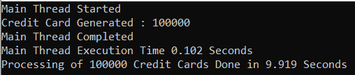
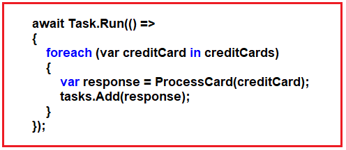
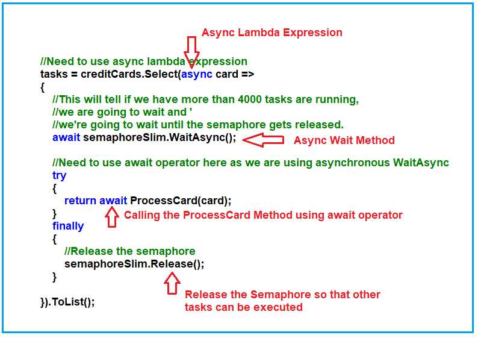
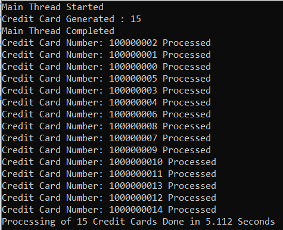
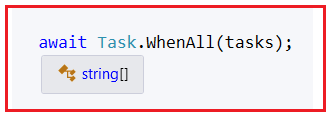
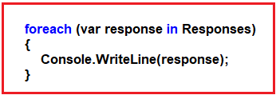
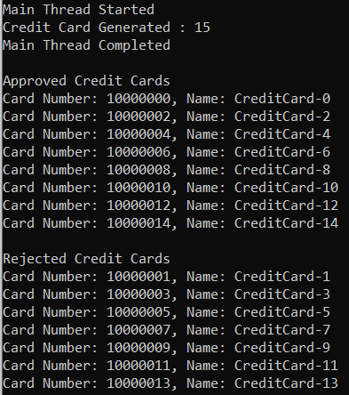

## **نحوه محدود کردن تعداد وظایف همزمان در سی شارپ**

در این مقاله، قصد دارم در مورد **نحوه محدود کردن تعداد وظایف همزمان در سی شارپ با استفاده از SemaphoreSlim** به همراه مثال صحبت کنم. لطفاً مقاله قبلی ما را که در آن در مورد نحوه اجرای چندین وظیفه با استفاده از متد WhenAll در سی شارپ به همراه مثال صحبت کردیم، مطالعه کنید. در پایان این مقاله، دو نکته زیر را به طور کامل درک خواهید کرد.

1. **چگونه تعداد وظایف همزمان را در سی شارپ محدود کنیم؟**
2. **چگونه می‌توان پاسخ چندین وظیفه (task) را هنگام اجرا با استفاده از متد Task.WhenAll مدیریت کرد؟**

##### **چگونه تعداد وظایف همزمان را در سی شارپ محدود کنیم؟**

در مثال زیر، ما ۱۰۰۰۰۰ وظیفه را به صورت همزمان پردازش می‌کنیم.

```csharp
using System;
using System.Collections.Generic;
using System.Diagnostics;
using System.Threading.Tasks;

namespace AsynchronousProgramming
{
    class Program
    {
        static void Main(string[] args)
        {
            var stopwatch = new Stopwatch();
            stopwatch.Start();
            Console.WriteLine($"Main Thread Started");

            List<CreditCard> creditCards = CreditCard.GenerateCreditCards(100000);
            Console.WriteLine($"Credit Card Generated : {creditCards.Count}");

            ProcessCreditCards(creditCards);

            Console.WriteLine($"Main Thread Completed");
            stopwatch.Start();
            Console.WriteLine($"Main Thread Execution Time {stopwatch.ElapsedMilliseconds / 1000.0} Seconds");
            Console.ReadKey();
        }

        public static async void ProcessCreditCards(List<CreditCard> creditCards)
        {
            var stopwatch = new Stopwatch();
            stopwatch.Start();

            var tasks = new List<Task<string>>();

            await Task.Run(() =>
            {
                foreach (var creditCard in creditCards)
                {
                    var response = ProcessCard(creditCard);
                    tasks.Add(response);
                }
            });

            // It will execute all the tasks concurrently
            await Task.WhenAll(tasks);
            stopwatch.Stop();
            Console.WriteLine($"Processing of {creditCards.Count} Credit Cards Done in {stopwatch.ElapsedMilliseconds / 1000.0} Seconds");
        }

        public static async Task<string> ProcessCard(CreditCard creditCard)
        {
            await Task.Delay(1000);
            string message = $"Credit Card Number: {creditCard.CardNumber} Name: {creditCard.Name} Processed";
            return message;
        }
    }

    public class CreditCard
    {
        public string CardNumber { get; set; }
        public string Name { get; set; }

        public static List<CreditCard> GenerateCreditCards(int number)
        {
            List<CreditCard> creditCards = new List<CreditCard>();
            for (int i = 0; i < number; i++)
            {
                CreditCard card = new CreditCard()
                {
                    CardNumber = "10000000" + i,
                    Name = "CreditCard-" + i
                };

                creditCards.Add(card);
            }

            return creditCards;
        }
    }
}
```

###### **خروجی:**



در اینجا، ما ۱۰۰۰۰۰ وظیفه را به طور همزمان پردازش کرده‌ایم. اما ممکن است هنگام اجرای تعداد زیادی وظیفه به طور همزمان مشکلاتی ایجاد شود، به عنوان مثال، ممکن است سرور قادر به مدیریت چنین درخواست عظیمی نباشد، یا اگر ۱۰۰۰۰۰ درخواست HTTP به یک سرور ارسال کنیم، ممکن است مسدود یا از کار بیفتد.

بنابراین، به جای ارسال ۱۰۰۰۰۰ درخواست HTTP در یک زمان یا پردازش ۱۰۰۰۰۰ وظیفه به طور همزمان، کاری که باید انجام دهیم این است که آنها را به صورت دسته‌ای ارسال کنیم یا وظایف را به صورت دسته‌ای پردازش کنیم و می‌توانیم این کار را در C# با استفاده از SemaphoreSlim انجام دهیم. با SemaphoreSlim، می‌توانیم تعداد وظایف همزمان را که با متد Task.WhenAll اجرا می‌شوند، محدود کنیم. اجازه دهید این موضوع را با یک مثال درک کنیم.

##### **مثالی برای درک نحوه محدود کردن تعداد وظایف همزمان در سی شارپ با استفاده از SemaphoreSlim:**

برای درک بهتر، ما قصد پردازش ۱۰۰۰۰۰ کارت اعتباری را نداریم. کاری که ما انجام خواهیم داد این است که ۱۵ کارت اعتباری را با یک دسته ۳ تایی پردازش خواهیم کرد. این بدان معناست که پنج دسته برای پردازش ۱۵ کارت اعتباری اجرا خواهد شد. بیایید ببینیم چگونه می‌توانیم به این هدف دست یابیم.

ابتدا، باید یک نمونه از کلاس SemaphoreSlim به صورت زیر ایجاد کنیم. در اینجا، ظرفیت اولیه را ۳ قرار می‌دهیم. این بدان معناست که در یک زمان ۳ نخ مجاز به اجرای وظایف هستند.

**SemaphoreSlim semaphoreSlim = new SemaphoreSlim(3);**

بنابراین، کاری که SemaphoreSlim انجام می‌دهد این است که اگر بیش از ۳ وظیفه در حال اجرا داشته باشیم، منتظر می‌مانیم و منتظر می‌مانیم تا سمافور منتشر شود. اگر با SimaphoreSlim تازه‌کار هستید، لطفاً مقاله زیر را که در آن به تفصیل در مورد SimaphoreSlim صحبت کرده‌ایم، بخوانید.

در مرحله بعد، باید قطعه کد زیر از متد ProcessCreditCards خود را برای استفاده از SemaphoreSlim تبدیل کنیم.



کد زیر نحوه استفاده از SimaphoreSlim را برای محدود کردن تعداد وظایف همزمان که باید اجرا شوند نشان می‌دهد. از آنجایی که ما از متد WaitAsync استفاده می‌کنیم، باید از عبارت لامبدا async و همچنین از عملگر await هنگام فراخوانی تابع ProcessCard استفاده کنیم. باید سمافور را درون بلوک finally آزاد کنیم تا مطمئن شویم که اگر استثنایی رخ داد، شیء semapohoreslim نیز نخ را آزاد می‌کند تا وظیفه دیگر توسط نخ اجرا شود.



##### **کد مثال کامل:**

کد نمونه‌ی کامل زیر نحوه‌ی استفاده از SemaphoreSlim برای محدود کردن تعداد وظایف همزمان را نشان می‌دهد. در اینجا، وظایف به صورت دسته‌ای اجرا می‌شوند و در هر دسته، حداکثر سه وظیفه اجرا می‌شود. در مثال زیر، باید فضاهای نام System.Threading و System.Linq را وارد کنیم. کلاس SemaphoreSlim متعلق به فضای نام System.Threading است و از آنجایی که از کوئری‌های LINQ استفاده می‌کنیم، باید فضای نام System.Linq را نیز وارد کنیم.

```csharp
using System;
using System.Collections.Generic;
using System.Diagnostics;
using System.Threading;
using System.Threading.Tasks;
using System.Linq;

namespace AsynchronousProgramming
{
    class Program
    {
        // Allowing Maximum 3 tasks to be executed at a time
        static SemaphoreSlim semaphoreSlim = new SemaphoreSlim(3);

        static void Main(string[] args)
        {
            var stopwatch = new Stopwatch();
            Console.WriteLine($"Main Thread Started");

            // Generating 15 Credit Cards
            List<CreditCard> creditCards = CreditCard.GenerateCreditCards(15);
            Console.WriteLine($"Credit Card Generated : {creditCards.Count}");

            ProcessCreditCards(creditCards);

            Console.WriteLine($"Main Thread Completed");
            Console.ReadKey();
        }

        public static async void ProcessCreditCards(List<CreditCard> creditCards)
        {
            var stopwatch = new Stopwatch();
            stopwatch.Start();

            var tasks = new List<Task<string>>();

            // Need to use async lambda expression
            tasks = creditCards.Select(async card =>
            {
                // This will tell if we have more than 4000 tasks are running,
                // we are going to wait and
                // we're going to wait until the semaphore gets released.
                await semaphoreSlim.WaitAsync();

                // Need to use await operator here as we are using asynchronous WaitAsync
                try
                {
                    return await ProcessCard(card);
                }
                finally
                {
                    // Release the semaphore
                    semaphoreSlim.Release();
                }

            }).ToList();

            // It will execute a maximum of 3 tasks at a time
            await Task.WhenAll(tasks);
            stopwatch.Stop();
            Console.WriteLine($"Processing of {creditCards.Count} Credit Cards Done in {stopwatch.ElapsedMilliseconds / 1000.0} Seconds");
        }

        public static async Task<string> ProcessCard(CreditCard creditCard)
        {
            await Task.Delay(1000);
            string message = $"Credit Card Number: {creditCard.CardNumber} Name: {creditCard.Name} Processed";
            Console.WriteLine($"Credit Card Number: {creditCard.CardNumber} Processed");
            return message;
        }
    }

    public class CreditCard
    {
        public string CardNumber { get; set; }
        public string Name { get; set; }

        public static List<CreditCard> GenerateCreditCards(int number)
        {
            List<CreditCard> creditCards = new List<CreditCard>();
            for (int i = 0; i < number; i++)
            {
                CreditCard card = new CreditCard()
                {
                    CardNumber = "10000000" + i,
                    Name = "CreditCard-" + i
                };

                creditCards.Add(card);
            }

            return creditCards;
        }
    }
}
```

###### **خروجی:**



لطفاً به خروجی توجه کنید. کمی بیشتر از ۵ ثانیه طول می‌کشد و این قابل انتظار است. زیرا تمام وظایف را در پنج دسته اجرا می‌کند. و اگر توجه کرده باشید، اجرای ProcessCard را ۱ ثانیه به تأخیر انداخته‌ایم. این بدان معناست که اجرای یک دسته کمی بیشتر از ۱ ثانیه طول می‌کشد و برای هر ۵ دسته نیز همین‌طور است، و از این رو زمان کلی کمی بیشتر از ۵ ثانیه است.

##### **چگونه می‌توان هنگام اجرای چندین وظیفه با استفاده از متد Tasks.WhenAll در سی شارپ، پاسخ را مدیریت کرد؟**

حال، بیایید بفهمیم که چگونه می‌توانیم هنگام اجرای همزمان چندین وظیفه با استفاده از متد Tasks.WhenAll در سی‌شارپ، پاسخ را مدیریت کنیم. می‌دانیم که Tasks.WhenAll می‌گوید که لطفاً قبل از ادامه اجرای بقیه قسمت متد، منتظر بمانید تا همه وظایف انجام شوند. این بدان معناست که پس از اتمام همه وظایف، می‌توانیم به اجرای بقیه قسمت متد ادامه دهیم.

اگر بیشتر دقت کنید، نوع بازگشتی متد ProcessCard، Task\<string> است. این یعنی متد چیزی را برمی‌گرداند. از آنجایی که متد WhenAll تمام وظایف را اجرا می‌کند، یعنی همه وظایف مقداری داده برمی‌گردانند. چگونه می‌توانیم به این صورت واکشی کنیم؟ بیایید ببینیم. لطفاً به تصویر زیر نگاهی بیندازید. اگر نشانگر ماوس را روی عملگر await قرار دهید، خواهید دید که یک آرایه رشته‌ای را برمی‌گرداند.



بنابراین، می‌توانیم پاسخ را به صورت زیر در یک آرایه رشته‌ای ذخیره کنیم:

**string[] Responses = await Task.WhenAll(tasks);**

سپس با استفاده از یک حلقه foreach می‌توانیم به نتیجه هر وظیفه به صورت زیر دسترسی پیدا کنیم.



##### **کد مثال کامل:**

هر آنچه که مورد بحث قرار دادیم در مثال زیر نشان داده شده است.

```csharp
using System;
using System.Collections.Generic;
using System.Diagnostics;
using System.Threading;
using System.Threading.Tasks;
using System.Linq;
using Newtonsoft.Json;

namespace AsynchronousProgramming
{
    class Program
    {
        // Allowing Maximum 3 tasks to be executed at a time
        static SemaphoreSlim semaphoreSlim = new SemaphoreSlim(3);

        static void Main(string[] args)
        {
            var stopwatch = new Stopwatch();
            Console.WriteLine($"Main Thread Started");

            // Generating 15 Credit Cards
            List<CreditCard> creditCards = CreditCard.GenerateCreditCards(15);
            Console.WriteLine($"Credit Card Generated : {creditCards.Count}");

            ProcessCreditCards(creditCards);

            Console.WriteLine($"Main Thread Completed");
            Console.ReadKey();
        }

        public static async void ProcessCreditCards(List<CreditCard> creditCards)
        {
            var stopwatch = new Stopwatch();
            stopwatch.Start();

            var tasks = new List<Task<string>>();

            // Need to use async lambda expression
            tasks = creditCards.Select(async card =>
            {
                await semaphoreSlim.WaitAsync();

                try
                {
                    return await ProcessCard(card);
                }
                finally
                {
                    semaphoreSlim.Release();
                }

            }).ToList();

            // Return the response as a string array
            string[] Responses = await Task.WhenAll(tasks);
            // var Responses = await Task.WhenAll(tasks);

            // Creating a collection to hold the responses
            List<CreditCardResponse> creditCardResponses = new List<CreditCardResponse>();

            // Looping through the string array
            foreach (var response in Responses)
            {
                // Here, the string is a JSON string
                // Converting the JSON String to .NET Object (CreditCardResponse) using
                // JsonConvert class DeserializeObject
                CreditCardResponse creditCardResponse = JsonConvert.DeserializeObject<CreditCardResponse>(response);

                // Adding the .NET Object into the response collection
                creditCardResponses.Add(creditCardResponse);
            }

            // Printing all the approved credit cards using a foreach loop
            Console.WriteLine("\nApproved Credit Cards");
            foreach (var item in creditCardResponses.Where(card => card.IsProcessed == true))
            {
                Console.WriteLine($"Card Number: {item.CardNumber}, Name: {item.Name}");
            }

            // Printing all the rejected credit cards using a foreach loop
            Console.WriteLine("\nRejected Credit Cards");
            foreach (var item in creditCardResponses.Where(card => card.IsProcessed == false))
            {
                Console.WriteLine($"Card Number: {item.CardNumber}, Name: {item.Name}");
            }

            stopwatch.Stop();
            Console.WriteLine($"Processing of {creditCards.Count} Credit Cards Done in {stopwatch.ElapsedMilliseconds / 1000.0} Seconds");
        }

        public static async Task<string> ProcessCard(CreditCard creditCard)
        {
            await Task.Delay(1000);

            var creditCardResponse = new CreditCardResponse
            {
                CardNumber = creditCard.CardNumber,
                Name = creditCard.Name,

                // Logic to Decide whether the card is processed or rejected
                // If modulus 2 is 0, the processed else rejected
                IsProcessed = creditCard.CardNumber % 2 == 0 ? true : false
            };

            // Converting the .NET Object to JSON string
            string jsonString = JsonConvert.SerializeObject(creditCardResponse);

            // Return the JSON String
            return jsonString;
        }
    }

    public class CreditCard
    {
        public long CardNumber { get; set; }
        public string Name { get; set; }

        public static List<CreditCard> GenerateCreditCards(int number)
        {
            List<CreditCard> creditCards = new List<CreditCard>();
            for (int i = 0; i < number; i++)
            {
                CreditCard card = new CreditCard()
                {
                    CardNumber = 10000000 + i,
                    Name = "CreditCard-" + i
                };

                creditCards.Add(card);
            }

            return creditCards;
        }
    }

    // This class will hold the response after processing the Credit card
    public class CreditCardResponse
    {
        public long CardNumber { get; set; }
        public string Name { get; set; }
        public bool IsProcessed { get; set; }
    }
}
```

###### **خروجی:**

