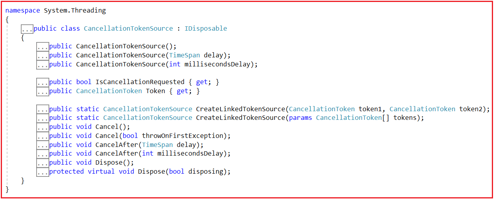
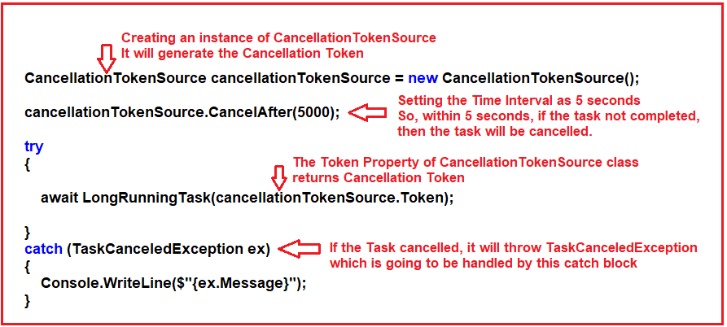
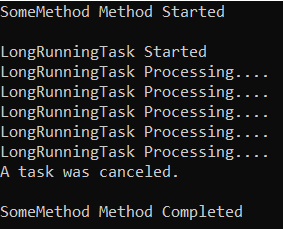
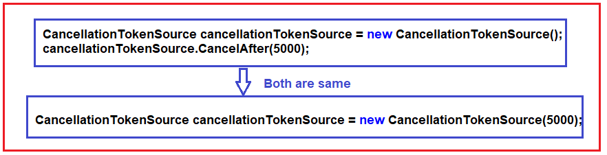
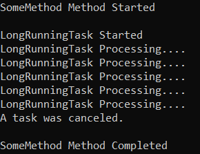
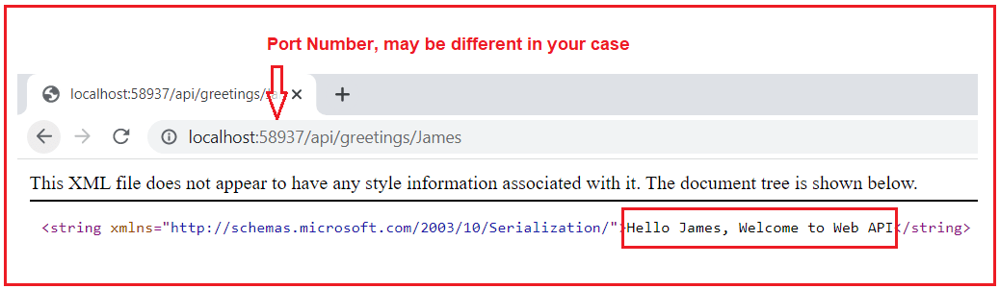
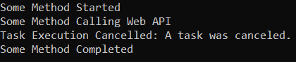
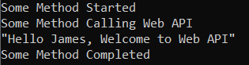

## **چگونه یک وظیفه طولانی مدت را با استفاده از توکن لغو در سی شارپ لغو کنیم؟**

به همراه مثال بررسی خواهم کرد **در این مقاله، نحوه لغو یک وظیفه طولانی مدت در سی شارپ با استفاده از Cancellation Token در سی شارپ را** به همراه مثال را مطالعه کنید. لطفاً مقاله قبلی ما در مورد نحوه محدود کردن تعداد وظایف همزمان در سی شارپ با استفاده از SemaphoreSlim . در پایان این مقاله، نکات زیر را به طور مفصل خواهید فهمید:

1. **چگونه یک وظیفه طولانی مدت را در سی شارپ لغو کنیم؟**
2. **چگونه می‌توان از توکن لغو برای لغو یک وظیفه در سی شارپ استفاده کرد؟**
3. **سازنده‌ها، ویژگی‌ها و متدهای کلاس CancellationTokenSource در سی‌شارپ**
4. **چگونه یک توکن لغو در سی شارپ ایجاد و استفاده کنیم؟**
5. **مثالی برای درک توکن لغو در سی شارپ**
6. **چه زمانی از توکن لغو برای لغو یک وظیفه در سی شارپ استفاده کنیم؟**
7. **مثال بلادرنگ برای درک توکن لغو در سی شارپ**

##### **چگونه یک وظیفه طولانی مدت را در سی شارپ لغو کنیم؟**

وقتی یک وظیفه طولانی را اجرا می‌کنیم، ارائه مکانیزمی برای لغو وظیفه به کاربران، روش خوبی است. چارچوب دات‌نت، توکن لغو را ارائه می‌دهد که با استفاده از آن می‌توانیم یک وظیفه را لغو کنیم. لغو یک وظیفه در سی‌شارپ با استفاده از یک توکن لغو، روشی قدرتمند برای خاتمه دادن به عملیات ناهمزمان است.

شما می‌توانید از یک CancellationToken برای ارسال سیگنال به یک وظیفه در حال اجرا استفاده کنید که باید اجرای آن را متوقف کند. شما می‌توانید یک وظیفه طولانی مدت را در C# با استفاده از CancellationToken لغو کنید و به صورت دوره‌ای بررسی کنید که آیا لغو در منطق وظیفه درخواست شده است یا خیر.

##### **چگونه می‌توان از توکن لغو برای لغو یک وظیفه در سی شارپ استفاده کرد؟**

بیایید مراحل یا رویه لغو یک وظیفه طولانی مدت با استفاده از Cancellation Token را بررسی کنیم. بنابراین، کاری که ما در اینجا انجام خواهیم داد این است که یک توکن لغو ایجاد می‌کنیم و آن توکن را به وظیفه‌ای که می‌خواهیم لغو کنیم، ارسال می‌کنیم. قبل از انجام پیاده‌سازی عملی، ابتدا کلاس CancellationTokenSource را درک می‌کنیم.

اگر به تعریف **کلاس CancellationTokenSource** مراجعه کنید ، موارد زیر را خواهید یافت. این کلاسی است که رابط IDisposable را پیاده‌سازی می‌کند. این CancellationTokenSource به CancellationToken سیگنال می‌دهد که باید لغو شود.



##### **سازنده‌های کلاس CancellationTokenSource در سی شارپ:**

کلاس CancellationTokenSource سه سازنده‌ی زیر را برای ایجاد یک نمونه از کلاس CancellationTokenSource فراهم می‌کند.

1. **CancellationTokenSource() :** یک نمونه جدید از کلاس CancellationTokenSource را مقداردهی اولیه می‌کند.
2. **CancellationTokenSource(TimeSpan delay) :** این تابع یک نمونه جدید از کلاس CancellationTokenSource را مقداردهی اولیه می‌کند که پس از بازه زمانی مشخص شده لغو خواهد شد. در اینجا، پارامتر delay فاصله زمانی مورد نیاز برای انتظار قبل از لغو این CancellationTokenSource را مشخص می‌کند. اگر delay.System.TimeSpan.TotalMilliseconds کمتر از -1 یا بیشتر از System.Int32.MaxValue باشد، خطای ArgumentOutOfRangeException رخ خواهد داد.
3. **CancellationTokenSource(int millisecondsDelay) :** این متد یک نمونه جدید از کلاس CancellationTokenSource را مقداردهی اولیه می‌کند که پس از تأخیر مشخص شده بر حسب میلی‌ثانیه لغو خواهد شد. در اینجا، پارامتر millisecondsDelay فاصله زمانی را بر حسب میلی‌ثانیه مشخص می‌کند که باید قبل از لغو این System.Threading.CancellationTokenSource منتظر ماند. اگر millisecondsDelay کمتر از -1 باشد، خطای ArgumentOutOfRangeException رخ خواهد داد.

##### **ویژگی‌های کلاس CancellationTokenSource در سی شارپ:**

کلاس CancellationTokenSource در سی شارپ دو ویژگی زیر را ارائه می‌دهد:

1. **public bool IsCancellationRequested { get; }:** این تابع بررسی می‌کند که آیا لغو برای این CancellationTokenSource درخواست شده است یا خیر. اگر لغو برای این CancellationTokenSource درخواست شده باشد، مقدار true و در غیر این صورت مقدار false را برمی‌گرداند.
2. **public CancellationToken Token { get; }:** این تابع CancellationToken مرتبط با CancellationTokenSource را دریافت می‌کند. CancellationToken مرتبط با این CancellationTokenSource را برمی‌گرداند. اگر منبع توکن حذف شده باشد، خطای ObjectDisposedException رخ می‌دهد.

##### **متدهای کلاس CancellationTokenSource در سی شارپ:**

کلاس CancellationTokenSource متدهای زیر را ارائه می‌دهد:

1. **Cancel():** درخواست لغو را ارسال می‌کند.
2. **Cancel(bool throwOnFirstException):** این تابع درخواستی برای لغو ارسال می‌کند و مشخص می‌کند که آیا در صورت وقوع یک استثنا، فراخوانی‌های برگشتی باقی‌مانده و عملیات قابل لغو باید پردازش شوند یا خیر. در اینجا، پارامتر throwOnFirstException مقدار true را مشخص می‌کند که آیا استثناها باید بلافاصله منتشر شوند یا خیر؛ در غیر این صورت، مقدار false را تعیین می‌کند.
3. **CancelAfter(TimeSpan delay):** این تابع، عملیات لغو را روی CancellationTokenSource پس از بازه زمانی مشخص‌شده زمان‌بندی می‌کند. در اینجا، پارامتر delay بازه زمانی مورد نیاز برای انتظار قبل از لغو این CancellationTokenSource را مشخص می‌کند.
4. **CancelAfter(int millisecondsDelay):** این تابع، عملیات لغو را روی CancellationTokenSource پس از تعداد میلی‌ثانیه مشخص‌شده، زمان‌بندی می‌کند. در اینجا، پارامتر millisecondsDelay مدت زمانی را که باید قبل از لغو این System.Threading.CancellationTokenSource منتظر ماند، مشخص می‌کند.
5. **Dispose():** تمام منابعی را که توسط نمونه فعلی کلاس CancellationTokenSource استفاده شده است، آزاد می‌کند.

##### **چگونه یک توکن لغو در سی شارپ ایجاد و استفاده کنیم؟**

ابتدا، باید یک نمونه از کلاس CancellationTokenSource به صورت زیر ایجاد کنیم. این CancellationTokenSource یک CancellationToken ایجاد می‌کند که می‌تواند به وظیفه (task) ارسال شود.

**CancellationTokenSource cancellationTokenSource = new CancellationTokenSource();**

سپس، باید فاصله زمانی را تنظیم کنیم، یعنی اینکه این توکن چه زمانی اجرای وظیفه را لغو می‌کند. در اینجا، اگر نمونه CancellationTokenSource باشد، باید متد CancelAfter را فراخوانی کنیم و باید زمان را به میلی‌ثانیه به شرح زیر مشخص کنیم. این تابع وظیفه را پس از ۵ ثانیه لغو می‌کند، زیرا ما ۵۰۰۰ میلی‌ثانیه را مشخص کرده‌ایم.

**cancellationTokenSource.CancelAfter(5000);**

در مرحله بعد، متد async ما باید CancellationToken را به عنوان پارامتر بپذیرد. اگر به تعریف کلاس CancellationToken بروید، خواهید دید که این کلاس یک ویژگی به نام IsCancellationRequested دارد که اگر لغو برای این توکن درخواست شده باشد، مقدار true را برمی‌گرداند؛ در غیر این صورت، مقدار false را برمی‌گرداند. اگر مقدار true را برگرداند، باید اجرا را متوقف کرده و return را بزنیم. اما به طور استاندارد، باید TaskCanceledException را صادر کنیم. برای درک بهتر، لطفاً به تصویر زیر نگاهی بیندازید.

 را در سی شارپ ایجاد و استفاده کنیم؟")

در مرحله بعد، هنگام فراخوانی متد LongRunningTask، باید Cancellation Token را ارسال کنیم. اگر به خاطر داشته باشید، کلاس CancellationTokenSource یک ویژگی به نام **Token** دارد و نوع بازگشتی آن ویژگی CancellationToken است، یعنی اگر ویژگی Token را روی نمونه CancellationTokenSource فراخوانی کنیم، CancellationToken را دریافت خواهیم کرد و آن توکن لغو را باید همانطور که در تصویر زیر نشان داده شده است، به متد LongRunningTask ارسال کنیم. علاوه بر این، اگر به خاطر داشته باشید، متد LongRunningTask **هنگام لغو وظیفه، TaskCanceledException** را صادر می‌کند و از این رو، همانطور که در تصویر زیر نشان داده شده است، باید از بلوک try-catch برای مدیریت استثنا استفاده کنیم.



امیدوارم نحوه ایجاد و استفاده از توکن لغو را درک کرده باشید. برای درک بهتر، مثالی را بررسی می‌کنیم.

##### **مثال برای درک توکن لغو در سی شارپ:**

```csharp
using System;
using System.Diagnostics;
using System.Threading;
using System.Threading.Tasks;

namespace AsynchronousProgramming
{
    class Program
    {
        static void Main(string[] args)
        {
            SomeMethod();
            Console.ReadKey();
        }

        private static async void SomeMethod()
        {
            int count = 10;
            Console.WriteLine("SomeMethod Method Started");

            CancellationTokenSource cancellationTokenSource = new CancellationTokenSource();
            cancellationTokenSource.CancelAfter(5000);
            try
            {
                await LongRunningTask(count, cancellationTokenSource.Token);
            }
            catch (TaskCanceledException ex)
            {
                Console.WriteLine($"{ex.Message}");
            }

            Console.WriteLine("\nSomeMethod Method Completed");
        }

        public static async Task LongRunningTask(int count, CancellationToken token)
        {
            var stopwatch = new Stopwatch();
            stopwatch.Start();
            Console.WriteLine("\nLongRunningTask Started");

            for (int i = 1; i <= count; i++)
            {
                await Task.Delay(1000);
                Console.WriteLine("LongRunningTask Processing....");
                if (token.IsCancellationRequested)
                {
                    throw new TaskCanceledException();
                }
            }

            stopwatch.Stop();
            Console.WriteLine($"LongRunningTask Took {stopwatch.ElapsedMilliseconds / 1000.0} Seconds for Processing");
        }
    }
}
```

در مثال بالا، مقدار متغیر count را روی ۱۰ تنظیم کرده‌ایم. این یعنی حلقه درون متد LongRunningTask، ۱۰ بار اجرا خواهد شد. و درون حلقه، اجرا را به مدت ۱ ثانیه به تأخیر انداخته‌ایم. این یعنی اجرای حلقه حداقل ۱۰ ثانیه طول خواهد کشید. و زمان توکن لغو را روی ۵ ثانیه تنظیم کرده‌ایم. درون این متد، بررسی می‌کنیم که آیا درخواست لغو توکن را دریافت کرده‌ایم یا خیر. اگر ویژگی IsCancellationRequested مقدار true را برگرداند، ۵ ثانیه تمام شده است و سپس خطای TaskCanceledException را صادر می‌کنیم. بنابراین، وقتی کد بالا را اجرا می‌کنید، خروجی زیر را دریافت خواهید کرد.



حال اگر مقدار متغیر count را کمتر از ۵ تنظیم کرده و کد را اجرا کنید، خواهید دید که وظیفه بدون بروز خطای TaskCanceledException به پایان می‌رسد.

**نکته:** به جای استفاده از متد CancelAfter() برای تنظیم زمان، می‌توانید از سازنده (constructor) که زمان را بر حسب میلی‌ثانیه دریافت می‌کند، یا از TimeSpan به عنوان پارامتر ورودی استفاده کنید. برای درک بهتر، لطفاً به تصویر زیر نگاهی بیندازید.



##### **مثال:**

```csharp
using System;
using System.Diagnostics;
using System.Threading;
using System.Threading.Tasks;

namespace AsynchronousProgramming
{
    class Program
    {
        static void Main(string[] args)
        {
            SomeMethod();
            Console.ReadKey();
        }

        private static async void SomeMethod()
        {
            int count = 10;
            Console.WriteLine("SomeMethod Method Started");

            CancellationTokenSource cancellationTokenSource = new CancellationTokenSource(5000);
            //cancellationTokenSource.CancelAfter(5000);
            try
            {
                await LongRunningTask(count, cancellationTokenSource.Token);
            }
            catch (TaskCanceledException ex)
            {
                Console.WriteLine($"{ex.Message}");
            }

            Console.WriteLine("\nSomeMethod Method Completed");
        }

        public static async Task LongRunningTask(int count, CancellationToken token)
        {
            var stopwatch = new Stopwatch();
            stopwatch.Start();
            Console.WriteLine("\nLongRunningTask Started");

            for (int i = 1; i <= count; i++)
            {
                await Task.Delay(1000);
                Console.WriteLine("LongRunningTask Processing....");
                if (token.IsCancellationRequested)
                {
                    throw new TaskCanceledException();
                }
            }

            stopwatch.Stop();
            Console.WriteLine($"LongRunningTask Took {stopwatch.ElapsedMilliseconds / 1000.0} Seconds for Processing");
        }
    }
}
```

###### **خروجی:**



##### **چه زمانی از توکن لغو برای لغو یک وظیفه در سی شارپ استفاده کنیم؟**

در سی شارپ، می‌توانید از CancellationToken برای لغو یک Task تحت شرایط خاص استفاده کنید. CancellationToken مکانیزمی است که کتابخانه موازی وظایف (TPL) برای ارسال سیگنال لغو به یک Task در حال اجرا ارائه می‌دهد. وقتی می‌خواهید اجرای یک Task را بر اساس برخی شرایط خارجی یا درخواست‌های کاربر لغو کنید، باید از آن استفاده کنید. در اینجا چند سناریو و رویکرد رایج برای استفاده از CancellationToken برای لغو یک Task آورده شده است:

##### **لغو درخواست توسط کاربر:**

شما می‌توانید از CancellationToken برای لغو عملیات طولانی مدت توسط کاربران استفاده کنید. برای مثال، فرض کنید یک Task دارید که محاسبات زمان‌بری را انجام می‌دهد یا یک فایل بزرگ را دانلود می‌کند. در این صورت، می‌توانید به صورت دوره‌ای CancellationToken را بررسی کنید و در صورت درخواست لغو، به راحتی از Task خارج شوید. در اینجا مثالی آورده شده است:

```csharp
CancellationTokenSource cts = new CancellationTokenSource();

Task.Run(() =>
{
    // Long-running operation
    for (int i = 0; i < 10000; i++)
    {
        if (cts.Token.IsCancellationRequested)
        {
            // Perform cleanup or return early
            return;
        }

        // Perform some work
    }
}, cts.Token);

// To request cancellation:
// cts.Cancel();
```

##### **لغو بر اساس زمان:**

همچنین می‌توانید از CancellationToken به همراه CancellationTokenSource و یک تایمر برای لغو یک وظیفه پس از یک زمان انقضای مشخص استفاده کنید. در اینجا مثالی آورده شده است:

```csharp
CancellationTokenSource cts = new CancellationTokenSource();
Timer timer = new Timer(_ => cts.Cancel(), null, TimeSpan.FromSeconds(5), Timeout.InfiniteTimeSpan);

Task.Run(() =>
{
    while (!cts.Token.IsCancellationRequested)
    {
        // Perform some work
    }
}, cts.Token);
```

##### **لغو تعاونی:**

اگر چندین وظیفه دارید که برای لغو نیاز به همکاری دارند، می‌توانید از CancellationTokenSource یکسان برای همه آنها استفاده کنید. وقتی CancellationTokenSource را لغو می‌کنید، تمام وظایف مرتبط لغو می‌شوند. این می‌تواند برای مدیریت گروهی از وظایف مرتبط مفید باشد.

```csharp
CancellationTokenSource cts = new CancellationTokenSource();

Task task1 = Task.Run(() => { /* Task 1 logic */ }, cts.Token);
Task task2 = Task.Run(() => { /* Task 2 logic */ }, cts.Token);

// To request cancellation for both tasks:
// cts.Cancel();
```

##### **لغو در متدهای ناهمگام:**

اگر با متدهای غیرهمزمان کار می‌کنید، می‌توانید یک CancellationToken نیز به متد async ارسال کنید و از آن برای بررسی لغو در حین اجرای آن استفاده کنید. این به شما امکان می‌دهد در صورت نیاز عملیات غیرهمزمان را لغو کنید.

```csharp
public async Task DoAsyncOperation(CancellationToken cancellationToken)
{
    while (!cancellationToken.IsCancellationRequested)
    {
        // Perform async work
        await Task.Delay(1000);
    }
}
```

در تمام این سناریوها، بررسی منظم ویژگی IsCancellationRequested مربوط به CancellationToken در منطق Task برای تشخیص درخواست لغو و پاسخ مناسب، چه پاک‌سازی منابع، چه بازگشت زودهنگام یا تکمیل صحیح Task، ضروری است.

#### **مثال بلادرنگ برای درک توکن لغو در سی شارپ:**

##### **ایجاد پروژه ASP.NET Web API**

ویژوال استودیو را باز کنید و یک پروژه جدید ASP.NET Web API ایجاد کنید. اگر در ASP.NET Web API تازه‌کار هستید، لطفاً به آموزش‌های ASP.NET Web API ما نگاهی بیندازید. در اینجا، ما یک پروژه خالی Web API با نام WebAPIDemo ایجاد می‌کنیم. پس از ایجاد پروژه Web API، یک کنترلر Web API با نام HomeController در پوشه Controllers اضافه کنید. پس از افزودن HomeController، لطفاً کد زیر را در آن کپی و جایگذاری کنید. در اینجا، ما یک متد async ایجاد می‌کنیم که یک رشته را برمی‌گرداند و عمداً، اجرا را به مدت ۵ ثانیه به تأخیر انداخته‌ایم.

```csharp
using System;
using System.Collections.Generic;
using System.Linq;
using System.Net;
using System.Net.Http;
using System.Threading.Tasks;
using System.Web.Http;

namespace WebAPIDemo.Controllers
{
    public class HomeController : ApiController
    {
        //api/greetings/name
        [Route("api/greetings/{name}")]
        [HttpGet]
        public async Task<string> GetGreetings(string name)
        {
            await Task.Delay(5000);
            return $"Hello {name}, Welcome to Web API";
        }
    }
}
```

اکنون، برنامه Web API را اجرا کنید و می‌توانید با استفاده از آدرس اینترنتی **api/greetings/name** همانطور که در تصویر زیر نشان داده شده است، به منبع GetGreetings دسترسی پیدا کنید. به جای نام، می‌توانید هر مقداری را ارسال کنید. لطفاً شماره پورت را یادداشت کنید؛ ممکن است در مورد شما متفاوت باشد.



##### **فراخوانی Web API از برنامه کنسول با استفاده از Cancellation Token:**

حالا، ما یک درخواست HTTP به Web API از برنامه کنسول خود ارسال خواهیم کرد. لطفاً آدرس انتهایی Web API را کپی کنید. و سپس کد را به صورت زیر تغییر دهید. شما باید شماره پورتی را که برنامه Web API شما روی آن اجرا می‌شود، جایگزین کنید. در مثال زیر، ما یک فراخوانی ناهمزمان به Web API ارسال می‌کنیم. در اینجا، لطفاً به متد GetAsync توجه کنید، پارامتر دوم این نسخه بارگذاری شده، توکن لغو را دریافت می‌کند و به صورت داخلی، اجرای وظیفه را پس از ۴ ثانیه لغو می‌کند.

```csharp
using System;
using System.Diagnostics;
using System.Net.Http;
using System.Threading;
using System.Threading.Tasks;

namespace AsynchronousProgramming
{
    class Program
    {
        static void Main(string[] args)
        {
            string Name = "James";
            SomeMethod(Name);
            Console.ReadKey();
        }

        private static async void SomeMethod(string Name)
        {
            Console.WriteLine("Some Method Started");
            using (var client = new HttpClient())
            {
                CancellationTokenSource cancellationTokenSource = new CancellationTokenSource(4000);

                client.BaseAddress = new Uri("http://localhost:58937/");
                try
                {
                    Console.WriteLine("Some Method Calling Web API");
                    HttpResponseMessage response = await client.GetAsync($"api/greetings/{Name}", cancellationTokenSource.Token);
                    string message = await response.Content.ReadAsStringAsync();
                    Console.WriteLine(message);
                }
                catch (TaskCanceledException ex)
                {
                    Console.WriteLine($"Task Execution Cancelled: {ex.Message}");
                }

                Console.WriteLine("Some Method Completed");
            }
        }
    }
}
```

###### **خروجی:**



**نکته:** قبل از اجرای برنامه کنسول، ابتدا برنامه Web API را اجرا کنید.

حالا، فاصله زمانی لغو وظیفه را به ۱۰ ثانیه تغییر دهید و برنامه زیر را اجرا کنید.

```csharp
using System;
using System.Net.Http;
using System.Threading;
using System.Threading.Tasks;

namespace AsynchronousProgramming
{
    class Program
    {
        static void Main(string[] args)
        {
            string Name = "James";
            SomeMethod(Name);
            Console.ReadKey();
        }

        private static async void SomeMethod(string Name)
        {
            Console.WriteLine("Some Method Started");
            using (var client = new HttpClient())
            {
                CancellationTokenSource cancellationTokenSource = new CancellationTokenSource(10000);

                client.BaseAddress = new Uri("http://localhost:58937/");
                try
                {
                    Console.WriteLine("Some Method Calling Web API");
                    HttpResponseMessage response = await client.GetAsync($"api/greetings/{Name}", cancellationTokenSource.Token);
                    string message = await response.Content.ReadAsStringAsync();
                    Console.WriteLine(message);
                }
                catch (TaskCanceledException ex)
                {
                    Console.WriteLine($"Task Execution Cancelled: {ex.Message}");
                }

                Console.WriteLine("Some Method Completed");
            }
        }
    }
}
```

###### **خروجی:**



این بار، همانطور که می‌بینید، وظیفه لغو نشده است. دلیل این امر این است که وظیفه قبل از 10 ثانیه تکمیل شده است، یعنی ما پاسخ API را قبل از 10 ثانیه دریافت کرده‌ایم.