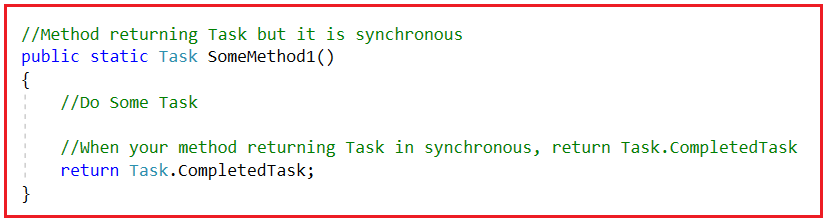
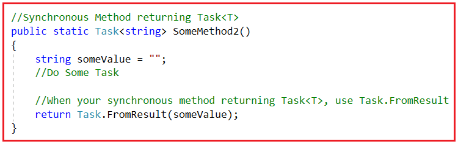
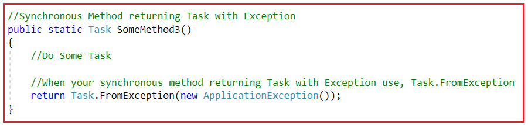
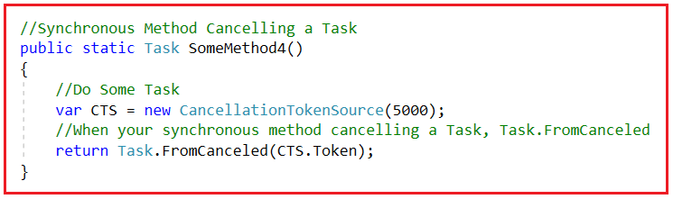
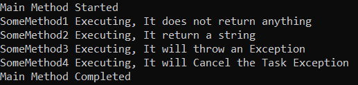

## **نحوه ایجاد متد همگام با استفاده از Task در سی شارپ**

در این مقاله، قصد دارم **نحوه ایجاد متد همگام با استفاده از Task در سی شارپ را** به همراه مثال بررسی کنم. لطفاً مقاله قبلی ما را که در آن نحوه لغو یک Task در سی شارپ با استفاده از Cancellation Token در سی شارپ به همراه مثال بررسی کردیم، مطالعه کنید.

##### **چگونه با استفاده از Task در سی شارپ، متد همگام (Synchronous) ایجاد کنیم؟**

مواقعی وجود خواهد داشت که شما متدی با امضای ناهمزمان خواهید داشت، یعنی return Task، اما پیاده‌سازی آن همگام خواهد بود. یکی از دلایل این امر این است که شما باید یک رابط پایه پیاده‌سازی کنید که یک وظیفه را برمی‌گرداند و پیاده‌سازی آن همگام است.

دلیل دیگر می‌تواند این باشد که در تست‌های واحد خود باید متدهای ناهمگام را شبیه‌سازی کنید. و پیاده‌سازی قرار است همزمان باشد. برای حل این مشکلات، می‌توانیم از متدهای کمکی مانند CompletedTask، FromResult، FromException و FromCanceled استفاده کنیم.

1. با متد Task.CompletedTask، می‌توانیم متدی را پیاده‌سازی کنیم که یک وظیفه (task) را برمی‌گرداند، اما این وظیفه (task) همزمان (synchronous) است.
2. با متد Task.FromResult، می‌توانیم متدی را پیاده‌سازی کنیم که task\<T> است، اما همزمان (synchronous) است. و البته، می‌توانیم مقداری را برگردانیم که درون یک task قرار می‌گیرد.
3. با Task.FromException، می‌توانیم وظیفه‌ای ایجاد کنیم که با خطا تکمیل شده باشد.
4. با Task.FromCanceled، می‌توانیم یک وظیفه (task) که لغو شده است را ایجاد کنیم.

مهم است که بتوانید وظیفه‌ای ایجاد کنید که دارای استثنا باشد یا به دلیل تست‌های واحد شما لغو شده باشد، ممکن است بخواهید متدی را آزمایش کنید که باید یک وظیفه معیوب یا وظیفه‌ای با استثنا یا وظیفه‌ای که لغو شده است را مدیریت کند.

**توجه:** این عملیات از نسخه‌های .NET Framework 4.6، 4.6.1، 4.6.2، 4.7، 4.7.1، 4.7.2، 4.8 و .NET Core All در دسترس هستند.

##### **سینتکس استفاده از Task.CompletedTask در سی شارپ:**

**CompletedTask :** این یک ویژگی از کلاس Task است. وظیفه‌ای را که با موفقیت انجام شده است، برمی‌گرداند.

برای درک بهتر نحوه استفاده از CompletedTask در سی شارپ، لطفاً به تصویر زیر نگاهی بیندازید. در اینجا، متد Task را برمی‌گرداند اما در اینجا از عملگر async در امضای متد استفاده نکرده‌ایم. بنابراین، وقتی می‌خواهیم یک متد همگام پیاده‌سازی کنیم که یک Task را برمی‌گرداند، باید از Task.CompletedTask استفاده کنیم.



##### **سینتکس استفاده از Task.FromResult در سی شارپ:**

**FromResult\<TResult>(TResult result):** این تابع یک وظیفه (Task) ایجاد می‌کند که با نتیجه‌ی مشخص‌شده با موفقیت تکمیل شده است. در اینجا، پارامتر result، نتیجه‌ای را که باید در وظیفه‌ی تکمیل‌شده ذخیره شود، مشخص می‌کند. در اینجا، پارامتر type، TResult، نوع نتیجه‌ای را که وظیفه برمی‌گرداند، مشخص می‌کند. این تابع، وظیفه‌ی تکمیل‌شده با موفقیت را برمی‌گرداند.

برای درک بهتر نحوه استفاده از FromResult در سی شارپ، لطفاً به تصویر زیر نگاهی بیندازید. در اینجا، متد Task را برمی‌گرداند اما در اینجا از async در امضای متد استفاده نکرده‌ایم. بنابراین، وقتی می‌خواهیم یک متد همگام پیاده‌سازی کنیم که Task\<T> را برمی‌گرداند، باید از Task.FromResult در سی شارپ استفاده کنیم.



##### **سینتکس استفاده از Task.FromException در سی شارپ:**

**FromException(Exception exception):** این تابع یک Task ایجاد می‌کند که با یک exception مشخص تکمیل شده است. در اینجا، پارامتر exception، exceptionای را که باید با آن task تکمیل شود، مشخص می‌کند. این تابع task دارای خطا را برمی‌گرداند.

برای درک بهتر نحوه استفاده از FromException در سی شارپ، لطفاً به تصویر زیر نگاهی بیندازید. در اینجا، متد همگام یک Task را برمی‌گرداند اما با یک Exception. بنابراین، وقتی می‌خواهیم یک متد همگام پیاده‌سازی کنیم که یک Task را با Exception برمی‌گرداند، باید از Task.FromException در سی شارپ استفاده کنیم.



این زمانی مفید است که یک تست واحد دارید و می‌خواهید مطمئن شوید که متد، وظیفه را با استثنائات مدیریت می‌کند.

##### **سینتکس استفاده از Task.FromCanceled در سی شارپ:**

**FromCanceled(CancellationToken cancelToken):** این متد یک وظیفه (Task) ایجاد می‌کند که به دلیل لغو با یک توکن لغو مشخص، تکمیل شده است. در اینجا، پارامتر cancelToken توکن لغو را مشخص می‌کند که با آن وظیفه تکمیل می‌شود. این متد وظیفه لغو شده را برمی‌گرداند. اگر لغو برای cancelToken درخواست نشده باشد، این متد ArgumentOutOfRangeException را صادر می‌کند؛ مقدار ویژگی CancellationToken.IsCancellationRequested برابر با false است.

برای درک بهتر نحوه استفاده از FromCanceled در سی شارپ، لطفاً به تصویر زیر نگاهی بیندازید. در اینجا، متد synchronous یک وظیفه را لغو می‌کند. بنابراین، وقتی می‌خواهیم یک متد synchronous پیاده‌سازی کنیم که یک وظیفه را لغو کند، باید از Task.FromCanceled در سی شارپ استفاده کنیم.



##### **مثالی برای درک نحوه ایجاد متد همگام با استفاده از Task در سی شارپ:**

مثال زیر نحوه‌ی استفاده از هر چهار روش فوق را نشان می‌دهد.

```csharp
using System;
using System.Threading;
using System.Threading.Tasks;

namespace AsynchronousProgramming
{
    class Program
    {
        static void Main(string[] args)
        {
            Console.WriteLine("Main Method Started");

            SomeMethod1();
            SomeMethod2();
            SomeMethod3();
            SomeMethod4();

            Console.WriteLine("Main Method Completed");
            Console.ReadKey();
        }

        // Method returning Task but it is synchronous
        public static Task SomeMethod1()
        {
            // Do Some Task
            Console.WriteLine("SomeMethod1 Executing, It does not return anything");
            // When your method returning Task in synchronous, return Task.CompletedTask
            return Task.CompletedTask;
        }

        // Synchronous Method returning Task<T>
        public static Task<string> SomeMethod2()
        {
            string someValue = "";
            someValue = "SomeMethod2 Returing a String";
            Console.WriteLine("SomeMethod2 Executing, It return a string");
            // When your synchronous method returning Task<T>, use Task.FromResult
            return Task.FromResult(someValue);
        }

        // Synchronous Method returning Task with Exception
        public static Task SomeMethod3()
        {
            Console.WriteLine("SomeMethod3 Executing, It will throw an Exception");

            // When your synchronous method returning Task with Exception use, Task.FromException
            return Task.FromException(new InvalidOperationException());
        }

        // Synchronous Method Cancelling a Task
        public static Task SomeMethod4()
        {
            CancellationTokenSource cts = new CancellationTokenSource();
            cts.Cancel();
            Console.WriteLine("SomeMethod4 Executing, It will Cancel the Task Exception");
            // When your synchronous method cancelling a Task, Task.FromCanceled
            return Task.FromCanceled(cts.Token);
        }
    }
}
```

###### **خروجی:**



