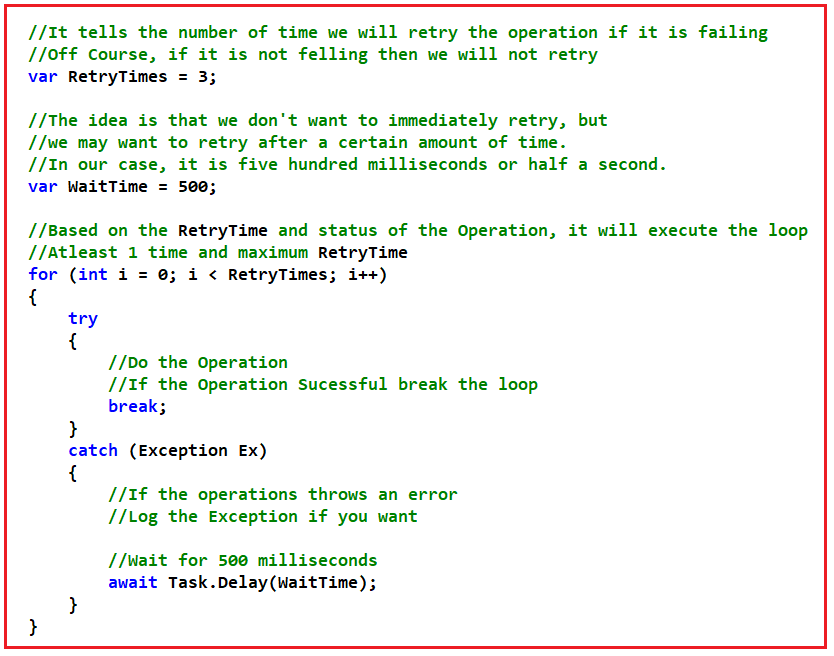
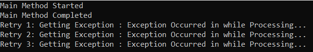
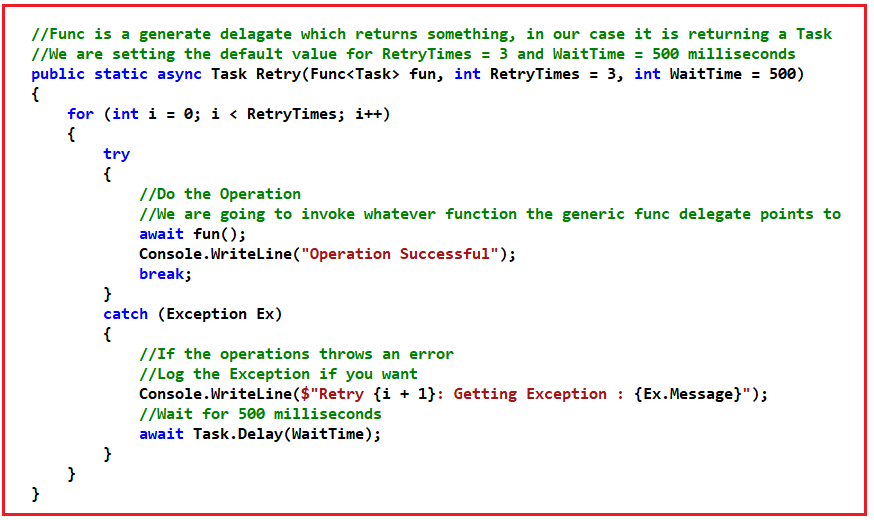
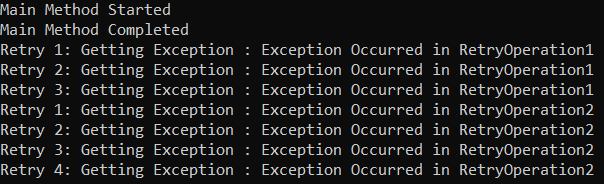
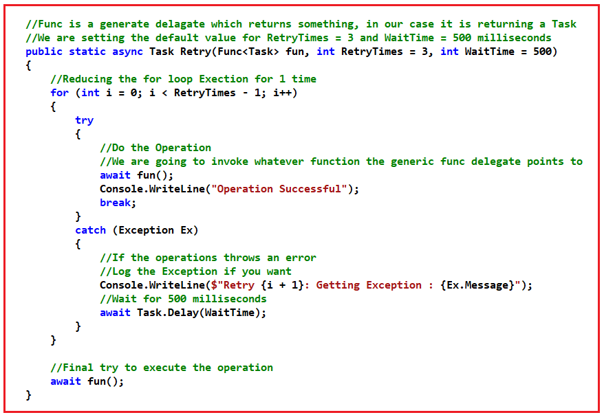
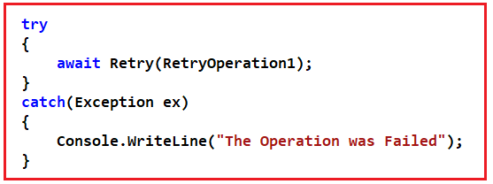
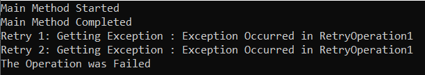
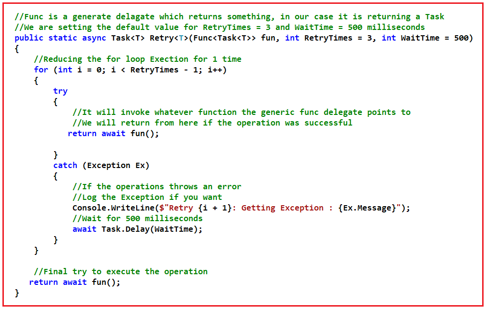
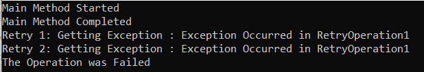
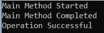

## **الگوی تلاش مجدد در سی شارپ با استفاده از برنامه نویسی ناهمزمان به همراه مثال**

در این مقاله، من در مورد **الگوی Retry در C#** با استفاده از برنامه‌نویسی ناهمزمان به همراه مثال بحث خواهم کرد. لطفاً مقاله قبلی ما در مورد نحوه ایجاد یک متد همگام با استفاده از Tasks در C# به همراه مثال را مطالعه کنید.

##### **الگوی تلاش مجدد در سی شارپ با استفاده از برنامه نویسی ناهمزمان**

یکی از کاربردهای برنامه‌نویسی ناهمزمان، اجرای الگوی تلاش مجدد (Retry Pattern) است. ایده این است که گاهی اوقات عملیاتی وجود دارند که می‌خواهیم چندین بار آنها را دوباره امتحان کنیم. با این حال، ما نمی‌خواهیم فوراً دوباره امتحان کنیم، بلکه می‌خواهیم پس از مدت زمان مشخصی دوباره امتحان کنیم. به عنوان مثال، اگر یک HTTP را به یک سرور وب درخواست کنیم، گاهی اوقات آن عملیات با شکست مواجه می‌شوند و ممکن است نخواهیم فوراً به کاربر بگوییم که خطایی رخ داده است. ممکن است بخواهیم عملیات را دوباره امتحان کنیم، فقط برای اینکه عملیات این بار کار کند.

##### **ساختار الگوی تلاش مجدد در سی شارپ:**

تصویر زیر ساختار اساسی الگوی Retry را در برنامه‌نویسی ناهمزمان C# نشان می‌دهد.



در اینجا، متغیر **RetryTimes** تعداد دفعاتی را که در صورت شکست عملیات، آن را دوباره امتحان خواهیم کرد، بیان می‌کند. اگر شکست نخورد، دوباره امتحان نخواهیم کرد. و ما مقدار آن را روی ۳ تنظیم کرده‌ایم، به این معنی که عملیات حداکثر ۳ بار دوباره امتحان خواهد شد.

و یک نکته دیگر، ما نمی‌خواهیم عملیات را بلافاصله دوباره امتحان کنیم. ممکن است بخواهیم عملیات را پس از مدت زمان مشخصی دوباره امتحان کنیم. در اینجا، پارامتر **WaitTime** مدت زمان لازم برای امتحان مجدد عملیات را مشخص می‌کند. ما مقدار WaitTime را روی ۵۰۰ میلی‌ثانیه تنظیم کرده‌ایم تا عملیات پس از ۵۰۰ میلی‌ثانیه یا نیم ثانیه دوباره امتحان شود.

سپس، ما حلقه for را با استفاده از بلوک try-catch ایجاد کردیم. این حلقه for حداقل ۱ بار و حداکثر ۳ بار اجرا می‌شود، زیرا مقدار RetryTimes را ۳ تنظیم کرده‌ایم.

سپس، درون بلوک try، عملیات ناهمگام خود را فراخوانی می‌کنیم. این عملیات می‌تواند یک فراخوانی API یا یک فراخوانی متد ناهمگام باشد. اگر عملیات موفقیت‌آمیز باشد، حلقه را می‌شکنیم و از حلقه for خارج می‌شویم. اگر عملیات ناموفق باشد، به این معنی که اگر از API یا متد ناهمگام (هر عملیاتی) استثنایی دریافت کنیم، بلوک catch آن استثنا را مدیریت کرده و بلوک catch را اجرا می‌کند. در صورت تمایل، می‌توانید جزئیات استثنا را ثبت کرده و قبل از ادامه تکرار بعدی حلقه، ۵۰۰ میلی‌ثانیه صبر کنید.

##### **مثال برای درک الگوی تلاش مجدد در سی شارپ:**

مثال زیر الگوی Retry را در سی شارپ با استفاده از برنامه نویسی ناهمزمان نشان می‌دهد.

```csharp
using System;
using System.Threading.Tasks;

namespace AsynchronousProgramming
{
    class Program
    {
        static void Main(string[] args)
        {
            Console.WriteLine("Main Method Started");
            RetryMethod();
            Console.WriteLine("Main Method Completed");
            Console.ReadKey();
        }

        public static async void RetryMethod()
        {
            // It tells the number of times we will retry the operation if it is failing
            // Of course, if it is not falling then we will not retry
            var RetryTimes = 3;

            // The idea is that we don't want to immediately retry, but
            // we may want to retry after a certain amount of time.
            // In our case, it is five hundred milliseconds or half a second.
            var WaitTime = 500;

            for (int i = 0; i < RetryTimes; i++)
            {
                try
                {
                    // Do the Operation
                    // If the Operation Successful break the loop
                    await RetryOperation();
                    Console.WriteLine("Operation Successful");
                    break;
                }
                catch (Exception Ex)
                {
                    // If the operations throws an error
                    // Log the Exception if you want
                    Console.WriteLine($"Retry {i + 1}: Getting Exception : {Ex.Message}");
                    // Wait for 500 milliseconds
                    await Task.Delay(WaitTime);
                }
            }
        }

        public static async Task RetryOperation()
        {
            // Doing Some Processing
            await Task.Delay(500);

            // Throwing Exception so that retry will work
            throw new Exception("Exception Occurred in while Processing...");
        }
    }
}
```

###### **خروجی:**



##### **الگوی تلاش مجدد عمومی در برنامه‌نویسی ناهمزمان سی‌شارپ:**

در مثال قبلی، نحوه ایجاد الگوی تلاش مجدد در برنامه‌نویسی ناهمزمان را دیدیم. اگر بخواهیم الگوی تلاش مجدد را در چندین مکان اعمال کنیم، باید الگوی تلاش مجدد را عمومی کنیم. بیایید ببینیم چگونه می‌توانیم این کار را انجام دهیم. لطفاً به تصویر زیر نگاهی بیندازید.



الگوی retry بالا دقیقاً همان کار الگوی قبلی را انجام می‌دهد. تنها تفاوت این است که این الگوی retry می‌تواند با چندین متد استفاده شود. برای درک بهتر، مثالی را بررسی می‌کنیم. لطفاً به مثال زیر نگاهی بیندازید. در مثال زیر، با استفاده از الگوی retry عمومی، متدهای ناهمزمان RetryOperation1 و RetryOperation2 را فراخوانی می‌کنیم.

```csharp
using System;
using System.Threading.Tasks;

namespace AsynchronousProgramming
{
    class Program
    {
        static void Main(string[] args)
        {
            Console.WriteLine("Main Method Started");
            RetryMethod();
            Console.WriteLine("Main Method Completed");
            Console.ReadKey();
        }

        public static async void RetryMethod()
        {
            // It will retry 3 times, here the function is RetryOperation1
            await Retry(RetryOperation1);

            // It will retry 4 times, here the function is RetryOperation2
            await Retry(RetryOperation2, 4);
        }

        // Generic Retry Method
        // Func is a generate delegate which returns something, in our case it is returning a Task
        // We are setting the default value for RetryTimes = 3 and WaitTime = 500 milliseconds
        public static async Task Retry(Func<Task> fun, int RetryTimes = 3, int WaitTime = 500)
        {
            for (int i = 0; i < RetryTimes; i++)
            {
                try
                {
                    // Do the Operation
                    // We are going to invoke whatever function the generic func delegate points to
                    await fun();
                    Console.WriteLine("Operation Successful");
                    break;
                }
                catch (Exception Ex)
                {
                    // If the operations throws an error
                    // Log the Exception if you want
                    Console.WriteLine($"Retry {i + 1}: Getting Exception : {Ex.Message}");
                    // Wait for 500 milliseconds
                    await Task.Delay(WaitTime);
                }
            }
        }

        public static async Task RetryOperation1()
        {
            // Doing Some Processing
            await Task.Delay(500);

            // Throwing Exception so that retry will work
            throw new Exception("Exception Occurred in RetryOperation1");
        }

        public static async Task RetryOperation2()
        {
            // Doing Some Processing
            await Task.Delay(500);

            // Throwing Exception so that retry will work
            throw new Exception("Exception Occurred in RetryOperation2");
        }
    }
}
```

###### **خروجی:**



##### **مشکلی با الگوی تکرار عمومی بالا دارید؟**

در الگوی کلی retry بالا، ما یک مشکل داریم. ما Retry را از RetryMethod به صورت زیر فراخوانی می‌کنیم:

**await Retry(RetryOperation1);**

اگر بخواهم کاری انجام دهم اگر عملیات سه بار شکست بخورد چه؟ به دلیل نحوه پیاده‌سازی متد ژنریک Retry، این متد بدون اینکه به ما بگوید عملیات موفقیت‌آمیز بوده یا خطایی رخ داده است، به اجرای خود ادامه می‌دهد. بیایید متد Retry را به صورت زیر اصلاح کنیم. در اینجا، ما اجرای حلقه for را برای ۱ بار کاهش می‌دهیم تا عملیات آخرین بار خارج از حلقه for اجرا شود، که این کار جواب خواهد داد.



در کد بالا، مقدار RetryTimes را برابر با ۳ دریافت می‌کنیم و سپس اگر عملیات ناموفق باشد، حلقه ۲ بار اجرا می‌شود. آخرین بار خارج از حلقه for اجرا می‌شود و ما در اینجا استثنا را مدیریت نمی‌کنیم، بنابراین یک استثنا ایجاد می‌کند که نشان می‌دهد عملیات موفقیت‌آمیز بوده است. اکنون می‌توانید استثنا را از جایی که متد Retry را فراخوانی کرده‌اید، به صورت زیر دریافت کنید:



کد کامل مثال در زیر آمده است.

```csharp
using System;
using System.Threading.Tasks;

namespace AsynchronousProgramming
{
    class Program
    {
        static void Main(string[] args)
        {
            Console.WriteLine("Main Method Started");
            RetryMethod();
            Console.WriteLine("Main Method Completed");
            Console.ReadKey();
        }

        public static async void RetryMethod()
        {
            // It will retry 3 times, here the function is RetryOperation1
            try
            {
                await Retry(RetryOperation1);
            }
            catch (Exception ex)
            {
                Console.WriteLine("The Operation was Failed");
            }
        }

        // Generic Retry Method
        // Func is a generate delegate which returns something, in our case it is returning a Task
        // We are setting the default value for RetryTimes = 3 and WaitTime = 500 milliseconds
        public static async Task Retry(Func<Task> fun, int RetryTimes = 3, int WaitTime = 500)
        {
            // Reducing the for loop Execution for 1 time
            for (int i = 0; i < RetryTimes - 1; i++)
            {
                try
                {
                    // Do the Operation
                    // We are going to invoke whatever function the generic func delegate points to
                    await fun();
                    Console.WriteLine("Operation Successful");
                    break;
                }
                catch (Exception Ex)
                {
                    // If the operations throws an error
                    // Log the Exception if you want
                    Console.WriteLine($"Retry {i + 1}: Getting Exception : {Ex.Message}");
                    // Wait for 500 milliseconds
                    await Task.Delay(WaitTime);
                }
            }

            // Final try to execute the operation
            await fun();
        }

        public static async Task RetryOperation1()
        {
            // Doing Some Processing
            await Task.Delay(500);

            // Throwing Exception so that retry will work
            throw new Exception("Exception Occurred in RetryOperation1");
        }
    }
}
```

وقتی کد بالا را اجرا می‌کنید، خروجی زیر را دریافت خواهید کرد. در اینجا، می‌توانید ببینید که دو خطا دریافت می‌کنیم زیرا حلقه دو بار اجرا می‌شود و در نهایت، عملیات ناموفق است. دلیل این امر این است که اجرای نهایی تابع خارج از بلوک try-catch انجام می‌شود.



##### **متد عمومی Async Retry با مقدار برگشتی در سی شارپ:**

در حال حاضر، روشی که ما برای پیاده‌سازی متد Generic Retry استفاده می‌کنیم، هیچ مقداری را برنمی‌گرداند. حال، بیایید یک متد Generic Retry برای برگرداندن یک مقدار ایجاد کنیم. اگر می‌خواهید مقداری را برگردانید، باید از Task\<T> استفاده کنید. برای درک بهتر، لطفاً به تصویر زیر نگاهی بیندازید. در تصویر زیر، T نشان دهنده نوع مقداری است که عملیات قرار است برگرداند.



برای آزمایش متد Retry فوق، لطفاً متد async زیر را ایجاد کنید که یک رشته برمی‌گرداند.

```csharp
public static async Task<string> RetryOperationValueReturning()
{
    // Doing Some Processing and return the value
    await Task.Delay(500);

    // Throwing Exception so that retry will work
    throw new Exception("Exception Occurred in RetryOperation1");
}
```

کد کامل مثال در زیر آمده است.

```csharp
using System;
using System.Threading.Tasks;

namespace AsynchronousProgramming
{
    class Program
    {
        static void Main(string[] args)
        {
            Console.WriteLine("Main Method Started");
            RetryMethod();
            Console.WriteLine("Main Method Completed");
            Console.ReadKey();
        }

        public static async void RetryMethod()
        {
            // It will retry 3 times, here the function is RetryOperation1
            try
            {
                var result = await Retry(RetryOperationValueReturning);
                Console.WriteLine(result);
            }
            catch (Exception ex)
            {
                Console.WriteLine("The Operation was Failed");
            }
        }

        // Generic Retry Method Returning Value
        // Func is a generate delegate which returns something, in our case it is returning a Task
        // We are setting the default value for RetryTimes = 3 and WaitTime = 500 milliseconds
        public static async Task<T> Retry<T>(Func<Task<T>> fun, int RetryTimes = 3, int WaitTime = 500)
        {
            // Reducing the for loop Execution for 1 time
            for (int i = 0; i < RetryTimes - 1; i++)
            {
                try
                {
                    // Do the Operation
                    // We are going to invoke whatever function the generic func delegate points to
                    // We will return from here if the operation was successful
                    return await fun();
                }
                catch (Exception Ex)
                {
                    // If the operations throws an error
                    // Log the Exception if you want
                    Console.WriteLine($"Retry {i + 1}: Getting Exception : {Ex.Message}");
                    // Wait for 500 milliseconds
                    await Task.Delay(WaitTime);
                }
            }

            // Final try to execute the operation
            return await fun();
        }

        public static async Task<string> RetryOperationValueReturning()
        {
            // Doing Some Processing and return the value
            await Task.Delay(500);

            // Uncomment the below code to successfully return a string
            // return "Operation Successful";

            // Throwing Exception so that retry will work
            throw new Exception("Exception Occurred in RetryOperation1");
        }
    }
}
```

###### **خروجی:**



کد زیر با موفقیت اجرا خواهد شد.

```csharp
using System;
using System.Threading.Tasks;

namespace AsynchronousProgramming
{
    class Program
    {
        static void Main(string[] args)
        {
            Console.WriteLine("Main Method Started");
            RetryMethod();
            Console.WriteLine("Main Method Completed");
            Console.ReadKey();
        }

        public static async void RetryMethod()
        {
            try
            {
                var result = await Retry(RetryOperationValueReturning);
                Console.WriteLine(result);
            }
            catch (Exception ex)
            {
                Console.WriteLine("The Operation was Failed");
            }
        }

        public static async Task<T> Retry<T>(Func<Task<T>> fun, int RetryTimes = 3, int WaitTime = 500)
        {
            for (int i = 0; i < RetryTimes - 1; i++)
            {
                try
                {
                    return await fun();
                }
                catch (Exception Ex)
                {
                    Console.WriteLine($"Retry {i + 1}: Getting Exception : {Ex.Message}");
                    await Task.Delay(WaitTime);
                }
            }
            return await fun();
        }

        public static async Task<string> RetryOperationValueReturning()
        {
            await Task.Delay(500);
            return "Operation Successful";
        }
    }
}
```

###### **خروجی:**



بنابراین، ما یک الگوی تلاش مجدد پیاده‌سازی کرده‌ایم که به ما امکان می‌دهد منطق تکرار چندین باره یک عملیات را تا زمانی که کار کند یا تا زمانی که تلاش‌های تلاش مجدد ما تمام شود، متمرکز کنیم.

##### **چه زمانی از الگوی Retry در سی شارپ استفاده کنیم؟**

الگوی تلاش مجدد (Retry Pattern) یک استراتژی مهم در توسعه نرم‌افزار است که در سیستم‌های توزیع‌شده، معماری‌های میکروسرویس یا هر سناریویی که در آن یک سیستم با منابع یا سرویس‌های خارجی (مانند پایگاه‌های داده، APIها یا سیستم‌های فایل) تعامل دارد، مفید است. این الگو شامل تلاش مجدد برای یک عملیات ناموفق برای مدیریت خطاهای گذرا است که احتمالاً به زودی برطرف می‌شوند. در اینجا سناریوهایی وجود دارد که استفاده از الگوی تلاش مجدد در C# می‌تواند مفید باشد:

- **مدیریت خطاهای گذرا:** رایج‌ترین سناریو برای استفاده از الگوی تلاش مجدد، مدیریت خطاهای گذرا است. این خطاها به صورت پراکنده رخ می‌دهند و اغلب به سرعت برطرف می‌شوند، مانند اشکالات موقت شبکه، عدم دسترسی کوتاه مدت به سرویس یا وقفه‌های زمانی.
- **تعامل با سرویس‌های خارجی:** هنگامی که برنامه شما با سرویس‌های خارجی (مثلاً سرویس‌های وب، سرویس‌های ابری) ارتباط برقرار می‌کند، به دلیل ماهیت غیرقابل پیش‌بینی ارتباطات شبکه، ممکن است خطاهای گذرا رخ دهد. درخواست‌های مجدد اغلب می‌توانند بر این مشکلات موقت غلبه کنند.
- **عملیات پایگاه داده:** عملیات پایگاه داده گاهی اوقات می‌تواند به دلیل مشکلات گذرا مانند زمان قفل، مشکلات شبکه یا بار زیاد سرور با شکست مواجه شود. پیاده‌سازی تلاش‌های مجدد می‌تواند تعاملات پایگاه داده را قوی‌تر کند.
- **تاب‌آوری در میکروسرویس‌ها:** در معماری میکروسرویس‌ها، سرویس‌ها اغلب به یکدیگر وابسته هستند. الگوی تلاش مجدد می‌تواند با اطمینان از اینکه یک سرویس می‌تواند خرابی‌های موقت در سایر سرویس‌هایی که به آنها وابسته است را مدیریت کند، تاب‌آوری را بهبود بخشد.
- **عملیات ورودی/خروجی فایل:** دسترسی به فایل گاهی اوقات می‌تواند منجر به خطاهای گذرا شود، به خصوص در سیستم‌های فایل شبکه یا فضای ذخیره‌سازی ابری. تلاش‌های مجدد می‌توانند این مشکلات متناوب را به طور مؤثر مدیریت کنند.
- **سیستم‌های صف‌بندی و پیام‌رسانی:** هنگام کار با صف‌های پیام یا سیستم‌های پیام‌رسانی ناهمزمان، ممکن است خرابی‌های گذرا مانند قطع ارتباط کوتاه یا بار زیاد رخ دهد، که تکرار تلاش‌ها را مفید می‌کند.