## **delegate ها در سی شارپ به همراه مثال**

در این مقاله، قصد دارم **Delegateها را در سی شارپ** با مثال‌هایی مورد بحث قرار دهم. به عنوان بخشی از این مقاله، قصد داریم نکات مهم زیر را به تفصیل مورد بحث قرار دهیم.

1. **نمایندگان (Delegates) در سی شارپ چیستند؟**
2. **چگونه می‌توان متدها را با استفاده از delegate ها در سی شارپ فراخوانی کرد؟**
3. **مثال‌هایی از استفاده از نمایندگان (Delegates).**
4. **قوانین استفاده از Delegate ها در سی شارپ**
5. **انواع نمایندگان کدامند؟**

##### **نمایندگان (Delegates) در سی شارپ چیستند؟**

به عبارت ساده، می‌توان گفت که delegateها در C#، اشاره‌گر تابع Type-Safe هستند. به این معنی که آنها مرجع یک متد یا تابع را نگه می‌دارند و سپس آن متد را برای اجرا فراخوانی می‌کنند. اگر در حال حاضر این موضوع برایتان واضح نیست، نگران نباشید، وقتی شروع به بحث در مورد مثال‌های استفاده از delegateها کنیم، به این نکته خواهیم رسید.

##### **چگونه یک Delegates سفارشی در سی شارپ ایجاد کنیم؟**

وقتی صحبت از ایجاد یک نماینده سفارشی می‌شود، فرآیند بسیار ساده‌ای است. بنابراین، یک نماینده سفارشی را می‌توان با استفاده از کلمه کلیدی delegate تعریف کرد. و این نوعی کلمه کلیدی جادویی است زیرا در پشت صحنه، وقتی کامپایلر کلمه کلیدی delegate را می‌بیند، در واقع کلاسی تولید می‌کند که از برخی دیگر از کلاس‌های نماینده چارچوب .NET ارث‌بری می‌کند و این موضوع در ادامه بررسی خواهد شد.

سینتکس ایجاد یک delegate در سی شارپ بسیار شبیه به تعریف متد انتزاعی است. در تعریف متد انتزاعی، از کلمه کلیدی abstract استفاده می‌کنیم در حالی که در delegate باید از کلمه کلیدی delegate استفاده کنیم. سینتکس تعریف یک delegate در سی شارپ به شرح زیر است:

**\<Access Modifier> delegate \<Return Type> \<Delegate Name> (لیست پارامترها)؛**

مثال زیر یک delegate است. در اینجا، می‌توانید متوجه شوید که ما از کلمه کلیدی delegate استفاده می‌کنیم. این delegate خاصی که می‌توانید تصور کنید، یک pipeline یک طرفه است. void است، هیچ چیزی به عقب برنمی‌گردد. داده‌ها فقط به جلو می‌روند. نام delegate، WorkPerformedHandler است و دو پارامتر می‌گیرد. پارامتر اول عدد صحیح hours و پارامتر دوم worktype است که قرار است یک Enumeration باشد. حال، اگر کلمه کلیدی delegate را حذف کنید، شبیه یک method می‌شود.

**نماینده عمومی از درجه اعتبار ساقط WorkPerformedHandler(ساعت کاری از نوع عدد صحیح، WorkType workType)؛**

در واقع، یک delegate یک طرح اولیه برای متدی است که قرار است داده‌ها را در event handler (کنترل‌کننده رویداد) قرار دهد. از نظر بصری، مانند تصویر زیر خواهد بود. delegate نوعی خط لوله است. و چیزی که ما می‌خواهیم، ​​راهی برای تخلیه مقداری داده از نقطه A به نقطه B است که همان متد Event Handler ما خواهد بود.

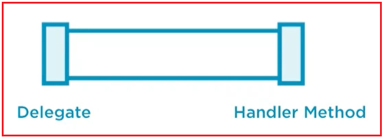

حالا، ما داده‌هایمان را در جایی از برنامه داریم و می‌خواهیم آنها را به این متد Handler هدایت کنیم. چگونه می‌توانیم داده‌ها را به متد Handler هدایت کنیم؟ ما قصد داریم داده‌هایی را که در جایی از برنامه‌مان ذخیره شده‌اند، با استفاده از pipeline، یعنی با استفاده از یک delegate، به این متد Handler هدایت کنیم. در delegate، باید پارامترهایی را تعریف کنیم که داده‌ها را از نقطه A به نقطه B (یعنی متد Handler) هدایت می‌کنند.

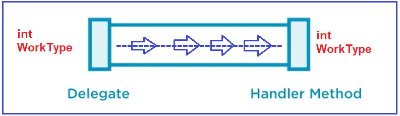

در این حالت، خط لوله فقط دو پارامتر را می‌پذیرد و باید از نوع int و WorkType باشد، در غیر این صورت کامپایل نمی‌شود. بنابراین، اکنون یک راه برای واگذاری داده‌ها از نقطه A به نقطه B داریم. بنابراین، نماینده می‌داند چگونه داده‌ها را منتقل کند. بنابراین، تعریف یک نماینده همانطور که در اینجا می‌بینید بسیار ساده است.

حال، بیایید سعی کنیم بفهمیم که متد Handler برای اینکه این کار را انجام دهد، چه کاری باید انجام دهد. امضای delegate و امضای متد handler باید با هم مطابقت داشته باشند. همانطور که delegate را با دو پارامتر تعریف کرده‌ایم یا می‌توان گفت pipeline ما دو پارامتر از نوع int و WorkType می‌گیرد. حال، اگر متد handler بخواهد داده‌ها را از pipeline دریافت کند، handler باید تعداد، نوع و ترتیب پارامترهای یکسانی با delegate داشته باشد. برای درک بهتر، لطفاً به تصویر زیر که متد delegate و handler را نشان می‌دهد، نگاهی بیندازید.

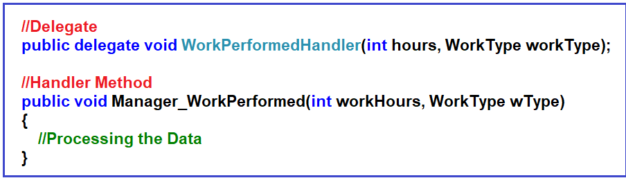

همانطور که در تصویر بالا مشاهده می‌کنید، اولین پارامتر delegate ما از نوع int است و همچنین int اولین پارامتر Handler ما نیز می‌باشد. دومین پارامتر delegate از نوع WorkType است و برای دریافت داده‌ها از pipeline، دومین پارامتر Handler نیز باید WorkType باشد. این مهم است و نوع، ترتیب و تعداد پارامترها باید یکسان باشند، در غیر این صورت، متد Handler داده‌ها را از pipeline دریافت نخواهد کرد. نام پارامترها مهم نیست. می‌توانید ببینید که من نام پارامتر delegate را hours و workType قرار داده‌ام و نام‌های متفاوتی برای متد handler در نظر گرفته‌ام و این مشکلی ندارد.

**نکته:** نکته‌ای که باید هنگام کار با Delegateهای سی‌شارپ به خاطر داشته باشید این است که امضای Delegate و متدی که به آن اشاره می‌کند باید یکسان باشد. بنابراین، وقتی یک Delegate ایجاد می‌کنید، **Access Modifier** ، **Return Type** و **Number، Type و Order of Parameters** مربوط به Delegateها باید و باید با **Access Modifier، Return Type و Number، Type و Order of Parameters** مربوط به تابعی که Delegate می‌خواهد به آن ارجاع دهد، یکسان باشد. می‌توانید Delegateها را یا درون یک کلاس یا درست مانند سایر انواعی که تحت یک فضای نام تعریف کرده‌ایم، تعریف کنید.

##### **پشت صحنه با نماینده ما چه اتفاقی می‌افتد؟**

حالا، ما قصد داریم در مورد آنچه در پشت صحنه با delegate ما اتفاق می‌افتد بحث کنیم، یعنی قصد داریم در مورد کلاس‌های پایه delegate در .NET Framework بحث کنیم.

##### **کلاس پایه Delegate در سی شارپ:**

یکی از کلاس‌های واقعاً اصلی در چارچوب .NET، Delegate است که برخی از قابلیت‌های پایه را ارائه می‌دهد. اگر به تعریف کلاس Delegate بروید، خواهید دید که همانطور که در تصویر زیر نشان داده شده است، یک کلاس انتزاعی است.

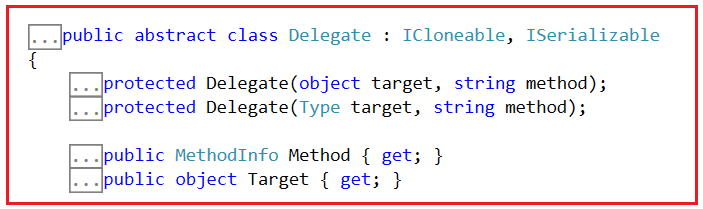

کلاس Delegate دو ویژگی مهم ارائه می‌دهد. آنها به شرح زیر هستند:

1. **متد public MethodInfo {get;}:** این ویژگی برای دریافت متدی که توسط delegate نمایش داده می‌شود، استفاده می‌شود. به این معنی که یک System.Reflection.MethodInfo برمی‌گرداند که متد نمایش داده شده توسط delegate را توصیف می‌کند. اگر فراخواننده به متد نمایش داده شده توسط delegate دسترسی نداشته باشد، مثلاً اگر متد private باشد، خطای MemberAccessException رخ می‌دهد.
2. **شیء عمومی هدف {get;}:** این ویژگی برای دریافت نمونه کلاسی که نماینده فعلی، متد نمونه را روی آن فراخوانی می‌کند، استفاده می‌شود. به این معنی که اگر نماینده فعلی نشان‌دهنده یک متد نمونه باشد، شیء‌ای را که نماینده فعلی متد نمونه را روی آن فراخوانی می‌کند، برمی‌گرداند؛ و اگر نماینده نشان‌دهنده یک متد استاتیک باشد، null است.

**نکته:** خط لوله باید داده‌ها را در جایی تخلیه کند، و ویژگی Method نام روشی را که قرار است داده‌ها در آن تخلیه شوند، تعریف می‌کند. و Target نمونه شیء است که روش در آن قرار دارد و در مورد یک روش استاتیک null است. اگر نماینده یک یا چند روش نمونه را فراخوانی کند، ویژگی Target هدف آخرین روش نمونه در لیست فراخوانی را برمی‌گرداند.

این کلاس انتزاعی Delegate همچنین یک متد مجازی مهم به نام GetInvocationList دارد.

1. **public virtual Delegate[] GetInvocationList():** این متد لیست فراخوانی delegate را برمی‌گرداند. این بدان معناست که آرایه‌ای از delegateها را برمی‌گرداند که نشان‌دهنده لیست فراخوانی delegate فعلی است.

##### **کلاس پایه MulticastDelegate در سی شارپ:**

حال، بیایید ادامه دهیم و یک کلاس اصلی مهم دیگر یعنی MulticastDelegate را درک کنیم. اگر به تعریف کلاس MulticastDelegate بروید، خواهید دید که این کلاس نیز یک کلاس انتزاعی است و همانطور که در تصویر زیر نشان داده شده است، از کلاس انتزاعی Delegate به ارث رسیده است.

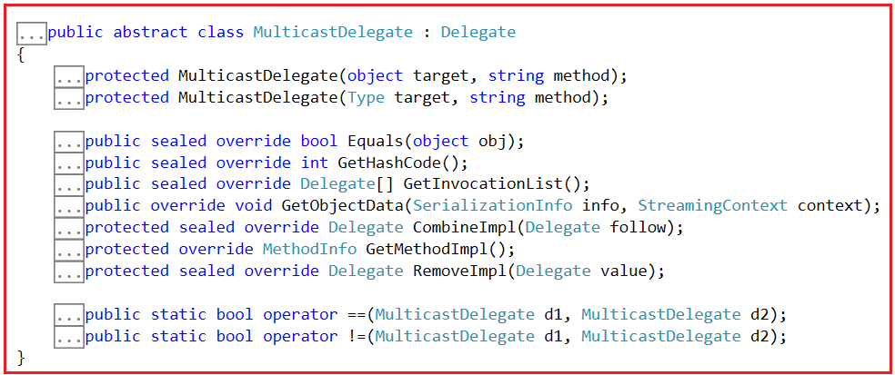

حالا، هر delegate که ایجاد می‌کنیم، پس از کامپایل، از delegate چندپخشی ارث‌بری خواهد کرد. وقتی شروع به برنامه‌نویسی کنیم، این را با نشان دادن کد کامپایل شده، یعنی کد IL با استفاده از ابزار ILDASM، به صورت عملی به شما نشان خواهم داد.

بنابراین، Multicast Delegate راهی برای نگهداری چندین delegate است. به عنوان مثال، من یک پیام دارم که می‌خواهم از طریق چندین pipeline ارسال کنم که داده‌های یکسان را در چندین Handler Method قرار می‌دهند. بنابراین، delegate سفارشی شما، همانطور که قبلاً در مورد آن صحبت کردیم، از Multicast Delegate ارث بری خواهد کرد. سلسله مراتب کامل در زیر آورده شده است.

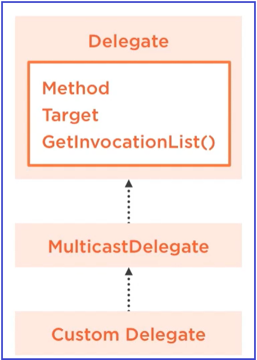

**نکته:** نکته‌ای که باید به خاطر داشته باشید این است که در کد خود هنگام تعریف نماینده، نمی‌توانید مستقیماً از کلاس‌های Delegate یا Multicast Delegate ارث‌بری کنید. روشی که باید این کار را انجام دهید استفاده از کلمه کلیدی delegate است و بقیه کارها توسط کامپایلر انجام می‌شود. اینها کلاس‌های پایه ویژه‌ای هستند که کامپایلر ما را از ارث‌بری مستقیم آنها منع می‌کند. به محض اینکه کامپایلر کلمه کلیدی delegate را در امضا ببیند، به طور خودکار کلاسی را که از Multicast Delegate ارث‌بری می‌کند، تولید می‌کند.

##### **چگونه از Delegate در سی شارپ استفاده کنیم؟**

نحوه استفاده از delegate به این معنی است که چگونه قرار است از delegate برای جابجایی داده‌ها استفاده کنیم. برای این کار، باید یک نمونه از delegate ایجاد کنیم. و هنگام ایجاد نمونه، باید نام متد Handler را که می‌خواهیم داده‌ها را در آن قرار دهیم، مشخص کنیم. اگر متد Handler یک متد استاتیک باشد، می‌توانید مستقیماً یا با استفاده از نام کلاس به آن متد دسترسی پیدا کنید و اگر متد Handler یک متد غیر استاتیک باشد، باید با استفاده از نام شیء به متد Handler دسترسی پیدا کنید. برای درک بهتر، لطفاً به تصویر زیر نگاهی بیندازید.

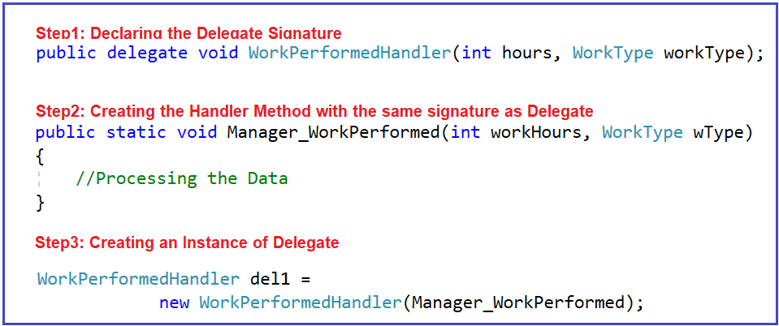

وقتی یک delegate تعریف می‌کنیم، در پشت صحنه وقتی کامپایلر کلمه کلیدی delegate را می‌بیند، یک کلاس ایجاد می‌کند که از MulticastDelegate ارث‌بری می‌کند و از آنجایی که این یک کلاس است، می‌توانیم با استفاده از کلمه کلیدی new یک نمونه از delegate ایجاد کنیم. و به سازنده توجه کنید که ما نام متد handler Delegate را ارسال می‌کنیم. در مثال ما، از آنجایی که متد Handler یک متد استاتیک است و از آنجایی که هم متد و هم نمونه‌ای که ایجاد می‌کنیم در یک کلاس وجود دارند، می‌توانیم نام متد را بدون استفاده از نام کلاس ارسال کنیم، حتی اگر از نام کلاس استفاده کنید، مشکلی پیش نمی‌آید. اما اگر متد غیر استاتیک باشد، باید یک نمونه از کلاسی که متد به آن تعلق دارد ایجاد کنید و با استفاده از آن نمونه، باید متد را درون سازنده delegate فراخوانی کنید.

##### **چگونه یک delegate را در سی شارپ فراخوانی کنیم؟**

فراخوانی یک delegate بسیار ساده است. همانطور که یک متد را فراخوانی می‌کنیم، می‌توانیم یک delegate را نیز فراخوانی کنیم و مقادیر پارامترهایی که باید درون پرانتز ارسال کنیم به شرح زیر است. در اینجا، ما عدد ۵ را به عنوان ساعات کاری و عدد WorkType را به عنوان Golf ارسال می‌کنیم.

**بخش ۱(۱۰، WorkType.Golf)؛**

و دستور بالا، متد handler به نام Manager\_WorkPerformed را به صورت پویا در زمان اجرا فراخوانی می‌کند. برای درک بهتر، لطفاً به تصویر زیر نگاهی بیندازید.

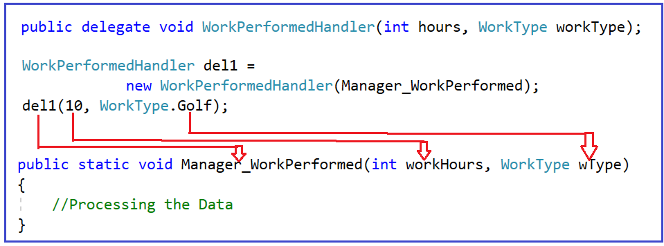

زمانی که یک نمونه از یک delegate ایجاد می‌کنیم، باید با ارائه مقادیر مورد نیاز به پارامترها، delegate را فراخوانی کنیم تا متدها به صورت داخلی که به delegateها متصل است، اجرا شوند. همچنین می‌توانیم از متد Invoke برای اجرای delegateها استفاده کنیم. به عنوان مثال:

**del1.Invoke(10, WorkType.Golf);**

##### **کد کامل مثال در زیر آمده است.**

```csharp
using System;

namespace DelegatesDemo
{
    public delegate void WorkPerformedHandler(int hours, WorkType workType);

    class Program
    {
        static void Main(string[] args)
        {
            WorkPerformedHandler del1 = 
                        new WorkPerformedHandler(Manager_WorkPerformed);
            del1(10, WorkType.Golf);
            //del1.Invoke(50, WorkType.GotoMeetings);

            Console.ReadKey();
        }

        public static void Manager_WorkPerformed(int workHours, WorkType wType)
        {
            Console.WriteLine("Work Performed by Event Handler");
            Console.WriteLine($"Work Hours: {workHours}, Work Type: {wType}");
        }
    }

    public enum WorkType
    {
        Golf,
        GotoMeetings,
        GenerateReports
    }
}
```

###### **خروجی:**

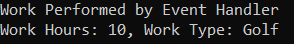

اشکالی ندارد. اکنون می‌توانید ببینید که متد Handler داده‌ها را از pipeline دریافت کرده و سپس داده‌ها را پردازش می‌کند. حال، اجازه دهید کد IL مربوط به delegate خود را با استفاده از ابزار ILDASM بررسی کنیم و کد زیر را خواهید دید. همانطور که در کد زیر مشاهده می‌کنید، این یک کلاس sealed است که از کلاس MulticastDelegate ارث‌بری می‌کند و این کلاس یک سازنده دارد.

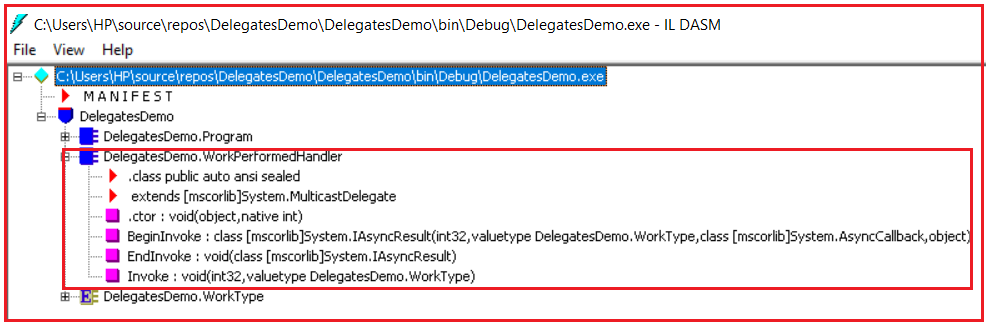

##### **چگونه می‌توان متدها را با استفاده از Delegateها در سی شارپ فراخوانی کرد؟**

اگر می‌خواهید با استفاده از delegateها، متدی را فراخوانی یا احضار کنید، باید سه مرحله زیر را دنبال کنید.

1. **اعلام نماینده**
2. **نمونه‌سازی یک نماینده**
3. **فراخوانی یک نماینده**

##### **مثال دیگری برای درک delegate ها در سی شارپ:**

از delegate ها برای فراخوانی توابع call-back استفاده می‌شود. به این معنی که ما یک تابع را فراخوانی می‌کنیم و نمونه delegate را به عنوان پارامتر به آن تابع ارسال می‌کنیم و انتظار داریم که آن تابع در مقطعی از زمان delegate را فراخوانی کند که متد callback ارجاع شده توسط نمونه delegate را فراخوانی می‌کند.

همانطور که در مثال زیر مشاهده می‌کنید، ما دو متد داریم: DoSomework و CallbackMethod. می‌خواهیم از متد اصلی خود، متد DoSomework را فراخوانی کنیم، اما همچنین می‌خواهیم متد DoSomework یک متد را به صورت پویا در زمان اجرا فراخوانی کند و آن متد را در زمان اجرا ارائه دهیم. برای انجام این کار، می‌خواهیم متد DoSomework، delegate را به عنوان پارامتر بپذیرد و در مقطعی، باید delegate را درون متد DoSomework فراخوانی کنیم. در اینجا، ما یک نمونه از delegate را درون متد اصلی ایجاد می‌کنیم که به CallbackMethod اشاره می‌کند و آن نمونه delegate را به عنوان یک مقدار به متد DoSomework ارسال می‌کنیم و در زمان اجرا، زمانی که متد DoSomework، delegate را فراخوانی می‌کند، متدی که توسط delegate به آن اشاره شده است، اجرا خواهد شد. در این حالت، متد CallbackMethod اجرا خواهد شد.

```csharp
using System;

namespace DelegatesDemo
{
    public delegate void CallbackMethodHandler(string message);

    class Program
    {
        static void Main(string[] args)
        {
            Program obj = new Program();
            CallbackMethodHandler del1 = new CallbackMethodHandler(obj.CallbackMethod);
            //Here, I am calling the DoSomework function and I want the 
            //DoSomework function to call the delegate at some point of time
            //which will invoke the CallbackMethod method
            DoSomework(del1);

            Console.ReadKey();
        }

        public static void DoSomework(CallbackMethodHandler del)
        {
            Console.WriteLine("Processing some Task");
            del("Pranaya");
        }

        public void CallbackMethod(string message)
        {
            Console.WriteLine("CallbackMethod Executed");
            Console.WriteLine($"Hello: {message}, Good Morning");
        }
    }
}
```

###### **خروجی:**

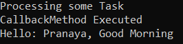

##### **مثال برای درک ویژگی‌ها و متدهای مهم کلاس Delegate در سی شارپ:**

در ابتدای این مقاله، دو ویژگی مهم یعنی Method و Target و یک روش مهم از کلاس Delegate یعنی GetInvocationList را مورد بحث قرار دادیم. حال، بیایید کاربرد این ویژگی‌ها و روش را با یک مثال بررسی کنیم. در مثال زیر، یک delegate و یک متد نمونه ایجاد کرده‌ایم که توسط delegate ارجاع داده می‌شود. سپس در متد Main، یک نمونه ایجاد می‌کنیم و ویژگی‌ها و روش را فراخوانی می‌کنیم. در اینجا، متدی که توسط delegate به آن اشاره می‌شود، نمونه اولیه آن متد توسط ویژگی Method بازگردانده می‌شود، که در مثال ما **Void DoSomework(System.String)** خواهد بود . ویژگی Target نام کلاس کاملاً واجد شرایط را که متد event handler یعنی SomeMethod به آن تعلق دارد، برمی‌گرداند که در مثال ما **DelegatesDemo.SomeClass** است . متد GetInvocationList لیستی از delegateهایی را که توسط delegate ارجاع داده شده‌اند، برمی‌گرداند و در این حالت، فقط یک delegate یعنی **DoSomeMethodHandler** . در مقاله بعدی، به بررسی نماینده چندپخشی (multicast delegate) خواهیم پرداخت و در این صورت، چندین نماینده (delegate) را برمی‌گرداند.

```csharp
using System;
using System.Reflection;

namespace DelegatesDemo
{
    public delegate void DoSomeMethodHandler(string message);

    class Program
    {
        static void Main(string[] args)
        {
            SomeClass obj = new SomeClass();
            DoSomeMethodHandler del1 = new DoSomeMethodHandler(obj.DoSomework);

            MethodInfo Method = del1.Method;
            object Target = del1.Target;
            Delegate[] InvocationList = del1.GetInvocationList();

            Console.WriteLine($"Method Property: {Method}");
            Console.WriteLine($"Target Property: {Target}");
           
            foreach (var item in InvocationList)
            {
                Console.WriteLine($"InvocationList: {item}");
            }
            
            Console.ReadKey();
        }
    }

    public class SomeClass
    {
        public void DoSomework(string message)
        {
            Console.WriteLine("DoSomework Executed");
            Console.WriteLine($"Hello: {message}, Good Morning");
        }
    }
}
```

###### **خروجی:**

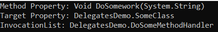

**نکته:** اگر متد، یک متد استاتیک باشد، آنگاه ویژگی Target مقدار null را برمی‌گرداند.

##### **قوانین استفاده از Delegate ها در سی شارپ:**

1. یک delegate در سی شارپ یک نوع تعریف شده توسط کاربر است و از این رو قبل از فراخوانی یک متد با استفاده از delegate، ابتدا باید آن delegate را تعریف کنیم.
2. امضای delegate باید با امضای متدی که delegate به آن اشاره می‌کند، مطابقت داشته باشد، در غیر این صورت با خطای کامپایلر مواجه خواهیم شد. به همین دلیل است که delegateها، اشاره‌گرهای تابع type-safe نامیده می‌شوند.

##### **انواع delegate ها در سی شارپ چیست؟**

Delegate ها در سی شارپ به دو نوع تقسیم می شوند:

1. **نماینده‌ی تک‌پخشی**
2. **نماینده چندپخشی**

اگر از یک delegate برای فراخوانی یک متد واحد استفاده شود، به آن single cast delegate یا unicast delegate گفته می‌شود. به عبارت دیگر، می‌توانیم بگوییم delegateهایی که فقط یک تابع واحد را نشان می‌دهند، به عنوان single cast delegate شناخته می‌شوند.

اگر از یک delegate برای فراخوانی چندین متد استفاده شود، به آن delegate چندپخشی (multicast delegate) گفته می‌شود. یا delegateهایی که بیش از یک تابع را نشان می‌دهند، delegateهای چندپخشی (Multicast delegates) نامیده می‌شوند.

##### **در سی شارپ از Delegate ها کجا استفاده می کنیم؟**

از نمایندگان در موارد زیر استفاده می‌شود:

1. کنترل‌کننده‌های رویداد
2. تماس‌های برگشتی
3. ارسال متدها به عنوان پارامترهای متد
4. لینک
5. چندنخی

##### **به چند روش می‌توانیم یک متد را در سی شارپ فراخوانی کنیم؟**

در سی شارپ، می‌توانیم متدی را که در یک کلاس تعریف شده است، به دو روش فراخوانی کنیم. این دو روش به شرح زیر هستند:

1. اگر متد غیراستاتیک باشد، می‌توانیم آن را با استفاده از شیء کلاس فراخوانی کنیم، یا اگر متد استاتیک باشد، می‌توانیم آن را از طریق نام کلاس فراخوانی کنیم.
2. ما همچنین می‌توانیم یک متد را در سی شارپ با استفاده از delegate ها فراخوانی کنیم. فراخوانی یک متد سی شارپ با استفاده از delegate در مقایسه با فرآیند اول، یعنی استفاده از یک شیء یا استفاده از نام کلاس، سریع‌تر اجرا خواهد شد.