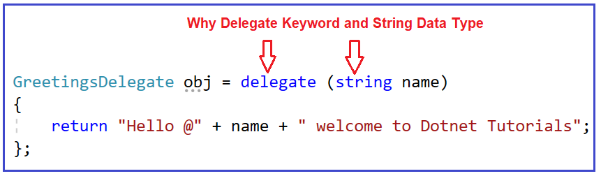
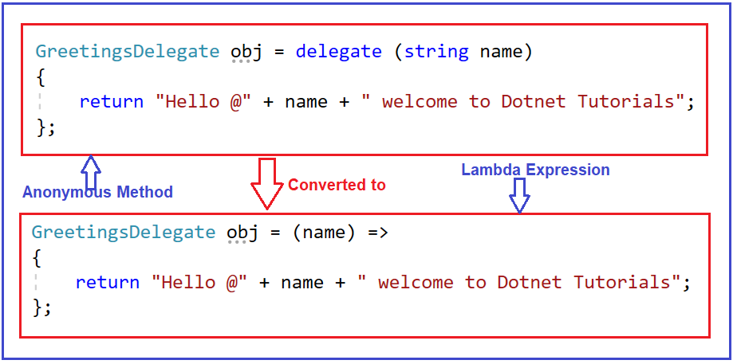

## **عبارات لامبدا در سی شارپ به همراه مثال**

در این مقاله، قصد دارم **عبارات لامبدا در سی شارپ را** با مثال‌هایی پرداختیم، مطالعه کنید. به عنوان بخشی از این مقاله، قصد داریم نکات زیر را به تفصیل مورد بحث قرار دهیم.

1. **عبارات لامبدا در سی شارپ چیست؟**
2. **چرا به عبارات لامبدا نیاز داریم؟**
3. **چگونه می‌توان عبارات لامبدا را در سی شارپ ایجاد کرد؟**
4. **مثال‌هایی از استفاده از عبارات لامبدا**

##### **عبارات لامبدا در سی شارپ چیست؟**

عبارت لامبدا در سی شارپ، خلاصه نویسی برای نوشتن تابع ناشناس است. بنابراین، می‌توان گفت که عبارت لامبدا چیزی جز ساده‌سازی تابع ناشناس در سی شارپ نیست و همچنین بحث کردیم که توابع ناشناس با delegate مرتبط هستند و با استفاده از کلمه کلیدی delegate ایجاد می‌شوند.

بنابراین، کاری که ما انجام خواهیم داد این است که ابتدا یک مثال با استفاده از delegate و با استفاده از یک تابع ie بلوک نامگذاری شده ایجاد می‌کنیم و سپس همان مثال را با استفاده از متد ناشناس تبدیل می‌کنیم و در نهایت در مورد مشکلات متد ناشناس و نحوه غلبه بر آنها با استفاده از عبارات لامبدا بحث خواهیم کرد.

##### **مثال برای درک استفاده از متد Delegate در سی شارپ:**

در مثال زیر، ما یک delegate و یک متد با امضای یکسان ایجاد می‌کنیم و سپس متد را با نمونه delegate ثبت می‌کنیم و وقتی delegate را فراخوانی می‌کنیم، متدی که با delegate ثبت شده است اجرا خواهد شد.

```csharp
using System;

namespace LambdaExpressionDemo
{
    public class LambdaExpression
    {
        public delegate string GreetingsDelegate(string name);

        static void Main(string[] args)
        {
            GreetingsDelegate obj = new GreetingsDelegate(LambdaExpression.Greetings);
            string GreetingsMessage = obj.Invoke("Pranaya");
            Console.WriteLine(GreetingsMessage);
            Console.ReadKey();
        }

        public static string Greetings(string name)
        {
            return "Hello @" + name + " welcome to Dotnet Tutorials";
        }
    }
}
```

**خروجی: سلام @Pranaya به آموزش‌های دات‌نت خوش آمدید**

##### **تفویض اختیار با استفاده از متد ناشناس در سی شارپ:**

در مثال قبلی، ما هنگام ایجاد نمونه delegate از یک بلوک نامگذاری شده استفاده کردیم. به جای یک بلوک نامگذاری شده، می‌توانیم یک بلوک بدون نام نیز ارائه دهیم که متد ناشناس نامیده می‌شود. متدهای ناشناس با استفاده از کلمه کلیدی delegate ایجاد می‌شوند و وقتی delegate را فراخوانی می‌کنیم، متد ناشناس اجرا می‌شود. لطفاً به مثال زیر نگاهی بیندازید. این همان مثال قبلی است و این مثال نیز همان خروجی را به شما می‌دهد. در اینجا، به جای یک بلوک نامگذاری شده، از یک بلوک بدون نام استفاده می‌کنیم.

```csharp
using System;

namespace LambdaExpressionDemo
{
    public class LambdaExpression
    {
        public delegate string GreetingsDelegate(string name);

        static void Main(string[] args)
        {
            GreetingsDelegate obj = delegate (string name)
            {
                return "Hello @" + name + " welcome to Dotnet Tutorials";
            };
            string GreetingsMessage = obj.Invoke("Pranaya");
            Console.WriteLine(GreetingsMessage);
            Console.ReadKey();
        }
    }
}
```

**خروجی: سلام @Pranaya به آموزش‌های دات‌نت خوش آمدید**

در اینجا، شما باید دو نکته را درک کنید. از آنجایی که ما از متد ناشناس در سی شارپ برای نوشتن مطالب کمتر استفاده می‌کنیم، پس چرا باید از کلمه کلیدی delegate استفاده کنیم؟ و نکته دوم این است که از آنجایی که delegate از نوع بازگشتی و نوع پارامتر ورودی که می‌پذیرد آگاه است، پس چرا باید نوع پارامتری را که delegate می‌پذیرد، به صراحت مشخص کنیم؟



در مثال ما، چگونه می‌توانیم کلمه کلیدی delegate و نوع داده رشته‌ای پارامتر نام ورودی را حذف کنیم؟ می‌توانیم با استفاده از عبارات لامبدا که در C# 3.0 معرفی شدند، بر این مشکل غلبه کنیم.

##### **چگونه عبارات لامبدا را در سی شارپ ایجاد کنیم؟**

برای ایجاد یک عبارت لامبدا در سی شارپ، باید پارامترهای ورودی (در صورت وجود) را در سمت چپ عملگر لامبدا **\=>** مشخص کنیم و باید عبارت یا بلوک دستور را درون آکولادهای باز و بسته قرار دهیم. برای درک بهتر، لطفاً به تصویر زیر نگاهی بیندازید که نحوه تبدیل یک متد ناشناس به یک عبارت لامبدا را نشان می‌دهد. در اینجا، می‌توانید ببینید که ما کلمه کلیدی delegate را با عملگر لامبدا ( **\=>** ) جایگزین کرده‌ایم و همچنین نوع داده پارامتر را حذف کرده‌ایم زیرا delegate نوع پارامتر را می‌داند.



##### **مثال برای درک عبارات لامبدا در سی شارپ:**

بیایید مثال قبلی را با استفاده از عبارت Lambda در C# بازنویسی کنیم. و این بار نیز، همان خروجی را دریافت خواهید کرد.

```csharp
using System;

namespace LambdaExpressionDemo
{
    public class LambdaExpression
    {
        public delegate string GreetingsDelegate(string name);

        static void Main(string[] args)
        {
            GreetingsDelegate obj = (name) =>
            {
                return "Hello @" + name + " welcome to Dotnet Tutorials";
            };

            string GreetingsMessage = obj.Invoke("Pranaya");
            Console.WriteLine(GreetingsMessage);
            Console.ReadKey();
        }

        public static string Greetings(string name)
        {
            return "Hello @" + name + " welcome to Dotnet Tutorials";
        }
    }
}
```

**خروجی: سلام @Pranaya به آموزش‌های دات‌نت خوش آمدید**

**توجه:** در **آموزش‌های LINQ** ، عبارات لامبدا را با مثال‌های بلادرنگ به تفصیل بررسی خواهیم کرد. دلیل این امر این است که عبارات لامبدا به طور گسترده با کوئری‌های LINQ استفاده می‌شوند.