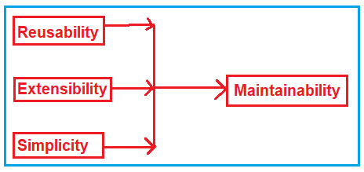
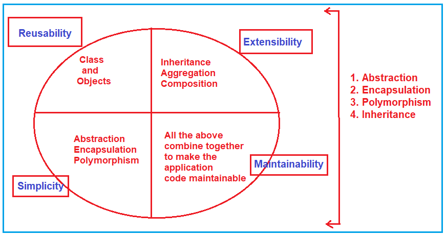
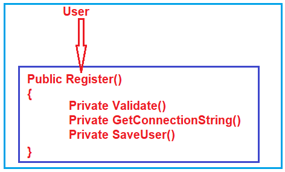

## **برنامه‌نویسی شی‌گرا (OOP) در سی‌شارپ | مفهوم OOP در سی‌شارپ**

در این مقاله، مروری بر برنامه‌نویسی شی‌گرا (OOPs) در سی‌شارپ خواهم داشت، یعنی اصول OOPs در سی‌شارپ را مورد بحث قرار خواهم داد. برنامه‌نویسی شی‌گرا، که معمولاً با نام OOPs شناخته می‌شود، یک تکنیک است، نه یک فناوری. این بدان معناست که هیچ نحو یا API ارائه نمی‌دهد. در عوض، پیشنهادهایی برای طراحی و توسعه اشیاء در زبان‌های برنامه‌نویسی ارائه می‌دهد. به عنوان بخشی از این مقاله، مفاهیم OOP زیر را در سی‌شارپ پوشش خواهیم داد.

1. **مشکلات برنامه‌نویسی تابعی چیست؟**
2. **چگونه می‌توانیم بر مشکل برنامه‌نویسی تابعی غلبه کنیم؟**
3. **برنامه‌نویسی شی‌گرا در سی‌شارپ چیست؟**
4. **اصول OOP چیست؟**
5. **چرا به برنامه‌نویسی شی‌گرا در سی‌شارپ نیاز داریم؟**
6. **چرا در یک پروژه به اشیاء دنیای واقعی نیاز داریم؟**
7. **چه نوع زبان‌های برنامه‌نویسی تحت سیستم OOP قرار می‌گیرند؟**
8. **مزایا و معایب برنامه‌نویسی شی‌گرا در سی‌شارپ**

##### **چگونه اپلیکیشن‌ها را توسعه دهیم؟**

برنامه‌نویسی شیءگرا یک استراتژی است که اصولی را برای توسعه برنامه‌ها یا نرم‌افزارها ارائه می‌دهد. این یک روش‌شناسی است. مانند برنامه‌نویسی شیءگرا، روش‌های دیگری مانند برنامه‌نویسی ساخت‌یافته، برنامه‌نویسی رویه‌ای یا برنامه‌نویسی ماژولار نیز وجود دارند. اما امروزه، یکی از سبک‌های شناخته‌شده و معروف، برنامه‌نویسی شیءگرا است.

امروزه تقریباً همه زبان‌های برنامه‌نویسی جدید از شی‌گرایی پشتیبانی می‌کنند. این شی‌گرایی بیشتر مربوط به طراحی نرم‌افزار است و با طراحی داخلی نرم‌افزار سروکار دارد، نه طراحی خارجی. بنابراین، هیچ ارتباطی با کاربران نرم‌افزار ندارد. این مربوط به برنامه‌نویسانی است که روی توسعه نرم‌افزار کار می‌کنند.

با کمک شی‌گرایی، توسعه یا برنامه‌نویسی اپلیکیشن بیش از پیش سیستماتیک می‌شود و ما می‌توانیم رویه‌های مهندسی را برای توسعه نرم‌افزار دنبال کنیم. مانند سایر مهندسی‌ها، نحوه توسعه یک محصول، به همان شیوه، یک محصول نرم‌افزاری با اتخاذ شی‌گرایی توسعه می‌یابد.

اگر کمی در مورد مهندسی‌های دیگر صحبت کنیم، مانند یک مهندس عمران که در حال ساخت یک ساختمان است، اول از همه، او یک نقشه یا طرح تهیه می‌کند. در حین تهیه یک طرح یا نقشه، ممکن است گزینه‌های زیادی داشته باشد، اما یکی از طرح‌ها را انتخاب و نهایی می‌کند. سپس، پس از نهایی شدن آن به عنوان یک طرح اولیه روی کاغذ، شروع به ساخت می‌کند. به همین ترتیب، یک مهندس الکترونیک، هنگام ساخت هر دستگاهی، طرحی را ارائه می‌دهد که همان طراحی مدار آن دستگاه روی کاغذ است. و پس از نهایی شدن آن طرح یا طرح اولیه، شروع به ساخت دستگاه می‌کند.

بنابراین، **شی‌گرایی** کاملاً به این بستگی دارد که ما سیستم داخلی را چگونه می‌بینیم یا آن را چگونه درک می‌کنیم. بنابراین، اگر سیستم را به طور ایده‌آل درک کنید و اگر دیدگاه شما بسیار واضح باشد، می‌توانید سیستم بهتری توسعه دهید.

##### **برنامه‌نویسی شیءگرا در مقابل برنامه‌نویسی ماژولار**

حالا، من شیءگرایی را با مقایسه آن با برنامه‌نویسی ماژولار برای شما توضیح می‌دهم. دلیلش این است که افرادی که برای یادگیری سی‌شارپ آمده‌اند، از قبل زبان سی را می‌دانند. زبان برنامه‌نویسی سی از برنامه‌نویسی ماژولار یا رویه‌ای پشتیبانی می‌کند. بر این اساس، می‌توانم به شما ایده‌ای از تفاوت شیءگرایی با برنامه‌نویسی ماژولار بدهم. بیایید برنامه‌نویسی شیءگرا را در مقابل برنامه‌نویسی ماژولار با چند مثال مقایسه کنیم.

بنابراین ابتدا، ما یک مثال از یک بانک می‌زنیم. اگر شما در حال توسعه یک برنامه برای یک بانک با استفاده از برنامه‌نویسی ماژولار هستید، سیستم را چگونه می‌بینید، نحوه کار یک بانک را چگونه می‌بینید و طراحی شما چه خواهد بود؟ این بستگی به این دارد که چگونه آن را درک می‌کنید و چگونه سیستم را می‌بینید. بنابراین، بیایید ببینیم که چگونه به سیستم بانک با استفاده از برنامه‌نویسی ماژولار نگاه می‌کنیم.

در یک بانک، می‌توانید حساب باز کنید، مبلغی را واریز کنید، مبلغی را برداشت کنید، موجودی حساب خود را بررسی کنید، یا می‌توانید درخواست وام دهید و غیره. بنابراین، اینها کارهایی هستند که می‌توانید در بانک انجام دهید.

بنابراین، **افتتاح حساب، واریز پول، برداشت پول، بررسی موجودی و درخواست وام،** تابع هستند. همه اینها چیزی جز تابع نیستند. و شما می‌توانید عملیات خاص را با فراخوانی آن تابع خاص انجام دهید. بنابراین، اگر در حال توسعه نرم‌افزار برای یک بانک هستید، چیزی جز مجموعه‌ای از توابع نیست. بنابراین، برنامه بانکی بر اساس این توابع خواهد بود و کاربر برنامه بانکی از این توابع برای انجام وظیفه مورد نیاز خود استفاده خواهد کرد. بنابراین، شما نرم‌افزار را به عنوان مجموعه‌ای از توابع در برنامه‌نویسی ماژولار توسعه خواهید داد.

حال، برای شی‌گرایی، چند مثال مختلف می‌زنیم. دولت خدمات زیادی مانند برق، آب، آموزش و حمل و نقل ارائه می‌دهد و حتی دولت می‌تواند بانک داشته باشد. بنابراین، اینها بخش‌های مختلف یک دولت هستند. حال، شما به عنوان یک کاربر در بخش برق چه کاری می‌توانید انجام دهید؟ می‌توانید درخواست اتصال جدید دهید، اگر اتصالات اضافی دارید می‌توانید اتصال خود را ببندید، یا می‌توانید قبوض را پرداخت کنید. اینها چه هستند؟ اینها توابعی هستند که متعلق به بخش برق هستند.

حالا، به همین ترتیب، بانک هم آنجاست. همان وظایفی مثل افتتاح حساب، واریز، برداشت، بررسی موجودی، درخواست وام و غیره، آنجا هم هستند. اینها وظایفی هستند که متعلق به بانک هستند.

ما اینها را چه می‌نامیم؟ ما آنها را شیء می‌نامیم. بنابراین، سیستم کامل برای دولت یا یک نرم‌افزار کامل برای یک دولت، مجموعه‌ای از اشیاء است. حال، هر شیء عملکردهای مربوط به خود را دارد. بنابراین، نرم‌افزار کامل مجموعه‌ای از اشیاء است که شامل توابع و داده‌های مربوط به آن توابع است.

در برنامه‌نویسی ماژولار، سیستم مجموعه‌ای از توابع بود. بنابراین، اگر اکنون آنها را مقایسه کنید، در برنامه‌نویسی ماژولار، ما به سطح بسیار نزدیک نگاه می‌کنیم و در برنامه‌نویسی شیءگرا، به سطح کمی دورتر نگاه می‌کنیم.

##### **چرا شی گرایی؟**

بیایید در مورد یک شرکت تولیدی که خودرو یا وسایل نقلیه تولید می‌کند صحبت کنیم. اگر به آن مزرعه تولیدی نگاه کنید، ممکن است به شکل دپارتمان‌هایی کار کند، مثلاً یکی دپارتمان موجودی است که موجودی مواد اولیه را نگهداری می‌کند و دیگری بخش تولید است که کار تولیدی را انجام می‌دهد و یک دپارتمان به فروش رسیدگی می‌کند و یک دپارتمان به بازاریابی رسیدگی می‌کند. یکی مربوط به حقوق و دستمزد است و دیگری مربوط به حسابداری و غیره. بنابراین، ممکن است دپارتمان‌های زیادی وجود داشته باشد.

فرض کنید شما در حال توسعه نرم‌افزاری فقط برای اهداف حقوق و دستمزد یا موجودی کالا هستید. در این صورت، می‌توانید به سیستم درست مانند یک رویکرد ماژولار نگاه کنید و در آن، می‌توانید توابعی مانند ثبت سفارش و بررسی موجودی کالا را پیدا کنید. این نوع موارد می‌توانند مجموعه‌ای از توابع داشته باشند تا بتوانید نرم‌افزار را فقط برای سیستم موجودی کالا به عنوان مجموعه‌ای از توابع توسعه دهید. با این حال، هنگام توسعه نرم‌افزار برای کل سازمان، باید چیزها را در قالب اشیاء ببینید.

بنابراین، اقلام موجودی یک شیء هستند، یک کارمند یک شیء است، یک حساب یک شیء است و یک تولیدکننده محصول یک شیء است. ماشین‌آلات مورد استفاده برای تولید یک شیء هستند. بنابراین، همه این چیزها شیء هستند. در اینجا، شما باید چیزها را به شکل اشیاء ببینید و داده‌های آنها و عملکردهایی را که انجام می‌دهند تعریف کنید. ما در سطح بالاتری به سیستم نگاه می‌کنیم. بنابراین، می‌توانیم جهت‌گیری شیء را اتخاذ کنیم.

##### **مشکلات برنامه‌نویسی ماژولار چیست؟**

برنامه‌نویسی ماژولار مشکلات زیر را دارد.

1. قابلیت استفاده مجدد
2. توسعه‌پذیری
3. سادگی
4. قابلیت نگهداری

**قابلیت استفاده مجدد:** در برنامه‌نویسی ماژولار، ما باید کد یا منطق یکسانی را در چندین جا بنویسیم که باعث افزایش تکرار کد می‌شود. بعداً، اگر بخواهیم منطق را تغییر دهیم، باید آن را در همه جا تغییر دهیم.

**توسعه‌پذیری:** در برنامه‌نویسی ماژولار امکان گسترش ویژگی‌های یک تابع وجود ندارد. فرض کنید تابعی دارید و می‌خواهید آن را با برخی ویژگی‌های اضافی گسترش دهید؛ در این صورت این کار امکان‌پذیر نیست. شما باید یک تابع کاملاً جدید ایجاد کنید و سپس تابع را مطابق نیاز خود تغییر دهید.

**سادگی:** از آنجایی که توسعه‌پذیری و قابلیت استفاده مجدد در برنامه‌نویسی ماژولار غیرممکن است، معمولاً در نهایت با توابع زیاد و کدهای پراکنده مواجه می‌شویم.

**قابلیت نگهداری:** از آنجایی که در برنامه‌نویسی ماژولار، قابلیت استفاده مجدد، توسعه‌پذیری و سادگی را نداریم، مدیریت و نگهداری کد برنامه بسیار دشوار است.

##### **چگونه می‌توانیم بر مشکلات برنامه‌نویسی ماژولار غلبه کنیم؟**

ما می‌توانیم با استفاده از برنامه‌نویسی شیءگرا بر مشکلات برنامه‌نویسی ماژولار (قابلیت استفاده مجدد، توسعه‌پذیری، سادگی و قابلیت نگهداری) غلبه کنیم. برنامه‌نویسی شیءگرا اصولی را ارائه می‌دهد و با استفاده از آن اصول، می‌توانیم بر مشکلات برنامه‌نویسی ماژولار غلبه کنیم.

##### **برنامه‌نویسی شیءگرا چیست؟**

بیایید برنامه‌نویسی شیءگرا، یعنی مفاهیم OOP را با استفاده از C# درک کنیم. برنامه‌نویسی شیءگرا (OOPs) در C# یک رویکرد طراحی است که در آن ما به جای توابع یا متدها، به اشیاء دنیای واقعی فکر می‌کنیم. برخلاف زبان برنامه‌نویسی رویه‌ای، در OOPs، برنامه‌ها به جای عمل و منطق، حول اشیاء و داده‌ها سازماندهی می‌شوند. لطفاً برای درک بهتر این موضوع، به نمودار زیر نگاهی بیندازید.

###### **قابلیت استفاده مجدد:**

برای پرداختن به قابلیت استفاده مجدد، برنامه‌نویسی شی‌گرا چیزی به نام کلاس‌ها و اشیاء را ارائه می‌دهد. بنابراین، به جای کپی کردن مکرر کد یکسان در مکان‌های مختلف، می‌توانید یک کلاس ایجاد کنید و نمونه‌ای از کلاس، که یک شیء نامیده می‌شود، بسازید و هر زمان که خواستید از آن استفاده مجدد کنید.

###### **قابلیت توسعه:**

فرض کنید یک تابع دارید و می‌خواهید آن را با ویژگی‌های جدیدی که با برنامه‌نویسی تابعی غیرممکن بودند، گسترش دهید. شما باید یک تابع کاملاً جدید ایجاد کنید و سپس کل تابع را به هر چیزی که می‌خواهید تغییر دهید. در برنامه‌نویسی شیءگرا، این مشکل با استفاده از مفاهیمی به نام وراثت (Inheritance)، تجمیع (Aggregation) و ترکیب (Composition) حل می‌شود. در مقاله بعدی، به تفصیل در مورد همه این مفاهیم صحبت خواهیم کرد.

###### **سادگی:**

چون در برنامه نویسی ماژولار قابلیت توسعه پذیری و استفاده مجدد نداریم، در نهایت با توابع زیاد و کدهای پراکنده مواجه می شویم و از هر جایی که بتوانیم به توابع دسترسی داشته باشیم، امنیت کمتر است. در OOP ها این مشکل با استفاده از مفاهیم Abstraction، Encapsulation و Polymorphism حل می شود.

###### **قابلیت نگهداری:**

از آنجایی که OOPها به قابلیت استفاده مجدد، توسعه‌پذیری و سادگی می‌پردازند، ما کد خوب، قابل نگهداری و تمیزی داریم که قابلیت نگهداری برنامه را افزایش می‌دهد.

##### **اصول یا مفاهیم OOP در سی شارپ چیست؟**

برنامه‌نویسی شیءگرا (OOP) چهار اصل ارائه می‌دهد. آنها عبارتند از:

1. **کپسوله سازی**
2. **وراثت**
3. **چندریختی**
4. **انتزاع**

**نکته:** کلاس و اشیاء را به عنوان اصول OOP در نظر نگیرید. ما از کلاس‌ها و اشیاء برای پیاده‌سازی اصول OOP استفاده می‌کنیم.

بیایید در این جلسه تعاریف اصل OOPs را درک کنیم. از مقاله بعدی به بعد، با استفاده از چند مثال واقعی، تمام این اصول را به تفصیل مورد بحث قرار خواهیم داد.

##### **انتزاع و کپسوله‌سازی چیست؟**

فرآیند نمایش ویژگی‌های اساسی بدون گنجاندن جزئیات پس‌زمینه، **انتزاع (Abstraction)** نامیده می‌شود . به عبارت ساده، می‌توان گفت که این فرآیند تعریف یک کلاس با ارائه جزئیات لازم به دنیای خارج است که با پنهان کردن یا حذف موارد غیرضروری مورد نیاز است.

فرآیند اتصال داده‌ها و توابع به یکدیگر در یک واحد واحد (یعنی کلاس) **کپسوله‌سازی (Encapsulation**نامیده می‌شود . به عبارت ساده، می‌توان گفت که این فرآیند تعریف یک کلاس با پنهان کردن اعضای داده داخلی آن از خارج از کلاس و دسترسی به آن اعضای داده داخلی فقط از طریق متدها یا ویژگی‌های در معرض دید عموم است. کپسوله‌سازی داده‌ها، پنهان‌سازی داده‌ها نیز نامیده می‌شود زیرا با استفاده از این اصل، می‌توانیم داده‌های داخلی را از خارج از کلاس پنهان کنیم.

انتزاع و کپسوله‌سازی به یکدیگر مرتبط هستند. می‌توانیم بگوییم که انتزاع تفکر منطقی است، در حالی که کپسوله‌سازی پیاده‌سازی فیزیکی آن است.

##### **درک انتزاع و کپسوله‌سازی با یک مثال:**

بیایید اصول انتزاع و کپسوله‌سازی را با یک مثال درک کنیم. فرض کنید می‌خواهید یک کلاس برای ارائه قابلیت ثبت نام یک کاربر طراحی کنید. برای این کار، کاری که باید انجام دهید این است که ابتدا داده‌ها را دریافت و اعتبارسنجی کنید، سپس باید رشته اتصال پایگاه داده را دریافت کنید و در نهایت، داده‌ها را در پایگاه داده ذخیره کنید. و برای این کار، شما سه متد دارید، یعنی Validate، GetConnectionString و SaveUser. اگر به کاربران این کلاس دسترسی به این سه متد را بدهید، ممکن است آنها این متدها را به ترتیب اشتباه فراخوانی کنند، یا ممکن است فراموش کنند که هر یک از این متدها را فراخوانی کنند.

بنابراین، در اینجا، شما باید یک متد به نام Register ایجاد کنید و به عنوان بخشی از آن متد، باید تمام این متدها (Validate، GetConnectionString و SaveUser) را به ترتیب مناسب فراخوانی کنید. در نهایت، باید به جای متدهای Validate، GetConnectionString و SaveUser، به متد Register دسترسی بدهید. این چیزی است که ما در مورد آن بحث کردیم، چیزی جز انتزاع نیست. نحوه پیاده‌سازی این کار چیزی جز کپسوله‌سازی نیست. بنابراین، در اینجا، باید متدهای Validate، GetConnectionString و SaveUser را با یک مشخص‌کننده دسترسی خصوصی ایجاد کنید تا کاربر نتواند به این متدها دسترسی داشته باشد. متد Register را عمومی کنید تا کاربر بتواند به این متد دسترسی داشته باشد، همانطور که در زیر نشان داده شده است.

ما می‌توانیم **به سادگی کد دست یابیم.** از طریق کپسوله‌سازی و انتزاع

##### **وراثت چیست؟**

فرآیندی که طی آن اعضای یک کلاس به کلاس دیگر منتقل می‌شوند، **وراثت** نامیده می‌شود . کلاسی که اعضا از آن منتقل می‌شوند، کلاس والد/پایه/سوپرکلاس نامیده می‌شود و کلاسی که اعضای کلاس والد/پایه/سوپرکلاس را به ارث می‌برد، کلاس مشتق/فرزند/زیرکلاس نامیده می‌شود. ما می‌توانیم **به توسعه‌پذیری کد دست یابیم.** از طریق وراثت

##### **پلی مورفیسم چیست؟**

**چندریختی (Polymorphism)**  از کلمه یونانی گرفته شده است، که در آن Poly به معنی چند و morph به معنی چهره‌ها/رفتارها است. بنابراین، کلمه چندریختی به معنای توانایی گرفتن بیش از یک شکل است. از نظر فنی، می‌توانیم بگوییم که یک تابع/عملگر با گرفتن انواع مختلف مقادیر یا با تعداد متفاوتی از مقادیر، رفتارهای متفاوتی را نشان می‌دهد که به آن **چندریختی (Polymorphism)** می‌گویند . دو نوع چندریختی وجود دارد.

1. چندریختی ایستا/چندریختی زمان کامپایل/اتصال زودهنگام
2. چندریختی پویا/چندریختی زمان اجرا/اتصال دیرهنگام

حاصل می‌شود **چندریختی ایستا با سربارگذاری تابع و سربارگذاری عملگر** حاصل می‌شود **، در حالی که چندریختی پویا با لغو تابع** .

##### **چرا به برنامه‌نویسی شی‌گرا (OOP) در سی‌شارپ نیاز داریم؟**

اگر می‌خواهید اشیاء دنیای واقعی را در یک زبان برنامه‌نویسی برای خودکارسازی کسب‌وکار با دستیابی به **قابلیت استفاده مجدد، توسعه‌پذیری، سادگی و قابلیت نگهداری** نمایش دهید ، به مفهوم OOPs نیاز دارید. OOPs اصولی را ارائه می‌دهد و با استفاده از آن اصول، می‌توانیم اشیاء دنیای واقعی را در یک زبان برنامه‌نویسی با دستیابی به قابلیت استفاده مجدد، توسعه‌پذیری، سادگی و قابلیت نگهداری توسعه دهیم.

همه موجودات زنده و غیر زنده شیء محسوب می‌شوند. بنابراین اشیاء دنیای واقعی مانند اشخاص، حیوانات، دوچرخه‌ها، کامپیوترها و غیره را می‌توان با استفاده از مفهوم OOPs در زبان‌های برنامه‌نویسی شیءگرا توسعه داد.

##### **چرا در یک پروژه به اشیاء دنیای واقعی نیاز داریم؟**

ما در یک پروژه به اشیاء دنیای واقعی نیاز داریم زیرا اشیاء دنیای واقعی بخشی از کسب و کار ما هستند. از آنجایی که ما در حال توسعه برنامه‌های کاربردی (نرم‌افزار) برای خودکارسازی کسب و کار هستیم، باید اشیاء دنیای واقعی مرتبط با کسب و کار را در پروژه ایجاد کنیم.

برای مثال، برای خودکارسازی کسب‌وکار بانک، باید اشیاء دنیای واقعی مانند مشتریان، مدیران، کارمندان، دستیاران اداری، مدیران بازاریابی، رایانه‌ها، چاپگرها، صندلی‌ها، میزها و غیره ایجاد کنیم. بنابراین، همراه با شیء بانک، باید تمام اشیاء فوق را نیز ایجاد کنیم زیرا بدون همه اشیاء فوق، نمی‌توانیم یک کسب‌وکار بانکی را اداره کنیم. از نظر فنی، اشیاء فوق را اشیاء تجاری می‌نامیم.

##### **چه نوع زبان‌های برنامه‌نویسی تحت سیستم OOP قرار می‌گیرند؟**

زبان‌های برنامه‌نویسی که هر چهار اصل ارائه شده توسط OOPها را پیاده‌سازی می‌کنند، زبان‌های برنامه‌نویسی شیءگرا نامیده می‌شوند، برای مثال، جاوا، سی‌شارپ، سی‌پلاس‌پلاس و غیره.

##### **مزایای OOP در سی شارپ:**

در اینجا خلاصه‌ای از مزایا و معایب کلیدی استفاده از مفاهیم OOP در C# آورده شده است:

- **ماژولار بودن:** برنامه‌نویسی شیءگرا با کپسوله‌سازی داده‌ها و رفتار درون کلاس‌ها، کد ماژولار را ترویج می‌دهد. این امر مدیریت و نگهداری پایگاه‌های کد بزرگ را آسان‌تر می‌کند، زیرا می‌توانید به‌طور مستقل روی کلاس‌های منفرد کار کنید.
- **قابلیت استفاده مجدد از کد:** وراثت به شما امکان می‌دهد کلاس‌های جدید را با استفاده مجدد از کلاس‌های موجود (کلاس‌های پایه) ایجاد کنید. این امر باعث کاهش تکرار کد و ترویج رویکرد "یک بار بنویس، بارها استفاده کن" می‌شود.
- **انتزاع:** برنامه‌نویسی شیءگرا به شما امکان می‌دهد کلاس‌ها و رابط‌های انتزاعی ایجاد کنید که یک قرارداد را بدون ارائه جزئیات پیاده‌سازی تعریف می‌کنند. انتزاع با پنهان کردن جزئیات غیرضروری، سیستم‌های پیچیده را ساده می‌کند.
- **چندریختی:** چندریختی شما را قادر می‌سازد کدی بنویسید که بتواند با اشیاء کلاس‌های مختلف از طریق یک رابط مشترک یا کلاس پایه کار کند. این انعطاف‌پذیری، کد را ساده کرده و امکان توسعه‌پذیری را فراهم می‌کند.
- **کپسوله‌سازی:** کپسوله‌سازی دسترسی به وضعیت داخلی اشیاء را محدود می‌کند و یکپارچگی و امنیت داده‌ها را ارتقا می‌دهد. شما می‌توانید دسترسی به فیلدها و متدها را با استفاده از اصلاح‌کننده‌های دسترسی مانند public، private، protected و internal کنترل کنید.
- **نگهداری و اشکال‌زدایی:** ساختار ماژولار و سازمان‌یافته‌ی OOP، اشکال‌زدایی و نگهداری کد را آسان‌تر می‌کند. تغییرات در یک کلاس معمولاً تأثیر محدودی بر سایر بخش‌های کد دارد.
- **مقیاس‌پذیری:** اصول OOP می‌توانند به ایجاد سیستم‌های نرم‌افزاری مقیاس‌پذیر و توسعه‌پذیر کمک کنند. ویژگی‌های جدید اغلب می‌توانند با ایجاد کلاس‌های جدید و گسترش کلاس‌های موجود بدون تغییر کد موجود اضافه شوند.
- **خوانایی:** برنامه‌نویسی شیءگرا (OOP) کدی را ترویج می‌دهد که برای انسان خواناتر و خود-توضیح‌پذیرتر باشد. کلاس‌ها و اشیاء به نهادها و تعاملات دنیای واقعی نزدیک هستند و درک هدف کد را برای توسعه‌دهندگان آسان‌تر می‌کنند.

##### **نکاتی که باید به خاطر داشت:**

1. اصول برنامه‌نویسی شیءگرا یا مفاهیم OOP در سی‌شارپ، اصول طراحی هستند که نشان می‌دهند چگونه باید یک برنامه را توسعه دهیم تا بتوانیم آن را از لایه‌های دیگر پروژه به طور مؤثر و با مقیاس‌پذیری بالا استفاده مجدد کنیم.
2. مقیاس‌پذیری به این معنی است که ما باید پروژه را به گونه‌ای توسعه دهیم که تغییرات آینده را بدون ایجاد تغییرات اساسی در پروژه بپذیرد. تغییرات کوچک نیز باید از فایل‌های خارجی مانند فایل‌های ویژگی‌ها، فایل‌های XML و غیره پذیرفته شوند. مقیاس‌پذیری با توسعه کلاس‌ها با ادغام آنها به روشی با اتصال آزاد (loosely coupled) حاصل می‌شود.
3. ما باید پروژه را با قابلیت مقیاس‌پذیری توسعه دهیم، زیرا رشد کسب و کار وجود خواهد داشت. با توجه به رشد کسب و کار، باید تغییرات لازم را با حداقل تغییرات به پروژه اضافه کنیم.
4. به عنوان یک توسعه‌دهنده، باید به یاد داشته باشیم که در مرحله اولیه کسب و کار، مشتری هرگز سرمایه‌گذاری قابل توجهی انجام نمی‌دهد. با رشد کسب و کار، مشتریان با توجه به نیازهای رو به رشد اضافه شده به پروژه‌ها، سرمایه‌گذاری را افزایش می‌دهند. برای اضافه کردن آن نیازهای جدید، ما نباید کل پروژه را طراحی کنیم.
5. بنابراین، ما باید پروژه را با پیروی از اصول OOP به طور دقیق طراحی کنیم، حتی اگر در مرحله اولیه به آنها نیازی نباشد، اما برای پذیرش تغییرات آینده مورد نیاز است
