## **مشخص‌کننده‌های دسترسی در سی‌شارپ به همراه مثال**

در این مقاله، قصد دارم **به همراه مثال‌هایی در مورد مشخص‌کننده‌های دسترسی در سی‌شارپ** صحبت کنم.. به عنوان بخشی از این مقاله، قصد داریم در مورد نکات زیر که مربوط به مشخص‌کننده‌های دسترسی در سی‌شارپ هستند، صحبت کنیم.

1. **مشخصه‌های دسترسی در سی شارپ چیستند؟**
2. **انواع مختلف مشخص‌کننده‌های دسترسی پشتیبانی‌شده توسط C#.NET کدامند؟**
3. **آشنایی با نوع و اعضای نوع در سی شارپ**
4. **درک مشخصه‌های دسترسی Private، Public، Protected، Internal، Protected Internal و Private Protected در سی‌شارپ به همراه مثال.**

##### **مشخصه‌های دسترسی در سی شارپ چیستند؟**

هر کلمه کلیدی که ما استفاده می‌کنیم مانند private، public، protected، virtual، sealed، partial، abstract، static، base و غیره، اصلاح‌کننده (Modifier) ​​نامیده می‌شود. Access Specifierها انواع خاصی از اصلاح‌کننده‌ها هستند که با استفاده از آنها می‌توانیم دامنه یک نوع و اعضای آن را تعریف کنیم.

بنابراین، به عبارت ساده، می‌توان گفت که از مشخصه‌های دسترسی برای تعریف دامنه نوع ( **کلاس، رابط، ساختارها، نماینده، شمارشی و غیره** ) و همچنین دامنه اعضای آنها ( **متغیرها، ویژگی‌ها، سازنده‌ها و متدها** ) استفاده می‌شود. دامنه به معنای دسترسی یا قابلیت مشاهده است، یعنی چه کسی می‌تواند به آنها دسترسی داشته باشد و چه کسی نمی‌تواند به آنها دسترسی داشته باشد، که توسط مشخصه‌های دسترسی تعریف می‌شوند. ببینید، من یک کلاس با مجموعه‌ای از اعضا دارم، چه کسی می‌تواند از این اعضا استفاده کند و چه کسی نمی‌تواند از این اعضا استفاده کند، که توسط مشخصه‌های دسترسی تعریف می‌شوند.

##### **انواع مختلف تعیین‌کننده‌های دسترسی در سی‌شارپ:**

سی شارپ از 6 نوع مشخص کننده دسترسی پشتیبانی می‌کند. آنها به شرح زیر هستند.

1. **خصوصی**
2. **عمومی**
3. **محافظت شده**
4. **داخلی**
5. **داخلی محافظت‌شده**
6. **خصوصی محافظت‌شده (سی‌شارپ نسخه ۷.۲ به بعد)**

اعضایی که در یک نوع با هر دامنه یا مشخص‌کننده‌ای تعریف می‌شوند، همیشه در داخل آن نوع قابل دسترسی هستند؛ محدودیت فقط زمانی مطرح می‌شود که سعی کنیم به آنها خارج از نوع دسترسی دسترسی پیدا کنیم. هر مشخص‌کننده دسترسی دامنه متفاوتی دارد و اجازه دهید دامنه هر مشخص‌کننده دسترسی را با مثال‌هایی درک کنیم.

**توجه:** من قصد دارم مثال را با استفاده از ویژوال استودیو ۲۰۱۹ توضیح دهم. نسخه قبلی ویژوال استودیو ممکن است از مشخص‌کننده دسترسی جدید private protected پشتیبانی نکند.

##### **درک نوع و اعضای نوع در سی شارپ:**

قبل از درک Access Specifier، ابتدا بیایید بفهمیم که Typeها و Type Memberها در C# چیستند. لطفاً به نمودار زیر نگاهی بیندازید. در اینجا، Example (که با استفاده از کلمه کلیدی class ایجاد شده است) یک Type است و Variable ID، Property Name، Constructor Example و Method Display اعضای Type هستند.

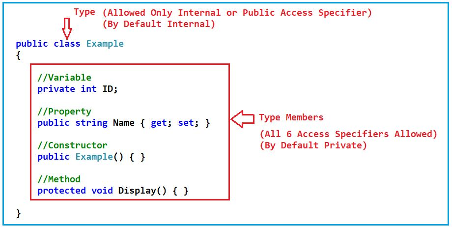

بنابراین، به طور کلی کلاس‌ها، ساختارها، enumها، رابط‌ها و delegateها، نوع (type) نامیده می‌شوند و متغیرها، ویژگی‌ها، سازنده‌ها، متدها و غیره که معمولاً درون یک نوع قرار دارند، اعضای نوع (type member) نامیده می‌شوند. اعضای نوع می‌توانند هر 6 مشخص‌کننده دسترسی (access specifier) ​​داشته باشند در حالی که نوع‌ها فقط می‌توانند 2 اصلاح‌کننده دسترسی (internal, public) داشته باشند. به طور پیش‌فرض، اگر هیچ نوعی را مشخص نکرده باشیم، برای نوع، مشخص‌کننده دسترسی داخلی (internal access specifier) ​​و برای اعضای نوع، مشخص‌کننده دسترسی خصوصی (private access specifier) ​​خواهد بود. با توجه به این نکته، بیایید ادامه دهیم و هر 6 مشخص‌کننده دسترسی (access specifier) ​​را در سی شارپ با مثال درک کنیم.

##### **مثال برای درک مشخص‌کننده‌های دسترسی در سی‌شارپ با مثال‌ها:**

بیایید هر Access Specifier را در C# با مثال‌هایی بررسی کنیم. برای این کار، یک برنامه کنسول جدید با نام **AccessSpecifierDemo** ایجاد کنید. پس از ایجاد این برنامه کنسول، یک اسمبلی با پسوند EXE ایجاد می‌شود. برای درک Access Specifierها در C#، حداقل به دو اسمبلی نیاز داریم. بنابراین، بیایید یک پروژه class library به solution خود اضافه کنیم که یک اسمبلی دیگر با پسوند DLL ایجاد می‌کند. برای اضافه کردن پروژه class library باید مراحل زیر را دنبال کنیم.

روی Solution Explorer کلیک راست کرده و سپس **Add -> New Project را انتخاب کنید.** همانطور که در تصویر زیر نشان داده شده است، از منوی زمینه گزینه

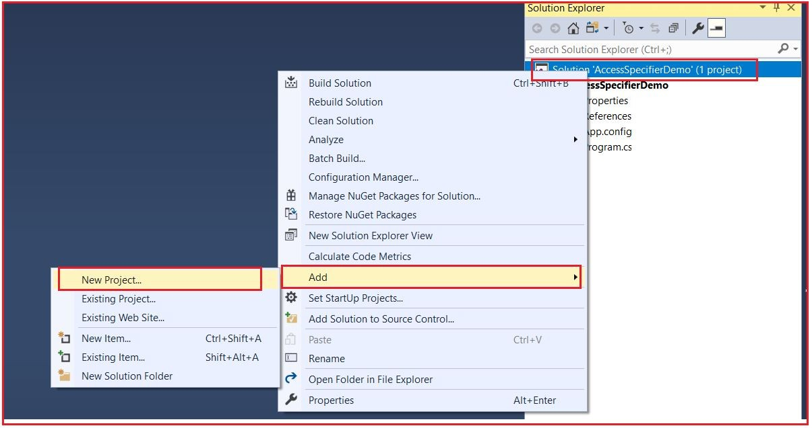پس از کلیک بر روی پروژه جدید، کادر محاوره‌ای افزودن پروژه جدید زیر باز می‌شود. در اینجا، ابتدا در پنجره جستجو، کتابخانه کلاس را جستجو کنید و سپس **با استفاده از الگوی پروژه زبان C# ، کتابخانه کلاس (.NET Framework)** را انتخاب کنید و سپس مطابق تصویر زیر، بر روی دکمه بعدی کلیک کنید.


پس از کلیک بر روی دکمه OK، پنجره Configure Your New Project باز می‌شود. نام پروژه را AssemblyOne قرار دهید و Dot Net Framework را روی ۴.۸ قرار دهید و سپس مطابق تصویر زیر بر روی دکمه Create کلیک کنید.

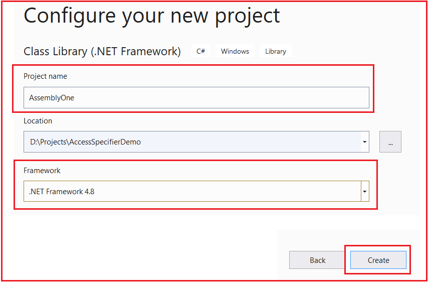

وقتی روی دکمه‌ی Create کلیک کنید، پروژه‌ی Class Library با نام **AssemblyOne** به solution ما اضافه می‌شود. اگر مراحل را به درستی دنبال کرده باشید، اکنون باید دو پروژه در solution explorer داشته باشید، همانطور که در تصویر زیر نشان داده شده است.


حالا solution را بسازید و خواهید دید که دو فایل اسمبلی تولید می‌شوند. یک DLL (برای پروژه کتابخانه کلاس با نام **AssemblyOne.DLL** ) و یک EXE (برای برنامه کنسول با نام **AccessSpecifierDemo.EXE** ). برای پیدا کردن محل اسمبلی، یعنی جایی که اسمبلی تولید می‌شود، لطفاً مراحل زیر را دنبال کنید.

1. روی پروژه AssemblyOne (یا پروژه برنامه کنسول خود) در solution explorer کلیک راست کرده و گزینه Open Folder in Windows Explorer را انتخاب کنید.
2. باز کردن پوشه سطل زباله
3. سپس پوشه Debug را باز کنید.
4. در پوشه Debug، باید **AssemblyOne.dll** یا **AccessSpecifierDemo.exe** را ببینید که همان فایل فیزیکی اسمبلی است.

##### **اسمبلی‌ها در چارچوب دات‌نت چیستند؟**

طبق MSDN، اسمبلی‌ها بلوک سازنده برنامه‌های چارچوب دات‌نت هستند؛ آن‌ها واحد اساسی استقرار را تشکیل می‌دهند. به عبارت ساده، می‌توانیم بگوییم که اسمبلی چیزی جز یک کد دات‌نت از پیش کامپایل شده نیست که می‌تواند توسط CLR (Common Language Runtime) اجرا شود.

برای یک برنامه کنسول، اسمبلی EXE و برای پروژه کتابخانه کلاس، اسمبلی DLL است. ما نمی‌توانیم یک DLL را مستقیماً اجرا کنیم اما می‌توانیم یک EXE را مستقیماً اجرا کنیم.

ابتدا، در مورد Access Specifiers یا Access Modifiers با اعضای نوع (Type Members) بحث خواهیم کرد و سپس Access Specifiers را با نوع (Type) مورد بحث قرار خواهیم داد.

##### **تعیین‌کننده‌های دسترسی یا اصلاح‌کننده‌های دسترسی با اعضای نوع:**

مشخص‌کننده‌های دسترسی یا اصلاح‌کننده‌های دسترسی، دامنه‌ی اعضای نوع را تعریف می‌کنند. یعنی از کجا می‌توانیم به آنها دسترسی داشته باشیم و از کجا نمی‌توانیم به آنها دسترسی داشته باشیم. بنابراین، اول از همه، باید بفهمیم دامنه‌های مختلف برای اعضای نوع چیست. دامنه‌های مختلف برای اعضای نوع به شرح زیر است:

1. با کلاس
2. کلاس مشتق شده در همان اسمبلی
3. کلاس غیر مشتق شده در همان اسمبلی
4. کلاس مشتق شده در سایر اسمبلی‌ها
5. کلاس غیر مشتق شده در سایر اسمبلی‌ها

اکنون، بر اساس مشخص‌کننده‌ی دسترسی، محدودیت به اعضای نوع اعمال می‌شود. حال، بیایید ادامه دهیم و مشخص‌کننده‌ی دسترسی مختلف را درک کنیم و همچنین بفهمیم که از کدام محدوده می‌توانیم به آنها دسترسی داشته باشیم.

##### **مشخص کننده یا اصلاح کننده دسترسی خصوصی در سی شارپ با مثال:**

وقتی یک عضو نوع (متغیر، ویژگی، متد، سازنده و غیره) را به صورت خصوصی (private) تعریف می‌کنیم، فقط می‌توانیم از طریق کلاس به آن عضو دسترسی داشته باشیم. از خارج از کلاس نمی‌توانیم به آنها دسترسی داشته باشیم.

بیایید با یک مثال مفهوم اعضای خصوصی (Private Members) را درک کنیم. حالا به پروژه کتابخانه کلاس (class library) بروید و فایل کلاس class1.cs را به صورت زیر تغییر دهید. همانطور که می‌بینید، در اینجا ما سه کلاس ایجاد کرده‌ایم و در AssemblyOneClass1 یک متغیر خصوصی ایجاد کرده‌ایم و سپس سعی کرده‌ایم به متغیر خصوصی درون همان کلاس (AssemblyOneClass1)، از کلاس مشتق شده (AssemblyOneClass2) و از کلاس غیر مشتق شده (AssemblyOneClass3) دسترسی پیدا کنیم. و همه این کلاس‌ها فقط درون همان اسمبلی هستند.

```csharp
using System;

namespace AssemblyOne
{
    public class AssemblyOneClass1
    {
        private int Id;
        public void Display1()
        {
            //Private Member Accessible with the Containing Type only
            //Where they are created, they are available only within that type
            Console.WriteLine(Id);
        }
    }
    public class AssemblyOneClass2 : AssemblyOneClass1
    {
        public void Display2()
        {
            //You cannot access the Private Member from the Derived Class
            //Within the Same Assembly
            Console.WriteLine(Id); //Compile Time Error
        }
    }

    public class AssemblyOneClass3
    {
        public void Dispplay3()
        {
            //You cannot access the Private Member from the Non-Derived Classes
            //Within the Same Assembly
            AssemblyOneClass1 obj = new AssemblyOneClass1();
            Console.WriteLine(obj.Id); //Compile Time Error
        }
    }
}
```

وقتی سعی می‌کنید کد بالا را بسازید، همانطور که در تصویر زیر نشان داده شده است، با برخی خطاهای کامپایل مواجه خواهید شد. در اینجا، می‌توانید ببینید که به وضوح می‌گوید که به دلیل سطح حفاظت 'AssemblyOneClass1.Id' نمی‌توانید به آن دسترسی پیدا کنید.

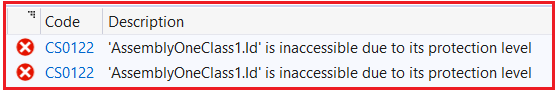

در اینجا، در مثال بالا، ما سعی داریم به عضو خصوصی از همان اسمبلی، یعنی در پروژه کتابخانه کلاس، دسترسی پیدا کنیم. حال، در مورد دو دستوری که باعث خطای کامپایل می‌شوند، نظر دهید. پس از اینکه در مورد دستوراتی که باعث خطای کامپایل در پروژه کتابخانه کلاس می‌شوند، نظر دادید، بیایید ببینیم وقتی سعی می‌کنیم به همان عضو خصوصی از یک اسمبلی دیگر دسترسی پیدا کنیم، چه اتفاقی می‌افتد. در مثال ما، این برنامه کنسول ما خواهد بود. برای درک بهتر، لطفاً فایل کلاس Program.cs را به شرح زیر تغییر دهید:

```csharp
using System;

namespace AccessSpecifierDemo
{
    public class Program
    {
        static void Main(string[] args)
        {
        }
    }

    public class AnotherAssemblyClass1 : AssemblyOneClass1
    {
        public void Display4()
        {
            //You cannot access the Private Member from the Derived Class
            //from Other Assemblies
            Console.WriteLine(Id); //Compile Time Error
        }
    }

    public class AnotherAssemblyClass2
    {
        public void Dispplay3()
        {
            //You cannot access the Private Member from the Non-Derived Classes
            //from Other Assemblies
            AssemblyOneClass1 obj = new AssemblyOneClass1();
            Console.WriteLine(obj.Id); //Compile Time Error
        }
    }
}
```

اکنون، خطای کامپایل زیر را دریافت خواهید کرد.

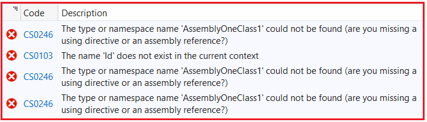

خطای فوق به دلیل فایل کلاس AssemblyOneClass1 است. ما نمی‌توانیم مستقیماً از یک اسمبلی دیگر به این فایل کلاس دسترسی پیدا کنیم. اگر می‌خواهید اعضای این اسمبلی را استفاده کنید، ابتدا باید یک ارجاع به آن اسمبلی از پروژه‌ای که می‌خواهید به اعضای این اسمبلی دسترسی داشته باشید، اضافه کنید یا آن را در پروژه‌ای که می‌خواهید به اعضای این اسمبلی دسترسی داشته باشید، وارد کنید. ما می‌خواهیم اسمبلی کتابخانه کلاس خود را در برنامه کنسول خود استفاده کنیم، بنابراین باید یک ارجاع به پروژه کتابخانه کلاس از برنامه کنسول خود اضافه کنیم. برای اضافه کردن ارجاع اسمبلی، لطفاً مراحل زیر را دنبال کنید.

1. پوشه References را در زیر پروژه AccessSpecifierDemo، از Solution Explorer، گسترش دهید.
2. روی پوشه References کلیک راست کرده و Add Reference را انتخاب کنید.
3. از کادر محاوره‌ای Add Reference، تب Projects را انتخاب کنید.
4. از لیست، پروژه AssemblyOne را انتخاب کنید و همانطور که در تصویر زیر نشان داده شده است، روی دکمه OK کلیک کنید.

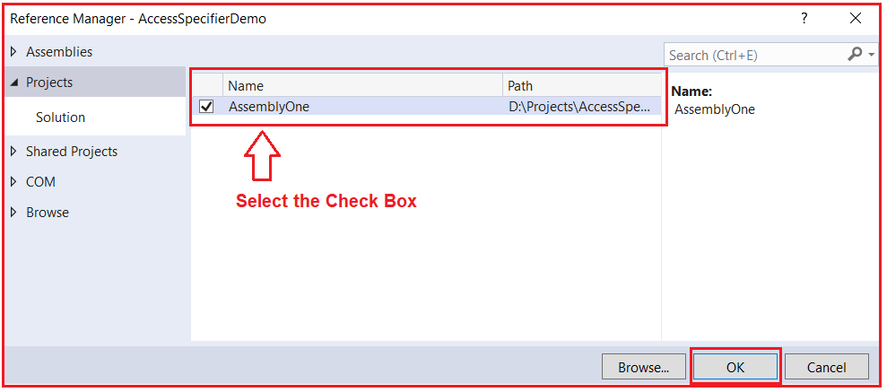

پس از کلیک بر روی دکمه OK، خواهید دید که فایل AssrmblyOne dll همانطور که در تصویر زیر نشان داده شده است، باید به پوشه references اضافه شود.

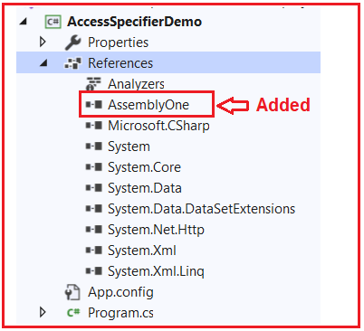

با اعمال تغییرات فوق، اکنون فضای نامی را که AssemblyOneClass1 در آن قرار دارد، اضافه کنید. بنابراین، لطفاً فایل کلاس Program.cs را مطابق شکل زیر تغییر دهید تا فضای نام AssemblyOne را نیز اضافه کنید.

```csharp
using AssemblyOne;
using System;

namespace AccessSpecifierDemo
{
    public class Program
    {
        static void Main(string[] args)
        {
        }
    }

    public class AnotherAssemblyClass1 : AssemblyOneClass1
    {
        public void Display4()
        {
            //You cannot access the Private Member from the Derived Class
            //from Other Assemblies
            Console.WriteLine(Id); //Compile Time Error
        }
    }

    public class AnotherAssemblyClass2
    {
        public void Dispplay3()
        {
            //You cannot access the Private Member from the Non-Derived Classes
            //from Other Assemblies
            AssemblyOneClass1 obj = new AssemblyOneClass1();
            Console.WriteLine(obj.Id); //Compile Time Error
        }
    }
}
```

با اعمال تغییرات فوق، اکنون دوباره پروژه را build کنید و این بار خطاهای زیر را دریافت خواهید کرد.

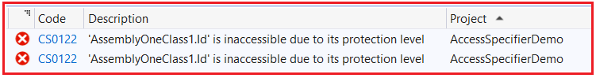

این خطاها منطقی هستند که شما نمی‌توانید به اعضای خصوصی کلاس‌های مشتق شده و غیر مشتق شده از اسمبلی‌های مختلف نیز دسترسی داشته باشید. بنابراین، محدوده عضو خصوصی در C#.NET به شرح زیر است:

1. **با کلاس: بله**
2. **کلاس مشتق شده در همان اسمبلی: خیر**
3. **کلاس غیر مشتق شده در همان اسمبلی: خیر**
4. **کلاس مشتق شده در سایر اسمبلی‌ها: خیر**
5. **کلاس غیر مشتق شده در سایر اسمبلی‌ها: خیر**

##### **مشخص‌کننده‌های دسترسی عمومی یا اصلاح‌کننده‌های دسترسی در سی‌شارپ به همراه مثال:**

وقتی یک عضو از نوع (متغیر، ویژگی، متد، سازنده و غیره) را به صورت عمومی (public) تعریف می‌کنیم، می‌توانیم از هر جایی به آن عضو دسترسی داشته باشیم. این یعنی هیچ محدودیتی برای اعضای عمومی وجود ندارد.

بیایید اعضای عمومی را با یک مثال درک کنیم. لطفاً فایل class1.cs از پروژه کتابخانه کلاس را به صورت زیر تغییر دهید. همانطور که می‌بینید، ما متغیر را به public تغییر داده‌ایم و سپس سعی کرده‌ایم به متغیر عمومی در همان کلاس (AssemblyOneClass1)، از کلاس مشتق شده (AssemblyOneClass2) و از کلاس غیر مشتق شده (AssemblyOneClass3) دسترسی پیدا کنیم. و همه این کلاس‌ها فقط در همان اسمبلی هستند و در اینجا هیچ خطای کامپایلری دریافت نمی‌کنیم.

```csharp
using System;

namespace AssemblyOne
{
    public class AssemblyOneClass1
    {
        public int Id;
        public void Display1()
        {
            //Public Members Accessible with the Containing Type
            //Where they are created
            Console.WriteLine(Id);
        }
    }
    public class AssemblyOneClass2 : AssemblyOneClass1
    {
        public void Display2()
        {
            //We Can access public Members from Derived Class
            //Within the Same Assembly
            Console.WriteLine(Id); //No-Compile Time Error
        }
    }

    public class AssemblyOneClass3
    {
        public void Dispplay3()
        {
            //We Can access public Members from Non-Derived Classes
            //Within the Same Assembly
            AssemblyOneClass1 obj = new AssemblyOneClass1();
            Console.WriteLine(obj.Id); //No-Compile Time Error
        }
    }
}
```

حال، اگر فایل کلاس Program.cs مربوط به برنامه کنسول ما را بررسی کنید، خواهید دید که هیچ خطایی مانند زیر دریافت نمی‌کنیم.

```csharp
using AssemblyOne;
using System;

namespace AccessSpecifierDemo
{
    public class Program
    {
        static void Main(string[] args)
        {
        }
    }

    public class AnotherAssemblyClass1 : AssemblyOneClass1
    {
        public void Display4()
        {
            //We Can access the public Member from Derived Classes
            //from Other Assemblies
            Console.WriteLine(Id); //No-Compile Time Error
        }
    }

    public class AnotherAssemblyClass2
    {
        public void Dispplay3()
        {
            //We Can access the public Member from Non-Derived Classes
            //from Other Assemblies
            AssemblyOneClass1 obj = new AssemblyOneClass1();
            Console.WriteLine(obj.Id); //No-Compile Time Error
        }
    }
}
```

بنابراین، محدوده‌ی عضو public در C#.NET به شرح زیر است:

1. **با کلاس: بله**
2. **کلاس مشتق شده در همان اسمبلی: بله**
3. **کلاس غیر مشتق شده در همان اسمبلی: بله**
4. **کلاس مشتق شده در سایر اسمبلی‌ها: بله**
5. **کلاس غیر مشتق شده در سایر اسمبلی‌ها: بله**

##### **مشخص‌کننده دسترسی محافظت‌شده یا اصلاح‌کننده دسترسی در سی‌شارپ به همراه مثال:**

اعضای محافظت‌شده در سی‌شارپ هم در نوع حاوی و هم در انواعی که از نوع حاوی مشتق شده‌اند، در دسترس هستند. این بدان معناست که اعضای محافظت‌شده هم در کلاس والد (یعنی نوع حاوی) و هم در کلاس‌های فرزند/مشتق‌شده (کلاس‌های مشتق‌شده از نوع حاوی) در دسترس هستند.

بیایید این مشخص‌کننده دسترسی محافظت‌شده (Protected Access Specifier) ​​را در سی‌شارپ با یک مثال درک کنیم. حالا، فایل کلاس class1.cs را به صورت زیر تغییر دهید: در اینجا، ما متغیر را از public به protected تغییر می‌دهیم. در اینجا، می‌توانید مشاهده کنید که هنگام دسترسی به عضو protected از کلاس‌های حاوی type و مشتق‌شده، هیچ خطایی دریافت نمی‌کنیم. اما وقتی سعی می‌کنیم از کلاس غیر مشتق‌شده در همان اسمبلی به عضو protected دسترسی پیدا کنیم، با خطای کامپایل مواجه می‌شویم.

```csharp
using System;

namespace AssemblyOne
{
    public class AssemblyOneClass1
    {
        protected int Id;
        public void Display1()
        {
            //protected Members Accessible with the Containing Type 
            //Where they are created
            Console.WriteLine(Id);
        }
    }
    public class AssemblyOneClass2 : AssemblyOneClass1
    {
        public void Display2()
        {
            //We Can access protected Member from Derived Classes
            //Within the Same Assembly
            Console.WriteLine(Id); //No-Compile Time Error
        }
    }

    public class AssemblyOneClass3
    {
        public void Dispplay3()
        {
            //We Cannot access protected Member from Non-Derived Classes
            //Within the Same Assembly
            AssemblyOneClass1 obj = new AssemblyOneClass1();
            Console.WriteLine(obj.Id); //Compile Time Error
        }
    }
}
```

###### **خروجی:**

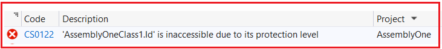

حالا، بیایید سعی کنیم به اعضای محافظت‌شده از اسمبلی‌های مختلف دسترسی پیدا کنیم. فایل کلاس Program.cs را به صورت زیر تغییر دهید. از اسمبلی دیگر، می‌توانید از کلاس مشتق‌شده به عضو محافظت‌شده دسترسی پیدا کنید، اما نمی‌توانید از کلاس‌های غیر مشتق‌شده به آن دسترسی پیدا کنید.

```csharp
using AssemblyOne;
using System;

namespace AccessSpecifierDemo
{
    public class Program
    {
        static void Main(string[] args)
        {
        }
    }

    public class AnotherAssemblyClass1 : AssemblyOneClass1
    {
        public void Display4()
        {
            //We Can access the Protected Member from Derived Classes
            //from Other Assemblies
            Console.WriteLine(Id); //No-Compile Time Error
        }
    }

    public class AnotherAssemblyClass2
    {
        public void Dispplay3()
        {
            //We Cannot access the Protected Member from Non-Derived Classes
            //from Other Assemblies
            AssemblyOneClass1 obj = new AssemblyOneClass1();
            Console.WriteLine(obj.Id); // Compile Time Error
        }
    }
}
```

###### **خروجی:**

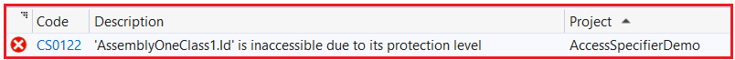

بنابراین، محدوده اعضای محافظت‌شده در C#.NET به شرح زیر است:

1. **با کلاس: بله**
2. **کلاس مشتق شده در همان اسمبلی: بله**
3. **کلاس غیر مشتق شده در همان اسمبلی: خیر**
4. **کلاس مشتق شده در سایر اسمبلی‌ها: بله**
5. **کلاس غیر مشتق شده در سایر اسمبلی‌ها: خیر**

##### **مشخص کننده دسترسی داخلی یا اصلاح کننده دسترسی در سی شارپ با مثال:**

هر زمان که یک عضو با استفاده از مشخصه دسترسی داخلی در سی شارپ تعریف شود، در هر کجای اسمبلی حاوی آن قابل دسترسی خواهد بود. دسترسی به یک عضو داخلی از خارج از اسمبلی حاوی آن، خطای زمان کامپایل محسوب می‌شود.

بگذارید این مشخص‌کننده‌ی دسترسی داخلی در سی‌شارپ را با یک مثال درک کنیم. حالا، فایل کلاس class1.cs را به صورت زیر تغییر دهید: در اینجا، ما متغیر را از protected به internal تغییر می‌دهیم. در اینجا، می‌توانید مشاهده کنید که هنگام دسترسی به عضو protected از نوع حاوی، کلاس‌های مشتق شده و کلاس‌های غیر مشتق شده در همان اسمبلی، هیچ خطایی دریافت نمی‌کنیم.

```csharp
using System;

namespace AssemblyOne
{
    public class AssemblyOneClass1
    {
        internal int Id;
        public void Display1()
        {
            //internal Members Accessible with the Containing Type 
            //Where they are created
            Console.WriteLine(Id);
        }
    }
    public class AssemblyOneClass2 : AssemblyOneClass1
    {
        public void Display2()
        {
            //We can access internal Members from Derived Classes
            //Within the Same Assembly
            Console.WriteLine(Id); //No-Compile Time Error
        }
    }

    public class AssemblyOneClass3
    {
        public void Dispplay3()
        {
            //We can access internal Members from Non-Derived Classes
            //Within the Same Assembly
            AssemblyOneClass1 obj = new AssemblyOneClass1();
            Console.WriteLine(obj.Id); //No-Compile Time Error
        }
    }
}
```

حالا، بیایید سعی کنیم از یک اسمبلی دیگر به اعضای داخلی دسترسی پیدا کنیم. فایل کلاس Program.cs را به صورت زیر تغییر دهید. از اسمبلی دیگر، شما نمی‌توانید به عضو داخلی چه از کلاس‌های مشتق شده و چه از کلاس‌های غیر مشتق شده دسترسی پیدا کنید.

```csharp
using AssemblyOne;
using System;

namespace AccessSpecifierDemo
{
    public class Program
    {
        static void Main(string[] args)
        {
        }
    }

    public class AnotherAssemblyClass1 : AssemblyOneClass1
    {
        public void Display4()
        {
            //We cannot access the Internal Member from Derived Classes
            //from Other Assemblies
            Console.WriteLine(Id); //Compile Time Error
        }
    }

    public class AnotherAssemblyClass2
    {
        public void Dispplay3()
        {
            //We cannot access internal Member from Non-Derived Classes
            //from Other Assemblies
            AssemblyOneClass1 obj = new AssemblyOneClass1();
            Console.WriteLine(obj.Id); //Compile Time Error
        }
    }
}
```

###### **خروجی:**

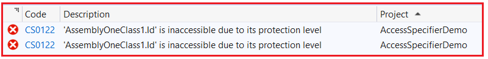

بنابراین، محدوده اعضای داخلی در C#.NET به شرح زیر است:

1. **با کلاس: بله**
2. **کلاس مشتق شده در همان اسمبلی: بله**
3. **کلاس غیر مشتق شده در همان اسمبلی: بله**
4. **کلاس مشتق شده در سایر اسمبلی‌ها: خیر**
5. **کلاس غیر مشتق شده در سایر اسمبلی‌ها: خیر**

##### **مشخص کننده دسترسی داخلی محافظت شده یا اصلاح کننده دسترسی در سی شارپ:**

اعضای داخلی محافظت‌شده در سی‌شارپ می‌توانند در هر جایی درون همان اسمبلی، یعنی جایی که تعریف شده‌اند یا از درون یک کلاس مشتق‌شده از اسمبلی دیگر، قابل دسترسی باشند. بنابراین، می‌توانیم تصور کنیم که ترکیبی از تصریح‌کننده‌های دسترسی محافظت‌شده و داخلی است. اگر تصریح‌کننده‌های دسترسی محافظت‌شده و داخلی را درک کرده باشید، دنبال کردن این مطلب باید بسیار آسان باشد. محافظت‌شده به این معنی است که اعضا می‌توانند درون کلاس‌های مشتق‌شده و داخلی در همان اسمبلی قابل دسترسی باشند.

بگذارید این مشخص‌کننده‌ی دسترسی داخلی محافظت‌شده (Protected Internal Access Specifier) ​​را در سی‌شارپ با یک مثال درک کنیم. حال، فایل کلاس class1.cs را به صورت زیر تغییر دهید: در اینجا، ما متغیر را از internal به protected internal تغییر می‌دهیم. در اینجا، می‌توانید مشاهده کنید که هنگام دسترسی به عضو داخلی محافظت‌شده از نوع حاوی، از کلاس‌های مشتق‌شده و از کلاس غیر مشتق‌شده در همان اسمبلی، هیچ خطای کامپایلی دریافت نمی‌کنیم.

```csharp
using System;

namespace AssemblyOne
{
    public class AssemblyOneClass1
    {
        protected internal int Id;
        public void Display1()
        {
            //protected internal Members Accessible with the Containing Type 
            //Where they are created
            Console.WriteLine(Id);
        }
    }
    public class AssemblyOneClass2 : AssemblyOneClass1
    {
        public void Display2()
        {
            //We can access protected internal Member from Derived Classes
            //Within the Same Assembly
            Console.WriteLine(Id); //No-Compile Time Error
        }
    }

    public class AssemblyOneClass3
    {
        public void Dispplay3()
        {
            //We can access protected internal Member from Non-Derived Classes
            //Within the Same Assembly
            AssemblyOneClass1 obj = new AssemblyOneClass1();
            Console.WriteLine(obj.Id); //No-Compile Time Error
        }
    }
}
```

حالا، بیایید سعی کنیم از یک اسمبلی دیگر به اعضای داخلی محافظت‌شده دسترسی پیدا کنیم. فایل کلاس Program.cs را به صورت زیر تغییر دهید. از اسمبلی‌های دیگر، می‌توانید از کلاس‌های مشتق‌شده به عضو داخلی محافظت‌شده دسترسی پیدا کنید، اما نمی‌توانید از کلاس‌های غیر مشتق‌شده به آن دسترسی پیدا کنید.

```csharp
using AssemblyOne;
using System;

namespace AccessSpecifierDemo
{
    public class Program
    {
        static void Main(string[] args)
        {
        }
    }

    public class AnotherAssemblyClass1 : AssemblyOneClass1
    {
        public void Display4()
        {
            //We can access the protected internal Members from Derived Classes
            //from Other Assemblies
            Console.WriteLine(Id); //No-Compile Time Error
        }
    }

    public class AnotherAssemblyClass2
    {
        public void Dispplay3()
        {
            //We cannot access protected internal Members from Non-Derived Classes
            //from Other Assemblies
            AssemblyOneClass1 obj = new AssemblyOneClass1();
            Console.WriteLine(obj.Id); //Compile Time Error
        }
    }
}
```

**خروجی:**

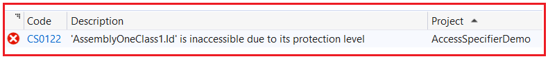

So, the scope of the protected internal members in C#.NET is as follows:

1. **With the Class: YES**
2. **کلاس مشتق شده در همان اسمبلی: بله**
3. **کلاس غیر مشتق شده در همان اسمبلی: بله**
4. **کلاس مشتق شده در سایر اسمبلی‌ها: بله**
5. **کلاس غیر مشتق شده در سایر اسمبلی‌ها: خیر**

##### **مشخص‌کننده‌ی دسترسی خصوصی یا اصلاح‌کننده‌ی دسترسی در سی‌شارپ با مثال:**

اعضای private protected در داخل کلاس و در کلاس مشتق شده از همان اسمبلی قابل دسترسی هستند، اما از اسمبلی دیگری قابل دسترسی نیستند.

بیایید این مشخص‌کننده‌ی دسترسی خصوصی محافظت‌شده در سی‌شارپ را با یک مثال درک کنیم. حالا، فایل کلاس class1.cs را به صورت زیر تغییر دهید: در اینجا، ما متغیر را از protected internal به private protected تغییر می‌دهیم. در اینجا، می‌توانید مشاهده کنید که هنگام دسترسی به عضو داخلی محافظت‌شده از نوع حاوی آن و از کلاس‌های مشتق‌شده در همان اسمبلی، هیچ خطای کامپایلی دریافت نمی‌کنیم. اما هنگام تلاش برای دسترسی به اعضای خصوصی محافظت‌شده از کلاس‌های غیر مشتق‌شده‌ی همان اسمبلی، با خطاهای کامپایل مواجه می‌شویم.

```csharp
using System;

namespace AssemblyOne
{
    public class AssemblyOneClass1
    {
        private protected int Id;
        public void Display1()
        {
            //Private Protected Members Accessible with the Containing Type 
            //Where they are created
            Console.WriteLine(Id);
        }
    }
    public class AssemblyOneClass2 : AssemblyOneClass1
    {
        public void Display2()
        {
            //We can access Private Protected Member from Derived Classes
            //Within the Same Assembly
            Console.WriteLine(Id); //No-Compile Time Error
        }
    }

    public class AssemblyOneClass3
    {
        public void Dispplay3()
        {
            //We cannot access Private Protected Member from Non-Derived Classes
            //Within the Same Assembly
            AssemblyOneClass1 obj = new AssemblyOneClass1();
            Console.WriteLine(obj.Id); //Compile Time Error
        }
    }
}
```

###### **خروجی:**

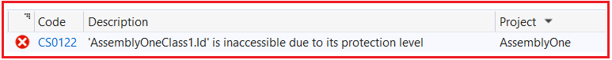

حالا، بیایید سعی کنیم از یک اسمبلی دیگر به اعضای private protected دسترسی پیدا کنیم. فایل کلاس Program.cs را به صورت زیر تغییر دهید. از اسمبلی‌های دیگر، نمی‌توانید به اعضای private protected چه از کلاس‌های مشتق شده و چه از کلاس‌های غیر مشتق شده دسترسی پیدا کنید.

```csharp
using AssemblyOne;
using System;

namespace AccessSpecifierDemo
{
    public class Program
    {
        static void Main(string[] args)
        {
        }
    }

    public class AnotherAssemblyClass1 : AssemblyOneClass1
    {
        public void Display4()
        {
            //We cannot access Private Protected Member from Derived Classes
            //from Other Assemblies
            Console.WriteLine(Id); //Compile Time Error
        }
    }

    public class AnotherAssemblyClass2
    {
        public void Dispplay3()
        {
            //We cannot access Private Protected Member from Non-Derived Classes
            //from Other Assemblies
            AssemblyOneClass1 obj = new AssemblyOneClass1();
            Console.WriteLine(obj.Id); //Compile Time Error
        }
    }
}
```

###### **خروجی:**

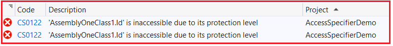

بنابراین، محدوده اعضای private protected در C#.NET به شرح زیر است:

1. **با کلاس: بله**
2. **کلاس مشتق شده در همان اسمبلی: بله**
3. **کلاس غیر مشتق شده در همان اسمبلی: خیر**
4. **کلاس مشتق شده در سایر اسمبلی‌ها: خیر**
5. **کلاس غیر مشتق شده در سایر اسمبلی‌ها: خیر**

**نکته:** در اینجا، من مثال را با استفاده از یک متغیر نشان داده‌ام، اما همین امر برای سایر اعضای یک کلاس مانند ویژگی‌ها، متدها و سازنده‌ها نیز قابل اجرا است. جدول زیر خلاصه‌ای از تمام تصریح‌کننده‌های دسترسی را با اعضای نوع نشان می‌دهد.

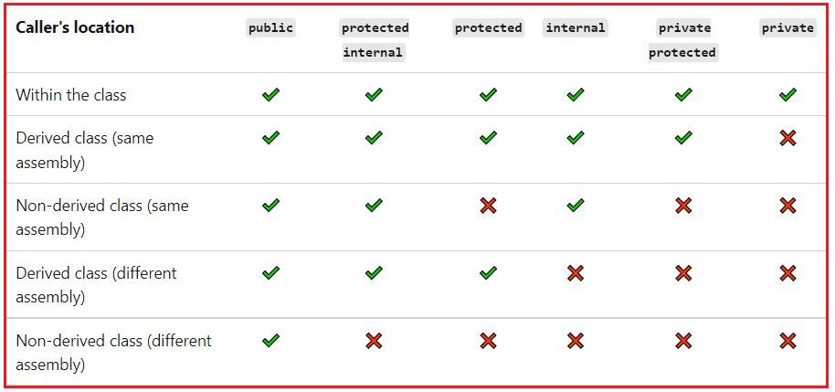

تا اینجا، ما در مورد نحوه استفاده از تصریح‌کننده‌های دسترسی با اعضای نوع بحث کرده‌ایم. حال، بیایید ببینیم چگونه می‌توان از تصریح‌کننده‌های دسترسی در C# با نوع استفاده کرد.

##### **مشخص کننده‌های دسترسی با نوع در سی شارپ:**

ما می‌توانیم از هر ۶ مشخص‌کننده‌ی دسترسی با اعضای نوع در سی‌شارپ استفاده کنیم، اما نوع فقط به دو مشخص‌کننده‌ی دسترسی یعنی داخلی و عمومی اجازه می‌دهد. استفاده از مشخص‌کننده‌های دسترسی خصوصی، محافظت‌شده، داخلی محافظت‌شده و خصوصی محافظت‌شده با نوع‌ها، یک خطای زمان کامپایل ایجاد می‌کند. کد زیر یک خطای کامپایلر ایجاد می‌کند (زیرا کلاس Program را به عنوان خصوصی علامت‌گذاری کرده‌ایم) که بیان می‌کند **عناصر تعریف‌شده در یک فضای نام نمی‌توانند به طور صریح به عنوان خصوصی، محافظت‌شده، داخلی محافظت‌شده یا خصوصی محافظت‌شده اعلام شوند** . بنابراین، تنها مشخص‌کننده‌های دسترسی مجاز برای یک نوع، داخلی و عمومی هستند و اگر هیچ مشخص‌کننده‌ی دسترسی مشخص نکرده باشیم، به طور پیش‌فرض داخلی خواهد بود.

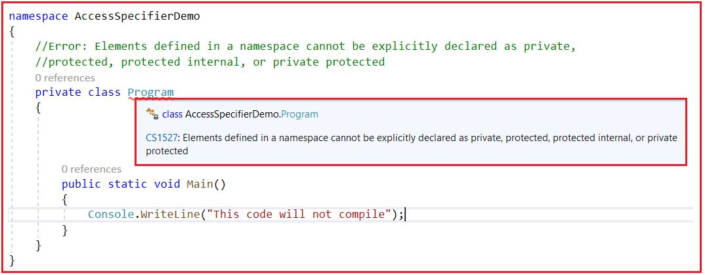

**نکته:** نکته‌ای که باید به خاطر داشته باشید این است که اگر می‌خواهید فقط از داخل همان اسمبلی به کلاس دسترسی داشته باشید، باید کلاس را به صورت داخلی تعریف کنید و اگر می‌خواهید هم از همان اسمبلی و هم از اسمبلی‌های دیگر به کلاس دسترسی داشته باشید، باید کلاس را به صورت عمومی تعریف کنید.

##### **مثالی برای درک مشخص‌کننده‌های دسترسی داخلی و عمومی در سی‌شارپ با نوع:**

لطفا فایل کلاس class1.cs از پروژه کتابخانه کلاس را به صورت زیر تغییر دهید: در اینجا، ما کلاس را به عنوان داخلی علامت گذاری کردیم و در اینجا می‌توانید ببینید که ما در حال ایجاد روابط ارث بری هستیم و همچنین می‌توانیم نمونه‌ای از کلاس داخلی را در همان اسمبلی ایجاد کنیم.

```csharp
using System;

namespace AssemblyOne
{
    internal class AssemblyOneClass1
    {
        public int Id;
        public void Display1()
        {
            Console.WriteLine(Id);
        }
    }
    internal class AssemblyOneClass2 : AssemblyOneClass1
    {
        public void Display2()
        {
            Console.WriteLine(Id);
        }
    }

    internal class AssemblyOneClass3
    {
        public void Dispplay3()
        {
            AssemblyOneClass1 obj = new AssemblyOneClass1();
            Console.WriteLine(obj.Id);
        }
    }
}
```

حالا، بیایید سعی کنیم از کلاس داخلی یک اسمبلی دیگر استفاده کنیم. لطفاً فایل کلاس Program.cs را به صورت زیر تغییر دهید: در اینجا، می‌توانید مشاهده کنید که ما قادر به ایجاد ارث‌بری از کلاس و همچنین ایجاد نمونه‌ای از کلاس داخلی نیستیم. در اینجا، با خطاهای کامپایل مواجه می‌شویم.

```csharp
using AssemblyOne;
using System;

namespace AccessSpecifierDemo
{
    public class Program
    {
        static void Main(string[] args)
        {
        }
    }

    //You cannot make inheritance relationship because AssemblyOneClass1 is internal
    //Internal cannot be accessible to outside assembly
    public class AnotherAssemblyClass1 : AssemblyOneClass1
    {
        public void Display4()
        {
        }
    }

    public class AnotherAssemblyClass2
    {
        public void Dispplay3()
        {
            //You cannot create an instance because AssemblyOneClass1 is not accessible
            //to outside assembly
            AssemblyOneClass1 obj = new AssemblyOneClass1();
        }
    }
}
```

###### **خروجی:**

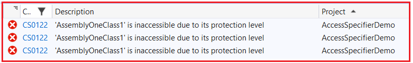

حالا، کلاس را از حالت داخلی (internal) به حالت عمومی (public) در فایل class1.cs تغییر دهید، همانطور که در کد زیر نشان داده شده است. وقتی کلاس AssemblyOneClass1 را عمومی (public) کنیم، تمام خطاهای کامپایل از بین می‌روند.

```csharp
using System;

namespace AssemblyOne
{
    public class AssemblyOneClass1
    {
        public int Id;
        public void Display1()
        {
            Console.WriteLine(Id);
        }
    }
    internal class AssemblyOneClass2 : AssemblyOneClass1
    {
        public void Display2()
        {
            Console.WriteLine(Id);
        }
    }

    internal class AssemblyOneClass3
    {
        public void Dispplay3()
        {
            AssemblyOneClass1 obj = new AssemblyOneClass1();
            Console.WriteLine(obj.Id);
        }
    }
}
```

بنابراین، نکته‌ای که باید به خاطر داشته باشید این است که اگر هر نوعی را به عنوان داخلی تعریف کنید، فقط در همان اسمبلی که ایجاد شده قابل دسترسی یا در دسترس است و اگر نوع را با مشخص‌کننده دسترسی عمومی ایجاد کرده‌اید، آن نوع هم در اسمبلی که ایجاد شده و هم از سایر اسمبلی‌ها قابل دسترسی و در دسترس است.

##### **مشخصات دسترسی پیش‌فرض در سی‌شارپ برای یک کلاس و اعضای کلاس چیست؟**

اگر در سی شارپ مشخص کننده دسترسی را مشخص نکنیم، برای کلاس، مشخص کننده دسترسی پیش فرض internal و برای اعضای کلاس private است.