## **ارث بری در سی شارپ به همراه مثال**

در این مقاله، به همراه مثال‌هایی، در مورد وراثت در برنامه‌نویسی شی‌گرا با استفاده از زبان سی‌شارپ بحث خواهم کرد. وراثت یکی از اصول OOP است. بنابراین، بیایید بفهمیم که این وراثت چیست.

##### **وراثت در سی شارپ چیست؟**

وراثت در سی شارپ مکانیزمی برای استفاده از اعضای تعریف شده در یک کلاس از کلاس دیگر است. همانطور که می‌دانید، یک کلاس مجموعه‌ای از اعضا است. اعضای تعریف شده در یک کلاس می‌توانند با ایجاد رابطه والد/فرزندی بین کلاس‌ها، توسط کلاس دیگری استفاده شوند.

به طور کلی، همه ما می‌دانیم که تمام دارایی‌های والدینمان متعلق به ماست. بنابراین، فرزندان در اموال والدین حق و حقوقی دارند. چرا؟ چون این یک قانون است. طبق قانون، تمام دارایی‌های والدین متعلق به فرزندانشان است.

دقیقاً همین اصل در وراثت نیز اعمال می‌شود. فرض کنید من یک کلاس (A) با مجموعه‌ای از اعضا دارم و می‌خواهم همان اعضا را در کلاس دیگری (B) داشته باشم. یک راه برای انجام این کار، کپی کردن و چسباندن همان کد از کلاس A به کلاس B است. اما اگر کد را کپی و چسباندن کنیم، به آن بازنویسی کد می‌گویند. بازنویسی کد بر اندازه برنامه تأثیر می‌گذارد. اگر اندازه برنامه افزایش یابد، در نهایت، بر عملکرد برنامه تأثیر خواهد گذاشت.

بنابراین، اگر می‌خواهید بر آن فرآیند بازنویسی غلبه کنید و از کد دوباره استفاده کنید، بهترین گزینه موجود برای ما وراثت در سی شارپ است. به طور خلاصه، کاری که باید انجام دهیم ایجاد یک رابطه بین دو کلاس است. چه رابطه‌ای؟ رابطه والد/فرزند. پس از ایجاد رابطه والد/فرزند، تمام اعضای کلاس والد (A) می‌توانند تحت کلاس فرزند (B) استفاده شوند. برای درک بهتر، لطفاً به نمودار زیر نگاهی بیندازید.

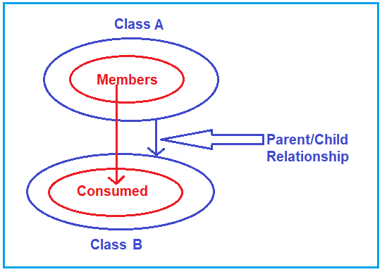

بنابراین، وراثت در سی شارپ مکانیسمی برای استفاده از اعضای یک کلاس در کلاس دیگر با ایجاد رابطه والد/فرزندی بین کلاس‌ها است که قابلیت استفاده مجدد را فراهم می‌کند.

##### **چگونه وراثت را در سی شارپ پیاده سازی کنیم؟**

برای پیاده‌سازی وراثت در سی‌شارپ، باید یک رابطه والد/فرزند بین کلاس‌ها برقرار کنیم. بیایید نحوه ایجاد رابطه والد/فرزند در سی‌شارپ را بررسی کنیم. فرض کنید کلاسی به نام A با مجموعه‌ای از اعضا داریم. و کلاس دیگری به نام B داریم و می‌خواهیم این کلاس B از کلاس A به ارث برده شود. کد زیر نحوه ایجاد رابطه والد-فرزند بین کلاس A و کلاس B را نشان می‌دهد.

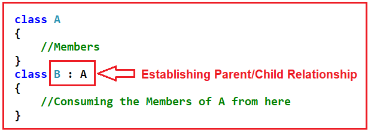

بنابراین، این فرآیند اساسی برای ایجاد رابطه والد/فرزند در سی شارپ است. حال، بیایید سینتکس اساسی برای ایجاد رابطه والد/فرزند بین کلاس‌ها را بررسی کنیم. این سینتکس در زیر آورده شده است.

**[\<modifiers>] class <Child Class> : <Parent Class>**

در اینجا، اصطلاحات کلاس والد و کلاس فرزند را می‌توان کلاس پایه (سوپرکلاس) و کلاس مشتق شده (زیرکلاس) نیز نامید. بنابراین، در مثال ما،  
A => Parent/Base/Super Class (همه به یک معنی هستند؛ می‌توانید از هر اصطلاحی استفاده کنید)  
B => Child/Derived/Sub Class (همه به یک معنی هستند؛ می‌توانید از هر اصطلاحی استفاده کنید)

**نکته:** در وراثت، کلاس فرزند می‌تواند اعضای کلاس والد خود را طوری مصرف کند که انگار مالک آن اعضا است (به جز اعضای خصوصی کلاس والد).

##### **چرا فرزند نمی‌تواند از اعضای خصوصی والد استفاده کند؟**

به طور کلی، فرزندان نسبت به اموال والدین خود حق دارند. به عنوان یک فرزند، فردا می‌توانم کسب و کار پدرم را تصاحب کنم. می‌توانم اموال پدرم (ماشین، ساختمان، پول، هر چه که باشد) را تصاحب کنم. اما نمی‌توانم شغل پدرم را تصاحب کنم. دلیلش این است که شغلی که پدرم انجام می‌دهد ممکن است بر اساس صلاحیت‌ها و تجربیات او باشد. و فردا نمی‌توانم شغل خاص او را تصاحب کنم. بنابراین، شغل کاملاً خصوصی پدرم است. و این به من ارث نمی‌رسد. اما همه چیز، کسب و کار، پول، اموال، هر چه که تصاحب کنم، برای من باقی می‌ماند. همه چیز را به جز اعضای خصوصی تصاحب می‌کنم.

همین اصل در مورد وراثت نیز اعمال می‌شود. بنابراین، کلاس فرزند تمام اعضای کلاس والد را به جز اعضای خصوصی مصرف می‌کند.

##### **مثال برای درک وراثت در سی شارپ:**

بیایید یک مثال ساده برای درک وراثت در سی شارپ ببینیم. بیایید یک کلاس با دو متد ایجاد کنیم، همانطور که در زیر نشان داده شده است.

```csharp
class A
{
    public void Method1()
    {
        Console.WriteLine("Method 1");
    }
    public void Method2()
    {
        Console.WriteLine("Method 2");
    }
}
```

در اینجا، ما کلاس A را با دو متد عمومی، یعنی Method1 و Method2، ایجاد کرده‌ایم. حال، می‌خواهم همین دو متد را در کلاس دیگری، یعنی کلاس B، داشته باشم. یک راه برای انجام این کار، کپی کردن دو متد بالا و چسباندن آنها به کلاس B به صورت زیر است.

```csharp
class B
{
    public void Method1()
    {
        Console.WriteLine("Method 1");
    }
    public void Method2()
    {
        Console.WriteLine("Method 2");
    }
}
```

اگر این کار را انجام دهیم، دیگر قابلیت استفاده مجدد از کد مطرح نیست. این بازنویسی کد است که بر اندازه برنامه تأثیر می‌گذارد. بنابراین، بدون بازنویسی، کاری که باید انجام دهیم این است که باید وراثت را به شرح زیر انجام دهیم. در اینجا، کلاس B از کلاس A به ارث رسیده است و از این رو، درون متد Main، نمونه‌ای از کلاس B ایجاد می‌کنیم و متدهایی را که در کلاس A تعریف شده‌اند، فراخوانی می‌کنیم.

```csharp
class B : A
{
    static void Main()
    {
        B obj = new B();
        obj.Method1();
        obj.Method2();
    }
}
```

وقتی که شما ارث‌بری را انجام می‌دهید، کلاس B می‌تواند دو عضو تعریف‌شده در کلاس A را بپذیرد. چرا؟ چون تمام ویژگی‌های یک Parent به Children تعلق دارد. در اینجا، کلاس A کلاس Parent/Super/Base و کلاس B کلاس Child/Sub/Derived است.

بگذارید یک نکته دیگر را هم بفهمیم. لطفاً به تصویر زیر توجه کنید وقتی می‌گوییم obj. می‌توانید هوشی را که دو متد، یعنی Method1 و Method2، را نشان می‌دهد، ببینید. بنابراین، کلاس فرزند می‌تواند اعضای کلاس والد را طوری مصرف کند که انگار مالک است. حال، اگر توضیحات Method1 یا Method2 را ببینید، void A.Method1() و void A.Method2() را نشان می‌دهد. این یعنی Method1 یا Method2 فقط متعلق به کلاس A است. اما کلاس B می‌تواند عضو را طوری مصرف کند که انگار مالک است. ببینید، من می‌توانم ماشین پدرم را طوری برانم که انگار مالک هستم، اما هنوز نام ثبت شده پدرم است. به طور مشابه، کلاس B می‌تواند متدها را طوری فراخوانی کند که انگار متد متعلق به خودش است، اما در داخل، متدها متعلق به کلاس A هستند.

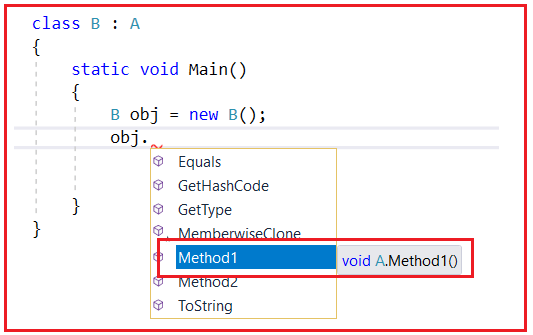

مثال کامل کد در زیر آمده است. در مثال زیر، کلاس A دو عضو تعریف کرده است و کلاس B از کلاس A به ارث رسیده است. در کلاس B، در متد Main، یک نمونه از کلاس B ایجاد کرده و دو متد را فراخوانی کرده‌ایم.

```csharp
using System;

namespace InheritanceDemo
{
    class A
    {
        public void Method1()
        {
            Console.WriteLine("Method 1");
        }
        public void Method2()
        {
            Console.WriteLine("Method 2");
        }
    }
    class B : A
    {
        static void Main()
        {
            B obj = new B();
            obj.Method1();
            obj.Method2();
            Console.ReadKey();
        }
    }
}
```

###### **خروجی:**

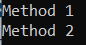

حالا، بیایید یک متد جدید، یعنی Method3 در کلاس B، به صورت زیر اضافه کنیم. در داخل متد Main، اگر توضیحات متد را ببینید، نشان می‌دهد که این متد متعلق به کلاس B است.

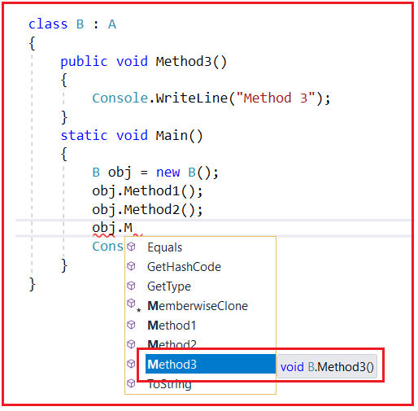

**مثال کامل در زیر آورده شده است.**

```csharp
using System;

namespace InheritanceDemo
{
    class A
    {
        public void Method1()
        {
            Console.WriteLine("Method 1");
        }
        public void Method2()
        {
            Console.WriteLine("Method 2");
        }
    }
    class B : A
    {
        public void Method3()
        {
            Console.WriteLine("Method 3");
        }
        static void Main()
        {
            B obj = new B();
            obj.Method1();
            obj.Method2();
            obj.Method3();
            Console.ReadKey();
        }
    }
}
```

###### **خروجی:**

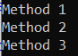

##### **چند متد در کلاس B وجود دارد؟**

حالا، ممکن است یک سوال داشته باشید: چند متد در کلاس B وجود دارد؟ پاسخ ۳ است. ببینید، تمام ویژگی‌هایی که پدرم به من داده است، به علاوه تمام ویژگی‌هایی که من کسب می‌کنم، فقط دارایی من هستند. بنابراین، دارایی من چیست؟ به این معنی است که من نمی‌گویم چه چیزی را به دست آورده‌ام؛ بلکه می‌گویم پدرم چه چیزی را به من داده است. بنابراین، به همین ترتیب، چند متد در کلاس B وجود دارد؟ به این معنی است که ۳ متد وجود دارد. دو متد از کلاس والد A به ارث رسیده‌اند به علاوه یک متد که ما در کلاس B تعریف کرده‌ایم. بنابراین، می‌توانیم بگوییم کلاس A شامل دو متد و کلاس B شامل ۳ متد است.

این فرآیند ساده‌ی وراثت در سی‌شارپ است. کافیست یک دونقطه (:) بین کلاس والد و فرزند قرار دهید. اما وقتی با وراثت کار می‌کنید، 6 چیز یا قانون برای یادگیری و به خاطر سپردن لازم است. بیایید آن 6 قانون مهم را یکی یکی یاد بگیریم.

##### **قانون ۱:**

در سی شارپ، سازنده کلاس والد باید برای کلاس فرزند قابل دسترسی باشد؛ در غیر این صورت، ارث بری امکان‌پذیر نخواهد بود زیرا وقتی شیء کلاس فرزند را ایجاد می‌کنیم، ابتدا سازنده کلاس والد را فراخوانی می‌کند تا متغیر کلاس والد مقداردهی اولیه شود و بتوانیم آنها را تحت کلاس فرزند مصرف کنیم.

در حال حاضر، در مثال ما، هم کلاس A و هم کلاس B دارای سازنده‌های ضمنی هستند. بله، هر کلاسی در C# شامل یک سازنده ضمنی است، اگر به عنوان یک توسعه‌دهنده، هیچ سازنده‌ای را به صراحت تعریف نکرده باشیم. ما قبلاً این را در بخش سازنده‌هایمان یاد گرفته‌ایم.

اگر یک سازنده به صورت ضمنی تعریف شود، آنگاه یک سازنده عمومی است. در مثال ما، کلاس B می‌تواند به سازنده ضمنی کلاس A دسترسی داشته باشد زیرا عمومی است. حال، اجازه دهید یک سازنده صریح در کلاس A به شرح زیر تعریف کنیم.

```csharp
class A
{
    public A()
    {
        Console.WriteLine("Class A Constructor is Called");
    }
    public void Method1()
    {
        Console.WriteLine("Method 1");
    }
    public void Method2()
    {
        Console.WriteLine("Method 2");
    }
}
```

با اعمال تغییرات فوق، اگر کد برنامه را اجرا کنید، خروجی زیر را دریافت خواهید کرد.

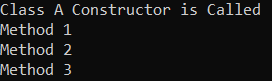

وقتی کد را اجرا می‌کنید، ابتدا سازنده کلاس A فراخوانی می‌شود و این چیزی است که می‌توانید در خروجی ببینید. چرا؟ دلیلش این است که هر زمان که نمونه کلاس فرزند ایجاد می‌شود، سازنده کلاس فرزند به طور ضمنی سازنده‌های کلاس والد خود را فراخوانی می‌کند. این یک قانون است.

در حال حاضر، کلاس فرزند شامل یک سازنده ضمنی است و آن سازنده ضمنی، سازنده کلاس والد را فراخوانی می‌کند. اما سازنده کلاس والد A به صورت ضمنی نیست. اکنون به صورت صریح است و درون آن سازنده کلاس والد، ما دستور print و دستور print را نوشته‌ایم که پیامی را در پنجره کنسول چاپ می‌کند.

اما به یاد داشته باشید، اگر یک سازنده صریح تعریف می‌کنید، اگر آن سازنده را private تعریف می‌کنید، و اگر مشخص‌کننده دسترسی ارائه نمی‌دهید، به طور پیش‌فرض، مشخص‌کننده دسترسی عضو کلاس در C# خصوصی است. برای مثال، کلاس A را به صورت زیر تغییر دهید. همانطور که می‌بینید، مشخص‌کننده دسترسی را از سازنده حذف کرده‌ایم که آن را private می‌کند.

```csharp
class A
{
    A()
    {
        Console.WriteLine("Class A Constructor is Called");
    }
    public void Method1()
    {
        Console.WriteLine("Method 1");
    }
    public void Method2()
    {
        Console.WriteLine("Method 2");
    }
}
```

همانطور که در کد مشاهده می‌کنید، سازنده کلاس A خصوصی است، بنابراین برای کلاس B قابل دسترسی نیست. حال، اگر سعی کنید کد را اجرا کنید، خطای زمان کامپایل زیر را همانطور که در تصویر زیر نشان داده شده است، دریافت خواهید کرد که می‌گوید **سازنده کلاس** **A به دلیل سطح حفاظت آن قابل دسترسی نیست** .

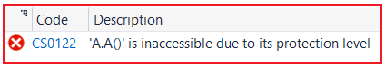

ما با خطای بالا مواجه می‌شویم زیرا وقتی نمونه‌ای از کلاس فرزند ایجاد می‌کنیم، سازنده کلاس فرزند به طور ضمنی سازنده‌های کلاس والد خود را فراخوانی می‌کند. در حال حاضر، سازنده کلاس B سعی می‌کند سازنده کلاس A را فراخوانی کند که به دلیل خصوصی بودن آن سازنده، قابل دسترسی نیست.

بیایید یک کار دیگر هم انجام دهیم. یک سازنده در کلاس B به صورت زیر تعریف کنیم. سازنده کلاس A را عمومی (public) کنیم؛ در غیر این صورت، ارث‌بری امکان‌پذیر نخواهد بود.

```csharp
using System;

namespace InheritanceDemo
{
    class A
    {
        public A()
        {
            Console.WriteLine("Class A Constructor is Called");
        }
        public void Method1()
        {
            Console.WriteLine("Method 1");
        }
        public void Method2()
        {
            Console.WriteLine("Method 2");
        }
    }
    class B : A
    {
        B()
        {
            Console.WriteLine("Class B Constructor is Called");
        }
        public void Method3()
        {
            Console.WriteLine("Method 3");
        }
        static void Main()
        {
            B obj = new B();
            obj.Method1();
            obj.Method2();
            obj.Method3();
            Console.ReadKey();
        }
    }
}
```

###### **خروجی:**

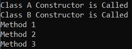

همانطور که در خروجی بالا مشاهده می‌کنید، ابتدا سازنده کلاس A فراخوانی می‌شود و سپس سازنده کلاس B. بنابراین، نکته‌ای که باید به خاطر داشته باشید این است که اجرا همیشه از سازنده کلاس والد شروع می‌شود. چرا؟ وقتی نمونه‌ای از یک کلاس فرزند ایجاد می‌کنیم، سازنده کلاس فرزند به طور ضمنی سازنده کلاس والد را فراخوانی می‌کند. اگر آن کلاس والد دارای یک کلاس والد باشد، سازنده آن کلاس والد، سازنده کلاس والد خود را فراخوانی می‌کند و به همین ترتیب ادامه می‌یابد. فرض کنید 5 کلاس در ارث‌بری دارید و اگر در حال ایجاد نمونه‌ای از 5 کلاس هستید، <sup>هفتم </sup> کلاس، سپس کلاس پنجم <sup>هفتم </sup> سازنده کلاس، عدد ۴ را فراخوانی خواهد کرد. <sup>هفتم </sup> سازنده کلاس، و ۴ <sup>هفتم </sup> سازنده کلاس، عدد ۳ را فراخوانی خواهد کرد. <sup>rd </sup> سازنده کلاس و 3 <sup>rd </sup> سازنده کلاس، عدد ۲ را فراخوانی خواهد کرد. <sup>و </sup> سازنده کلاس و ۲ <sup>و </sup> سازنده کلاس، عدد ۱ را فراخوانی خواهد کرد. <sup>خیابان </sup> سازنده کلاس. بنابراین، اجرا، در این حالت، از سازنده کلاس ۱ شروع می‌شود، سپس سازنده کلاس ۲، و آخرین سازنده، در این حالت، سازنده کلاس ۵ خواهد بود. <sup>هفتم </sup> سازنده کلاس.

##### **چرا سازنده کلاس B عمومی نیست؟**

در اینجا، ممکن است یک سوال برای شما پیش بیاید: سازنده کلاس B عمومی نیست. چرا؟ ببینید، سازنده کلاس B نیازی به عمومی بودن ندارد زیرا سازنده کلاس A باید برای B قابل دسترسی باشد، نه برای کلاس B برای کلاس A. وقتی قرار است سازنده کلاس B عمومی باشد، اگر کلاس B کلاس فرزند داشته باشد، سازنده کلاس B نیز باید عمومی باشد. اگر کلاس B کلاس فرزند نداشته باشد، نیازی به اعلام سازنده به عنوان عمومی نیست. اگر بخواهید، می‌توانید سازنده را نیز به عنوان عمومی اعلام کنید. در این مورد، این اصلاً مهم نیست.

بنابراین، همیشه سازنده کلاس فرزند به طور ضمنی سازنده کلاس والد را فراخوانی می‌کند، و از این رو، سازنده کلاس والد باید برای کلاس فرزند قابل دسترسی باشد؛ در غیر این صورت، ارث‌بری امکان‌پذیر نخواهد بود. حال، ممکن است یک سوال داشته باشید: چرا سازنده کلاس والد برای کلاس فرزند قابل دسترسی است؟

##### **چرا سازنده کلاس والد برای کلاس فرزند قابل دسترسی است؟**

دلیل این امر این است که وقتی سازنده کلاس والد فراخوانی می‌شود، فقط اعضای کلاس والد مقداردهی اولیه می‌شوند و سپس فقط آنها می‌توانند تحت کلاس فرزند مصرف شوند. اگر اعضای کلاس والد مقداردهی اولیه نشوند، نمی‌توانید آنها را تحت کلاس فرزند مصرف کنید. اگر می‌خواهید آنها را در کلاس فرزند مصرف کنید، باید مقداردهی اولیه شوند. ببینید، کلاس فرزند به کلاس والد وابسته است، بنابراین ابتدا کلاس والد باید مقداردهی اولیه شود، سپس فقط مصرف در کلاس فرزند امکان‌پذیر است.

این اولین قانون ارث بری است. بیایید ادامه دهیم و قانون دوم ارث بری در سی شارپ را با مثال‌هایی درک کنیم.

##### **قانون ۲:**

در وراثت، کلاس فرزند می‌تواند به اعضای کلاس والد دسترسی داشته باشد، اما کلاس‌های والد هرگز نمی‌توانند به اعضایی که صرفاً در کلاس فرزند تعریف شده‌اند، دسترسی داشته باشند.

ببینید، طبق قانون، فرزندان نسبت به اموال والدین خود حق دارند. با این حال، والدین نسبت به اموال فرزندان حقی ندارند. فقط مسئولیت مراقبت از والدین بر عهده فرزندان است. اما از نظر قانونی، والدین نسبت به اموال فرزند حقی ندارند. دقیقاً به همین ترتیب، کلاس والدین هرگز نمی‌تواند به اعضای کلاس فرزند که صرفاً در کلاس فرزند تعریف شده‌اند، دسترسی داشته باشد.

بگذارید این را با یک مثال درک کنیم. لطفاً به کد زیر نگاهی بیندازید. در اینجا، می‌توانید درون متد Main ببینید که ما در حال ایجاد یک نمونه از کلاس Parent، یعنی A، هستیم و سعی می‌کنیم کلاس Parent و همچنین متدهای کلاس Child را فراخوانی کنیم. وقتی سعی می‌کنیم Method3 را که صرفاً در کلاس Child تعریف شده است، فراخوانی کنیم، با خطای زمان کامپایل مواجه خواهیم شد.

```csharp
using System;

namespace InheritanceDemo
{
    class A
    {
        public A()
        {
            Console.WriteLine("Class A Constructor is Called");
        }
        public void Method1()
        {
            Console.WriteLine("Method 1");
        }
        public void Method2()
        {
            Console.WriteLine("Method 2");
        }
    }
    class B : A
    {
        public B()
        {
            Console.WriteLine("Class B Constructor is Called");
        }
        public void Method3()
        {
            Console.WriteLine("Method 3");
        }
        static void Main()
        {
            A obj = new A();
            obj.Method1();
            obj.Method2();
            //The following line of code gives you compile time error
            obj.Method3();
            Console.ReadKey();
        }
    }
}
```

وقتی سعی می‌کنید کد بالا را اجرا کنید، با خطای زمان کامپایل زیر مواجه خواهید شد.

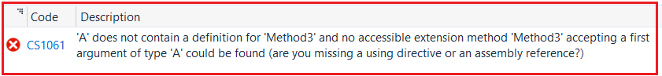

شکایت دارد که کلاس **«A» شامل تعریفی برای «Method3» نیست و هیچ متد الحاقی قابل دسترسی «Method3» که آرگومان اول از نوع «A» را بپذیرد، یافت نمی‌شود (آیا شما یک دستورالعمل using یا یک مرجع اسمبلی را از قلم انداخته‌اید؟)** و این منطقی است.

بنابراین، این دومین قانون وراثت است که یک کلاس والد هرگز نمی‌تواند به هیچ یک از اعضای کلاس فرزند که به طور خالص در کلاس فرزند تعریف شده‌اند، دسترسی داشته باشد. در این حالت، متد۳ به طور خالص در کلاس فرزند B تعریف شده است و از این رو، ما نمی‌توانیم با استفاده از شیء کلاس والد به این متد دسترسی پیدا کنیم.

##### **قانون ۳:**

ما می‌توانیم یک متغیر کلاس والد را با استفاده از نمونه کلاس فرزند مقداردهی اولیه کنیم تا آن را به یک متغیر مرجع تبدیل کنیم، به طوری که مرجع، حافظه نمونه کلاس فرزند را مصرف کند. اما در این حالت، ما نمی‌توانیم هیچ یک از اعضای خالص کلاس فرزند را با استفاده از مرجع فراخوانی کنیم.

حال، ممکن است یک سوال داشته باشید: **ارجاع چیست؟** پاسخ این است که ارجاع، اشاره‌گری به نمونه‌ای است که هیچ تخصیص حافظه‌ای ندارد.

بگذارید این را با یک مثال درک کنیم. لطفاً به کد زیر نگاهی بیندازید. در داخل متد Main، ابتدا یک متغیر p از کلاس A ایجاد می‌کنیم و در اینجا، p یک متغیر مرجع است. این یک نمونه نیست و یک متغیر است، یعنی یک کپی بدون مقدار اولیه.

```csharp
using System;

namespace InheritanceDemo
{
    class A
    {
        public A()
        {
            Console.WriteLine("Class A Constructor is Called");
        }
        public void Method1()
        {
            Console.WriteLine("Method 1");
        }
        public void Method2()
        {
            Console.WriteLine("Method 2");
        }
    }
    class B : A
    {
        public B()
        {
            Console.WriteLine("Class B Constructor is Called");
        }
        public void Method3()
        {
            Console.WriteLine("Method 3");
        }
        static void Main()
        {
            A p; //p is a variable of class A
            p.Method1();
            p.Method2();
            Console.ReadKey();
        }
    }
}
```

حال اگر سعی کنید کد بالا را اجرا کنید، با خطای زمان کامپایل زیر مواجه خواهید شد، یعنی: **استفاده از متغیر محلی بدون مقداردهی اولیه 'p'** .

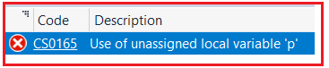

این منطقی است. متغیر p مقداردهی نشده است و از این رو، نمی‌توانیم هیچ متدی را فراخوانی کنیم. مقداردهی اولیه نشده است. چگونه یک متغیر مرجع را مقداردهی اولیه کنیم؟ مقداردهی اولیه را می‌توان با استفاده از کلمه کلیدی new در C# انجام داد. بیایید این را بررسی کنیم. در مثال زیر، متغیر مرجع کلاس والد p را با استفاده از نمونه کلاس فرزند مقداردهی اولیه کرده‌ایم و سپس اعضای کلاس والد را فراخوانی کرده‌ایم. در مثال زیر، کد متد Main خود توضیح داده شده است، بنابراین لطفاً خطوط کامنت را مطالعه کنید.

```csharp
using System;

namespace InheritanceDemo
{
    class A
    {
        public A()
        {
            Console.WriteLine("Class A Constructor is Called");
        }
        public void Method1()
        {
            Console.WriteLine("Method 1");
        }
        public void Method2()
        {
            Console.WriteLine("Method 2");
        }
    }
    class B : A
    {
        public B()
        {
            Console.WriteLine("Class B Constructor is Called");
        }
        public void Method3()
        {
            Console.WriteLine("Method 3");
        }
        static void Main()
        {
            A p; //p is a variable of class A
            B q = new B(); //q is an instance of Class B

            //We can initialize a Parent class variable using child class instance as follows
            p = q; //now, p is a reference of parent class created by using child class instance

            //Now you can call members of A class as follows
            p.Method1();
            p.Method2();

            //We cannot call any pure child class members using the reference p
            //p.Method3();
            Console.ReadKey();
        }
    }
}
```

###### **خروجی:**

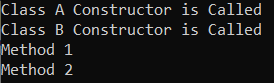

##### **خب، مرجع (Reference) در سی شارپ چیست؟**

ارجاعات یک کلاس هیچ تخصیص حافظه‌ای نخواهند داشت. آن‌ها حافظه‌ی نمونه‌ای را که برای مقداردهی اولیه به آن‌ها اختصاص داده شده است، مصرف می‌کنند. برای درک بهتر، لطفاً به نمودار زیر نگاهی بیندازید. در اینجا، هر زمان که یک نمونه ایجاد می‌کنیم، حافظه‌ای برای q اختصاص داده می‌شود. این نمونه شامل اطلاعاتی در مورد هر دو کلاس والد A و فرزند B خواهد بود. و p یک ارجاع است. و p حافظه‌ی q را مصرف می‌کند.

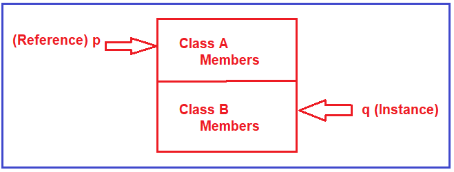

**نکته:** نکته‌ای که باید به خاطر داشته باشید این است که تخصیص حافظه در سی‌شارپ برای نمونه‌ها انجام می‌شود، نه برای ارجاع‌ها. ارجاع‌ها فقط اشاره‌گرهایی به نمونه‌ها هستند.

حال، اگر مشاهده شود، هم p و هم q به یک حافظه دسترسی دارند. اما نکته‌ای که باید درک شود این است که اگرچه p و q به یک حافظه دسترسی دارند، با استفاده از p نمی‌توانم هیچ یک از اعضای کلاس فرزند را فراخوانی کنم. به نمودار زیر مراجعه کنید. همانطور که در نمودار زیر می‌بینید، با استفاده از p نمی‌توانیم اعضای کلاس B را فراخوانی کنیم، اما با استفاده از q می‌توانیم هر دو عضو کلاس A و B را فراخوانی کنیم.

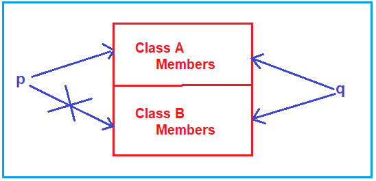

##### **قانون ۴:**

هر کلاسی که توسط ما تعریف شده باشد یا در کتابخانه‌های زبان از پیش تعریف شده باشد، یک کلاس والد پیش‌فرض، یعنی کلاس Object از فضای نام System دارد، بنابراین اعضای (Equals، GetHashCode، GetType و ToString) کلاس Object از هر جایی قابل دسترسی هستند.

معمولاً وقتی یک کلاس تعریف می‌کنیم، فکر می‌کنیم که آن را از هیچ کلاسی به ارث نبرده‌ایم. اما به طور پیش‌فرض، کلاس ما از کلاس Object به ارث برده می‌شود. بنابراین، Object کلاس والد برای تمام کلاس‌های تعریف شده در کتابخانه کلاس پایه ما و همچنین تمام کلاس‌هایی است که در برنامه خود تعریف کرده‌ایم.

از آنجا که Object کلاس والد است، چهار متد مهم (Equals، GetHashCode، GetType و ToString) از کلاس Object را می‌توان از هر جایی فراخوانی یا به آنها دسترسی داشت. برای درک بهتر، لطفاً به تصویر زیر نگاهی بیندازید. در اینجا، ما یک نمونه از کلاس Object ایجاد کرده‌ایم و وقتی می‌گوییم obj، هوش مصنوعی چهار متد را نشان می‌دهد.

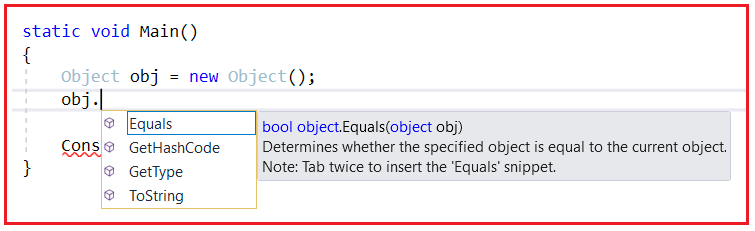

به یاد داشته باشید که چهار متد فوق از همه جا قابل دسترسی هستند. هر کلاس می‌تواند شامل متدهای Equals، GetHashCode، GetType و ToString باشد و این امر به این دلیل امکان‌پذیر است که هر کلاس در چارچوب .NET از کلاس Object به ارث رسیده است.

حالا، بیایید یک شیء از کلاس A ایجاد کنیم، و وقتی obj. را تایپ می‌کنید، هوش مصنوعی 6 متد را نشان می‌دهد، یعنی 2 متد (Method1 و Method2) از کلاس A و چهار متد (Equals، GetHashCode، GetType و ToString) از کلاس Object که در تصویر زیر نشان داده شده است.

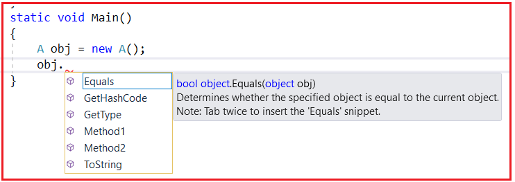

معمولاً وقتی کد خود را کامپایل می‌کنید، کامپایلر بررسی می‌کند که آیا این کلاس از کلاس دیگری ارث‌بری می‌کند یا خیر. اگر بله، مشکلی وجود ندارد. اگر خیر، کامپایلر به‌طور خودکار این کلاس را از کلاس Object ارث‌بری می‌کند. در مثال ما، کلاس A از هیچ کلاسی ارث‌بری نمی‌کند. در زمان کامپایل، این کلاس به‌طور خودکار از کلاس Object ارث‌بری می‌کند.

از سوی دیگر، هنگام کامپایل کلاس B، بررسی می‌کند که آیا کلاس B از کلاس دیگری به ارث رسیده است یا خیر. بله، کلاس B از کلاس A به ارث رسیده است. خیر، باید از Object به ارث برده شود. دلیل این امر این است که کلاس A در حال حاضر از Object به ارث رسیده است. از آنجا که کلاس A از Object به ارث رسیده است، برای کلاس B، Object کلاس والد است و شاید یک پدربزرگ یا مادربزرگ باشد.

بنابراین، نکته‌ای که باید به خاطر داشته باشید این است که هر کلاس در چارچوب .NET به طور مستقیم یا غیرمستقیم از کلاس Object به ارث می‌رسد.

**نکته:** کلاس شیء از تمام کلاس‌های موجود در سلسله مراتب کلاس‌های چارچوب دات‌نت پشتیبانی می‌کند و خدمات سطح پایینی را برای کلاس‌های مشتق شده فراهم می‌کند. این کلاس، کلاس پایه نهایی تمام کلاس‌ها در چارچوب دات‌نت است؛ این کلاس ریشه سلسله مراتب نوع است.

##### **کلاس والد پیش‌فرض در سی شارپ چیست؟**

کلاس Default Parent، کلاس Object موجود در فضای نام System است.

حالا، لطفاً به مثال زیر نگاهی بیندازید. در اینجا، ما سه نمونه ایجاد کرده‌ایم که نمونه‌هایی از کلاس Object، کلاس A و کلاس B هستند و متد GetType را فراخوانی کرده‌ایم. متد GetType نوع زمان اجرای دقیق نمونه فعلی را برمی‌گرداند. این متد نام کامل، یعنی فضای نام و نام کلاس را به شما می‌گوید.

```csharp
using System;

namespace InheritanceDemo
{
    class A
    {
        public A()
        {
            Console.WriteLine("Class A Constructor is Called");
        }
        public void Method1()
        {
            Console.WriteLine("Method 1");
        }
        public void Method2()
        {
            Console.WriteLine("Method 2");
        }
    }
    class B : A
    {
        public B()
        {
            Console.WriteLine("Class B Constructor is Called");
        }
        public void Method3()
        {
            Console.WriteLine("Method 3");
        }
        static void Main()
        {
            Object obj1 = new Object();
            Console.WriteLine($"obj1 type: {obj1.GetType()}");
            A obj2 = new A();
            Console.WriteLine($"obj2 type: {obj2.GetType()}");
            B obj3 = new B();
            Console.WriteLine($"obj3 type: {obj3.GetType()}");

            Console.ReadKey();
        }
    }
}
```

###### **خروجی:**

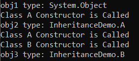

##### **اجرای سازنده در مثال بالا:**

1. وقتی نمونه‌ای از کلاس Object ایجاد می‌کنیم، فقط سازنده‌ی کلاس Object فراخوانی می‌شود.
2. اما وقتی یک نمونه از کلاس A ایجاد می‌کنیم، دو سازنده فراخوانی می‌شوند. ابتدا، سازنده کلاس Object و سپس سازنده کلاس A را اجرا می‌کند.
3. وقتی ما یک نمونه از کلاس B ایجاد می‌کنیم، سه سازنده اجرا می‌شوند. ابتدا، سازنده کلاس Object را اجرا می‌کند؛ سپس سازنده کلاس A را اجرا می‌کند؛ و در آخر، سازنده کلاس B را اجرا می‌کند.

##### **قانون ۵:**

در سی شارپ، ما از ارث‌بری چندگانه از طریق کلاس‌ها پشتیبانی نمی‌کنیم. چیزی که به ما ارائه می‌شود، فقط یک ارث‌بری واحد از طریق کلاس‌ها است. این بدان معناست که با کلاس‌ها، فقط یک کلاس والد بلافصل مجاز است (یعنی از Single، Multilevel و Hierarchical پشتیبانی می‌شود) و بیش از یک کلاس والد بلافصل در سی شارپ با کلاس‌ها مجاز نیست (یعنی Multiple و Hybrid پشتیبانی نمی‌شوند). در مقاله بعدی، این قانون را به تفصیل مورد بحث قرار خواهیم داد.

##### **قانون ۶:**

در قانون ۱، یاد گرفتیم که هر زمان نمونه کلاس فرزند ایجاد می‌شود، سازنده کلاس فرزند به طور ضمنی سازنده کلاس‌های والد خود را فراخوانی می‌کند، اما اگر سازنده کلاس‌های والد بدون پارامتر باشد. اگر سازنده کلاس والد پارامتری باشد، سازنده کلاس فرزند نمی‌تواند به طور ضمنی سازنده کلاس والد خود را فراخوانی کند. بنابراین، برای غلبه بر این مشکل، وظیفه برنامه‌نویس است که به طور صریح سازنده کلاس‌های والد را از سازنده کلاس فرزند فراخوانی کند و مقادیر را به آن پارامترها منتقل کند. برای فراخوانی سازنده کلاس والد از کلاس فرزند، باید از کلمه کلیدی base استفاده کنیم.

بگذارید این را با یک مثال درک کنیم. بیایید سازنده کلاس والد را به صورت زیر پارامتردهی کنیم. در اینجا، سازنده یک پارامتر عدد صحیح می‌گیرد و آن مقدار را در پنجره کنسول چاپ می‌کند.

```csharp
using System;

namespace InheritanceDemo
{
    class A
    {
        public A(int number)
        {
            Console.WriteLine($"Class A Constructor is Called : {number}");
        }
        public void Method1()
        {
            Console.WriteLine("Method 1");
        }
        public void Method2()
        {
            Console.WriteLine("Method 2");
        }
    }
    class B : A
    {
        public B()
        {
            Console.WriteLine("Class B Constructor is Called");
        }
        public void Method3()
        {
            Console.WriteLine("Method 3");
        }
        static void Main()
        {
            B obj = new B();
            Console.ReadKey();
        }
    }
}
```

حال اگر کد را کامپایل کنید، خواهید دید که کلاس B یک خطا می‌دهد، همانطور که در تصویر زیر نشان داده شده است.

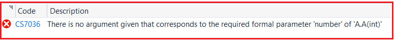

این ایراد را دارد که « **هیچ آرگومانی داده نشده که با پارامتر رسمی مورد نیاز 'number' از 'AA(int)' مطابقت داشته باشد »** و این منطقی است. دلیل این امر این است که سازنده کلاس B به طور ضمنی سازنده کلاس A را فراخوانی می‌کند. اما اگر می‌خواهید سازنده کلاس A را فراخوانی کنید، اکنون به یک پارامتر عدد صحیح نیاز دارد. بدون ارسال پارامتر، نمی‌توانیم سازنده کلاس A را فراخوانی کنیم. بنابراین، اکنون، سازنده کلاس B قادر به فراخوانی سازنده کلاس A نیست.

##### **چرا نمی‌تواند سازنده را فراخوانی کند؟**

پیش از این، سازنده بدون پارامتر بود، بنابراین مستقیماً سازنده کلاس والد را فراخوانی می‌کرد. در حال حاضر، سازنده پارامتردهی شده است. اگر می‌خواهید آن را فراخوانی کنید، اکنون به یک مقدار نیاز دارید. سازنده کلاس B نمی‌داند چه مقداری را باید به سازنده کلاس A ارسال کند. به همین دلیل است که در کلاس B با خطا مواجه می‌شویم، نه در کلاس A. چرا؟ زیرا کلاس B قادر به فراخوانی سازنده کلاس A نیست.

خب، چه باید کرد؟ فراخوانی ضمنی کار نمی‌کند. بنابراین، برای حل خطا، باید به سراغ فراخوانی صریح برویم. چگونه فراخوانی کنیم؟ به کد زیر مراجعه کنید. در اینجا، کلمه کلیدی base به کلاس والد، یعنی کلاس A، اشاره دارد. در اینجا باید مقدار را برای سازنده کلاس Base یا کلاس Parent ارسال کنیم.

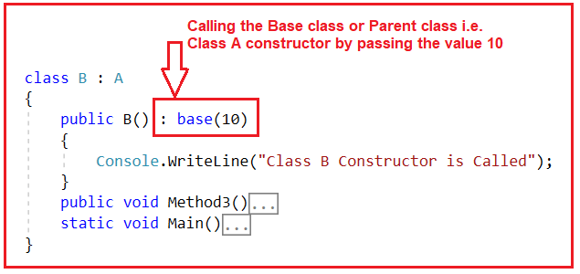

بنابراین، در اینجا ما مقدار ۱۰ را به کلاس والد، یعنی سازنده A، ارسال می‌کنیم. این مقدار ۱۰ توسط سازنده کلاس والد دریافت خواهد شد. کد کامل در زیر آمده است.

```csharp
using System;

namespace InheritanceDemo
{
    class A
    {
        public A(int number)
        {
            Console.WriteLine($"Class A Constructor is Called : {number}");
        }
        public void Method1()
        {
            Console.WriteLine("Method 1");
        }
        public void Method2()
        {
            Console.WriteLine("Method 2");
        }
    }
    class B : A
    {
        public B() : base(10)
        {
            Console.WriteLine("Class B Constructor is Called");
        }
        public void Method3()
        {
            Console.WriteLine("Method 3");
        }
        static void Main()
        {
            B obj = new B();
            Console.ReadKey();
        }
    }
}
```

###### **خروجی:**

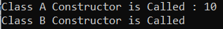

##### **چگونه در سی شارپ مقدار پویا را به سازنده کلاس والد منتقل کنیم؟**

در مثال قبلی، مقدار 10 را به صورت hardcode شده تعریف کرده‌ایم. بنابراین، هر بار که یک نمونه ایجاد می‌کنیم، همان مقدار به سازنده‌ی والد اختصاص داده می‌شود. اما اگر بخواهیم، ​​می‌توانیم مقدار پویا را نیز ارسال کنیم. بیایید این را با یک مثال بررسی کنیم. در مثال زیر، کلاس فرزند، یعنی سازنده‌ی کلاس B، یک پارامتر می‌گیرد و مقدار آن پارامتر را به کلاس والد، یعنی سازنده‌ی کلاس A، ارسال می‌کند. و وقتی نمونه‌ای از کلاس B ایجاد می‌کنیم، باید مقدار پارامتر را ارسال کنیم.

```csharp
using System;

namespace InheritanceDemo
{
    class A
    {
        public A(int number)
        {
            Console.WriteLine($"Class A Constructor is Called : {number}");
        }
        public void Method1()
        {
            Console.WriteLine("Method 1");
        }
        public void Method2()
        {
            Console.WriteLine("Method 2");
        }
    }
    class B : A
    {
        public B(int num) : base(num)
        {
            Console.WriteLine("Class B Constructor is Called");
        }
        public void Method3()
        {
            Console.WriteLine("Method 3");
        }
        static void Main()
        {
            B obj1 = new B(10);
            B obj2 = new B(20);
            B obj3 = new B(30);
            Console.ReadKey();
        }
    }
}
```

###### **خروجی:**

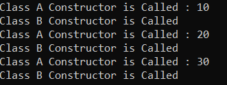

بنابراین، در مثال بالا، وقتی نمونه را ایجاد می‌کنیم، مقدار را ارسال می‌کنیم. مقدار ابتدا به سازنده کلاس فرزند می‌رسد و سازنده کلاس فرزند همان مقدار را به سازنده کلاس والد ارسال می‌کند. در صورت تمایل، می‌توانید از همان مقدار در کلاس فرزند نیز استفاده کنید.

بنابراین، این شش قانون هستند که باید هنگام کار با وراثت در سی شارپ به خاطر داشته باشید.

##### **مزایای ارث بری در سی شارپ:**

**قابلیت استفاده مجدد از کد:** می‌توانیم از اعضای کلاس والد یا کلاس پایه در کلاس فرزند یا کلاس مشتق شده استفاده مجدد کنیم. بنابراین، نیازی به تعریف مجدد اعضا در کلاس فرزند نیست. بنابراین، کد کمتری در کلاس مورد نیاز است.