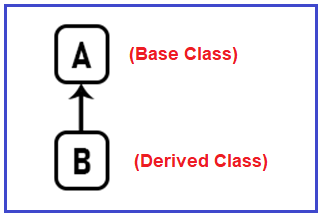
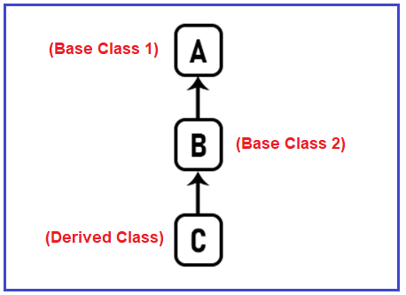
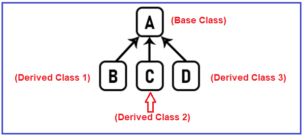
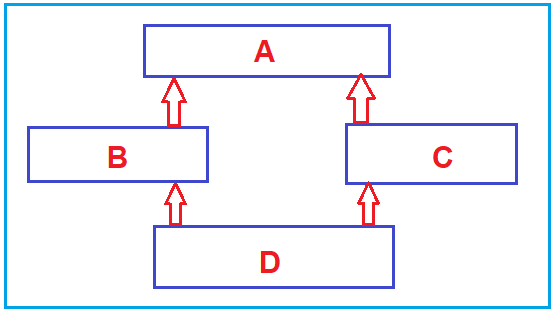
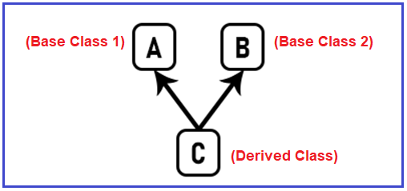
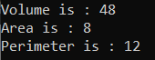

## **انواع ارث بری در سی شارپ به همراه مثال**

در این مقاله، قصد دارم **انواع ارث‌بری در زبان سی‌شارپ را** به همراه مثال بررسی کنم. 

##### **انواع ارث بری در سی شارپ**

چیزی که این نوع وراثت به ما می‌گوید تعداد کلاس‌های والد یک کلاس فرزند یا تعداد کلاس‌های فرزند یک کلاس والد است. طبق گفته‌ی ++C، دلیل اینکه در مورد ++C صحبت می‌کنم این است که برنامه‌نویسی شی‌گرا فقط از ++C وارد عرصه شد، پنج نوع وراثت مختلف وجود دارد.

1. وراثت تکی
2. وراثت چند سطحی
3. وراثت سلسله مراتبی
4. وراثت ترکیبی
5. وراثت چندگانه

##### **وراثت تکی:**

وقتی یک کلاس از یک کلاس پایه واحد به ارث می‌رسد، به این ارث‌بری، ارث‌بری تکی گفته می‌شود. برای درک بهتر، لطفاً به تصویر زیر نگاهی بیندازید.



همانطور که در تصویر بالا مشاهده می‌کنید، اگر کلاسی به نام A داشته باشیم که کلاس والد است و کلاس دیگری به نام B که کلاس فرزند است، و کلاس B از کلاس AIe ارث‌بری کند، کلاس B یک کلاس والد واحد، یعنی کلاس A، دارد. این نوع ارث‌بری، ارث‌بری یگانه (Single Inheritance) نامیده می‌شود.

##### **وراثت چند سطحی:**

وقتی یک کلاس مشتق شده از یک کلاس مشتق شده دیگر ایجاد می‌شود، به چنین نوعی از وراثت، وراثت چند سطحی (Multilevel Inheritance) گفته می‌شود. برای درک بهتر، لطفاً به تصویر زیر نگاهی بیندازید.



اگر کلاسی به نام A وجود داشته باشد و از کلاس A، کلاس B و از کلاس B، کلاس C ارث‌بری کنند، به چنین نوع ارث‌بری، ارث‌بری چندسطحی (Multilevel Inheritance) گفته می‌شود.

##### **وراثت سلسله مراتبی:**

وقتی بیش از یک کلاس مشتق شده از یک کلاس پایه ایجاد شود، به آن وراثت سلسله مراتبی گفته می‌شود. برای درک بهتر، لطفاً به تصویر زیر نگاهی بیندازید.



حال اگر کلاسی به نام A داشته باشید و از این کلاس A، اگر بیش از یک کلاس ارث‌بری کنند، یعنی کلاس B ارث‌بری کند، کلاس C نیز ارث‌بری کند و همچنین کلاس D نیز ارث‌بری کند، یعنی وقتی بیش از یک کلاس فرزند از یک کلاس پایه واحد ارث‌بری کنند، چنین نوعی از ارث‌بری، ارث‌بری سلسله مراتبی نامیده می‌شود.

##### **وراثت چندگانه:**

وقتی یک کلاس مشتق شده از بیش از یک کلاس پایه ایجاد می‌شود، به چنین نوع وراثتی، وراثت چندگانه گفته می‌شود. برای درک بهتر، لطفاً به تصویر زیر نگاهی بیندازید.


اگر کلاس‌های A و B وجود داشته باشند و از هر دوی آنها کلاس C ارث‌بری کند، چنین نوع ارث‌بری را ارث‌بری چندگانه می‌نامند. بنابراین، وقتی یک کلاس چندین کلاس والد دارد، چنین نوع ارث‌بری را ارث‌بری چندگانه می‌نامند.

##### **وراثت ترکیبی:**

وراثت ترکیبی، وراثتی است که ترکیبی از هر وراثت تکی، سلسله مراتبی و چند سطحی است. برای درک بهتر، لطفاً به تصویر زیر نگاهی بیندازید.



دو زیرکلاس وجود دارد، یعنی B و C که از کلاس A ارث می‌برند (این ارث‌بری سلسله مراتبی است). سپس از B و C، یک کلاس دیگر وجود دارد که D از B و C ارث می‌برد. حال، این ترکیبی از ارث‌بری سلسله مراتبی از بالا و ارث‌بری چندگانه (D از B و C ارث می‌برد) از پایین است. علاوه بر این، از A به B و از B به C یعنی ارث‌بری چند سطحی. بنابراین، اگر این نوع ارث‌بری را داشته باشید، ویژگی‌های کلاس پایه A از طریق کلاس B و کلاس C در کلاس D ظاهر می‌شوند. این نوع ارث‌بری، ارث‌بری ترکیبی نامیده می‌شود.

طبقه‌بندی فوق بر اساس زبان برنامه‌نویسی ++C است.

##### **انواع ارث بری در سی شارپ:**

اگر به وراثت‌های تکی، چندسطحی و سلسله مراتبی نگاه کنید، بسیار شبیه به هم به نظر می‌رسند. در هر مقطع زمانی، آنها یک کلاس والد بی‌واسطه دارند. اما اگر به وراثت‌های چندگانه و ترکیبی نگاه کنید، آنها بیش از یک کلاس والد بی‌واسطه برای یک کلاس فرزند دارند. بنابراین، می‌توانیم پنج دسته وراثت فوق را بر اساس کلاس والد بی‌واسطه به دو نوع زیر طبقه‌بندی کنیم:

1. **وراثت تکی (تکی، چند سطحی و سلسله مراتبی)**
2. **وراثت چندگانه (چندگانه و ترکیبی)**

##### **وراثت یگانه در سی شارپ:**

اگر یک کلاس فقط یک کلاس والد بی‌واسطه داشته باشد، آن را وراثت یگانه در سی‌شارپ می‌نامیم. برای درک بهتر، لطفاً به نمودار زیر نگاهی بیندازید. ببینید، C چند کلاس والد بی‌واسطه دارد؟ 1 کلاس یعنی B، و B چند کلاس والد بی‌واسطه دارد؟ 1 کلاس یعنی A. بنابراین، برای کلاس C، والد بی‌واسطه، کلاس B و برای کلاس B، والد بی‌واسطه، کلاس A است.


###### **وراثت چندگانه در سی شارپ:**

اگر یک کلاس بیش از یک کلاس والد بی‌واسطه داشته باشد، در زبان سی‌شارپ به آن وراثت چندگانه (Multiple Inheritance) می‌گوییم. برای درک بهتر، لطفاً به نمودار زیر نگاهی بیندازید. ببینید، کلاس C بیش از یک کلاس والد بی‌واسطه یعنی A و B دارد و از این رو وراثت چندگانه (Multiple Inheritance) است.



بنابراین، نکته‌ای که باید به خاطر داشته باشید این است که یک کلاس فرزند چند کلاس والد بی‌واسطه دارد. اگر یک کلاس والد بی‌واسطه داشته باشد، آن را وراثت یگانه (Single Inheritance) می‌نامیم و اگر بیش از یک کلاس والد بی‌واسطه داشته باشد، آن را وراثت چندگانه (Multiple inheritance) می‌نامیم. بنابراین، نباید هیچ گونه سردرگمی بین ۵ نوع مختلف وراثت وجود داشته باشد، به سادگی ما دو نوع وراثت داریم.

##### **مثالی برای درک وراثت یگانه در سی شارپ:**

```csharp
using System;

namespace InheritanceDemo
{
    public class Program
    {
        static void Main()
        {
            // Creating object of Child class and
            // invoke the methods of Parent and Child classes
            Cuboid obj =  new Cuboid(2, 4, 6);
            Console.WriteLine($"Volume is : {obj.Volume()}");
            Console.WriteLine($"Area is : {obj.Area()}");
            Console.WriteLine($"Perimeter is : {obj.Perimeter()}");
            Console.ReadKey();
        }
    }
    //Parent class
    public class Rectangle
    {
        public int length;
        public int breadth;
        public int Area()
        {
            return length * breadth;
        }
        public int Perimeter()
        {
            return 2 * (length + breadth);
        }
    }
    
    //Child Class
    class Cuboid : Rectangle
    {
        public int height;
        public Cuboid(int l, int b, int h)
        {
            length = l;
            breadth = b;
            height = h;
        }
        public int Volume()
        {
            return length * breadth * height;
        }
    }
}
```

###### **خروجی:**



##### **مثال برای درک وراثت چندگانه در سی شارپ:**

```csharp
using System;

namespace InheritanceDemo
{
    public class Program
    {
        static void Main()
        {
            // Creating object of Child class and
            // invoke the methods of Parent classes and Child class
            SmartPhone obj = new SmartPhone(); ;
            obj.GetPhoneModel();
            obj.GetCameraDetails();
            obj.GetDetails();

            Console.ReadKey();
        }
    }
    //Parent Class 1
    class Phone
    {
        public void GetPhoneModel()
        {
            Console.WriteLine("Redmi Note 5 Pro");
        }
    }
    //Parent class2
    class Camera
    {
        public void GetCameraDetails()
        {
            Console.WriteLine("24 Mega Pixel Camera");
        }
    }

    //Child Class derived from more than one Parent class
    class SmartPhone : Phone, Camera
    {
        public void GetDetails()
        {
            Console.WriteLine("Its a RedMi Smart Phone");
        }
    }
}
```

**خروجی: خطای زمان کامپایل**

**نکته:** مدیریت پیچیدگی ناشی از وراثت چندگانه بسیار پیچیده است. از این رو در دات نت با کلاس پشتیبانی نمی‌شد و می‌توان آن را با رابط‌ها انجام داد

##### **طبقه بندی وراثت در سی شارپ**

سی شارپ.نت وراثت را به دو دسته طبقه‌بندی کرد، مانند

1. **وراثت پیاده‌سازی:** هرگاه یک کلاس از کلاس دیگری مشتق شود، به آن وراثت پیاده‌سازی می‌گویند.
2. **وراثت رابط:** هر زمان که یک کلاس از یک رابط مشتق شود، به آن وراثت رابط گفته می‌شود.
`