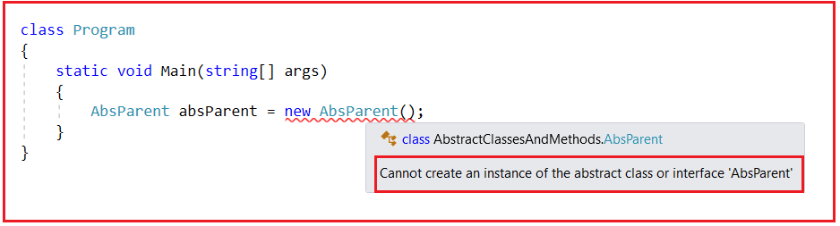
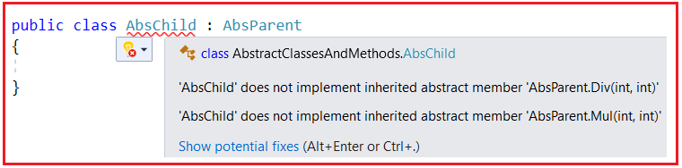
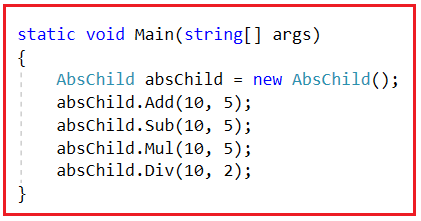
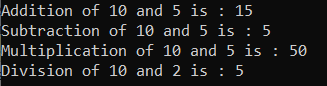
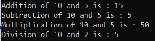

## **کلاس‌های انتزاعی و متدهای انتزاعی در سی شارپ به همراه مثال**

در سی‌شارپ را با مثال‌هایی مورد بحث قرار خواهم داد **کلاس‌ها و متدهای انتزاعی** در این مقاله، در پایان این مقاله، نکات زیر را خواهید فهمید:

1. **متدهای انتزاعی در سی شارپ چیست؟**
2. **کلاس‌های انتزاعی در سی شارپ چیستند؟**
3. **کاربرد متد انتزاعی (Abstract Method) در سی شارپ چیست؟**
4. **آیا کلاس انتزاعی فقط شامل متدهای انتزاعی در سی شارپ است؟**
5. **چه کسی پیاده‌سازی متدهای انتزاعی را ارائه خواهد داد؟**
6. **مثال برای درک کلاس انتزاعی و متدهای انتزاعی در سی شارپ**
7. **آیا می‌توانیم در سی شارپ نمونه‌ای از کلاس انتزاعی (Abstract Class) ایجاد کنیم؟**
8. **چرا نمی‌توان از کلاس انتزاعی در سی شارپ نمونه‌سازی کرد؟**
9. **آیا می‌توانیم در سی شارپ برای کلاس انتزاعی (Abstract Class) یک مرجع (Reference) ایجاد کنیم؟**
10. **چه زمانی از کلاس‌ها و متدهای انتزاعی در سی شارپ استفاده کنیم؟**

##### **متدهای انتزاعی در سی شارپ چیست؟**

در سی شارپ، متدهای انتزاعی، متدهایی هستند که درون یک کلاس انتزاعی یا یک رابط تعریف می‌شوند و بدنه متد یا پیاده‌سازی در کلاس یا رابط تعریف‌کننده ندارند. در عوض، مسئولیت پیاده‌سازی متد به هر کلاس عینی (غیر انتزاعی) که از کلاس انتزاعی مشتق می‌شود یا رابط را پیاده‌سازی می‌کند، واگذار می‌شود.

متدی که بدنه ندارد، متد انتزاعی (Abstract Method) نامیده می‌شود. آنچه این متد شامل می‌شود، فقط اعلان متد است. این بدان معناست که متد انتزاعی فقط شامل اعلان است و پیاده‌سازی ندارد. متد زیر یک متد غیر انتزاعی است زیرا حاوی بدنه است.  
**تابع جمع عمومی از نوع void (عدد صحیح ۱، عدد صحیح ۲)**  
**{**  
**}**

اما بدون نوشتن بدنه متد، اگر متد را با یک نقطه ویرگول به صورت زیر تمام کنیم، به آن متد انتزاعی (Abstract Method) گفته می‌شود.  
**تابع جمع عمومی از نوع void (عدد صحیح ۱، عدد صحیح ۲)؛**

اما به یاد داشته باشید، اگر می‌خواهید هر متدی را به یک متد انتزاعی تبدیل کنید، باید صریحاً از اصلاح‌کننده انتزاعی به شرح زیر استفاده کنید. و هنگامی که از اصلاح‌کننده انتزاعی استفاده می‌کنید، به طور خودکار، آن متد، یک متد انتزاعی نامیده می‌شود.  
**تابع انتزاعی عمومی Add(int num1, int num2);**

خب، کلاس‌های انتزاعی چه هستند؟

##### **کلاس‌های انتزاعی در سی شارپ چیستند؟**

در سی شارپ، یک کلاس انتزاعی (abstract class) کلاسی است که به عنوان طرح اولیه برای کلاس‌های دیگر عمل می‌کند. کلاس‌های انتزاعی را نمی‌توان مستقیماً نمونه‌سازی کرد، اما می‌توان از آنها به عنوان کلاس‌های پایه برای کلاس‌های دیگری که از آنها مشتق می‌شوند استفاده کرد. کلاس‌های انتزاعی با استفاده از کلمه کلیدی abstract تعریف می‌شوند. آنها اغلب مجموعه‌ای مشترک از ویژگی‌ها یا رفتارهایی را تعریف می‌کنند که باید بین چندین کلاس مشتق شده به اشتراک گذاشته شوند.

کلاسی که در آن متدهای انتزاعی تعریف می‌کنیم، به عنوان یک کلاس انتزاعی شناخته می‌شود. طبق برنامه‌نویسی شی‌گرا، باید یک متد را درون یک کلاس تعریف کنیم. نمی‌توانیم متدهای انتزاعی را مستقیماً در هیچ کجا تعریف کنیم. ما فقط باید متد انتزاعی را درون یک کلاس انتزاعی تعریف کنیم. فرض کنید باید متد انتزاعی Add فوق را درون یک کلاس Calculator بنویسیم. سپس، آن کلاس باید با استفاده از اصلاح‌کننده انتزاعی زیر تعریف شود.  
**ماشین حساب کلاس انتزاعی عمومی**  
**{**  
**تابع انتزاعی عمومی Add(int num1, int num2);**  
**}**  
بنابراین، وقتی یک کلاس شامل هرگونه متد انتزاعی است، باید و باید با استفاده از اصلاحگر انتزاعی تعریف شود، و وقتی یک کلاس با استفاده از اصلاحگر انتزاعی ایجاد می‌شود، در سی شارپ به آن کلاس انتزاعی می‌گویند. بنابراین، اینگونه است که ما یک کلاس انتزاعی و متدهای انتزاعی را در سی شارپ تعریف می‌کنیم.

معمولاً وقتی یک کلاس انتزاعی تعریف می‌کنیم، یک شک داریم: بدون بدنه متد، کاربرد آن متد چیست؟ بیایید این را بفهمیم.

##### **کاربرد متد انتزاعی (Abstract Method) در سی شارپ چیست؟**

اگر یک متد تحت هر کلاسی به صورت انتزاعی تعریف شود، کلاس فرزند آن کلاس انتزاعی مسئول پیاده‌سازی بدون نقص متد انتزاعی خواهد بود.

در **وراثت** ، می‌بینیم که کلاس والد برخی از ویژگی‌ها را برای مصرف به کلاس فرزند ارائه می‌دهد. در اینجا نیز، وراثت مطرح می‌شود، اما نکته‌ای که باید به خاطر داشته باشید این است که کلاس والد انتزاعی است و هیچ ویژگی‌ای را برای مصرف به کلاس فرزند ارائه نمی‌دهد. در عوض، محدودیت‌هایی را بر کلاس‌های فرزند اعمال می‌کند. و فرزندان یا کلاس‌های فرزند باید از آن محدودیت‌ها پیروی کنند یا آن محدودیت‌ها را برآورده سازند. و این ایده اساسی کلاس انتزاعی در سی شارپ است. بعداً به این نکته خواهیم پرداخت.

**نکته:** هر متد انتزاعی که درون یک کلاس انتزاعی تعریف می‌شود، باید و باید توسط کلاس‌های فرزند (Child) بدون هیچ مشکلی پیاده‌سازی شود؛ در غیر این صورت، با خطای زمان کامپایل مواجه خواهیم شد.

##### **آیا کلاس انتزاعی فقط شامل متدهای انتزاعی در سی شارپ است؟**

فکر نکنید که یک کلاس انتزاعی می‌تواند فقط شامل متدهای انتزاعی باشد. همچنین می‌تواند شامل متدهای غیر انتزاعی باشد. باید به خاطر داشته باشید که اگر یک کلاس غیر انتزاعی باشد، فقط شامل متدهای غیر انتزاعی است، اما اگر یک کلاس انتزاعی باشد، در سی شارپ هم متدهای انتزاعی و هم متدهای غیر انتزاعی را در خود جای می‌دهد.

##### **چه کسی پیاده‌سازی متدهای انتزاعی در سی شارپ را ارائه خواهد داد؟**

پاسخ، کلاس فرزند است. اگر یک کلاس فرزند از یک کلاس انتزاعی دارید، مسئولیت پیاده‌سازی تمام متدهای انتزاعی کلاس والد بر عهده کلاس فرزند است. شما نمی‌توانید از این کار فرار کنید. هر متدی باید پیاده‌سازی شود. اگر تمام متدهای انتزاعی را پیاده‌سازی کنید، فقط می‌توانید از متد غیر انتزاعی کلاس والد استفاده کنید.

به طور کلی، در وراثت دیدیم که کلاس فرزند می‌تواند مستقیماً از اعضای کلاس والد استفاده کند. اما در اینجا، این امکان وجود ندارد. شما نمی‌توانید مستقیماً از آنها استفاده کنید. این ویژگی تحت محدودیت‌هایی است. تا زمانی که کلاس فرزند محدودیت‌ها را برآورده نکند، کلاس فرزند نمی‌تواند از اعضای کلاس والد استفاده کند.

بنابراین، نکته‌ای که باید به خاطر داشته باشید این است که در کلاس فرزند، باید تک تک متدهای انتزاعی کلاس والد را پیاده‌سازی کنید و سپس فقط خودتان می‌توانید از متدهای غیرانتزاعی کلاس والد استفاده کنید.

بیایید این را با یک مثال واقعی مقایسه کنیم. فرض کنید پدر به پسرش قول داده است که اگر در امتحان سالانه ۹۰٪ نمره بیاورد، یک لپ‌تاپ به عنوان پاداش دریافت خواهد کرد. بنابراین، لپ‌تاپ فقط در صورتی به پسر داده می‌شود که در امتحان سالانه ۹۰٪ نمره بیاورد. حال، اگر پسر بخواهد لپ‌تاپ را دریافت کند، باید الزامات تعیین شده توسط پدرش را برآورده کند. **الزام چیست؟** الزام، دستیابی به ۹۰٪ نمره است. به محض اینکه پسر الزام را برآورده کند، یعنی به محض اینکه در امتحان سالانه ۹۰٪ نمره بگیرد، لپ‌تاپ به او داده می‌شود. تا آن زمان، لپ‌تاپ را دریافت نخواهد کرد.

این دقیقاً در مورد یک کلاس انتزاعی نیز صادق است. کلاس انتزاعی شامل هر دو متد انتزاعی و غیر انتزاعی است. می‌توانید متد انتزاعی را به عنوان نمرات کسب شده در امتحان سالانه و متد غیر انتزاعی را به عنوان لپ‌تاپ در نظر بگیرید. بنابراین، اگر می‌خواهید لپ‌تاپ را دریافت کنید (یعنی از یک متد غیر انتزاعی استفاده کنید)، باید الزامات را برآورده کنید، یعنی ۹۰٪ نمرات را در امتحان سالانه کسب کنید (یعنی تمام متدهای انتزاعی را پیاده‌سازی کنید).

**نکته:** برای تعریف یک متد به صورت انتزاعی یا کلاس به صورت انتزاعی، باید از کلمه کلیدی abstract استفاده کنیم.

**نکته:** متدهای انتزاعی معمولاً در کلاس‌های انتزاعی استفاده می‌شوند. یک کلاس انتزاعی را نمی‌توان نمونه‌سازی کرد؛ این کلاس به عنوان یک طرح اولیه برای کلاس‌های دیگر عمل می‌کند. متدهای انتزاعی در یک کلاس انتزاعی، قراردادی را تعریف می‌کنند که هر کلاس (زیر) مشتق شده باید آن را پیاده‌سازی کند. یک کلاس انتزاعی با استفاده از کلمه کلیدی abstract اعلان می‌شود.

##### **مثال برای درک کلاس انتزاعی و متدهای انتزاعی در سی شارپ:**

بیایید با یک مثال، کلاس انتزاعی و متدهای انتزاعی در سی شارپ را درک کنیم. لطفاً به کلاس زیر نگاهی بیندازید. این کلاس، کلاس انتزاعی والد ما خواهد بود. در این کلاس، دو متد غیر انتزاعی، یعنی Add و Sum، و دو متد انتزاعی، یعنی Mul و Div، تعریف کرده‌ایم. علاوه بر این، اگر توجه کرده باشید، کلاس AbsParent را با استفاده از کلمه کلیدی abstract ایجاد کردیم، زیرا این کلاس شامل دو متد انتزاعی است.

```csharp
public abstract class AbsParent
{
    public void Add(int x, int y)
    {
        Console.WriteLine($"Addition of {x} and {y} is : {x + y}");
    }
    public void Sub(int x, int y)
    {
        Console.WriteLine($"Subtraction of {x} and {y} is : {x - y}");
    }
    public abstract void Mul(int x, int y);
    public abstract void Div(int x, int y);
}
```

##### **آیا می‌توانیم در سی شارپ نمونه‌ای از یک کلاس انتزاعی ایجاد کنیم؟**

خیر. ما نمی‌توانیم نمونه‌ای از یک کلاس انتزاعی ایجاد کنیم. چه کلاس انتزاعی شامل متدهای انتزاعی باشد و چه نباشد، ایجاد نمونه‌ای از کلاس انتزاعی غیرممکن است. اگر سعی کنید این کار را انجام دهید، همانطور که در تصویر زیر نشان داده شده است، با خطای زمان کامپایل مواجه خواهید شد.



همانطور که در تصویر بالا می‌بینید، به وضوح می‌گوید که شما نمی‌توانید نمونه‌ای از یک کلاس انتزاعی ایجاد کنید، و این منطقی است. دلیلش این است که اگر به ما اجازه می‌دهد نمونه‌ای از کلاس انتزاعی ایجاد کنیم، سپس با استفاده از آن نمونه، می‌توانید متدهای انتزاعی کلاس انتزاعی را که بدنه ندارند، فراخوانی کنید و به همین دلیل است که به ما اجازه نمی‌دهد نمونه‌ای از کلاس انتزاعی در سی شارپ ایجاد کنیم.

در حال حاضر، کلاس انتزاعی هیچ عضو استاتیکی ندارد. اگر عضو استاتیکی وجود داشته باشد، می‌توانید مستقیماً با استفاده از نام کلاس آنها را فراخوانی کنید. اما برای فراخوانی اعضای غیر استاتیک، به یک نمونه نیاز داریم. پس چه کسی می‌تواند اعضای فوق را مصرف کند؟ پاسخ، کلاس فرزند است.

فرض کنید یک کلاس فرزند برای کلاس AbsParent فوق وجود دارد. سپس، کلاس فرزند باید قبل از استفاده از متدهای Add و Sub، متدهای انتزاعی Mul و Div را پیاده‌سازی کند. لطفاً به کد زیر توجه کنید. در اینجا، ما کلاس AbsChild را با ارث‌بری از کلاس AbsParent ایجاد کرده‌ایم. در اینجا، ما دو متد انتزاعی را پیاده‌سازی نکرده‌ایم. بنابراین، خطای زمان کامپایل به ما می‌دهد.



در اینجا، ما دو خطا دریافت می‌کنیم. یکی برای عدم پیاده‌سازی متد Div کلاس والد و دیگری برای عدم پیاده‌سازی متد Mul کلاس والد. این بدان معناست که کلاس فرزند موظف است پیاده‌سازی تمام متدهای انتزاعی کلاس والد را فراهم کند.

##### **چرا نمی‌توان از کلاس انتزاعی در سی شارپ نمونه‌سازی کرد؟**

متدهای انتزاعی آن قابل اجرا نیستند زیرا یک کلاس کاملاً پیاده‌سازی شده نیست. اگر کامپایلر به ما اجازه دهد که برای یک کلاس انتزاعی شیء ایجاد کنیم، می‌توانیم متد انتزاعی را با استفاده از آن شیء فراخوانی کنیم، که CLR نمی‌تواند آن را در زمان اجرا اجرا کند. از این رو، برای محدود کردن فراخوانی متدهای انتزاعی، کامپایلر به ما اجازه نمی‌دهد که یک کلاس انتزاعی را نمونه‌سازی کنیم.

حالا، بیایید دو متد انتزاعی را درون کلاس فرزند پیاده‌سازی کنیم. ما باید متدهای انتزاعی را با استفاده از اصلاحگر override به صورت زیر پیاده‌سازی کنیم.

```csharp
public class AbsChild : AbsParent
{
    public override void Mul(int x, int y)
    {
        Console.WriteLine($"Multiplication of {x} and {y} is : {x * y}");
    }
    public override void Div(int x, int y)
    {
        Console.WriteLine($"Division of {x} and {y} is : {x / y}");
    }
}
```

حالا، می‌توانید ببینید که دیگر خطای زمان کامپایل وجود ندارد. اکنون، کلاس فرزند با پیاده‌سازی متدهای انتزاعی، الزامات کلاس والد را برآورده می‌کند؛ از این رو، کلاس فرزند اکنون می‌تواند متدهای غیرانتزاعی کلاس والد را مصرف کند. بنابراین، اکنون می‌توانید یک نمونه از کلاس فرزند ایجاد کنید و تمام اعضا را به صورت زیر مصرف کنید.



###### **کد کامل مثال در زیر آمده است.**

```csharp
using System;

namespace AbstractClassesAndMethods
{
    class Program
    {
        static void Main(string[] args)
        {
            AbsChild absChild = new AbsChild();
            absChild.Add(10, 5);
            absChild.Sub(10, 5);
            absChild.Mul(10, 5);
            absChild.Div(10, 2);

            Console.ReadKey();
        }
    }
   
    public abstract class AbsParent
    {
        public void Add(int x, int y)
        {
            Console.WriteLine($"Addition of {x} and {y} is : {x + y}");
        }
        public void Sub(int x, int y)
        {
            Console.WriteLine($"Subtraction of {x} and {y} is : {x - y}");
        }
        public abstract void Mul(int x, int y);
        public abstract void Div(int x, int y);
    }

    public class AbsChild : AbsParent
    {
        public override void Mul(int x, int y)
        {
            Console.WriteLine($"Multiplication of {x} and {y} is : {x * y}");
        }
        public override void Div(int x, int y)
        {
            Console.WriteLine($"Division of {x} and {y} is : {x / y}");
        }
    }
}
```

###### **خروجی:**



##### **آیا می‌توانیم در سی شارپ برای کلاس انتزاعی (Abstract Class) یک مرجع (Reference) ایجاد کنیم؟**

بله، ما می‌توانیم در سی‌شارپ یک ارجاع برای کلاس انتزاعی ایجاد کنیم. اما نمی‌توانیم در سی‌شارپ یک نمونه از یک کلاس انتزاعی ایجاد کنیم. برای درک بهتر، لطفاً به تصویر زیر نگاهی بیندازید. در اینجا، ما یک نمونه از کلاس فرزند، یعنی AbsChild، ایجاد کرده‌ایم و سپس یک ارجاع از کلاس انتزاعی، یعنی AbsParent، که نمونه کلاس فرزند را در خود نگه می‌دارد، ایجاد کرده‌ایم و سپس با استفاده از ارجاع، می‌توانیم به اعضا نیز دسترسی داشته باشیم.

 یک مرجع (Reference) ایجاد کنیم؟")

باید به خاطر داشته باشید که ارجاعات کلاس والد، حتی اگر با استفاده از نمونه‌های کلاس فرزند ایجاد شوند، نمی‌توانند متدهای کلاس فرزند نامیده شوند، مشروط بر اینکه متدها در کلاس فرزند تعریف شده باشند. متدهای Override شده، متدهای کلاس فرزند خالص نیستند. اگر متدی در کلاس فرزند Override شود، از کلاس والد اجازه گرفته است. بنابراین، والد کاملاً از آن متد آگاه است. بنابراین، ارجاعات کلاس والد همچنین می‌توانند اعضای Override شده کلاس فرزند را فراخوانی کنند، اما نمی‌توانند اعضای کلاس فرزند خالص را فراخوانی کنند.

برای درک بهتر این مفهوم، لطفاً به مثال زیر توجه کنید. در اینجا، کلاس فرزند، اعضای کلاس والد را لغو می‌کند و ما یک متد کلاس فرزند خالص، یعنی Mod را در کلاس فرزند تعریف کرده‌ایم. از آنجایی که این متد به صورت خالص در کلاس فرزند تعریف شده است، نمی‌توانیم این متد را با استفاده از متغیر مرجع کلاس والد فراخوانی کنیم. با استفاده از متغیر مرجع کلاس والد، می‌توانیم متدهای کلاس والد را غیر انتزاعی و متدهای کلاس فرزند را لغو شده بنامیم، اما نمی‌توانیم متدهای کلاس فرزند خالص را فراخوانی کنیم.

```csharp
using System;

namespace AbstractClassesAndMethods
{
    class Program
    {
        static void Main(string[] args)
        {
            //Creating Child class instance
            AbsChild absChild = new AbsChild();

            //Creating abstract class reference pointing to child class object
            AbsParent absParent = absChild;

            //Accessing methods using reference
            absParent.Add(10, 5);
            absParent.Sub(10, 5);
            absParent.Mul(10, 5);
            absParent.Div(10, 2);

            //You cannot call the Mod method using Parent reference as it is a pure child class method
            //absParent.Mod(100, 35);
            Console.ReadKey();
        }
    }
   
    public abstract class AbsParent
    {
        public void Add(int x, int y)
        {
            Console.WriteLine($"Addition of {x} and {y} is : {x + y}");
        }
        public void Sub(int x, int y)
        {
            Console.WriteLine($"Subtraction of {x} and {y} is : {x - y}");
        }
        public abstract void Mul(int x, int y);
        public abstract void Div(int x, int y);
    }

    public class AbsChild : AbsParent
    {
        public override void Mul(int x, int y)
        {
            Console.WriteLine($"Multiplication of {x} and {y} is : {x * y}");
        }
        public override void Div(int x, int y)
        {
            Console.WriteLine($"Division of {x} and {y} is : {x / y}");
        }
        public void Mod(int x, int y)
        {
            Console.WriteLine($"Modulos of {x} and {y} is : {x % y}");
        }
    }
}
```

###### **خروجی:**



##### **چه زمانی از کلاس‌ها و متدهای انتزاعی (Abstract) در سی شارپ استفاده کنیم؟**

شما باید استفاده از کلاس‌ها و متدهای انتزاعی در سی شارپ را زمانی در نظر بگیرید که می‌خواهید:

- **تعریف یک پایه مشترک:** کلاس‌های انتزاعی هنگام تعریف یک پایه مشترک برای گروهی از کلاس‌های مرتبط مفید هستند. اگر چندین کلاس با ویژگی‌ها، متدها یا رفتارهای مشترک دارید، می‌توانید یک کلاس پایه انتزاعی ایجاد کنید تا از تکرار کد جلوگیری شود.
- **اجرای قرارداد:** متدهای انتزاعی درون کلاس‌های انتزاعی (یا رابط‌ها) به شما امکان می‌دهند قراردادی را که کلاس‌های مشتق شده باید به آن پایبند باشند، اجرا کنید. متدهای انتزاعی مجموعه‌ای از متدها را تعریف می‌کنند که کلاس‌های مشتق شده باید پیاده‌سازی‌های مشخصی برای آنها ارائه دهند و از در دسترس بودن قابلیت‌های خاص اطمینان حاصل کنند.
- **ارائه پیاده‌سازی‌های پیش‌فرض:** کلاس‌های انتزاعی می‌توانند شامل اعضای انتزاعی و واقعی باشند. شما می‌توانید پیاده‌سازی‌های پیش‌فرضی را در کلاس انتزاعی ارائه دهید که کلاس‌های مشتق شده بتوانند آنها را لغو یا توسعه دهند. این به شما امکان می‌دهد یک پیاده‌سازی مشترک ارائه دهید و در عین حال انعطاف‌پذیری برای سفارشی‌سازی را نیز فراهم کنید.
- **پیاده‌سازی چندریختی:** کلاس‌ها و متدهای انتزاعی برای دستیابی به چندریختی برنامه‌نویسی شیءگرا اساسی هستند. شما می‌توانید مجموعه‌ای از اشیاء از کلاس‌های مشتق‌شده مختلف ایجاد کنید، اما با آنها از طریق کلاس پایه انتزاعی یا رابط به طور یکنواخت رفتار کنید.
- **ایجاد چارچوب‌ها و کتابخانه‌ها:** کلاس‌های انتزاعی اغلب برای ایجاد چارچوب‌ها، کتابخانه‌ها یا APIها استفاده می‌شوند. با تعریف یک کلاس انتزاعی با متدهای انتزاعی، قراردادی را مشخص می‌کنید که کد کلاینت باید برای استفاده مؤثر از چارچوب شما پیاده‌سازی کند.
- **گسترش عملکرد:** کلاس‌های انتزاعی به شما امکان می‌دهند عملکرد را به صورت ماژولار گسترش دهید. هنگام افزودن ویژگی‌ها یا قابلیت‌های جدید به سلسله مراتب کلاس، می‌توانید یک کلاس مشتق شده جدید از کلاس پایه انتزاعی ایجاد کنید و متدهای انتزاعی لازم را پیاده‌سازی کنید.
- **تضمین ثبات کد:** متدهای انتزاعی، ساختار ثابتی را در کلاس‌های مشتق‌شده اعمال می‌کنند. این امر می‌تواند به‌ویژه در تیم‌های توسعه بزرگ یا پروژه‌هایی که نیاز به چندین توسعه‌دهنده دارند تا از یک استاندارد کدنویسی مشترک پیروی کنند، مفید باشد.
- **فعال کردن قابلیت استفاده مجدد از کد:** با ارائه یک کلاس پایه مشترک با عملکرد و ساختار مشترک، قابلیت استفاده مجدد از کد را ارتقا می‌دهید. کد موجود در کلاس پایه انتزاعی می‌تواند در چندین کلاس مشتق شده استفاده شود و افزونگی و تلاش‌های نگهداری را کاهش دهد.
- **پشتیبانی از نقاط توسعه:** متدهای انتزاعی در کلاس‌های انتزاعی به عنوان نقاط توسعه عمل می‌کنند. آن‌ها حوزه‌هایی را تعریف می‌کنند که کلاس‌های مشتق شده می‌توانند منطق سفارشی را بدون تغییر عملکرد اصلی کلاس پایه اضافه کنند.
- **الگوی پیاده‌سازی متد الگو:** کلاس‌های انتزاعی اغلب در پیاده‌سازی الگوی طراحی متد الگو نقش دارند. در این الگو، کلاس انتزاعی اسکلت یک الگوریتم را با مراحل خاصی که به عنوان متدهای انتزاعی مشخص شده‌اند، تعریف می‌کند و کلاس‌های مشتق شده پیاده‌سازی‌های خاصی را برای آن مراحل ارائه می‌دهند.

ما باید از کلاس‌ها و متدهای انتزاعی برای تعریف یک پایگاه مشترک با قابلیت‌های مشترک، اجرای قرارداد، فعال کردن قابلیت استفاده مجدد از کد و ایجاد یک ساختار منسجم بین کلاس‌های مرتبط استفاده کنیم. آن‌ها ابزارهای ضروری در برنامه‌نویسی شی‌گرا برای ایجاد کدی با ساختار خوب و قابل توسعه هستند.

##### **خلاصه‌ای از کلاس انتزاعی و متدهای انتزاعی در سی شارپ**

1. متدی که بدنه ندارد، متد انتزاعی (abstract method) نامیده می‌شود و کلاسی که با استفاده از کلمه کلیدی abstract اعلان می‌شود، کلاس انتزاعی (abstract class) نامیده می‌شود. اگر کلاسی شامل یک متد انتزاعی باشد، باید به صورت انتزاعی اعلان شود.
2. یک کلاس انتزاعی می‌تواند شامل متدهای انتزاعی و غیر انتزاعی باشد. اگر یک کلاس فرزند از یک کلاس انتزاعی بخواهد از متدهای غیر انتزاعی کلاس والد خود استفاده کند، باید تمام متدهای انتزاعی را پیاده‌سازی کند.
3. یک کلاس انتزاعی هرگز به خودی خود قابل استفاده نیست زیرا ما نمی‌توانیم شیء یک کلاس انتزاعی را ایجاد کنیم. اعضای یک کلاس انتزاعی فقط می‌توانند توسط کلاس فرزند کلاس انتزاعی استفاده شوند.

متدهای انتزاعی هنگام ایجاد یک کلاس پایه یا یک رابط با برخی از عملکردهای مشترک که می‌خواهید کلاس‌های مشتق شده یا کلاس‌های پیاده‌سازی شده به ارث ببرند، مفید هستند. با این حال، شما به آن کلاس‌ها نیاز دارید که متدهای خاصی را به روش خودشان پیاده‌سازی کنند. این امر از اصول انتزاع، چندریختی و کپسوله‌سازی در برنامه‌نویسی شی‌گرا پشتیبانی می‌کند و قابلیت استفاده مجدد از کد را فراهم می‌کند و یک ساختار سازگار را در سلسله مراتب کلاس شما اعمال می‌کند.
