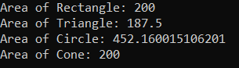
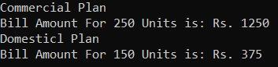

## **نحوه استفاده از کلاس‌های انتزاعی و متدهای انتزاعی در برنامه‌های سی شارپ**

در این مقاله، قصد دارم **نحوه استفاده از کلاس‌های انتزاعی و متدهای انتزاعی در توسعه برنامه‌های سی‌شارپ را** با مثال‌هایی مورد بحث قرار دهم. در مقاله قبلی، در مورد اینکه متدهای انتزاعی و کلاس‌های انتزاعی چیستند و قوانین استفاده از آنها را بررسی کردیم، بحث کردیم. در این مقاله، نحوه استفاده از کلاس‌های انتزاعی و متدهای انتزاعی در برنامه‌هایمان را به شما نشان خواهم داد.

##### **کلاس‌های انتزاعی و متدهای انتزاعی در سی شارپ چیستند؟**

1. **متد انتزاعی (Abstract Method):** متدی که بدنه ندارد، به عنوان متد انتزاعی (abstract method) شناخته می‌شود.
2. **کلاس انتزاعی (Abstract Class):** کلاسی که شامل هر عضو انتزاعی (abstract member) باشد، به عنوان کلاس انتزاعی (abstract class) شناخته می‌شود.

کلاسی که با استفاده از کلمه کلیدی abstract تعریف می‌شود، کلاس abstract نامیده می‌شود. یک کلاس abstract، کلاسی است که تا حدی پیاده‌سازی شده و برای پیاده‌سازی برخی از متدهای یک شیء که برای همه زیرکلاس‌های سطح بعدی مشترک هستند و متدهای abstract باقی‌مانده که توسط زیرکلاس‌های سطح بعدی پیاده‌سازی می‌شوند، استفاده می‌شود. بنابراین، این کلاس شامل متدهای abstract و متدهای concrete شامل متغیرها، ویژگی‌ها و سازنده‌ها است.

##### **چگونه از کلاس‌ها و متدهای انتزاعی در سی شارپ استفاده کنیم؟**

ما بحث کردیم که توسعه برنامه تماماً در مورد سروکار داشتن با موجودیت‌ها است. و هر موجودیت مجموعه‌ای از ویژگی‌ها خواهد داشت. و ما فقط باید ویژگی‌های مشترک را شناسایی کنیم و آنها را در یک ترتیب سلسله مراتبی قرار دهیم. بنابراین، دقیقاً همین موضوع را اکنون سعی خواهیم کرد با کلاس‌های انتزاعی و متدهای انتزاعی درک کنیم. زیرا وقتی از کلاس‌های انتزاعی استفاده می‌کنیم، به این معنی است که قرار است از وراثت استفاده کنیم، در غیر این صورت هیچ استفاده‌ای از کلاس‌های انتزاعی وجود ندارد.

مفاهیم متدهای انتزاعی و کلاس‌های انتزاعی، بسطی از وراثت هستند که در آن وراثت بحث کردیم که با کمک کلاس والد می‌توانیم ویژگی‌هایی را در اختیار کلاس فرزند قرار دهیم که توسط کلاس‌های فرزند قابل استفاده باشند و این به ما قابلیت استفاده مجدد می‌دهد.

در کنار اینکه کلاس والد به فرزندان مالکیت می‌دهد، کلاس والد می‌تواند با کمک متدهای انتزاعی، محدودیتی را بر فرزندان اعمال کند، به طوری که تمام کلاس‌های فرزند مجبور باشند بدون شکست، محدودیت را به طور کامل اعمال کنند.

##### **مثال بلادرنگ برای درک کلاس‌ها و متدهای انتزاعی در سی شارپ:**

ما قصد داریم یک برنامه برای محاسبه مساحت مستطیل، دایره، مثلث و مخروط توسعه دهیم. بنابراین، برای برنامه ما، موارد زیر موجودیت‌های ما خواهند بود.

**نهادها : مستطیل، دایره، مثلث، مخروط.**

در مرحله بعد، پس از شناسایی موجودیت‌های برنامه خود، چه کاری باید انجام دهیم؟ در مرحله بعد، باید ویژگی‌های هر موجودیت را به شرح زیر شناسایی کنیم.

**مستطیل : ارتفاع و عرض**  
**دایره : شعاع و عدد پی**  
**مثلث : عرض (که قاعده نیز نامیده می‌شود) و ارتفاع**  
**مخروط : شعاع، ارتفاع و PI**

خب، اینها موجودیت‌ها و ویژگی‌های آنها هستند. در مرحله بعد، باید ویژگی‌های مشترک را شناسایی کنیم. چرا باید ویژگی‌های مشترک را شناسایی کنیم؟ زیرا اگر ویژگی‌های مشترک را در هر کلاس قرار دهیم، تکرار کد مطرح می‌شود. و برنامه‌نویسی شی‌گرا عمدتاً برای قابلیت استفاده مجدد استفاده می‌شود، نه برای تکرار کد. 

بنابراین، امروز در برنامه ما چهار شکل داریم، فردا ممکن است شکل‌های جدیدی مانند چندضلعی، مربع، لوزی و غیره به وجود بیایند. بنابراین، ویژگی‌های رایج در مورد ما، ارتفاع، عرض، شعاع و PI، ممکن است در آن شکل‌ها نیز استفاده شوند. بنابراین، باید ویژگی‌های مشترک هر موجودیت را شناسایی کنیم.

بنابراین، کاری که باید انجام دهیم این است که ابتدا یک کلاس، مثلاً Shape، با تمام این ویژگی‌های مشترک به شرح زیر تعریف کنیم. این اولین قدم در توسعه برنامه است.

```csharp
public class Shape
{
    public double Height;
    public double Width;
    public double Radius;
    public const float PI = 3.14f;
}
```

حال، اگر این کلاس Shape را به عنوان کلاس والد برای بقیه چهار کلاس یعنی Rectangle، Circle، Triangle و Cone قرار دهم، دیگر نیازی به تعریف ویژگی‌های فوق در آن کلاس‌ها نداریم. می‌توانیم مستقیماً از آنها استفاده کنیم. برای مثال، اگر کلاس‌هایی مانند زیر ایجاد کنیم، تمام کلاس‌ها شامل تمام ویژگی‌ها خواهند بود.

```csharp
public class Rectangle : Shape
{
    //Contain All the Attributes
}
public class Circle : Shape
{
    //Contain All the Attributes
}
public class Triangle : Shape
{
    //Contain All the Attributes
}
public class Cone : Shape
{
    //Contain All the Attributes
}
```

این چیزی جز ویژگی قابلیت استفاده مجدد نیست که از طریق وراثت به آن دست یافته‌ایم. در مرحله بعد، کاری که قرار است انجام دهیم این است که در هر کلاس، سازنده‌های عمومی ایجاد کرده و ویژگی‌های مورد نیاز را به صورت زیر مقداردهی اولیه می‌کنیم.

```csharp
public class Rectangle : Shape
{
    public Rectangle(double Height, double Width)
    {
        this.Height = Height;
        this.Width = Width;
    }
}
public class Circle : Shape
{
    public Circle(double Radius)
    {
        this.Radius = Radius;
    }
}
public class Triangle : Shape
{
    public Triangle(double Height, double Width)
    {
        this.Height = Height;
        this.Width = Width;
    }
}
public class Cone : Shape
{
    public Cone(double Radius, double Height)
    {
        this.Radius = Radius;
        this.Height = Height;
    }
}
```

حال، نیاز ما این است که مساحت هر شکل، یعنی مساحت مستطیل، مساحت مثلث، مساحت دایره و مساحت کلون را پیدا کنیم.

##### **کجا باید متد Area را تعریف کنیم؟**

ما نمی‌توانیم متد مساحت را در کلاس Shape تعریف کنیم. به‌طورکلی، آنچه باید در کلاس Parent بیاید، چیزهایی است که برای کلاس‌های Child مشترک هستند. حال، ما متدی می‌خواهیم که مساحت را به شکل مناسبی برگرداند. آیا می‌توانیم آن متد را در کلاس Shape تعریف کنیم؟ خیر. دلیلش این است که فرمول محاسبه مساحت از شکلی به شکل دیگر متفاوت است. از آنجا که فرمول از شکلی به شکل دیگر متفاوت است، نمی‌توانیم آن را در کلاس Parent تعریف کنیم. اینجاست که دقیقاً کلاس Abstract و متد Abstract وارد عمل می‌شوند.

این متد را نمی‌توان در کلاس Shape تعریف کرد، اما می‌توان آن را به عنوان یک متد انتزاعی در کلاس Shape تعریف کرد و پس از تعریف متد انتزاعی، باید کلاس را نیز با استفاده از کلمه کلیدی abstract به صورت زیر انتزاعی کنیم:

```csharp
public abstract class Shape
{
    public double Height;
    public double Width;
    public double Radius;
    public const float PI = 3.14f;
    public abstract double GetArea();
}
```

حال، متد انتزاعی GetArea باید و باید توسط تمام کلاس‌های فرزند کلاس والد Shape پیاده‌سازی شود. چرا؟ چون این یک قانون است. زمانی که یک کلاس والد شامل هر متد انتزاعی باشد، آن متدهای انتزاعی باید توسط کلاس‌های فرزند پیاده‌سازی شوند. و این اجباری است.

```csharp
public class Rectangle : Shape
{
    public Rectangle(double Height, double Width)
    {
        this.Height = Height;
        this.Width = Width;
    }

    public override double GetArea()
    {
        return Width * Height;
    }
}
public class Circle : Shape
{
    public Circle(double Radius)
    {
        this.Radius = Radius;
    }

    public override double GetArea()
    {
        return PI * Radius * Radius;
    }
}
public class Triangle : Shape
{
    public Triangle(double Height, double Width)
    {
        this.Height = Height;
        this.Width = Width;
    }

    public override double GetArea()
    {
        return (Width * Height) / 2;
    }
}
public class Cone : Shape
{
    public Cone(double Radius, double Height)
    {
        this.Radius = Radius;
        this.Height = Height;
    }

    public override double GetArea()
    {
        return PI * Radius * (Radius + Math.Sqrt(Height * Height + Radius * Radius));
    }
}
```

بنابراین، این فرآیند نحوه استفاده از کلاس‌های انتزاعی و متدهای انتزاعی در توسعه برنامه ما با استفاده از زبان C# است.

حال، ممکن است یک سوال برای شما پیش بیاید، چرا متد GetArea را در کلاس والد تعریف می‌کنیم و آن را در کلاس‌های فرزند پیاده‌سازی می‌کنیم، چرا نمی‌توانیم مستقیماً متد GetArea را در کلاس‌های فرزند تعریف کنیم؟ بله. می‌توانید این کار را انجام دهید. اما با تعریف متد GetArea در کلاس Shape یک مزیت داریم.

مزیت این است که نام متد در هر چهار کلاس یکسان خواهد بود، و حتی اگر فردا یک کلاس جدید این نام را از کلاس Shape به ارث ببرد، نام متد نیز یکسان خواهد بود، یعنی GetArea. همراه با نام متد، امضای متد نیز در تمام کلاس‌های فرزند یکسان خواهد بود.

برای مثال، اگر چهار نفر مختلف روی پروژه کار کنند و اگر چهار نفر مختلف روی یک شکل متفاوت کار کنند، هیچ تضمینی وجود ندارد که همه توسعه‌دهندگان نام و امضای یکسانی را برای متد ارائه دهند. مزیت اعلام متد در کلاس Shape این است که نام و امضا در هر چهار کلاس متفاوت نخواهد بود.

##### **مثالی برای پیاده‌سازی کلاس‌های انتزاعی و متدهای انتزاعی در توسعه برنامه سی‌شارپ:**

صرف نظر از مثالی که بررسی کردیم، کد کامل مثال در زیر آمده است.

```csharp
using System;

namespace AbstractClassesAndMethods
{
    class Program
    {
        static void Main(string[] args)
        {
            Rectangle rectangle = new Rectangle(10, 20);
            Console.WriteLine($"Area of Rectangle: {rectangle.GetArea()}");

            Triangle triangle = new Triangle(15, 25);
            Console.WriteLine($"Area of Triangle: {triangle.GetArea()}");

            Circle circle = new Circle(12);
            Console.WriteLine($"Area of Circle: {circle.GetArea()}");

            Cone cone = new Cone(5, 15);
            Console.WriteLine($"Area of Cone: {rectangle.GetArea()}");

            Console.ReadKey();
        }
    }
   
    public abstract class Shape
    {
        public double Height;
        public double Width;
        public double Radius;
        public const float PI = 3.14f;
        public abstract double GetArea();
    }

    public class Rectangle : Shape
    {
        public Rectangle(double Height, double Width)
        {
            this.Height = Height;
            this.Width = Width;
        }

        public override double GetArea()
        {
            return Width * Height;
        }
    }
    public class Circle : Shape
    {
        public Circle(double Radius)
        {
            this.Radius = Radius;
        }

        public override double GetArea()
        {
            return PI * Radius * Radius;
        }
    }
    public class Triangle : Shape
    {
        public Triangle(double Height, double Width)
        {
            this.Height = Height;
            this.Width = Width;
        }

        public override double GetArea()
        {
            return (Width * Height) / 2;
        }
    }
    public class Cone : Shape
    {
        public Cone(double Radius, double Height)
        {
            this.Radius = Radius;
            this.Height = Height;
        }

        public override double GetArea()
        {
            return PI * Radius * (Radius + Math.Sqrt(Height * Height + Radius * Radius));
        }
    }
}
```

###### **خروجی:**



##### **مثال کلاس انتزاعی و متدهای انتزاعی در سی شارپ:**

در مثال زیر، قبوض برق را برای طرح‌های تجاری و خانگی با استفاده از کلاس انتزاعی و متدهای انتزاعی محاسبه می‌کنیم.

```csharp
using System;

namespace AbstractClassMethods
{
    public abstract class Plan
    {
        protected abstract double getRate();
        public void Calculation(int units)
        {
            double rate = getRate();
            Console.WriteLine($"Bill Amount For {units} Units is: Rs. {rate * units}");
        }
    }

    class CommercialPlan : Plan
    {
        protected override double getRate()
        {
            return 5.00;
        }
    }
    class DomesticlPlan : Plan
    {
        protected override double getRate()
        {
            return 2.50;
        }
    }

    class Program
    {
        static void Main(string[] args)
        {
            Plan p;
            Console.WriteLine("Commercial Plan");
            p = new CommercialPlan();
            p.Calculation(250);

            Console.WriteLine("Domesticl Plan");
            p = new DomesticlPlan();
            p.Calculation(150);
            Console.ReadKey();
        }
    }
}
```

###### **خروجی:**


