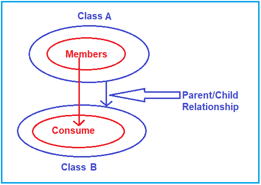
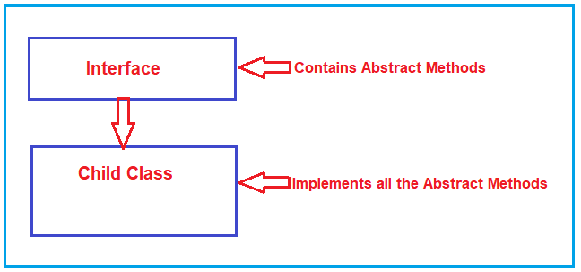
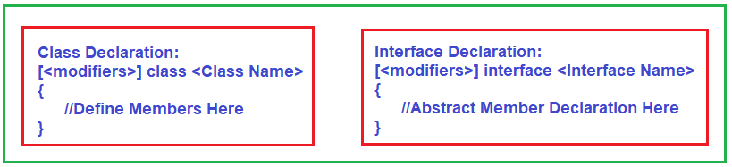
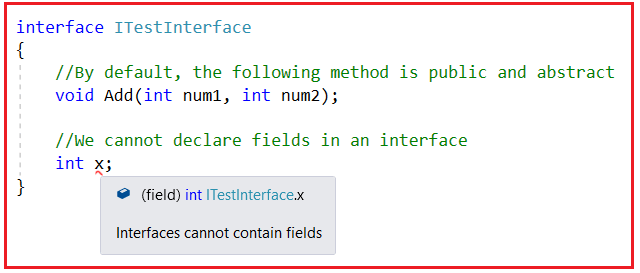
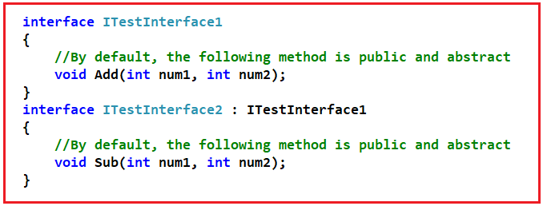
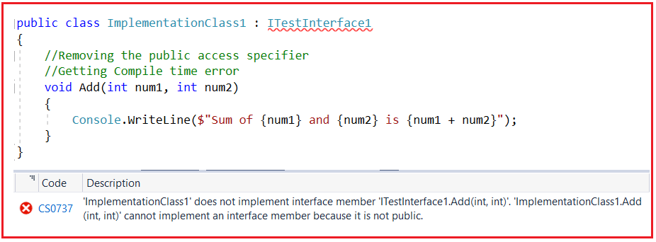
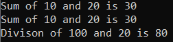
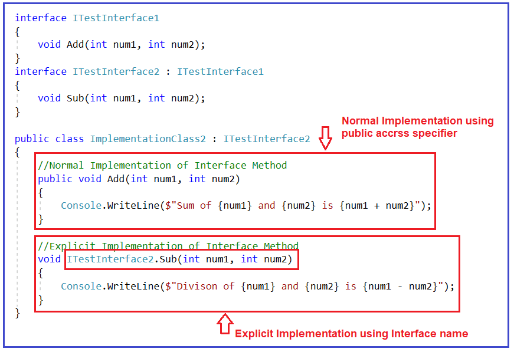
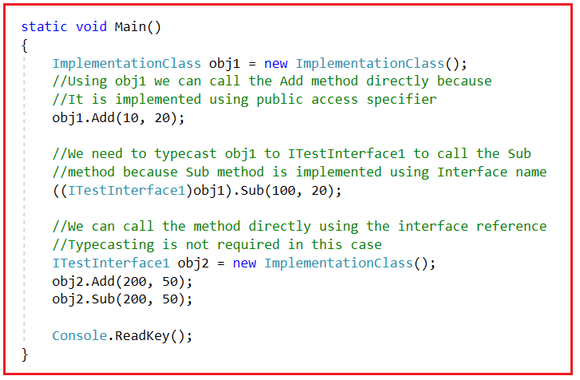
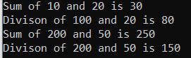

## **رابط کاربری در سی شارپ به همراه مثال**

در این مقاله، یکی از مهمترین مفاهیم، ​​یعنی **رابط کاربری در سی شارپ را** با مثال‌هایی مورد بحث قرار خواهم داد.. در پایان این مقاله، نکات زیر را خواهید فهمید.

1. **رابط (Interface) در سی شارپ چیست؟**
2. **تفاوت‌های بین کلاس عینی، کلاس انتزاعی و رابط در سی شارپ**
3. **چگونه در سی شارپ یک رابط تعریف کنیم؟**
4. **چگونه می‌توان متدهای انتزاعی را در یک رابط در سی شارپ تعریف کرد؟**
5. **اعضایی که می‌توانیم و نمی‌توانیم در یک رابط در سی شارپ تعریف کنیم کدامند؟**
6. **مثال‌های متعدد برای درک رابط کاربری در سی شارپ**
7. **پیاده‌سازی صریح رابط کاربری در سی شارپ**
8. **چه زمانی از رابط (Interface) در سی شارپ استفاده کنیم؟**

##### **رابط (Interface) در سی شارپ چیست؟**

رابط در سی شارپ یک **کلاس کاملاً پیاده‌سازی نشده** است که برای اعلان مجموعه‌ای از عملیات/متدهای یک شیء استفاده می‌شود. بنابراین، می‌توانیم یک رابط را به عنوان یک کلاس انتزاعی خالص تعریف کنیم که به ما امکان می‌دهد فقط متدهای انتزاعی را تعریف کنیم. متد انتزاعی به معنای متدی بدون بدنه یا پیاده‌سازی است. از آن برای دستیابی به وراثت چندگانه استفاده می‌شود، که کلاس نمی‌تواند به آن دست یابد. از آن برای دستیابی به انتزاع کامل استفاده می‌شود زیرا نمی‌تواند بدنه متد داشته باشد.

در زبان سی شارپ، رابط (interface) یک مفهوم اساسی است که یک قرارداد یا مجموعه‌ای از قوانین را تعریف می‌کند که یک کلاس باید به آنها پایبند باشد. این مفهوم، فهرستی از متدها، ویژگی‌ها، رویدادها یا شاخص‌هایی را مشخص می‌کند که یک کلاس پیاده‌سازی کننده رابط باید ارائه دهد. رابط‌ها به شما امکان می‌دهند مجموعه‌ای مشترک از عملکردها را تعریف کنید که چندین کلاس می‌توانند به اشتراک بگذارند، که این امر قابلیت استفاده مجدد از کد را افزایش داده و ساختار ثابتی را برای کلاس‌های مرتبط تضمین می‌کند.

تا الان، ما در حال یادگیری کلاس‌ها هستیم. خب، کلاس چیست؟ کلاس یک نوع داده تعریف‌شده توسط کاربر است. بعد، رابط چیست؟ رابط هم یک نوع داده تعریف‌شده توسط کاربر است. بعد، تفاوت بین آنها چیست؟ بیایید اول این را بفهمیم.

##### **تفاوت‌های بین کلاس عینی، کلاس انتزاعی و رابط در سی شارپ:**

یک کلاس Concrete می‌تواند فقط شامل متدهایی باشد که بدنه متد را دارند. آیا متدی بدون بدنه داریم؟ بله، متدهایی بدون بدنه داریم که متدهای abstract نامیده می‌شوند. بنابراین، می‌توانیم بگوییم کلاس شامل متدی با بدنه متد است، یا می‌توانیم بگوییم متدهای غیر abstract. کلاس Abstract شامل متدهای abstract و non-abstract است و رابط فقط شامل متدهای abstract است.

1. **کلاس :** فقط شامل متدهای غیر انتزاعی (متدهایی با بدنه متد) است.
2. **کلاس انتزاعی (Abstract Class ):** شامل هر دو نوع متد غیر انتزاعی (متدهایی با بدنه متد) و متدهای انتزاعی (متدهایی بدون بدنه متد) است.
3. **رابط :** فقط شامل متدهای انتزاعی (متدهایی بدون بدنه متد) است.

متدهای انتزاعی چیستند، چرا به متدهای انتزاعی نیاز داریم و چگونه متدهای انتزاعی را پیاده‌سازی می‌کنیم؟ 

**نکته:** هر متد انتزاعی (abstract) از یک رابط (interface) باید توسط کلاس فرزند آن رابط (child class) بدون نقص پیاده‌سازی شود (اجباری).

در **مبحث وراثت** ، قبلاً یاد گرفتیم که یک کلاس از کلاس دیگر ارث می‌برد و کلاس فرزند، اعضای کلاس والد را مصرف می‌کند. لطفاً به نمودار زیر توجه کنید. در اینجا، کلاس A را با مجموعه‌ای از اعضا داریم و کلاس B از کلاس A ارث می‌برد. و رابطه‌ای به نام رابطه والد/فرزند بین آنها وجود دارد. پس از برقراری رابطه والد/فرزند، اعضای کلاس A می‌توانند تحت کلاس B مصرف شوند. بنابراین، این چیزی است که ما در مبحث وراثت یاد گرفتیم.



حال، درست همانطور که یک کلاس، کلاس دیگری را به عنوان والد دارد، یک کلاس نیز می‌تواند یک رابط (Interface) به عنوان والد داشته باشد. اگر یک کلاس، رابطی به عنوان والد داشته باشد، آن کلاس مسئول پیاده‌سازی تمام متدهای انتزاعی رابط است. برای درک بهتر، لطفاً به نمودار زیر نگاهی بیندازید.



به زبان ساده، رابط والد محدودیت‌هایی را بر کلاس‌های فرزند اعمال می‌کند. **چه محدودیت‌هایی؟** این محدودیت‌ها شامل پیاده‌سازی تک تک متدهای رابط تحت کلاس فرزند است.

به طور کلی، یک کلاس از کلاس دیگری ارث می‌برد تا اعضای کلاس والد خود را مصرف کند. از سوی دیگر، اگر کلاسی از یک رابط ارث می‌برد، برای پیاده‌سازی اعضای کلاس والد خود (رابط) است، نه برای مصرف.

**نکته:** یک کلاس می‌تواند همزمان از یک کلاس و یک رابط (یا رابط‌ها) ارث‌بری کند.

##### **چگونه در سی شارپ یک رابط تعریف کنیم؟**

همانطور که در C# برای تعریف یک کلاس نیاز به تعریف یک رابط داریم، در تعریف یک رابط نیز باید از کلمه کلیدی class استفاده کنیم. در تعریف یک کلاس، باید از کلمه کلیدی interface استفاده کنیم. علاوه بر این، در یک رابط، فقط می‌توانیم اعضای انتزاعی (abstract) را تعریف کنیم. برای درک بهتر، لطفاً به نمودار زیر نگاهی بیندازید.



برای درک بهتر، لطفاً به مثال زیر نگاهی بیندازید. در اینجا، ما با استفاده از کلمه کلیدی interface، یک رابط با نام ITestInterface ایجاد کرده‌ایم.

```csharp
interface ITestInterface
{
    //Abstract Member Declarations
}
```

##### **چگونه می‌توان متدهای انتزاعی را در یک رابط در سی شارپ تعریف کرد؟**

در یک کلاس (یعنی کلاس انتزاعی)، ما عموماً از کلمه کلیدی انتزاعی برای تعریف متدهای انتزاعی به شکل زیر استفاده می‌کنیم.  
**تابع انتزاعی عمومی Add(int num1, int num2);**

اگر می‌خواهید متد انتزاعی فوق را در یک رابط بنویسید، در امضای متد نیازی به کلمات کلیدی public و abstract به شرح زیر ندارید:  
**تابع جمع باطل (عدد صحیح ۱، عدد صحیح ۲)؛**

هنگام کار با رابط، باید برخی از قوانین را به خاطر بسپاریم. بیایید این قوانین را یک به یک با مثال بررسی کنیم.

**نکته ۱:** اولین نکته‌ای که باید به خاطر داشته باشید این است که محدوده پیش‌فرض برای اعضای یک رابط عمومی (public) است، در حالی که در مورد یک کلاس خصوصی (private) است.

**نکته ۲:** نکته دوم که باید به خاطر داشته باشید این است که به طور پیش‌فرض، هر عضو یک رابط انتزاعی است، بنابراین لازم نیست دوباره از اصلاحگر انتزاعی روی آن استفاده کنیم، درست مانند کاری که در مورد یک کلاس انتزاعی انجام می‌دهیم. برای درک بهتر، لطفاً به مثال زیر نگاهی بیندازید. به طور پیش‌فرض، متد Add عمومی و انتزاعی خواهد بود.

```csharp
interface ITestInterface
{
    //By default, the following method is public and abstract
    void Add(int num1, int num2);
}
```

**نکته ۳:** باید به خاطر داشته باشید که نمی‌توانیم فیلدها/متغیرها، سازنده‌ها و مخرب‌ها را در یک رابط در سی‌شارپ تعریف کنیم.

لطفا به کد زیر نگاهی بیندازید. در اینجا، ما سعی داریم یک متغیر تعریف کنیم و به محض تعریف، یک خطای زمان کامپایل دریافت می‌کنیم، یعنی **رابط‌ها نمی‌توانند شامل فیلدها باشند،** همانطور که در تصویر زیر نشان داده شده است.



##### **اعضایی که می‌توانیم و نمی‌توانیم در یک رابط در سی شارپ تعریف کنیم کدامند؟**

یک رابط می‌تواند شامل موارد زیر باشد

1. **روش‌های انتزاعی**
2. **خواص**
3. **شاخص‌ها**
4. **رویدادها**

یک رابط نمی‌تواند شامل موارد زیر باشد:

1. **توابع غیر انتزاعی**
2. **فیلدهای داده**
3. **سازنده‌ها**
4. **ناوشکن‌ها**

**نکته ۴:** نکته چهارم که باید به خاطر داشته باشید این است که یک رابط می‌تواند از رابط دیگری در C# ارث‌بری کند، درست مانند یک کلاس که از کلاس دیگری ارث‌بری می‌کند.

برای درک بهتر، لطفاً به کد زیر نگاهی بیندازید. در اینجا، ما دو رابط داریم، یعنی Interface1 و Interface2. رابط2 از Interface1 به ارث رسیده است و اکنون رابط2 دو متد انتزاعی دارد، یعنی Add (از Interface 1) و Sub.



حال، کلاس Child که از Interface1 ارث بری می‌کند، باید یک متد یعنی Add را پیاده‌سازی کند و کلاس Child که از Interface2 ارث بری می‌کند، باید دو متد یعنی Add و Sub را پیاده‌سازی کند.

ممکن است یک سوال داشته باشید: **چرا به دو رابط جداگانه نیاز داریم؟** **چرا یکی نه؟** بله، می‌توانید از یک رابط استفاده کنید و تمام متدها را تا زمانی که به یک کار مربوط می‌شوند، تعریف کنید. اگر متدهای غیرمرتبط را در یک رابط قرار دهید، خلاف اصل تفکیک رابط SOLID است.

**نکته ۵:** نکته پنجم که باید به خاطر داشته باشید این است که هر عضو یک رابط باید بدون نقص (اجباری) تحت کلاس فرزند پیاده‌سازی شود، اما هنگام پیاده‌سازی، لازم نیست از اصلاح‌کننده override درست مانند کاری که در مورد یک کلاس انتزاعی انجام دادیم، استفاده کنیم.

برای درک بهتر، لطفاً به کد زیر نگاهی بیندازید. در اینجا، ما دو رابط و دو کلاس پیاده‌سازی داریم. Interface2 از Inteface1 به ارث رسیده است، و از این رو، دو متد انتزاعی دارد. ImplementationClass1 از Interface1 به ارث برده و از این رو فقط متد Add را پیاده‌سازی می‌کند. ImplementationClass2 از Interface1 به ارث برده و Interface2 از Interface1 به ارث برده است، و از این رو، این کلاس باید هر دو متد انتزاعی را پیاده‌سازی کند. این چیزی است که می‌توانید در کد زیر مشاهده کنید.

```csharp
interface ITestInterface1
{
    void Add(int num1, int num2);
}
interface ITestInterface2 : ITestInterface1
{
    void Sub(int num1, int num2);
}

public class ImplementationClass1 : ITestInterface1
{
    //Implement only the Add method
    public void Add(int num1, int num2)
    {
        Console.WriteLine($"Sum of {num1} and {num2} is {num1 + num2}");
    }
}

public class ImplementationClass2 : ITestInterface2
{
    //Implement Both Add and Sub method
    public void Add(int num1, int num2)
    {
        Console.WriteLine($"Sum of {num1} and {num2} is {num1 + num2}");
    }

    public void Sub(int num1, int num2)
    {
        Console.WriteLine($"Divison of {num1} and {num2} is {num1 - num2}");
    }
}
```

در مثال بالا، می‌توانید ببینید که هنگام پیاده‌سازی متد، از اصلاح‌کننده‌ی public استفاده می‌کنیم که الزامی است. اگر از public استفاده نکنید، متد به عنوان private در نظر گرفته می‌شود و کامپایلر با خطای زیر مواجه می‌شود: **'ImplementationClass1' عضو رابط 'ITestInterface1.Add(int, int)' را پیاده‌سازی نمی‌کند. 'ImplementationClass1.Add(int, int)' نمی‌تواند یک عضو رابط را پیاده‌سازی کند زیرا public نیست.** همانطور که در تصویر زیر نشان داده شده است.



##### **مثال برای درک رابط در سی شارپ:**

هر آنچه که تا الان مورد بحث قرار داده‌ایم، همه این موارد را در مثال زیر قرار داده‌ایم. لطفاً به بخش نظرات مراجعه کنید.

```csharp
using System;

namespace AbstractClassMethods
{
    class Program
    {
        static void Main()
        {
            ImplementationClass1 obj1 = new ImplementationClass1();
            //Using obj1 we can only call Add method
            obj1.Add(10, 20);
            //We cannot call Sub method
            //obj1.Sub(100, 20);

            ImplementationClass2 obj2 = new ImplementationClass2();
            //Using obj2 we can call both Add and Sub method
            obj2.Add(10, 20);
            obj2.Sub(100, 20);

            Console.ReadKey();
        }
    }
    
    interface ITestInterface1
    {
        void Add(int num1, int num2);
    }
    interface ITestInterface2 : ITestInterface1
    {
        void Sub(int num1, int num2);
    }

    public class ImplementationClass1 : ITestInterface1
    {
        //Implement only the Add method
        public void Add(int num1, int num2)
        {
            Console.WriteLine($"Sum of {num1} and {num2} is {num1 + num2}");
        }
    }

    public class ImplementationClass2 : ITestInterface2
    {
        //Implement Both Add and Sub method
        public void Add(int num1, int num2)
        {
            Console.WriteLine($"Sum of {num1} and {num2} is {num1 + num2}");
        }

        public void Sub(int num1, int num2)
        {
            Console.WriteLine($"Divison of {num1} and {num2} is {num1 - num2}");
        }
    }
}
```

###### **خروجی:**



**نکته ۶:** ما نمی‌توانیم نمونه‌ای از یک رابط ایجاد کنیم، اما می‌توانیم یک ارجاع به یک رابط ایجاد کنیم. ارجاع رابط، نمونه کلاس فرزند را در خود نگه می‌دارد. ما فقط می‌توانیم متدهای اعلام شده در رابط را با استفاده از ارجاع رابط فراخوانی کنیم.

برای درک بهتر، لطفاً به مثال زیر نگاهی بیندازید. در مثال زیر، ITestInterface1 یک متد انتزاعی، یعنی Add، تعریف کرده است. این اینترفیس سپس توسط ImplementationClass پیاده‌سازی می‌شود که متد اینترفیس Add را پیاده‌سازی می‌کند. دوباره، ما یک متد جدید در این کلاس، یعنی Sub، تعریف کرده‌ایم. سپس، درون متد Main، یک ارجاع از اینترفیس ایجاد می‌کنیم که به نمونه کلاس فرزند اشاره می‌کند. با استفاده از این ارجاع، فقط می‌توانیم متد Add را فراخوانی کنیم و نمی‌توانیم متد Sub را فراخوانی کنیم. دلیل این امر این است که امضای متد Add درون اینترفیس است، اما امضای متد Sub در اینترفیس نیست.

##### **مثال برای درک ارجاع به رابط در سی شارپ:**

```csharp
using System;

namespace AbstractClassMethods
{
    class Program
    {
        static void Main()
        {
            //Creating Reference of an Interface point to the 
            //child class instance
            ITestInterface1 obj = new ImplementationClass();

            //Add method signature declared in ITestInterface1, so we can
            //Invoke the Add method
            obj.Add(10, 20);

            //Sub method signature is not declared in ITestInterface1, 
            //so, we cannot Invoke the Sub method
            //obj.Sub(100, 20);
            
            Console.ReadKey();
        }
    }
    
    interface ITestInterface1
    {
        void Add(int num1, int num2);
    }
    
    public class ImplementationClass : ITestInterface1
    {
        //Interface Method Implementation
        public void Add(int num1, int num2)
        {
            Console.WriteLine($"Sum of {num1} and {num2} is {num1 + num2}");
        }

        //This method purely belongs to ImplementationClass
        public void Sub(int num1, int num2)
        {
            Console.WriteLine($"Divison of {num1} and {num2} is {num1 - num2}");
        }
    }
}
```

##### **پیاده‌سازی صریح رابط کاربری در سی شارپ**

وقتی هر متد رابط به طور جداگانه تحت کلاس فرزند با ارائه نام متد و نام رابط پیاده‌سازی می‌شود، به آن پیاده‌سازی صریح رابط گفته می‌شود. اما در این حالت، هنگام فراخوانی متد، باید اجباراً از مرجع رابط ایجاد شده با استفاده از شیء یک کلاس استفاده کنیم یا شیء را به نوع رابط مناسب تبدیل نوع کنیم.

شما همچنین می‌توانید یک رابط را به روش دیگری بدون استفاده از تعیین‌کننده سطح دسترسی public پیاده‌سازی کنید. در این حالت، باید نام رابط را قبل از نام متد با استفاده از عملگر نقطه مشخص کنیم، همانطور که در کد زیر نشان داده شده است. به این روش، پیاده‌سازی صریح متدهای رابط گفته می‌شود.



همانطور که در کد بالا مشاهده می‌کنید، متد Add با استفاده از مشخص‌کننده دسترسی عمومی پیاده‌سازی شده است و Sub با استفاده از نام رابط پیاده‌سازی شده است. متد Sub متعلق به Interface2 است و از این رو، ما متد Sub را با پیشوند Interface2 و به دنبال آن عملگر نقطه آغاز می‌کنیم. اگر می‌خواهید متد Add را به طور صریح پیاده‌سازی کنید، باید متد Add را با پیشوند Interface1 آغاز کنید، زیرا متد Add متعلق به Interface1 است.

در این حالت، وقتی از نام رابط هنگام پیاده‌سازی متد رابط استفاده می‌کنیم، دیگر نیازی به استفاده از تصریح‌کننده‌ی دسترسی عمومی نداریم. دلیل این امر این است که کاملاً واضح است که اعضای رابط عمومی هستند و از این رو، نیازی به استفاده از تصریح‌کننده‌ی دسترسی عمومی نداریم. بنابراین، این دو روش برای پیاده‌سازی اعضای رابط در سی‌شارپ هستند.

اگر متد با استفاده از مشخص‌کننده‌ی دسترسی عمومی پیاده‌سازی شده باشد، می‌توانید شیء را ایجاد کرده و مستقیماً آن را فراخوانی کنید. اما اگر متد با استفاده از نام رابط پیاده‌سازی شده باشد، هنگام فراخوانی متد، باید شیء را به نوع رابط تبدیل نوع کنیم، یا می‌توانید یک مرجع رابط ایجاد کرده و متد را فراخوانی کنید. بنابراین، در مورد ما، متد Add را مستقیماً با استفاده از obj1 فراخوانی می‌کنیم، اما هنگام فراخوانی متد Sub، باید نوع obj1 را به Interface2 تبدیل کنیم زیرا این یک نمونه از ImplementationClass است، یا می‌توانید همانطور که در تصویر زیر نشان داده شده است، مستقیماً با استفاده از متغیر مرجع obj2 فراخوانی کنید.



##### **مثال پیاده‌سازی صریح رابط در سی شارپ**

```csharp
using System;

namespace AbstractClassMethods
{
    class Program
    {
        static void Main()
        {
            ImplementationClass obj1 = new ImplementationClass();
            //Using obj1 we can call the Add method directly because
            //It is implemented using public access specifier
            obj1.Add(10, 20);

            //We need to typecast obj1 to ITestInterface1 to call the Sub
            //method because Sub method is implemented using Interface name
            ((ITestInterface1)obj1).Sub(100, 20);

            //We can call the method directly using the interface reference
            //Typecasting is not required in this case
            ITestInterface1 obj2 = new ImplementationClass();
            obj2.Add(200, 50);
            obj2.Sub(200, 50);

            Console.ReadKey();
        }
    }
    
    interface ITestInterface1
    {
        void Add(int num1, int num2);
        void Sub(int num1, int num2);
    }
    
    public class ImplementationClass : ITestInterface1
    {
        //Interface Method Implementation
        public void Add(int num1, int num2)
        {
            Console.WriteLine($"Sum of {num1} and {num2} is {num1 + num2}");
        }

        //This method purely belongs to ImplementationClass
        void ITestInterface1.Sub(int num1, int num2)
        {
            Console.WriteLine($"Divison of {num1} and {num2} is {num1 - num2}");
        }
    }
}
```

###### **خروجی:**



##### **چه زمانی از رابط (Interface) در سی شارپ استفاده کنیم؟**

رابط‌ها در سی‌شارپ یک ویژگی قدرتمند هستند که قراردادها یا مشخصاتی را تعریف می‌کنند که کلاس‌ها باید به آنها پایبند باشند. شما باید استفاده از رابط‌ها را در سناریوهای زیر در نظر بگیرید:

- **تعریف یک قرارداد مشترک:** برای اطمینان از اینکه چندین کلاس مجموعه‌ای مشترک از متدها، ویژگی‌ها، رویدادها یا شاخص‌ها را ارائه می‌دهند، می‌توانید یک رابط برای تعریف آن قرارداد ایجاد کنید. این در شرایطی مفید است که کلاس‌های مختلف نیاز به نمایش رفتار مشابه دارند اما ممکن است پیاده‌سازی‌های متفاوتی داشته باشند.
- **پیاده‌سازی وراثت چندگانه:** سی‌شارپ از وراثت چندگانه برای کلاس‌ها پشتیبانی نمی‌کند (یک کلاس نمی‌تواند از چندین کلاس ارث‌بری کند) اما از پیاده‌سازی چندین رابط پشتیبانی می‌کند. اگر به یک کلاس نیاز دارید که رفتار یا ساختار را از چندین منبع به ارث ببرد، می‌توانید از رابط‌ها برای دستیابی به این هدف استفاده کنید. این به شما امکان می‌دهد کد را بین کلاس‌های مختلف بدون پیچیدگی‌های وراثت چند کلاسی به اشتراک بگذارید.
- **اعمال یک ساختار خاص:** وقتی می‌خواهید یک ساختار خاص یا مجموعه‌ای خاص از متدها و ویژگی‌ها را برای کلاس‌های درون برنامه یا کتابخانه خود اعمال کنید، رابط‌ها می‌توانند به اطمینان از مطابقت کلاس‌ها با آن ساختار کمک کنند.
- **پیاده‌سازی چندریختی:** رابط‌ها برای دستیابی به چندریختی در سی‌شارپ ضروری هستند. وقتی کلاس‌های مختلف رابط یکسانی را پیاده‌سازی می‌کنند، می‌توانید با اشیاء این کلاس‌ها به طور یکسان رفتار کنید و کار با اشیاء مختلف به روش چندریختی را آسان‌تر کنید. این در سناریوهایی مفید است که می‌خواهید با اشیاء در سطح بالاتری از انتزاع کار کنید.
- **تست و شبیه‌سازی:** رابط‌ها در سناریوهای تست واحد ارزشمند هستند. شما می‌توانید رابط‌هایی برای وابستگی‌ها یا سرویس‌های خارجی ایجاد کنید و سپس پیاده‌سازی‌های شبیه‌سازی‌شده‌ای از آن رابط‌ها را برای اهداف تست ایجاد کنید. این امر شما را قادر می‌سازد تا اجزای جداگانه کدبیس خود را به طور مؤثرتری جدا و آزمایش کنید.
- **همکاری در تیم‌ها:** رابط‌ها می‌توانند به تیم‌ها کمک کنند تا در پایگاه‌های کد بزرگ، همکاری مؤثرتری داشته باشند. با تعریف رابط‌های واضح، توسعه‌دهندگان می‌توانند به‌طور مستقل روی بخش‌های مختلف یک پروژه کار کنند و بدانند که کد آنها تا زمانی که به رابط‌های مشخص‌شده پایبند باشد، به‌طور یکپارچه ادغام خواهد شد.
- **قابلیت استفاده مجدد از کد:** رابط‌ها قابلیت استفاده مجدد از کد را افزایش می‌دهند. شما می‌توانید مجموعه‌ای از رابط‌ها را ایجاد کنید که نشان‌دهنده عملکردهای مشترک در برنامه شما هستند و کلاس‌های مختلف می‌توانند این رابط‌ها را پیاده‌سازی کنند. به این ترتیب، می‌توانید بدون تکرار کد، آن را در چندین کلاس دوباره استفاده کنید.
- **تزریق وابستگی:** هنگام استفاده از تزریق وابستگی، رابط‌ها اغلب وابستگی‌هایی را تعریف می‌کنند که می‌توانند به کلاس‌ها تزریق شوند. این امر به دستیابی به اتصال سست کمک می‌کند و تغییر پیاده‌سازی‌ها را در زمان اجرا آسان‌تر می‌کند.

شما باید از رابط‌ها در سی‌شارپ برای تعریف یک قرارداد، اجرای یک ساختار خاص، دستیابی به چندریختی، ارتقای قابلیت استفاده مجدد از کد یا تسهیل همکاری توسعه‌دهندگان استفاده کنید. آن‌ها بخش مهمی از زبان برای ساخت نرم‌افزارهای قابل نگهداری و توسعه‌پذیر هستند.