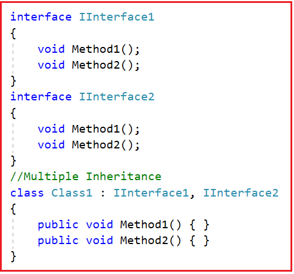
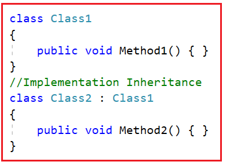
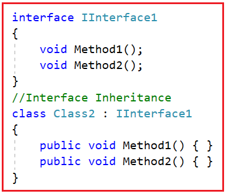
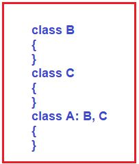
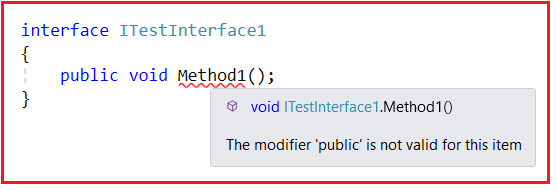
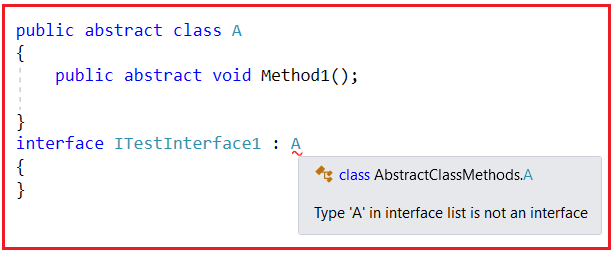
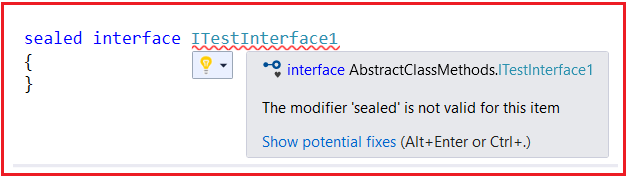
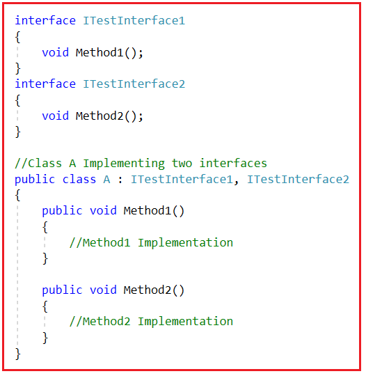
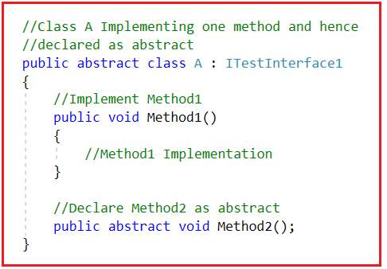

## **سوالات و پاسخ‌های مصاحبه رابط کاربری در سی شارپ**

در این مقاله، قصد دارم به **سوالات و پاسخ‌های مصاحبه در مورد رابط کاربری در سی شارپ** به همراه مثال‌ها بپردازم. در مصاحبه با سوالات زیادی در مورد مفاهیم رابط کاربری مواجه خواهید شد. بنابراین، در این مقاله، قصد دارم به سوالات و پاسخ‌های متداول مصاحبه در مورد رابط کاربری در سی شارپ بپردازم.

1. **رابط (Interface) در سی شارپ چیست؟**
2. **انواع مختلف وراثت که توسط سی شارپ پشتیبانی می‌شوند کدامند؟**
3. **چرا در سی شارپ به رابط نیاز داریم؟**
4. **آیا می‌توانم از مشخصه‌های دسترسی عمومی برای متدهای رابط در سی شارپ استفاده کنم؟**
5. **آیا یک رابط می‌تواند یک کلاس انتزاعی را در سی شارپ پیاده‌سازی کند؟**
6. **آیا می‌توان یک رابط را در سی شارپ به صورت Sealed تعریف کرد؟**
7. **آیا بیش از یک رابط برای پیاده‌سازی یک کلاس در سی شارپ مجاز است؟**
8. **آیا پیاده‌سازی تمام متدهای رابط در سی‌شارپ ضروری است؟**
9. **رابط کاربری در سی شارپ چه تفاوتی با کلاس دارد؟**
10. **چه شباهت‌هایی بین رابط و کلاس انتزاعی در سی شارپ وجود دارد؟**
11. **تفاوت بین رابط و کلاس انتزاعی در سی شارپ چیست؟**
12. **مزایای استفاده از رابط در سی شارپ چیست؟**

##### **رابط (Interface) در سی شارپ چیست؟**

رابط در سی شارپ یک **کلاس کاملاً پیاده‌سازی نشده** است که برای اعلان مجموعه‌ای از متدهای یک شیء استفاده می‌شود. بنابراین، می‌توانیم یک رابط را به عنوان یک **کلاس انتزاعی خالص** تعریف کنیم که به ما امکان می‌دهد فقط متدهای انتزاعی را تعریف کنیم. متد انتزاعی به معنای متدی بدون بدنه یا پیاده‌سازی است.

 در سی شارپ چیست؟")

استفاده می‌شود **از آن برای دستیابی به وراثت چندگانه**]که توسط کلاس قابل دستیابی نیست. از آن برای دستیابی به انتزاع کامل استفاده می‌شود زیرا نمی‌تواند بدنه متد داشته باشد.

پیاده‌سازی آن باید توسط کلاس یا ساختار ارائه شود. کلاس یا ساختاری که رابط را پیاده‌سازی می‌کند، باید پیاده‌سازی تمام متدهای تعریف‌شده درون رابط را نیز فراهم کند.

##### **انواع مختلف وراثت که توسط سی شارپ پشتیبانی می‌شوند کدامند؟**

یک کلاس می‌تواند از کلاس دیگر یا از یک رابط نیز ارث‌بری کند. بنابراین، ارث‌بری را می‌توان به دو دسته تقسیم کرد

1. **وراثت پیاده‌سازی**
2. **وراثت رابط**

اگر یک کلاس از کلاس دیگری ارث‌بری کند، آن را ارث‌بری پیاده‌سازی می‌نامیم و مفهوم اصلی ارث‌بری پیاده‌سازی این است که کلاس‌های فرزند می‌توانند اعضای کلاس والد خود را مصرف کنند.

از سوی دیگر، اگر یک کلاس از یک رابط ارث‌بری کند، آن را وراثت رابط می‌نامیم، اما وراثت رابط هیچ قابلیت استفاده مجددی را فراهم نمی‌کند، زیرا در اینجا ما اعضای والد را تحت فرزند مصرف نمی‌کنیم. فرزند فقط اعضای والد را پیاده‌سازی می‌کند.

##### **چرا در سی شارپ به رابط نیاز داریم؟**

ما مفهوم وراثت چندگانه را می‌دانیم که در آن یک کلاس از بیش از یک کلاس بالا مشتق می‌شود. برای مثال، تعریفی مانند

اما این مفهوم توسط .NET با کلاس‌ها پشتیبانی نمی‌شود. از آنجایی که تعداد زیادی از برنامه‌های بلادرنگ نیاز به استفاده از وراثت‌های چندگانه دارند، که در آن ما ویژگی‌ها و رفتارها را از چندین کلاس مختلف به ارث می‌بریم. به همین دلیل است که .NET یک رویکرد جایگزین به نام رابط برای پشتیبانی از مفهوم وراثت‌های چندگانه ارائه می‌دهد.

##### **آیا می‌توانم از مشخصه‌های دسترسی عمومی برای متدهای رابط در سی شارپ استفاده کنم؟**

متدهای رابط دات‌نت به‌طور پیش‌فرض به‌طور ضمنی عمومی هستند، حتی اگر به رابط‌های تودرتو تعلق داشته باشند. اصلاح‌کننده‌های غیرعمومی برای متدهای رابط معتبر نیستند. بنابراین، کامپایلر در این مورد با خطا مواجه می‌شود و به شما هشدار می‌دهد. رابط‌های تودرتو ممکن است محافظت‌شده یا خصوصی اعلام شوند اما متدهای رابط نه. بنابراین، اگر سعی کنید متد را با مشخص‌کننده دسترسی عمومی اعلام کنید، خطای زیر را دریافت خواهید کرد.

##### **آیا یک رابط می‌تواند یک کلاس انتزاعی را در سی شارپ پیاده‌سازی کند؟**

خیر. در دات‌نت، یک رابط نمی‌تواند یک کلاس انتزاعی (abstract class) را پیاده‌سازی کند. یک رابط فقط می‌تواند یک رابط فوق‌برنامه (super interface) را ارث‌بری کند. با این حال، یک کلاس انتزاعی می‌تواند یک رابط را پیاده‌سازی کند زیرا یک کلاس انتزاعی می‌تواند شامل متدهای انتزاعی (abstract methods) و متدهای عینی (concrete methods) باشد. اگر سعی کنید یک رابط را پیاده‌سازی کنید، خطای زمان کامپایل زیر را دریافت خواهید کرد.

##### **آیا می‌توان یک رابط را در سی شارپ به صورت Sealed تعریف کرد؟**

خیر، مجاز نیست که یک رابط را به عنوان sealed تعریف کنید؛ این کار باعث خطای کامپایل می‌شود. این یک تصمیم طراحی زبان .NET است. انواع رابط برای پیاده‌سازی در نظر گرفته شده‌اند و می‌توانند بدون محدودیت گسترش یابند. اگر سعی کنید رابط را به عنوان sealed تعریف کنید، خطای زیر را دریافت خواهید کرد.

##### **آیا بیش از یک رابط برای پیاده‌سازی یک کلاس در سی شارپ مجاز است؟**

بله، یک کلاس می‌تواند چندین رابط را پیاده‌سازی کند؛ این یک روش مؤثر برای دستیابی به وراثت چندگانه در C# است. اما یک کلاس می‌تواند فقط یک کلاس بالا (superclass) را ارث‌بری کند. برای درک بهتر، لطفاً به مثال زیر نگاهی بیندازید.

##### **آیا پیاده‌سازی تمام متدهای رابط در سی‌شارپ ضروری است؟**

لازم نیست کلاسی که یک رابط را پیاده‌سازی می‌کند، تمام متدهای آن را پیاده‌سازی کند، اما در این حالت، کلاس باید به صورت انتزاعی (abstract) تعریف شود. برای درک بهتر، لطفاً به کد زیر نگاهی بیندازید.

##### **رابط کاربری در سی شارپ چه تفاوتی با کلاس دارد؟**

یک رابط از جهات زیر با یک کلاس متفاوت است:

1. ما نمی‌توانیم یک رابط را نمونه‌سازی کنیم.
2. یک رابط شامل هیچ سازنده یا فیلد داده یا مخرب و غیره نیست.
3. تمام متدهای یک رابط به طور پیش‌فرض انتزاعی و عمومی هستند.
4. یک رابط توسط یک کلاس توسعه داده نمی‌شود؛ بلکه توسط یک کلاس پیاده‌سازی می‌شود.
5. یک رابط می‌تواند چندین رابط را گسترش دهد.

##### **چه شباهت‌هایی بین رابط و کلاس انتزاعی در سی شارپ وجود دارد؟**

یک رابط از جهات زیر شبیه به یک کلاس انتزاعی است:

1. هم رابط و هم کلاس انتزاعی نمی‌توانند نمونه‌سازی شوند، یعنی ما نمی‌توانیم شیء را ایجاد کنیم.
2. اما می‌توانیم یک متغیر مرجع هم برای رابط و هم برای کلاس انتزاعی ایجاد کنیم.
3. زیرکلاس باید تمام متدهای انتزاعی را پیاده‌سازی کند.
4. هر دو را نمی‌توان مهر و موم شده اعلام کرد.

##### **تفاوت بین رابط و کلاس انتزاعی در سی شارپ چیست؟**

تفاوت اصلی که باید در مصاحبه به آن پاسخ داده شود به شرح زیر است. رابط یک **کلاس کاملاً پیاده‌سازی نشده** است که برای اعلان مجموعه‌ای از متدهای یک شیء استفاده می‌شود. کلاس انتزاعی یک **کلاس نیمه‌پیاده‌سازی شده** است. این کلاس برخی از متدهای یک شیء را پیاده‌سازی می‌کند. این متدهای پیاده‌سازی شده برای همه زیرکلاس‌های سطح بعدی مشترک هستند. عملیات باقی مانده توسط زیرکلاس‌های سطح بعدی مطابق با نیازشان پیاده‌سازی می‌شوند.

رابط به ما امکان توسعه **وراثت‌های چندگانه** را می‌دهد . بنابراین، ما باید طراحی شیء را با رابط شروع کنیم، در حالی که کلاس انتزاعی از وراثت‌های چندگانه پشتیبانی نمی‌کند، بنابراین همیشه در فرآیند ایجاد شیء، در کنار رابط قرار می‌گیرد.

###### **کلاس انتزاعی:**

1. این یک کلاس نیمه‌اجرایی است و به ما امکان می‌دهد هم متدهای عینی و هم متدهای انتزاعی تعریف کنیم.
2. باید با استفاده از کلمه کلیدی abstract به صورت abstract تعریف شود، متدهای abstract نیز باید حاوی کلمه کلیدی abstract باشند.
3. اصلاح‌کننده‌ی دسترسی پیش‌فرض عضو آن خصوصی است و می‌تواند به هر یک از اصلاح‌کننده‌های دسترسی دیگر تغییر یابد.
4. می‌توان فیلدهای داده را در یک کلاس انتزاعی تعریف کرد.
5. یک کلاس انتزاعی می‌تواند شامل یک تابع غیر انتزاعی باشد.
6. یک کلاس انتزاعی می‌تواند از یک کلاس انتزاعی دیگر یا از یک رابط ارث‌بری کند.
7. یک کلاس انتزاعی نمی‌تواند برای پیاده‌سازی وراثت چندگانه استفاده شود.
8. اعضای کلاس انتزاعی می‌توانند دارای Access Specifier باشند.

###### **رابط:**

1. این یک کلاس کاملاً پیاده‌سازی نشده است و به ما اجازه می‌دهد فقط متدهای انتزاعی (abstract) تعریف کنیم.
2. باید با استفاده از کلمه کلیدی interface ایجاد شود. به طور پیش فرض، همه اعضا فقط انتزاعی هستند. استفاده صریح از کلمه کلیدی abstract مجاز نیست.
3. اصلاح‌کننده‌ی دسترسی پیش‌فرض عضو آن عمومی است و نمی‌توان آن را تغییر داد.
4. اعلان هیچ فیلد داده‌ای در یک رابط امکان‌پذیر نیست.
5. یک رابط نمی‌تواند شامل توابع غیر انتزاعی باشد.
6. یک رابط فقط می‌تواند از رابط‌های دیگر ارث‌بری کند، اما نمی‌تواند از کلاس انتزاعی ارث‌بری کند.
7. یک رابط می‌تواند برای پیاده‌سازی وراثت‌های چندگانه استفاده شود.
8. اعضای رابط نمی‌توانند Access Specifier داشته باشند.

##### **مزایای استفاده از رابط در سی شارپ چیست؟**

مزایای استفاده از Interface در برنامه C# به شرح زیر است.

1. برای دستیابی به اتصال سست (loose coupling) استفاده می‌شود.
2. برای دستیابی به انتزاع کامل استفاده می‌شود.
3. برای دستیابی به وراثت چندگانه و انتزاع.