## **وراثت چندگانه در سی شارپ به همراه مثال**

در این مقاله، قصد دارم **ارث‌بری چندگانه با رابط‌ها در سی‌شارپ را** با مثال‌هایی مورد بحث قرار دهم.
##### **رابط (Interface) در سی شارپ چیست؟**

یک رابط در سی شارپ یک **کلاس کاملاً پیاده‌سازی نشده** است که فقط برای تعریف اعضای انتزاعی استفاده می‌شود. بنابراین، می‌توانیم یک رابط را به عنوان یک کلاس انتزاعی خالص نیز تعریف کنیم که به ما امکان می‌دهد فقط اعضای انتزاعی، به ویژه متدهای انتزاعی یا ویژگی‌های انتزاعی را تعریف کنیم. یک متد انتزاعی، متدی بدون بدنه یا پیاده‌سازی است.

و پیاده‌سازی اعضای رابط (متدهای انتزاعی) توسط کلاس فرزند رابط ارائه می‌شود. کلاسی که رابط را پیاده‌سازی می‌کند، باید و باید پیاده‌سازی تمام متدهایی را که درون رابط تعریف شده‌اند، بدون نقص، یعنی اجباری، فراهم کند.

##### **وراثت چندگانه در سی شارپ:**

من را خوانده باشید **اگر مقاله «وراثت در سی شارپ»** می‌دانید که ما مجموعه‌ای از قوانین و مقررات داریم که باید هنگام کار با وراثت از آنها پیروی کنیم. در **مقاله «انواع وراثت در سی شارپ ، انواع مختلف وراثت ** را مورد بحث قرار دادیم. طبق استاندارد برنامه‌نویسی شی‌گرا، پنج نوع وراثت داریم. آنها به شرح زیر هستند:

- وراثت تکی
- وراثت چند سطحی
- وراثت سلسله مراتبی
- وراثت چندگانه
- وراثت ترکیبی

برای درک بهتر، لطفاً به نمودار زیر نگاهی بیندازید که نمایش تصویری انواع مختلف وراثت را بر اساس برنامه‌نویسی شی‌گرا نشان می‌دهد.

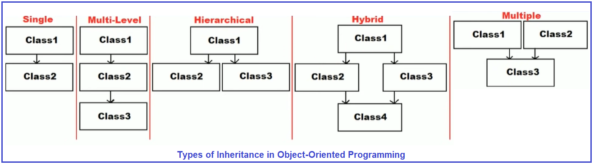

ما همچنین در **مقاله انواع وراثت** بحث کردیم که در سی شارپ، با کلاس، فقط وراثت‌های تکی، چند سطحی و سلسله مراتبی پشتیبانی می‌شوند. با کلاس، وراثت ترکیبی و چندگانه پشتیبانی نمی‌شوند. اساساً، وراثت چندگانه توسط کلاس پشتیبانی نمی‌شود. وراثت ترکیبی ترکیبی از وراثت‌های چندگانه و (تکی، چند سطحی و سلسله مراتبی) است. اگر وراثت چندگانه پشتیبانی نشود، به این معنی است که وراثت ترکیبی نیز با کلاس‌ها پشتیبانی نمی‌شود.

و سپس وراثت را بر اساس کلاس والد بی‌واسطه به دو نوع زیر طبقه‌بندی کردیم:

1. **وراثت یگانه:** اگر یک کلاس بتواند فقط یک کلاس والد بی‌واسطه داشته باشد، آن را وراثت یگانه می‌نامیم. مثال‌ها: وراثت‌های یگانه، چند سطحی و سلسله مراتبی. می‌توانید هر کلاسی را در نظر بگیرید و خواهید دید که آن کلاس فقط یک کلاس والد بی‌واسطه دارد.
2. **وراثت چندگانه:** اگر یک کلاس بیش از یک کلاس والد بی‌واسطه داشته باشد، آن را وراثت چندگانه می‌نامیم. مثال‌ها: وراثت چندگانه و ترکیبی. در اینجا، می‌توانید ببینید که یک کلاس می‌تواند بیش از یک کلاس والد بی‌واسطه داشته باشد.

حتی اگر وراثت چندگانه از طریق کلاس‌ها در سی‌شارپ پشتیبانی نشود، هنوز از طریق رابط‌ها پشتیبانی می‌شود. یک کلاس می‌تواند فقط و فقط یک کلاس والد بلافصل داشته باشد، در حالی که همان کلاس می‌تواند هر تعداد رابط به عنوان والد خود داشته باشد، یعنی وراثت چندگانه در سی‌شارپ از طریق رابط‌ها پشتیبانی می‌شود. برای درک بهتر، لطفاً به نمودار زیر نگاهی بیندازید.

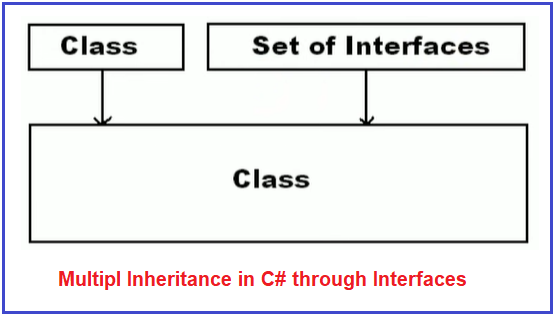

همانطور که در تصویر بالا مشاهده می‌کنید، یک کلاس می‌تواند فقط و فقط یک کلاس والد بلافصل داشته باشد. در عین حال، همان کلاس می‌تواند n تعداد رابط به عنوان والد خود داشته باشد. بنابراین، نکته‌ای که باید به خاطر داشته باشید این است که در سی شارپ، وراثت چندگانه از طریق رابط‌ها در سی شارپ پشتیبانی می‌شود، نه از طریق کلاس‌ها. حال، بیایید ادامه دهیم و سعی کنیم بفهمیم که چرا وراثت چندگانه از طریق کلاس‌ها در سی شارپ پشتیبانی نمی‌شود.

##### **چرا وراثت چندگانه از طریق کلاس‌ها در سی شارپ پشتیبانی نمی‌شود؟**

ممکن است در ذهنتان این سوال پیش آمده باشد که چرا وراثت چندگانه از طریق کلاس‌ها پشتیبانی نمی‌شود و چگونه از طریق رابط‌ها در سی‌شارپ پشتیبانی می‌شود. بیایید این موضوع را بررسی کنیم.

مواجه شدیم **وراثت چندگانه از طریق کلاس‌ها پشتیبانی نمی‌شود زیرا با مشکل ابهام** . **مشکل ابهام چیست؟** آیا کد کلاس زیر معتبر است؟ خیر. چرا؟ زیرا در یک کلاس نمی‌توانیم دو متد با نام و پارامترهای یکسان، یعنی با امضای یکسان، تعریف کنیم.

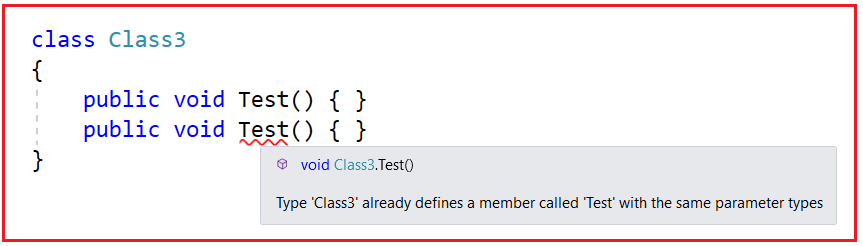

اگر کامپایلر اجازه دهد که دو امضای متد در یک کلاس یکسان باشند، با چه مشکلی مواجه خواهیم شد؟ با مشکل ابهام مواجه خواهیم شد. لطفاً به کد زیر توجه کنید. حال، وقتی نمونه‌ای از کلاس ایجاد می‌کنیم و وقتی متد Test را فراخوانی می‌کنیم، کامپایلر برای فراخوانی کدام نسخه از متد Test دچار سردرگمی می‌شود.

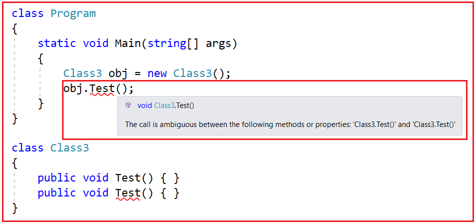

بنابراین، می‌توانید ببینید که می‌گوید **فراخوانی بین متدها یا ویژگی‌های زیر مبهم است: 'Class3.Test()' و 'Class3.Test()'** و از این رو کامپایلر ما را محدود می‌کند که دو متد با نام و پارامترهای یکسان در یک کلاس تعریف کنیم. این چیزی جز یک مشکل ابهام نیست.

و اگر کلاس ما از دو یا چند کلاس ارث‌بری کند، با همین مشکل ابهام مواجه خواهیم شد. بیایید سعی کنیم مشکل ابهام در ارث‌بری‌های چندگانه با کلاس‌ها را درک کنیم. لطفاً به نمودار زیر نگاهی بیندازید.

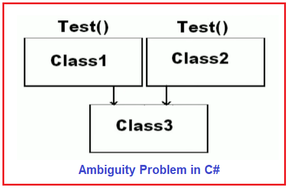

همانطور که در تصویر بالا مشاهده می‌کنید، کلاس Class3 از دو کلاس Class1 و Class2 به ارث برده شده است. در هر دو کلاس (Class1 و Class2) متدی به نام Test() داریم. این بدان معناست که همان متد Test() به کلاس Class3 به ارث می‌رسد. این بدان معناست که Class3 شامل دو متد Test با نام و امضای یکسان است. اما می‌دانیم که هیچ کلاسی نمی‌تواند شامل چندین متد با نام و امضای یکسان باشد. در این صورت، مشکل ابهام پیش می‌آید. در این حالت، دو کلاس متد را برای استفاده در اختیار کلاس فرزند قرار می‌دهند و از این رو با مشکل ابهام مواجه می‌شویم. بنابراین، برای جلوگیری از این مشکل ابهام، در حالی که شما یک کلاس را از بیش از یک کلاس به ارث می‌برید، کامپایلر خطایی به شما می‌دهد که می‌گوید نمی‌توانید چندین کلاس پایه داشته باشید، همانطور که در تصویر زیر نشان داده شده است.

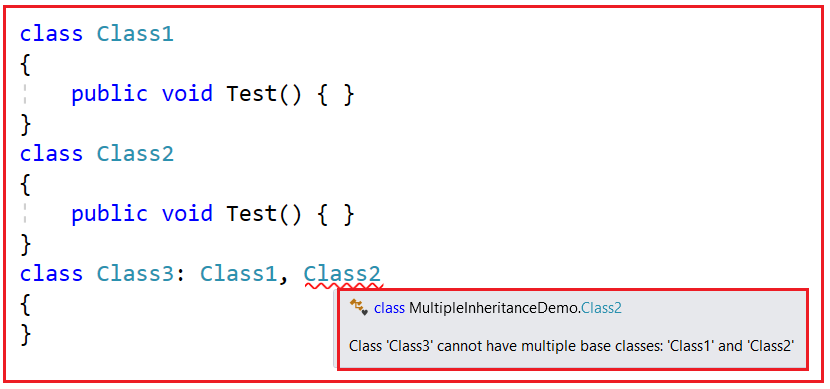

اما با رابط‌ها، ما این مشکل ابهام را نداریم. فرض کنید یک کلاس از دو رابط به ارث برده می‌شود و اگر هر دو رابط شامل یک متد باشند، در این صورت نیز با مشکل ابهام مواجه نخواهیم شد. دلیل این امر این است که در این حالت، رابط، متد را برای پیاده‌سازی در اختیار کلاس فرزند قرار می‌دهد، اما برای مصرف نه. مصرف، مشکلات ابهام ایجاد می‌کند، نه پیاده‌سازی. برای درک بهتر، لطفاً به نمودار زیر نگاهی بیندازید.

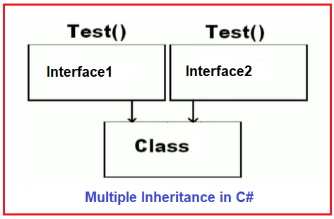

بنابراین، در اینجا هر دو رابط از کلاس فرزند درخواست می‌کنند که متد را پیاده‌سازی کند، نه اینکه آن را مصرف کند، و از این رو هیچ مشکل ابهامی وجود ندارد.

##### **مثالی برای درک وراثت چندگانه با رابط‌ها در سی شارپ:**

بیایید با یک مثال، وراثت چندگانه با رابط‌ها در سی‌شارپ را درک کنیم. ابتدا، دو رابط به شرح زیر ایجاد کنید. در اینجا، هر دو رابط شامل یک متد Test یکسان هستند.

```csharp
public interface Interface1
{
    void Test();
}
public interface Interface2
{
    void Test();
}
```

حالا، با ارث‌بری از رابط‌ها، یک کلاس به صورت زیر ایجاد کنید. در حال حاضر ما متد رابط‌ها را پیاده‌سازی نمی‌کنیم.

```csharp
public class MultipleInheritanceTest : Interface1, Interface2
{
}
```

حالا، وقتی سعی می‌کنید کد بالا را اجرا یا کامپایل کنید، همانطور که در تصویر زیر نشان داده شده است، دو خطای زمان کامپایل دریافت خواهید کرد.

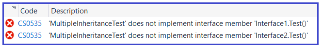

و این منطقی است. زیرا کلاس MultipleInheritanceTest متد Test مربوط به هر دو Interface1 و Interface2 را پیاده‌سازی نمی‌کند و از این رو دو خطا دریافت می‌کنیم. بنابراین، در اینجا متدهای Interface1.Test() و Interface2.Test() توسط کلاس MultipleInheritanceTest پیاده‌سازی نشده‌اند. اکنون، متد Test را در کلاس Child به صورت زیر پیاده‌سازی کنید.

```csharp
public class MultipleInheritanceTest : Interface1, Interface2
{
    public void Test()
    {
        Console.WriteLine("Test Method is Implemented in Child Class");
    }
}
```

در اینجا، مشاهده خواهید کرد که به محض پیاده‌سازی متد Test در کلاس MultipleInheritanceTest، هر دو خطای زمان کامپایل از بین می‌روند. اکنون، خواهید دید که کد با موفقیت کامپایل می‌شود. چگونه این ممکن است؟ قبلاً ما دو خطا داشتیم. ما آن را فقط یک بار پیاده‌سازی کرده‌ایم و هر دو خطا حذف شده‌اند.

این امر امکان‌پذیر است زیرا رابط از کلاس فرزند می‌خواهد که متد را پیاده‌سازی کند، نه اینکه آن را مصرف کند. و کلاس، متد را پیاده‌سازی می‌کند. حال، شما یک شک دارید که پیاده‌سازی متد Test در کلاس MultipleInheritanceTest برای متد Test رابط1 خواهد بود یا متد Test رابط2؟ پاسخ هر دو است. چرا، زیرا رابط1 چیزی نمی‌داند، یعنی هیچ نام متدی یا هیچ چیز موجود در رابط2 و رابط2 چیزی نمی‌داند، یعنی هیچ نام متدی یا هیچ چیز موجود در رابط1 را نمی‌داند.

بنابراین، در این حالت، Interface1 برای پیاده‌سازی متد Test به کلاس مراجعه می‌کند و می‌بیند که متد Test پیاده‌سازی شده است و بنابراین، Interface1 اکنون فعال است و هیچ خطایی نمی‌دهد. به طور مشابه، Interface2 برای پیاده‌سازی متد Test به کلاس مراجعه می‌کند و می‌بیند که متد Test پیاده‌سازی شده است، از این رو Interface2 نیز فعال است و هیچ خطایی نمی‌دهد.

به عبارت ساده، ما با پیاده‌سازی متد فقط یک بار، هر دو رابط را فریب می‌دهیم. بنابراین، ما به هر دو رابط می‌گوییم که این متد Test متعلق به شماست و ما آن را در کلاس خود پیاده‌سازی می‌کنیم. و هر دو رابط از وجود یکدیگر آگاه نیستند، زیرا آنها از وجود یکدیگر آگاه نیستند، هر دو رابط فکر می‌کنند که متد من در کلاس Child پیاده‌سازی شده است. و به همین دلیل است که ما هیچ خطای ابهامی دریافت نمی‌کنیم.

##### **مثالی برای درک وراثت چندگانه با رابط‌ها در سی شارپ:**

هر آنچه که تاکنون مورد بحث قرار داده‌ایم، کد کامل مثال در زیر آورده شده است.

```csharp
using System;

namespace MultipleInheritance
{
    class Program
    {
        static void Main(string[] args)
        {
            MultipleInheritanceTest obj = new MultipleInheritanceTest();
            obj.Test();
            Console.ReadKey();
        }
    }

    public interface Interface1
    {
        void Test();
    }
    public interface Interface2
    {
        void Test();
    }

    public class MultipleInheritanceTest : Interface1, Interface2
    {
        public void Test()
        {
            Console.WriteLine("Test Method is Implemented in Child Class");
        }
    }
}
```

**خروجی: متد تست در کلاس فرزند پیاده‌سازی شده است**

##### **چگونه می‌توان هر متد رابط را به صورت جداگانه در سی شارپ پیاده‌سازی کرد؟**

در مقاله قبلی، مفهوم پیاده‌سازی صریح رابط‌ها در سی‌شارپ را مورد بحث قرار دادیم. با پیاده‌سازی صریح رابط‌ها در سی‌شارپ، می‌توانیم هر متد رابط را به‌طور جداگانه در کلاس‌های فرزند پیاده‌سازی کنیم.

وقتی هر متد رابط به طور جداگانه تحت کلاس فرزند با ارائه صریح نام متد به همراه نام رابط پیاده‌سازی شود، به آن پیاده‌سازی صریح رابط گفته می‌شود. در این حالت، هنگام فراخوانی متد، باید به طور اجباری از مرجع رابطی که با استفاده از شیء یک کلاس یا نوع ایجاد شده است استفاده کنیم و شیء را به نوع رابط مناسب تبدیل کنیم.

در مثال زیر، ما با مشخص کردن نام رابط، متد Show را دو بار به طور صریح در کلاس فرزند پیاده‌سازی می‌کنیم.

```csharp
using System;

namespace MultipleInheritance
{
    class Program
    {
        static void Main(string[] args)
        {
            MultipleInheritanceTest obj = new MultipleInheritanceTest();
            obj.Test();
            //You cannot call the Show method using obj
            //obj.Show();

            //Using Interface Reference call the Show method
            Interface1 i1 = obj;
            i1.Show();

            //Typecase the object to interface type and call the show method
            ((Interface2)obj).Show();

            Console.ReadKey();
        }
    }

    public interface Interface1
    {
        void Test();
        void Show();
    }
    public interface Interface2
    {
        void Test();
        void Show();
    }

    public class MultipleInheritanceTest : Interface1, Interface2
    {
        //Normal Implementation
        public void Test()
        {
            Console.WriteLine("Test Method is Implemented in Child Class");
        }

        //Explicit Interface Implementation
        void Interface1.Show()
        {
            Console.WriteLine("Interface1 Show Method is Implemented in Child Class");
        }

        //Explicit Interface Implementation
        void Interface2.Show()
        {
            Console.WriteLine("Interface2 Show Method is Implemented in Child Class");
        }
    }
}
```

###### **خروجی:**

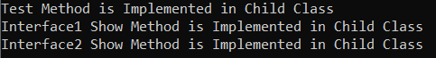

#### **سوالات متداول مصاحبه**

##### **چه زمانی در سی شارپ رابط کاربری را به کلاس انتزاعی یا برعکس ترجیح می‌دهید؟**

اگر پیاده‌سازی‌ای می‌خواهیم که برای همه کلاس‌های مشتق‌شده یکسان باشد، بهتر است به جای رابط، از یک کلاس انتزاعی استفاده کنیم. با رابط، می‌توانیم پیاده‌سازی خود را به هر کلاسی که رابط را پیاده‌سازی می‌کند، منتقل کنیم. با کلاس انتزاعی، می‌توانیم پیاده‌سازی را برای همه کلاس‌های مشتق‌شده در یک مکان مرکزی به اشتراک بگذاریم و از این طریق از تکرار کد در کلاس‌های مشتق‌شده جلوگیری کنیم.

##### **آیا یک رابط می‌تواند از رابط دیگری در C# ارث‌بری کند؟**

بله، یک رابط می‌تواند از رابط دیگری در C# ارث‌بری کند. یک کلاس می‌تواند چندین بار از طریق کلاس‌های پایه یا رابط‌هایی که از آنها ارث می‌برد، یک رابط را به ارث ببرد. در این حالت، کلاس فقط می‌تواند یک بار رابط را پیاده‌سازی کند، اگر به عنوان بخشی از کلاس جدید تعریف شده باشد. اگر رابط ارث‌بری شده به عنوان بخشی از کلاس جدید تعریف نشده باشد، پیاده‌سازی آن توسط کلاس پایه‌ای که آن را تعریف کرده است، ارائه می‌شود. یک کلاس پایه می‌تواند اعضای رابط را با استفاده از اعضای مجازی پیاده‌سازی کند. در این صورت، کلاسی که رابط را به ارث می‌برد می‌تواند با لغو اعضای مجازی، رفتار رابط را تغییر دهد.

##### **آیا می‌توانید نمونه‌ای از یک رابط را در سی‌شارپ ایجاد کنید؟**

خیر، شما نمی‌توانید در سی شارپ از یک رابط نمونه ایجاد کنید. اما می‌توانید یک متغیر مرجع از یک رابط ایجاد کنید.

##### **اگر یک کلاس از یک رابط ارث‌بری کند، دو گزینه موجود برای آن کلاس چیست؟**

**گزینه ۱:** پیاده‌سازی را برای تمام اعضای به ارث برده شده از رابط فراهم کنید. برای درک بهتر، لطفاً به مثال زیر نگاهی بیندازید.

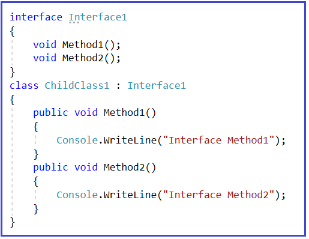

**گزینه ۲:** اگر کلاس نخواهد برای همه اعضای به ارث برده شده از رابط، پیاده‌سازی ارائه دهد، در این صورت کلاس باید به صورت انتزاعی علامت‌گذاری شود و همچنین باید متدهای رابط پیاده‌سازی نشده را به صورت انتزاعی اعلام کند. برای درک بهتر، لطفاً به مثال زیر نگاهی بیندازید.

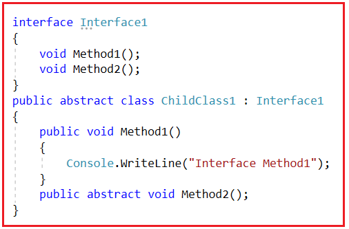

**یک کلاس از دو رابط ارث‌بری می‌کند و هر دو رابط نام متد یکسانی دارند، همانطور که در زیر نشان داده شده است. کلاس چگونه باید متد drive را برای هر دو رابط Car و Bus پیاده‌سازی کند؟**

```csharp
namespace MultipleInheritance
{
    interface Car
    {
        void Drive();
    }
    interface Bus
    {
        void Drive();
    }
    class Demo : Car, Bus
    {
        //How to implement the Drive() Method inherited from Bus and Car
    }
}
```

با استفاده از پیاده‌سازی صریح رابط. برای پیاده‌سازی متد Drive() از نام کامل همانطور که در مثال زیر نشان داده شده است استفاده کنید. برای فراخوانی متد drive رابط مربوطه، شیء demo را به رابط مربوطه تبدیل نوع (typecast) کنید و سپس متد drive را فراخوانی کنید.

```csharp
using System;

namespace MultipleInheritance
{
    interface Car
    {
        void Drive();
    }
    interface Bus
    {
        void Drive();
    }
    class Demo : Car, Bus
    {
        //How to implement the Drive() Method inherited from Bus and Car
        void Car.Drive()
        {
            Console.WriteLine("Drive Car");
        }
        void Bus.Drive()
        {
            Console.WriteLine("Drive Bus");
        }
        static void Main()
        {
            Demo DemoObject = new Demo();
            ((Car)DemoObject).Drive();
            ((Bus)DemoObject).Drive();
            Console.Read();
        }
    }
}
```

###### **خروجی:**

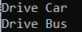