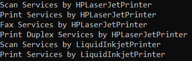

## **مثالی از وراثت چندگانه به صورت بلادرنگ در سی شارپ**

در این مقاله، قصد دارم در مورد نحوه استفاده از **وراثت چندگانه در توسعه برنامه‌های سی‌شارپ با** مثال‌های بلادرنگ بحث کنم. اگر در مصاحبه‌ای شرکت می‌کنید، ممکن است مصاحبه‌کننده از شما این سؤال را بپرسد که کاربرد وراثت چندگانه در برنامه‌های بلادرنگ چیست یا ممکن است از شما پرسیده شود که در کجای پروژه خود از وراثت چندگانه استفاده کرده‌اید؟ قبل از درک کاربرد وراثت چندگانه با مثال بلادرنگ، ابتدا اجازه دهید مفهوم وراثت چندگانه را درک کنیم.

##### **وراثت چندگانه در سی شارپ چیست؟**

وقتی یک کلاس از بیش از یک کلاس پایه مشتق می‌شود، به چنین نوع وراثتی، وراثت چندگانه گفته می‌شود. برای درک بهتر، لطفاً به تصویر زیر نگاهی بیندازید.


همانطور که در تصویر بالا مشاهده می‌کنید، کلاس C از کلاس‌های A و B ارث‌بری می‌کند و برای کلاس C، دو کلاس پایه یا والد داریم و این مفهوم در C# با کلاس‌ها به دلیل مشکل ابهام و آنچه که قبلاً در مقاله قبلی خود مورد بحث قرار داده‌ایم، پشتیبانی نمی‌شود.

اما، در حالت بلادرنگ (real-time) ما می‌خواهیم عملکرد فوق را پیاده‌سازی کنیم و این در سی‌شارپ با رابط‌ها امکان‌پذیر است. حتی اگر وراثت چندگانه (Multiple Inheritance) از طریق کلاس‌ها در سی‌شارپ پشتیبانی نشود، همچنان از طریق رابط‌ها پشتیبانی می‌شود. یک کلاس می‌تواند یک و فقط یک کلاس والد بلافصل داشته باشد، در حالی که همان کلاس می‌تواند هر تعداد رابط به عنوان والد خود داشته باشد، یعنی وراثت چندگانه در سی‌شارپ از طریق رابط‌ها پشتیبانی می‌شود. برای درک بهتر، لطفاً به نمودار زیر نگاهی بیندازید.


همانطور که در تصویر بالا مشاهده می‌کنید، یک کلاس می‌تواند فقط و فقط یک کلاس والد بلافصل داشته باشد. در عین حال، همان کلاس می‌تواند n تعداد رابط به عنوان والد خود داشته باشد. بنابراین، نکته‌ای که باید به خاطر داشته باشید این است که در سی شارپ، وراثت چندگانه از طریق رابط‌ها پشتیبانی می‌شود، نه از طریق کلاس‌ها. بنابراین، در این مقاله، قصد دارم یک مثال بلادرنگ را به شما نشان دهم که در آن باید به سراغ وراثت چندگانه بروید.

##### **مثال برای درک وراثت چندگانه در سی شارپ:**

ابتدا، مثالی را بدون استفاده از وراثت چندگانه به شما نشان می‌دهم و سپس در مورد مشکل بحث خواهیم کرد و بعد خواهیم دید که چگونه می‌توانیم با استفاده از وراثت چندگانه در زبان سی شارپ بر چنین مشکلاتی غلبه کنیم.

##### **مثال بدون استفاده از وراثت چندگانه در سی شارپ**

ما باید یک برنامه برای پیاده‌سازی سرویس چاپگر توسعه دهیم. بنابراین، به عنوان بخشی از سرویس چاپگر، قصد داریم چهار قابلیت زیر را ارائه دهیم.

1. **چاپ**
2. **فکس**
3. **اسکن**
4. **چاپ دوطرفه**

بنابراین، ممکن است علاقه‌مند باشید که یک رابط به نام IPrinterTasks با چهار متد انتزاعی فوق به شرح زیر تعریف کنید:

```csharp
namespace MultipleInheritanceRealtimeExample
{
    public interface IPrinterTasks
    {
        void Print(string PrintContent);
        void Scan(string ScanContent);
        void Fax(string FaxContent);
        void PrintDuplex(string PrintDuplexContent);
    }
}
```

همانطور که در کد بالا مشاهده می‌کنید، در اینجا، ما یک رابط به نام IPrinterTasks با چهار متد انتزاعی ایجاد کرده‌ایم. حال اگر کلاسی بخواهد این رابط را پیاده‌سازی کند، آن کلاس باید پیاده‌سازی هر چهار متد رابط IPrinterTasks را فراهم کند.

ما دو چاپگر داریم، یعنی **HPLaserJetPrinter** و **LiquidInkjetPrinter** که خدمات چاپگر را می‌خواهند. اما شرط لازم این است که HPLaserJetPrinter تمام خدمات ارائه شده توسط IPrinterTasks را بخواهد در حالی که LiquidInkjetPrinter فقط دو سرویس یعنی خدمات چاپ و اسکن چاپگر را می‌خواهد.

از آنجایی که تمام متدها را درون رابط IPrinterTasks تعریف کرده‌ایم، بنابراین برای کلاس LiquidInkjetPrinter الزامی است که پیاده‌سازی متدهای Scan و Print را به همراه متدهای Fax و PrintDulex که توسط کلاس LiquidInkjetPrinter مورد نیاز نیستند، فراهم کند.

##### **HPLaserJetPrinter.cs**

یک فایل کلاس با نام HPLaserJetPrinter.cs ایجاد کنید و سپس کد زیر را کپی و در آن جایگذاری کنید. در اینجا، می‌توانید ببینید که کلاس ما از رابط IPrinterTasks به ارث رسیده و پیاده‌سازی هر چهار متد رابط را فراهم می‌کند.

```csharp
using System;

namespace MultipleInheritanceRealtimeExample
{
    public class HPLaserJetPrinter : IPrinterTasks
    {
        public void Print(string PrintContent)
        {
            Console.WriteLine(PrintContent);
        }
        public void Scan(string ScanContent)
        {
            Console.WriteLine(ScanContent);
        }
        public void Fax(string FaxContent)
        {
            Console.WriteLine(FaxContent);
        }
        public void PrintDuplex(string PrintDuplexContent)
        {
            Console.WriteLine(PrintDuplexContent);
        }
    }
}
```

کلاس فوق به تمام سرویس‌های چاپگر نیاز داشت و ما پیاده‌سازی هر چهار متد رابط را فراهم می‌کنیم. اشکالی ندارد.

##### **LiquidInkjetPrinter.cs**

حالا، یک فایل کلاس با نام LiquidInkjetPrinter.cs ایجاد کنید و سپس کد زیر را در آن کپی و جایگذاری کنید. در اینجا، می‌توانید ببینید که کلاس ما نیز از رابط IPrinterTasks به ارث رسیده و پیاده‌سازی هر چهار متد رابط را فراهم می‌کند.

```csharp
using System;

namespace MultipleInheritanceRealtimeExample
{
    class LiquidInkjetPrinter : IPrinterTasks
    {
        public void Print(string PrintContent)
        {
            Console.WriteLine(PrintContent);
        }
        public void Scan(string ScanContent)
        {
            Console.WriteLine(ScanContent);
        }
        public void Fax(string FaxContent)
        {
            throw new NotImplementedException();
        }
        public void PrintDuplex(string PrintDuplexContent)
        {
            throw new NotImplementedException();
        }
    }
}
```

کلاس فوق فقط به دو سرویس چاپگر نیاز داشت، اما در اینجا ما پیاده‌سازی هر چهار متد رابط را نیز ارائه می‌دهیم. مشکل همین است. ما نباید پیاده‌سازی را برای متدهایی که به آنها علاقه‌ای نداریم، فراهم کنیم. در این حالت، کلاس نباید پیاده‌سازی متدهای Fax و PrintDuplex را فراهم کند.

##### **چگونه می‌توانیم بر این مشکل غلبه کنیم؟**

با تقسیم رابط کاربری بزرگ بالا به تعداد زیادی رابط کاربری کوچک. برای درک بهتر، لطفاً به کد زیر نگاهی بیندازید. همانطور که در کد زیر مشاهده می‌کنید، اکنون آن یک رابط کاربری بزرگ را به سه رابط کاربری کوچک تقسیم کرده‌ایم.

```csharp
namespace MultipleInheritanceRealtimeExample
{
    public interface IPrinterTasks
    {
        void Print(string PrintContent);
        void Scan(string ScanContent);
    }
    interface IFaxTasks
    {
        void Fax(string content);
    }
    interface IPrintDuplexTasks
    {
        void PrintDuplex(string content);
    }
}
```

حالا هر رابط کاربری هدف خاصی دارد. حالا اگر کلاسی بخواهد از همه سرویس‌ها استفاده کند، آن کلاس باید هر سه رابط کاربری را پیاده‌سازی کند. در مثال ما، HPLaserJetPrinter می‌خواهد از همه سرویس‌ها استفاده کند و از این رو، این کلاس باید در هر سه رابط کاربری پیاده‌سازی شود، همانطور که در کد زیر نشان داده شده است. این چیزی جز وراثت چندگانه نیست. یک کلاس چندین رابط کاربری را پیاده‌سازی می‌کند.

```csharp
using System;

namespace MultipleInheritanceRealtimeExample
{
    public class HPLaserJetPrinter : IPrinterTasks, IFaxTasks, IPrintDuplexTasks
    {
        public void Print(string PrintContent)
        {
            Console.WriteLine(PrintContent);
        }
        public void Scan(string ScanContent)
        {
            Console.WriteLine(ScanContent);
        }
        public void Fax(string FaxContent)
        {
            Console.WriteLine(FaxContent);
        }
        public void PrintDuplex(string PrintDuplexContent)
        {
            Console.WriteLine(PrintDuplexContent);
        }
    }
}
```

حال، اگر هر کلاسی سرویس اسکن و چاپ را بخواهد، آن کلاس فقط باید رابط‌های IPrinterTasks را پیاده‌سازی کند. در مثال ما، LiquidInkjetPrinter فقط سرویس‌های اسکن و چاپ را می‌خواهد و از این رو این کلاس فقط باید رابط IPrinterTasks را پیاده‌سازی کند، همانطور که در کد زیر نشان داده شده است.

```csharp
using System;

namespace MultipleInheritanceRealtimeExample
{
    class LiquidInkjetPrinter : IPrinterTasks
    {
        public void Print(string PrintContent)
        {
            Console.WriteLine(PrintContent);
        }
        public void Scan(string ScanContent)
        {
            Console.WriteLine(ScanContent);
        }
    }
}
```

##### **استفاده از کلاس‌های چاپگر:**

حالا، وقتی یک نمونه از HPLaserJetPrinter ایجاد می‌کنید، می‌توانید از تمام سرویس‌ها استفاده کنید. از طرف دیگر، اگر یک نمونه از LiquidInkjetPrinter ایجاد کنید، فقط می‌توانید از سرویس‌های Print و Scan استفاده کنید. متد Main کلاس Program را همانطور که در تصویر زیر نشان داده شده است، تغییر دهید.

```csharp
using System;

namespace MultipleInheritanceRealtimeExample
{
    class Program
    {
        static void Main(string[] args)
        {
            HPLaserJetPrinter hPLaserJetPrinter = new HPLaserJetPrinter();
            hPLaserJetPrinter.Scan("Scan Services by HPLaserJetPrinter");
            hPLaserJetPrinter.Print("Print Services by HPLaserJetPrinter");
            hPLaserJetPrinter.Fax("Fax Services by HPLaserJetPrinter");
            hPLaserJetPrinter.PrintDuplex("Print Duplex Services by HPLaserJetPrinter");

            LiquidInkjetPrinter liquidInkjetPrinter = new LiquidInkjetPrinter();
            liquidInkjetPrinter.Scan("Scan Services by LiquidInkjetPrinter");
            liquidInkjetPrinter.Print("Print Services by LiquidInkjetPrinter");

            //Fax and PrintDuplex are not available in LiquidInkjetPrinter
            //liquidInkjetPrinter.Fax("Fax Services");
            //liquidInkjetPrinter.PrintDuplex("Print Duplex Services");

            Console.Read();
        }
    }
}
```

###### **خروجی:**

