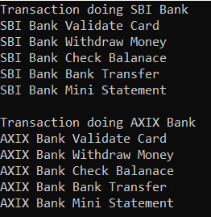
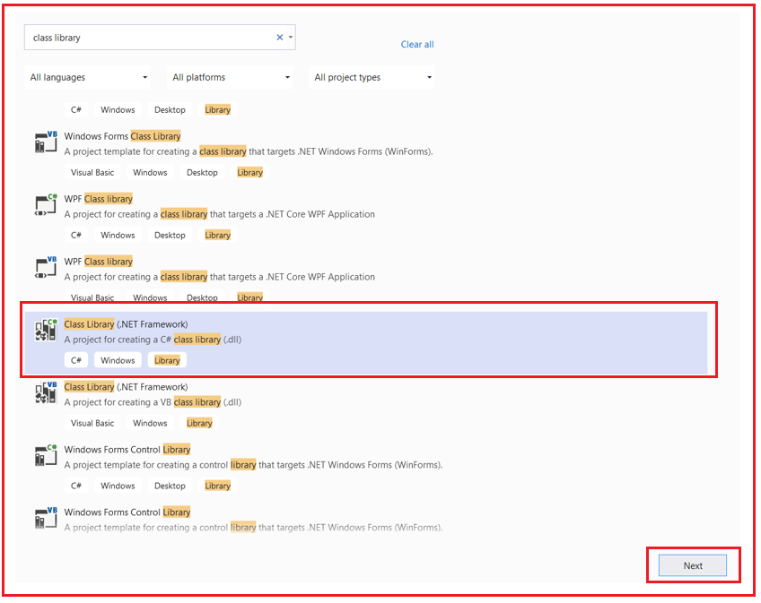
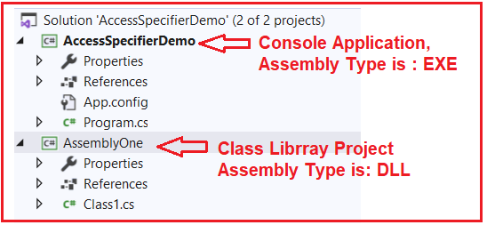

## **چندریختی در سی شارپ با مثال‌های بلادرنگ**

در این مقاله، من در **مورد چندریختی در سی شارپ** با مثال‌های بلادرنگ بحث خواهم کرد. چندریختی در سی شارپ یکی از مفاهیم اصلی زبان‌های برنامه‌نویسی شی‌گرا (OOPs) است. در پایان این مقاله، نکات زیر را به طور مفصل خواهید فهمید .

1. **پلی مورفیسم چیست؟**
2. **چرا به چندریختی نیاز داریم؟**
3. **انواع چندریختی در سی شارپ**
4. **پلی مورفیسم زمان کامپایل چیست؟**
5. **پلی مورفیسم زمان اجرا چیست؟**

**نکته:** چندریختی یکی از ارکان اصلی برنامه‌نویسی شیءگرا است.

##### **چندریختی (پلی مورفیسم) در سی شارپ چیست؟**

چندریختی یکی از مفاهیم اساسی OOP است و اصطلاحی است که برای توصیف موقعیت‌هایی استفاده می‌شود که در آن‌ها چیزی نقش‌ها یا اشکال مختلفی به خود می‌گیرد. در دنیای برنامه‌نویسی، این چیزها می‌توانند عملگرها یا توابع باشند.

کلمه چندریختی (پلی‌مورفیسم) از دو کلمه یونانی گرفته شده است: پلی و مورف. کلمه "پلی" به معنی چند و "مورف" به معنی شکل است. بنابراین، چندریختی به معنی "اشکال متعدد" است یا می‌توان گفت که کلمه چندریختی به معنی توانایی گرفتن بیش از یک شکل است. این چیزی است که می‌تواند اشکال مختلفی به خود بگیرد.

چندریختی مفهومی است که به وسیله آن می‌توانیم یک کار واحد را به روش‌های مختلف انجام دهیم. یعنی وقتی یک موجودیت واحد در موارد مختلف رفتار متفاوتی دارد، در زبان سی شارپ به آن چندریختی می‌گویند. اصطلاح چندریختی یک اصطلاح برنامه‌نویسی شیءگرا است که به معنای رفتار متفاوت یک تابع یا یک عملگر در سناریوهای مختلف است.

از نظر فنی، می‌توانیم بگوییم وقتی یک تابع با ارسال انواع و تعداد مختلف مقادیر ورودی، رفتارهای متفاوتی از خود نشان می‌دهد، در زبان سی شارپ به آن چندریختی (Polymorphism) می‌گویند. بنابراین، رفتار متفاوت تابع بسته به ورودی دریافتی، چندریختی نامیده می‌شود، یعنی هر زمان که ورودی تغییر کند، خروجی یا رفتار آن نیز به طور خودکار تغییر می‌کند.

ما می‌توانیم با استفاده از چندریختی (polymorphism) به انعطاف‌پذیری در کد خود دست یابیم، زیرا می‌توانیم عملیات مختلفی را با استفاده از متدهایی با نام‌های یکسان و مطابق با الزامات تجاری خود انجام دهیم. بیایید چندریختی را با چند مثال بلادرنگ (real-time) درک کنیم.

##### **مثال‌های بلادرنگ از چندریختی:**

بیایید چند مثال بلادرنگ را برای درک مفهوم چندریختی بررسی کنیم.

##### **مثال ۱:**

فرض کنید در یک کلاس درس هستید، در آن زمان، مانند یک دانش‌آموز رفتار خواهید کرد. اما وقتی در مرکز خرید هستید، در آن زمان مانند یک مشتری رفتار خواهید کرد. دوباره، وقتی در اتوبوس هستید، مانند یک مسافر رفتار خواهید کرد. و وقتی در آن زمان در خانه خود هستید، مانند یک پسر یا دختر رفتار خواهید کرد. در اینجا، شما یک نفر هستید اما رفتارهای متفاوتی انجام می‌دهید. این چیزی جز چندریختی نیست. رفتارها بر اساس مکان تغییر می‌کنند.



##### **مثال ۲:**

یک نگهبان امنیتی در یک سازمان با افراد مختلفی که وارد سازمان می‌شوند، رفتار متفاوتی دارد. نگهبان وقتی رئیس می‌آید، رفتار متفاوتی دارد و وقتی کارمندان می‌آیند، رفتارش متفاوت است. و وقتی مشتریان وارد می‌شوند، همان نگهبان امنیتی واکنش متفاوتی نشان می‌دهد. بنابراین در اینجا، رفتار نگهبان امنیتی از فردی به فرد دیگر تغییر می‌کند. این بستگی به عضوی دارد که وارد سازمان می‌شود.

 در سی شارپ چیست؟")

##### **مثال ۳:**

یکی دیگر از مثال‌های خوب و بلادرنگ از چندریختی، آب است. همه ما می‌دانیم که آب در دمای معمولی مایع است، اما وقتی یخ می‌زند به جامد تبدیل می‌شود و همین آب وقتی در نقطه جوش خود گرم می‌شود به گاز تبدیل می‌شود. این هم چندریختی است.



##### **مثال ۴:**

یکی از بهترین نمونه‌های بلادرنگ از چندریختی، زنان در جامعه هستند. یک زن نقش‌های متفاوتی را در جامعه ایفا می‌کند. یک زن می‌تواند همسر کسی، مادر فرزندش، در یک سازمان و بسیاری دیگر از نقش‌ها به طور همزمان باشد. اما زن فقط یکی است. بنابراین، انجام نقش‌های مختلف توسط یک زن چیزی جز انجام چندریختی نیست.


##### **انواع چندریختی در سی شارپ:**

دو نوع چندریختی در سی شارپ وجود دارد. آنها به شرح زیر هستند:

1. **چندریختی ایستا / چندریختی زمان کامپایل / اتصال زودهنگام**
2. **چندریختی پویا / چندریختی زمان اجرا / اتصال دیرهنگام**

نمودار زیر انواع مختلف چندریختی‌ها را در سی‌شارپ به همراه مثال‌های آنها نشان می‌دهد.



چندریختی در سی شارپ را می‌توان با استفاده از سه روش زیر پیاده‌سازی کرد.

1. **سربارگذاری متد**
2. **سربارگذاری عملگر**
3. **نادیده گرفتن متد**
4. **پنهان‌سازی متد**

**نکته:** هنگام کار با چندریختی در سی شارپ، باید دو نکته را درک کنیم، یعنی اینکه در زمان کامپایل چه اتفاقی می‌افتد و در زمان اجرا برای فراخوانی یک متد مشخص چه اتفاقی می‌افتد. آیا متد در زمان اجرا از همان کلاسی اجرا می‌شود که در زمان کامپایل به آن کلاس محدود شده است، یا اینکه متد در زمان اجرا از کلاس دیگری به جای کلاسی که در زمان کامپایل محدود شده است، اجرا خواهد شد؟

##### **پلی مورفیسم زمان کامپایل در سی شارپ چیست؟**

فراخوانی تابع در زمان کامپایل به کلاس محدود می‌شود؛ اگر قرار باشد تابع در زمان اجرا از همان کلاس محدود شده اجرا شود، در C# به آن چندریختی زمان کامپایل می‌گویند. این اتفاق در مورد بارگذاری بیش از حد متد رخ می‌دهد زیرا در این حالت، هر متد امضای متفاوتی خواهد داشت و بر اساس فراخوانی متد، می‌توانیم به راحتی متدی را که با امضای متد مطابقت دارد، تشخیص دهیم.

در چندریختی ایستا، رفتار یک متد در زمان کامپایل تعیین می‌شود. این بدان معناست که کامپایلر سی‌شارپ فراخوانی‌های متد را فقط در زمان کامپایل به تعریف/بدنه متد متصل می‌کند. بنابراین، این نوع چندریختی در سی‌شارپ، چندریختی زمان کامپایل نیز نامیده می‌شود. از آنجایی که اتصال (پیوند بین فراخوانی تابع و تعریف تابع) در زمان کامپایل انجام می‌شود، به عنوان اتصال اولیه نیز شناخته می‌شود.

##### **مثال برای درک چندریختی زمان کامپایل در سی شارپ:**

در مثال زیر، درون کلاس Program، سه نسخه overload شده از متد Add را تعریف کرده‌ایم، اما با امضاهای متفاوت. در این حالت، فقط در زمان کامپایل، متوجه خواهیم شد که کدام متد قرار است اجرا شود و اتصال متد در زمان اجرا حل می‌شود. اگر در حال حاضر این موضوع مشخص نیست، 

```csharp
using System;

namespace MethodOverloading
{
    class Program
    {
        public void Add(int a, int b)
        {
            Console.WriteLine(a + b);
        }
        public void Add(float x, float y)
        {
            Console.WriteLine(x + y);
        }
        public void Add(string s1, string s2)
        {
            Console.WriteLine(s1 + " " + s2);
        }
        static void Main(string[] args)
        {
            Program obj = new Program();
            obj.Add(10, 20);
            obj.Add(10.5f, 20.5f);
            obj.Add("Pranaya", "Rout");
            Console.ReadKey();
        }
    }
}
```

###### **خروجی:**


##### **پلی مورفیسم زمان اجرا در سی شارپ چیست؟**

در چندریختی پویا، رفتار یک متد در زمان اجرا تعیین می‌شود. بنابراین، CLR (Common Language Runtime) فراخوانی متد را به تعریف/بدنه متد در زمان اجرا متصل می‌کند و در زمان اجرا، زمانی که متد فراخوانی می‌شود، متد مربوطه را فراخوانی می‌کند.

فراخوانی تابع در زمان کامپایل به کلاس محدود می‌شود؛ اگر قرار باشد تابع در زمان اجرا از کلاس متفاوتی به جای کلاسی که در زمان کامپایل محدود شده است، اجرا شود، به آن چندریختی زمان اجرا (Run-Time Polymorphism) می‌گویند. این اتفاق در مورد لغو متد (Method Overriding) رخ می‌دهد   زیرا در این حالت، چندین متد با امضای یکسان داریم، یعنی کلاس والد و کلاس فرزند پیاده‌سازی متد یکسانی دارند. بنابراین، در این حالت، می‌توانیم در زمان اجرا بدانیم که متد از کدام کلاس اجرا خواهد شد.

به آن چندریختی پویا (Dynamic Polymorphism) یا اتصال دیرهنگام (Late Binding) نیز می‌گویند، زیرا در زمان اجرا می‌توانیم بدانیم که متد از کدام کلاس اجرا خواهد شد.

##### **مثال برای درک چندریختی پویا در سی شارپ:**

در مثال زیر، ما یک متد مجازی در کلاس Class1 ایجاد کرده‌ایم و آن متد را درون کلاس Class2 مجدداً پیاده‌سازی کرده‌ایم. این بدان معناست که پیاده‌سازی متد Show در هر دو کلاس Parent و Child در دسترس است. در متد Main، ما یک نمونه از کلاس Child ایجاد می‌کنیم اما آن نمونه را در متغیر مرجع کلاس Parent ذخیره می‌کنیم؛ در این حالت، اینکه متد Show از کدام کلاس اجرا شود، فقط در زمان اجرا تعیین می‌شود. این چیزی جز چندریختی پویا نیست.

```csharp
using System;

namespace PolymorphismDemo
{
    class Class1
    {
        //Virtual Function (Overridable Method)
        public virtual void Show()
        {
            //Parent Class Logic Same for All Child Classes
            Console.WriteLine("Parent Class Show Method");
        }
    }

    class Class2 : Class1
    {
        //Overriding Method
        public override void Show()
        {
            //Child Class Reimplementing the Logic
            Console.WriteLine("Child Class Show Method");
        }
    }

    class Program
    {
        static void Main(string[] args)
        {
            Class1 obj1 = new Class2();
            obj1.Show(); //Resolve at Runtime
            
            Console.ReadKey();
        }
    }
}
```

**خروجی: متد نمایش کلاس فرزند**