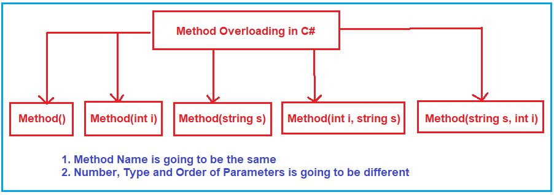
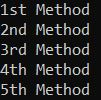
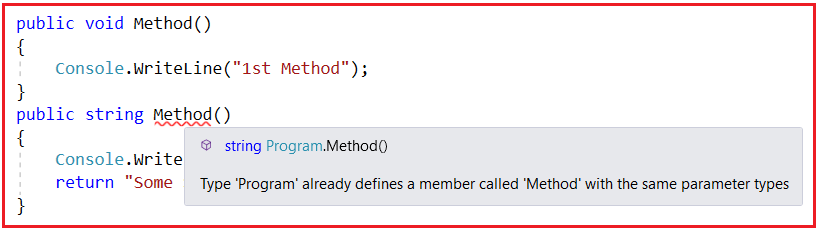
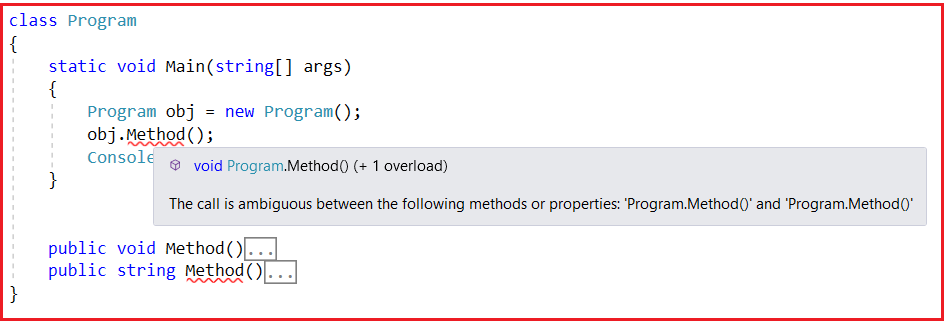
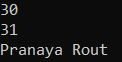
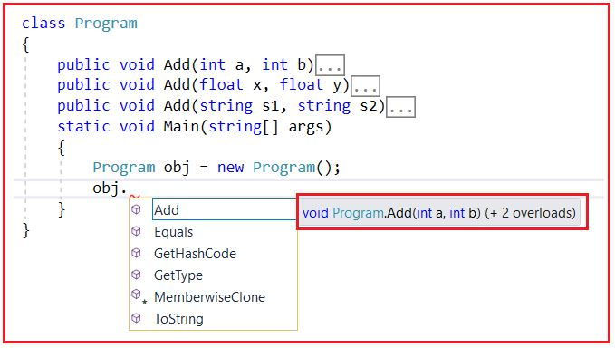
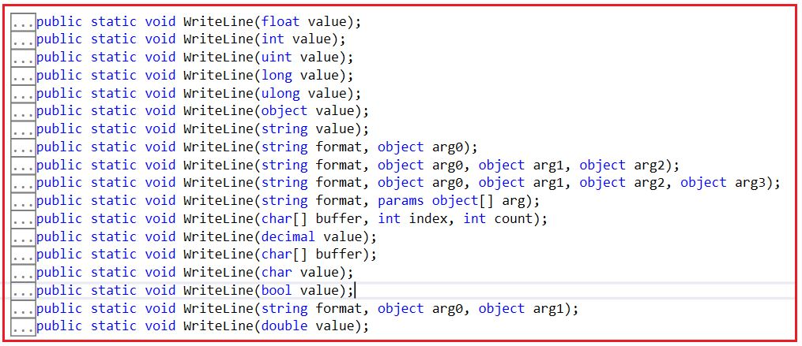
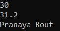
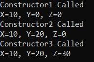
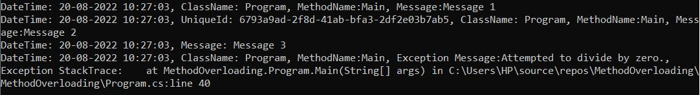

## **سربارگذاری متد در سی شارپ به همراه مثال**

در این مقاله، قصد دارم در مورد **اینکه متد Overloading در سی شارپ چیست** و چه کاربردی در توسعه برنامه ما دارد، با مثال‌هایی صحبت کنم. در پایان این مقاله، درک بسیار خوبی از نکات زیر در رابطه با Method Overloading خواهید داشت.

1. **بارگذاری بیش از حد متد در سی شارپ چیست؟**
2. **چه زمانی باید متدها را Overload کنیم؟**
3. **مزایای استفاده از Method Overloading در سی شارپ چیست؟**
4. **چه زمانی یک متد، متد overload شده محسوب می‌شود؟**
5. **سربارگذاری متد مبتنی بر وراثت چیست؟**
6. **سناریوهای بلادرنگ که در آنها نیاز به استفاده از Method Overloading دارید؟**
7. **سربارگذاری سازنده (Constructor Overloading) در سی شارپ چیست؟**
8. **مثالی از ثبت وقایع بلادرنگ با استفاده از بارگذاری بیش از حد متد در سی شارپ؟**

**نکته:** نکته‌ای که باید در نظر داشته باشید این است که اصطلاحات سربارگذاری تابع و سربارگذاری متد به جای یکدیگر استفاده می‌شوند. سربارگذاری متد یکی از روش‌های رایج برای پیاده‌سازی چندریختی زمان کامپایل در سی‌شارپ است.

##### **بارگذاری بیش از حد متد یا بارگذاری بیش از حد تابع در سی شارپ چیست؟**

سربارگذاری متد (Method Overloading) به معنای رویکردی برای تعریف چندین متد تحت یک کلاس با یک نام واحد است. بنابراین، می‌توانیم بیش از یک متد با نام یکسان در یک کلاس تعریف کنیم. اما نکته‌ای که باید به خاطر داشته باشید این است که پارامترهای همه آن متدها باید متفاوت باشند (از نظر تعداد، نوع و ترتیب پارامترها متفاوت باشند).

بنابراین، اگر چندین متد با نام یکسان اما با امضای متفاوت در یک کلاس یا در کلاس‌های والد و فرزند تعریف کنیم، به آن سربارگذاری متد در سی‌شارپ می‌گویند. این بدان معناست که سی‌شارپ دات‌نت نه تنها سربارگذاری متد در یک کلاس را مجاز می‌داند، بلکه سربارگذاری متد در کلاس‌های والد و فرزند را نیز مجاز می‌داند. بنابراین، می‌توانیم متدی را در کلاس Derived/Child با نامی مشابه نام متد تعریف شده در کلاس Base/Parent در سی‌شارپ ایجاد کنیم.

به عبارت ساده، می‌توان گفت که سربارگذاری متد در سی‌شارپ به یک کلاس اجازه می‌دهد تا چندین متد با نام یکسان اما با امضای متفاوت داشته باشد. توابع یا متدها را می‌توان بر اساس تعداد، نوع (int، float و غیره)، ترتیب و نوع (Value، Ref یا Out) پارامترها سربارگذاری کرد. برای درک بهتر، لطفاً به تصویر زیر نگاهی بیندازید. همه متدها معتبر خواهند بود و بر اساس فراخوانی متد، کامپایلر به طور خودکار تصمیم می‌گیرد که کدام نسخه سربارگذاری شده فراخوانی شود.



همانطور که در تصویر بالا مشاهده می‌کنید، همه متدها نام یکسانی دارند، یعنی Method، اما پارامترهای متفاوتی دارند. اگر به دو متد اول نگاه کنید، تعداد پارامترها متفاوت است. متد اول صفر پارامتر می‌گیرد در حالی که متد دوم یک پارامتر می‌گیرد. اگر متد دوم را با متد سوم مقایسه کنید، هر دو تعداد پارامترهای یکسانی می‌گیرند اما از نوع متفاوت. متد دوم یک پارامتر عدد صحیح می‌گیرد در حالی که متد سوم یک پارامتر رشته‌ای می‌گیرد. علاوه بر این، اگر متد چهارم و پنجم را مقایسه کنید، هر دو تعداد پارامترهای یکسانی دارند اما ترتیب پارامترها متفاوت است. متد چهارم پارامتر اول را عدد صحیح و پارامتر دوم را رشته‌ای می‌گیرد در حالی که متد پنجم پارامتر اول را رشته‌ای و پارامتر دوم را عدد صحیح می‌گیرد. بنابراین، هر متد از نظر تعداد، نوع و ترتیب پارامترها متفاوت است و به این کار در سی شارپ، overloading متد می‌گویند.

امضای یک متد شامل نام متد و نوع داده، تعداد، ترتیب و نوع (مقدار، مرجع یا خروجی) پارامترها است . نکته‌ای که باید در نظر داشته باشید این است که امضای یک متد شامل نوع بازگشتی و اصلاح‌کننده‌های پارامترها نمی‌شود. بنابراین نمی‌توان یک متد را فقط بر اساس نوع بازگشتی و اصلاح‌کننده پارامترها overload کرد. در مقاله بعدی خود در مورد اصلاح‌کننده Params صحبت خواهیم کرد.

##### **مثال برای درک سربارگذاری متد در سی شارپ:**

```csharp
using System;

namespace MethodOverloading
{
    class Program
    {
        static void Main(string[] args)
        {
            Program obj = new Program();
            obj.Method(); //Invoke the 1st Method
            obj.Method(10); //Invoke the 2nd Method
            obj.Method("Hello"); //Invoke the 3rd Method
            obj.Method(10, "Hello"); //Invoke the 4th Method
            obj.Method("Hello", 10); //Invoke the 5th Method

            Console.ReadKey();
        }

        public void Method()
        {
            Console.WriteLine("1st Method");
        }
        public void Method(int i)
        {
            Console.WriteLine("2nd Method");
        }
        public void Method(string s)
        {
            Console.WriteLine("3rd Method");
        }
        public void Method(int i, string s)
        {
            Console.WriteLine("4th Method");
        }
        public void Method(string s, int i)
        {
            Console.WriteLine("5th Method");
        }    
    }
}
```

###### **خروجی:**



##### **چرا نوع بازگشتی به عنوان بخشی از بارگذاری بیش از حد متد در سی شارپ در نظر گرفته نمی‌شود؟**

بیایید با یک مثال بفهمیم که چرا نوع بازگشتی به عنوان بخشی از بارگذاری بیش از حد متد در نظر گرفته نمی‌شود. لطفاً به تصویر زیر نگاهی بیندازید. در اینجا، من دو متد با نام یکسان نوشته‌ام، اما نوع بازگشتی یکی از متدها void و نوع بازگشتی متد دیگر string است. ببینید، به محض اینکه متد دوم را ایجاد می‌کنیم، خود کامپایلر خطای زمان کامپایل می‌دهد و می‌گوید **نوع 'Program' از قبل عضوی به نام 'Method' با همان نوع پارامترها تعریف کرده است .**



بنابراین، در زمان تعریف متد، فقط کامپایلر به ما خطا داد. اکنون، هنوز هم ممکن است شک داشته باشید که انواع بازگشتی متفاوت هستند، پس چرا نامعتبر خواهد بود. برای درک این موضوع، بیایید سعی کنیم متد را همانطور که در تصویر زیر نشان داده شده است، فراخوانی کنیم. بنابراین، وقتی متد را فراخوانی می‌کنیم، می‌توانید به من بگویید کدام نسخه از متد قرار است فراخوانی شود؟ زیرا ما دو متد داریم که هیچ پارامتری نمی‌پذیرند. بنابراین، در اینجا با مشکل ابهام مواجه خواهیم شد و می‌بینیم که کامپایلر نیز **همان خطای ابهام را می‌دهد . فراخوانی بین متدها یا ویژگی‌های زیر مبهم است: 'Program.Method()' و 'Program.Method()' .** هنگام فراخوانی متد،



هنوز شک دارید، انواع برگشتی متفاوت هستند. ببینید، انواع برگشتی در انتهای اجرای متد مطرح می‌شوند. اما در اینجا، سردرگمی در انتهای اجرای متد نیست، بلکه سردرگمی در مورد این است که از کجا شروع کنیم و کدام متد را فراخوانی کنیم. بنابراین، کامپایلر هیچ وضوحی برای شروع اجرای متد ندارد و صحبت در مورد پایان اجرای متد هیچ معنایی ندارد. بنابراین، به همین دلیل است که نوع برگشتی هرگز هنگام تعریف سربارگذاری متد در سی شارپ در نظر گرفته نمی‌شود.

##### **چه زمانی باید متدها را در سی شارپ Overload کنیم؟**

ما متوجه شدیم که Method Overloading چیست و چگونه می‌توان آن را در سی شارپ پیاده‌سازی کرد. اما سوال مهم این است که چه زمانی باید آن را پیاده‌سازی کنیم یا چه زمانی باید از Method Overloading در سی شارپ استفاده کنیم. بیایید این موضوع را با یک مثال درک کنیم.

مفهوم سربارگذاری متد (Method Overloading) زیرمجموعه اصل Polymorphisms OOPs قرار می‌گیرد. برنامه‌نویسی شیءگرا بر اساس چهار اصل کپسوله‌سازی (Encapsulation)، انتزاع (Abstraction)، وراثت (Inheritance) و چندریختی (Polymorphism) بنا شده است.

چندریختی چیست؟ چندریختی مکانیسمی برای تغییر رفتار بر اساس ورودی‌ها است. یعنی وقتی ورودی تغییر می‌کند، خروجی یا رفتار به طور خودکار تغییر می‌کند. بهترین مثال چندریختی، خودمان هستیم. به عنوان مثال، وقتی چیزی جالب یا چیزی که برای ما خوب است می‌شنویم، خوشحال می‌شویم. و وقتی چیزی می‌شنویم که برای ما خوب نیست، ناراحت می‌شویم. فرض کنید از پدرتان خواسته‌اید که یک دوچرخه بخرد، و اگر پدرتان برای شما دوچرخه بخرد، خوشحال خواهید شد. و اگر پدرتان بگوید که من برای شما دوچرخه نمی‌خرم، ناراحت خواهید شد. بنابراین، شما همان شخص هستید، وقتی چیز خوبی دریافت می‌کنید، خوشحال می‌شوید و وقتی چیزی دریافت می‌کنید که خوب نیست، ناراحت می‌شوید. به این چندریختی می‌گویند. رفتار متفاوت بر اساس ورودی دریافتی، یعنی هر زمان که ورودی تغییر کند، خروجی به طور خودکار تغییر می‌کند.

در اینجا، تغییرات ورودی به این معنی است که فکر نکنید مقادیر تغییر می‌کنند. تغییرات ورودی به این معنی است که وقتی تعداد، نوع و ترتیب ورودی‌ها را تغییر می‌دهیم، مقادیر نیز تغییر می‌کنند. فکر نکنید که اگر عدد ۱۰ را وارد کنم، یک مقدار دریافت می‌کنم، اگر عدد ۲۰ را وارد کنم، مقدار متفاوتی دریافت می‌کنم. برای این منظور، شرط if else کافی است، overloading لازم نیست. وقتی انتظار دارید خروجی بر اساس تعداد، نوع و ترتیب ورودی‌ها تغییر کند، فقط باید از method overloading در سی شارپ استفاده کنید.

برای درک بهتر، لطفاً به مثال زیر نگاهی بیندازید. در اینجا، ما سه متد با نام یکسان برای انجام جمع دو عدد صحیح، دو عدد اعشاری و دو رشته ایجاد کرده‌ایم. بنابراین، وقتی دو عدد صحیح ارائه می‌دهیم، یک خروجی دریافت می‌کنیم و وقتی دو مقدار رشته‌ای ارائه می‌دهیم، خروجی متفاوتی دریافت می‌کنیم و به طور مشابه، وقتی دو عدد اعشاری ارائه می‌دهیم، خروجی دیگری دریافت خواهیم کرد. این بدان معناست که وقتی ورودی تغییر می‌کند، خروجی یا رفتار نیز به طور خودکار تغییر می‌کند. به این عمل در سی شارپ چندریختی می‌گویند.

```csharp
using System;

namespace MethodOverloading
{
    class Program
    {
        public void Add(int a, int b)
        {
            Console.WriteLine(a + b);
        }
        public void Add(float x, float y)
        {
            Console.WriteLine(x + y);
        }
        public void Add(string s1, string s2)
        {
            Console.WriteLine(s1 +" "+ s2);
        }
        static void Main(string[] args)
        {
            Program obj = new Program();
            obj.Add(10, 20);
            obj.Add(10.5f, 20.5f);
            obj.Add("Pranaya", "Rout");
            Console.ReadKey();
        }
    }
}
```

###### **خروجی:**



فرض کنید شما کاربر کلاس Program هستید و وقتی نمونه‌ای از کلاس Program ایجاد می‌کنید و نام شیء و عملگر نقطه را تایپ می‌کنید، سه متد Add مختلف را نخواهید دید، بلکه فقط یک متد Add به همراه دو نسخه overload شده از متد Add را همانطور که در تصویر زیر نشان داده شده است، خواهید دید.



بنابراین، مزیت استفاده از سربارگذاری متد این است که اگر متدها را سربارگذاری کنیم، کاربر برنامه ما در استفاده از متد احساس راحتی می‌کند، با این تصور که یک متد را با ارسال انواع مختلف مقادیر فراخوانی می‌کند. بهترین مثال برای ما متد " **WriteLine()** " تعریف شده توسط سیستم است. این یک متد سربارگذاری شده است، نه یک متد واحد که انواع مختلفی از مقادیر را می‌گیرد. اگر به تعریف کلاس Console بروید، نسخه‌های سربارگذاری شده زیر از متد WriteLine را که در داخل کلاس Console تعریف شده است، خواهید دید.



##### **چه زمانی یک متد در سی شارپ، متد overload شده محسوب می‌شود؟**

اگر دو متد نام متد یکسانی داشته باشند اما امضاهای متفاوتی داشته باشند، آن متدها به عنوان متدهای overload شده در نظر گرفته می‌شوند. در این صورت، قانونی که باید بررسی کنیم این است که هر دو متد باید پارامترهای مختلفی مانند **Types/Numbers/Orders** داشته باشند . اما هیچ قانونی در مورد نوع بازگشتی، مشخص‌کننده دسترسی و اصلاح‌کننده دسترسی وجود ندارد، به این معنی که متدهای overload شده می‌توانند نوع بازگشتی (void، float، int، string و غیره)، مشخص‌کننده دسترسی (public، private، protected و غیره) و اصلاح‌کننده دسترسی (sealed، static، virtual و غیره) خود را داشته باشند، زیرا متدهای overload شده متدهای متفاوتی هستند.

##### **آیا می‌توانیم متدها را در یک کلاس Overload کنیم؟**

بله، این امکان وجود دارد. بدون خطای زمان کامپایل و بدون خطای زمان اجرا. متدها را می‌توان در همان کلاس یا در کلاس‌های اصلی و فرعی overload کرد، زیرا متدهای overload شده، متدهای متفاوتی هستند. اما نمی‌توانیم یک متد را در همان کلاس override کنیم، این منجر به خطای زمان کامپایل می‌شود: « **متد از قبل تعریف شده است** » زیرا متدهای override شده، همان متدها با پیاده‌سازی متفاوت هستند. 

##### **سربارگذاری متد مبتنی بر وراثت در سی شارپ چیست؟**

متدی که در کلاس والد تعریف شده است، می‌تواند در کلاس فرزند خود نیز overload شود. به این کار در زبان سی‌شارپ، overloading متد مبتنی بر وراثت می‌گویند. برای درک بهتر به مثال زیر توجه کنید. همانطور که در کد زیر می‌بینید، ما متد Add را دو بار در کلاس Class1 و همچنین متد Add را در کلاس فرزند Class1 تعریف کرده‌ایم. در اینجا، توجه داشته باشید که هر متد Add انواع مختلفی از پارامترها را دریافت می‌کند.

```csharp
using System;

namespace MethodOverloading
{
    class Class1
    {
        public void Add(int a, int b)
        {
            Console.WriteLine(a + b);
        }
        public void Add(float x, float y)
        {
            Console.WriteLine(x + y);
        }
    }
    class Class2 : Class1
    {
        public void Add(string s1, string s2)
        {
            Console.WriteLine(s1 +" "+ s2);
        }
    }
    class Program
    {
        static void Main(string[] args)
        {
            Class2 obj = new Class2();
            obj.Add(10, 20);
            obj.Add(10.5f, 20.7f);
            obj.Add("Pranaya", "Rout");
            Console.ReadKey();
        }
    }
}
```

###### **خروجی:**



**نکته:** برای overload کردن یک متد از کلاس والد در زیر کلاس فرزند، کلاس فرزند نیازی به هیچ مجوزی از کلاس والد خود ندارد.

##### **سناریوی بلادرنگ که در آن می‌توانید از بارگذاری بیش از حد متد در سی شارپ استفاده کنید**

فرض کنید روی یک پروژه تعمیر و نگهداری کار می‌کنید. و قرار است روی کلاسی کار کنید که از قبل تعدادی سازنده پارامتردار تعریف شده است و باید پارامترهای اضافی را به آن ارسال کنید. بنابراین چه کاری انجام خواهید داد، آیا پارامتر مورد نیاز را با یکی از سازنده‌های از قبل تعریف شده اضافه خواهید کرد یا یک سازنده جدید طبق نیاز خود اضافه خواهید کرد؟ در چنین مواردی، نباید پارامتر مورد نیاز را با سازنده از قبل تعریف شده اضافه کنید زیرا این ممکن است ساختار وابستگی کلاس دیگر شما را مختل کند. بنابراین کاری که انجام خواهید داد ایجاد یک سازنده جدید با پارامتر مورد نیاز است. آن سازنده جدیدی که ایجاد می‌کنید چیزی جز Overloading سازنده در C# نیست.

##### **مثالی برای درک سربارگذاری متد سازنده در سی شارپ**

لطفاً به مثال زیر نگاهی بیندازید. در اینجا، ما سه نسخه مختلف از سازنده (Constructor) ایجاد می‌کنیم و هر سازنده تعداد پارامترهای متفاوتی را می‌پذیرد و به این کار در سی شارپ، سربارگذاری سازنده (Constructor Overloading) می‌گویند.

```csharp
using System;

namespace ConstructorOverloading
{
    class ConstructorOverloading
    {
        int x, y, z;
        public ConstructorOverloading(int x)
        {
            Console.WriteLine("Constructor1 Called");
            this.x = 10;
        }
        public ConstructorOverloading(int x, int y)
        {
            Console.WriteLine("Constructor2 Called");
            this.x = x;
            this.y = y;
        }
        public ConstructorOverloading(int x, int y, int z)
        {
            Console.WriteLine("Constructor3 Called");
            this.x = x;
            this.y = y;
            this.z = z;
        }
        public void Display()
        {
            Console.WriteLine($"X={x}, Y={y}, Z={z}");
        }
    }
    class Test
    {
        static void Main(string[] args)
        {
            ConstructorOverloading obj1 = new ConstructorOverloading(10);
            obj1.Display();
            ConstructorOverloading obj2 = new ConstructorOverloading(10, 20);
            obj2.Display();
            ConstructorOverloading obj3 = new ConstructorOverloading(10, 20, 30);
            obj3.Display();
            Console.ReadKey();
        }
    }
}
```

###### **خروجی:**



##### **مثال سربارگذاری متد در زمان واقعی با استفاده از زبان سی شارپ:**

فرض کنید روی یک پروژه بلادرنگ کار می‌کنید. یکی از کارهای اجباری که باید انجام دهیم، ثبت وقایع (logging) است. هر زمان که درخواستی می‌رسد، هنگام فراخوانی یک متد، باید جزئیات درخواست را ثبت کنیم، باید اطلاعات لازم را یا در یک فایل متنی یا در پایگاه داده ثبت کنیم. حتی زمانی که برخی استثنائات رخ می‌دهد، باید جزئیات استثنا را نیز ثبت کنیم تا بعداً بتوانیم گزارش را تأیید کنیم و دلایل استثنا را شناسایی کنیم. در مثال زیر، ما در حال ایجاد کلاسی به نام Logger با نسخه‌های بارگذاری شده زیادی از متد Log هستیم. بنابراین، طبق نیاز خود، می‌توانیم متد مناسب را فراخوانی کنیم.

```csharp
using System;

namespace MethodOverloading
{
    public class Logger
    {
        public static void Log(string ClassName, string MethodName, string Message)
        {
            Console.WriteLine($"DateTime: {DateTime.Now.ToString()}, ClassName: {ClassName}, MethodName:{MethodName}, Message:{Message}");
        }
        public static void Log(string uniqueId, string ClassName, string MethodName, string Message)
        {
            Console.WriteLine($"DateTime: {DateTime.Now.ToString()}, UniqueId: {uniqueId}, ClassName: {ClassName}, MethodName:{MethodName}, Message:{Message}");
        }
        public static void Log(string Message)
        {
            Console.WriteLine($"DateTime: {DateTime.Now.ToString()}, Message: {Message}");
        }
        public static void Log(string ClassName, string MethodName, Exception ex)
        {
            Console.WriteLine($"DateTime: {DateTime.Now.ToString()}, ClassName: {ClassName}, MethodName:{MethodName}, Exception Message:{ex.Message}, \nException StackTrace: {ex.StackTrace}");
        }

        //You create many overloaded versions as per your business requirements
    }
    
    class Program
    {
        static void Main(string[] args)
        {
            string ClassName = "Program";
            string MethodName = "Main";
            string UniqueId = Guid.NewGuid().ToString();
            Logger.Log(ClassName, MethodName, "Message 1");
            Logger.Log(UniqueId, ClassName, MethodName, "Message 2");
            Logger.Log("Message 3");

            try
            {
                int Num1 = 10, Num2 = 0;
                int result = Num1 / Num2;
                Logger.Log(UniqueId, ClassName, MethodName, "Message 4");
            }
            catch(Exception ex)
            {
                Logger.Log(ClassName, MethodName, ex);
            }
            
            Console.ReadKey();
        }
    }
}
```

###### **خروجی:**

